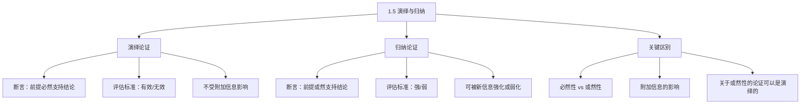

**相关笔记：** [[1.2 命题与论证]] | [[1.4 论证与说明]] | [[1.6 有效性与真实性]]

> [!abstract] 概览
> 本节阐述逻辑学最根本的分类：演绎论证与归纳论证。核心知识点包括：
> - **演绎论证**：断言前提==必然地==支持结论；有效性是其核心评估标准
> - **归纳论证**：断言前提==或然地==支持结论；强度（强/弱）是其评估标准
> - **关键区别**：演绎论证不受附加信息影响；归纳论证可被新信息强化或弱化
> - **演绎逻辑的任务**：区分有效论证和无效论证
> - **归纳逻辑的任务**：确定能够指导行为的事实

---

## 一、知识结构总览



---

## 二、核心思想与证明技巧

> [!tip] 核心思想
> 演绎和归纳的根本区别在于==前提对结论的支持方式==：演绎断言"如果前提为真，结论**不可能**为假"；归纳断言"如果前提为真，结论**很可能**为真"。演绎的结论是必然的，归纳的结论是或然的。

### 关键区别：附加信息的影响

这是理解演绎与归纳差异的最直观方式：

**演绎论证——附加信息无效：**
```
前提1：凡人终有一死
前提2：苏格拉底是人
附加前提：苏格拉底长得很丑  ← 不影响任何东西
结论：苏格拉底终有一死  ← 仍然必然推出
```

**归纳论证——附加信息有效：**
```
前提1：大部分公司法律顾问是保守主义者
前提2：米里亚姆·格拉夫是公司法律顾问
附加前提A：她是 ACLU 官员，而 ACLU 大部分官员不是保守主义者  ← 弱化论证
附加前提B：她是 NRA 官员，而 NRA 大部分官员是保守主义者  ← 强化论证
结论：米里亚姆·格拉夫很可能是保守主义者
```

### 有效性定义（核心公式）

> 一个演绎论证是==有效的==，当且仅当它==不可能==前提为真而结论为假。

**注意**："有效"仅适用于演绎论证，不适用于归纳论证。归纳论证用"强/弱"来评估。

---

## 三、补充理解与易混淆点

### 补充理解

> [!info] 补充1：演绎与归纳的哲学根源——亚里士多德到皮尔士
> **来源：** Aristotle, *Prior Analytics* (350 BCE)；Peirce, C.S. (1878). "Deduction, Induction, and Hypothesis", *Popular Science Monthly*
>
> 演绎与归纳的区分可追溯到亚里士多德。亚里士多德在《前分析篇》中系统化了三段论（演绎推理的核心工具），并在《后分析篇》中讨论了归纳（epagōgē）——从特殊到一般的推理。但亚里士多德认为演绎优于归纳，因为演绎的结论具有必然性。
>
> 现代逻辑学的奠基者皮尔士（C.S. Peirce）在1878年的经典论文中提出了三种推理类型的完整分类：==演绎==（从规则和情形推出结果）、==归纳==（从规则和结果推出情形）、==溯因==（从情形和结果推出规则）。皮尔士的贡献在于将归纳和溯因提升到与演绎平等的认识论地位——它们是科学发现的互补工具，而非演绎的劣等替代品。

> [!info] 补充2：休谟问题——归纳的合理性问题
> **来源：** Hume, D. (1748). *An Enquiry Concerning Human Understanding*, Section IV-V；SEP Stanford Encyclopedia of Philosophy, "The Problem of Induction" 条目
>
> 休谟提出了著名的"归纳问题"：==我们有什么理由相信归纳推理是可靠的？== 所有归纳论证都预设了"未来会像过去一样"（自然齐一性原理），但这个原理本身只能通过归纳来证明——这是一个循环论证。
>
> 这个问题至今没有完全令人满意的解答。Popper 的解决方案是：科学不依赖归纳，而是通过演绎进行"猜想与反驳"（conjectures and refutations）。Copi 在教材中采取实用主义立场：归纳虽然在哲学上有争议，但在实践中不可或缺——医学、天文学、社会科学都依赖归纳方法。

### 易混淆点

> [!warning] 误区：归纳论证就是"从特殊到一般"
> ❌ **错误理解：** 归纳 = 从个别到一般，演绎 = 从一般到个别
> ✅ **正确理解：** 归纳和演绎的区别在于前提对结论的==支持方式==（或然 vs 必然），而非推理的方向。演绎也可以从特殊到特殊（"苏格拉底是人→苏格拉底终有一死"），归纳也可以从一般到一般
> **辨析：** "从特殊到一般"只是归纳的常见形式之一，不是定义性特征

> [!warning] 误区：关于或然性的论证一定是归纳的
> ❌ **错误理解：** 看到"概率"一词就判定是归纳论证
> ✅ **正确理解：** 有些演绎论证是关于或然性本身的。例如：已知掷三次硬币连续三次正面朝上的概率是 1/8，可以==演绎地==推出至少一次背面朝上的概率是 7/8
> **辨析：** 判断标准是"结论是否被断言为必然从前提推出"，而非结论的内容是否涉及或然性

---

## 四、习题精选

> [!todo] 习题概览
> | 题号 | 来源 | 核心考点 | 难度 |
> |:-----|:-----|:---------|:-----|
> | 1 | 自编 | 演绎 vs 归纳的判断 | ⭐ |
> | 2 | 自编 | 附加信息对归纳论证的影响 | ⭐⭐ |

### 题1：判断演绎还是归纳

> [!problem] 题目
> 判断以下论证是演绎还是归纳，并说明理由：
>
> (a) 所有哺乳动物都有肺。所有鲸鱼都是哺乳动物。所以所有鲸鱼都有肺。
> (b) 我见过100只天鹅都是白色的。所以所有天鹅都是白色的。

> [!faq]- 解答
> **[步骤1]** 分析 (a)：断言如果前提为真，结论不可能为假。"所有哺乳动物都有肺"+"所有鲸鱼都是哺乳动物"→"所有鲸鱼都有肺"是必然推出的。因此 (a) 是==演绎论证==。
>
> **[步骤2]** 分析 (b)：断言从已观察的100只白天鹅推出"所有天鹅都是白色"，但这个结论不是必然的——第101只天鹅可能是黑色的。前提只给结论提供了某种程度的或然性支持。因此 (b) 是==归纳论证==。
>
> $\blacksquare$

### 题2：附加信息的影响

> [!problem] 题目
> 考虑以下归纳论证："这家餐厅的菜品一直很好吃，所以今晚去吃也一定好吃。"请给出一个能弱化这个论证的附加前提，和一个能强化这个论证的附加前提。

> [!faq]- 解答
> **[步骤1]** 弱化附加前提："这家餐厅昨天换了主厨，新主厨没有任何经验。"——这个信息大大降低了"今晚好吃"的或然性。
>
> **[步骤2]** 强化附加前提："这家餐厅的主厨刚刚获得了米其林三星评级，而且今晚他亲自掌勺。"——这个信息大大提高了"今晚好吃"的或然性。
>
> **[步骤3]** 这正是归纳论证的本质特征：新信息可以改变结论的或然性程度。如果是演绎论证（如"所有人都会死，苏格拉底是人，所以苏格拉底会死"），无论增加什么附加前提，结论的必然性都不会改变。
>
> $\blacksquare$

---

## 五、视频学习指南

> [!info] 视频资源
> | 资源 | 链接 | 对应内容 | 备注 |
> |:-----|:-----|:---------|:-----|
> | Crash Course Philosophy #2 | [链接](https://www.youtube.com/watch?v=kKmOoY5QaTE) | 归纳推理简介 | 英文，5分钟，生动易懂 |

---

## 六、教材原文

> [!quote] 教材原文
> **来源：** 逻辑学导论 第15版，第1章第5节，第28-35页
>
> **演绎与归纳的定义：**
> 任一演绎论证均断言其前提决定性地支持结论；它断言如果其前提都是真的，其结论一定是真的。相反，归纳论证均没有这种断言。
>
> **有效性的定义：**
> 一个演绎论证是有效的，当且仅当它不可能前提为真而结论为假。
>
> **演绎与归纳的关键区别：**
> 归纳论证的前提对其结论的支持都具有某种程度的或然性，附加的信息就有可能强化或弱化这种或然性。相反，演绎论证却不能越来越好或越来越差。它们在拥有前提和结论之间的必然的、决定性的推论关系上要么成功，要么失败。

---

## 参见 Wiki

- [[演绎论证]] — 演绎论证的定义与性质
- [[归纳论证]] — 归纳论证的定义与性质
- [[演绎论证-vs-归纳论证]] — 两种论证类型的详细对比

#学习/逻辑学/基本概念/演绎
#学习/逻辑学/基本概念/归纳
