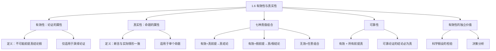

**相关笔记：** [[1.5 演绎论证与归纳论证]] | [[1.2 命题与论证]]

> [!abstract] 概览
> 本节阐明演绎逻辑中最核心的概念区分：有效性（论证的属性）vs 真实性（命题的属性），并引入"可靠性"概念。核心知识点包括：
> - **有效性**：论证的属性——不可能前提真而结论假
> - **真实性**：命题的属性——断言与实际情形一致
> - **七种真值组合**：有效/无效论证 × 真/假前提 × 真/假结论的所有可能
> - **可靠性**：有效 + 所有前提为真 = 结论必然为真
> - **有效性可以独立于真实性确定**：这是逻辑学作为形式科学的基础

---

## 一、知识结构总览

---

## 二、核心思想与证明技巧

> [!tip] 核心思想
> ==有效性和真实性属于不同的范畴==：有效性是论证（前提与结论之间）的关系属性，真实性是单个命题与世界的关系属性。说"一个命题是有效的"或"一个论证是真的"都是无意义的。理解这个区分是学习演绎逻辑的起点。

### 七种真值组合速查表

| 类型 | 前提 | 结论 | 示例 | 说明 |
|:-----|:-----|:-----|:-----|:-----|
| Ⅰ. 有效 | 真 | 真 | 哺乳动物→鲸鱼→有肺 | 最佳情况 |
| Ⅱ. 有效 | 假 | 假 | 四腿生物→蜘蛛→有翅膀 | 有效但结论假（因前提假） |
| Ⅲ. 无效 | 真 | 真 | 有诺克斯→富有→我富有 | 真结论≠有效推理 |
| Ⅳ. 无效 | 真 | 假 | 有诺克斯→富有→盖茨不富有 | ==无效的唯一标志== |
| Ⅴ. 有效 | 假 | 真 | 鱼是哺乳动物→鲸是鱼→鲸是哺乳动物 | 假前提也能推出真结论 |
| Ⅵ. 无效 | 假 | 真 | 哺乳动物有翅膀→鲸有翅膀→鲸是哺乳动物 | 无法从真假判断有效性 |
| Ⅶ. 无效 | 假 | 假 | 哺乳动物有翅膀→鲸有翅膀→哺乳动物是鲸 | |

**关键记忆：**
- 有效论证的唯一不可能组合：**真前提 + 假结论**
- 无效论证：所有组合都可能
- ==不能从结论的真假判断论证的有效性==

### 可靠性（Soundness）

> **可靠论证** = 有效论证 + 所有前提为真

- 可靠论证的结论**必然为真**
- 只有可靠论证才能==建立==其结论的真实性
- 有效但前提有假的论证不能证明结论

---

## 三、补充理解与易混淆点

### 补充理解

> [!info] 补充1：有效性的形式化定义——Tarski 的语义学
> **来源：** Tarski, A. (1936). "On the Concept of Logical Consequence", *Logic, Semantics, Metamathematics*
>
> 现代逻辑学的奠基人塔斯基（Alfred Tarski）给出了"逻辑后承"（logical consequence）的精确形式化定义。塔斯基的定义可以表述为：句子 B 是句子集 A 的逻辑后承，当且仅当 A 的每一个模型（model）都是 B 的模型。这里"模型"指的是使句子为真的可能世界（或解释）。
>
> 这个定义精确地捕捉了 Copi 的直觉性表述"不可能前提真而结论假"：如果不存在任何一个使 A 为真而使 B 为假的可能世界，那么 B 就是 A 的逻辑后承。塔斯基的工作将有效性从直觉概念提升为数学上可操作的概念，是现代逻辑学的里程碑。

> [!info] 补充2：林肯的德雷德·斯科特决议分析——有效性与政治论证
> **来源：** 教材第37-39页；Fehrenbacher, D.E. (2001). *Slave and Citizen: The Negro in the Americas*. Vol. 2
>
> 教材引用了林肯1858年对德雷德·斯科特决议的精彩分析。林肯指出该决议的论证是==有效的==（如果前提为真，结论必然推出），但==第二个前提是假的==（美国宪法并未清楚规定对奴隶的财产权）。
>
> 林肯的逻辑洞察极为深刻：他区分了"推理的正确性"和"前提的真实性"。即使推理完全正确（有效），如果前提为假，结论也得不到证明。这一区分在政治和法律论证中至关重要——许多政治争议的核心不是"推理是否有错"，而是"某个前提是否为真"。

### 易混淆点

> [!warning] 误区：有效论证的结论一定为真
> ❌ **错误理解：** 有效 = 结论为真
> ✅ **正确理解：** 有效只保证"如果前提为真，结论不可能为假"。但前提本身可能为假，此时结论可以为假（例Ⅱ）。只有==可靠论证==（有效 + 前提全真）才能保证结论为真
> **辨析：** 有效性是必要条件，不是充分条件。结论为真还需要前提为真

> [!warning] 误区：结论为假说明论证无效
> ❌ **错误理解：** 结论假 → 论证无效
> ✅ **正确理解：** 结论假有两种可能——论证无效（例Ⅳ、Ⅶ），或论证有效但前提有假（例Ⅱ）。不能仅凭结论为假判断有效性
> **辨析：** 要判断有效性，必须检查"如果前提为真，结论是否必然为真"，而不是直接看结论的真假

> [!warning] 误区：结论为真说明论证有效
> ❌ **错误理解：** 结论真 → 论证有效
> ✅ **正确理解：** 结论为真的论证既可能是有效的（例Ⅰ、Ⅴ），也可能是无效的（例Ⅲ、Ⅵ）。==结论的真假与论证的有效性完全独立==
> **辨析：** 真结论可能由假前提"碰巧"推出（例Ⅴ），也可能由无效推理"碰巧"得出（例Ⅲ）

---

## 四、习题精选

> [!todo] 习题概览
> | 题号 | 来源 | 核心考点 | 难度 |
> |:-----|:-----|:---------|:-----|
> | 1 | 教材习题 | 构建特定真值组合的论证 | ⭐⭐ |
> | 2 | 自编 | 有效性 vs 可靠性的区分 | ⭐⭐ |

### 题1：构建论证

> [!problem] 题目
> 请构建一个包含两个真前提和一个假结论的==无效==论证。

> [!faq]- 解答
> **[步骤1]** 选择一个无效的论证形式——"否定前件"谬误：
> 形式：如果 P 那么 Q。非 P。∴ 非 Q。
>
> **[步骤2]** 代入真命题使前提为真：
> - 前提1（真）：如果一个人是法国总统，那么他住在欧洲。
> - 前提2（真）：我不是法国总统。
> - 结论（假）：所以我不住在欧洲。
>
> **[步骤3]** 验证：前提1为真（法国总统确实住在欧洲），前提2为真（我不是法国总统），但结论为假（我可能住在欧洲的其他地方）。这是无效论证，因为它犯了"否定前件"的形式错误——"如果P那么Q"不等于"只有P才Q"。
>
> $\blacksquare$

### 题2：有效性 vs 可靠性

> [!problem] 题目
> "所有鸟都会飞。企鹅是鸟。所以企鹅会飞。"请分析这个论证的有效性和可靠性。

> [!faq]- 解答
> **[步骤1]** 分析有效性：如果"所有鸟都会飞"和"企鹅是鸟"都为真，那么"企鹅会飞"必然为真。这是一个有效的演绎论证（全称三段论，Barbara 式）。
>
> **[步骤2]** 分析前提真实性：
> - 前提1"所有鸟都会飞"——==假==（企鹅、鸵鸟等不会飞）
> - 前提2"企鹅是鸟"——==真==
>
> **[步骤3]** 判断可靠性：论证是有效的，但并非所有前提都为真（前提1为假），因此==不是可靠论证==。结论"企鹅会飞"虽然碰巧为假，但即使结论为真，这个论证也不可靠——因为可靠性的定义要求所有前提为真。
>
> **[步骤4]** 核心教训：有效但不可靠的论证不能建立其结论的真实性。这个例子也说明，有效论证的结论可以为假（当有假前提时）。
>
> $\blacksquare$

---

## 五、视频学习指南

> [!info] 视频资源
> | 资源 | 链接 | 对应内容 | 备注 |
> |:-----|:-----|:---------|:-----|
> | Crash Course Philosophy #2 | [链接](https://www.youtube.com/watch?v=kKmOoY5QaTE) | 有效性与真实性 | 英文，配合1.5节一起看 |

---

## 六、教材原文

> [!quote] 教材原文
> **来源：** 逻辑学导论 第15版，第1章第6节，第36-45页
>
> **有效性与真实性的根本区分：**
> 真和假都是单个命题的特征。有效性和无效性是论证的属性。真（或假）命题与有效（或无效）论证之间的关系既很复杂也很重要，处于演绎逻辑的中心地位。
>
> **有效性的定义：**
> 一个演绎论证是有效的，当且仅当它不可能有真前提和假结论——当且仅当其结论是从其前提逻辑必然地推出的。
>
> **可靠性的定义：**
> 若一个论证有效，并且其所有前提都为真，我们就称它为可靠的论证。很显然，一个可靠论证的结论一定是真的——并且只有可靠的论证才能建立其结论的真实性。
>
> **林肯的逻辑洞察：**
> 我相信这个论证挑不出什么毛病。假设其前提都是真的，从这些前提必然会推出上述结论。但我认为其中确有一个毛病，这毛病不在于推理，而在于其中有一个前提是错误的。

---

## 参见 Wiki

- [[有效性]] — 有效性的定义与七种真值组合
- [[可靠性]] — 可靠性的定义与保真性
- [[有效性-vs-可靠性]] — 两个概念的对比分析

#学习/逻辑学/基本概念/有效性
#学习/逻辑学/基本概念/真实性
