# 第01章 逻辑学的基本概念 — 章节汇总

---

## 一、全章知识框架

```mermaid
graph TB
    A["第1章 逻辑学的基本概念"] --> B["1.1 什么是逻辑学"]
    A --> C["1.2 命题与论证"]
    A --> D["1.3 论证的辨识"]
    A --> E["1.4 论证与说明"]
    A --> F["1.5 演绎论证与归纳论证"]
    A --> G["1.6 有效性与真实性"]

    B --> B1["定义：区分正确推理与不正确推理"]
    B --> B2["研究对象：推理"]
    B --> B3["推理是唯一可信赖的基础"]

    C --> C1["命题：或真或假的断定"]
    C --> C2["命题 vs 语句"]
    C --> C3["复合命题：合取/析取/假言"]
    C --> C4["论证：前提→结论"]
    C --> C5["论证 vs 假言命题"]

    D --> D1["结论指示词/前提指示词"]
    D --> D2["语境辨识"]
    D --> D3["非陈述形式：反问句/祈使句"]
    D --> D4["省略式论证"]

    E --> E1["论证：确立 Q 的真"]
    E --> E2["说明：解释 Q 为何为真"]
    E --> E3["区分关键：Q 的认识论地位"]

    F --> F1["演绎：前提必然支持结论"]
    F --> F2["归纳：前提或然支持结论"]
    F --> F3["有效性 vs 强度"]
    F --> F4["附加信息的影响差异"]

    G --> G1["有效性：论证的属性"]
    G --> G2["真实性：命题的属性"]
    G --> G3["可靠性：有效 + 前提全真"]
    G --> G4["七种真值组合"]
```

---

## 二、核心知识点与重点公式汇总

### 1.1 什么是逻辑学

> [!def] 逻辑学的定义
> 逻辑学是研究用于==区分正确推理与不正确推理==的方法和原理的学问。

- 研究对象：推理（reasoning）
- 研究目标：区分正确推理与不正确推理
- 核心问题：结论是否从前提推出？
- 推理是唯一可完全信赖的判断基础

### 1.2 命题与论证

> [!def] 命题
> 命题是推理的构建基块。一个命题断定事情是如此这般或者不是如此这般。==每个命题都或真或假==。

> [!def] 论证
> 论证是从一个或多个命题（前提）推出一个命题（结论）的推论。

- **命题 vs 语句**：命题是跨语言的内容，语句是语言层面的表达
- **复合命题三类型**：
  - 合取（并且）→ 断定所有分支
  - 析取（或者）→ 不断定任何分支
  - 假言（如果-那么）→ 不断定任何分支
- **论证 vs 假言命题**：论证有推论（断定前提和结论），假言命题只断定蕴涵关系

### 1.3 论证的辨识

- **结论指示词**：therefore, hence, thus, so, 因此, 所以
- **前提指示词**：because, since, for, 因为, 由于
- **非陈述形式**：反问句（暗示答案）、祈使句（重塑为陈述）、短语（实质清楚即可）
- **省略式论证**：隐含前提需要先重构再评估

### 1.4 论证与说明

> [!def] 区分标准
> 如果 Q 的真实性==需要被建立或确证== → "Q 因为 P" 是**论证**
> 如果 Q ==已知为真==，P 解释为什么 Q 为真 → "Q 因为 P" 是**说明**

- 被说明者（explanandum）= Q；说明者（explanans）= P
- 同一语段可能有双重解读

### 1.5 演绎论证与归纳论证

> [!def] 有效性
> 一个演绎论证是==有效的==，当且仅当它==不可能==前提为真而结论为假。

| 维度 | 演绎论证 | 归纳论证 |
|:-----|:---------|:---------|
| 断言 | 前提**必然**支持结论 | 前提**或然**支持结论 |
| 评估标准 | 有效 / 无效 | 强 / 弱 |
| 附加信息 | 不受影响 | 可强化或弱化 |
| 结论 | 必然得出 | 永远不能完全确定 |

### 1.6 有效性与真实性

> [!def] 可靠性
> ==可靠论证== = 有效论证 + 所有前提为真。可靠论证的结论**必然为真**。

| 属性 | 适用对象 | 定义 |
|:-----|:---------|:-----|
| 真/假 | 单个命题 | 断言与实际情形一致/不一致 |
| 有效/无效 | 演绎论证 | 不可能前提真而结论假 |
| 可靠/不可靠 | 演绎论证 | 有效 + 所有前提为真 |

**七种真值组合关键记忆**：
- 有效论证的唯一不可能组合：**真前提 + 假结论**
- 不能从结论的真假判断论证的有效性

---

## 三、章节学习脉络

> [!info] 学习逻辑
> 本章的学习路径是从"宏观定位"到"微观工具"：
>
> 1. **定位**（1.1）：逻辑学是什么？→ 建立学科认知
> 2. **基块**（1.2）：命题和论证是什么？→ 掌握基本构件
> 3. **工具**（1.3-1.4）：如何辨识论证？如何区分论证和说明？→ 获得分析能力
> 4. **分类**（1.5）：演绎 vs 归纳 → 建立评估框架
> 5. **标准**（1.6）：有效性、真实性、可靠性 → 确立质量判定标准
>
> **学习建议**：第1章是全书的"地基"。后续所有内容（第2-7章的非形式逻辑、第8-10章的形式逻辑）都建立在本章的概念之上。特别要深入理解"有效性"概念——它是演绎逻辑的核心。

---

## 四、跨章关联

| 本章概念 | 关联章节 | 关联类型 | 说明 |
|:---------|:---------|:---------|:-----|
| 论证的结构（前提→结论） | [[第02章_论证的分析-章节汇总]] | 前置依赖 | 第2章深入分析论证的图解方法 |
| 省略式论证 | [[第02章_论证的分析-章节汇总]] | 前置依赖 | 第2章讨论隐含前提的识别 |
| 论证 vs 说明 | [[第02章_论证的分析-章节汇总]] | 前置依赖 | 第2章进一步讨论复杂论证的解析 |
| 命题、假言命题 | [[第08章_命题逻辑Ⅰ-章节汇总|第08章 命题逻辑Ⅰ]] | 前置依赖 | 第8章将命题形式化为符号系统 |
| 演绎论证、有效性 | [[第09章_命题逻辑Ⅱ-章节汇总|第09章 命题逻辑Ⅱ]] | 前置依赖 | 第9章构建完整的自然演绎系统 |
| 谓词、量词 | [[第10章_谓词逻辑-章节汇总|第10章 谓词逻辑]] | 前置依赖 | 第10章将谓词逻辑形式化 |
| 归纳论证 | [[第11章_类比推理-章节汇总|第11章 类比推理]]、[[第12章_因果推理-章节汇总|第12章 因果推理]] | 前置依赖 | 第11-12章展开归纳方法 |
| 或然性 | [[第14章_概率-章节汇总|第14章 概率]] | 前置依赖 | 第14章量化归纳结论的或然性 |
| 命题 | [[离散数学/notes/第01章_逻辑学的基本概念/1.1 什么是逻辑学]] | 跨学科关联 | Rosen 第1章与 Copi 第8-10章有内容重叠 |

---

## 五、全章总复习题

> [!problem] 综合题1：概念辨析
> 请用自己的话解释以下三对概念的区别，每对举一个例子：
> (a) 命题 vs 语句
> (b) 论证 vs 假言命题
> (c) 有效性 vs 可靠性

> [!faq]- 参考答案
> (a) 命题是语句所断定的内容（跨语言），语句是语言层面的表达。例："It rains" 和 "下雨了" 是两个语句但表达同一个命题。
>
> (b) 论证断定前提为真并推出结论；假言命题只断定蕴涵关系。例：论证——"天下雨了，所以地湿了"；假言命题——"如果天下雨，那么地会湿"。
>
> (c) 有效性是论证的形式属性（不可能前提真结论假）；可靠性是有效性+前提全真。例：有效但不可靠——"所有鸟会飞。企鹅是鸟。所以企鹅会飞。"（有效但前提1为假）。
>
> $\blacksquare$

> [!problem] 综合题2：论证分析
> "如果所有有效的论证都有真结论，那么逻辑学就是无用的学科。但有些有效论证的结论是假的（例如从假前提推出的有效论证）。因此，逻辑学不是无用的学科。"（自编）
>
> 请识别这段话中的前提和结论，判断它是演绎还是归纳，并评估其有效性。

> [!faq]- 参考答案
> **[步骤1]** 识别结构：
> - 前提1（假言命题）：如果所有有效的论证都有真结论，那么逻辑学就是无用的学科。
> - 前提2：有些有效论证的结论是假的。
> - 隐含前提：如果有些有效论证的结论是假的，那么"所有有效的论证都有真结论"为假。
> - 中间结论："所有有效的论证都有真结论"为假。
> - 最终结论：逻辑学不是无用的学科。
>
> **[步骤2]** 判断类型：这是一个==演绎论证==——它断言结论必然从前提推出。
>
> **[步骤3]** 评估有效性：如果前提1为真且前提2为真，那么"所有有效论证都有真结论"为假（由前提2），因此前提1的前件为假，从而前提1整个为真（假言命题前件假则整个为真）。但从前提到结论的推导并不完全严密——这里需要更多步骤来形式化。实际上这个论证的有效性取决于隐含前提是否成立。
>
> $\blacksquare$

---

## 六、各节笔记索引

| 节号 | 标题 | 笔记链接 | 核心内容 |
|:-----|:-----|:---------|:---------|
| 1.1 | 什么是逻辑学 | [[1.1 什么是逻辑学]] | 逻辑学的定义、推理的核心问题、推理与其他支持方式 |
| 1.2 | 命题与论证 | [[1.2 命题与论证]] | 命题的二值性、命题vs语句、复合命题三类型、论证结构、论证vs假言命题 |
| 1.3 | 论证的辨识 | [[1.3 论证的辨识]] | 指示词、语境辨识、非陈述形式、省略式论证 |
| 1.4 | 论证与说明 | [[1.4 论证与说明]] | "Q因为P"的双重功能、区分标准、被说明者与说明者 |
| 1.5 | 演绎论证与归纳论证 | [[1.5 演绎论证与归纳论证]] | 必然vs或然、有效性定义、附加信息的影响、休谟问题 |
| 1.6 | 有效性与真实性 | [[1.6 有效性与真实性]] | 七种真值组合、可靠性定义、有效性独立价值、Tarski形式化 |

#学习/逻辑学/第01章/章节汇总
