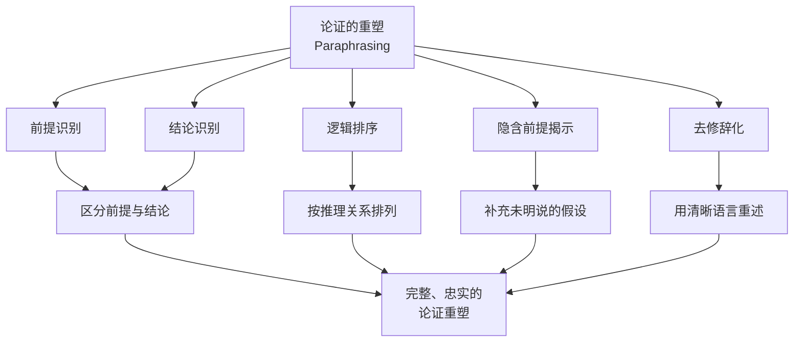

**相关笔记：** [[1.6 有效性与真实性]] | [[2.2 论证的图示]] | [[第02章_论证的分析-章节汇总]]

> [!abstract] 概览
> 本节系统阐述论证分析中最基础也最重要的技法——论证的重塑（Paraphrasing）。核心知识点包括：
> - **重塑的定义**：用清楚的语言和逻辑顺序表明论证中的命题，是分析复杂论证最常用、最有用的技法
> - **重塑的注意事项**：确保所提出的重塑正确并完全地表达了被分析的论证，不能遗漏前提，也不能歪曲原意
> - **日常论证的复杂性**：前提数量繁多、顺序杂乱、可能存在冗余或用词重复、前提意义不清晰
> - **隐含前提的揭示**：许多论证中存在未明确陈述但为论证成立所必需的前提
> - **哈代示例**：通过哈代《一个数学家的辩白》中的论证，展示了重塑如何揭示隐藏的6个前提和1个结论

---

## 一、知识结构总览

---

## 二、核心思想与证明技巧

> [!tip] 重塑的核心思想：忠实性原则与清晰性原则
>
> 重塑（paraphrase）是论证分析中最基础也最重要的技法。它的核心思想可以概括为两条基本原则：
>
> **一、忠实性原则（Faithfulness）**
>
> 重塑后的论证必须 ==正确并完全地== 表达被分析的论证。这意味着：
> - 不能遗漏任何实质性前提；
> - 不能歪曲原论证的含义；
> - 不能添加原作者未承诺的命题；
> - 重塑后的论证与原论证必须具有相同的逻辑效力。
>
> **二、清晰性原则（Clarity）**
>
> 重塑后的论证必须用清楚的语言和逻辑顺序来呈现。这意味着：
> - 消除歧义和模糊表述；
> - 将杂乱无章的前提按照推理关系重新排列；
> - 去除冗余和重复；
> - 使前提与结论之间的关系一目了然。
>
> 这两条原则之间存在张力：追求清晰性时可能偏离原意，追求忠实性时可能保留模糊。好的重塑需要在这两者之间取得平衡。

---

## 三、补充理解与易混淆点

### 补充理解

> [!info] 补充1：图尔敏论证模型——论证重构的结构化框架
> **来源：** Toulmin, S. E. (1958). *The Uses of Argument*. Cambridge University Press
>
> 图尔敏提出了一种不同于传统三段论的论证结构模型，包含六个要素：
>
> | 要素 | 英文 | 说明 |
> |------|------|------|
> | 主张 | Claim (C) | 论证所要证明的结论 |
> | 数据 | Data/Grounds (G) | 支持主张的事实依据 |
> | 担保 | Warrant (W) | 从数据推导主张的授权规则 |
> | 支撑 | Backing (B) | 为担保提供进一步的支持 |
> | 限定 | Qualifier (Q) | 表达主张的确定程度（如"可能"、"必然"） |
> | 反驳 | Rebuttal (R) | 指出在何种条件下主张不成立 |
>
> 图尔敏模型为论证重构提供了一个结构化框架。当我们重塑一个日常论证时，可以按照图尔敏的六个要素来拆解论证结构，尤其有助于识别论证中的 ==隐含担保（implicit warrant）==——即那些未明说但连接前提与结论的推理规则。例如，在"天下雨了，所以地面湿了"这个论证中，"天下雨"是数据，"地面湿了"是主张，而隐含的担保是"下雨会导致地面变湿"。
>
> 图尔敏还强调论证的 ==场域依赖性（field-dependence）==：不同领域（法律、科学、伦理等）中的论证具有不同的担保标准和评估准则，重塑时需要注意论证所处的场域。

> [!info] 补充2：语用辩证法的自由化重构——论证重构的方法论框架
> **来源：** van Eemeren, F. H., & Grootendorst, R. (2004). *A Systematic Theory of Argumentation: The Pragma-Dialectical Approach*. Cambridge University Press
>
> 语用辩证法将论证重构视为 ==批判性讨论（critical discussion）== 的一部分，提出了一系列"自由化重构"规则，主要包括：
> 1. **完整化规则**：将论证中隐含的、为论证成立所必需的元素补充完整；
> 2. **明确化规则**：消除歧义和模糊表述，使论证中的每个命题都有明确的意义；
> 3. **统一化规则**：将论证中用不同表述方式表达的同一命题统一为一个命题；
> 4. **合理化规则**：按照逻辑推理关系重新排列论证中的命题顺序；
> 5. **简化规则**：去除论证中的冗余和重复内容。
>
> 语用辩证法的自由化重构规则为教材中"重塑"技法提供了更精细的方法论指导。教材中提到的"前提可能数量繁多并且顺序杂乱无章"、"前提也可能很累赘，或者通过使用不同的词被重复"等问题，正是自由化重构规则所要解决的。语用辩证法特别强调，重构的目的不仅仅是使论证更清晰，更重要的是为 ==理性地评判论证== 创造条件。

### 易混淆点

| 比较维度 | 重塑（Paraphrase） | 改写（Rewrite） |
|----------|-------------------|-----------------|
| **目的** | 澄清论证的逻辑结构 | 改变文本的表达方式 |
| **忠实性要求** | ==必须忠实原意==，不能改变论证的含义 | 可以改变含义、增删内容 |
| **操作对象** | 论证中的命题及其逻辑关系 | 文本的语言表达 |
| **评价标准** | 是否正确且完整地表达了原论证 | 是否通顺、优美、符合目标风格 |
| **典型用途** | 逻辑分析、论证评价 | 写作润色、翻译、简化 |

> [!warning] 关键区分
> 重塑不是改写。重塑的唯一目标是 ==公正地呈现原论证的逻辑结构==，为评价论证的有效性做准备。如果重塑过程中改变了原论证的含义，那么后续的评价就不再是针对原论证，而是针对一个被歪曲的版本，这是毫无意义的。

---

## 四、习题精选

> [!todo] 习题概览
> | 题号 | 来源 | 核心考点 | 难度 |
> |:-----|:-----|:---------|:-----|
> | 1 | 教材示例 | 论证重塑的标准形式 | ⭐⭐ |
> | 2 | 自编 | 隐含前提的识别 | ⭐⭐ |

### 题1：重塑哈代的论证

> [!problem] 题1：重塑哈代的论证
>
> 以下段落摘自哈代（G. H. Hardy）《一个数学家的辩白》：
>
> "阿基米德将被永记而埃斯库罗斯会被遗忘，因为语言会死亡而数学理念不会。'种族'可能会灭亡，但像 $\pi$ 这样的数学理念不会。一个数学家所创造的持久的东西比他所做的事情多得多。诗人所创造的东西可能比他所做的事情更持久，但远不如数学家所创造的持久。"
>
> **任务：** 将上述论证重塑为标准形式，列出所有前提和结论。

> [!faq]- 解答
> **[步骤1]** 识别前提和结论。逐句分析哈代的论证，提取其中的命题。
>
> **[步骤2]** 整理论证结构：
>
> 前提1：语言会死亡。
> 前提2：数学理念不会消亡。
> 前提3：埃斯库罗斯的成就是语言艺术（文学）。
> 前提4：阿基米德的成就是数学。
> 前提5：（由前提1-4推出）埃斯库罗斯的成就（语言）会死亡，而阿基米德的成就（数学理念）不会消亡。
> 前提6：（隐含的价值前提）被永记比被遗忘更好。
> ∴ 结论：阿基米德将被永记而埃斯库罗斯会被遗忘。
>
> **[步骤3]** 分析论证层次：哈代的论证实际上包含多个层次。前提1和前提2建立了"语言会死、数学不朽"这一基本对比；前提3和前提4将两位历史人物分别归入语言和数学两个阵营；前提5是中间结论，由前提1-4推出；前提6是一个隐含的价值判断，即"被永记优于被遗忘"；最终结论由前提5和前提6共同推出。这个重塑揭示了原论证中隐含的分类假设和价值判断。
>
> $\blacksquare$

### 题2：重塑日常论证

> [!problem] 题2：重塑日常论证
>
> 以下是一段关于大学生写作的论证：
>
> "现在的大学生写作能力越来越差了。看看他们交上来的论文就知道了，满篇都是语法错误和逻辑不通的句子。而且，很多教授都在抱怨学生的写作水平下降。这肯定是因为他们平时太依赖手机和社交媒体，很少进行正式的写作练习。"
>
> **任务：** 将上述论证重塑为标准形式，列出所有前提和结论，并指出其中可能存在的隐含前提。

> [!faq]- 解答
> **[步骤1]** 逐句分析，提取论证中的命题。
>
> **[步骤2]** 整理论证结构：
>
> 前提1：大学生交上来的论文中满篇都是语法错误和逻辑不通的句子。（经验前提）
> 前提2：很多教授都在抱怨学生的写作水平下降。（权威证言前提）
> 前提3：大学生平时太依赖手机和社交媒体，很少进行正式的写作练习。（因果前提）
> 前提4：（隐含前提）依赖手机和社交媒体、缺乏正式写作练习会导致写作能力下降。
> 前提5：（隐含前提）论文中的语法错误和逻辑不通可以衡量写作能力。
> ∴ 结论：现在的大学生写作能力越来越差了。
>
> **[步骤3]** 分析隐含前提：这个论证在日常生活中很常见。重塑后可以清楚地看到，论证中存在两个隐含前提：一个是连接"手机/社交媒体使用"与"写作能力下降"的因果假设（前提4），另一个是将"论文质量"作为"写作能力"指标的前提（前提5）。这两个隐含前提都是论证成立所必需的，但原文并未明确陈述。此外，这个论证的有效性也值得审视——前提3是否是写作能力下降的真正原因，还是仅仅是一种相关性观察？重塑后的清晰结构使我们能够更有针对性地评价论证。
>
> $\blacksquare$

---

## 五、视频学习指南

> [!info] 推荐学习资源
>
> | 资源名称 | 类型 | 语言 | 说明 |
> |----------|------|------|------|
> | 暂无推荐资源 | — | — | 后续补充 |

---

## 六、教材原文

> [!quote] 教材原文摘录
>
> 以下段落摘自 Copi, Cohen & McMahon *Introduction to Logic*（第15版）第2章第1节，涉及美国最高法院关于得州同性性行为法案的判决（肯尼迪法官意见）：
>
> "本法院的先例已经确认，对自愿发生在成人之间的同性性行为进行刑事惩罚不是一项正当的州利益，这暗示了成年人有权选择自己的私人生活。原告有权在其私人生活中受到尊重并保持尊严。得州法案将这种行为定为犯罪，但该行为并未对任何人造成伤害，也没有威胁到公共安全。因此，得州法案侵犯了原告的隐私权，违反了第十四修正案的正当程序条款。"
>
> **重塑为标准形式：**
>
> 1. 本法院的先例确认，对自愿发生在成人之间的同性性行为进行刑事惩罚不是一项正当的州利益。
> 2. 原告有权在其私人生活中受到尊重并保持尊严。
> 3. 得州法案所惩罚的行为是自愿发生在成人之间的行为，未对任何人造成伤害，也没有威胁到公共安全。
> 4. 第十四修正案的正当程序条款保护公民的隐私权。
> 5. **结论：** 得州法案侵犯了原告的隐私权，因而是违宪的。

---

---

## 参见 Wiki

- [[重塑]] — 重塑的定义与核心原则
- [[隐含前提]] — 隐含前提的揭示方法
- [[重塑-vs-图示]] — 重塑与图示的对比

#学习/逻辑学/论证分析/重塑
