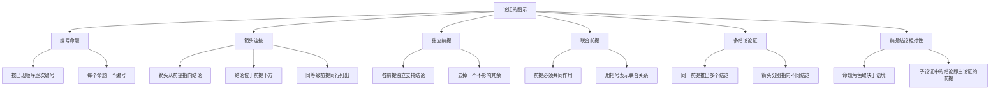

**相关笔记：** [[2.1 论证的重塑]] | [[2.3 复杂的论证性语段]] | [[第02章_论证的分析-章节汇总]]

> [!abstract] 概览
> 本节介绍论证的图示分析法，核心知识点包括：
> - **图示法基本步骤**：给论证中每一个命题逐次赋予圆圈中的数字编号，再用箭头展示前提与结论的逻辑关联
> - **编号约定**：按命题在论证中出现的顺序依次编号
> - **箭头方向约定**：箭头从前提指向结论；结论总是出现在支持它的前提的下方；同等级的前提在图上的同一行列出
> - **独立前提**：每个前提单独为结论提供支持，去掉其中一个不影响其余前提对结论的支持
> - **联合前提**：多个前提必须共同作用才能支持结论，去掉任何一个都会导致支持链条断裂
> - **多结论论证**：同一组前提可以推出多个不同的结论
> - **前提/结论的相对性**：同一命题在一个论证中可以做结论，在另一个论证中可以做前提

---

## 一、知识结构总览



---

## 二、核心思想与证明技巧

> [!tip] 核心思想
> 图示法（argument diagramming）是一种将论证结构可视化的分析方法。与[[2.1 论证的重塑]]中介绍的"重塑法"不同，图示法不改变论证的原始措辞，而是通过编号和箭头在二维平面上直观展示前提与结论之间的逻辑关联。
>
> **简单论证**不需要图示，但图示法能帮助理解。对于==前提以各种方式纠缠在一起的复杂论证==，图示法特别有用。它的核心优势在于：
> 1. **直观性**：一目了然地展示论证的整体结构
> 2. **精确性**：明确区分独立前提与联合前提的关系
> 3. **分析力**：帮助识别论证中的子论证结构（即"前提支持前提"的嵌套关系）
> 4. **诊断性**：快速定位论证结构中的薄弱环节

---

## 三、补充理解与易混淆点

### 补充1：Walton 的收敛论证与串联论证区分

> [!info] 补充1：收敛论证与串联论证的理论基础
> **来源：** Walton, D. (2006). *Fundamentals of Critical Argumentation*. Cambridge University Press
>
> Douglas Walton 系统论述了论证图示的理论基础，并提出了两种基本论证结构的区分：
>
> - **收敛论证（Convergent Argument）**：多个前提各自独立地支持同一个结论。每个前提都提供了一条单独的推理路线，即使去掉其中一个前提，其余前提仍然能够为结论提供一定程度的支持。图示中表现为多条独立的箭头从不同前提指向同一个结论：
>   ```
>   ① ———→ ③
>   ② ———→ ③
>   ```
>   例如："这座桥不安全。第一，它的桥墩出现了裂缝；第二，它的承重设计低于现行标准。" 两个理由各自独立地支持"不安全"的结论。
>
> - **串联论证（Linked/Serial Argument）**：多个前提必须相互配合、共同作用才能支持结论。前提之间相互依赖，缺少任何一个都会导致推理链条断裂。图示中通常用括号将联合前提归为一组，再由一条箭头指向结论：
>   ```
>   (① + ②) ———→ ③
>   ```
>   例如："所有哺乳动物都是恒温动物。鲸鱼是哺乳动物。所以鲸鱼是恒温动物。" 两个前提必须联合使用才能推出结论。
>
> Walton 指出，==正确区分收敛论证与串联论证是论证分析中最关键也最困难的步骤之一==，因为自然语言论证往往不会明确标注前提之间的关系类型。

### 补充2：论证图示的教育应用研究

> [!info] 补充2：论证图示的教育应用研究
> **来源：** Kirschner, P. A., et al. (2003). *Argumentation in Education*
>
> 研究表明：
>
> - 论证图示作为一种==外部可视化工具==（external visualization tool），能够显著提升学习者的批判性思维能力
> - 通过将隐含的推理结构显性化，图示法帮助学习者识别论证中的逻辑漏洞和未言明的假设
> - 在教学实验中，使用论证图示的学生在论证分析和论证构造任务中的表现显著优于未使用图示的学生
> - 研究还发现，论证图示特别有助于处理==多前提、多层次==的复杂论证，与 Copi 教材中强调的"图示法对复杂论证特别有用"这一观点完全吻合

### 易混淆点：独立前提与联合前提的判断标准

| 判断方法 | 操作步骤 | 判定结果 |
|---------|---------|---------|
| **去掉法** | 假设去掉前提 A，看剩余前提是否仍然支持结论 | 如果仍能支持 → A 是**独立前提**；如果不能支持 → A 与其他前提是**联合前提** |
| **意义检验法** | 检查各前提是否各自独立地与结论相关联 | 如果每个前提都独立与结论相关 → **独立前提**；如果单个前提与结论没有直接的独立关联 → **联合前提** |

> [!warning] 注意
> 在实际分析中，有些论证的前提关系可能介于独立与联合之间，存在模糊地带。此时需要根据论证的语境和论证者的意图进行判断。

---

## 四、习题精选

> [!todo] 习题概览
> | 题号 | 来源 | 核心考点 | 难度 |
> |:-----|:-----|:---------|:-----|
> | 1 | 教材练习题 | 独立前提的图示 | ⭐⭐ |
> | 2 | 教材练习题 | 串联论证的图示 | ⭐⭐⭐ |

### 题1：图示一个简单论证

**题目：** 分析以下论证的结构，并做出图示。

> 因为互联网过滤程序会阻止学生获取合法的研究资料，而且这些程序并不能有效阻止学生接触不当内容，所以学校不应该在图书馆电脑上安装互联网过滤程序。

**解题思路提示：**
1. 首先识别论证中有几个命题
2. 判断哪些是前提，哪个是结论
3. 分析前提之间是独立关系还是联合关系
4. 按约定画出图示

> [!faq]- 解答
> **[步骤1]** 识别论证中的命题：
> - ① 互联网过滤程序会阻止学生获取合法的研究资料
> - ② 这些程序并不能有效阻止学生接触不当内容
> - ③ 学校不应该在图书馆电脑上安装互联网过滤程序
>
> **[步骤2]** 判断前提与结论：其中 ① 和 ② 是前提，③ 是结论。
>
> **[步骤3]** 分析前提关系：两个前提各自独立地提供了反对安装过滤程序的理由——即使只有一个理由成立，也足以支持结论。因此这是==独立前提==的结构。
>
> **[步骤4]** 图示：
> ```
> ① ———→ ③
> ② ———→ ③
> ```
>
> $\blacksquare$

---

### 题2：图示一个多结论论证

**题目：** 分析以下论证的结构，并做出图示。

> 君主必须同时被人民爱戴和被人民畏惧。如果君主必须在两者之间取舍，那么被畏惧比被爱戴更安全。因为人们通常忘恩负义、反复无常，他们在危难时承诺忠诚，但在危难解除后就背叛你。

**解题思路提示：**
1. 识别所有命题并编号
2. 注意哪些命题支持哪些命题——这里存在子论证结构
3. 识别最终结论和中间结论
4. 画出完整的图示，注意箭头的层级关系

> [!faq]- 解答
> **[步骤1]** 识别论证中的命题：
> - ① 人们通常忘恩负义、反复无常，他们在危难时承诺忠诚，但在危难解除后就背叛你
> - ② 如果君主必须在被爱戴和被畏惧之间取舍，那么被畏惧比被爱戴更安全
> - ③ 君主必须同时被人民爱戴和被人民畏惧
>
> **[步骤2]** 分析逻辑关系：
> - ① 是前提，它支持 ②（因为人的本性不可靠，所以仅靠爱戴不够安全，被畏惧更可靠）
> - ② 是一个中间结论（由 ① 推出），同时 ② 又作为前提支持最终结论 ③
> - ③ 是最终结论
>
> **[步骤3]** 图示：
> ```
> ① ———→ ② ———→ ③
> ```
>
> 这是一个典型的==串联论证==（前提支持前提的嵌套结构）。命题 ① 是基础前提，命题 ② 既是 ① 的结论，又是 ③ 的前提，体现了[[论证|前提结论的相对性]]。
>
> $\blacksquare$

---

## 五、视频学习指南

> [!info] 推荐学习资源
> 暂无推荐视频资源。建议结合教材中的练习题进行巩固训练，重点练习区分独立前提与联合前提的判断。

---

## 六、教材原文

> [!quote] 洛克《政府论》论证段落
> "立法机关不能把制定法律的权力转让给任何其他人。因为立法机关是由社会授予的，它只是社会的受托人，不能把人民未曾授予的权力转让给他人。人民只授权立法机关制定法律，而没有授权它把立法权转让给别人。因此，立法机关不能将立法权转让。"
>
> —— John Locke, *Second Treatise of Government*, §141
>
> **图示分析：**
> ```
> ① ———→ ② ———→ ③
> ```
> - ① 立法机关是由社会授予的，它只是社会的受托人，不能把人民未曾授予的权力转让给他人
> - ② 人民只授权立法机关制定法律，而没有授权它把立法权转让给别人
> - ③ 立法机关不能把制定法律的权力转让给任何其他人
>
> 这是一个串联论证：前提 ① 支持中间结论 ②，中间结论 ② 再支持最终结论 ③。

---

---

## 参见 Wiki

- [[论证的图示]] — 图示法的定义与约定
- [[独立前提]] — 独立前提的判断标准
- [[独立前提-vs-联合前提]] — 独立前提与联合前提的对比

#学习/逻辑学/论证分析/图示法
