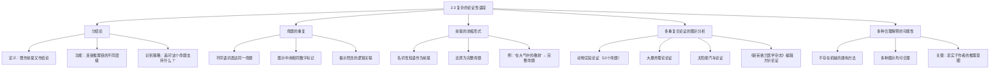

**相关笔记：** [[2.2 论证的图示]] | [[2.4 推理中的问题]] | [[第02章_论证的分析-章节汇总]]

> [!abstract] 概览
> 本节讨论如何分析由多个论证多重复合而成的复杂论证性语段。核心知识点包括：
> - **分结论（sub-conclusion）**：既作为前提又作为结论的命题，是连接推理链中不同层级的关键枢纽
> - **命题的重复**：同一命题以不同语词多次出现，在图示中用相同数字表示以揭示隐含的逻辑关联
> - **前提的浓缩形式**：名词性短语作为前提（如"在大气中的散射" $\to$ "太阳的能量散射在大气中"），需要将其还原为完整命题
> - **多重复合论证的图示分析**：通过图示法拆解包含多个前提、分结论和最终结论的复杂推理结构
> - **多种合理解释的可能性**：复杂语段往往可以合理地做出多种解释，因此可以合理地考虑几种不同的图示来展现其逻辑结构

---

## 一、知识结构总览



---

## 二、核心思想与证明技巧

> [!tip] 核心思想
> 分析复杂论证性语段的核心策略是：==从推理链的末端（最终结论）开始，逐步向上追溯每一个前提的支持来源==。复杂论证之所以"复杂"，正是因为其中存在**分结论**——某些命题既是上一级推理的结论，又是下一级推理的前提，形成了一条多层级嵌套的推理链。图示法（在 [[2.2 论证的图示]] 中介绍）是分析这种语段的最有效工具。

### 关键理解

1. **分结论是复杂论证的"关节"**
   - 适用场景：当一个语段中出现了多个推理步骤，且某些中间命题同时承担"被支持"和"支持其他命题"双重角色时
   - 典型应用：在大爆炸理论论证中，"宇宙正在膨胀"既是从观测数据得出的分结论，又是支持"宇宙起源于大爆炸"这一最终结论的前提

2. **命题的重复是揭示逻辑结构的线索**
   - 适用场景：作者用不同措辞反复表达同一个命题，以加强论证效果或在不同语境中使用
   - 典型应用：在图示中，用相同的数字标注这些不同措辞，可以揭示它们实际上是同一个逻辑环节

3. **前提的浓缩形式需要"展开"**
   - 适用场景：作者为了行文简洁，将一个完整命题压缩为名词性短语
   - 典型应用："在大气中的散射"需要还原为"太阳的能量散射在大气中"这一完整命题，才能正确判断它在论证中的逻辑角色

4. **不存在唯一的"正确"图示**
   - 适用场景：面对同一复杂语段，不同的分析者可能做出不同的但都合理的解释
   - 典型应用：教材中多个示例都强调，关键不在于找到"唯一正确"的图示，而在于找到一种==忠实于作者推理意图==的合理解释

### 分析复杂论证的实操步骤

1. **确定最终结论**：找到整个语段最终要证明的命题
2. **识别直接前提**：找出直接支持最终结论的命题
3. **追溯分结论**：对于那些本身也需要支持的前提，继续向上追溯它们的前提
4. **处理命题重复**：用相同数字标记不同措辞表达的同一命题
5. **展开浓缩前提**：将名词性短语还原为完整命题
6. **绘制图示**：用箭头表示推理方向，构建完整的论证图示
7. **验证合理性**：检查图示是否忠实于作者的推理意图

---

## 三、补充理解与易混淆点

### 补充1：Beardsley 的论证图示方法（1950）

> [!info] 历史背景
> 论证图示方法的首位系统提出者是美国哲学家 ==Monroe C. Beardsley==。1950年，他在 *Practical Logic*（Prentice-Hall）一书中首次系统地提出了用图示来分析论证结构的方法。
>
> Beardsley 的核心贡献包括：
> - **区分了论证支持的不同路径**：他识别出两种基本的支持关系——
>   - **收敛式支持（convergent support）**：多个独立的前提分别支持同一个结论（类似 [[2.2 论证的图示]] 中介绍的收敛式论证）
>   - **链式支持（serial support）**：前提支持一个中间结论，中间结论再支持最终结论（即本节讨论的分结论结构）
> - **引入了"论证图示"（argument diagram）**这一术语和分析工具
> - **强调论证分析的规范性**：图示的目的不是描述作者的写作过程，而是揭示论证的逻辑结构
>
> Beardsley 的工作为后来所有论证图示方法（包括 Toulmin 模式、van Eemeren 的语用辩证法等）奠定了基础。教材中使用的箭头图示法，本质上就是 Beardsley 方法的简化版本。
>
> **参考文献：** Beardsley, M. C. (1950). *Practical Logic*. Prentice-Hall.

### 补充2：分结论的识别标准（Snoeck Henkemans, 2000）

> [!info] 学术补充
> 荷兰论证理论家 ==A. F. Snoeck Henkemans== 在 2000 年的综述论文中，系统讨论了复杂论证结构中分结论的识别标准和分析策略。
>
> 识别分结论的三个关键标准：
> 1. **功能标准**：一个命题在论证中同时扮演"被支持的结论"和"支持其他命题的前提"两个角色
> 2. **指示词标准**：注意"因此"、"所以"等结论指示词和"因为"、"由于"等前提指示词在同一个命题前后的出现——如果两者都出现，该命题很可能是分结论
> 3. **语境标准**：考虑该命题在整个语段中的位置和功能，判断它是否处于推理链的中间环节
>
> **参考文献：** Snoeck Henkemans, A. F. (2000). *State-of-the-Art: The Structure of Argumentation*. In *Argumentation: Cognition and Community*.

### 易混淆点辨析

> [!warning] 分结论 vs 最终结论
> - **分结论**：既是某个子论证的结论，又是另一个子论证的前提。它不等于整个论证的最终目标。
> - **最终结论**：整个论证的终极目标，不再作为任何进一步推理的前提。
> - **判断方法**：追问"这个结论是否还被用来支持其他命题？"如果是，则为分结论；如果不是，则为最终结论。

> [!warning] 命题重复 vs 新命题
> - **命题重复**：同一命题用不同语词表达，核心含义完全相同（如"宇宙在膨胀"和"星系正在相互远离"）。在图示中用==相同数字==标记。
> - **新命题**：虽然与前面的命题相关，但引入了新的信息或主张（如"宇宙在膨胀"和"膨胀的速度在加快"）。在图示中用==不同数字==标记。
> - **判断方法**：追问"这两个表述是否传达了完全相同的信息？"如果删去其中一个，论证是否丢失了实质内容？

---

## 四、习题精选

> [!todo] 习题概览
> | 题号 | 来源 | 核心考点 | 难度 |
> |:-----|:-----|:---------|:-----|
> | 1 | 教材练习题（马基雅维利《君主论》） | 分结论的识别与论证图示的构建 | ⭐⭐⭐ |
> | 2 | 教材练习题第3题（福尔摩斯《血字的研究》） | 多重复合推理链的图示分析 | ⭐⭐⭐⭐ |

### 题1：分析马基雅维利《君主论》的论证结构

> [!problem] 题目
> 以下段落摘自马基雅维利《君主论》第18章。请分析其论证结构，识别所有前提、分结论和最终结论，并绘制论证图示。
>
> "君主不必具备所有上述品质，但实际上必须显得具备它们。我甚至敢说，如果具备这一切品质并且永远遵行它们，那是有害的；但如果显得具备它们，则是有益的。你应当显得慈悲、忠信、人道、虔诚、正直，并且实际上也要这样做；但你必须有这样的心理准备：当需要反其道而行之时，你要能够并且知道如何转向相反的一面。……因为如果好好考虑一下，就会发现，君主如果想要维持自己的统治，就必然不得不学会背信弃义，并且要善于运用或不运用这种手段。"

> [!faq]- 解答
> **[步骤1] 确定最终结论**
>
> 最终结论是：==君主应当显得具备各种美德，但实际上需要在必要时违背美德==。
>
> **[步骤2] 识别直接前提和分结论**
>
> - (1) 前提：君主不必具备所有上述品质，但实际上必须显得具备它们。
> - (2) 分结论：如果具备一切美德品质并且永远遵行它们，那是有害的。
> - (3) 分结论：如果显得具备它们，则是有益的。
> - (4) 前提：君主如果想要维持自己的统治，就必然不得不学会背信弃义。
> - (5) 前提：君主必须善于运用或不运用背信弃义这种手段。
>
> **[步骤3] 绘制论证图示**
>
> ```
> (1) ──→ (2) ──→ 最终结论
> (1) ──→ (3) ──→ 最终结论
> (4) ──→ 最终结论
> (5) ──→ 最终结论
> ```
>
> 其中，(2) 和 (3) 是分结论——它们既是从 (1) 推出的结论，又是支持最终结论的前提。(4) 和 (5) 是直接前提，独立支持最终结论。
>
> **[步骤4] 分析**
>
> 这是一个典型的==收敛式+链式混合论证==：(1) 通过链式推理产生分结论 (2) 和 (3)，然后 (2)、(3)、(4)、(5) 共同收敛支持最终结论。注意"维持统治"这个命题以不同措辞多次出现，体现了本节讨论的"命题重复"现象。
>
> $\blacksquare$

> [!tip] 解题思路提示
> 关键在于识别哪些命题既被前面的内容支持，又用于支持后面的结论——这些就是分结论。注意马基雅维利使用了"有害的"/"有益的"这对对比来构建分结论。

### 题2：分析福尔摩斯《血字的研究》中的推理链

> [!problem] 题目
> 以下段落摘自柯南·道尔《福尔摩斯探案集：血字的研究》中福尔摩斯对华生解释其推理过程的经典段落。请分析其论证结构，识别所有前提、分结论和最终结论，并绘制论证图示。
>
> "我看出你到过阿富汗。我当时的推理过程是这样的：这位先生具有医务工作者的风度，却又具有军人的气质。他显然是一位军医。他脸色黝黑，但这并不是他原来的肤色，因为他的手腕皮肤是白皙的。这证明他刚从热带回来。他面容憔悴，这清楚地说明他久病初愈，并且历尽了艰苦。他的左臂受过伤，因为他的左臂僵硬而不自然。一位英国军医在热带地区服役，并且受过伤，还能到哪里去呢？自然只能到阿富汗去了。"

> [!faq]- 解答
> **[步骤1] 确定最终结论**
>
> 最终结论是：==这个人到过阿富汗==。
>
> **[步骤2] 逐层拆解推理链**
>
> - (1) 前提：这个人具有医务工作者的风度。
> - (2) 前提：这个人具有军人的气质。
> - (3) 分结论：他是一位军医。（由 (1)+(2) 支持）
> - (4) 前提：他脸色黝黑，但手腕皮肤白皙。
> - (5) 分结论：他刚从热带回来。（由 (4) 支持）
> - (6) 前提：他面容憔悴。
> - (7) 分结论：他久病初愈并且历尽了艰苦。（由 (6) 支持）
> - (8) 前提：他的左臂僵硬而不自然。
> - (9) 分结论：他的左臂受过伤。（由 (8) 支持）
> - (10) 前提：一位英国军医在热带地区服役，并且受过伤，还能到哪里去呢？自然只能到阿富汗了。
> - (11) 分结论：一位英国军医在热带地区服役并且受过伤，只能到阿富汗去。（由 (10) 支持，注意 (10) 是一个反问句形式的论证）
>
> **[步骤3] 绘制论证图示**
>
> ```
> (1) ──┐
>       ├──→ (3) ──┐
> (2) ──┘          │
>                  ├──→ 最终结论
> (4) ──→ (5) ──┤
>                  │
> (6) ──→ (7) ──┤
>                  │
> (8) ──→ (9) ──┤
>                  │
> (10) ──→ (11) ─┘
> ```
>
> **[步骤4] 分析**
>
> 这是一个非常典型的==多重链式+收敛式论证==。福尔摩斯的推理过程包含四条并行的推理链：
> 1. (1)+(2) $\to$ (3) 军医
> 2. (4) $\to$ (5) 热带地区
> 3. (6) $\to$ (7) 久病初愈
> 4. (8) $\to$ (9) 受过伤
>
> 这四条推理链的中间结果（分结论）最终汇聚在一起，通过排除法（"还能到哪里去呢？"）收敛支持最终结论"到过阿富汗"。注意 (10) 本身也是一个微型论证——通过反问句的形式，排除了其他可能性，从而得出 (11) 这个分结论。
>
> $\blacksquare$

> [!tip] 解题思路提示
> 福尔摩斯的推理是本节"多重复合论证"的经典案例。关键在于：(1) 识别每一条独立的推理链；(2) 找到各条推理链的中间结果（分结论）；(3) 分析这些分结论如何汇聚支持最终结论。特别注意反问句"还能到哪里去呢？"实际上是一个论证，而非简单的前提。

---

## 五、视频学习指南

> [!info] 视频资源
> | 资源 | 链接 | 对应内容 | 备注 |
> |:-----|:-----|:---------|:-----|
> | 暂无推荐资源 | — | — | 后续补充 |

---

## 六、教材原文

> [!quote] 教材原文
> **来源：** 逻辑学导论 第15版，第2章第3节
>
> 有些论证非常复杂。有些语段中的论证是由几个论证多重复合而成的，语段中有些命题只作为前提，有些命题既作为前提又作为分结论，还有一些命题通过不同的语词被多次重复，这样的语段分析起来就比较困难。图示法的技术就非常有助于分析这种语段，但并不存在一种建构图示以精确表达作者意图的机械方法。此外，因为对这种语段可以做几种合理的解释，因此也可以合理地考虑几种不同图示来展现其逻辑结构。
>
> 《新英格兰医学杂志》编辑方针论证（核心段落）：
>
> "我们坚持以下方针：凡投递本刊的临床试验报告，其结果和结论必须包括所有参加试验的病人的数据，而不仅仅是那些对治疗有反应的病人的数据。这一方针的理由有三。第一，选择性报告会导致对治疗效果的夸大。第二，如果研究者只报告有反应的病例，那么其他研究者就无法判断该治疗是否对某些亚群体特别有效或特别有害。第三，选择性报告违背了研究者和受试者之间的伦理契约，因为受试者之所以愿意参加试验，是相信他们的数据将有助于增进知识，而不仅仅是在治疗成功时才被报告。"

---

## 参见 Wiki

- [[分结论]] — 分结论的定义与识别方法
- [[论证的图示]] — 图示法在复杂论证中的应用
- [[分结论-vs-最终结论]] — 分结论与最终结论的对比

#学习/逻辑学/论证分析/复杂论证
