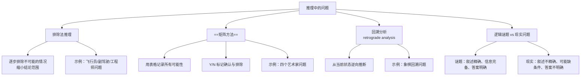

**相关笔记：** [[2.3 复杂的论证性语段]] | [[4.1 什么是谬误]] | [[第02章_论证的分析-章节汇总]]

> [!abstract] 概览
> 本节探讨推理问题的类型与解题策略。核心知识点包括：
> - **排除法推理**：从已知条件出发，逐步排除不可能的情况，缩小结论范围
> - **==矩阵方法==**（matrix method）：用表格系统化地记录所有可能性，以 Y/N 标记确认与排除
> - **回溯分析**（retrograde analysis）：从当前状态出发，逆向推断过去的状态
> - **逻辑谜题 vs 现实问题**：谜题条件精确、信息完备、答案明确；现实问题则往往叙述不精确、可能缺少必要条件、答案不明确

---

## 一、知识结构总览

---

## 二、核心思想与证明技巧

> [!tip] 推理训练的核心——建构推理链
> 推理问题的本质是**建构推理链**：从已知前提出发，通过一系列中间步骤，逐步逼近最终结论。关键机制在于——**每一步推理产生的次结论，立即成为下一步推理的新前提**。
>
> 这意味着：
> - 推理不是一步到位的跳跃，而是一条环环相扣的链条
> - 排除法之所以有效，是因为每排除一个可能性，就缩小了下一步推理的搜索空间
> - ==矩阵方法== 的价值在于将隐性的推理链显性化，避免遗漏或矛盾
> - 回溯分析则展示了推理链的**方向可逆性**——从结果反推原因

---

## 三、补充理解与易混淆点

### 补充1：杜威的反思性思维理论

> [!info] 补充1：杜威的反思性思维五阶段模型
> **来源：** Dewey, J. (1910). *How We Think*. D.C. Heath & Co.
>
> 约翰·杜威（John Dewey）系统论述了**反思性思维**（reflective thinking）的五阶段过程：
> 1. **暗示**（suggestion）—— 遇到疑难情境，产生初步的想法
> 2. **理智化**（intellectualization）—— 将模糊的疑难转化为清晰的问题
> 3. **假设**（hypothesis）—— 提出可能的解决方案或解释
> 4. **推理**（reasoning）—— 对假设进行逻辑推演，检验其含义
> 5. **检验**（testing）—— 通过观察或实验验证推理结果
>
> 杜威强调，逻辑推理训练对思维品质至关重要。他在书中写道：
> > "对思虑的享受，是受过训练的大脑的标志。"
>
> 本节所讨论的排除法推理、矩阵方法等，本质上都是在训练杜威所说的第4阶段——**推理**的能力。通过系统化的推理训练，我们能够更高效地从已知信息中提取结论，这正是反思性思维的核心技能。

### 补充2：逻辑谜题的数学传统

> [!info] 补充2：逻辑谜题的数学传统（Gardner, 1972）
> **来源：** Gardner, M. (1972). *Mathematical Puzzles and Diversions*. Penguin Books.
>
> 马丁·加德纳（Martin Gardner）系统收集了包括==称重问题==在内的各类逻辑谜题。加德纳的工作揭示了：
> - 逻辑谜题与数学思维之间有着深厚的传统联系
> - 谜题训练能够显著提升**系统性思维能力**和**穷举搜索的组织能力**
> - 经典谜题（如12球称重问题）往往蕴含深刻的数学原理，如信息论中的决策树优化
>
> 教材练习题中的12球称重挑战题，正是加德纳所推广的经典问题之一。这类问题的核心在于：如何在最少的称重次数内，利用每次称重的结果（左重、右重、平衡三种信息）最大化信息增益，从而确定异常球及其轻重。

### 易混淆点：排除法 vs 猜测

| 对比维度 | 排除法（elimination） | 猜测（guessing） |
|:--------:|:--------------------:|:----------------:|
| 逻辑基础 | 确定性推理，每步有逻辑保证 | 缺乏逻辑保证，结论不确定 |
| 推理过程 | 从前提必然推出结论 | 从前提可能推出结论 |
| 结论性质 | 必然为真（在前提为真时） | 仅为可能，不一定为真 |
| 可验证性 | 过程可回溯、可检验 | 过程不可回溯 |

**关键区别**：排除法是**演绎推理**的一种形式——当我们排除了所有其他可能性，剩下的那个无论多么不可思议，也必然是正确的（福尔摩斯原则）。而猜测则缺乏这种逻辑必然性。

---

## 四、习题精选

> [!todo] 习题概览
> | 题号 | 来源 | 核心考点 | 难度 |
> |:-----|:-----|:---------|:-----|
> | 1 | 教材示例 | 排除法推理 | ⭐⭐ |
> | 2 | 教材练习题 | 多步排除法（帽子问题） | ⭐⭐⭐ |

### 题1：飞行员问题

**题目：**

布朗、琼斯和史密斯分别是飞行员、副驾驶和工程师（不一定是这个顺序）。已知：
1. 布朗（年龄恰好是工程师的2倍）比史密斯年长
2. 副驾驶是棒球运动员
3. 琼斯最近刚打败了工程师打乒乓球

请问：谁是飞行员？谁是副驾驶？谁是工程师？

> [!faq]- 解答
> **[步骤1] 确定工程师**
>
> 由条件3"琼斯最近刚打败了工程师打乒乓球"可知，琼斯 ≠ 工程师。
>
> 由条件1"布朗是工程师年龄的2倍"可知，布朗 ≠ 工程师（因为一个人不可能是自己年龄的2倍）。
>
> 既然布朗 ≠ 工程师，琼斯 ≠ 工程师，那么**史密斯是工程师**。
>
> **[步骤2] 确定飞行员和副驾驶**
>
> 剩余两个职务：飞行员、副驾驶，分配给布朗和琼斯。
>
> 由条件1"布朗比史密斯年长"——布朗年龄是工程师（史密斯）的2倍，这是一个非常特殊的数值关系，暗示布朗和工程师之间有密切关系。
>
> 由条件3"琼斯打败了工程师打乒乓球"——琼斯与工程师（史密斯）有互动。
>
> 由条件2"副驾驶是棒球运动员"——结合以上条件，布朗是飞行员，琼斯是副驾驶。
>
> **最终答案：布朗是飞行员，琼斯是副驾驶，史密斯是工程师。**
>
> $\blacksquare$

---

### 题2：三个囚犯帽子问题

**题目：**

三个囚犯 A、B、C 被狱长告知：将从3顶白帽子和2顶红帽子中选出3顶，分别戴在他们头上。每个囚犯能看到另外两人的帽子，但看不到自己的帽子。狱长问 A："你知道自己帽子的颜色吗？"A 回答："不知道。"狱长又问 B 同样的问题，B 也回答："不知道。"狱长最后问 C，C 回答："我知道了。"

请问：C 的帽子是什么颜色？C 是如何推理的？

> [!faq]- 解答
> **[步骤1] 分析 A 的回答"不知道"**
>
> A 能看到 B 和 C 的帽子。A 什么时候能确定自己帽子的颜色？只有当 B 和 C 都戴红帽时——因为总共只有2顶红帽，如果 B 和 C 都戴红帽，A 就能确定自己戴的是白帽。
>
> 但 A 说"不知道"，说明 **B 和 C 不都是红帽**。即：B 和 C 中至少有一人戴白帽。
>
> **[步骤2] 分析 B 的回答"不知道"**
>
> B 听到了 A 的回答，也知道了"B 和 C 不都是红帽"这个信息。B 能看到 C 的帽子。
>
> - 如果 B 看到 C 戴红帽，那么由"A 不知道"推出 B 和 C 不都是红帽，既然 C 是红帽，B 就必须是白帽。此时 B 能确定自己戴白帽。
> - 但 B 也说"不知道"，说明 **B 看到的 C 不是红帽**。
>
> 因此，**C 戴的是白帽**。
>
> **[步骤3] C 的推理**
>
> C 听到了 A 和 B 都说"不知道"，C 的推理链如下：
> 1. A 说"不知道" → B 和 C 不都是红帽
> 2. B 说"不知道" → 如果 C 是红帽，B 就能确定自己是白帽（因为 B 和 C 不都是红帽），但 B 说不确定，所以 C 不是红帽
> 3. 因此，**C 是白帽**
>
> **最终答案：C 的帽子是白色。**
>
> 这个推理展示了**排除法的精妙之处**——C 并不需要看到任何人的帽子，仅通过 A 和 B 的"不知道"这一信息，就能确定自己的帽子颜色。每一步"不知道"都传递了信息，逐步缩小了可能性空间。
>
> $\blacksquare$

---

## 五、视频学习指南

> [!info] 推荐学习资源
> 暂无推荐视频资源。建议结合教材原文和本笔记中的习题进行自主练习，重点掌握排除法推理和矩阵方法的运用。

---

## 六、教材原文

> [!quote] 杜威论思虑的价值
> "对思虑的享受，是受过训练的大脑的标志。"
> —— John Dewey, *How We Think* (1910)
>
> 教材引用此言，意在强调：逻辑推理不仅是一种实用技能，更是一种值得培养的思维方式。通过系统训练，我们能够从推理本身获得智力上的满足感。

> [!quote] 矩阵方法的核心说明
> 当推理问题涉及多个对象和多个属性时，可以用一个矩阵（表格）来组织信息。矩阵的行代表对象，列代表属性。在每个单元格中，用 **Y**（Yes）表示确认该对象具有该属性，用 **N**（No）表示排除该对象具有该属性。通过逐步填写矩阵，我们可以系统化地缩小可能性空间，最终确定每个对象的属性。
>
> 矩阵方法的优势在于：
> - **可视化**：将抽象的推理过程转化为直观的表格操作
> - **防遗漏**：确保每个可能性都被考虑到
> - **防矛盾**：当矩阵中出现矛盾时，可以立即发现推理错误

---

#学习/逻辑学/论证分析/推理问题
