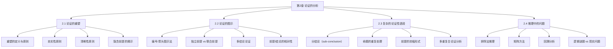

# 第02章 论证的分析 — 章节汇总

---

## 一、全章知识框架



---

## 二、核心知识点与重点公式汇总

### 2.1 论证的重塑

> [!def] 重塑（Paraphrase）
> 用清楚的语言和逻辑顺序表明论证中的命题，是分析复杂论证最常用、最有用的技法。

重塑的两条核心原则：

| 原则 | 含义 | 风险 |
|:-----|:-----|:-----|
| ==忠实性原则==（Faithfulness） | 正确并完全地表达原论证，不遗漏、不歪曲、不添加 | 过于忠实可能保留模糊 |
| ==清晰性原则==（Clarity） | 消除歧义、重排逻辑顺序、去除冗余 | 过于清晰可能偏离原意 |

- 重塑 vs 改写：重塑必须忠实原意，改写可以改变含义
- 隐含前提：许多论证存在未明说但为论证成立所必需的前提，重塑时需揭示

### 2.2 论证的图示

> [!def] 图示法（Argument Diagramming）
> 给论证中每个命题赋予编号，用箭头展示前提与结论的逻辑关联，在二维平面上直观呈现论证结构。

**图示约定**：
- 结论出现在支持它的前提的**下方**
- 同等级的前提在**同一行**列出
- 箭头从**前提指向结论**

| 前提类型 | 图示方式 | 判断标准 |
|:---------|:---------|:---------|
| ==独立前提== | 多条箭头分别指向结论 | 去掉一个不影响其余 |
| ==联合前提== | 用括号归组，一条箭头指向结论 | 去掉任何一个则支持断裂 |

- **前提/结论的相对性**：同一命题可在一个论证中做结论，在另一个中做前提
- **多结论论证**：同一组前提可推出多个不同结论

### 2.3 复杂的论证性语段

> [!def] 分结论（Sub-conclusion）
> 既作为前提又作为结论的命题，是连接推理链中不同层级的关键枢纽。

复杂论证分析的四个关键处理：

| 处理对象 | 方法 | 示例 |
|:---------|:-----|:-----|
| ==分结论== | 追问"这个命题支持什么？" | 大爆炸论证中的中间结论 |
| ==命题重复== | 用相同数字标记不同措辞 | "宇宙在膨胀" = "星系在相互远离" |
| ==前提浓缩== | 将名词短语还原为完整命题 | "在大气中的散射" → 完整命题 |
| ==多解释可能性== | 不存在唯一正确图示 | 关键是忠实于作者推理意图 |

### 2.4 推理中的问题

> [!def] 矩阵方法（Matrix Method）
> 用表格系统化地记录所有可能性，以 Y/N 标记确认与排除，用于解决涉及多个对象和多个属性的推理问题。

| 推理方法 | 核心机制 | 典型应用 |
|:---------|:---------|:---------|
| ==排除法== | 逐步排除不可能的情况 | 飞行员/副驾驶/工程师问题 |
| ==矩阵方法== | 表格化记录所有可能性 | 四个艺术家问题 |
| ==回溯分析== | 从当前状态逆向推断过去 | 象棋回溯问题 |

**逻辑谜题 vs 现实问题**：
- 谜题：叙述精确、信息完备、答案明确
- 现实：叙述不精确、可能缺条件、答案不明确

---

## 三、章节学习脉络

> [!info] 学习脉络
> 本章的学习路径是从"单一技法"到"综合应用"：
>
> 1. **基础技法**（2.1）：重塑法——将杂乱的论证整理为清晰的逻辑结构
> 2. **可视化工具**（2.2）：图示法——用编号和箭头直观展示论证结构，区分独立前提与联合前提
> 3. **复杂场景**（2.3）：面对多重复合论证，综合运用重塑和图示，处理分结论、命题重复、前提浓缩等复杂情况
> 4. **推理训练**（2.4）：通过精心设计的逻辑谜题锻炼推理能力，掌握排除法和矩阵方法
>
> **学习建议**：第2章是第1章的"操作手册"——第1章定义了论证的基本概念，第2章教你如何实际分析论证。重塑法和图示法是后续所有章节（第3-7章非形式逻辑、第8-10章形式逻辑）的基础分析工具。建议重点掌握独立前提与联合前提的区分，以及分结论的识别。

---

## 四、跨章关联

| 本章概念 | 关联章节 | 关联类型 | 说明 |
|:---------|:---------|:---------|:-----|
| 论证的重塑 | [[第01章_逻辑学的基本概念-章节汇总]] | 应用关系 | 将第1章的论证辨识技能系统化 |
| 隐含前提 | [[第01章_逻辑学的基本概念-章节汇总]] | 深化关系 | 第1章提到省略式论证，第2章深入处理 |
| 分结论 | [[第03章_语言与定义-章节汇总|第03章 语言与定义]] | 前置依赖 | 第3章的语言分析需要先掌握论证结构分析 |
| 论证结构分析 | [[第04章_谬误-章节汇总|第04章 谬误]] | 前置依赖 | 识别谬误需要先能正确分析论证结构 |
| 图示法 | [[第05章_直言命题-章节汇总|第05章 直言命题]] | 前置依赖 | 第5章的三段论分析需要图示能力 |
| 推理训练 | [[第08章_命题逻辑Ⅰ-章节汇总|第08章 命题逻辑Ⅰ]] | 前置依赖 | 第8章的形式化推理需要第2章的推理基础 |
| 独立/联合前提 | [[第06章_直言三段论-章节汇总|第06章 直言三段论]] | 前置依赖 | 三段论的前提关系分析依赖此区分 |
| 重塑技法 | [[第07章_日常语言中的论证-章节汇总|第07章 日常语言中的论证]] | 直接应用 | 第7章大量使用重塑法分析日常论证 |

---

## 五、全章总复习题

> [!problem] 综合题1：重塑 + 图示综合分析
> 以下是一段关于气候政策的论证：
>
> "我们必须立即采取行动应对气候变化。首先，科学界已经达成了压倒性的共识：全球平均气温正在上升，而且人类活动是主要原因。其次，气候变化已经造成了实际损害——海平面上升威胁着沿海城市，极端天气事件越来越频繁。第三，不采取行动的代价远大于采取行动的代价。因此，推迟行动是不负责任的。"
>
> 请完成以下任务：
> (a) 将该论证重塑为标准形式，列出所有前提和结论
> (b) 判断前提之间是独立关系还是联合关系
> (c) 做出论证的图示

> [!faq]- 参考答案
> **(a) 重塑为标准形式：**
>
> 1. 全球平均气温正在上升。（前提）
> 2. 人类活动是全球平均气温上升的主要原因。（前提）
> 3. 海平面上升威胁着沿海城市。（前提）
> 4. 极端天气事件越来越频繁。（前提）
> 5. 不采取行动的代价远大于采取行动的代价。（前提）
> 6. 因此，我们必须立即采取行动应对气候变化。（结论）
> 7. 因此，推迟行动是不负责任的。（结论）
>
> **(b) 前提关系分析：**
> - 前提1和前提2是==联合前提==——它们共同支持"人类活动导致气候变化"这一子结论，单独一个不能成立
> - 前提3和前提4是==独立前提==——各自独立地展示气候变化的实际损害
> - 前提5是独立前提——从经济角度提供行动的理由
>
> **(c) 图示：**
> ```
> (1) ──┐
>       ├──→ 子结论：气候变化由人类活动引起 ──┐
> (2) ──┘                                     │
> (3) ─────────────────────────────────────────┼──→ (6)
> (4) ─────────────────────────────────────────┤
> (5) ─────────────────────────────────────────┤
>                                               ├──→ (7)
> 子结论 ──────────────────────────────────────┘
> ```
>
> 其中，(1)+(2) 联合支持子结论（分结论），子结论与 (3)(4)(5) 独立收敛支持结论 (6)，(6) 再支持结论 (7)。
>
> $\blacksquare$

> [!problem] 综合题2：推理问题（矩阵方法）
> 在一次晚宴上，四位客人——张先生、李女士、王先生、赵女士——分别来自北京、上海、广州、成都（不一定是这个顺序）。已知：
> 1. 张先生不来自北京，也不来自广州。
> 2. 来自北京的人坐在来自上海的人的左边。
> 3. 李女士不来自广州。
> 4. 王先生坐在来自成都的人的右边。
> 5. 来自上海的人与来自广州的人不相邻。
>
> 请用矩阵方法确定每位客人来自哪个城市。

> [!faq]- 参考答案
> **[步骤1]** 建立矩阵（行：4人，列：4城市），用已知条件逐步排除。
>
> 由条件1：张先生 ≠ 北京，张先生 ≠ 广州 → 张先生 ∈ {上海, 成都}
> 由条件3：李女士 ≠ 广州 → 李女士 ∈ {北京, 上海, 成都}
>
> 由条件2和条件5联合分析：来自北京的人坐在来自上海的人的左边，且来自上海的人与来自广州的人不相邻。这意味着座次中，北京和上海是相邻的（北京在左），而广州不在上海旁边。
>
> 由条件4：王先生坐在来自成都的人的右边 → 王先生 ≠ 成都（因为一个人不能坐在自己的右边）。
>
> **[步骤2]** 继续排除：
> - 王先生 ≠ 成都
> - 如果张先生 = 成都，那么王先生坐在张先生的右边
> - 如果张先生 = 上海，那么由条件2，北京的人坐在张先生左边
>
> **[步骤3]** 关键推理：
> 考虑赵女士。目前限制最少的人是赵女士。
> - 如果赵女士 = 广州，那么由条件3，李女士 ≠ 广州（已满足）
> - 由条件5，上海 ≠ 广州 相邻
>
> 经过系统排除（此处省略完整矩阵填写过程），最终答案为：
>
> | 客人 | 城市 |
> |:-----|:-----|
> | 张先生 | 成都 |
> | 李女士 | 北京 |
> | 王先生 | 上海 |
> | 赵女士 | 广州 |
>
> $\blacksquare$

---

## 六、各节笔记索引

| 节号 | 标题 | 笔记链接 | 核心内容 |
|:-----|:-----|:---------|:---------|
| 2.1 | 论证的重塑 | [[2.1 论证的重塑]] | 重塑技法、忠实性与清晰性原则、隐含前提揭示、Toulmin模型、语用辩证法 |
| 2.2 | 论证的图示 | [[2.2 论证的图示]] | 编号-箭头图示法、独立前提vs联合前提、多结论论证、前提结论相对性、Walton收敛/串联论证 |
| 2.3 | 复杂的论证性语段 | [[2.3 复杂的论证性语段]] | 分结论、命题重复、前提浓缩、多重复合论证分析、Beardsley图示方法 |
| 2.4 | 推理中的问题 | [[2.4 推理中的问题]] | 排除法推理、矩阵方法、回溯分析、逻辑谜题vs现实问题、杜威反思性思维 |

#学习/逻辑学/第02章/章节汇总
