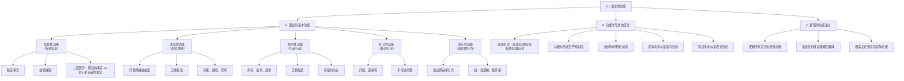

**相关笔记：** [[2.4 推理中的问题]] | [[3.2 情感语言、中性语言与论争]]

> [!abstract] 概览
> 本节系统阐述语言的多种功能及其对逻辑分析的意义。核心知识点包括：
> - **语言的三大基本功能**：信息性功能（传达信息）、表达性功能（表达情感）、指令性功能（引起行动）
> - **语言的两种补充功能**：礼节性功能（社交礼仪）和述行性功能（语词即行为）
> - **功能与形式的区别**：语言的功能（用途）与语法形式（陈述句、感叹句等）之间没有严格的对应关系
> - **信息模式的二层区分**：句子所陈述的事实 vs 关于说话者的事实
> - **逻辑学家的核心关注**：语言的信息性用法，因为它是推理和论证的载体

---

## 一、知识结构总览

---

## 二、核心思想与证明技巧

> [!tip] 核心思想
> 本节有两个核心精确区分，它们是正确理解语言在逻辑中角色的基础：
> 1. ==语言的功能 vs 语法形式==：功能是语言的**实际用途**（传达信息、表达情感、发出指令），形式是语法的**表面分类**（陈述句、感叹句等）。二者之间没有严格的对应关系——一个陈述句可能只是表达情感，一个感叹句可能传达信息。
> 2. ==信息性功能中的二层区分==：在信息模式下使用语言时，可以区分（a）==句子所陈述的事实==和（b）==关于说话者的事实==。前者关注命题内容本身，后者关注说话者通过说出该句子所透露的信息。

### 关键理解

1. **逻辑学以信息性功能为核心关注对象**
   - 适用场景：逻辑学家分析论证时，需要从语言中提取命题并判断推理关系
   - 典型应用：当一段话语混合了信息性和表达性功能时，逻辑学家关注的是其中的信息性成分——即那些可以判定真假的命题及其推理结构

2. **述行性功能（Performative）是语言哲学的重要概念**
   - 适用场景：某些语词在被说出时就完成了某种行为，而非描述某种行为
   - 典型应用："我道歉"说出即完成道歉行为；"我承诺"说出即完成承诺行为；"我命名这条船为'自由号'"说出即完成命名行为。述行性话语不描述世界，而是**改变**世界

3. **语境决定语言的实际功能**
   - 适用场景：同一句话在不同语境中可能承担完全不同的功能
   - 典型应用："下雨了"——在天气预报中是信息性的；在一个人被困雨中时可能是表达性的（抱怨）；在提醒别人收衣服时可能是指令性的（暗示"快去收衣服"）

---

## 三、补充理解与易混淆点

### 补充理解

> [!info] 补充1：述行性功能的理论基础——Austin 的言语行为理论
> **来源：** Austin, J.L. (1962). *How to Do Things with Words*. Oxford University Press.
>
> **约翰·兰肖·奥斯汀（J.L. Austin）** 是言语行为理论的奠基人。他在1962年的威廉·詹姆斯讲座（后整理出版为 *How to Do Things with Words*）中提出了一个革命性的观点：==说话本身就是一种行为==。
>
> 奥斯汀最初将话语分为两类：
> - **述行话语（performatives）**：说出即完成行为，如"我道歉"、"我宣布会议开始"、"我打赌六便士"
> - **记述话语（constatives）**：描述事实，可判定真假，如"猫在垫子上"
>
> 但他后来意识到这种二分法过于简单，转而提出了更精细的**三分模型**：
> 1. **言内行为（locutionary act）**：说出有意义的话语（发出声音并组合成有意义的句子）
> 2. **言外行为（illocutionary act）**：在说话中完成的行为（如警告、承诺、命令、道歉）——这是奥斯汀最关注的核心概念
> 3. **言后行为（perlocutionary act）**：通过说话在听者身上产生的效果（如说服、惊吓、安慰）
>
> 这一理论直接支撑了 Copi 教材中"述行性功能"的概念，也解释了为什么语言的功能远比语法形式复杂。

> [!info] 补充2：言语行为的系统分类——Searle 对 Austin 的继承与发展
> **来源：** Searle, J.R. (1976). "A Classification of Illocutionary Acts". *Language in Society*, 5(1), 1-23.
>
> **约翰·塞尔（J.R. Searle）** 是奥斯汀的学生，他对老师的理论进行了系统化和形式化。塞尔将言外行为（illocutionary acts）分为五大类：
>
> | 类别 | 核心功能 | 例子 | 对应 Copi 的分类 |
> |:-----|:---------|:-----|:------------------|
> | 断言类（Assertives） | 陈述事实，话语与世界相符 | "地球是圆的" | 信息性功能 |
> | 指令类（Directives） | 试图让听者做某事 | "请关门" | 指令性功能 |
> | 承诺类（Commissives） | 说话者承诺做某事 | "我保证明天到" | 述行性功能 |
> | 表达类（Expressives） | 表达心理状态 | "谢谢！" "太遗憾了" | 表达性功能 |
> | 宣告类（Declarations） | 改变世界状态 | "你被解雇了" "我宣布开幕" | 述行性功能 |
>
> 可以看到，塞尔的五分类体系与 Copi 教材中的三大基本功能加两种补充功能有高度对应关系。塞尔的分类更为精细，但 Copi 的分类对逻辑学入门而言更为简洁实用。

> [!info] 补充3：Cohen v. California 案与表达性功能的法律意义
> **来源：** Cohen v. California, 403 U.S. 15 (1971); 教材第3章第1节
>
> 1971年，美国最高法院在 *Cohen v. California* 案中作出了一个里程碑式的判决。案件背景：越战期间，19岁的保罗·科恩（Paul Robert Cohen）在洛杉矶法院走廊穿着一件印有"Fuck the Draft"（去他妈的征兵）的夹克衫，被警方以"恶意扰乱和平"罪名逮捕并定罪。
>
> 最高法院以5:4的票数**推翻了定罪**。哈伦大法官（Justice Harlan）在多数意见中写道：
> - ==一个人的粗野言辞是他人所厌恶的，这一事实并不能为限制该人表达的自由提供充分理由==
> - 脏话虽然令人不快，但它同时承载了**表达性功能**（传达对征兵的强烈不满）和**信息性功能**（传达反战立场）
> - 表达性功能受第一修正案保护，不能因为语言形式令人不快就压制其信息性内容
>
> 这一案例完美展示了语言功能的复杂性：同一句话同时承担多种功能，而法律需要在保护信息性功能和规范表达性功能之间寻找平衡。

### 易混淆点

> [!warning] 误区：陈述句 = 信息性功能
> ❌ **错误理解：** 所有陈述句都在传达信息，所有信息性功能都通过陈述句实现。
> ✅ **正确理解：** 语法形式（陈述句、感叹句等）和语言功能（信息性、表达性等）是两个独立的维度。一个陈述句可以只是表达情感（如"今天天气真好啊"可能只是感叹），一个疑问句也可以传达信息（如反问句"难道这不是很明显吗？"实际上断定了一个命题）。
> **辨析：** 判断语言的功能，不能看语法形式，而要看==语境和说话者的意图==。

> [!warning] 误区：述行性话语是描述行为
> ❌ **错误理解：** "我道歉"是在描述"我正在道歉"这个事实。
> ✅ **正确理解：** "我道歉"说出即完成道歉行为——它不是在**描述**道歉，而是在**执行**道歉。如果一个人在毫无诚意的情况下说"我道歉"，他确实完成了道歉这一言语行为（尽管可能是不真诚的），但"我正在真诚地道歉"则是一个可以判定真假的记述话语。
> **辨析：** 述行性话语的关键特征是：说出该话语就是完成该行为，而非描述该行为。

---

## 四、习题精选

> [!todo] 习题概览
> | 题号 | 来源 | 核心考点 | 难度 |
> |:-----|:-----|:---------|:-----|
> | 1 | 教材习题I | 识别语言的功能类型 | ⭐ |
> | 2 | 教材习题I | 功能与形式的区分 | ⭐⭐ |
> | 3 | 自编 | 信息性功能的二层区分 | ⭐⭐ |

### 题1：识别语言的功能

> [!problem] 题目
> 判断以下各句话主要使用了语言的哪种功能（信息性、表达性、指令性、礼节性、述行性）：
>
> (a) "水在标准大气压下100摄氏度沸腾。"
> (b) "天哪，这太令人震惊了！"
> (c) "请把窗户关上。"
> (d) "你好，很高兴见到你。"
> (e) "我宣布本次会议正式开幕。"

> [!faq]- 解答
> **[步骤1]** 逐句分析语言功能：
>
> (a) "水在标准大气压下100摄氏度沸腾。"——这句话传达了一个可以验证的科学事实，具有真假值。→ ==信息性功能==
>
> (b) "天哪，这太令人震惊了！"——这句话表达了说话者的强烈情感，不传达可验证的事实命题。→ ==表达性功能==
>
> (c) "请把窗户关上。"——这句话试图让听者执行某个动作（关窗户）。→ ==指令性功能==
>
> (d) "你好，很高兴见到你。"——这句话履行社交礼仪，不传达实质性信息。→ ==礼节性功能==
>
> (e) "我宣布本次会议正式开幕。"——这句话在被说出时就完成了"宣布开幕"这一行为，会议状态因此改变。→ ==述行性功能==
>
> $\blacksquare$

### 题2：功能与形式的区分

> [!problem] 题目
> 以下各句的语法形式与其主要语言功能是否一致？如果不一致，请说明实际功能是什么。
>
> (a) "这本书难道不值得读吗？"（疑问句形式）
> (b) "如果我是你，我绝对不会这样做。"（陈述句/假言句形式）
> (c) "多么美丽的日落啊！"（感叹句形式）

> [!faq]- 解答
> **[步骤1]** 分析 (a)：语法形式是疑问句，但实际功能不是提问。这是一个==反问句==，它断定了"这本书值得读"这一命题。因此实际功能是==信息性功能==（断定命题），与疑问句形式不一致。
>
> **[步骤2]** 分析 (b)：语法形式是陈述句（假言结构），但实际功能不是陈述事实。说话者用虚拟语气委婉地表达建议或批评，实际功能更接近==指令性功能==（暗示"你不应该这样做"）。
>
> **[步骤3]** 分析 (c)：语法形式是感叹句，实际功能也确实是表达对日落之美的赞叹。→ ==表达性功能==，与感叹句形式一致。
>
> $\blacksquare$

### 题3：信息性功能的二层区分

> [!problem] 题目
> "外面在下雨。"这句话在信息模式下使用时，可以区分哪两个层次的事实？

> [!faq]- 解答
> **[步骤1]** 第一层：==句子所陈述的事实==——即"外面正在下雨"这一关于外部世界的命题。这个命题有真假值，可以通过观察来验证。
>
> **[步骤2]** 第二层：==关于说话者的事实==——即说话者相信外面在下雨（否则他不会这么说），说话者知道外面在下雨（否则他不会如此断定），说话者希望听者知道外面在下雨（否则他不会说出来）。
>
> **[步骤3]** 这两个层次的区分在逻辑分析中很重要：逻辑学家主要关注第一层（命题本身的真假及其推理关系），但第二层（说话者的信念和意图）在某些语境下也有分析价值（例如在分析谬误时，识别说话者的真实意图可以帮助判断论证是否诚实）。
>
> $\blacksquare$

> [!tip] 解题思路提示
> 判断语言功能的关键不是看语法形式，而是问两个问题：(1) 这句话是否传达了可验证的命题？(2) 说话者的主要意图是什么——传达信息、表达情感、还是引起行动？

---

## 五、视频学习指南

> [!info] 视频资源
> | 资源 | 链接 | 对应内容 | 备注 |
> |:-----|:-----|:---------|:-----|
> | 本节暂无推荐视频资源。 | — | — | 教材本身提供了丰富的实例（包括 Cohen v. California 案例），足以掌握本节内容 |

---

## 六、教材原文

> [!quote] 教材原文
> **来源：** 逻辑学导论 第15版，第3章第1节，第XX-XX页
>
> **语言的功能：**
> 语言主要在三种方式上被使用：1. 信息性用法——用于传达信息；2. 表达性用法——用于表达情感或态度；3. 指令性用法——用于引起或阻止行动。
>
> **信息性功能：**
> 在信息模式下使用语言时，可以区分句子所陈述的事实和关于说话者的事实。
>
> **功能与形式的区别：**
> 必须区别语言的用法与语言的形式。句子形式有陈述句、感叹句、祈使句、疑问句。但功能和形式之间没有严格联系。例如反问句可以断定前提，感叹句可以是指令性的。
>
> **逻辑学家的关注点：**
> 逻辑学家主要关注语言的信息性用法。在信息模式下，可以区分句子陈述的事实和关于说话者的事实。
>
> **语言的松散性：**
> 语言太松散，用法多变，语境总是至关重要的。

---

## 参见 Wiki

- [[命题]] — 命题的定义与分类，语言信息性功能的核心产物
- [[论证]] — 论证的结构与辨识，依赖语言的信息性功能
- [[语言的功能]] — 语言功能分类的完整概念页

#学习/逻辑学/语言的功能
