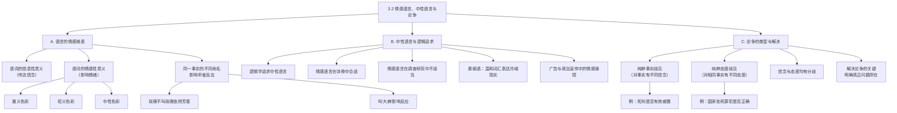

**相关笔记：** [[3.1 语言的功能]] | [[3.3 论争与含混性]]

> [!abstract] 概览
> 本节系统阐述语言的情感维度及其对理性论争的影响。核心知识点包括：
> - **语词的情感意义**：语词不仅传达信念（信息性意义），还可能影响听者情绪（情感性意义）
> - **中性语言 vs 情感语言**：逻辑学追求尽可能没有被情感意义扭曲的中性语言
> - **委婉语与语言操控**：用温和词汇表达冷峻现实，是情感语言的典型应用
> - **论争的三种类型**：纯粹事实歧见、纯粹态度歧见、信念与态度均有分歧
> - **解决论争的关键**：必须明确论争的真正问题所在——是事实之争还是态度之争

---

## 一、知识结构总览

---

## 二、核心思想与证明技巧

> [!tip] 核心思想
> 本节有三个核心精确区分，它们是识别和解决论争的基础：
> 1. ==信息性意义 vs 情感性意义==：同一个命题可以用不同的语词来表达，有些语词是中性的（如"终止妊娠"），有些带有强烈的情感色彩（如"谋杀婴儿"）。逻辑学关注的是命题的**信息性意义**（真值和推理关系），情感性意义会干扰理性判断。
> 2. ==事实歧见 vs 态度歧见==：论争可能源于对**事实**的不同信念（如"死刑能否有效威慑犯罪"），也可能源于对**相同事实**的不同态度（如"即使有效威慑，国家是否有权处死罪犯"）。混淆这两种分歧会导致论争无法推进。
> 3. ==语言的形式 vs 语言的用法==：延续3.1节的核心区分——语词的表面含义与其在具体语境中的实际功能可能完全不同。堕胎争论中"支持生命派"（pro-life）和"支持选择派"（pro-choice）就是典型例子：双方都使用了带有积极情感色彩的标签来定义自己的立场。

### 关键理解

1. **情感语言是修辞的核心工具，也是逻辑分析的主要障碍**
   - 适用场景：广告、政治宣传、辩论中大量使用情感语言来影响听众判断
   - 典型应用：将"增税"说成"财政收入再分配"（中性化），将对方的政策说成"灾难性方案"（贬义化）。防御这种诡计的最好方式是==理清语言的真正用法==——剥离情感外衣，还原命题的信息性内容

2. **委婉语是情感语言的双刃剑**
   - 适用场景：军事、政治、医疗等领域大量使用委婉语
   - 典型应用："附带损害"（collateral damage）代替"平民伤亡"，"友好火力"（friendly fire）代替"误击己方"，"裁员"代替"解雇"。委婉语可以减少不必要的冒犯，但也可能==掩盖事实真相==，阻碍理性讨论

3. **解决论争的第一步是诊断论争的类型**
   - 适用场景：面对任何争论，首先判断分歧的真正来源
   - 典型应用：如果双方对事实有不同信念（事实歧见），应通过调查和证据来解决；如果双方对相同事实有不同态度（态度歧见），则需要通过价值讨论来解决；如果两者都有，则需要分步处理——先解决事实问题，再讨论态度问题

---

## 三、补充理解与易混淆点

### 补充理解

> [!info] 补充1：情感意义的哲学分析——"描述性意义"与"评价性意义"的区分
> **来源：** Stevenson, C.L. (1944). *Ethics and Language*. Yale University Press.
>
> **查尔斯·史蒂文森（Charles L. Stevenson）** 在其经典著作 *Ethics and Language* 中对情感语言进行了系统的哲学分析。他提出了一个影响深远的区分：
>
> - **描述性意义（descriptive meaning）**：语词所指涉的事物的客观特征，大致对应 Copi 所说的"信息性意义"
> - **评价性意义（emotive meaning）**：语词所引发的态度、情感和倾向，大致对应 Copi 所说的"情感性意义"
>
> 史蒂文森的核心论点是：==伦理语词（如"好"、"坏"、"对"、"错"）的主要功能不是描述事实，而是表达态度和引发他人的态度变化==。例如，说"偷窃是错的"主要不是在描述偷窃的某个客观属性，而是在表达说话者对偷窃的反对态度，并试图影响听者也反对偷窃。
>
> 这一分析与 Copi 教材中的观点高度一致：逻辑学追求尽可能使用中性语言，正是因为情感性意义会干扰对命题真假的理性判断。史蒂文森的工作为这一直觉提供了系统的哲学基础。

> [!info] 补充2：论争类型的分析框架——信念分歧与态度分歧的交互作用
> **来源：** Copi, I.M., Cohen, C., McMahon, K. *Introduction to Logic* (15th ed.), §3.2; Stevenson, C.L. (1944). *Ethics and Language*, Ch. 5.
>
> Copi 教材以死刑立法争论为例，区分了论争的三种类型。这一分析框架可以追溯到史蒂文森在 *Ethics and Language* 第5章中对"分歧"（disagreement）的精细分析：
>
> | 分歧类型 | 信念层面 | 态度层面 | 解决途径 | 死刑争论中的例子 |
> |:---------|:---------|:---------|:---------|:-----------------|
> | 纯粹事实歧见 | 有分歧 | 一致 | 调查、收集证据 | 死刑是否有效威慑犯罪？ |
> | 纯粹态度歧见 | 一致 | 有分歧 | 价值讨论、道德推理 | 即使有效威慑，国家是否有权处死罪犯？ |
> | 混合歧见 | 有分歧 | 有分歧 | 先解决事实，再讨论态度 | 死刑是否有效且国家是否有权执行？ |
>
> 史蒂文森特别强调：在现实论争中，==事实分歧和态度分歧往往相互交织、相互强化==。一个人对死刑事实的信念（如"死刑能有效威慑"）会影响他对死刑的态度（如"因此死刑是正当的"），反过来，一个人对死刑的态度（如"国家无权杀人"）也可能影响他对相关事实的信念（如倾向于相信死刑无效威慑的研究，而忽略相反的证据）。
>
> 这意味着解决论争时，不能简单地假设"先解决事实问题"——因为态度分歧可能导致双方对同一证据给出完全不同的解读。Copi 教材的建议"明确论争的真正问题所在"是务实的第一步，但实际操作中往往需要反复迭代。

> [!info] 补充3：堕胎争论中的语言战争——"支持生命" vs "支持选择"
> **来源：** 教材第3章第2节；Lakoff, G. (2004). *Don't Think of an Elephant!* Chelsea Green Publishing.
>
> Copi 教材用堕胎争论中"支持生命派"（pro-life）和"支持选择派"（pro-choice）的标签来说明情感语言的作用。乔治·莱考夫（George Lakoff）在其著作 *Don't Think of an Elephant!* 中进一步分析了这一现象：
>
> - ==标签即框架==：选择什么样的标签来描述一个立场，本身就是一种修辞策略。"pro-life"将争论框架化为"生命 vs 反生命"，暗示对方反对生命；"pro-choice"则将争论框架化为"自由选择 vs 强制"，暗示对方反对自由
> - ==框架决定推理==：一旦接受了某个框架，后续的推理就会在该框架内进行，很难跳出。接受"pro-life"框架的人会自然地关注胎儿的生命权；接受"pro-choice"框架的人会自然地关注女性的自主权
> - ==逻辑学的应对==：逻辑学家需要识别这些框架，将争论还原为==可清晰陈述的命题==，然后分别评估各命题的真假和推理的有效性
>
> 这一案例深刻展示了情感语言如何通过框架效应影响人们的思维方式，以及为什么逻辑学追求中性语言。

### 易混淆点

> [!warning] 误区：中性语言 = 没有任何情感色彩的语言
> ❌ **错误理解：** 逻辑学要求我们使用完全不带任何情感色彩的干瘪语言。
> ✅ **正确理解：** 逻辑学追求的是==尽可能减少情感意义对命题真假判断的干扰==，而非完全消除语言中的情感成分。在适当语境下（如文学、诗歌、日常交流），情感语言是完全合适的。关键在于：**在需要理性分析和论证的场合**，应使用中性语言以确保讨论的清晰性和公正性。
> **辨析：** 中性语言的目标是**清晰和公正**，而非**冷漠和无趣**。

> [!warning] 误区：事实歧见可以通过更多证据自动解决
> ❌ **错误理解：** 只要双方愿意查看证据，事实歧见总能得到解决。
> ✅ **正确理解：** 虽然事实歧见原则上可以通过调查和证据来解决，但现实中存在诸多障碍：证据可能不完整、双方可能对同一证据给出不同解读、态度分歧可能扭曲对事实的判断。此外，某些事实问题（如历史事件的细节）可能永远无法得到确定答案。
> **辨析：** 区分事实歧见和态度歧见是分析的第一步，但解决论争往往比理论分析所暗示的更为复杂。

> [!warning] 误区：态度分歧无法通过理性讨论解决
> ❌ **错误理解：** 态度分歧纯粹是主观偏好，无法通过逻辑分析来处理。
> ✅ **正确理解：** 态度分歧虽然不像事实分歧那样可以通过直接观察来验证，但仍然可以通过==道德推理、价值分析和概念澄清==来推进。例如，关于"国家是否有权处死罪犯"的态度分歧，可以通过讨论国家权力的来源、刑罚的目的、人权理论等来深化理解——即使最终无法达成一致，也能使双方更清楚地理解分歧的根源。
> **辨析：** 态度分歧不等于"无法讨论"，只是讨论的方法不同于事实分歧。

---

## 四、习题精选

> [!todo] 习题概览
> | 题号 | 来源 | 核心考点 | 难度 |
> |:-----|:-----|:---------|:-----|
> | 1 | 教材习题II | 识别情感语言与中性语言 | ⭐ |
> | 2 | 教材习题II | 论争类型的诊断 | ⭐⭐ |
> | 3 | 自编 | 委婉语分析与中性化改写 | ⭐⭐ |

### 题1：识别情感语言与中性语言

> [!problem] 题目
> 以下各组语词表达的是相同或相似的事实，但情感色彩不同。请指出每组中哪个是中性语言，哪个是情感语言，并说明情感语言带有何种情感色彩（褒义/贬义）。
>
> (a) "坚定果断" vs "固执己见"
> (b) "自由战士" vs "恐怖分子"
> (c) "税收政策调整" vs "苛捐杂税"

> [!faq]- 解答
> **[步骤1]** 分析 (a)：
> - "坚定果断"：==褒义==情感语言，暗示积极品质（有原则、有魄力）
> - "固执己见"：==贬义==情感语言，暗示消极品质（不灵活、不听劝）
> - 中性表述可能是："坚持自己的立场"或"不改变原有观点"
>
> **[步骤2]** 分析 (b)：
> - "自由战士"：==褒义==情感语言，暗示为自由和正义而战的英雄
> - "恐怖分子"：==贬义==情感语言，暗示使用暴力威胁无辜者的罪犯
> - 中性表述可能是："武装反抗者"或"使用暴力的政治行动者"
>
> **[步骤3]** 分析 (c)：
> - "税收政策调整"：==中性偏褒义==语言，暗示理性的政策优化
> - "苛捐杂税"：==贬义==情感语言，暗示不合理的沉重负担
> - 中性表述可能是："税率变更"或"税收制度的修改"
>
> $\blacksquare$

### 题2：论争类型的诊断

> [!problem] 题目
> 以下争论属于哪种类型（纯粹事实歧见、纯粹态度歧见、信念与态度均有分歧）？请说明理由。
>
> 甲："大学教育应该是免费的，因为教育是基本人权。"
> 乙："大学教育不应该是免费的，因为免费教育会导致质量下降。"

> [!faq]- 解答
> **[步骤1]** 分析双方的分歧点：
> - 甲的理由是价值判断："教育是基本人权"——这是一个==态度分歧==（对教育权利的价值判断）
> - 乙的理由是事实判断："免费教育会导致质量下降"——这是一个==事实分歧==（关于因果关系的经验命题）
>
> **[步骤2]** 判断论争类型：双方的分歧同时涉及事实层面（免费教育是否导致质量下降）和价值层面（教育是否是基本人权）。因此，这是一个==信念与态度均有分歧==的混合型论争。
>
> **[步骤3]** 解决建议：要有效推进这场讨论，应分两步走：
> 1. 先解决事实问题：考察其他实行免费大学教育的国家的实际效果，用数据判断"免费教育是否导致质量下降"
> 2. 再讨论态度问题：即使质量不受影响，教育是否是基本人权？国家是否有义务提供免费教育？
>
> $\blacksquare$

### 题3：委婉语分析与中性化改写

> [!problem] 题目
> 以下句子使用了委婉语。请指出被委婉化的原始事实是什么，并将句子改写为中性语言。
>
> (a) "由于公司进行了人员优化，他被安排了新的职业发展机会。"
> (b) "这次军事行动造成了一定程度的附带损害。"

> [!faq]- 解答
> **[步骤1]** 分析 (a)：
> - "人员优化"是"裁员"或"解雇"的委婉语
> - "被安排了新的职业发展机会"是"被解雇/失业"的委婉语
> - 中性改写："由于公司裁减了员工，他被解雇了。"
>
> **[步骤2]** 分析 (b)：
> - "附带损害"是"平民伤亡"或"平民财产损失"的委婉语
> - "一定程度的"试图弱化损害的严重性
> - 中性改写："这次军事行动导致了平民伤亡和财产损失。"
>
> **[步骤3]** 委婉语分析：这些委婉语通过使用抽象、温和的词汇，==降低了事实的情感冲击力==。在企业管理中，委婉语可以减少对被解雇员工的直接伤害；但在军事和政治语境中，委婉语可能==掩盖事实的严重性==，阻碍公众对政策的理性评估。逻辑学要求我们在分析论证时，将委婉语还原为中性表述，以准确评估命题的真假。
>
> $\blacksquare$

> [!tip] 解题思路提示
> 识别情感语言和委婉语的关键技巧：问自己"如果我用最直白、最中性的方式描述同一事实，我会怎么说？"两者之间的差异就是情感成分。在分析论证时，始终将情感语言"翻译"为中性语言，以避免被修辞所误导。

---

## 五、视频学习指南

> [!info] 视频资源
> | 资源 | 链接 | 对应内容 | 备注 |
> |:-----|:-----|:---------|:-----|
> | 本节暂无推荐视频资源。 | — | — | 教材本身提供了堕胎争论、死刑争论等丰富的实例，足以掌握本节内容 |

---

## 六、教材原文

> [!quote] 教材原文
> **来源：** 逻辑学导论 第15版，第3章第2节，第XX-XX页
>
> **情感语言：**
> 传达信念的语词可能是中立的，但也可能影响听者情绪。玫瑰不叫玫瑰依然芳香，但叫"大麻"会影响反应。委婉语用温和词汇表达冷峻现实。
>
> **逻辑学的追求：**
> 带情感色彩的语言在诗歌中合适，在调查研究中不适当。堕胎争论中"支持生命派"vs"支持选择派"就是例子。逻辑学追求尽可能没有被情感意义扭曲的语言。
>
> **广告与政治宣传：**
> 广告和政治宣传中玩弄情感是核心技巧。防御诡计的最好方式是理清语言的真正用法。
>
> **论争的类型：**
> 论争可能源自：对待同一事实的不同信念，或对待相同事实的不同态度。死刑立法争论的三种分歧：1.纯粹事实歧见（死刑是否有效威慑）2.纯粹态度歧见（国家处死罪犯是否正确）3.信念和态度都有分歧。
>
> **解决论争：**
> 要解决论争，必须明确论争的真正问题所在。

---

## 参见 Wiki

- [[论证]] — 论证的结构与辨识，情感语言可能干扰论证的分析
- [[3.1 语言的功能]] — 语言的功能分类，是理解情感语言的基础
- [[情感语言与中性语言]] — 信息性意义与情感性意义的完整概念页

#学习/逻辑学/语言与意义
