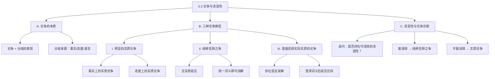

**相关笔记：** [[3.2 情感语言、中性语言与论争]] | [[3.4 定义及其用途]]

> [!abstract] 概览
> 本节系统分析论争（dispute）的本质与语言含混性（ambiguity）之间的关系，提出三种论争类型的经典分类框架，为后续讨论定义的必要性奠定基础。
> - **三种论争类型**：明显的实质论争、纯粹言辞之争、表面言辞但实际实质的论争
> - **含混性的核心角色**：语言歧义如何制造或掩盖真正的分歧
> - **论争诊断方法**：通过追问含混性来判定论争的真实性质

---

## 一、知识结构总览

---

## 二、核心思想与证明技巧

> [!tip] 核心思想
> 1. ==实质论争与言辞之争的区分==：论争的本质取决于分歧的来源——是对世界事实或价值判断的不同看法（实质论争），还是仅仅对词语含义的误解（言辞之争）。这一区分是逻辑分析的基本功。
> 2. ==含混性是论争诊断的关键变量==：面对任何论争，首要任务是追问是否存在可通过澄清多种意义而消除的含混性。这一追问本身就能帮助我们判断论争的真实性质。
> 3. ==第三种论争的隐蔽性==：最危险的论争类型是"表面言辞但实际实质的论争"——它伪装成语言问题，但即使语言澄清后实质分歧依然存在。识别这类论争需要穿透语言表层。

### 关键理解

1. **明显的实质论争（Genuine Substantive Dispute）**
   - 适用场景：双方对事实或价值有根本不同的判断，且分歧不依赖于对任何词语的不同理解。
   - 典型应用：
     - *事实上的实质论争*：C 认为迈阿密在里约热内卢南部，D 不这么认为——这涉及地理事实的判断，与词语含义无关。
     - *态度上的实质论争*：A 支持扬基队，B 支持红袜队——这涉及偏好和忠诚，与"支持"或"球队"的含义无关。

2. **纯粹言辞之争（Purely Verbal Dispute）**
   - 适用场景：双方不存在实质歧见，表面冲突完全源于对某些关键词汇的不同理解。一旦统一词义，论争即告消解。
   - 典型应用：荒野中倒下的树是否发出"声音"——如果"声音"指"空气震动"，则答案是肯定的；如果"声音"指"人类听觉体验"，则答案是否定的。双方对物理事实完全一致，分歧仅在于"声音"一词的用法。

3. **表面言辞但实际实质的论争（Apparently Verbal but Actually Substantive Dispute）**
   - 适用场景：论争中确实包含对词项用法的误解，但即使言辞层面被澄清，仍然存在超出语词含义的实质分歧。
   - 典型应用：露骨性影片是否为"色情作品"——J 认为露骨性内容本身就使其成为色情作品，K 认为具有美学价值的就是艺术。即使双方就"色情作品"的定义达成一致，他们对影片的评价（是否应当被允许、是否具有社会价值）可能仍然严重分歧。

### 论争诊断流程

面对任何论争，按以下步骤进行诊断：

1. **识别关键词汇**：找出论争中可能存在多种含义的词语。
2. **尝试澄清含义**：为关键词汇提供不同的可能释义。
3. **检验分歧是否消解**：
   - 如果所有分歧都消失了 → ==纯粹言辞之争==
   - 如果分歧仍然存在 → ==实质论争==（可能是明显的，也可能是被言辞掩盖的）

---

## 三、补充理解与易混淆点

### 补充理解

> [!info] 补充1：维特根斯坦的"意义即使用"
> **来源：** Wittgenstein, L. (1953). *Philosophical Investigations*. Blackwell Publishing.
>
> 维特根斯坦在其后期哲学中提出，词语的意义不在于它所指称的某个固定对象，而在于它在语言游戏中的使用方式。这一观点直接支持了本节的核心论点：许多论争之所以产生，正是因为同一个词在不同语境中被以不同方式"使用"。理解了"意义即使用"，就能更深刻地理解为什么纯粹言辞之争如此普遍——争论双方实际上是在不同的语言游戏中使用同一个词，却误以为自己在讨论同一个问题。

> [!info] 补充2：论争类型学与法律论证
> **来源：** Walton, D. (2007). *Media Argumentation: Dialectic, Persuasion and Rhetoric*. Cambridge University Press.
>
> Walton 在其论证理论研究中扩展了论争类型学，指出在法律和政治辩论中，第三种论争（表面言辞但实际实质的论争）尤为常见。例如，关于"言论自由"的辩论往往涉及对"自由"一词的不同理解，但即使定义被统一，双方对自由言论的边界和限制仍然存在深刻的价值观分歧。这一观察印证了本节的分类框架在现实分析中的强大解释力。

### 易混淆点

> [!warning] 误区：将所有含混性导致的论争都视为"纯粹言辞之争"
> ❌ **错误理解：** 只要论争中存在词语的含混性，那就是纯粹言辞之争，只要澄清词义就能解决。
> ✅ **正确理解：** 含混性的存在只是论争诊断的第一步。必须进一步检验：澄清词义后分歧是否完全消失？如果分歧仍然存在，那就是第三种论争——表面言辞但实际实质的论争。
> **辨析：** 第三种论争同时包含语言层面和实质层面的分歧。语言澄清只是剥去了表层伪装，暴露出更深层的实质争议。忽略这一点的分析者会误以为解决了语言问题就解决了一切。

> [!warning] 误区：认为"实质论争"意味着其中一方必然正确
> ❌ **错误理解：** 实质论争中一定有一方是对的、另一方是错的。
> ✅ **正确理解：** 实质论争只意味着分歧不源于语言误解，双方可能在事实上各有依据，或在价值判断上各有合理立场。实质论争的存在本身并不判定谁对谁错。
> **辨析：** 逻辑学的任务不是解决所有实质论争，而是帮助识别论争的真实性质。事实性的实质论争需要通过经验调查来解决，态度性的实质论争则可能永远无法完全消解。

---

## 四、习题精选

> [!todo] 习题概览
> | 题号 | 来源 | 核心考点 | 难度 |
> |:-----|:-----|:---------|:-----|
> | 1 | 教材习题I | 识别纯粹言辞之争 | ⭐⭐ |
> | 2 | 教材习题I | 识别表面言辞实际实质的论争 | ⭐⭐⭐ |
> | 3 | 教材习题II | 论争诊断与含混性分析 | ⭐⭐⭐ |

### 题1：识别论争类型——校园辩论

> [!problem] 题目
> 甲说："这所大学真的是一所'大学'，因为它拥有完整的本科和研究生院。"乙说："不，它不是真正的'大学'，因为它的研究产出太少，缺乏学术影响力。"两人争论的焦点在于"大学"一词的含义。请判断这属于哪种论争类型，并说明理由。

> [!faq]- 解答
> **[步骤1]** 识别关键词汇：论争中的关键词是"大学"。
>
> **[步骤2]** 分析分歧来源：甲用"大学"指"拥有完整院系设置的教育机构"，乙用"大学"指"具有高研究产出的学术机构"。双方对"大学"的评判标准不同。
>
> **[步骤3]** 检验实质分歧：如果统一"大学"的定义——比如采用甲的定义（有完整院系就是大学），那么乙的反对意见就消失了（乙同意它有完整院系）。或者采用乙的定义，甲也会承认研究产出不足。
>
> **[结论]** 这是一个==纯粹言辞之争==。双方对这所学校的事实（有什么院系、研究产出如何）没有分歧，分歧仅在于"大学"一词应当包含哪些条件。统一词义后论争即可消解。
> $\blacksquare$

### 题2：识别论争类型——艺术评价

> [!problem] 题目
> 甲说："涂鸦不是'艺术'，因为它是在公共墙壁上未经许可的破坏行为。"乙说："涂鸦是'艺术'，因为它表达了创作者的情感和审美观念，具有艺术创作的核心特征。"即使在双方就"艺术"的定义达成共识（即艺术是表达情感和审美观念的创作活动）之后，甲仍然认为未经许可的公共涂鸦应当被禁止，而乙认为应当被保护。请判断这属于哪种论争类型。

> [!faq]- 解答
> **[步骤1]** 识别语言层面：双方确实对"艺术"一词有不同理解——甲强调合法性和制度认可，乙强调表达性和审美性。
>
> **[步骤2]** 假设澄清语言：假设双方接受"艺术是表达情感和审美观念的创作活动"这一定义，那么涂鸦符合这一定义，乙在语言层面胜出。
>
> **[步骤3]** 检验分歧是否消解：即使承认涂鸦是"艺术"，甲仍然认为它应当被禁止（因为未经许可、破坏公共财产），乙仍然认为它应当被保护（因为具有艺术价值）。双方在"公共空间的使用权限"和"艺术是否可以豁免法律约束"等问题上存在==实质分歧==。
>
> **[结论]** 这是一个==表面言辞但实际实质的论争==。语言误解被澄清后，关于涂鸦是否应当被允许的实质争议仍然存在。
> $\blacksquare$

### 题3：论争诊断综合分析

> [!problem] 题目
> 以下三组论争分别属于哪种类型？请对每组给出判断和理由。
>
> (a) A说："死刑是'残忍的'。"B说："不，死刑不是'残忍的'，它是正义的报应。"
> (b) A说："鲸鱼是'鱼'。"B说："鲸鱼不是'鱼'，它是哺乳动物。"
> (c) A说："这部电影是'成功的'，因为票房很高。"B说："这部电影不是'成功的'，因为影评很差。"

> [!faq]- 解答
> **[步骤1]** 分析(a)：关键词是"残忍的"。A用"残忍的"指"造成痛苦和死亡"，B用"残忍的"似乎指"不正当的、不应施加的"。但即使统一"残忍"的含义（承认死刑确实造成痛苦），B仍然认为死刑是正当的。因此双方在死刑的道德正当性上存在实质分歧。
>
> **[结论(a)]** ==表面言辞但实际实质的论争==。语言澄清后，关于死刑道德性的实质分歧仍然存在。
>
> **[步骤2]** 分析(b)：关键词是"鱼"。A用日常语言中的"鱼"（水生、有鳍、游泳的生物），B用生物学分类中的"鱼"（特定的脊椎动物类群）。一旦明确"鱼"是指日常用语还是生物学分类，分歧就消失了。双方对鲸鱼的生物学特征完全一致。
>
> **[结论(b)]** ==纯粹言辞之争==。
>
> **[步骤3]** 分析(c)：关键词是"成功的"。A用票房标准，B用评价标准。但即使统一"成功"为"票房高"，B可能仍然认为高票房的电影不一定是好电影（即"成功"不等于"好"）。这里可能同时存在语言分歧和价值观分歧——对"什么使一部电影成功"有不同的实质判断。
>
> **[结论(c)]** ==表面言辞但实际实质的论争==。即使统一"成功"的定义，双方对电影评价标准的优先级仍有实质分歧。
> $\blacksquare$

---

## 五、视频学习指南

> [!info] 视频资源
> | 资源 | 链接 | 对应内容 | 备注 |
> |:-----|:-----|:---------|:-----|
> | 本节暂无推荐视频资源。 | — | — | 教材本身提供了三种论争类型的经典案例，足以掌握本节内容。建议结合日常生活中的辩论实例进行练习。 |

---

## 六、教材原文

> [!quote] 教材原文
> **来源：** 逻辑学导论 第15版，第3章第3节
>
> 论争有三种类型。第一种是明显的实质论争，例如A支持扬基队而B支持红袜队（态度上的实质论争），或者C认为迈阿密在里约热内卢南部而D不这么认为（事实上的实质论争）。第二种是纯粹言辞之争，其中不存在实质歧见，表面冲突可以通过统一对某些词汇的理解来解决。第三种是表面上是言辞的但实际上是实质的论争，其中包含对词项用法的误解，但言辞误解被澄清后仍然存在超出语词含义的歧见。
>
> 面对论争，必须首先追问是否存在可通过澄清多种意义而消除的含混性。如果能解决，就是纯粹言辞之争；如果不能，则是以言辞论争面貌出现的实质论争。

---

## 参见 Wiki

- [[论证]] — 论争是论证的一种特殊形式，涉及对立立场的交锋
- [[3.2 情感语言、中性语言与论争]] — 语言的多重功能是理解论争中含混性来源的基础
- [[3.4 定义及其用途]] — 定义是消除论争中含混性的主要工具
- [[论争的类型]] — 三种论争类型的完整概念页
- [[实质论争-vs-言辞之争]] — 实质论争与言辞之争的对比分析

#学习/逻辑学/论争与歧义
