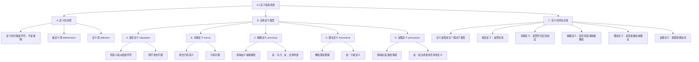

**相关笔记：** [[3.3 论争与含混性]] | [[3.5 定义的结构：外延与内涵]]

> [!abstract] 概览
> 本节系统阐述定义的本质与五种主要类型，建立完整的定义分类体系。定义总是对符号的定义，而非对对象的定义；不同类型的定义服务于不同的认知与交流目的，在消除歧义、推进理论和说服论证中各有其独特功能。
> - **定义的本质**：被定义项（definiendum）与定义项（definiens）的关系
> - **五种定义类型**：规定定义、词典定义、精确定义、理论定义、说服定义
> - **定义的认识论地位**：不同类型定义的真值条件与合理性标准

---

## 一、知识结构总览

---

## 二、核心思想与证明技巧

> [!tip] 核心思想
> 1. ==定义的对象是符号而非事物==：我们定义的是词语、符号或表达式的含义，而不是它们所指称的对象本身。这一区分看似简单，却是避免许多哲学困惑的关键。例如，定义"椅子"不是在定义那个木制的物理对象，而是在定义"椅子"这个词的含义。
> 2. ==五种定义类型对应五种不同功能==：规定定义用于引入新符号，词典定义用于报告已有用法，精确定义用于消除模糊性，理论定义用于概括理论理解，说服定义用于影响态度。混淆这些类型会导致逻辑错误——例如，将规定定义当作词典定义来批评其"不正确"。
> 3. ==定义的真值条件因类型而异==：规定定义既不真也不假（它是语言约定），词典定义可真可假（取决于是否准确报告了实际用法），精确定义、理论定义和说服定义则各有其合理性标准，不能一概而论。

### 关键理解

1. **被定义项与定义项**
   - 适用场景：任何定义都由两个部分组成。
   - 典型应用：
     - ==被定义项（definiendum）==：被定义的符号，即需要解释其意义的词语或表达式。例如，"googol"在被定义时就是被定义项。
     - ==定义项（definiens）==：用来说明被定义项意义的符号或符号组合。例如，"$10^{100}$"就是"googol"的定义项。

2. **A. 规定定义（Stipulative Definition）**
   - 适用场景：引进新符号时，为其指派特定含义。定义者拥有指派意义的自由。
   - 典型应用：
     - 数学中引入新术语："googol" = $10^{100}$
     - 科学中创造新概念："黑洞"替换"引力完全崩溃的星体"
     - 物理学中引入基本粒子名称："夸克"（quark）
   - 关键特征：==规定定义既不真也不假==，因为它不是在描述已有用法，而是在建立新的语言约定。我们不能批评一个规定定义"不正确"，但可以批评它"不便利"或"容易引起混淆"。

3. **B. 词典定义（Lexical Definition）**
   - 适用场景：报告某个词语在特定语言社群中已经具有的意义。
   - 典型应用："'bird'一词指的是有羽毛的温血脊椎动物"——这个定义==可以为真==（如果它准确描述了"bird"的实际用法），也可以==为假==（如果实际用法并非如此）。
   - 关键特征：词典定义的真假取决于它是否忠实于被定义项的==实际使用方式==。词典编纂者通过调查语言使用来确定词语的意义，而非通过个人意志来决定。

4. **C. 精确定义（Precising Definition）**
   - 适用场景：某个词语存在歧义或模糊性，需要通过精确界定来消除不确定性。常见于法律、科学和技术领域。
   - 典型应用：
     - "马力"精确定义为"在1秒内提升550磅重物1英尺高的能量" = 745.7瓦
     - "米"定义为"光在 $\frac{1}{299792458}$ 秒内穿过的距离"
     - 法律中"不合理搜查"的精确定义
   - 关键特征：精确定义不是在报告已有用法（否则就是词典定义），也不是在凭空创造新义（否则就是规定定义），而是==在已有用法的范围内选择或构建一个更精确的标准==，以服务于特定目的。

5. **D. 理论定义（Theoretical Definition）**
   - 适用场景：需要概括对某个概念在特定理论框架下的理解。理论定义试图捕捉概念的==本质特征==。
   - 典型应用：2006年国际天文联合会（IAU）对"行星"的新定义——一个天体要成为行星，必须同时满足三个条件：
     1. 在环绕太阳的轨道上运行
     2. 有足够质量保证自重克服刚体惯性力，呈现流体静力平衡形状（近似球形）
     3. 清除了轨道附近区域
   - 关键特征：冥王星满足条件(1)和(2)但不满足条件(3)，因此被重新归类为"矮行星"。这一定义引发了广泛讨论，但体现了理论定义如何随着科学理论的发展而演变。

6. **E. 说服定义（Persuasive Definition）**
   - 适用场景：通过重新定义某个术语来影响受众的态度或情感反应，从而在争论中获得修辞优势。
   - 典型应用：
     - 左派将"社会主义"定义为"延伸至经济领域的民主"——正面框架
     - 右派将"资本主义"定义为"经济领域里的自由"——正面框架
     - 反对者可能将同样的术语定义为负面概念
   - 关键特征：说服定义==表面上看似客观的定义，实际上暗含价值判断==。识别说服定义是批判性思维的重要技能——当你看到一个定义让你感到强烈的情感反应时，应当警惕它可能是一个说服定义。

### 五种定义类型速查表

| 类型 | 功能 | 真值 | 举例 |
|:-----|:-----|:-----|:-----|
| 规定定义 | 引入新符号 | 既不真也不假 | "googol" = $10^{100}$ |
| 词典定义 | 报告已有用法 | 可真可假 | "bird" = 有羽毛的温血脊椎动物 |
| 精确定义 | 消除模糊性 | 合理性标准 | "马力" = 745.7瓦 |
| 理论定义 | 概括理论理解 | 取决于理论 | 行星三条件定义 |
| 说服定义 | 影响态度 | 不适用（修辞工具） | "社会主义" = 经济领域的民主 |

---

## 三、补充理解与易混淆点

### 补充理解

> [!info] 补充1：Robinson的定义分类理论
> **来源：** Robinson, R. (1950). *Definition*. Oxford University Press.
>
> Robinson 在其经典著作《定义》中对定义的本质进行了深入分析。他指出，定义在历史上至少有五种不同的功能：指示（指出对象）、陈述本质（给出本质特征）、说明用法（报告语言习惯）、规定意义（建立语言约定）以及激发情感（说服性用途）。Robinson 的分类与 Copi 本节的五种类型高度一致，但 Robinson 更加强调定义的社会性和语境依赖性——他认为脱离具体语境讨论"正确定义"是没有意义的。这一观点提醒我们，评估一个定义的好坏必须考虑其 intended use（预期用途）。

> [!info] 补充2：国际天文联合会2006年行星定义决议
> **来源：** International Astronomical Union. (2006). *IAU 2006 General Assembly: Result of the IAU Resolution Votes*. IAU.
>
> 2006年8月24日，国际天文联合会在布拉格举行的第26届大会上投票通过了行星的新定义。这一决议是理论定义如何影响科学分类的经典案例。冥王星自1930年被发现以来一直被视为第九大行星，但随着太阳系外缘更多类似天体的发现（如阋神星），原有的分类体系面临挑战。新定义通过引入"清除轨道附近区域"这一标准，将冥王星重新归类为"矮行星"（dwarf planet）。这一决定至今仍有争议，但它完美展示了理论定义如何随着科学认识的深化而演变，以及理论定义对既有概念框架的重塑力量。

### 易混淆点

> [!warning] 误区：将规定定义与词典定义混为一谈
> ❌ **错误理解：** 所有定义都有真假之分，一个"好"的定义就是"正确"的定义。
> ✅ **正确理解：** 规定定义既不真也不假——它不是在描述世界，而是在建立语言约定。词典定义才有真假之分——它是否准确报告了实际用法。批评一个规定定义"不正确"是范畴错误，就像批评一个规则"不正确"一样。
> **辨析：** 当数学家规定"$e = \lim_{n \to \infty}(1 + \frac{1}{n})^n$"时，这不是在声称某个事实为真，而是在为符号"$e$"指定一个含义。你可以说这个定义"不便利"（比如如果它导致与其他概念冲突），但不能说它"不正确"。

> [!warning] 误区：认为精确定义必须完全消除所有模糊性
> ❌ **错误理解：** 一个好的精确定义应当使被定义项的含义完全精确，不留任何模糊空间。
> ✅ **正确理解：** 精确定义的目标是在特定语境中消除==相关的==模糊性，而非追求绝对的精确。许多有用的人工概念（如法律中的"合理人"标准）本身就包含必要的弹性。
> **辨析：** 过度精确化可能反而有害。例如，如果法律将"成年"精确定义为"年满18岁零0分0秒"，虽然精确了，但可能忽略了不同个体成熟度的差异。精确定义需要在精确性和实用性之间取得平衡。

> [!warning] 误区：将说服定义误认为客观定义
> ❌ **错误理解：** 说服定义只是普通的定义，只是恰好带有情感色彩。
> ✅ **正确理解：** 说服定义是一种==修辞策略==，它利用定义的形式来暗中植入价值判断。识别说服定义的关键在于：该定义是否在选择释义时明显偏向某种价值立场，而非忠实于概念的既有用法或理论地位。
> **辨析：** 当有人将"自由"定义为"不受任何限制地做任何想做的事"时，这不是在报告"自由"的词典意义（词典定义），也不是在消除模糊性（精确定义），而是在通过将自由等同于无政府状态来贬低自由的价值——这是一个典型的说服定义。

---

## 四、习题精选

> [!todo] 习题概览
> | 题号 | 来源 | 核心考点 | 难度 |
> |:-----|:-----|:---------|:-----|
> | 1 | 教材习题I | 识别定义类型 | ⭐⭐ |
> | 2 | 教材习题I | 区分词典定义与精确定义 | ⭐⭐ |
> | 3 | 教材习题II | 说服定义的识别与分析 | ⭐⭐⭐ |

### 题1：识别定义类型

> [!problem] 题目
> 请判断以下每个定义属于哪种类型（规定定义、词典定义、精确定义、理论定义或说服定义），并简要说明理由。
>
> (a) "比特"（bit）是信息量的基本单位，等于一个二元选择所包含的信息量。
> (b) "犬"一词指的是家养的狗（Canis lupus familiaris）。
> (c) "贫困线"定义为家庭年收入低于该地区中位数收入的60%。
> (d) "温度"是物质分子平均动能的量度。

> [!faq]- 解答
> **[分析(a)]** "比特"是信息论中引入的新术语，由 Claude Shannon 于1948年提出。这属于==规定定义==——Shannon 为新符号"bit"指派了特定含义。既不真也不假，但极其有用。
>
> **[分析(b)]** "犬"是已有中文词汇，该定义报告了它在中文中的实际用法。这属于==词典定义==。它可以被评估为真或假——取决于"犬"是否确实指家养的狗。
>
> **[分析(c)]** "贫困线"在日常语言中是模糊的——多穷算"贫困"？该定义通过具体数值标准消除了模糊性。这属于==精确定义==。它不是在报告已有用法（人们日常不会用"中位数收入的60%"来定义贫困），而是在构建一个可操作的判定标准。
>
> **[分析(d)]** "温度"的定义基于热力学和统计力学理论，概括了温度在分子层面的物理本质。这属于==理论定义==。它不是简单的语言约定或用法报告，而是基于物理学理论对温度本质的深层理解。
> $\blacksquare$

### 题2：区分词典定义与精确定义

> [!problem] 题目
> 以下两个关于"死亡"的定义分别属于哪种类型？请说明两者的区别。
>
> 定义1："死亡"是指生命功能的永久停止。
> 定义2："死亡"是指脑干功能的不可逆停止，包括自主呼吸和意识活动的永久丧失。

> [!faq]- 解答
> **[分析定义1]** 这是一个==词典定义==。它报告了"死亡"一词在日常语言中的基本用法——生命功能的永久停止。它可真可假，取决于这是否准确反映了人们对"死亡"一词的使用。
>
> **[分析定义2]** 这是一个==精确定义==。随着医学技术的发展（如呼吸机可以维持心肺功能），传统的"生命功能停止"标准变得模糊——一个脑死亡但心肺功能被机器维持的人算不算"死亡"？定义2通过引入"脑干功能不可逆停止"这一精确标准，消除了原有定义的模糊性，为医学和法律实践提供了可操作的判定依据。
>
> **[核心区别]** 词典定义描述词语的已有用法，精确定义则在已有用法的基础上构建更精确的标准以服务于特定目的。定义2不是在报告人们日常如何使用"死亡"一词（大多数人在日常中不会用脑干功能来定义死亡），而是在为医学和法律场景提供一个更精确的标准。
> $\blacksquare$

### 题3：说服定义的识别与分析

> [!problem] 题目
> 以下两个关于"税"的定义分别来自不同政治立场的发言人。请分析它们是否为说服定义，并说明说服策略。
>
> 定义A（来自减税倡导者）："税是政府对私人财产的强制征收，是对个人劳动成果的不正当剥夺。"
> 定义B（来自公共福利倡导者）："税是公民为维持文明社会所必需的公共服务而缴纳的合理贡献。"

> [!faq]- 解答
> **[步骤1]** 识别定义中的描述性成分与评价性成分。
>
> **[分析定义A]** 该定义包含描述性成分（"政府对私人财产的强制征收"）和强烈的评价性成分（"不正当剥夺"）。"不正当"是一个价值判断，而非对"税"的含义的中性描述。该定义通过将负面价值判断嵌入定义本身，使任何反对减税的人看起来都在为"不正当剥夺"辩护。这是一个典型的==说服定义==，策略是==负面框架化==——通过将税定义为"不正当的"，预先设定了听众的负面态度。
>
> **[分析定义B]** 该定义同样包含描述性成分（"为维持公共服务而缴纳"）和评价性成分（"合理贡献"）。"合理"是一个价值判断，暗示反对增税就是"不合理"的。这也是一个==说服定义==，策略是==正面框架化==——通过将税定义为"合理的"，预先设定了听众的正面态度。
>
> **[步骤2]** 对比分析。两个定义对同一概念（税）给出了截然不同的框架化处理。一个中性的词典定义可能是："税是政府依法向公民或企业征收的强制性资金。"注意中性定义不包含"正当/不正当"、"合理/不合理"等价值判断。
>
> **[结论]** 两个定义都是说服定义。它们利用定义的形式来暗中植入价值立场，而非客观地描述"税"的含义。识别此类说服定义是批判性思维的核心技能之一。
> $\blacksquare$

---

## 五、视频学习指南

> [!info] 视频资源
> | 资源 | 链接 | 对应内容 | 备注 |
> |:-----|:-----|:---------|:-----|
> | 本节暂无推荐视频资源。 | — | — | 教材提供了五种定义类型的丰富实例。建议读者从日常语言中自行收集定义案例，练习分类识别能力。 |

---

## 六、教材原文

> [!quote] 教材原文
> **来源：** 逻辑学导论 第15版，第3章第4节
>
> 定义总是对符号（而非对象）的定义。被定义的符号为被定义项（definiendum），用来说明的符号为定义项（definiens）。
>
> 规定定义将意义指派给某符号。引进新符号的人有指派意义的自由。规定定义既不真也不假。词典定义报告被定义项已经具有的意义，可真可假。精确定义用于消除歧义或模糊性。理论定义概括对某理论的理解。说服定义通过影响态度或激发情感以解决争论。

---

## 参见 Wiki

- [[论证]] — 说服定义是论证中常见的修辞策略，识别说服定义有助于评估论证的客观性
- [[命题]] — 定义与命题的关系：定义本身可以被表达为命题，但定义的功能不同于普通的描述性命题
- [[3.3 论争与含混性]] — 定义是消除论争中含混性的主要工具
- [[定义的类型]] — 五种定义类型的完整概念页
- [[规定定义-vs-词典定义]] — 规定定义与词典定义的对比分析

#学习/逻辑学/定义理论
