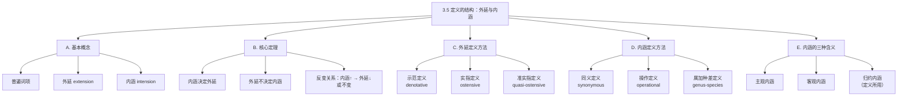

**相关笔记：** [[3.4 定义及其用途]] | [[3.6 属加种差定义]]

> [!abstract] 概览
> 本节系统阐述定义的内在结构，围绕==外延==与==内涵==这两个核心概念展开。外延指一个词项所指谓的全部对象的汇集，内涵指该词项所指谓对象共同拥有的属性集。本节论证了"内涵决定外延，但外延不决定内涵"这一关键定理，并分别介绍了三种外延定义方法（示范定义、实指定义、准实指定义）和三种内涵定义方法（同义定义、操作定义、属加种差定义），最后区分了内涵的三种含义（主观内涵、客观内涵、归约内涵）。
> - **外延与内涵的定义**：外延是词项所指对象的集合，内涵是共同属性的集合
> - **内涵与外延的反变关系**：内涵增加则外延非递增
> - **六种定义方法**：三种外延定义 + 三种内涵定义
> - **内涵的三种含义**：主观内涵、客观内涵、归约内涵

---

## 一、知识结构总览

---

## 二、核心思想与证明技巧

> [!tip] 核心思想
> 1. ==外延与内涵的区分==：外延回答"这个词指哪些东西？"，内涵回答"这个词凭什么指这些东西？"二者分别从对象集合和属性集合两个维度刻画词项的意义。
> 2. ==内涵决定外延，但外延不决定内涵==：这是本节最重要的定理。知道一个词的内涵就能确定其外延，但知道外延（即知道哪些对象属于该类）却不能唯一确定内涵，因为不同的属性集可能恰好覆盖同一组对象。
> 3. ==反变关系==：对一个词项增加内涵（添加更多限定属性），其外延不会增大——要么缩小，要么保持不变。

### 关键理解

1. **普遍词项（universal term）**
   - 适用场景：当我们讨论一个词项能否运用于多个对象时，该词项就是普遍词项。
   - 典型应用："行星"适用于水星、金星、地球、火星、木星、土星、天王星、海王星等多个对象，因此是普遍词项。与之相对，单称词项（如"地球"）只适用于一个对象。

2. **外延（extension）**
   - 适用场景：当我们需要明确一个词项的适用范围时。
   - 典型应用："行星"的外延是{水星, 金星, 地球, 火星, 木星, 土星, 天王星, 海王星}这个集合。外延关注的是"有哪些东西被这个词涵盖"。

3. **内涵（intension）**
   - 适用场景：当我们需要明确一个词项的意义标准或判别依据时。
   - 典型应用："摩天大厦"的内涵是"超过一定高度的建筑"。内涵关注的是"什么东西算作这个词所指的对象"，即判别标准。

4. **内涵决定外延的证明思路**
   - 逻辑链条：如果两个词项的内涵完全相同（即它们所指谓的对象共同拥有的属性集完全一致），那么它们正确适用的对象必然相同——因为满足相同属性集的对象集合是唯一的。
   - 反之不成立：两个词项可以有不同的内涵却指向相同的外延。经典例子："等边三角形"（定义为三条边等长的平面图形）和"等角三角形"（定义为三个内角相等的平面图形）——内涵不同，但外延完全相同（都是所有正三角形的集合）。

5. **反变关系**
   - 适用场景：当我们逐步增加一个词项的内涵时，观察其外延如何变化。
   - 典型应用（外延递减）："人" → "活着的人" → "活着的20岁以上的人" → "活着的20岁以上出生在墨西哥的人"——每一步都增加了一个限定属性（内涵递增），同时适用范围逐步缩小（外延递减）。
   - 典型应用（外延不变）："活着的人" → "活着的有脊骨的人" → "活着的有脊骨的不超过一千岁的人"——虽然内涵在增加，但因为所有活着的人都有脊骨且都不超过一千岁，外延并未改变。

6. **空外延**
   - 适用场景：有些词项虽然外延为空（不存在满足条件的对象），但其内涵仍然可以被完全理解。
   - 典型应用："吐火怪物"、"独角兽"、"当今的法国国王"——这些词项的外延为空集，但我们完全理解它们的意思（内涵非空）。

---

## 三、补充理解与易混淆点

### 补充理解

> [!info] 补充1：波菲利树——属种分类的历史根源
> **来源：** Porphyry (3rd century). *Isagoge* (《亚里士多德范畴导论》).
>
> 波菲利（Porphyry）在为亚里士多德《范畴篇》所作的导论中，提出了一套经典的"属-种"树形分类法（后世称为"波菲利树"）。该树形结构从最高的"属"（实体）出发，逐层通过"种差"进行划分——实体分为"物体"与"非物体"，物体分为"有生命的"与"无生命的"，有生命的又分为"有理性的"与"无理性的"——最终到达最具体的"种"（如"人"）。这一分类法直接体现了外延与内涵的反变关系：越往树的下方走，内涵越丰富（种差越多），外延越狭窄（包含的对象越少）。波菲利树是属加种差定义方法的历史根源，也是中世纪逻辑学中关于"共相"问题争论的重要背景。

> [!info] 补充2：密尔论外延与内涵
> **来源：** Mill, J.S. (1843). *A System of Logic*, Book I, Chapter VIII. — "Of Definition".
>
> 密尔（John Stuart Mill）在《逻辑体系》中对定义、外延与内涵进行了深入讨论。密尔认为，每一个普遍名称都既有"denotation"（外延，即名称所指称的事物）又有"connotation"（内涵，即名称所蕴含的属性）。密尔特别强调：内涵是名称的本质——名称之所以能指称某些事物，正是因为这些事物具有名称所蕴含的属性。这一观点与"内涵决定外延"的定理完全一致。密尔还区分了"connotative"（有内涵的）和"non-connotative"（无内涵的）名称，后者（如专有名词）只有外延而没有内涵，这一区分在当代分析哲学中仍有重要影响。

### 易混淆点

> [!warning] 误区：外延相同意味着内涵相同
> ❌ **错误理解：** 如果两个词项的外延完全相同，那么它们的内涵也一定相同。
> ✅ **正确理解：** 外延相同不保证内涵相同。"等边三角形"和"等角三角形"的外延完全一样（都是正三角形的集合），但它们的内涵不同——前者关注边的等长性，后者关注角的等量性。然而反过来，如果两个词项的内涵相同，则外延一定相同。
> **辨析：** 内涵到外延是"函数关系"（一个内涵唯一确定一个外延），但外延到内涵不是函数关系（一个外延可以对应多个不同的内涵）。用数学语言说，内涵→外延是单射的，但外延→内涵不是。

> [!warning] 误区：内涵增加外延一定减少
> ❌ **错误理解：** 每次给词项增加内涵，外延一定会缩小。
> ✅ **正确理解：** 严格来说，内涵增加时外延==非递增==——即外延要么缩小，要么保持不变。当新增的属性是被定义对象已经全部满足的属性时（如给"活着的人"加上"有脊骨的"），外延不会改变。
> **辨析：** 反变关系说的是"不会增大"，而不是"一定会减小"。这一点在形式上可以表述为：若内涵 $I_1 \subset I_2$（$I_2$ 是 $I_1$ 的真超集），则外延 $E_1 \supseteq E_2$（$E_2$ 是 $E_1$ 的子集）。

> [!warning] 误区：空外延的词项没有意义
> ❌ **错误理解：** 如果一个词项的外延为空（如"独角兽"），那么这个词项就是无意义的。
> ✅ **正确理解：** 空外延的词项仍然有完全可理解的内涵。"独角兽"的内涵是"一种形似马、额头上有一根螺旋形独角的神话生物"——我们完全理解这个描述，只是现实中不存在满足这些属性的对象。
> **辨析：** 内涵的独立性是理解虚构话语、反事实条件句和科学假说的逻辑基础。许多有意义的科学概念（如"理想气体"、"绝对光滑平面"）在现实中也不存在，但其内涵对于理论推理至关重要。

---

## 四、习题精选

> [!todo] 习题概览
> | 题号 | 来源 | 核心考点 | 难度 |
> |:-----|:-----|:---------|:-----|
> | 1 | 教材习题I | 外延与内涵的区分 | ⭐ |
> | 2 | 教材习题II | 反变关系的应用 | ⭐⭐ |
> | 3 | 教材习题III | 定义方法的识别 | ⭐⭐ |

### 题1：外延与内涵的区分

> [!problem] 题目
> 对于以下每一对词项，说明它们的外延是否相同，内涵是否相同，并解释理由。
>
> (a) "等边三角形"与"等角三角形"
> (b) "医生"与"内科医生"

> [!faq]- 解答
> **(a) "等边三角形"与"等角三角形"**
> **[步骤1]** 分析外延：等边三角形是三条边等长的三角形，等角三角形是三个内角相等的三角形。由欧几里得几何定理可知，三角形三边等长当且仅当三内角相等，因此二者的外延完全相同——都是所有正三角形的集合。
> **[步骤2]** 分析内涵：虽然外延相同，但内涵不同。"等边三角形"的内涵涉及"边的等长性"，而"等角三角形"的内涵涉及"角的等量性"。这是两个不同的属性集。
> **[步骤3]** 结论：外延相同，内涵不同。这印证了"外延不决定内涵"的定理。
>
> **(b) "医生"与"内科医生"**
> **[步骤1]** 分析外延：所有内科医生都是医生，但并非所有医生都是内科医生（还有外科医生、儿科医生等）。因此"内科医生"的外延是"医生"外延的真子集。
> **[步骤2]** 分析内涵："内科医生"的内涵包含了"医生"的所有内涵属性，另外还增加了"专门从事内科诊疗"这一属性。因此"内科医生"的内涵比"医生"更丰富。
> **[步骤3]** 结论：外延不同（后者是前者的真子集），内涵不同（后者更丰富）。这印证了反变关系。
> $\blacksquare$

### 题2：反变关系的应用

> [!problem] 题目
> 考虑以下词项序列：
> "动物" → "哺乳动物" → "犬" → "金毛猎犬"
>
> 说明这一序列中外延和内涵的变化趋势，并判断每一步是否都满足反变关系。

> [!faq]- 解答
> **[步骤1]** 分析外延变化：
> - "动物"的外延：所有动物（包括哺乳类、鸟类、爬行类、鱼类、昆虫等）
> - "哺乳动物"的外延：所有哺乳动物（动物的子集）
> - "犬"的外延：所有犬类动物（哺乳动物的子集）
> - "金毛猎犬"的外延：所有金毛猎犬（犬的子集）
> 外延逐步缩小：$E_{动物} \supset E_{哺乳动物} \supset E_{犬} \supset E_{金毛猎犬}$
>
> **[步骤2]** 分析内涵变化：
> - "动物"的内涵：有生命、能运动、需要摄取营养等基本属性
> - "哺乳动物"的内涵：在"动物"基础上增加"胎生、哺乳"等属性
> - "犬"的内涵：在"哺乳动物"基础上增加"属于犬科犬属"等属性
> - "金毛猎犬"的内涵：在"犬"基础上增加"金色长毛、特定体型和性情"等属性
> 内涵逐步丰富：$I_{动物} \subset I_{哺乳动物} \subset I_{犬} \subset I_{金毛猎犬}$
>
> **[步骤3]** 验证反变关系：每一步都是内涵增加（添加了新的种差属性），外延缩小（从更大的类进入更小的子类）。因此每一步都满足反变关系：内涵↑ → 外延↓。
> $\blacksquare$

### 题3：定义方法的识别

> [!problem] 题目
> 以下每个定义分别属于哪种定义方法（示范定义、实指定义、准实指定义、同义定义、操作定义、属加种差定义）？
>
> (a) "febrile"的意思是"发烧的"。
> (b) "桌子"就是指——（伴随手势指向一张桌子）——这个东西。
> (c) "酸"是指能使石蕊试纸变红的物质。
> (d) "哺乳动物"是指以乳汁哺育幼崽的恒温脊椎动物。

> [!faq]- 解答
> **(a)** "febrile"的意思是"发烧的"。
> → **同义定义（synonymous definition）**。提供了一个意义已知的同义词"发烧的"来解释外来词"febrile"。
>
> **(b)** "桌子"就是指——（伴随手势指向一张桌子）——这个东西。
> → **实指定义（ostensive definition）**。纯粹通过手势指向被定义对象来定义。
>
> **(c)** "酸"是指能使石蕊试纸变红的物质。
> → **操作定义（operational definition）**。通过特定的操作行为（将物质作用于石蕊试纸）及其产生的特有结果（试纸变红）来定义词项。这符合布里奇曼的操作主义原则：词项被正确运用当且仅当特定操作产生特定结果。
>
> **(d)** "哺乳动物"是指以乳汁哺育幼崽的恒温脊椎动物。
> → **属加种差定义（genus-species definition）**。属 = "恒温脊椎动物"（较大的类），种差 = "以乳汁哺育幼崽"（将哺乳动物与爬行动物、鸟类等其他恒温脊椎动物区分开来的性质）。
> $\blacksquare$

---

## 五、视频学习指南

> [!info] 视频资源
> | 资源 | 链接 | 对应内容 | 备注 |
> |:-----|:-----|:---------|:-----|
> | 本节暂无推荐视频资源。 | — | — | 教材本身提供了丰富的实例（如等边三角形与等角三角形的经典案例），足以掌握本节内容。建议结合教材中的例子逐一验证反变关系。 |

---

## 六、教材原文

> [!quote] 教材原文
> **来源：** 逻辑学导论 第15版，第3章第5节
>
> "普遍词项（universal term）是可以运用于一个以上对象的类的词项。例如，'行星'这一词项适用于水星、金星、地球、火星、木星、土星、天王星和海王星。一个普遍词项正确适用的所有对象的汇集就是该词项的**外延**（extension）。一个普遍词项指谓的所有对象并且仅仅那些对象共同拥有的属性集就是该词项的**内涵**（intension）。"
>
> "内涵决定外延，但外延不决定内涵。两个词项可以具有不同内涵但外延相同，而具有不同外延的词项不可能有同样内涵。"
>
> "对一个词项增加内涵（即添加新的属性），其外延不会增大。这种反向变化关系被称为内涵与外延的**反变关系**（inverse variation）。"

---

## 参见 Wiki

- [[命题]] — 命题是逻辑学的基本单位，定义的精确性直接影响命题的真值判定
- [[论证]] — 论证中的词项必须定义清晰，否则会导致歧义谬误
- [[3.6 属加种差定义]] — 内涵定义方法中适用范围最广的一种，下一节详细讨论
- [[3.4 定义及其用途]] — 前一节讨论了定义的功能和必要性，为本节的结构分析奠定基础
- [[外延与内涵]] — 外延与内涵的完整概念页
- [[外延-vs-内涵]] — 外延与内涵的对比分析

#学习/逻辑学/定义的结构
