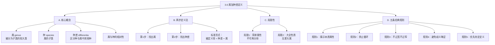

**相关笔记：** [[3.5 定义的结构：外延与内涵]]

> [!abstract] 概览
> 本节详细讨论内涵定义方法中适用范围最广的一种——==属加种差定义==（也称分析定义）。该方法通过两步完成：先找出被定义项所属的较大的类（属），再找出将其与属中其他种区分开来的独特性质（种差）。本节阐明了"属"和"种"的相对性，展示了属加种差定义的标准形式，分析了该方法的两种固有局限性（不适用于简单属性词项和"大全"性质词项），最后系统阐述了定义的五条经典规则。
> - **属与种的概念**：属和种是相对术语，同一个类既可以作为属也可以作为种
> - **两步定义法**：找属 + 找种差
> - **两种局限性**：简单属性不可分析；大全类无更大属
> - **五条经典规则**：揭示本质、禁止循环、不过宽不过窄、避免歧义晦涩、优先肯定定义

---

## 一、知识结构总览

---

## 二、核心思想与证明技巧

> [!tip] 核心思想
> 1. ==属加种差定义的两步法==：定义一个词项，首先要确定它属于哪个更大的类（属），然后找出它在这个类中区别于其他成员的独特性质（种差）。定义的标准形式为：**被定义项 = 具有种差的属**。
> 2. ==属与种的相对性==："属"和"种"不是绝对的分类层级，而是相对关系。同一个类相对于其子类是"属"，相对于其更大的父类是"种"。
> 3. ==五条经典规则==：好的属加种差定义必须满足五条规则——揭示本质属性、禁止循环、不过宽不过窄、语言清晰无歧义、优先使用肯定形式。违反任何一条都会导致有缺陷的定义。

### 关键理解

1. **属（genus）**
   - 适用场景：当我们需要将一个概念归入更大的分类框架时。
   - 典型应用：定义"六边形"时，属是"多边形"——六边形是多边形这个更大类的一个子类。

2. **种（species）**
   - 适用场景：当我们需要指明属中的特定子类时。
   - 典型应用：定义"六边形"时，六边形就是"多边形"这个属中的一个种。

3. **种差（differentia）**
   - 适用场景：当我们需要将目标种与属中其他所有种区分开来时。
   - 典型应用："六条边"是六边形的种差——它将六边形与三角形、四边形、五边形等多边形的其他种区分开来。

4. **属与种的相对性**
   - 适用场景：理解分类体系的层级结构时。
   - 典型应用：
     - "三角形"相对于"不等边三角形、等腰三角形、等边三角形"是==属==（更大的类）
     - "三角形"相对于"多边形"是==种==（更小的子类）
     - 同一个"三角形"既可以是属也可以是种，取决于参照框架。

5. **两步法的标准操作**
   - 适用场景：为任何具有复杂属性的普遍词项构造定义时。
   - 典型应用：
     - "六边形" = "具有==六条边==的==多边形=="（种差 = 六条边，属 = 多边形）
     - "质数" = "==大于1且仅能为1和自身整除==的==自然数=="（种差 = 大于1且仅能为1和自身整除，属 = 自然数）
     - "显微镜" = "用于观察==微小物体==的==光学仪器=="（种差 = 用于观察微小物体，属 = 光学仪器）

6. **两种固有局限性**
   - 局限1：仅适用于暗含复杂属性的词汇。如果存在不可再分析的简单属性（如具体光谱段的颜色"红色"），则无法通过属加种差来定义——我们无法指出"红色"属于哪个更大的属并给出种差，因为颜色本身可能是最基本的感官属性。
   - 局限2：不能定义表达"大全"性质的词汇（如"存在"、"本体"、"客体"、"实体"）。这些词项所指称的是最广泛的类，没有更大的属可以归属——如果试图为"存在"找属，任何属本身都是"存在"的一种，这会导致循环。

7. **五条经典规则的逻辑依据**
   - 规则1（揭示本质属性）：定义的目标是捕捉词项的==归约内涵==，而非偶然特征。本质属性不必是内部物理特征，可以是起源（如"Stradivarius小提琴"的本质属性是Stradivari的Cremona工厂制造）、关系或用法。
   - 规则2（禁止循环）：如果被定义项出现在定义项中，定义就没有提供任何新信息。例如，用"建筑师是从事建筑工作的人"来定义"建筑师"是循环的，因为"建筑"和"建筑师"互相定义。
   - 规则3（不过宽不过窄）：定义项的外延必须与被定义项的外延完全一致。过宽则包含了不属于被定义项的对象，过窄则遗漏了属于被定义项的对象。
   - 规则4（避免歧义晦涩）：定义使用的语言必须比被定义项更清晰。如果定义项比被定义项更难理解，定义就失去了意义。但"晦涩"是相对的——对专家不晦涩的术语对初学者可能晦涩。
   - 规则5（优先肯定定义）：否定定义只能告诉我们某物"不是什么"，不能告诉我们它"是什么"。但本质否定的词项（如"秃头"、"孤儿"）只能用否定定义，因为它们本身就是通过缺乏某种属性来定义的。

---

## 三、补充理解与易混淆点

### 补充理解

> [!info] 补充1：罗宾逊对属加种差定义规则的经典分析
> **来源：** Robinson, R. (1950). *Definition*. Oxford University Press.
>
> 罗宾逊（Richard Robinson）在《定义》一书中对属加种差定义的五条传统规则进行了深入而批判性的分析。罗宾逊指出，这五条规则并非绝对不可违反的逻辑法则，而是实用的指导原则。例如，关于"规则1：定义应当揭示本质属性"，罗宾逊质疑了"本质属性"这一概念本身——在现代哲学中，"本质"的含义远不如亚里士多德时代那样清晰。关于"规则3：不过宽不过窄"，罗宾逊指出，在实际科学实践中，定义常常是逐步修正的——一个最初可能过宽或过窄的定义，随着科学认知的深入而不断被完善。罗宾逊的批判性分析提醒我们，定义规则是工具而非教条，应根据具体语境灵活运用。

> [!info] 补充2：亚里士多德论定义的本质
> **来源：** Aristotle. *Posterior Analytics*, Book II, Chapter 10.
>
> 亚里士多德在《后分析篇》第二卷第10章中系统讨论了定义的本质。亚里士多德认为，真正的定义不仅要说明"某物是什么"（即给出属和种差），还要揭示该事物的"为什么"（即因果结构）。在亚里士多德看来，一个完整的定义应当等同于事物的本质（essence），而本质是通过因果说明来把握的。例如，定义"雷声"不能仅仅说"云中的响声"（属加种差），而应当揭示其因果本质："火在云中熄灭时发出的声音"。这一观点表明，属加种差定义虽然是最基本的定义形式，但在追求深层科学理解时可能不够充分——它给出了分类位置，但不一定揭示了因果机制。

### 易混淆点

> [!warning] 误区：属和种是固定的分类层级
> ❌ **错误理解：** "属"总是比"种"高一个层级的固定范畴，一个词项要么是属要么是种。
> ✅ **正确理解：** "属"和"种"是==相对术语==。同一个类在不同的语境中可以既是属又是种。"三角形"相对于"等边三角形"是属，相对于"多边形"是种。"多边形"相对于"三角形"是属，相对于"平面图形"是种。
> **辨析：** 这类似于生物学分类中的层级关系——"哺乳动物"是"动物"的种，但又是"犬"的属。属种关系是一种相对的包含关系，而非固定的标签。

> [!warning] 误区：本质属性必须是内在物理特征
> ❌ **错误理解：** 定义所揭示的本质属性必须是对象自身的内在物理属性（如形状、颜色、材质）。
> ✅ **正确理解：** 本质属性（即归约内涵）可以是多种类型的属性，包括但不限于：==起源==（如Stradivarius小提琴的本质属性是Stradivari工厂制造）、==关系==（如"丈夫"的本质属性是与某女性有婚姻关系）、==用法或功能==（如"椅子"的本质属性是供人坐的家具）。
> **辨析：** 亚里士多德将本质属性分为四类（四因说）：质料因、形式因、动力因、目的因。现代定义中的"本质属性"可以对应其中任何一类，不必局限于形式因（形状结构）。

> [!warning] 误区：否定定义总是错误的
> ❌ **错误理解：** 所有否定定义都是不好的定义，定义必须使用肯定形式。
> ✅ **正确理解：** 规则5说的是"在可以用肯定定义的地方就不应当用否定定义"，而非"永远不能用否定定义"。对于==本质否定==的词项（如"秃头"=没有头发的人，"孤儿"=失去父母的孩子），否定定义不仅是可接受的，而且是必要的——因为这些概念本身就是通过"缺乏某种属性"来定义的。
> **辨析：** 判断是否应当使用否定定义的标准是：被定义项的本质是否本身就是否定的。如果是，则否定定义是恰当的；如果不是，则应优先使用肯定定义。

---

## 四、习题精选

> [!todo] 习题概览
> | 题号 | 来源 | 核心考点 | 难度 |
> |:-----|:-----|:---------|:-----|
> | 1 | 教材习题I | 属、种、种差的识别 | ⭐ |
> | 2 | 教材习题II | 五条规则的违反判定 | ⭐⭐ |
> | 3 | 教材习题III | 构造属加种差定义 | ⭐⭐ |

### 题1：属、种、种差的识别

> [!problem] 题目
> 对于以下每个属加种差定义，指出其属、种差和被定义项（种）：
>
> (a) "独裁者"是通过非宪法手段获取并行使绝对政治权力的人。
> (b) "温度计"是用于测量温度的仪器。
> (c) "毒药"是引起生物体功能障碍或死亡的物质。

> [!faq]- 解答
> **(a) "独裁者"是通过非宪法手段获取并行使绝对政治权力的人。**
> **[步骤1]** 被定义项（种）：独裁者
> **[步骤2]** 属：人（独裁者属于"人"这个更大的类）
> **[步骤3]** 种差：通过非宪法手段获取并行使绝对政治权力
> **[步骤4]** 验证：该种差能否将"独裁者"与"人"的其他种（如"民主选举的总统"、"普通公民"）区分开来？可以——普通公民和民选总统不会通过非宪法手段获取绝对权力。
>
> **(b) "温度计"是用于测量温度的仪器。**
> **[步骤1]** 被定义项（种）：温度计
> **[步骤2]** 属：仪器
> **[步骤3]** 种差：用于测量温度
>
> **(c) "毒药"是引起生物体功能障碍或死亡的物质。**
> **[步骤1]** 被定义项（种）：毒药
> **[步骤2]** 属：物质
> **[步骤3]** 种差：引起生物体功能障碍或死亡
> $\blacksquare$

### 题2：五条规则的违反判定

> [!problem] 题目
> 以下每个定义违反了属加种差定义的哪条规则（如果有的话）？请说明理由。
>
> (a) "建筑师"是从事建筑工作的人。
> (b) "人"是无羽毛的两足动物。
> (c) "面包是生命的拐杖。"
> (d) "几何学"是研究geometric figures的学科。

> [!faq]- 解答
> **(a) "建筑师"是从事建筑工作的人。**
> **[步骤1]** 检查循环性：定义项中出现了"建筑"一词，而被定义项是"建筑师"。"建筑"和"建筑师"共享同一词根，理解"建筑工作"需要先理解"建筑"，而理解"建筑"又可能需要理解"建筑师"。
> **[步骤2]** 判定：违反==规则2（禁止循环）==。定义项中隐含地使用了被定义项的同根词，未能提供独立于被定义项的说明。
>
> **(b) "人"是无羽毛的两足动物。**
> **[步骤1]** 检查外延匹配：这个定义是否只涵盖人，且涵盖所有人？第欧根尼拔光一只鸡的毛并展示说"看，这就是人！"——拔毛的鸡也是无羽毛的两足动物，但不是人。
> **[步骤2]** 判定：违反==规则3（定义过宽）==。定义项的外延大于被定义项的外延，包含了不属于"人"的对象。
>
> **(c) "面包是生命的拐杖。**
> **[步骤1]** 检查语言清晰度：这是一个比喻性表达。"拐杖"并非面包的真正属——面包不是拐杖的一种。这个句子用隐喻的方式表达"面包是维持生命所必需的"，但作为定义，它没有揭示面包的本质属性。
> **[步骤2]** 判定：违反==规则4（不能用比喻语言）==。比喻语言虽然生动，但不能作为严肃定义，因为它没有给出面包的属和种差。
>
> **(d) "几何学"是研究geometric figures的学科。**
> **[步骤1]** 检查语言清晰度：定义项中使用了"geometric figures"这一外语术语。如果读者不懂"geometric figures"，这个定义就无法帮助其理解"几何学"。使用被定义项的外语等价形式来定义，等同于用被定义项本身来定义。
> **[步骤2]** 判定：违反==规则2（禁止循环）==和==规则4（避免晦涩语言）==。使用被定义项的外语形式构成了一种隐蔽的循环定义。
> $\blacksquare$

### 题3：构造属加种差定义

> [!problem] 题目
> 请用属加种差的方法为以下词项构造定义，并明确指出属和种差。
>
> (a) "圆规"
> (b) "陨石"
> (c) "哑剧"

> [!faq]- 解答
> **(a) "圆规"**
> **[步骤1]** 找属：圆规是一种什么东西？→ 它是一种工具/绘图工具。
> **[步骤2]** 找种差：什么使圆规区别于其他绘图工具？→ 它有两个可调节的腿，用于画圆和弧线。
> **[步骤3]** 构造定义：圆规是具有两个可调节的腿、用于绘制圆形和弧线的绘图工具。
> - 属：绘图工具
> - 种差：具有两个可调节的腿、用于绘制圆形和弧线
>
> **(b) "陨石"**
> **[步骤1]** 找属：陨石是一种什么东西？→ 它是一种天体物质/岩石。
> **[步骤2]** 找种差：什么使陨石区别于其他岩石？→ 它是从太空坠落到地球表面的。
> **[步骤3]** 构造定义：陨石是从太空穿过大气层并坠落到地球表面的固态天体物质。
> - 属：固态天体物质
> - 种差：从太空穿过大气层并坠落到地球表面
>
> **(c) "哑剧"**
> **[步骤1]** 找属：哑剧是一种什么东西？→ 它是一种表演艺术/戏剧形式。
> **[步骤2]** 找种差：什么使哑剧区别于其他戏剧形式？→ 它不使用语言，仅通过肢体动作、面部表情和手势来叙事。
> **[步骤3]** 构造定义：哑剧是不使用语言而仅通过肢体动作、面部表情和手势来表现故事情节的戏剧表演形式。
> - 属：戏剧表演形式
> - 种差：不使用语言而仅通过肢体动作、面部表情和手势来表现故事情节
> $\blacksquare$

---

## 五、视频学习指南

> [!info] 视频资源
> | 资源 | 链接 | 对应内容 | 备注 |
> |:-----|:-----|:---------|:-----|
> | 本节暂无推荐视频资源。 | — | — | 建议通过教材中的大量实例（如"人是无羽毛的两足动物"的经典反例）来深入理解五条规则。可尝试自行构造定义并逐一检验是否违反规则。 |

---

## 六、教材原文

> [!quote] 教材原文
> **来源：** 逻辑学导论 第15版，第3章第6节
>
> "属加种差定义（definition by genus and differentia）也称为分析定义。其方法基于这样的观念：被定义的种可以通过指出它所属的属以及它在属中区别于其他种的独特性质（种差）来加以定义。"
>
> "'属'和'种'是相对术语。同一个类可以既是它子类的属，也可以是更大类的种。例如，三角形相对于不等边三角形是属，相对于多边形是种。"
>
> "定义的五条经典规则：(1) 定义应当揭示种的本质属性；(2) 定义不能循环；(3) 定义既不能过宽又不能过窄；(4) 定义不能用歧义的、晦涩的或比喻的语言；(5) 定义在可以用肯定定义的地方就不应当用否定定义。"

---

## 参见 Wiki

- [[命题]] — 精确定义是命题真值判定的基础，定义不清晰会导致命题含义模糊
- [[论证]] — 论证中的关键术语必须有清晰的属加种差定义，否则论证可能因词项歧义而失效
- [[3.5 定义的结构：外延与内涵]] — 前一节讨论了外延与内涵的基本概念，属加种差定义是一种内涵定义方法
- [[属加种差定义]] — 属加种差定义的完整概念页

#学习/逻辑学/属加种差定义
