# 第03章 语言与定义 — 章节汇总

---

## 一、全章知识框架

```mermaid
graph TB
    A["第3章 语言与定义"] --> B["3.1 语言的功能"]
    A --> C["3.2 情感语言、中性语言与论争"]
    A --> D["3.3 论争与含混性"]
    A --> E["3.4 定义及其用途"]
    A --> F["3.5 定义的结构：外延与内涵"]
    A --> G["3.6 属加种差定义"]

    B --> B1["信息性功能"]
    B --> B2["表达性功能"]
    B --> B3["指令性功能"]
    B --> B4["礼节性功能"]
    B --> B5["述行性功能"]
    B --> B6["功能 vs 形式的区分"]

    C --> C1["信息性意义 vs 情感性意义"]
    C --> C2["委婉语与语言操控"]
    C --> C3["事实歧见 vs 态度歧见"]

    D --> D1["I. 明显的实质论争"]
    D --> D2["II. 纯粹言辞之争"]
    D --> D3["III. 表面言辞实际实质的论争"]
    D --> D4["论争诊断流程"]

    E --> E1["被定义项与定义项"]
    E --> E2["规定定义"]
    E --> E3["词典定义"]
    E --> E4["精确定义"]
    E --> E5["理论定义"]
    E --> E6["说服定义"]

    F --> F1["外延 extension"]
    F --> F2["内涵 intension"]
    F --> F3["内涵决定外延"]
    F --> F4["反变关系"]
    F --> F5["外延定义 ×3"]
    F --> F6["内涵定义 ×3"]

    G --> G1["属、种、种差"]
    G --> G2["两步定义法"]
    G --> G3["两种局限性"]
    G --> G4["五条经典规则"]
```

---

## 二、核心知识点与重点公式汇总

### 3.1 语言的功能

> [!def] 语言的三种基本功能
> 1. **信息性功能**：传达信息，断定命题，或真或假
> 2. **表达性功能**：表达情感或态度，无真假值
> 3. **指令性功能**：引起或阻止行动，无真假值
>
> 补充功能：**礼节性功能**（社交礼仪）和**述行性功能**（语词即行为，如"我道歉"）

| 区分维度 | 功能（实际用途） | 形式（语法分类） |
|:---------|:---------------|:---------------|
| 关注点 | 说话者的意图 | 句子的表面结构 |
| 分类 | 信息性/表达性/指令性/礼节性/述行性 | 陈述句/感叹句/祈使句/疑问句 |
| 关系 | ==无严格对应==——语境决定实际功能 | |

**信息模式的二层区分**：句子所陈述的事实（命题内容）vs 关于说话者的事实（说话者的信念和态度）

### 3.2 情感语言、中性语言与论争

> [!def] 信息性意义 vs 情感性意义
> - **信息性意义**：语词所传达的命题内容，可判定真假
> - **情感性意义**：语词所引发的态度和情感反应，无真假值

| 歧见类型 | 信念层面 | 态度层面 | 解决途径 |
|:---------|:---------|:---------|:---------|
| ==纯粹事实歧见== | 有分歧 | 一致 | 调查、收集证据 |
| ==纯粹态度歧见== | 一致 | 有分歧 | 价值讨论、道德推理 |
| ==混合歧见== | 有分歧 | 有分歧 | 先解决事实，再讨论态度 |

**核心原则**：解决论争的第一步是明确论争的真正问题所在——是事实之争还是态度之争。

### 3.3 论争与含混性

> [!def] 三种论争类型
> 1. **明显的实质论争**：分歧不依赖词语含义（如地理事实、球队偏好）
> 2. **纯粹言辞之争**：统一词义即可消解（如"声音"=空气震动 vs 听觉体验）
> 3. **表面言辞但实际实质的论争**：澄清词义后实质分歧仍存（如"色情作品"的定义争论）

**论争诊断流程**：识别关键词汇 → 尝试澄清含义 → 检验分歧是否消解 → 判定论争类型

### 3.4 定义及其用途

> [!def] 定义的本质
> 定义总是对**符号**（而非对象）的定义。==被定义项（definiendum）==是需要被定义的符号，==定义项（definiens）==是用来说明被定义项意义的符号。

| 类型 | 功能 | 真值 | 典型例子 |
|:-----|:-----|:-----|:---------|
| ==规定定义== | 引入新符号 | 既不真也不假 | "googol" = $10^{100}$ |
| ==词典定义== | 报告已有用法 | 可真可假 | "bird" = 有羽毛的温血脊椎动物 |
| ==精确定义== | 消除模糊性 | 合理性标准 | "马力" = 745.7瓦 |
| ==理论定义== | 概括理论理解 | 取决于理论 | 行星三条件定义（IAU 2006） |
| ==说服定义== | 影响态度 | 不适用（修辞工具） | "社会主义" = 经济领域的民主 |

### 3.5 定义的结构：外延与内涵

> [!def] 外延与内涵
> - **外延（extension）**：词项正确适用的所有对象的汇集（"指哪些东西？"）
> - **内涵（intension）**：词项所指谓对象共同且仅有的属性集（"凭什么指这些东西？"）

**核心定理**：==内涵决定外延，但外延不决定内涵==

- "等边三角形"（三条边等长）和"等角三角形"（三内角相等）有**不同内涵**但**相同外延**
- **反变关系**：内涵增加 → 外延非递增（缩小或不变）

| 定义方法 | 类型 | 方法 | 局限 |
|:---------|:-----|:-----|:-----|
| ==示范定义== | 外延 | 列举词项指谓对象的范例 | 不同内涵的词项可能有相同外延 |
| ==实指定义== | 外延 | 通过手势指向被定义对象 | 受地域限制，手势有歧义 |
| ==准实指定义== | 外延 | 手势 + 描述性短语 | 假设了对描述短语的理解 |
| ==同义定义== | 内涵 | 提供同义词 | 很多词没有真正同义词 |
| ==操作定义== | 内涵 | 通过特定操作的结果来定义 | 仅涉及公共可重复操作 |
| ==属加种差定义== | 内涵 | 找属 + 找种差 | 不适用于简单属性和"大全"性质 |

**内涵的三种含义**：主观内涵（个人理解）→ 客观内涵（全部属性，需全知）→ ==归约内涵==（公共标准，定义所用）

### 3.6 属加种差定义

> [!def] 属加种差定义（Genus-Species Definition）
> 通过两步定义词项：(1) 找出被定义项所属的较大类（==属==，genus）；(2) 找出将被定义项与属中其他种区分开来的独特性质（==种差==，differentia）。
>
> 标准形式：**被定义项 = 具有种差的属**

**属与种的相对性**：同一个类相对于子类是"属"，相对于更大的父类是"种"。

| 规则 | 内容 | 违反后果 |
|:-----|:-----|:---------|
| ==规则1== | 揭示种的本质属性（归约内涵） | 定义不精确 |
| ==规则2== | 禁止循环（被定义项不出现在定义项中） | 定义无信息量 |
| ==规则3== | 不过宽也不过窄 | 外延不匹配 |
| ==规则4== | 避免歧义、晦涩或比喻语言 | 定义无法理解 |
| ==规则5== | 优先使用肯定定义 | 否定定义无法全面覆盖 |

**两种局限性**：(1) 不适用于不可再分析的简单属性（如颜色）；(2) 不适用于"大全"性质（如"存在"、"本体"）。

---

## 三、章节学习脉络

> [!info] 学习脉络
> 本章的学习路径是从"语言的用法"到"定义的工具"，层层递进：
>
> 1. **语言功能分析**（3.1）：认识语言的三种基本功能（信息性、表达性、指令性）及两种补充功能（礼节性、述行性），建立"功能 vs 形式"的核心区分
> 2. **语言的情感维度**（3.2）：理解信息性意义与情感性意义的区别，认识情感语言如何影响理性判断，掌握事实歧见与态度歧见的区分
> 3. **论争诊断**（3.3）：学会区分三种论争类型（实质论争、纯粹言辞之争、表面言辞实际实质的论争），掌握通过含混性分析来诊断论争的方法
> 4. **定义工具箱**（3.4）：系统学习五种定义类型（规定、词典、精释、理论、说服），理解不同类型的定义有不同的功能和评估标准
> 5. **定义的内在结构**（3.5）：掌握外延与内涵的区分，理解"内涵决定外延"的核心定理和反变关系，认识六种定义方法
> 6. **定义的黄金标准**（3.6）：深入学习属加种差定义的两步法和五条经典规则，掌握构造和评估定义的核心技能
>
> **学习建议**：第3章是逻辑学的"语言基础"——后续所有章节（第4章谬误、第5-6章直言逻辑、第7章日常论证、第8-10章命题逻辑）都依赖于清晰的语言分析和精确的定义。建议重点掌握：(1) 三种论争类型的诊断方法；(2) 五种定义类型的区分；(3) 属加种差定义的五条规则。这三项技能是批判性思维的核心工具。

---

## 四、跨章关联

| 本章概念 | 关联章节 | 关联类型 | 说明 |
|:---------|:---------|:---------|:-----|
| 语言的信息性功能 | [[第01章_逻辑学的基本概念-章节汇总]] | 基础关系 | 第1章的命题和论证都依赖语言的信息性功能 |
| 论证的重塑 | [[第02章_论证的分析-章节汇总]] | 工具关系 | 重塑论证时需要识别语言的情感性成分并剥离 |
| 三种论争类型 | [[第04章_谬误-章节汇总|第04章 谬误]] | 前置依赖 | 许多谬误（如歧义谬误）本质上是未识别的言辞之争 |
| 说服定义 | [[第04章_谬误-章节汇总|第04章 谬误]] | 前置依赖 | 说服定义是"定义谬误"的主要形式 |
| 定义的精确性 | [[第05章_直言命题-章节汇总|第05章 直言命题]] | 前置依赖 | 直言命题中词项的定义直接影响三段论的有效性 |
| 属加种差定义 | [[第06章_直言三段论-章节汇总|第06章 直言三段论]] | 直接应用 | 三段论中的词项需要有清晰的属种关系 |
| 语言的多功能性 | [[第07章_日常语言中的论证-章节汇总|第07章 日常语言中的论证]] | 直接应用 | 第7章大量运用3.1-3.3的语言分析工具 |
| 精确定义 | [[第08章 命题逻辑Ⅰ]] | 前置依赖 | 命题逻辑中的联结词需要精确定义以避免歧义 |
| 外延与内涵 | [[第01章_逻辑学的基本概念-章节汇总]] | 深化关系 | 第1章的命题概念在第3章通过外延/内涵得到更深入的分析 |

---

## 五、全章总复习题

> [!problem] 综合题1：论争诊断与定义类型识别
> 以下是一场关于"安乐死"的争论：
>
> 甲："安乐死是'谋杀'，因为它是故意结束一个人的生命。"
> 乙："安乐死不是'谋杀'，因为谋杀是非法的故意杀人，而安乐死在许多国家是合法的。"
> 丙："即使安乐死合法，它也是不道德的，因为人的生命是神圣不可侵犯的。"
> 丁："安乐死是'慈悲的解脱'，因为它帮助绝症患者摆脱无法忍受的痛苦。"
>
> 请完成以下任务：
> (a) 识别甲和乙之间的论争属于哪种类型，并说明理由。
> (b) 判断甲、乙、丁三人的定义分别属于哪种定义类型。
> (c) 丙的论点与甲、乙的论争之间是什么关系？

> [!faq]- 参考答案
> **(a) 甲和乙之间的论争类型分析：**
>
> 关键词是"谋杀"。甲用"谋杀"指"故意结束一个人的生命"（广义），乙用"谋杀"指"非法的故意杀人"（狭义，包含合法性要件）。
>
> 如果统一"谋杀"的定义——采用乙的定义（谋杀 = 非法故意杀人），那么甲说"安乐死是谋杀"就变成了"安乐死是非法故意杀人"，但安乐死在许多国家合法，所以甲的说法不成立。或者采用甲的定义（谋杀 = 任何故意杀人），则安乐死确实属于谋杀，乙的反对就消失了。
>
> **结论**：甲和乙之间的论争是==纯粹言辞之争==。双方对安乐死的**事实**（是否故意结束生命）没有分歧，分歧仅在于"谋杀"一词是否包含合法性要件。统一词义后论争即可消解。
>
> **(b) 三人的定义类型分析：**
>
> - ==甲的定义==："安乐死是谋杀"——将负面标签"谋杀"强加给安乐死，暗含道德谴责。这是一个==说服定义==，通过负面框架化来影响听众对安乐死的态度。
>
> - ==乙的定义==："谋杀是非法的故意杀人"——报告了"谋杀"一词在法律语境中的实际用法（包含非法性要件）。这是一个==词典定义==（或精确定义），它准确反映了法律对谋杀的标准定义。
>
> - ==丁的定义==："安乐死是'慈悲的解脱'"——使用高度正面的情感语言来定义安乐死。这也是一个==说服定义==，通过正面框架化（"慈悲"、"解脱"）来影响听众态度，与甲的说服定义方向相反。
>
> **(c) 丙的论点分析：**
>
> 丙的论点（"人的生命是神圣不可侵犯的"→安乐死不道德）是一个==纯粹态度歧见==。即使甲和乙的言辞之争得到解决（例如双方同意安乐死在法律上不属于"谋杀"），丙仍然认为安乐死是不道德的。丙的分歧不在事实层面（他可能承认安乐死可以合法化），而在价值层面（他认为无论如何结束生命都是错误的）。
>
> 这意味着丙与甲、乙的论争属于==实质论争==（态度上的），且这种分歧无法通过定义或事实调查来解决，只能通过道德推理和价值讨论来推进。
>
> $\blacksquare$

> [!problem] 综合题2：属加种差定义构造与规则检验
> 以下是一些有缺陷的定义。请对每个定义：(a) 指出它违反了属加种差定义的哪条规则（如果有的话）；(b) 用属加种差方法构造一个更好的定义。
>
> (1) "教师就是教书的人。"
> (2) "民主是一种政府形式，在这种形式中，民主的力量占主导地位。"
> (3) "游戏就是不是工作的事情。"
> (4) "恐惧就是对危险的恐惧。"

> [!faq]- 参考答案
> **(1) "教师就是教书的人。"**
>
> **违反规则**：==规则2（禁止循环）==。定义项中使用了"教书"一词，而被定义项是"教师"。"教书"和"教师"共享同一词根，理解"教书"需要先理解"教师"的概念，这构成了循环。
>
> **改进定义**：教师是在教育机构中专门从事教学工作的专业人员。
> - 属：专业人员
> - 种差：在教育机构中专门从事教学工作
>
> **(2) "民主是一种政府形式，在这种形式中，民主的力量占主导地位。"**
>
> **违反规则**：==规则2（禁止循环）==。定义项中出现了"民主"一词本身——用"民主"来定义"民主"是明显的循环定义。
>
> **改进定义**：民主是一种政府形式，在其中政治权力由公民通过投票或其代表来行使。
> - 属：政府形式
> - 种差：政治权力由公民通过投票或其代表来行使
>
> **(3) "游戏就是不是工作的事情。"**
>
> **违反规则**：==规则3（定义过宽）+ 规则5（不必要地使用否定定义）==。首先，"不是工作的事情"范围极广——睡觉、吃饭、散步都不是工作，但它们不是游戏。其次，使用了否定形式（"不是工作"），而"游戏"的本质不是否定的。
>
> **改进定义**：游戏是一种以娱乐为目的、遵循特定规则进行的自愿性活动。
> - 属：自愿性活动
> - 种差：以娱乐为目的、遵循特定规则进行
>
> **(4) "恐惧就是对危险的恐惧。"**
>
> **违反规则**：==规则2（禁止循环）==。定义项中出现了"恐惧"一词——用"恐惧"来定义"恐惧"完全没有提供任何新信息。
>
> **改进定义**：恐惧是个体面对感知到的威胁或危险时产生的强烈不安情绪。
> - 属：强烈不安情绪
> - 种差：由面对感知到的威胁或危险而引起
>
> $\blacksquare$

---

## 六、各节笔记索引

| 节号 | 标题 | 笔记链接 | 核心内容 |
|:-----|:-----|:---------|:---------|
| 3.1 | 语言的功能 | [[3.1 语言的功能]] | 三种基本功能+两种补充功能、功能vs形式、信息模式二层区分、Austin言语行为理论、Cohen v. California案例 |
| 3.2 | 情感语言、中性语言与论争 | [[3.2 情感语言、中性语言与论争]] | 信息性意义vs情感性意义、委婉语、事实歧见vs态度歧见、Stevenson描述性/评价性意义、Lakoff框架理论 |
| 3.3 | 论争与含混性 | [[3.3 论争与含混性]] | 三种论争类型、论争诊断流程、Wittgenstein"意义即使用"、Walton论争类型学 |
| 3.4 | 定义及其用途 | [[3.4 定义及其用途]] | 被定义项/定义项、五种定义类型（规定/词典/精释/理论/说服）、Robinson定义分类理论、IAU行星定义 |
| 3.5 | 定义的结构：外延与内涵 | [[3.5 定义的结构：外延与内涵]] | 外延vs内涵、内涵决定外延、反变关系、六种定义方法（外延×3+内涵×3）、内涵三种含义、波菲利树、密尔论外延与内涵 |
| 3.6 | 属加种差定义 | [[3.6 属加种差定义]] | 属/种/种差、两步定义法、两种局限性、五条经典规则、Robinson批判性分析、Aristotle论定义本质 |

#学习/逻辑学/第03章/章节汇总
