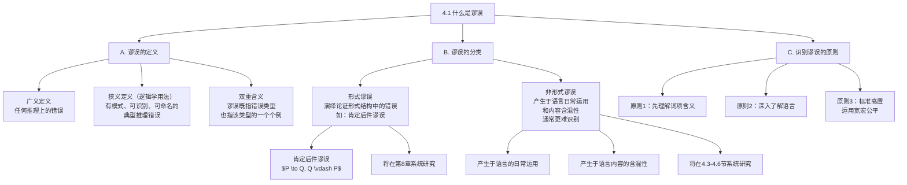

**相关笔记：** [[3.6 属加种差定义]] | [[4.2 谬误的分类]]

> [!abstract] 概览
> 本节引入逻辑学中"谬误"（fallacy）这一核心概念，阐明其精确含义与分类框架。核心知识点包括：
> - **谬误的广义与狭义定义**：广义上任何推理错误都是谬误，但逻辑学家关注的"谬误"是那些具有可识别模式的典型推理错误
> - **谬误作为错误类型**：每个谬误都是不正确论证的一种类型，犯有特定谬误的论证是该类型错误的一个个例
> - **形式谬误 vs 非形式谬误**：形式谬误出现于演绎论证的形式结构中（如肯定后件），非形式谬误产生于语言的日常运用和内容的含混性
> - **识别谬误的前提**：面对看似谬误的推理，首先应追问各词项的真正含义——识别谬误必须以深入理解语言为基础

---

## 一、知识结构总览

---

## 二、核心思想与证明技巧

> [!tip] 核心思想
> 1. ==谬误是典型化的推理错误==：并非所有推理错误都是逻辑学意义上的"谬误"。逻辑学家所关注的谬误是那些反复出现、具有可识别模式、能够被命名和分类的典型错误。一个偶然的推理失误不是谬误，但一个遵循某种错误模式的论证则是谬误。
> 2. ==谬误的双重指称==："谬误"一词有两种用法——它可以指一种错误类型（如"肯定后件谬误"），也可以指犯了该类型错误的一个具体论证（如"这个论证是一个谬误"）。前者是类型（type），后者是个例（token）。
> 3. ==形式谬误与非形式谬误的根本区别==：形式谬误可以通过检查论证的逻辑形式来识别——如果论证的形式是无效的演绎形式，则犯了形式谬误。非形式谬误则不能仅通过检查形式来发现，必须分析论证的内容和语言使用方式。

### 关键理解

1. **谬误的广义定义**
   - 适用场景：日常交流中，人们常把任何推理错误都称为"谬误"。
   - 典型应用：如果一个人从错误的前提推出了正确的结论（纯属巧合），广义上这也是一种推理错误，但逻辑学家通常不会称之为"谬误"，因为这种错误没有可识别的重复模式。

2. **谬误的狭义定义（逻辑学用法）**
   - 适用场景：逻辑学分析中，需要精确识别和命名的推理错误。
   - 典型应用：肯定后件谬误（$P \to Q, Q \vdash P$）是一种有明确模式、反复出现的推理错误，因此是逻辑学意义上的谬误。

3. **谬误作为错误类型 vs 谬误作为个例**
   - 适用场景：讨论具体论证是否犯了谬误时。
   - 典型应用：
     - 类型用法："肯定后件是一种形式谬误。"——这里"谬误"指错误类型。
     - 个例用法："马克思是唯物主义者，所以马克思的学说是科学的"这个论证是一个谬误。"——这里"谬误"指犯了该类型错误的具体论证。

4. **形式谬误：肯定后件谬误**
   - 适用场景：分析条件推理中的常见错误。
   - 典型应用：
     - 论证形式：如果 $P$ 则 $Q$；$Q$ 为真；因此 $P$ 为真。
     - 符号化：$P \to Q, Q \vdash P$（无效形式）
     - 实例："马克思是唯物主义者，所以马克思的学说是科学的。"——这里隐含的前提是"所有唯物主义者的学说都是科学的"（$P \to Q$），然后从"马克思是唯物主义者"（$P$）和"马克思的学说是科学的"（$Q$）推出结论。但即使 $P \to Q$ 和 $Q$ 都为真，也不能推出 $P$ 为真——可能有非唯物主义者的学说也是科学的。
     - 本质错误：==混淆了充分条件与必要条件==。$P \to Q$ 只说明 $P$ 是 $Q$ 的充分条件，不能从 $Q$ 反推 $P$。

5. **非形式谬误的特征**
   - 适用场景：分析日常论证中不涉及形式结构的推理错误。
   - 典型应用：非形式谬误通常更难识别，因为它们隐藏在语言的灵活运用中。例如，利用语词的歧义在不同含义之间偷换概念，或者用情感诉求代替逻辑推理。这些错误无法通过检查论证形式来发现，必须深入分析论证的内容和语境。

6. **识别谬误的前提条件**
   - 适用场景：在判定某论证是否犯了谬误之前。
   - 典型应用：面对一段推理，不应急于贴上"谬误"的标签。首先应当：
     - ==追问各词项的真正含义==——同一个词在不同语境中可能有不同含义
     - ==考察论证的完整结构==——是否有隐含前提需要补充
     - ==理解说话者的真实意图==——某些看似谬误的推理在特定语境下可能是合理的
   - 核心原则：==逻辑标准应当高置，但运用时应宽宏公平==——既不能降低标准放过真正的谬误，也不能过于严苛将合理的推理误判为谬误。

---

## 三、补充理解与易混淆点

### 补充理解

> [!info] 补充1：弗雷格论语言带来的思维陷阱
> **来源：** Frege, G. (1892). "On Sense and Reference" (*Über Sinn und Bedeutung*). In *Collected Papers on Mathematics, Logic, and Philosophy*.
>
> **戈特洛布·弗雷格（Gottlob Frege）** 是现代逻辑学的奠基人之一。他在《论意义与指称》等著作中深刻揭示了语言如何误导思维。弗雷格的核心洞见是：==自然语言是有缺陷的逻辑工具==。
>
> 弗雷格指出，自然语言中存在大量逻辑陷阱：
> - **同一性陈述的迷惑**："晨星是晨星"（平凡真理）与"晨星是暮星"（天文发现）在语言形式上完全相同，但前者仅涉及同一对象的自我等同，后者则揭示了两个不同名称（"晨星"和"暮星"）指称同一对象（金星）。自然语言无法区分这两种截然不同的认知意义。
> - **涵义与指称的混淆**：语词既有指称（所指对象）又有涵义（呈现对象的方式）。日常推理中经常混淆二者，例如从"某人相信晨星是明亮的"推出"某人相信暮星是明亮的"——即使晨星和暮星是同一颗行星，一个人可能不知道这一点。
>
> 弗雷格的分析直接支撑了本节的核心观点：==识别谬误之前必须先深入了解语言==。许多看似逻辑错误的推理，实际上源于自然语言在表达逻辑关系时的不精确性。

> [!info] 补充2：谬误研究的历史脉络
> **来源：** Hamblin, C.L. (1970). *Fallacies*. Methuen.
>
> **查尔斯·伦纳德·汉布林（C.L. Hamblin）** 在1970年出版的《谬误》一书是对谬误分类史最具影响力的批判性研究。汉布林指出：
> - ==传统的谬误分类体系存在严重缺陷==：自亚里士多德以来，谬误的分类几乎没有实质性进步，大多数教材（包括 Copi 的教材）仍然沿用亚里士多德在《辩谬篇》中奠定的基本框架。
> - ==标准处理（Standard Treatment）的问题==：汉布林将传统谬误教材的处理方式称为"标准处理"，并批评其存在三个根本问题：(1) 谬误的定义过于模糊；(2) 谬误的分类缺乏统一原则；(3) 许多被归为谬误的论证实际上在特定语境下是合理的。
> - ==谬误不是论证本身的属性==：汉布林主张，谬误不应当被看作论证的内在属性，而应当被看作==对话语境中的推理失败==。一个论证是否犯了谬误，取决于它在对话中扮演的角色和承担的论证义务。
>
> 汉布林的工作催生了谬误研究的"语用转向"——从关注论证的形式结构转向关注论证在对话语境中的功能，这一转向深刻影响了后来 pragma-dialectical（语用辩证）谬误理论的发展。

### 易混淆点

> [!warning] 误区：所有推理错误都是谬误
> ❌ **错误理解：** 只要在推理过程中犯了错，就是犯了谬误。
> ✅ **正确理解：** 逻辑学意义上的"谬误"特指那些==有可识别模式、反复出现、能够被命名==的典型推理错误。一个偶然的、无规律的推理失误不是谬误。
> **辨析：** 类比说明——在医学中，"疾病"有特定的病理模式和诊断标准，偶尔的身体不适不一定是"疾病"。同样，偶尔的推理失误不一定是"谬误"。谬误是推理中的"常见病"，有明确的症状和诊断标准。

> [!warning] 误区：谬误只出现在坏论证中
> ❌ **错误理解：** 只有完全错误的论证才会犯谬误。
> ✅ **正确理解：** 一个论证可能==前提为真、结论也为真，但推理过程犯了谬误==。谬误是关于推理过程的错误，不是关于结论真假的错误。肯定后件谬误就是一个典型例子：前提和结论可能都是真的，但从前提推出结论的推理方式是无效的。
> **辨析：** 判断谬误关注的是"从前提能否合理地推出结论"，而不是"结论本身是否正确"。一个正确的结论可能通过错误的推理方式得出——这在逻辑学中被称为"真理通过错误路径到达"。

> [!warning] 误区：形式谬误比非形式谬误更严重
> ❌ **错误理解：** 形式谬误是更严重的错误，非形式谬误是较轻微的错误。
> ✅ **正确理解：** 形式谬误和非形式谬误只是==分类上的区别==，不代表严重程度的区别。形式谬误可以通过检查逻辑形式来识别，非形式谬误则需要分析内容和语境，后者在实践中往往==更难识别==，因此可能更具欺骗性。
> **辨析：** 形式谬误就像数学计算中的公式错误——一旦知道公式，就能检查出来。非形式谬误则更像语言中的歧义和暗示——即使你很警惕，也可能不知不觉中被误导。

---

## 四、习题精选

> [!todo] 习题概览
> | 题号 | 来源 | 核心考点 | 难度 |
> |:-----|:-----|:---------|:-----|
> | 1 | 自编 | 区分形式谬误与非形式谬误 | ⭐⭐ |
> | 2 | 自编 | 识别谬误类型（肯定后件） | ⭐ |
> | 3 | 自编 | 谬误识别的前提条件 | ⭐⭐ |

### 题1：区分形式谬误与非形式谬误

> [!problem] 题目
> 判断以下论证犯的是形式谬误还是非形式谬误，并说明理由。
>
> (a) 如果天下雨，地面就会湿。地面湿了，所以天下雨了。
> (b) 这位政治家主张增加教育经费，但他自己上学时成绩很差，所以他的主张不值得采纳。
> (c) 所有鸟都会飞。企鹅是鸟。所以企鹅会飞。

> [!faq]- 解答
> **[步骤1]** 分析 (a)：
> - 论证形式：$P \to Q, Q \vdash P$
> - 这是经典的==肯定后件谬误==，属于==形式谬误==
> - 理由：错误出在演绎论证的形式结构上——从条件命题和后件为真，不能有效地推出前件为真。地面湿了可能是因为洒水车经过，不一定是因为下雨
>
> **[步骤2]** 分析 (b)：
> - 这个论证攻击的是主张提出者本人的特征（成绩差），而非主张本身的内容
> - 这属于==诉诸人身谬误==（Ad Hominem），是一种==非形式谬误==
> - 理由：错误不在于论证的形式结构，而在于前提（"他成绩差"）与结论（"他的主张不值得采纳"）之间缺乏真正的逻辑关联——一个人的主张是否合理，取决于主张本身的内容和证据，而非提出者的个人背景
>
> **[步骤3]** 分析 (c)：
> - 论证形式：所有 $A$ 是 $B$，$C$ 是 $A$，所以 $C$ 是 $B$
> - 这个形式本身是有效的（Barbara式三段论），但前提"所有鸟都会飞"是假的
> - 因此这个论证==不是谬误==——它是一个有效的演绎论证，只是前提为假
> - 注意：前提为假不等于犯了谬误。谬误是推理过程的错误，不是前提内容的错误
>
> $\blacksquare$

### 题2：识别谬误类型（肯定后件）

> [!problem] 题目
> 以下论证是否犯了肯定后件谬误？如果是，请指出其论证形式并说明错误所在。
>
> (a) 如果一个人是医生，那么他有医学学位。张三有医学学位，所以张三是医生。
> (b) 如果一个数能被6整除，那么它能被2整除。12能被2整除，所以12能被6整除。
> (c) 如果气温降到零度以下，水会结冰。气温降到零度以下了，所以水会结冰。

> [!faq]- 解答
> **[步骤1]** 分析 (a)：
> - 论证形式：$P \to Q$（如果是医生则有医学学位），$Q$（张三有医学学位），$\vdash P$（所以张三是医生）
> - 犯了==肯定后件谬误==
> - 错误分析：有医学学位的人不一定是医生——医学学位持有者可能是医学研究者、医学教授等。$P \to Q$ 只说明"医生"是"有医学学位"的充分条件，不是必要条件
>
> **[步骤2]** 分析 (b)：
> - 论证形式：$P \to Q$（如果能被6整除则能被2整除），$Q$（12能被2整除），$\vdash P$（所以12能被6整除）
> - 犯了==肯定后件谬误==
> - 错误分析：能被2整除的数不一定能被6整除——例如4能被2整除但不能被6整除。虽然12碰巧能被6整除（结论为真），但推理过程是无效的
>
> **[步骤3]** 分析 (c)：
> - 论证形式：$P \to Q$（如果气温降到零度以下则水会结冰），$P$（气温降到零度以下），$\vdash Q$（所以水会结冰）
> - 这是==肯定前件==（Modus Ponens），==不是谬误==
> - 分析：$P \to Q, P \vdash Q$ 是有效的论证形式。从条件命题和前件为真，可以有效推出后件为真
>
> $\blacksquare$

### 题3：谬误识别的前提条件

> [!problem] 题目
> 以下论证看似犯了谬误，但在进一步追问词项含义后，可能并非谬误。请分析每个论证，指出需要追问什么才能做出正确判断。
>
> (a) "所有金属在室温下都是固体。汞是金属。所以汞在室温下是固体。"——这个论证的前提"所有金属在室温下都是固体"是假的，所以它犯了谬误。
> (b) "如果一个人是单身汉，那么他是未婚的。张三是未婚的，所以张三是单身汉。"

> [!faq]- 解答
> **[步骤1]** 分析 (a)：
> - 需要追问：==前提为假是否等于犯了谬误？==
> - 答案：不等于。这个论证的形式是有效的三段论（所有 $A$ 是 $B$，$C$ 是 $A$，所以 $C$ 是 $B$），推理过程没有错误。谬误是推理方式的错误，不是前提内容的错误。一个前提为假但形式有效的论证不是谬误，只是一个不可靠（unsound）的论证。
> - 教训：在判定谬误之前，必须区分"前提为假"和"推理无效"这两种不同的情况。
>
> **[步骤2]** 分析 (b)：
> - 初步判断：论证形式是 $P \to Q, Q \vdash P$，看似犯了肯定后件谬误。
> - 需要追问：=="单身汉"的定义是什么？== 如果"单身汉"被定义为"未婚的成年男性"，那么"如果一个人是单身汉，那么他是未婚的"就是一个同义反复（$P \to P$），此时论证实际上变成了：$P \to P, P \vdash P$，这是有效的。
> - 进一步追问：即使"单身汉"定义为"未婚的成年男性"，从"张三是未婚的"能否推出"张三是单身汉"？不能——张三可能未成年，或者不是男性。因此，如果严格按照定义，这个论证仍然犯了肯定后件谬误（缺少"成年"和"男性"两个条件）。
> - 教训：==识别谬误之前必须先澄清词项的精确含义==。不同的定义可能导致对同一论证的不同判断。
>
> $\blacksquare$

> [!tip] 解题思路提示
> 识别谬误时遵循三步法：(1) **重构论证形式**——用符号表示论证的逻辑结构；(2) **检查形式有效性**——如果是演绎论证，判断其形式是否有效；(3) **分析内容与语境**——如果形式有效，检查前提是否为真；如果形式无效，判断是否属于某种已知的谬误模式。

---

## 五、视频学习指南

> [!info] 视频资源
> | 资源 | 链接 | 对应内容 | 备注 |
> |:-----|:-----|:---------|:-----|
> | 本节暂无推荐视频资源。 | — | — | 建议结合第8章命题逻辑的学习，深入理解形式谬误的识别方法。对于非形式谬误，可在后续4.3-4.6节的学习中逐步积累识别经验 |

---

## 六、教材原文

> [!quote] 教材原文
> **来源：** 逻辑学导论 第15版，第4章第1节
>
> "谬误（fallacy）一词在日常中有多种用法。在广义上，任何推理上的错误都可以称为谬误。但逻辑学家使用这个词的词义更为狭窄——他们所说的谬误是指那些典型错误，即出现于推理中的、有某种模式的、能够被识别和命名的错误。"
>
> "每个谬误都是不正确论证的一种类型。犯有特定类型谬误的一个论证也可以被称为一个谬误——即那种类型错误的一个个例。"
>
> "谬误可以分为两大类：形式谬误和非形式谬误。形式谬误是指那些以某种特定形式在演绎论证中出现的错误……非形式谬误则产生于语言的日常运用，产生于语言内容的含混性，它们通常比形式谬误更难识别。"
>
> "面对看似谬误的推理，首先应该追问各词项的真正含义。识别谬误之前必须先深入了解语言。逻辑标准应当高置但运用时应宽宏公平。"

---

## 参见 Wiki

- [[论证]] — 谬误是论证中推理过程的错误类型，理解论证的结构是识别谬误的基础
- [[有效性]] — 形式谬误的本质是演绎论证的无效性，理解有效性概念是识别形式谬误的前提
- [[演绎论证]] — 形式谬误出现于演绎论证中，与演绎论证的有效性标准密切相关
- [[谬误]] — 谬误概念的完整 Wiki 页面
- [[形式谬误-vs-非形式谬误]] — 形式谬误与非形式谬误的对比分析

#学习/逻辑学/谬误
