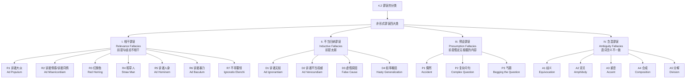

**相关笔记：** [[4.1 什么是谬误]] | [[4.3 相干谬误]]

> [!abstract] 概览
> 本节系统阐述非形式谬误的四大分类体系，为后续各节（4.3-4.6）的详细讨论建立框架。核心知识点包括：
> - **非形式谬误的四大类**：相干谬误（R1-R7）、不当归纳谬误（D1-D4）、预设谬误（P1-P3）、含混谬误（A1-A5），共19种具体谬误
> - **分类的基本原理**：每一类谬误对应论证中的一种特定缺陷——前提与结论不相干、前提太弱、前提预设了无根据的内容、语词含义不一致
> - **谬误分类的灵活性**：同一段论证可能被合理地归入不同谬误类别，语境是判断的关键
> - **分类体系的历史渊源**：可追溯至亚里士多德《辩谬篇》，经两千余年发展演变

---

## 一、知识结构总览

---

## 二、核心思想与证明技巧

> [!tip] 核心思想
> 1. ==非形式谬误的分类基于论证缺陷的类型==：四大分类分别对应论证中四种不同的根本缺陷——前提与结论缺乏逻辑关联（相干谬误）、前提对结论的支持力不足（不当归纳谬误）、前提暗中假定了需要证明的内容（预设谬误）、关键语词在论证中含义不一致（含混谬误）。
> 2. ==分类的目的是辅助识别而非强制归类==：任何一段话是否犯了某个谬误通常是可以商榷的。一个论证可能被合理地看作不同谬误的例子。分类体系是分析工具，不是僵化的标签系统。
> 3. ==语境至关重要==：同一段话语在不同语境中可能构成不同的谬误，也可能根本不构成谬误。判断谬误必须结合具体的对话语境、说话者的意图和论证的整体结构。

### 四大类谬误的核心特征

#### I. 相干谬误（Relevance Fallacies, R1-R7）

> [!def] 相干谬误
> ==相干谬误==是指那些前提与结论==在逻辑上不相干==，但被构造为看似相干的论证错误。前提可能具有心理上的说服力（如诉诸情感、诉诸大众），但缺乏逻辑上的支持力。

- **共同特征**：前提与结论之间没有真正的逻辑关联，论证的说服力依赖于心理因素而非理性因素
- **识别关键**：问自己——"即使前提为真，它能否为结论提供任何逻辑支持？"如果答案是否定的，则可能犯了相干谬误
- **具体谬误概览**：

| 编号 | 名称 | 英文名 | 核心错误 |
|:-----|:-----|:-------|:---------|
| R1 | 诉诸大众 | Ad Populum | 用"大家都这么认为"代替逻辑论证 |
| R2 | 诉诸情感/诉诸同情 | Ad Misericordiam | 用情感诉求代替逻辑论证 |
| R3 | 红鲱鱼 | Red Herring | 引入不相关话题转移注意力 |
| R4 | 稻草人 | Straw Man | 歪曲对方观点后加以攻击 |
| R5 | 诉诸人身 | Ad Hominem | 攻击人而非论证 |
| R6 | 诉诸暴力 | Ad Baculum | 用威胁代替论证 |
| R7 | 不得要领 | Ignoratio Elenchi | 结论与正在讨论的问题不相关 |

#### II. 不当归纳谬误（Inductive Fallacies, D1-D4）

> [!def] 不当归纳谬误
> ==不当归纳谬误==是指那些前提与结论==在逻辑上相干但太弱==，无法为结论提供充分支持的论证错误。前提提供了一些证据，但证据的强度远远不够。

- **共同特征**：前提确实与结论相关，但支持力严重不足——从有限或不恰当的证据得出了过于强烈的结论
- **识别关键**：问自己——"前提提供的证据是否足以支持结论？是否存在其他更合理的解释？"
- **具体谬误概览**：

| 编号 | 名称 | 英文名 | 核心错误 |
|:-----|:-----|:-------|:---------|
| D1 | 诉诸无知 | Ad Ignorantiam | 因为无法证明为假就断定为真（或反之） |
| D2 | 诉诸不当权威 | Ad Verecundiam | 引用不具相关权威性的来源 |
| D3 | 虚假原因 | False Cause | 错误地识别因果关系（无因之因） |
| D4 | 轻率概括 | Hasty Generalization | 从过少或非典型的样本得出普遍结论 |

#### III. 预设谬误（Presumption Fallacies, P1-P3）

> [!def] 预设谬误
> ==预设谬误==是指那些前提中==假定了太多没有根据的东西==的论证错误。论证暗中预设了需要被证明的结论，或者预设了未经证实的假设。

- **共同特征**：论证的"说服力"来自于循环——结论的真已经被前提暗中预设了，因此论证实际上什么也没有证明
- **识别关键**：问自己——"前提是否已经假定了结论？论证是否预设了某些未经证实的假设？"
- **具体谬误概览**：

| 编号 | 名称 | 英文名 | 核心错误 |
|:-----|:-----|:-------|:---------|
| P1 | 偶然 | Accident | 将一般规则不合理地应用于例外情况 |
| P2 | 复杂问句 | Complex Question | 问题中暗含未经证实的预设 |
| P3 | 丐题 | Begging the Question | 前提暗中假定了需要证明的结论 |

#### IV. 含混谬误（Ambiguity Fallacies, A1-A5）

> [!def] 含混谬误
> ==含混谬误==是指那些关键==语词或表达式在论证的不同地方有不同意思==，导致论证看似有效实则无效的错误。论证的说服力依赖于语词含义的暗中切换。

- **共同特征**：论证中某个关键语词或短语在前提中是一种含义，在结论中是另一种含义，推理过程利用了这种含义变化
- **识别关键**：问自己——"论证中的关键术语是否始终保持了同一含义？是否存在含义的暗中切换？"
- **具体谬误概览**：

| 编号 | 名称 | 英文名 | 核心错误 |
|:-----|:-----|:-------|:---------|
| A1 | 歧义 | Equivocation | 同一语词在不同位置有不同含义 |
| A2 | 双关 | Amphiboly | 利用句子结构的含混性 |
| A3 | 重音 | Accent | 通过强调不同部分改变含义 |
| A4 | 合成 | Composition | 将部分的属性错误地归于整体 |
| A5 | 分解 | Division | 将整体的属性错误地归于部分 |

---

## 三、补充理解与易混淆点

### 补充理解

> [!info] 补充1：亚里士多德《辩谬篇》——最早的谬误分类系统
> **来源：** Aristotle. *Sophistical Refutations* (《辩谬篇》/《智者谬误篇》), 约350 BCE.
>
> 亚里士多德的《辩谬篇》是西方逻辑史上==最早的系统性谬误分类==。亚里士多德将谬误分为两大类：
>
> 1. **语言谬误（依赖语言的谬误）**：共6种
>    - 歧义（Equivocation）
>    - 双关（Amphiboly）
>    - 合成（Composition）
>    - 分解（Division）
>    - 重音（Accent）
>    - 表达形式（Form of Expression）
>
> 2. **超语言谬误（不依赖语言的谬误）**：共7种
>    - 偶然（Accident）
>    - 以偏概全/逆偶然（Secundum Quid）
>    - 不知结论（Ignoratio Elenchi）
>    - 乞求前提/丐题（Petitio Principii）
>    - 假设要证明的后件（Non-Cause as Cause）
>    - 多个问题（Many Questions）
>
> 可以看到，Copi 教材的四大分类体系与亚里士多德的原始分类有直接的继承关系——含混谬误大致对应亚里士多德的"语言谬误"，相干谬误、不当归纳谬误和预设谬误则是对"超语言谬误"的进一步细分和扩展。两千多年来，谬误分类的基本框架保持了惊人的稳定性，这既说明了亚里士多德分类的深刻洞察力，也反映了汉布林所批评的"标准处理"的保守性。

> [!info] 补充2：汉布林对传统谬误分类的批判
> **来源：** Hamblin, C.L. (1970). *Fallacies*. Methuen.
>
> 汉布林在《谬误》一书中对以 Copi 教材为代表的传统谬误分类体系提出了三个层面的批判：
>
> 1. ==定义问题==：传统教材对"谬误"的定义过于模糊——"有模式的典型推理错误"这个标准缺乏精确性。什么算"模式"？什么算"典型"？不同的教材给出的谬误列表差异很大，这说明分类缺乏统一的理论基础。
>
> 2. ==分类问题==：传统分类的四大类（相干、归纳、预设、含混）之间的界限并不清晰。例如，"诉诸人身"既可以被看作相干谬误（攻击人而非论证），也可以被看作预设谬误（预设了"主张者的个人特征与主张的真假相关"这一未经证实的假设）。
>
> 3. ==语境问题==：传统分类倾向于将谬误看作论证本身的属性，而忽略了对话语境的重要性。汉布林主张，谬误应当被理解为==对话规则违反==——在特定的对话类型中，某些论证策略是不恰当的，但这并不意味着它们在所有语境中都不恰当。
>
> 汉布林的批判推动了谬误研究的"语用转向"，催生了如 van Eemeren 和 Grootendorst 的**语用辩证理论**（Pragma-Dialectical Theory）和 Walton 的**对话论证理论**（New Dialectic）等现代谬误分析框架。

> [!info] 补充3：合成谬误与分解谬误的深层逻辑
> **来源：** 教材第4章第6节（含混谬误的详细讨论）
>
> 合成谬误和分解谬误是含混谬误中最具哲学深度的两种。它们涉及一个根本性的逻辑问题：==部分的属性能否自动推广到整体？整体的属性能否自动归约到部分？==
>
> - **合成谬误**的哲学意义：在科学哲学中，"涌现论"（Emergentism）认为整体具有部分所没有的"涌现属性"。例如，水的"湿润性"不能从单个氢原子或氧原子的属性中推出。合成谬误提醒我们，不能简单地认为"对部分成立的就对整体成立"。
>
> - **分解谬误**的哲学意义：在社会科学中，方法论个人主义与方法论整体主义的争论与此密切相关。分解谬误提醒我们，不能简单地认为"对整体成立的就对部分成立"——例如，"这个国家是富裕的"不能推出"这个国家的每个公民都是富裕的"。
>
> 这两种谬误的深层逻辑在于：它们都涉及==整体与部分之间的属性传递问题==，而属性传递是否有效取决于具体的属性类型和整体-部分关系的性质。

### 易混淆点

> [!warning] 误区：每个谬误只能归入一个类别
> ❌ **错误理解：** 一个论证犯了谬误，就只能属于四大类中的某一类。
> ✅ **正确理解：** 同一个论证可能==同时涉及多种谬误机制==，可以从不同角度进行分析。例如，"诉诸人身"论证既可以说前提与结论不相干（相干谬误），也可以说它预设了"人的品格与论证的有效性相关"这一未经证实的假设（预设谬误）。
> **辨析：** 谬误分类是分析工具而非僵化标签。关键不是"贴对标签"，而是理解论证到底错在哪里。不同的分类角度可以揭示不同的错误层面。

> [!warning] 误区：相干谬误和不当归纳谬误的区别在于前提是否相干
> ❌ **错误理解：** 相干谬误的前提完全不相干，不当归纳谬误的前提完全相干。
> ✅ **正确理解：** 两类谬误的区别在于==前提相干的程度==，而非是否相干。相干谬误的前提与结论==在逻辑上不相干==（但可能在心理上有说服力），不当归纳谬误的前提与结论==有一定逻辑关联但支持力太弱==。
> **辨析：** 可以用一个连续谱来理解：完全不相干（相干谬误）——有一定关联但太弱（不当归纳谬误）——充分支持（好的归纳论证）——逻辑必然（有效的演绎论证）。两类谬误位于这个连续谱的不同位置，但边界是模糊的。

> [!warning] 误区：犯了谬误的论证结论一定为假
> ❌ **错误理解：** 如果一个论证犯了谬误，那么它的结论一定是假的。
> ✅ **正确理解：** 谬误是==推理过程的错误==，不是结论的错误。一个犯了谬误的论证可能有一个完全正确的结论——只是从给定的前提不能合理地推出该结论。
> **辨析：** 例如，"如果天下雨则地湿。地湿了，所以天下雨了。"这个论证犯了肯定后件谬误（推理无效），但"天下雨了"这个结论可能恰好为真。谬误告诉我们的是"这个论证不能证明结论"，而不是"结论为假"。

---

## 四、习题精选

> [!todo] 习题概览
> | 题号 | 来源 | 核心考点 | 难度 |
> |:-----|:-----|:---------|:-----|
> | 1 | 自编 | 将论证归入正确的谬误类别 | ⭐⭐ |
> | 2 | 自编 | 区分相干谬误与不当归纳谬误 | ⭐⭐ |
> | 3 | 自编 | 分析谬误分类的灵活性 | ⭐⭐⭐ |

### 题1：将论证归入正确的谬误类别

> [!problem] 题目
> 以下论证分别属于非形式谬误四大类中的哪一类？请指出具体的谬误名称（如果可以确定的话）。
>
> (a) "你应该买这款手机，因为所有明星都在用。"
> (b) "没有人能证明鬼不存在，所以鬼是存在的。"
> (c) "你承认你昨天偷了东西，对吧？——不管回答'是'还是'不是'，都等于承认偷了东西。"
> (d) "这件衣服的每一部分都很轻，所以这件衣服整体也很轻。"

> [!faq]- 解答
> **[步骤1]** 分析 (a)："你应该买这款手机，因为所有明星都在用。"
> - 前提："所有明星都在用这款手机"
> - 结论："你应该买这款手机"
> - 分析：明星是否使用某款手机与该手机是否值得购买之间没有逻辑关联。这个论证利用了从众心理，而非提供产品本身优劣的证据。
> - 归类：==相干谬误==，具体为==R1 诉诸大众（Ad Populum）==
>
> **[步骤2]** 分析 (b)："没有人能证明鬼不存在，所以鬼是存在的。"
> - 前提："没有人能证明鬼不存在"
> - 结论："鬼是存在的"
> - 分析：前提确实与结论有一定关联（关于鬼是否存在的证据状况），但"无法证明不存在"并不等于"存在"——这是从证据缺失得出了过于强烈的结论。
> - 归类：==不当归纳谬误==，具体为==D1 诉诸无知（Ad Ignorantiam）==
>
> **[步骤3]** 分析 (c)："你承认你昨天偷了东西，对吧？"
> - 分析：这个问题暗含了一个未经证实的预设——"你昨天偷了东西"。无论回答"是"（承认偷了）还是"不是"（否认偷了），都在对话框架内接受了"偷东西"这一预设的存在。
> - 归类：==预设谬误==，具体为==P2 复杂问句（Complex Question）==
>
> **[步骤4]** 分析 (d)："这件衣服的每一部分都很轻，所以这件衣服整体也很轻。"
> - 分析：这个论证的关键术语"轻"在前提和结论中的含义是一致的，但推理过程将部分的属性（每一部分都很轻）错误地推广到了整体（整件衣服很轻）。虽然在这个具体例子中结论可能为真，但推理方式是无效的——如果部分数量足够多，即使每个部分都很轻，整体也可能很重。
> - 归类：==含混谬误==，具体为==A4 合成（Composition）==
>
> $\blacksquare$

### 题2：区分相干谬误与不当归纳谬误

> [!problem] 题目
> 以下两个论证都涉及"权威"或"证据"的使用。请判断它们分别属于相干谬误还是不当归纳谬误，并说明区分的理由。
>
> (a) "这位著名演员说这款保健品非常好，所以这款保健品一定有效。"
> (b) "我的爷爷每天都喝白酒，他活到了95岁，所以喝白酒有益健康。"

> [!faq]- 解答
> **[步骤1]** 分析 (a)："这位著名演员说这款保健品非常好，所以这款保健品一定有效。"
> - 前提："著名演员推荐这款保健品"
> - 结论："这款保健品一定有效"
> - 分析：演员的专长领域是表演艺术，不是医学或营养学。引用演员对保健品的评价作为保健品有效的证据，其权威性完全不相关——演员在医学领域没有任何特殊知识或资格。
> - 归类：==不当归纳谬误==，具体为==D2 诉诸不当权威（Ad Verecundiam）==
> - 理由：前提（权威推荐）与结论（产品有效）之间有一定逻辑关联——如果引用的是真正的医学权威，这种论证方式是合理的。问题在于引用的权威==不当==，导致前提对结论的支持力太弱。因此属于不当归纳谬误而非相干谬误。
>
> **[步骤2]** 分析 (b)："我的爷爷每天都喝白酒，他活到了95岁，所以喝白酒有益健康。"
> - 前提："爷爷每天喝白酒且活到95岁"
> - 结论："喝白酒有益健康"
> - 分析：前提确实与结论相关（提供了一个"喝白酒+长寿"的个案），但从一个个案得出普遍性的健康结论，证据严重不足。爷爷的长寿可能归因于基因、饮食、运动等多种因素，不能简单地归因于喝白酒。
> - 归类：==不当归纳谬误==，具体为==D4 轻率概括（Hasty Generalization）==
> - 理由：前提提供了==太弱的归纳证据==——仅凭一个个案就得出普遍结论，样本量远远不够。
>
> **[步骤3]** 对比总结：
> - 两个论证都属于==不当归纳谬误==，因为它们的前提都提供了一些与结论相关的证据，但证据的支持力严重不足。
> - 如果将 (a) 改为"这位著名演员长得很帅，所以这款保健品一定有效"，则前提与结论完全不相干，此时应归类为==相干谬误==。
> - 关键区分标准：前提是否提供了==某种==（虽然不够的）逻辑支持？如果是→不当归纳谬误；如果完全不是→相干谬误。
>
> $\blacksquare$

### 题3：分析谬误分类的灵活性

> [!problem] 题目
> 以下论证可以被合理地归入不同的谬误类别。请从至少两个不同的角度分析它分别犯了什么谬误，并说明为什么两种归类都是合理的。
>
> "你有什么资格批评我的方案？你自己连大学都没上过！"

> [!faq]- 解答
> **[步骤1]** 第一种分析角度：==相干谬误——R5 诉诸人身（Ad Hominem）==
> - 论证结构：前提是"你没有上过大学"，结论是"你没有资格批评我的方案"。
> - 分析：一个人是否上过大学与他是否有能力批评某个具体方案之间==没有逻辑关联==。方案的优劣取决于方案本身的内容，而非批评者的教育背景。这个论证通过攻击批评者个人来回避对方案本身的讨论。
> - 归类理由：前提（教育背景）与结论（批评资格）在逻辑上不相干，因此属于相干谬误。

> **[步骤2]** 第二种分析角度：==预设谬误——P1 偶然（Accident）或隐含预设==
> - 分析：这个论证暗中预设了一个未经证实的假设——"只有上过大学的人才有资格批评方案"。这是一个以偏概全的预设，将"大学教育"这一偶然条件当作了"批评资格"的必要条件。
> - 归类理由：论证的说服力来自于一个==暗中预设的未经证实的假设==，因此也可以被看作预设谬误。

> **[步骤3]** 第三种分析角度：==不当归纳谬误——D4 轻率概括==
> - 分析：从"这个人没上过大学"这一个事实，概括出"这个人没有能力做出有价值的批评"这一普遍性结论。这是一个从单一特征推出全面能力的轻率概括。
> - 归类理由：前提提供的证据（教育背景）对于结论（批评能力）的支持力==严重不足==，因此也可以被看作不当归纳谬误。

> **[步骤4]** 总结：
> - 三种归类都是合理的，因为它们从不同角度揭示了论证的错误：
>   - 相干谬误角度：前提与结论缺乏逻辑关联
>   - 预设谬误角度：论证预设了未经证实的假设
>   - 不当归纳角度：从单一证据得出过度概括的结论
> - 这印证了本节的核心观点：==谬误分类是分析工具而非僵化标签==。同一段论证可以从多个角度进行分析，每种角度都能揭示论证缺陷的不同层面。
>
> $\blacksquare$

> [!tip] 解题思路提示
> 将论证归入谬误类别时，遵循四步法：(1) **提取论证结构**——明确前提和结论；(2) **检查前提与结论的逻辑关系**——是否相干？支持力是否足够？是否预设了未经证实的内容？语词含义是否一致？(3) **对照四大类特征**——匹配最突出的缺陷类型；(4) **考虑替代归类**——同一论证是否可以从其他角度分析？这有助于更全面地理解论证的缺陷。

---

## 五、视频学习指南

> [!info] 视频资源
> | 资源 | 链接 | 对应内容 | 备注 |
> |:-----|:-----|:---------|:-----|
> | 本节暂无推荐视频资源。 | — | — | 本节是分类框架的概述，具体谬误的详细讲解将在4.3-4.6节展开。建议先掌握四大类的核心区分标准，再进入各节的学习 |

---

## 六、教材原文

> [!quote] 教材原文
> **来源：** 逻辑学导论 第15版，第4章第2节
>
> "非形式谬误可以分为四大类：相干谬误、不当归纳谬误、预设谬误和含混谬误。"
>
> "相干谬误（Fallacies of Relevance）：在这类谬误中，前提与结论不相干，但被构造为看似相干。"
>
> "不当归纳谬误（Fallacies of Induction）：在这类谬误中，前提与结论相干但太弱，不足以支持结论。"
>
> "预设谬误（Fallacies of Presumption）：在这类谬误中，前提中假定了太多没有根据的东西。"
>
> "含混谬误（Fallacies of Ambiguity）：在这类谬误中，语词或表达式在论证的不同地方有不同意思。"
>
> "注意：任何一段话是否犯了某个谬误通常是可以商榷的。一个论证可能被合理地看作不同谬误的例子。语境至关重要。"

---

## 参见 Wiki

- [[论证]] — 谬误分类的对象是论证，理解论证的结构和评价标准是学习谬误的前提
- [[4.1 什么是谬误]] — 前一节讨论了谬误的基本概念和形式谬误与非形式谬误的区分，本节在此基础上展开非形式谬误的分类
- [[有效性]] — 形式谬误与有效性的概念直接相关，理解有效性有助于区分形式谬误与非形式谬误

#学习/逻辑学/谬误
