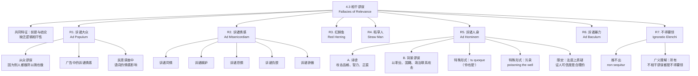

**相关笔记：** [[4.2 谬误的分类]] | [[4.4 不当归纳谬误]]

> [!abstract] 概览
> 本节系统阐述谬误分类中最大的一个类别——**相干谬误**（Fallacies of Relevance）。这类谬误的共同特征是：==前提与结论之间缺乏逻辑上的相干性==，论证者通过引入与结论真假无关的因素来赢得认同。核心知识点包括：
> - **R1. 诉诸大众（Ad Populum）**：通过唤起群众感情赢得认同，包括从众谬误和广告中的诉诸情感
> - **R2. 诉诸情感/诉诸同情（Ad Misericordiam）**：以同情心等情感为前提进行论证
> - **R3. 红鲱鱼（Red Herring）**：通过引入故意误导观众的事情来干扰推理
> - **R4. 稻草人（Straw Man）**：误读对手立场使其更极端、更不合理，然后攻击
> - **R5. 诉诸人身（Ad Hominem）**：不攻击命题而攻击命题提出者，含诽谤与背景谬误
> - **R6. 诉诸暴力（Ad Baculum）**：以暴力或暴力威胁争取赞同
> - **R7. 不得要领/不相干结论（Ignoratio Elenchi）**：前提和结论之间"断裂"，拒斥的不是对手原本观点

---

## 一、知识结构总览

---

## 二、核心思想与证明技巧

> [!tip] 核心思想
> 相干谬误的本质是==用非逻辑手段替代逻辑论证==。在有效的论证中，前提必须通过其**逻辑内容**来支持结论；而在相干谬误中，论证者转而利用听众的**情感、偏见、恐惧、从众心理**等非理性因素来赢得认同。识别相干谬误的关键技巧是：**始终追问"这个前提是否真的支持结论？"**——如果前提的真假与结论的真假之间没有逻辑联系，那么无论前提多么感人、多么有力，论证都是谬误的。

### R1. 诉诸大众（Ad Populum）

> [!def] 定义
> **诉诸大众**（Argumentum Ad Populum）是通过唤起群众的感情和热情来赢得对某个结论的认同，而非通过提供逻辑上相关的证据。

**核心形式：** 因为很多人都相信/做某事，所以某事是真的/对的。

**典型变体：**

1. **从众谬误（Bandwagon Fallacy）：** "大家都这么做，所以我也应该这么做。"——将"多数人做"等同于"应该做"，完全忽略了行为本身的正当性论证。
2. **广告中的诉诸情感：** 广告商不提供产品性能的逻辑论证，而是通过营造令人向往的生活方式画面来唤起消费者的购买欲望。
3. **民意调查中的语词操控：** 民意调查的结果受问题措辞的情感影响极大。同一政策用"遗产税"还是"死亡税"来描述，会得到截然不同的支持率。

> [!example] 示例
> "这款洗发水是全中国销量第一的洗发水，所以它一定是最好的洗发水。"——销量高不等于质量好，这是典型的诉诸大众。

### R2. 诉诸情感/诉诸同情（Ad Misericordiam）

> [!def] 定义
> **诉诸情感**（Argumentum Ad Misericordiam）是以同情心等情感反应作为前提来支持某个结论。论证者试图通过激发听众的怜悯、恐惧、嫉妒、仇恨或骄傲来替代逻辑推理。

**核心形式：** 因为某事令人同情/恐惧/愤怒，所以某事是真的/应该被做。

**情感类型：**

| 情感类型 | 拉丁名 | 典型场景 |
|:---------|:-------|:---------|
| 诉诸同情 | Ad Misericordiam | 律师激起陪审团对被告的同情 |
| 诉诸恐惧 | Ad Metum | "如果不通过这个法案，恐怖分子就会获胜" |
| 诉诸嫉妒 | Ad Invidiam | "富人交的税太少了，这不公平" |
| 诉诸仇恨 | Ad Odium | 将对手描绘为邪恶势力 |
| 诉诸骄傲 | Ad Superbiam | "作为一个伟大的民族，我们必须……" |

> [!example] 示例
> 最荒谬的经典例子：杀人犯的律师以其成为孤儿为由请求宽大处理——律师完全忽略了被告的犯罪事实，转而利用陪审团的同情心来影响判决。

### R3. 红鲱鱼（Red Herring）

> [!def] 定义
> **红鲱鱼**（Red Herring）是通过引入故意误导观众的事情来干扰推理。论证者抛出一个与原话题相关但实质上不同的问题，将讨论引向歧途。

**名称来源：** 猎狐时，有人用熏制的鲱鱼（红色）在狐狸的行进路线上拖出气味，干扰猎犬追踪狐狸的气味。猎犬被鲱鱼的气味吸引而偏离了真正的目标。

**核心特征：** 红鲱鱼与原话题有**表面的相关性**，但**实质上无关**。这使得它比完全无关的话题更具欺骗性。

> [!example] 示例
> 政治辩论中：甲批评政府的军事扩张政策；乙回应说："在反恐问题上立场软弱的人，没有资格谈论国防政策。"——乙没有回应甲关于军事扩张的批评，而是引入"反恐立场"这个红鲱鱼来转移话题。

### R4. 稻草人（Straw Man）

> [!def] 定义
> **稻草人**（Straw Man）是将对手的立场误读为更极端、更不合理、更容易攻击的版本，然后攻击这个被歪曲的版本（"稻草人"），而非对手的真实立场。

**核心风险：** 如果读者发现了论证者的夸张和歪曲，可能会反而转向对手那边——"稻草人"策略可能适得其反。

**与红鲱鱼的区别：**
- **红鲱鱼**：转移话题，引入一个不同的问题
- **稻草人**：不转移话题，但歪曲对手在同一话题上的立场

> [!example] 示例
> 甲："我认为我们应该适当增加教育经费。"乙："所以你是说要把所有国防预算都花在教育上，让我们的国家毫无防备？这太荒谬了！"——乙将甲的"适当增加"歪曲为"把所有国防预算都花在教育上"，然后攻击这个极端版本。

### R5. 诉诸人身（Ad Hominem）

> [!def] 定义
> **诉诸人身**（Argumentum Ad Hominem）是不攻击命题本身，而是攻击提出该命题的人。其隐含逻辑是："因为提出这个观点的人有某种缺陷，所以这个观点是错的。"

**两种主要形式：**

**(A) 诽谤（Abusive Ad Hominem）：** 直接攻击对手的品格、智力、正直等个人品质。
> [!example] 示例
> "你当然支持降低税率，你本来就是富人。"——不讨论降低税率是否合理，而是攻击支持者的身份。

**(B) 背景谬误（Circumstantial Ad Hominem）：** 以对手的职业、国籍、政治联系、经济利益等背景为攻击基础，暗示对手因为其背景而持有某种观点，因此该观点不可信。
> [!example] 示例
> "这位科学家反对转基因食品，但他曾为有机食品公司担任顾问，所以他的观点不可信。"——虽然利益冲突值得关注，但它不能单独推翻科学论证。

**特殊形式：**
- **Tu Quoque（"你也是"）：** "你自己也做过同样的事，所以你没有资格批评。"——对方是否言行一致与其论证是否正确无关。
- **污泉（Poisoning the Well）：** 在对手发言之前就预先贬低其可信度，使其后续的任何论证都被预先打上"不可信"的标签。

> [!warning] 重要限定
> 在法庭上质疑证人的**可信度**（如指出证人有前科、有利益冲突）是**合理的**，因为司法程序中证人的可信度本身就是裁决的相关因素。这不属于诉诸人身谬误。关键区别在于：==在法律语境中，证人的品格与其证词的可信度确实相关；但在纯粹的逻辑论证中，论证者的品格与论证的有效性无关==。

### R6. 诉诸暴力（Ad Baculum）

> [!def] 定义
> **诉诸暴力**（Argumentum Ad Baculum）是以暴力或暴力威胁来争取对某个结论的赞同。"强权即公理"（might makes right）是其核心信条。

**核心形式：** "如果你不接受这个结论，你就会受到伤害。"

**注意：** 威胁不需要是明确的暴力，含蓄的威胁（如暗示不合作将面临不利后果）同样构成诉诸暴力。

> [!example] 示例
> 老板对员工说："如果你不支持我的方案，你在这个公司的前途就到头了。"——用职业威胁替代逻辑论证。

### R7. 不得要领/不相干结论（Ignoratio Elenchi）

> [!def] 定义
> **不得要领**（Ignoratio Elenchi，拉丁语意为"无知于反驳"）是指论证中前提和结论之间存在"断裂"——论证者提出的结论并非对手原本的观点，而是论证者自行设定并加以攻击的一个不同命题。

**核心特征：** 论证者拒斥的不是对手的**真实观点**，而是论证者**错误强加**给对手的观点。

**与推不出（Non Sequitur）的关系：** "推不出"是拉丁语，意为"它不跟随"——结论不是从前提中逻辑地推出的。推不出是不得要领的同义表述。

**广义理解：** 从最广义的角度看，==所有相干谬误都是不得要领的特例==——因为它们都涉及前提与结论之间的不相干性。不得要领是相干谬误的"总称"。

> [!example] 示例
> 甲主张："我们应该在市区建设更多的公共自行车道。"乙回应道："交通拥堵的根本原因是私家车太多，建设自行车道解决不了任何问题。"——乙实际上论证的是"自行车道不能解决交通拥堵"，但甲的主张是"应该建设更多自行车道"（可能是为了环保、健康等目的），而非"自行车道能解决交通拥堵"。乙攻击的是一个甲并未主张的命题。

---

## 三、补充理解与易混淆点

### 补充理解

> [!info] 补充1：亚里士多德《修辞学》中的诉诸情感（Pathos）分析
> **来源：** Aristotle, *Rhetoric*, Book II, Chapters 1-11 (c. 350 BCE).
>
> 亚里士多德在《修辞学》中系统分析了三种说服手段：**诉诸逻辑（Logos）**、**诉诸情感（Pathos）** 和 **诉诸人格（Ethos）**。值得注意的是，亚里士多德并**不认为诉诸情感本身就是谬误**——他认为情感是说服的合法工具，关键在于是否**恰当地使用**。
>
> 亚里士多德对各种情感（愤怒、怜悯、恐惧、嫉妒、羞耻等）进行了精细的心理分析，指出每种情感都有其特定的认知前提。例如，他认为"愤怒"的前提是"某人对自己或其朋友受到了不合理的轻视"，因此要激起愤怒，论证者需要先让听众相信不公正的存在。
>
> 现代逻辑学将诉诸情感归为谬误，是因为在**逻辑论证**的语境中，情感反应与命题的真假无关。但在**修辞说服**的语境中，诉诸情感可以是合理的。这一区分提醒我们：==谬误是相对于论证语境而言的==，同一种说服手段在不同语境中可能有不同的评价。

> [!info] 补充2：沃尔顿对情感在论证中地位的分析
> **来源：** Walton, D. (1992). *The Place of Emotion in Argument*. Penn State University Press.
>
> 道格拉斯·沃尔顿（Douglas Walton）在其著作中对"情感在论证中的地位"进行了深入分析。沃尔顿认为，传统逻辑学对情感论证的处理过于简单化——将所有诉诸情感一概视为谬误是不恰当的。
>
> 沃尔顿提出了一个关键区分：==情感作为论证的前提 vs 情感作为论证的替代品==。如果情感本身就是论证的**合法前提**（例如在道德论证中，同情心可以是一个合理的考量因素），那么诉诸情感不一定是谬误。但如果情感被用来**替代**逻辑推理（例如用同情心来回避事实判断），那就是谬误。
>
> 沃尔顿的分析为我们识别相干谬误提供了更精细的工具：不能仅仅因为论证中出现了情感因素就判定为谬误，而要判断情感因素是否**替代了**本应提供的逻辑支持。

> [!info] 补充3：稻草人谬误在当代公共话语中的普遍性
> **来源：** Aikin, S.F. (2016). *Straw Man Arguments: A Pragmatic Approach*. In *Bad Arguments*, Wiley-Blackwell.
>
> 稻草人谬误在当代政治辩论、社交媒体和网络讨论中极为普遍。斯科特·艾金（Scott Aikin）在研究中指出，稻草人谬误之所以如此常见，是因为它服务于多个修辞目的：
>
> 1. ==降低反驳难度==：攻击一个被歪曲的立场比攻击真实立场更容易
> 2. ==激发听众情绪==：极端化的版本更容易引发听众的愤怒或嘲讽
> 3. **塑造对手形象**：通过反复歪曲对手立场，可以在公众心中建立一个负面的对手形象
>
> 艾金特别强调：在社交媒体时代，信息碎片化和回音壁效应使得稻草人谬误的危害更加严重——人们往往只接触到被歪曲的对手立场，而从未接触到对手的真实论证。

### 易混淆点

> [!warning] 误区：诉诸人身 = 任何对人的批评都是谬误
> ❌ **错误理解：** 只要论证中提到了对手的个人情况，就是诉诸人身谬误。
> ✅ **正确理解：** 诉诸人身谬误是指==用对人的攻击来替代对论证的回应==。如果同时回应了论证本身，顺带提及对手的个人情况，这不一定是谬误。此外，在特定语境中（如法庭上质疑证人可信度、评估专家证言时考虑其资质），对人的背景考察是**合理的**。
> **辨析：** 关键在于——对人的批评是否被用来**替代**对论证的逻辑回应。

> [!warning] 误区：红鲱鱼 vs 稻草人
> ❌ **错误理解：** 红鲱鱼和稻草人是同一种谬误。
> ✅ **正确理解：** 两者虽然都涉及偏离对手的真实立场，但机制不同：
> - **红鲱鱼**：==转移话题==——引入一个与原话题不同的问题来分散注意力
> - **稻草人**：==歪曲立场==——仍在同一话题上，但歪曲了对手的具体主张
> **辨析：** 红鲱鱼是"换个话题讨论"，稻草人是"换个版本讨论"。

> [!warning] 误区：所有诉诸情感都是谬误
> ❌ **错误理解：** 任何论证中出现情感因素都是谬误。
> ✅ **正确理解：** 只有当情感被用来**替代逻辑论证**时才是谬误。在某些论证语境中（如道德论证、审美论证），情感因素本身可以是==合法的前提==。例如，"虐待动物令人痛苦，所以不应该虐待动物"——这里的"令人痛苦"涉及情感反应，但它也是一个合理的事实前提。
> **辨析：** 区分"情感作为论证的替代品"（谬误）和"情感作为论证的合法成分"（非谬误）。

---

## 四、习题精选

> [!todo] 习题概览
> | 题号 | 来源 | 核心考点 | 难度 |
> |:-----|:-----|:---------|:-----|
> | 1 | 自编 | 识别诉诸人身与诉诸情感 | ⭐ |
> | 2 | 自编 | 区分红鲱鱼与稻草人 | ⭐⭐ |
> | 3 | 自编 | 综合识别多种相干谬误 | ⭐⭐⭐ |

### 题1：识别诉诸人身与诉诸情感

> [!problem] 题目
> 以下论证分别犯了哪种相干谬误？请指出谬误类型并分析其错误机制。
>
> (a) 议员A："我认为政府应该增加对可再生能源的补贴。"议员B："议员A曾经在石油公司工作过，他当然会反对传统能源，他的观点不值得考虑。"
>
> (b) 辩论中，正方主张应该废除死刑。反方回应："那些被死刑犯杀害的受害者家属有多么痛苦，你们考虑过吗？"

> [!faq]- 解答
> **[步骤1]** 分析 (a)：
> - 议员B没有回应"是否应该增加可再生能源补贴"这一实质问题
> - 议员B攻击的是议员A的个人背景（曾在石油公司工作）
> - 这是==诉诸人身——背景谬误（Circumstantial Ad Hominem）==
> - 错误机制：即使议员A确实曾在石油公司工作，这也不意味着他关于可再生能源的观点就是错的。论证的有效性取决于前提与结论之间的逻辑关系，而非提出者的背景
>
> **[步骤2]** 分析 (b)：
> - 反方没有回应正方关于"是否应该废除死刑"的论证
> - 反方转而描述受害者家属的痛苦，试图唤起听众的同情和愤怒
> - 这是==诉诸情感（Ad Misericordiam）==，具体为诉诸同情和诉诸仇恨
> - 错误机制：受害者家属的痛苦是一个真实存在的事实，但这个事实与"死刑是否应该被废除"之间没有逻辑上的必然联系。反方用情感反应替代了对正方论证的逻辑回应
>
> $\blacksquare$

### 题2：区分红鲱鱼与稻草人

> [!problem] 题目
> 以下两个论证分别犯了红鲱鱼谬误还是稻草人谬误？请说明理由。
>
> (a) 甲："我认为大学应该减少对标准化考试的依赖。"乙："你是说大学招生应该完全不看成绩，随便什么人都能上？那教育质量还怎么保证？"
>
> (b) 甲："我认为政府应该加强对食品安全的监管。"乙："你知道政府监管有多低效吗？看看那个浪费了上百亿的IT项目就知道了。政府连自己的项目都管不好，还想管食品安全？"

> [!faq]- 解答
> **[步骤1]** 分析 (a)：
> - 甲的主张是"减少对标准化考试的依赖"
> - 乙将甲的主张歪曲为"完全不看成绩，随便什么人都能上"——这是一个极端化的、更不合理版本
> - 乙攻击的是这个被歪曲的版本，而非甲的真实主张
> - 这是==稻草人谬误（Straw Man）==
> - 理由：乙没有转移话题（仍在讨论大学招生政策），但歪曲了甲的具体立场
>
> **[步骤2]** 分析 (b)：
> - 甲的主张是"加强食品安全监管"
> - 乙没有讨论食品安全监管的必要性或合理性，而是引入了"政府IT项目的低效"这一话题
> - 乙通过攻击政府的整体效率来转移对食品安全监管问题的讨论
> - 这是==红鲱鱼谬误（Red Herring）==
> - 理由：乙转移了话题——从"食品安全监管"转向了"政府IT项目的效率"，虽然两者都与政府有关，但实质上是不同的问题
>
> **[步骤3]** 关键区分总结：
> - 稻草人 = 同一话题 + 歪曲立场
> - 红鲱鱼 = 不同话题 + 转移注意力
>
> $\blacksquare$

### 题3：综合识别多种相干谬误

> [!problem] 题目
> 以下论证各犯了哪种相干谬误？请从七种相干谬误中选择最恰当的分类。
>
> (a) "如果你不支持这项法案，你的政治生涯就结束了。"
> (b) "全世界有超过十亿人相信占星术，所以占星术一定有道理。"
> (c) 甲："我主张我们应该提高最低工资标准。"乙反驳："所以你是想让所有小企业都破产，让所有人都失业？"

> [!faq]- 解答
> **[步骤1]** 分析 (a)：
> - 以政治生涯的终结作为威胁，迫使对方支持法案
> - 没有提供任何支持法案的逻辑论证
> - 这是==诉诸暴力（Ad Baculum）==——以含蓄的威胁（政治报复）来争取赞同
>
> **[步骤2]** 分析 (b)：
> - 以"十亿人相信"作为占星术有道理的依据
> - 信仰的人数与命题的真假之间没有逻辑联系
> - 这是==诉诸大众（Ad Populum）==——从众谬误的典型形式
>
> **[步骤3]** 分析 (c)：
> - 甲主张"提高最低工资标准"
> - 乙将甲的主张歪曲为"让所有小企业都破产，让所有人都失业"——极端化版本
> - 这是==稻草人谬误（Straw Man）==
>
> $\blacksquare$

> [!tip] 解题思路提示
> 识别相干谬误的三步法：
> 1. **找出论证的结论**——论证者想要我们接受什么？
> 2. **找出论证的前提**——论证者用什么来支持结论？
> 3. **追问相干性**——前提的真假是否与结论的真假有逻辑联系？如果无关，论证者实际利用的是什么因素（大众心理、情感、人身攻击、暴力威胁、话题转移、立场歪曲）？据此确定谬误类型。

---

## 五、视频学习指南

> [!info] 视频资源
> | 资源 | 链接 | 对应内容 | 备注 |
> |:-----|:-----|:---------|:-----|
> | Philosophy Tube: Logical Fallacies | [链接](https://www.youtube.com/watch?v=KE90VDl2xM4) | 相干谬误总览 | 英文，适合入门 |
> | Wireless Philosophy: Ad Hominem | [链接](https://www.youtube.com/watch?v=2iG518N2JnI) | 诉诸人身详解 | 英文，配合动画讲解 |
> | Gary N. Curtis: Fallacy Tutorial | [链接](https://www.fallacyfiles.org/) | 全部谬误类型 | 综合参考网站，含大量实例 |

---

## 六、教材原文

> [!quote] 教材原文
> **来源：** 逻辑学导论 第15版，第4章第3节
>
> **相干谬误的共同特征：**
> 相干谬误中，前提与结论之间的逻辑联系被某种非逻辑因素所替代。论证者不通过提供与结论真假相关的证据来说服听众，而是利用听众的情感、偏见或无知。
>
> **诉诸大众（Ad Populum）：**
> 通过唤起群众感情赢得认同。从众谬误——因为别人都做所以我也做。广告中的诉诸情感。民意调查中语词的情感影响。
>
> **诉诸情感（Ad Misericordiam）：**
> 以同情心等情感为前提。律师激起陪审团同情。最荒谬例子：杀人犯的律师以其成为孤儿为由请求宽大处理。还有诉诸嫉妒、诉诸恐惧、诉诸仇恨、诉诸骄傲。
>
> **红鲱鱼（Red Herring）：**
> 通过引入故意误导观众的事情来干扰推理。名字来源：用熏鲱鱼干扰猎狗追狐狸。政治中常见：批评军事扩张=在反恐问题上立场软弱。
>
> **稻草人（Straw Man）：**
> 误读对手立场（使其更极端、更不合理）然后攻击。风险：读者可能发现夸张而转向对手那边。
>
> **诉诸人身（Ad Hominem）：**
> 不攻击命题而攻击命题提出者。两种：(A)诽谤（攻击品格、智力、正直）(B)背景谬误（以对手职业、国籍、政治联系等为攻击基础）。特殊形式：tu quoque（"你也是"）、污泉（poisoning the well）。限定：法庭上质疑证人可信度是合理的。
>
> **诉诸暴力（Ad Baculum）：**
> 以暴力或暴力威胁争取赞同。"强权即公理"。含蓄的威胁也算。
>
> **不得要领（Ignoratio Elenchi）：**
> 前提和结论之间"断裂"。拒斥的不是对手原本观点而是错误强加的观点。所有不相干谬误广义上都是不得要领。推不出（non sequitur）。

---

## 参见 Wiki

- [[论证]] — 论证的结构与有效性评估，相干谬误是论证评估的重要内容
- [[情感语言与中性语言]] — 情感语言如何影响论证分析，与诉诸情感和诉诸大众密切相关
- [[4.2 谬误的分类]] — 谬误分类体系的总览
- [[4.4 不当归纳谬误]] — 另一大类非形式谬误
- [[诉诸人身]] — 诉诸人身谬误的完整概念页
- [[稻草人]] — 稻草人谬误的完整概念页
- [[稻草人-vs-红鲱鱼]] — 稻草人与红鲱鱼的对比分析

#学习/逻辑学/谬误
