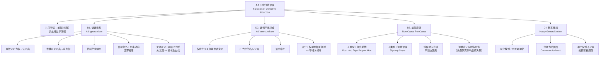

**相关笔记：** [[4.3 相干谬误]] | [[4.5 预设谬误]]

> [!abstract] 概览
> 本节阐述谬误分类中的第二大类别——**不当归纳谬误**（Fallacies of Defective Induction）。这类谬误的共同特征是：==论证虽然具有归纳论证的形式，但其前提对结论的支持过于薄弱==，无法为结论提供合理的或然性基础。核心知识点包括：
> - **D1. 诉诸无知论证（Ad Ignorantiam）**：因为某事未被证明为假就认为真，或未被证明为真就认为假
> - **D2. 诉诸不当权威（Ad Verecundiam）**：诉诸对所讨论问题不能合理宣称权威的"权威"
> - **D3. 虚假原因/无因之因（Non Causa Pro Causa）**：把不是原因的东西当作原因，含缘出前物与滑坡谬误
> - **D4. 轻率概括（Hasty Generalization）**：从少数例子到普遍概括，也称为逆偶然

---

## 一、知识结构总览

---

## 二、核心思想与证明技巧

> [!tip] 核心思想
> 不当归纳谬误的本质是==归纳跳跃过大==。归纳论证的前提本应为结论提供某种程度的或然性支持，但在不当归纳谬误中，这种支持过于薄弱，使得结论几乎得不到任何合理的证据基础。识别不当归纳谬误的关键技巧是：**始终追问"这些前提是否为结论提供了充分的证据支持？"**——如果前提与结论之间的"证据鸿沟"过大，论证就是不当归纳。

### D1. 诉诸无知论证（Ad Ignorantiam）

> [!def] 定义
> **诉诸无知论证**（Argumentum Ad Ignorantiam）是将**缺乏证据**等同于**有证据证明反面**的谬误。其核心错误在于：因为某事未被证明为假就认为真，或未被证明为真就认为假。

**核心形式：**
- "没有人能证明 X 是假的，所以 X 是真的。"
- "没有人能证明 X 是真的，所以 X 是假的。"

**错误机制：** 缺乏证据不等于有反面证据。某命题未被证明为真，可能只是因为==证据尚未被发现==、==证据已被摧毁==、==现有技术无法获取证据==等原因，而非因为该命题为假。

**典型应用场景：**

1. **伪科学中的常见策略：** 伪科学家经常利用诉诸无知来为其主张辩护——"没有人能证明我的理论是错的，所以它可能是对的。"这颠置了举证责任：==主张某事存在的人有义务提供正面证据，而非要求别人证明其不存在==。
2. **伽利略望远镜的例子：** 伽利略用望远镜发现了木星的卫星，但当时的反对者拒绝通过望远镜观察，声称"既然我们不知道望远镜是否可靠，我们就不能接受伽利略的发现。"——这是典型的诉诸无知：以"不知道"为理由拒绝接受证据。
3. **基因重组研究的反对：** 早期基因重组研究的反对者声称"没有人能证明基因重组是安全的，所以它一定是危险的。"——这也是诉诸无知：缺乏安全证据不等于有危险证据。

> [!warning] 重要区分：积极寻找证据后未发现 vs 根本没去找
> - **合理推断：** 如果经过==充分、认真的调查==后仍未发现某事存在的证据，那么推断该事不存在是合理的（如：经过全面搜索后未发现某物种的存在证据，可以合理推断该物种可能已灭绝）
> - **谬误推断：** 如果==根本没有进行过认真的调查==，就以"没有证据"为理由断言某事不存在，这是诉诸无知

> [!info] 合理例外：刑事法庭上的无罪推定
> 刑事法庭上的"无罪推定"（presumption of innocence）看似是诉诸无知——"因为没能证明被告有罪，所以被告无罪"——但实际上是一个==合理的法律原则==。这是因为：1) 法律体系刻意将举证责任分配给控方，以保护被告的权利；2) "无罪"在法律语境中意味着"未被证明有罪"，而非"事实上的清白"。这是一个法律制度设计，而非逻辑论证。

### D2. 诉诸不当权威（Ad Verecundiam）

> [!def] 定义
> **诉诸不当权威**（Argumentum Ad Verecundiam）是诉诸一个对所讨论问题不能合理宣称权威的人或来源。该谬误由约翰·洛克（John Locke）命名。

**核心形式：** "X 是某方面的权威，X 说了 Y，所以 Y 是真的。"——但 X 在 Y 所涉及的问题上并非真正的权威。

**典型应用场景：**

1. **广告中的名人证言：** 运动员推荐汽车、演员推荐保健品——这些名人在其所代言的产品领域并不具备专业知识。
2. **跨领域发言：** 物理学家评论政治目标、小说家判断战争罪犯——在其专业领域之外发表意见，其"权威"身份不能为观点提供额外的证据支持。
3. **引用不相关来源：** 在科学论证中引用文学作品、在历史论证中引用宗教经典作为权威证据。

**关键区分：**

| 情形 | 是否谬误 | 理由 |
|:-----|:---------|:-----|
| 引用物理学家的物理学观点 | 否 | 权威在相关领域 |
| 引用物理学家对政治的看法 | 是 | 权威在不相关领域 |
| 引用多位独立专家的一致意见 | 否 | 共识增加了可靠性 |
| 引用单一专家的争议性观点 | 可能 | 需考察该观点是否代表领域共识 |

> [!tip] 识别技巧
> 判断诉诸权威是否谬误，追问两个问题：1) 被引用的人是否在**该具体问题**上具有专业资质？2) 该问题是否存在**领域内的共识**？如果答案分别是"是"和"是"，那么诉诸权威通常是合理的；否则，很可能构成诉诸不当权威。

### D3. 虚假原因/无因之因（Non Causa Pro Causa）

> [!def] 定义
> **虚假原因**（Non Causa Pro Causa，拉丁语意为"不是原因的原因"）是指把不是原因的东西当作原因。论证者错误地认定两个事件之间存在因果关系，而实际上这种因果联系并不存在。

**子类型一：缘出前物（Post Hoc Ergo Propter Hoc）**

> [!def] 定义
> **缘出前物**（Post Hoc Ergo Propter Hoc，拉丁语意为"在此之后，因而必然由此造成"）是最常见的虚假原因形式。其错误在于：==仅仅因为事件 B 发生在事件 A 之后，就认为 A 是 B 的原因==。

**核心错误：** 纯粹的时间连续性不建立因果关系。B 在 A 之后发生，可能只是巧合，也可能有共同原因（C 同时导致了 A 和 B），也可能有其他原因。

> [!example] 示例
> "我昨天穿了红袜子，今天考试得了满分。所以穿红袜子能带来好成绩。"——穿红袜子（A）确实在考试得满分（B）之前，但两者之间没有因果关系。

**子类型二：滑坡谬误（Slippery Slope）**

> [!def] 定义
> **滑坡谬误**（Slippery Slope）是虚假原因的一种特殊形式。论证者声称某一步骤（通常是一个较小的变化）将不可避免地引发一系列连锁反应，最终导致灾难性后果，但实际上==这一连锁反应的必然性并未得到充分论证==。

**核心错误：** 滑坡论证假设每一步变化都会不可避免地导致下一步变化，但实际上每一步之间可能存在"断裂点"——社会、制度或个人可以在某个环节做出不同的选择，从而阻止连锁反应的继续。

> [!example] 示例
> "如果我们允许学校教授性教育，学生就会对性变得随便；学生变得随便，就会导致更多的青少年怀孕；青少年怀孕增多，就会导致社会道德沦丧。"——每一步之间的因果联系都未得到论证，整个"滑坡"的必然性是虚假的。

> [!warning] 重要限定：滑坡论证有时有价值
> 并非所有滑坡论证都是谬误。在某些情况下，==先例确实会影响后续决策==（"破窗效应"）。如果论证者能够为连锁反应中的每一步提供充分的因果证据，那么滑坡论证就是合理的。关键在于：滑坡论证是否提供了每一步因果联系的**证据支持**，还是仅仅依赖直觉上的"必然性"断言。

### D4. 轻率概括（Hasty Generalization）

> [!def] 定义
> **轻率概括**（Hasty Generalization）是从过少或不够典型的样本推出一个普遍概括。也称为**逆偶然**（Converse Accident）。

**核心形式：** "我观察了少数几个例子，它们都具有特征 X，所以所有此类事物都具有特征 X。"

**与"偶然"谬误的对称关系：**
- **偶然谬误（Accident）：** 将一个普遍规则不适当地应用于特殊情况
- **逆偶然（Converse Accident / Hasty Generalization）：** 从特殊情况不当地推出普遍规则
- 两者是"方向相反"的错误：一个是从一般到特殊的不当应用，一个是从特殊到一般的不当推广

> [!example] 示例
> "我认识两个法国人，他们都很傲慢。所以所有法国人都是傲慢的。"——从两个样本推出关于整个法国人群体的普遍概括，样本量远远不够。

> [!info] 补充说明：单个反例不足以推翻普遍规则
> 轻率概括的反面错误是：认为单个反例就能推翻一个有充分证据支持的普遍规则。例如，"我爷爷抽烟活到了90岁，所以吸烟无害"——单个反例不能推翻大量医学研究建立的普遍结论。这实际上也是轻率概括的一种形式：从单个例外推出普遍规则。

---

## 三、补充理解与易混淆点

### 补充理解

> [!info] 补充1：波普尔证伪主义与诉诸无知的关系
> **来源：** Popper, K. (1959). *The Logic of Scientific Discovery*. Routledge.
>
> 卡尔·波普尔（Karl Popper）的证伪主义（Falsificationism）与诉诸无知谬误有着深刻的哲学联系。波普尔提出：==科学理论不能被"证实"（verified），只能被"证伪"（falsified）==。一个理论无论经过多少次验证，都不能被最终证明为真；但只要有一个反例，就可以证明它为假。
>
> 这一观点看似支持诉诸无知（"理论不能被证明为真，所以它可能是假的"），但波普尔的本意恰恰相反。波普尔强调：
>
> 1. **举证责任在主张者一方**：提出科学理论的人有义务使其理论经受严格的检验，而非要求别人证明其理论为假
> 2. **"不能被证伪"不等于"已被证实"**：一个理论暂时未被证伪，只意味着它"目前经住了检验"，不意味着它是终极真理
> 3. **科学进步通过"猜想与反驳"实现**：科学家提出大胆的猜想（理论），然后试图证伪它们；被证伪的理论被淘汰，未被证伪的理论暂时保留
>
> 因此，波普尔的证伪主义实际上为识别诉诸无知提供了有力工具：==当某人声称"没有人能证明我的理论是错的"时，波普尔会回应"那你的理论是否做出了可以被检验和证伪的预测？如果不能，它就不是科学理论，而是伪科学。"==

> [!info] 补充2：休谟因果关系分析与虚假原因的关系
> **来源：** Hume, D. (1748). *An Enquiry Concerning Human Understanding*, Section IV-VII.
>
> 大卫·休谟（David Hume）对因果关系的经典分析是理解虚假原因谬误的哲学基础。休谟提出了一个令人震惊的观点：==我们从未直接"观察"到因果关系==，我们观察到的只是事件的**恒常连接**（constant conjunction）——事件 A 总是伴随事件 B 出现。
>
> 休谟的分析揭示了缘出前物谬误的深层根源：
>
> 1. **我们无法区分"真正的因果"和"偶然的前后相继"**：仅凭观察，我们无法确定 A 和 B 之间的恒常连接是因果联系还是巧合。例如，"公鸡打鸣"总是在"太阳升起"之前，但我们不会认为公鸡打鸣导致太阳升起——因为我们有更好的解释。但在许多情况下，我们可能没有更好的解释，就会错误地将前后相继归因为因果。
>
> 2. **因果推理的本质是心理习惯**：休谟认为，因果推理不是理性的产物，而是心理习惯的产物——当我们反复观察到 A 之后总是出现 B 时，我们的心灵就形成了"看到 A 就期待 B"的习惯。
>
> 3. **对"滑坡"的启示**：休谟的分析也解释了为什么滑坡谬误如此有说服力——我们的大脑天生倾向于在前后相继的事件之间建立因果联系，即使这种联系并不存在。滑坡谬误利用了这一心理倾向，将一系列可能完全无关的事件串联成一条"必然"的因果链。
>
> 休谟的分析提醒我们：==建立因果关系需要超越纯粹的时间连续性，需要考察因果机制、控制变量、排除替代解释==——这正是科学方法的核心。

> [!info] 补充3：洛克与诉诸不当权威的命名
> **来源：** Locke, J. (1690). *An Essay Concerning Human Understanding*, Book IV, Chapter XIX.
>
> 约翰·洛克（John Locke）在其著作《人类理解论》中首次系统讨论了诉诸不当权威的问题。洛克将这种谬误命名为 **Argumentum Ad Verecundiam**，其中 *verecundiam* 源于拉丁语 *verecundia*，意为"谦逊"或"敬畏"。
>
> 洛克指出，这种谬误的本质是==利用人们对权威的天然敬畏来替代独立的理性判断==。洛克认为，尊重权威在许多情况下是合理的（如在学习中信任老师、在实践中信任专家），但当这种尊重被用来**阻止**独立思考和质疑时，就变成了谬误。
>
> 洛克特别强调：==知识的最终来源不是权威，而是经验和理性==。即使是最伟大的权威也可能犯错，因此每一个命题都应基于其自身的证据来评估，而非基于提出者的身份。

### 易混淆点

> [!warning] 误区：诉诸无知 = 合理的审慎态度
> ❌ **错误理解：** "因为目前没有证据证明 X 为真，所以暂时不接受 X"是诉诸无知。
> ✅ **正确理解：** "暂时不接受 X"是一个合理的审慎态度，这不构成谬误。谬误在于：**从"没有证据证明 X 为真"直接推出"X 为假"**——这是从"不知道"到"知道不是"的不当跳跃。区分关键在于：==悬置判断（suspension of judgment）是合理的，但做出反面断言是不合理的==。
> **辨析：** "我不相信 X，因为没有证据"（合理审慎）vs "X 是假的，因为没有证据"（诉诸无知）。

> [!warning] 误区：所有诉诸权威都是谬误
> ❌ **错误理解：** 任何引用权威观点的论证都是诉诸不当权威。
> ✅ **正确理解：** 诉诸**不当**权威才是谬误。如果被引用的权威确实在相关领域具有专业知识，且其观点代表领域内的共识或经过同行评审，那么诉诸权威是**合理的归纳论证**。在日常生活中，我们不可能对所有问题都亲自调查，依赖权威是理性生活的必要组成部分。
> **辨析：** 区分"诉诸不当权威"和"合理的权威论证"的关键在于：权威是否在**相关领域**、观点是否经过**同行评审**、是否存在**领域共识**。

> [!warning] 误区：滑坡论证 = 谬误
> ❌ **错误理解：** 所有滑坡论证都是谬误。
> ✅ **正确理解：** 滑坡论证是否谬误取决于==连锁反应的每一步是否有充分的因果证据==。如果论证者能够为每一步提供合理的因果机制说明，滑坡论证就是合理的。例如，"如果我们允许政府未经授权监控公民通信，政府就可能扩大监控范围，最终可能导致全面的社会监控"——这个滑坡论证是有历史案例支持的（如20世纪的极权政权），因此不一定是谬误。
> **辨析：** 滑坡论证的谬误不在于"预测连锁反应"本身，而在于**未经论证就断言连锁反应的必然性**。

---

## 四、习题精选

> [!todo] 习题概览
> | 题号 | 来源 | 核心考点 | 难度 |
> |:-----|:-----|:---------|:-----|
> | 1 | 自编 | 识别诉诸无知与诉诸不当权威 | ⭐ |
> | 2 | 自编 | 区分虚假原因与滑坡谬误 | ⭐⭐ |
> | 3 | 自编 | 综合识别不当归纳谬误 | ⭐⭐⭐ |

### 题1：识别诉诸无知与诉诸不当权威

> [!problem] 题目
> 以下论证分别犯了哪种不当归纳谬误？请指出谬误类型并分析其错误机制。
>
> (a) "没有人能证明鬼魂不存在，所以鬼魂是存在的。"
>
> (b) 某牙膏广告中，一位著名电影明星说："我每天都用这款牙膏，我的牙齿非常白，所以这款牙膏是最好的。"广告以此作为牙膏质量好的证据。

> [!faq]- 解答
> **[步骤1]** 分析 (a)：
> - 论证从"没有人能证明鬼魂不存在"推出"鬼魂存在"
> - 将"缺乏反面证据"等同于"有正面证据"
> - 这是==诉诸无知论证（Ad Ignorantiam）==
> - 错误机制：没有人能证明鬼魂不存在，可能只是因为鬼魂的存在本质上难以证伪（如何证明一个否定性命题？），而非因为鬼魂确实存在。举证责任在主张鬼魂存在的一方——他们需要提供正面证据，而非要求别人证明鬼魂不存在
>
> **[步骤2]** 分析 (b)：
> - 电影明星在其专业领域（表演）是权威，但在牙膏质量评估方面不具备专业知识
> - 广告利用明星的知名度来为产品背书，但明星的个人体验不能代表产品的科学品质
> - 这是==诉诸不当权威（Ad Verecundiam）==
> - 错误机制：明星的牙齿白可能是由于多种因素（基因、饮食、专业美白护理等），不能归因于该款牙膏。更重要的是，明星在口腔卫生领域并非权威，其推荐不能为产品的有效性提供合理的证据支持
>
> $\blacksquare$

### 题2：区分虚假原因与滑坡谬误

> [!problem] 题目
> 以下论证分别犯了哪种不当归纳谬误？请说明理由。
>
> (a) "自从新市长上任以来，城市的犯罪率下降了。所以新市长的政策有效地降低了犯罪率。"
>
> (b) "如果我们允许学校给学生发放避孕套，学生就会认为性行为是被鼓励的；性行为增加就会导致更多的青少年怀孕和性病传播；最终整个社会的道德基础都会崩溃。"

> [!faq]- 解答
> **[步骤1]** 分析 (a)：
> - 论证观察到"新市长上任"（A）之后"犯罪率下降"（B），就断定 A 导致了 B
> - 这是==虚假原因——缘出前物（Post Hoc Ergo Propter Hoc）==
> - 错误机制：犯罪率下降可能有多种原因——经济改善、人口结构变化、前任政策延迟生效、统计方法改变等。仅仅因为两件事在时间上先后发生，不能建立因果关系。论证者没有排除其他可能的解释，也没有提供因果机制的说明
>
> **[步骤2]** 分析 (b)：
> - 论证声称一个起始事件（发放避孕套）将通过一系列连锁反应导致灾难性后果（社会道德崩溃）
> - 每一步之间的因果联系都未得到充分论证
> - 这是==虚假原因——滑坡谬误（Slippery Slope）==
> - 错误机制：论证假设了每一步变化都会不可避免地导致下一步变化，但实际上：
>   - 发放避孕套不等于鼓励性行为（可能只是提供安全保护）
>   - 性行为增加不必然导致更多怀孕和性病（如果有适当的性教育）
>   - 即使青少年问题增加，也不必然导致"整个社会道德基础崩溃"
>   - 每一步之间都可能存在"断裂点"
>
> **[步骤3]** 关键区分总结：
> - 缘出前物 = A 之后发生 B → A 导致 B（单步因果错误）
> - 滑坡谬误 = A → B → C → D → ... → 灾难（多步连锁因果错误）
> - 两者都是虚假原因的子类型，滑坡谬误可以看作缘出前物的"多步扩展版"
>
> $\blacksquare$

### 题3：综合识别不当归纳谬误

> [!problem] 题目
> 以下论证各犯了哪种不当归纳谬误？请从四种不当归纳谬误中选择最恰当的分类。
>
> (a) "我去了三家餐厅，菜品都很差。所以这个城市的所有餐厅都很差。"
>
> (b) "科学家至今无法解释金字塔是如何建造的，所以金字塔一定是外星人帮助建造的。"
>
> (c) 某人引用一位著名经济学家的话来支持其关于"地球年龄只有6000年"的主张。

> [!faq]- 解答
> **[步骤1]** 分析 (a)：
> - 从三家餐厅的体验推出"整个城市的所有餐厅都很差"
> - 样本量（3家）相对于总体（整个城市的所有餐厅）严重不足
> - 这是==轻率概括（Hasty Generalization）==
> - 也称为逆偶然（Converse Accident）：从少数特例不当推广为普遍规则
>
> **[步骤2]** 分析 (b)：
> - 从"科学家无法解释"推出"一定是外星人建造的"
> - 将"当前科学无法解释"等同于"有超自然原因"
> - 这是==诉诸无知论证（Ad Ignorantiam）==
> - 错误机制：科学无法解释某个现象，可能只是因为证据不足、技术有限或理论尚未发展，而非因为该现象只有超自然解释。论证者应该提供外星人建造的正面证据，而非利用"科学的无知"来支持自己的主张
>
> **[步骤3]** 分析 (c)：
> - 经济学家在经济学领域是权威，但在地球年龄问题上（地质学、物理学领域）不具备专业知识
> - 这是==诉诸不当权威（Ad Verecundiam）==
> - 错误机制：被引用的权威（经济学家）在所讨论的问题（地球年龄）上并非专家。地球年龄是地质学和物理学的问题，应该引用地质学家或物理学家的观点。经济学家的权威身份不能为其关于地球年龄的主张提供额外的证据支持
>
> $\blacksquare$

> [!tip] 解题思路提示
> 识别不当归纳谬误的四步法：
> 1. **找出论证的结论**——论证者想要我们接受什么普遍命题或因果命题？
> 2. **找出论证的前提**——论证者提供了什么证据？
> 3. **评估证据充分性**——这些前提是否为结论提供了足够的归纳支持？
> 4. **分类谬误**——证据不足的原因是什么？
>    - 因为"没有反面证据"→ 诉诸无知
>    - 因为"权威不相关"→ 诉诸不当权威
>    - 因为"时间先后≠因果"→ 虚假原因
>    - 因为"样本太小"→ 轻率概括

---

## 五、视频学习指南

> [!info] 视频资源
> | 资源 | 链接 | 对应内容 | 备注 |
> |:-----|:-----|:---------|:-----|
> | Wireless Philosophy: Fallacies | [链接](https://www.youtube.com/playlist?list=PLtDyWVKRDCGJpJOZqPbMb1bL1GgY6YxG) | 不当归纳谬误系列 | 英文，配合动画讲解 |
> | Crash Course Philosophy: Logical Fallacies | [链接](https://www.youtube.com/watch?v=KE90VDl2xM4) | 谬误总览 | 英文，适合入门 |
> | Gary N. Curtis: Fallacy Tutorial | [链接](https://www.fallacyfiles.org/) | 全部谬误类型 | 综合参考网站，含大量实例 |

---

## 六、教材原文

> [!quote] 教材原文
> **来源：** 逻辑学导论 第15版，第4章第4节
>
> **不当归纳谬误的共同特征：**
> 不当归纳谬误中，论证虽然具有归纳论证的形式，但前提对结论的支持过于薄弱。论证者提出了一个结论，但为其提供的前提不足以保证结论的合理性。
>
> **诉诸无知论证（Ad Ignorantiam）：**
> 因为某事未被证明为假就认为真，或未被证明为真就认为假。科学中不能因缺少证据就断定为假（证据可能被摧毁或不可得）。伪科学家常用。伽利略望远镜例子。基因重组研究被诉诸无知反对。刑事法庭上的无罪推定是合理例外。注意区分：积极寻找证据后未发现 vs 根本没去找。
>
> **诉诸不当权威（Ad Verecundiam）：**
> 诉诸的权威对所讨论问题不能合理宣称权威。广告证言（运动员推荐汽车）。物理学家评论政治目标。小说家判断战争罪犯。洛克命名。区分：权威在相关领域 vs 不相关领域。
>
> **虚假原因（Non Causa Pro Causa）：**
> 把不是原因的东西当作原因。子类型：缘出前物（Post Hoc Ergo Propter Hoc）——纯粹时间连续不建立因果。滑坡谬误——认为某方向变化必然导致灾难性连锁。注意：滑坡论证有时有价值（先例确实影响后续决策）。
>
> **轻率概括（Hasty Generalization）：**
> 从少数例子到普遍概括。也称为逆偶然（Converse Accident）。单个反例不足以推翻普遍规则。

---

## 参见 Wiki

- [[论证]] — 论证的结构与有效性评估，不当归纳谬误是论证评估的重要内容
- [[归纳论证]] — 归纳论证的定义与评估标准（强度），是理解不当归纳谬误的基础
- [[4.3 相干谬误]] — 另一大类非形式谬误
- [[4.2 谬误的分类]] — 谬误分类体系的总览
- [[诉诸无知]] — 诉诸无知谬误的完整概念页
- [[滑坡谬误]] — 滑坡谬误的完整概念页
- [[相干谬误-vs-不当归纳谬误]] — 相干谬误与不当归纳谬误的对比分析

#学习/逻辑学/谬误
