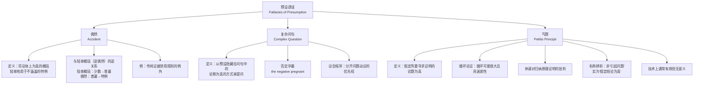

**相关笔记：** [[4.4 不当归纳谬误]] | [[4.6 含混谬误]]

> [!abstract] 概览
> 预设谬误（Fallacies of Presumption）是一类在论证中**不当地预设了某些关键命题为真**的非形式谬误。论证者将本应作为结论来证明的命题当作已知前提偷偷塞入论证之中，或者将仅在特定条件下成立的概括轻率地推广到不涵盖的特例。本节讨论三种预设谬误：**偶然**（Accident）、**复杂问句**（Complex Question）和**丐题**（Petitio Principii）。识别预设谬误的关键在于追问：论证是否在前提中偷偷假定了结论？概括是否被不当应用于例外情形？问句是否暗含未经证实的假定？

## 一、知识结构总览

## 二、核心思想与证明技巧

### 2.1 偶然（Accident）

> [!def] 偶然谬误
> **偶然**（Accident）是指将一个**总体上为真的概括**（generalization）轻率地、不合理地应用于该概括**并不涵盖的特殊情形**（exceptional case）。其逻辑结构可以表示为：
> - 前提：$P$ 总体上对于 $S$ 类事物为真。
> - 前提：$a$ 是 $S$ 类事物中的一个特例（具有特殊性质）。
> - 结论：因此 $P$ 对 $a$ 为真。

> [!tip] 偶然与逆偶然的对称关系
> 偶然谬误与**轻率概括**（Hasty Generalization，又称"逆偶然" Converse Accident）构成一对**逆关系**：
> - **轻率概括（逆偶然）**：从**少数**特例不当推出**普遍**概括——归纳方向上的错误（从个别到一般）。
> - **偶然**：从**普遍**概括不当应用于**个别**特例——演绎方向上的错误（从一般到个别）。
>
> 两者互为镜像：一个犯了"以偏概全"的错误，另一个犯了"以全概偏"的错误。

> [!example] 传闻证据禁用规则的例外
> 法律中的**传闻证据禁用规则**（hearsay rule）总体上要求排除传闻证据。但如果有人据此论证"临终遗言（dying declaration）作为传闻也必须被排除"，就犯了偶然谬误——因为临终遗言是传闻规则的一个**公认的例外**（exception），将总体规则机械地套用于例外情形是不合理的。

### 2.2 复杂问句（Complex Question）

> [!def] 复杂问句
> **复杂问句**（Complex Question）是一种以**预设隐藏在问句中的论断为真**的方式来提问的谬误。这类问句表面上是问题，实际上是**修辞性的**（rhetorical）——提问者并非真正寻求答案，而是通过问题的形式迫使回答者**不自觉地接受了某个未经证实的预设**。

> [!tip] 复杂问句的识别技巧
> 识别复杂问句的关键方法是**将复合问句拆分为多个独立问题**，逐一检验每个部分是否已经预设了不应被假定为真的命题。例如：
> - 复合问句："人为的全球变暖还是美国人遇到的最大谎言？"
> - 拆分后：(1) 全球变暖的证据是否不可靠？(2) 它是否是美国人遇到的最大谎言？
> - 问题(1)被预设为"是"，但这一预设本身恰恰是需要论证的。

> [!example] 否定孕蓄（the negative pregnant）
> **否定孕蓄**（the negative pregnant）是复杂问句的一种特殊形式：对复合问句中的某个部分做出否定回答，可能导致对其他预设假定的**默认肯定**。
>
> 经典案例——**丽兹·鲍登（Lizzie Borden）谋杀案**：
> 检察官问被告："丽兹·鲍登，你**停止**用斧头砍你父母了吗？"
> - 如果回答"是"→承认以前砍过（承认犯罪事实）。
> - 如果回答"否"→承认还在继续砍（承认正在犯罪）。
> - 无论怎样回答，都被迫接受了"你曾用斧头砍你父母"这一未经证实的预设。

> [!info] 议会程序中的应对
> 在正式的议会程序（parliamentary procedure）中，为了防止复杂问句的谬误，设有**分开问题动议**（motion to divide the question）的优先权。当一个问题包含多个独立部分时，任何成员都可以提议将复合问题拆分为多个独立问题分别表决，从而避免回答者在不知情的情况下被迫接受隐藏预设。

### 2.3 丐题（Petitio Principii）

> [!def] 丐题
> **丐题**（Petitio Principii），又称**循环论证**（Begging the Question），是指**假定所要寻求证明的论题为真**的谬误。论证者将结论（或与结论实质上相同的命题）作为前提来使用，使得论证虽然在形式上可能是有效的，但实际上**没有提供任何独立的理由来支持结论**。

> [!tip] 丐题的经典分析
> **Whately（1826）** 在 *Elements of Logic* 中给出了一个经典例子来揭示丐题的本质：
>
> 论证："应当允许自由言论，因为人们应当被允许自由表达意见。"
> - 前提中"允许自由表达意见"与结论中"允许自由言论"实质上是**同一个命题**。
> - 论证没有提供任何**独立的理由**来支持自由言论——它只是用不同的词语**重复了结论**。
>
> 另一个例子来自**16世纪中国哲学家**：
> - 论证："知识就是可以诉诸实践的东西，因为只有能付诸实践的东西才是真正的知识。"
> - 前提和结论表达的是**同一判断**，只是措辞不同。

> [!tip] 循环论证的迷惑性
> 每一个丐题都是循环论证，但循环可能**非常大且具迷惑性**。论证者可能用 $A$ 证明 $B$，用 $B$ 证明 $C$，用 $C$ 证明 $D$，最后用 $D$ 证明 $A$。当循环足够大时，读者可能不会注意到起点和终点实际上是同一个命题。

> [!example] 休谟对归纳原理证明的批判
> **大卫·休谟**（David Hume）对归纳原理（inductive principle）的证明提出了深刻的批判，指出其为丐题：
>
> 归纳原理："未来将与过去一样，因为过去总是如此。"
> - 这一论证试图用过去的经验来证明"未来将与过去一样"这一普遍原理。
> - 但"过去总是如此"本身只是**过去经验的总结**，而我们需要证明的恰恰是**未来也将如此**。
> - 因此，论证实际上是在说："未来将与过去一样，因为过去（作为未来的时候）与更早的过去一样。"
> - 这就形成了一个**循环**：用归纳来证明归纳的合理性。

> [!warning] 丐题的名称辨析与技术特征
> **名称辨析**："Petitio Principii"常被误解为"引起问题"（begging/raising the question），但其拉丁文原意是**"假定初始命题（为真）"**——即把需要证明的结论当作前提来使用。现代英语中"beg the question"的日常用法（"引起问题"）是对这一逻辑术语的误用。
>
> **技术特征**：丐题在技术上通常是**有效的**（valid）——如果前提为真，结论确实为真。但问题在于，前提本身**依赖于结论**，因此论证是**无意义的**（trivial/circular），它没有提供任何独立的证明力量。

## 三、补充理解与易混淆点

### 补充理解

> [!info] 补充1：Aristotle《辩谬篇》与预设谬误的分类
> **来源：** Aristotle, *Sophistical Refutations* (《辩谬篇》), c. 350 BCE.
>
> Aristotle在《辩谬篇》中首次系统讨论了依赖于语言歧义的谬误（含混谬误）和不依赖于语言歧义的谬误（其中包含预设谬误的雏形）。Aristotle将"丐题"归为"不依赖于语言的谬误"（extra dictionem），认为其错误在于论证的前提未能真正独立于结论。Aristotle的分析为后世谬误理论奠定了基础，但他的分类体系（13种谬误）与现代分类有所不同。

> [!info] 补充2：Whately与循环论证的现代分析
> **来源：** Whately, R. (1826). *Elements of Logic*. J. Mawman.
>
> Richard Whately在《逻辑要素》中对循环论证（丐题）进行了经典分析。Whately指出，循环论证的"循环"可能非常大且具迷惑性——论证者可能用A证明B，用B证明C，用C证明D，最后用D证明A。当循环足够大时，读者可能不会注意到起点和终点实际上是同一个命题。Whately的贡献在于：他将丐题从Aristotle的13种谬误中独立出来，使其成为现代谬误理论中最重要的概念之一。

> [!info] 三种预设谬误的共同特征
> 三种预设谬误虽然表现形式不同，但共享一个核心特征：**论证中不当地假定了某个关键命题为真**，而这个命题恰恰是需要被证明的。
> - **偶然**：假定了"普遍概括适用于所有特例"（包括例外）。
> - **复杂问句**：假定了"问句中隐藏的预设为真"。
> - **丐题**：假定了"结论为真"并将其作为前提。

> [!warning] 丐题 vs 有效论证的区分
> 需要注意区分**丐题**和**合法的有效论证**：
> - 在合法论证中，前提提供**独立的理由**来支持结论。
> - 在丐题中，前提的"真"依赖于结论的"真"，因此前提**不是独立的**。
>
> 判断方法：尝试**独立于结论地检验前提**——如果前提只有在结论已经为真的情况下才能被接受，那么这就是丐题。

> [!warning] 偶然 vs 合理的例外处理
> 并非所有将概括应用于特例都构成偶然谬误。关键在于判断该特例是否**真正属于概括所涵盖的范围**：
> - 如果特例**确实在概括范围内**，那么应用概括是合理的。
> - 如果特例具有**特殊性质**使得概括不适用，那么强行应用就构成偶然谬误。

### 易混淆点

> [!warning] 误区：丐题 = 无效论证
> ❌ **错误理解：** 丐题是一种无效论证，因为其前提无法支持结论。
> ✅ **正确理解：** 丐题在技术上通常是**有效的**（valid）——如果前提为真，结论确实为真。但问题在于前提本身**依赖于结论**，因此论证是**无意义的**（trivial/circular），它没有提供任何独立的证明力量。
> **辨析：** 有效性（validity）和证明力（probative force）是两个不同的概念。丐题的"罪"不在于无效，而在于空洞——它看似在论证，实际上只是在同义反复。

> [!warning] 误区：复杂问句 = 故意欺骗
> ❌ **错误理解：** 使用复杂问句的人一定是在故意欺骗或设陷阱。
> ✅ **正确理解：** 复杂问句可能源于**不自觉的语言习惯**，提问者本人可能也没有意识到问句中暗含了未经证实的预设。复杂问句之所以是谬误，不在于提问者的意图，而在于**问句的结构本身**迫使回答者接受隐藏预设。
> **辨析：** 判断复杂问句的关键不在于提问者的主观意图，而在于问句的客观结构——是否包含多个独立部分且其中某些部分被预设为真。

## 四、习题精选

> [!todo] 习题概览
> | 题号 | 来源 | 核心考点 | 难度 |
> |:-----|:-----|:---------|:-----|
> | 1 | 自编 | 识别偶然谬误 | ⭐ |
> | 2 | 自编 | 识别复杂问句 | ⭐⭐ |
> | 3 | 自编 | 识别丐题 | ⭐⭐ |

---

### 题1：识别偶然谬误

> [!problem] 题目
> 甲说："法律禁止杀人。但战争中士兵杀敌是被允许的，所以战争中士兵的行为是违法的。"
>
> 请识别其中的谬误并说明理由。

> [!faq]- 解答
> 这是**偶然谬误**。
>
> "法律禁止杀人"是一个总体上为真的概括，但战争中的杀敌行为是这一法律规则的**公认例外**（国际法中的战争法规对此有专门规定）。将总体规则机械地套用于例外情形，犯了偶然谬误——从普遍概括不当应用于不涵盖的特例。$\blacksquare$

> [!tip] 解题思路提示
> 追问"概括是否适用于该特例？"——如果该特例具有特殊性质使得普遍概括不适用，则构成偶然谬误。

---

### 题2：识别复杂问句

> [!problem] 题目
> 记者在新闻发布会上问："部长先生，您是否仍然在暗中收受那家公司的贿赂，还是您已经停止了？"
>
> 请识别其中的谬误并说明理由。

> [!faq]- 解答
> 这是**复杂问句谬误**，具体表现为**否定孕蓄**。
>
> 该问句预设了"部长先生曾经收受过那家公司的贿赂"这一未经证实的论断。无论部长回答"是"（仍然在收受）还是"否"（已经停止），都**默认接受了这一预设**。正确的应对方式是拒绝接受预设，指出问题的前提不成立。$\blacksquare$

> [!tip] 解题思路提示
> 将复合问句拆分为多个独立问题，逐一检验每个部分是否已经预设了不应被假定为真的命题。

---

### 题3：识别丐题

> [!problem] 题目
> "死刑是正当的，因为对犯下严重罪行的人施以极刑是合理的。"
>
> 请识别其中的谬误并说明理由。

> [!faq]- 解答
> 这是**丐题**（循环论证）。
>
> 前提"对犯下严重罪行的人施以极刑是合理的"与结论"死刑是正当的"表达的是**实质上相同的命题**——"死刑"就是"对犯下严重罪行的人施以极刑"。论证者只是用不同的措辞**重复了结论**，没有提供任何独立的理由来支持死刑的正当性。$\blacksquare$

> [!tip] 解题思路提示
> 追问"前提是否独立于结论？"——如果前提只有在结论已经为真的情况下才能被接受，则构成丐题。

## 五、视频学习指南

> [!info] 视频资源
> | 资源 | 链接 | 对应内容 | 备注 |
> |:-----|:-----|:---------|:-----|
> | Crash Course Philosophy #7: Informal Fallacies | [链接](https://www.youtube.com/watch?v=KE90VDl2xM4) | 预设谬误概览 | 英文，动画讲解，适合入门 |
> | Kevin deLaplante: Fallacies 系列 | [链接](https://www.youtube.com/user/kdelaplante) | 丐题与循环论证深入分析 | 英文，含休谟归纳问题讨论 |
> | Wi-Phi（Wireless Philosophy）谬误系列 | [链接](https://www.youtube.com/playlist?list=PLtDyWVKRDCGJpJOZqPbMb1bL1GgY6YxG) | 预设谬误短片 | 英文，每集5-8分钟，适合碎片化复习 |

## 六、教材原文

> [!quote] 教材原文摘录
> *以下内容整理自 Copi, Cohen & McMahon, *Introduction to Logic* (15th ed.), 第4章第5节。*
>
> **偶然（Accident）**：将总体上为真的概括轻率地用于不涵盖的特例。偶然谬误与轻率概括（逆偶然）构成一对逆关系：轻率概括是从少数特例到普遍概括，偶然是从普遍概括到个别特例。例如，传闻证据禁用规则总体上要求排除传闻，但临终遗言是该规则的公认例外，若将规则机械地应用于例外情形，则构成偶然谬误。
>
> **复杂问句（Complex Question）**：以预设隐藏在问句中的论断为真的方式来提问。这类问句是修辞性的，不是真正寻求答案。例如："人为的全球变暖还是美国人遇到的最大谎言？"预设了全球变暖的证据不可靠。否定孕蓄（the negative pregnant）是复杂问句的特殊形式：只否定一个预设可能导致对其他假定的默认肯定。丽兹·鲍登谋杀案中"你停止用斧头砍你父母了吗"是经典例子。在议会程序中，分开问题动议享有优先权，以防止此类谬误。
>
> **丐题（Petitio Principii）**：假定所要寻求证明的论题为真。Whately的经典例子表明，"应当允许自由言论，因为人们应当被允许自由表达意见"只是用不同词语重复了结论。16世纪中国哲学家的例子"知识就是可以诉诸实践的东西，因为只有能付诸实践的东西才是真正的知识"同样如此。每个丐题都是循环论证，但循环可能很大且具迷惑性。休谟对归纳原理证明的批判指出，"未来将与过去一样，因为过去总是如此"是一个丐题——用归纳来证明归纳的合理性。丐题的名称常被误解为"引起问题"，其实际含义是"假定结论为真"。丐题在技术上通常是有效的，但是无意义的。

## 参见 Wiki

- [[论证]]——论证的基本结构与评估标准
- [[论争的类型]]——不同类型的论争及其对应的谬误归类
- [[丐题]]——丐题（循环论证）的完整概念页

#学习/逻辑学/谬误
