**相关笔记：** [[4.5 预设谬误]]

> [!abstract] 概览
> 含混谬误（Fallacies of Ambiguity）是一类由于**语言的不确定性**而导致论证失效的非形式谬误。当论证中的某个关键语词或短语在前提和结论中具有**不同的含义**，但论证者将其当作同一含义来使用时，就产生了含混谬误。本节讨论五种含混谬误：**歧义**（Equivocation）、**双关**（Amphiboly）、**重音**（Accent）、**合成**（Composition）和**分解**（Division）。识别含混谬误的关键在于追问：论证中的关键术语是否在前提和结论之间发生了**含义的暗中转换**？

## 一、知识结构总览

```mermaid
graph TB
    A["含混谬误<br/>Fallacies of Ambiguity"] --> B["歧义<br/>Equivocation"]
    A --> C["双关<br/>Amphiboly"]
    A --> D["重音<br/>Accent"]
    A --> E["合成<br/>Composition"]
    A --> F["分解<br/>Division"]

    B --> B1["混淆同一词或短语的多个含义"]
    B --> B2["Lewis Carroll 'Nobody' 的例子"]
    B --> B3["相对词 relative terms 的歧义"]
    B --> B4["'have faith in' 的歧义"]

    C --> C1["语法结构导致陈述有歧义"]
    C --> C2["垂悬分词"]
    C --> C3["Salick 捐赠案例"]

    D --> D1["不同强调使术语意义不同"]
    D --> D2["亚里士多德：希腊文重音"]
    D --> D3["现代扩展：断章取义"]
    D --> D4["广告中的大字+小字"]

    E --> E1["形式a：部分性质→整体性质"]
    E --> E2["形式b：个别元素性质→汇集总体性质"]
    E --> E3["分布式 vs 汇集式用法"]

    F --> F1["合成的颠倒"]
    F --> F2["形式a：整体性质→部分性质"]
    F --> F3["形式b：汇集总体性质→个别元素性质"]
    F --> F4["'白羊比黑羊吃得多' 谜语"]

    E & F --> G["与偶然/逆偶然的区别<br/>合成/分解源于歧义<br/>偶然/逆偶然源于预设"]
```

## 二、核心思想与证明技巧

### 2.1 歧义（Equivocation）

> [!def] 歧义谬误
> **歧义**（Equivocation）是指在论证中**混淆同一词或短语的多个含义**，使得该词或短语在前提中取一种含义，在结论中取另一种含义，从而造成论证表面上有效但实际上无效的谬误。

> [!example] Lewis Carroll 的经典例子
> 在 Lewis Carroll 的《爱丽丝镜中奇遇记》（*Through the Looking-Glass*）中，"Nobody"（没有人）一词的歧义被巧妙地利用：
> - "Nobody is on the road."（路上没有人。）
> - 爱丽丝将 "Nobody" 当作一个**人名**来理解，从而产生了荒诞的对话。
> - 这里 "Nobody" 既可以指"没有任何人"（量化词），也可以被误解为一个**专有名词**。

> [!example] "have faith in" 的歧义
> "have faith in" 这一短语存在两种不同的含义：
> - **含义一**：对某人做有益的事有信心（trust/confidence）——例如"我对医生有信心"。
> - **含义二**：认为某事物存在（belief in the existence of）——例如"我相信上帝存在"。
>
> 如果论证者在前提中使用含义一，在结论中切换为含义二，就构成了歧义谬误。

> [!tip] 相对词（Relative Terms）的歧义
> **相对词**（relative terms）是指其含义**依赖于比较对象**的词语，如"大"、"小"、"好"、"坏"等。相对词的歧义是歧义谬误的一种重要形式：
>
> - "小象是小动物"——这是**荒谬的**，因为"小"是相对词：小象是相对于**其他大象**而言小的，但相对于**一般动物**而言，小象仍然是很大的动物。
> - "他是一位好将军，因此他会是一位好总统"——这也是相对词歧义：对将军而言的"好"（军事才能）与对总统而言的"好"（政治才能、领导力等）是**不同的标准**。

### 2.2 双关（Amphiboly）

> [!def] 双关谬误
> **双关**（Amphiboly）是指由于**语法结构的歧义**导致一个陈述可以被合理地做出多种解释，而论证者利用这种语法上的不确定性来误导读者或听众的谬误。与歧义不同，歧义源于**单个词语**的多义性，而双关源于**整个句子结构**的不确定性。

> [!example] 经典双关案例
> - "Women prefer Democrats to men."
>   - 解释一：女性比男性更偏好民主党。（Women prefer Democrats more than men do.）
>   - 解释二：女性偏好民主党胜过偏好男性。（Women prefer Democrats more than they prefer men.）
>
> - **垂悬分词**（dangling participle）也是双关的一种常见形式：
>   - "Walking down the street, the trees were beautiful."——语法上"walking"的主语似乎是"trees"，但这显然不合理。

> [!example] Salick 捐赠案例
> "Dr. Salick donated $\$4.5$ million along with his wife Gloria."
> - 解释一：Salick 博士和他的妻子 Gloria 一起捐赠了 450 万美元。
> - 解释二：Salick 博士捐赠了 450 万美元，以及他的妻子 Gloria（即 Gloria 也被"捐赠"了）。
> - 在法律语境中，这种双关可能导致严重后果——例如在税务文件中，解释二意味着"Gloria 是可免税的"（Gloria is tax-deductible），这显然是荒谬的。

### 2.3 重音（Accent）

> [!def] 重音谬误
> **重音**（Accent）谬误是指通过对语词做**不同的强调**（重音、语调、字体大小等），使得相同的术语在前提和结论中产生**不同的意义**，从而导致论证失效的谬误。

> [!info] 从亚里士多德到现代的演变
> **亚里士多德**最初在《辩谬篇》中讨论重音谬误时，指的是**希腊文中书面重音符号的不同**导致同一个词具有完全不同的含义（希腊语中重音确实可以改变词义）。
>
> 在现代语言中，重音谬误的含义已经被**扩展**，不仅包括语音重音，还包括：
> - **印刷强调**：用大字、加粗、斜体等方式突出某些词语。
> - **断章取义**：故意从完整语境中抽出某句话，改变其原意。
> - **选择性引用**：只引用部分内容，省略关键的限制条件。

> [!example] 断章取义的典型案例
> - **戈尔（Al Gore）抽烟引文**：戈尔曾说自己在年轻时尝试过烟草，但后来认识到其危害并反对吸烟。反对者只引用了前半部分"戈尔承认自己抽过烟"，省略了后半部分的语境，误导读者以为戈尔是吸烟的支持者。
>
> - **林肯引文**：林肯曾说某些事情是"of the people, by the people, **for** the people"（民有、民治、**民享**），但被断章取义地引用为支持完全不同的政治立场。
>
> - **广告中的误导性强调**：广告中用**大字**标示"仅售 $\$99$"，但用**小字**注明"（需签订两年合约，每月额外收费 $\$50$）"。大字和小字的对比性强调使消费者对实际价格产生错误印象。

> [!example] 船长日志的经典笑话
> 船长日志中写道：
> - "船长今天清醒了。"（The captain was sober today.）
> - 这句话通过重音暗示：船长**并非每天都清醒**——即船长经常醉酒。如果完整阅读日志，会发现前几天的记录都是"今天正常"（即没有记录"清醒"），而只有今天特别注明了"清醒"，暗示其他日子船长是醉的。

### 2.4 合成（Composition）

> [!def] 合成谬误
> **合成**（Composition）谬误有两种形式：
> - **形式 (a)**：从**部分的性质**不当推断**整体的性质**。
> - **形式 (b)**：从**汇集的个别元素**的性质不当推断**汇集总体**的性质（涉及**分布式** distributed 与**汇集式** collective 用法的混淆）。

> [!tip] 形式 (a)：部分到整体
> - 前提：机器的**每一个零件**都很轻。
> - 结论：因此整台**机器**也很轻。
> - 谬误分析：即使每个零件都很轻，当大量零件**组合在一起**时，整体可能很重。部分的性质不能简单地"合成"为整体的性质。

> [!tip] 形式 (b)：分布式到汇集式（关键区分）
> 这是合成谬误中**更微妙、更常见**的形式，涉及**分布式用法**（distributed）与**汇集式用法**（collective）之间的混淆：
>
> - **分布式用法**：谓词适用于集合中的**每一个个别成员**。
> - **汇集式用法**：谓词适用于集合**作为一个整体**。
>
> 经典例子：
> - 前提（分布式）：每辆**公共汽车**都比每辆**小汽车**用油多。
> - 结论（汇集式）：因此，**全部公共汽车**比**全部小汽车**用油多。
> - 谬误分析：前提说的是**单车对比**（每辆公共汽车 vs 每辆小汽车），但结论说的是**总量对比**（全部公共汽车 vs 全部小汽车）。公共汽车的总数远少于小汽车，因此即使每辆公共汽车用油更多，公共汽车的**总用油量**可能远少于小汽车的**总用油量**。

### 2.5 分解（Division）

> [!def] 分解谬误
> **分解**（Division）谬误是合成谬误的**颠倒**，同样有两种形式：
> - **形式 (a)**：从**整体的性质**不当推断**部分的性质**。
> - **形式 (b)**：从**汇集总体**的性质不当推断**个别元素**的性质。

> [!tip] 形式 (a)：整体到部分
> - 前提：这家**公司**非常重要。
> - 结论：因此，公司的**某位员工**某先生也非常重要。
> - 谬误分析：公司作为一个整体的重要性不能简单地"分解"为每个员工的重要性。整体具有的性质不一定为其每个部分所具有。

> [!tip] 形式 (b)：汇集式到分布式
> - 前提（汇集式）：**大学生**学习医学、法律和工程。
> - 结论（分布式）：因此，**任何一位大学生**都学习医学、法律和工程。
> - 谬误分析：前提说的是大学生群体**作为一个整体**涵盖了这些学科（有些学医学，有些学法律，有些学工程），但结论说的是**每一个**大学生都学习**所有**这些学科。

> [!example] "白羊比黑羊吃得多"谜语
> "白羊比黑羊吃得多，因为白羊的数量是黑羊的两倍。"
> - 这里"白羊"在前提中是**汇集式**用法（指白羊群体总量），在结论中被误解为**分布式**用法（每只白羊）。
> - 实际上每只白羊和每只黑羊的食量相同，只是白羊数量更多所以总量更大。如果理解为每只白羊比每只黑羊吃得多，就犯了分解谬误。

## 三、补充理解与易混淆点

### 补充理解

> [!info] 补充1：Aristotle《辩谬篇》与含混谬误的原始分类
> **来源：** Aristotle, *Sophistical Refutations*, c. 350 BCE; Schirren, C. (1832). *Die Sophistik des Aristoteles*.
>
> Aristotle在《辩谬篇》中将含混谬误分为两类："依赖于语言的谬误"（in dictione）和"不依赖于语言的谬误"（extra dictione）。歧义和双关属于前者，而合成和分解则被Aristotle归为后者。现代逻辑学家通常将五种含混谬误统一归为一类，因为它们都源于语言的不确定性。这一分类调整反映了现代逻辑学对语言功能更精细的理解。

> [!info] 补充2：Wittgenstein与语言游戏的模糊性
> **来源：** Wittgenstein, L. (1953). *Philosophical Investigations*. Blackwell.
>
> Ludwig Wittgenstein在《哲学研究》中提出的"语言游戏"（language games）理论为理解含混谬误提供了深刻的哲学基础。Wittgenstein认为，词语的意义取决于其在特定"语言游戏"中的使用方式——同一个词在不同的语境中可能扮演完全不同的角色。含混谬误的本质正是：论证者跨越了不同的"语言游戏"，将一个词在一种游戏中的意义当作它在另一种游戏中的意义来使用。

> [!info] 五种含混谬误的内在联系
> 五种含混谬误的共同根源是**语言的不确定性**，但不确定性的来源各不相同：
> | 谬误类型 | 不确定性的来源 |
> |:---|:---|
> | 歧义 | **词语**的多义性（同一词语有多个含义） |
> | 双关 | **语法结构**的歧义性（同一句子有多种句法分析） |
> | 重音 | **强调方式**的差异（不同重音/语境导致不同意义） |
> | 合成 | **分布式与汇集式**用法的混淆（从个别到整体的非法推理） |
> | 分解 | **汇集式与分布式**用法的混淆（从整体到个别的非法推理） |

> [!warning] 合成/分解 vs 偶然/逆偶然的关键区别
> 合成谬误与偶然（逆偶然）谬误容易混淆，但两者的**逻辑根源不同**：
>
> - **合成/分解**：源于**歧义**——论证中的所有断言都是**分布式**的（关于个别元素），但推理错误地从分布跳跃到汇集（合成）或从汇集跳跃到分布（分解）。谬误的本质是**词语用法的混淆**。
>
> - **偶然/逆偶然**：源于**预设**——论证中错误地**预设**了普遍概括适用于所有情形（偶然），或从少数特例不当推出普遍概括（逆偶然）。谬误的本质是**概括范围的不当预设**。
>
> 简言之：
> - 合成谬误中，所有断言都是**分布式的**，但错误推论从**分布到汇集**。
> - 逆偶然中，所有断言也都是**分布式的**，但错误在于从**少数分布到普遍分布**。
> - 区别在于：合成涉及的是**同一类对象**的分布/汇集混淆，逆偶然涉及的是**从样本到总体**的归纳跳跃。

> [!warning] 合成形式(a)与形式(b)的区分
> - **形式 (a)**（部分→整体）：涉及的是**物理组成关系**——部分组成整体。例如，零件组成机器。
> - **形式 (b)**（分布式→汇集式）：涉及的是**类与成员关系**——个别成员属于某个类。例如，个别公共汽车属于"公共汽车"这个类。
>
> 形式 (b) 更为微妙，因为它不涉及物理组成，而是涉及**谓词对类的不同用法**（distributed vs collective），需要仔细分析谓词的作用范围。

### 易混淆点

> [!warning] 误区：合成 = 简单的以偏概全
> ❌ **错误理解：** 合成谬误就是简单的"以偏概全"，和轻率概括（逆偶然）是同一种错误。
> ✅ **正确理解：** 合成谬误涉及**分布式**（distributed）与**汇集式**（collective）用法的混淆，不是简单的归纳错误。在合成谬误中，关于个别元素的断言本身可能是完全正确的，但论证者错误地将适用于个别元素的谓词直接推广到集合整体。
> **辨析：** 合成谬误的本质是**语义歧义**（同一个词在分布式和汇集式用法中含义不同），而逆偶然的本质是**归纳跳跃**（样本太小导致概括不可靠）。两者虽然推理方向相似（从个别到整体），但逻辑根源完全不同。

> [!warning] 误区：歧义 = 双关
> ❌ **错误理解：** 歧义和双关是同一种谬误，都是"词语有多个意思"。
> ✅ **正确理解：** 歧义源于**词语的多义性**（一个词本身有多个含义），而双关源于**语法结构的歧义性**（一个句子因语法结构不确定而有多种合理解释）。例如，"have faith in"的歧义是因为该短语本身有两种含义（歧义）；而"Women prefer Democrats to men"的歧义是因为句子结构允许两种不同的句法分析（双关）。
> **辨析：** 区分方法——如果将歧义词替换为同义词就能消除歧义，则是歧义谬误；如果替换词语后句子仍然有歧义，则是双关谬误。

## 四、习题精选

> [!todo] 习题概览
> | 题号 | 来源 | 核心考点 | 难度 |
> |:-----|:-----|:---------|:-----|
> | 1 | 自编 | 识别合成谬误 | ⭐ |
> | 2 | 自编 | 分析分解谬误 | ⭐⭐ |
> | 3 | 自编 | 分解vs偶然区分 | ⭐⭐ |

---

### 题1：识别合成谬误

> [!problem] 题目
> "这架飞机的每个零件都是中国制造的，所以这架飞机是中国制造的。"
>
> 请识别其中的谬误并说明理由。

> [!faq]- 解答
> 这是**合成谬误**，形式 (a)——从部分性质到整体性质。
>
> 前提说的是飞机的**每一个零件**都是中国制造的（关于个别部分的断言），但结论说整架飞机是"中国制造的"——"中国制造"对于一架飞机而言通常意味着**在中国完成总装和核心设计**，而不仅仅是零件来源。即使每个零件都是中国制造的，飞机的组装可能在其他国家完成。这里从部分的性质不当推断整体的性质，犯了合成谬误。$\blacksquare$

> [!tip] 解题思路提示
> 先确定推理方向（部分→整体=合成，整体→部分=分解）→再检查是否存在分布式/汇集式的混淆。

---

### 题2：分析分解谬误

> [!problem] 题目
> "水是 $\text{H}_2\text{O}$，所以这块冰是 $\text{H}_2\text{O}$。"
>
> 这是否构成分解谬误？请分析。

> [!faq]- 解答
> 这**不构成**分解谬误。
>
> 虽然推理方向是从整体（水）到部分（一块冰），但这里的推理是**合法的**：水作为物质，其分子组成是 $\text{H}_2\text{O}$，而冰是水的固态形式，因此冰的分子组成也是 $\text{H}_2\text{O}$。这是一个**有效的化学推论**，不是谬误。
>
> 分解谬误的关键在于：整体具有的某种性质**不能合理地归因于**其部分。但化学组成不是这种情况——水的分子组成性质**确实可以**合理地归因于水的任何部分。$\blacksquare$

> [!tip] 解题思路提示
> 分解谬误的关键在于整体具有的某种性质**不能合理地归因于**其部分。如果该性质确实可以合理地归因于部分（如化学组成），则推理是合法的，不构成谬误。

---

### 题3：分解vs偶然区分

> [!problem] 题目
> 甲说："日本人平均寿命比美国人长，所以任何一个日本人都比任何一个美国人活得长。"
>
> 请识别其中的谬误并说明理由，并与偶然谬误做区分。

> [!faq]- 解答
> 这是**分解谬误**，形式 (b)——从汇集总体性质到个别元素性质。
>
> 前提中"日本人平均寿命比美国人长"是**汇集式**用法——说的是日本人口作为一个整体的统计平均值。结论"任何一个日本人都比任何一个美国人活得长"是**分布式**用法——说的是每一个个别日本人的寿命都比每一个个别美国人的寿命长。
>
> 平均值高不代表每个个体都高——可能有寿命很短的日本人，也有寿命很长的美国人。从汇集式的统计性质不当推断分布式的个体性质，构成分解谬误。
>
> **与偶然谬误的区分**：偶然谬误是将一个普遍概括不当应用于特例（例如"人都会死，所以苏格拉底会死"是合理的，但如果说"鸟都会飞，所以企鹅会飞"就是偶然谬误——企鹅是例外）。而本题中的谬误不是概括与例外的关系，而是**统计平均值与个体值**的混淆，属于分解谬误（分布式/汇集式的歧义）。$\blacksquare$

> [!tip] 解题思路提示
> 先确定推理方向（部分→整体=合成，整体→部分=分解）→再检查是否存在分布式/汇集式的混淆。区分分解与偶然的关键：分解源于语义歧义（分布式/汇集式），偶然源于预设不当（概括范围）。

## 五、视频学习指南

> [!info] 视频资源
> | 资源 | 链接 | 对应内容 | 备注 |
> |:-----|:-----|:---------|:-----|
> | Crash Course Philosophy #7: Informal Fallacies | [链接](https://www.youtube.com/watch?v=KE90VDl2xM4) | 歧义与双关 | 英文，生动讲解，适合入门 |
> | Gary Meegan: Composition and Division 专题 | [链接](https://www.youtube.com/results?search_query=gary+meegan+composition+division) | 合成与分解谬误的两种形式 | 英文，清晰区分讲解，含大量日常例子 |
> | Wi-Phi（Wireless Philosophy）谬误系列 | [链接](https://www.youtube.com/playlist?list=PLtDyWVKRDCGJpJOZqPbMb1bL1GgY6YxG) | 重音谬误与断章取义 | 英文，每集5-8分钟，适合碎片化复习 |
> | Aristotle's Sophistical Refutations | [链接](https://www.youtube.com/results?search_query=aristotle+sophistical+refutations) | 歧义与双关的原始分析 | 英文，适合进阶阅读 |

## 六、教材原文

> [!quote] 教材原文摘录
> *以下内容整理自 Copi, Cohen & McMahon, *Introduction to Logic* (15th ed.), 第4章第6节。*
>
> **歧义（Equivocation）**：混淆同一词或短语的多个含义。Lewis Carroll 在《爱丽丝镜中奇遇记》中巧妙利用了"Nobody"一词的歧义。"have faith in"也存在歧义：对某人做有益的事有信心 vs 认为某事物存在。相对词（relative terms）的歧义是一种重要形式——"小象是小动物"是荒谬的，因为"小"是相对词；"好将军因此是好总统"也是相对词歧义。
>
> **双关（Amphiboly）**：由于语法结构导致陈述有歧义。"Women prefer Democrats to men."可以有两种合理解释。垂悬分词也是双关的常见形式。Salick 捐赠 $4.5$ million along with his wife Gloria 的案例中，语法歧义可能导致"Gloria is tax-deductible"的荒谬解释。
>
> **重音（Accent）**：对语词做不同强调使相同术语在前提和结论中有不同意义。亚里士多德最初指希腊文中重音导致不同意义。现代扩展为包括各种强调和故意从语境中抽出的误导性用法。戈尔抽烟引文被删节的例子、林肯引文被断章取义的例子、广告中的大字价格加小字限制，都是重音谬误的体现。船长日志"助手今天喝醉了"暗示"船长今天清醒了"也是经典案例。
>
> **合成（Composition）**：两种形式。(a) 从部分性质到整体性质：每部分轻不代表机器轻。(b) 从汇集的个别元素性质到汇集总体性质（分布式 vs 汇集式用法）："公共汽车比小汽车用油多，所以全部公共汽车比全部小汽车用油多"是第二种合成谬误。
>
> **分解（Division）**：合成的颠倒。两种形式。(a) 从整体性质到部分性质：公司重要不代表某先生重要。(b) 从汇集总体性质到个别元素性质：大学生学医学法律工程不代表任何大学生学所有这些。"白羊比黑羊吃得多"谜语是分解谬误的经典例子。
>
> **合成/分解 vs 偶然/逆偶然**：合成/分解源于歧义（分布式 vs 汇集式），偶然/逆偶然源于预设。合成谬误中所有断言都是分布式的但错误推论从分布到汇集；逆偶然中所有断言也都是分布式的。

## 参见 Wiki

- [[论争的类型]]——不同类型的论争及其对应的谬误归类
- [[定义的类型]]——词语定义与歧义消除的关系
- [[外延与内涵]]——分布式与汇集式用法的语义基础
- [[合成-vs-分解]]——合成与分解谬误的对比分析

#学习/逻辑学/谬误
