# 第04章 谬误 — 章节汇总

---

## 一、全章知识框架

```mermaid
graph TB
    A["第4章 谬误"] --> B["4.1 什么是谬误"]
    A --> C["4.2 谬误的分类"]
    A --> D["4.3 相干谬误"]
    A --> E["4.4 不当归纳谬误"]
    A --> F["4.5 预设谬误"]
    A --> G["4.6 含混谬误"]

    B --> B1["广义谬误 vs 狭义谬误"]
    B --> B2["形式谬误 vs 非形式谬误"]
    B --> B3["类型与个例的双重指称"]

    C --> C1["相干谬误 R1-R7"]
    C --> C2["不当归纳谬误 D1-D4"]
    C --> C3["预设谬误 P1-P3"]
    C --> C4["含混谬误 A1-A5"]

    D --> D1["R1 诉诸大众"]
    D --> D2["R2 诉诸情感/同情"]
    D --> D3["R3 红鲱鱼"]
    D --> D4["R4 稻草人"]
    D --> D5["R5 诉诸人身"]
    D --> D6["R6 诉诸暴力"]
    D --> D7["R7 不得要领"]

    E --> E1["D1 诉诸无知"]
    E --> E2["D2 诉诸不当权威"]
    E --> E3["D3 虚假原因"]
    E --> E4["D4 轻率概括"]

    F --> F1["P1 偶然"]
    F --> F2["P2 复杂问句"]
    F --> F3["P3 丐题"]

    G --> G1["A1 歧义"]
    G --> G2["A2 双关"]
    G --> G3["A3 重音"]
    G --> G4["A4 合成"]
    G --> G5["A5 分解"]
```

---

## 二、核心知识点与重点公式汇总

### 4.1 什么是谬误

> [!def] 谬误（Fallacy）
> 一种==看似正确但经过考察而证明并非如此==的论证。逻辑学家使用的"谬误"指那些==有模式、能被识别和命名==的典型推理错误。

| 区分维度 | 形式谬误 | 非形式谬误 |
|:---------|:---------|:-----------|
| 错误来源 | 推理形式本身 | 语言内容的含混性 |
| 识别难度 | 较易（检查形式） | 较难（需理解语境） |
| 研究方法 | 形式逻辑（第8章） | 日常语言分析（第4章） |
| 例子 | 肯定后件谬误 | 诉诸人身、稻草人 |

### 4.2 谬误的分类

> [!def] 非形式谬误四大类
> 1. ==相干谬误==（R1-R7）：前提与结论==不相干==
> 2. ==不当归纳谬误==（D1-D4）：前提与结论相干但==太弱==
> 3. ==预设谬误==（P1-P3）：前提==假定了无根据的假设==
> 4. ==含混谬误==（A1-A5）：==语词意义在论证中变化==

### 4.3 相干谬误（7种）

| 编号 | 名称 | 拉丁名 | 核心错误 | 典型例子 |
|:-----|:-----|:-------|:---------|:---------|
| R1 | 诉诸大众 | Ad Populum | 以群众情感代替证据 | 广告"大家都买" |
| R2 | 诉诸情感 | Ad Misericordiam | 以同情/恐惧等情感为前提 | 杀人犯律师以其成孤儿求宽大 |
| R3 | 红鲱鱼 | — | 引入误导性话题转移注意力 | "批评军事扩张=反恐立场软弱" |
| R4 | 稻草人 | — | 误读对手立场使其更极端 | 将"加强监管"歪曲为"专制头目" |
| R5 | 诉诸人身 | Ad Hominem | 攻击人而非论证 | 诽谤、背景谬误、污泉 |
| R6 | 诉诸暴力 | Ad Baculum | 以暴力威胁争取赞同 | "不同意就解雇你" |
| R7 | 不得要领 | Ignoratio Elenchi | 前提与结论"断裂" | 用"国防需要"回避"具体武器系统" |

### 4.4 不当归纳谬误（4种）

| 编号 | 名称 | 拉丁名 | 核心错误 | 关键子类型 |
|:-----|:-----|:-------|:---------|:-----------|
| D1 | 诉诸无知 | Ad Ignorantiam | 因未被证伪就认为真 | 科学中的证据缺失≠假；法庭无罪推定是例外 |
| D2 | 诉诸不当权威 | Ad Verecundiam | 诉诸非相关领域权威 | 广告证言、物理学家评论政治 |
| D3 | 虚假原因 | Non Causa Pro Causa | 误认因果关系 | 缘出前物(Post Hoc)、滑坡谬误 |
| D4 | 轻率概括 | Hasty Generalization | 从少数例子到普遍概括 | 也称逆偶然(Converse Accident) |

### 4.5 预设谬误（3种）

| 编号 | 名称 | 核心错误 | 关键特征 |
|:-----|:-----|:---------|:---------|
| P1 | 偶然 | 将概括用于不涵盖的特例 | 与轻率概括是逆关系 |
| P2 | 复杂问句 | 预设隐藏在问句中的论断 | 否定孕蓄：只否定一个预设可能导致对其他假定的肯定 |
| P3 | 丐题 | 假定要证明的结论为真 | 循环论证；技术上有效但无意义 |

### 4.6 含混谬误（5种）

| 编号 | 名称 | 核心错误 | 两种形式 |
|:-----|:-----|:---------|:---------|
| A1 | 歧义 | 混淆同一词的多个含义 | 相对词歧义（"小象是小动物"） |
| A2 | 双关 | 语法结构导致陈述有歧义 | "Women prefer Democrats to men." |
| A3 | 重音 | 不同强调导致意义变化 | 断章取义、广告大字价格+小字限制 |
| A4 | 合成 | 从部分/元素性质到整体/汇集性质 | (a)部分→整体 (b)分布式→汇集式 |
| A5 | 分解 | 从整体/汇集性质到部分/元素性质 | (a)整体→部分 (b)汇集式→分布式 |

**合成/分解 vs 偶然/逆偶然的关键区别**：
- 合成/分解源于==歧义==（分布式 vs 汇集式用法混淆）
- 偶然/逆偶然源于==预设==（概括的普适性假设）

---

## 三、章节学习脉络

> [!info] 学习脉络
> 本章的学习路径是从"谬误是什么"到"如何分类和识别"：
>
> 1. **谬误的概念**（4.1）：理解谬误的狭义定义（有模式的典型推理错误），区分形式谬误与非形式谬误
> 2. **分类框架**（4.2）：掌握四大类非形式谬误的分类体系，理解分类的灵活性和语境依赖性
> 3. **相干谬误**（4.3）：识别7种前提与结论不相干的谬误，重点掌握诉诸人身（含诽谤和背景谬误）、稻草人、红鲱鱼
> 4. **不当归纳谬误**（4.4）：识别4种前提太弱的谬误，重点掌握诉诸无知、虚假原因（含缘出前物和滑坡）
> 5. **预设谬误**（4.5）：识别3种依赖无根据假设的谬误，重点掌握丐题（循环论证）和复杂问句（否定孕蓄）
> 6. **含混谬误**（4.6）：识别5种依赖语词意义变化的谬误，重点掌握合成/分解的两种形式及其与偶然/逆偶然的区别
>
> **学习建议**：第4章是批判性思维的核心工具箱——19种非形式谬误覆盖了日常论证中最常见的推理陷阱。建议重点掌握：(1) 四大类的区分标准（不相干/太弱/无根据/意义变化）；(2) 诉诸人身的三种限定（诽谤/背景/污泉）及其合理例外（法庭证人质询）；(3) 合成/分解与偶然/逆偶然的精确区分。

---

## 四、跨章关联

| 本章概念 | 关联章节 | 关联类型 | 说明 |
|:---------|:---------|:---------|:-----|
| 谬误的定义 | [[第01章_逻辑学的基本概念-章节汇总]] | 基础关系 | 形式谬误（如肯定后件）依赖第1章的论证有效性概念 |
| 说服定义 | [[第03章_语言与定义-章节汇总]] | 直接应用 | 说服定义是第3章定义理论在谬误领域的体现 |
| 情感语言 | [[第03章_语言与定义-章节汇总]] | 直接应用 | 诉诸情感谬误依赖第3章的情感语言分析 |
| 论争的类型 | [[第03章_语言与定义-章节汇总]] | 直接应用 | 纯粹言辞之争本质上是未识别的含混谬误 |
| 轻率概括 | [[第01章_逻辑学的基本概念-章节汇总]] | 深化关系 | 归纳论证的强度评估（第1章）与轻率概括（第4章）是同一问题的两面 |
| 丐题/循环论证 | [[第02章_论证的分析-章节汇总]] | 工具关系 | 分析论证时需识别循环论证 |
| 含混谬误 | [[第03章_语言与定义-章节汇总]] | 前置依赖 | 歧义谬误的识别依赖第3章的语言功能分析 |
| 形式谬误 | [[第08章_命题逻辑Ⅰ-章节汇总|第08章 命题逻辑Ⅰ]] | 前置依赖 | 第8章将系统研究命题逻辑中的形式谬误 |

---

## 五、全章总复习题

> [!problem] 综合题1：谬误分类与识别
> 以下论证各犯了哪种谬误？请指出其所属的四大类别（相干/不当归纳/预设/含混），并给出具体谬误名称。
>
> (a) "你不能反对我的经济计划。毕竟，你自己也承认你不懂经济学。"
> (b) "自从新市长上任以来，犯罪率下降了。所以，新市长的政策有效地降低了犯罪。"
> (c) "你还在打你的妻子吗？请回答是或否。"
> (d) "水是H₂O，所以海水也是H₂O。"
> (e) "这位著名的篮球运动员说这款汽车最好，所以它一定是最好的。"

> [!faq]- 参考答案
> **(a) "你不能反对我的经济计划。毕竟，你自己也承认你不懂经济学。"**
>
> - 类别：==相干谬误==
> - 具体谬误：==诉诸人身（背景谬误）==——以对手缺乏经济学知识（背景）为由攻击其观点，而非回应观点本身。对手是否懂经济学与其经济计划是否正确在逻辑上无关。
>
> **(b) "自从新市长上任以来，犯罪率下降了。所以，新市长的政策有效地降低了犯罪。"**
>
> - 类别：==不当归纳谬误==
> - 具体谬误：==虚假原因（缘出前物，Post Hoc Ergo Propter Hoc）==——仅仅因为两个事件在时间上先后发生（市长上任→犯罪率下降），就断定前者是后者的原因。可能存在其他因素（如经济改善、警力增加等）。
>
> **(c) "你还在打你的妻子吗？请回答是或否。"**
>
> - 类别：==预设谬误==
> - 具体谬误：==复杂问句==——该问句预设了"你曾经打过你的妻子"这一论断为真。无论回答"是"还是"否"，都承认了这一预设。正确应对方式是拒绝该问句的预设。
>
> **(d) "水是H₂O，所以海水也是H₂O。"**
>
> - 类别：==含混谬误==
> - 具体谬误：==歧义==——"H₂O"在这里有两种含义：化学意义上的纯净物（水分子）和日常语言中的"含有水的物质"。前提中的"H₂O"指纯净物，结论中的"H₂O"被理解为"含有H₂O的物质"。这是一个隐蔽的歧义谬误。
>
> **(e) "这位著名的篮球运动员说这款汽车最好，所以它一定是最好的。"**
>
> - 类别：==不当归纳谬误==
> - 具体谬误：==诉诸不当权威==——篮球运动员在汽车领域没有特殊的专业知识，不能合理地宣称其为汽车评价的权威。
>
> $\blacksquare$

> [!problem] 综合题2：合成/分解 vs 偶然/逆偶然的精确区分
> 以下四个论证分别犯了哪种谬误？请精确区分它们属于"合成/分解"还是"偶然/逆偶然"。
>
> (a) "这台机器的每一个零件都不到1公斤，所以这台机器不到1公斤。"
> (b) "水在标准大气压下100°C沸腾，所以这锅高山上的水也会在100°C沸腾。"
> (c) "大学生学习医学、法律和工程，所以任何一个大学生都学习医学、法律和工程。"
> (d) "我认识的两个法国人都很傲慢，所以所有法国人都很傲慢。"

> [!faq]- 参考答案
> **(a) "这台机器的每一个零件都不到1公斤，所以这台机器不到1公斤。"**
>
> - 谬误：==合成谬误==（形式a：从部分性质到整体性质）
> - 分析：每个零件轻（部分性质）→整台机器轻（整体性质）。错误在于忽略了部分数量巨大时总重量可以很重。
> - 关键特征：源于==歧义==——"轻"在分布式用法（每个零件）和汇集式用法（所有零件的总和）之间混淆。
>
> **(b) "水在标准大气压下100°C沸腾，所以这锅高山上的水也会在100°C沸腾。"**
>
> - 谬误：==偶然谬误==
> - 分析：将"水在标准大气压下100°C沸腾"这一普遍概括，错误地应用于高山的特殊环境（气压较低）。忽略了"偶然环境"（特殊条件）。
> - 关键特征：源于==预设==——预设了普遍规则在所有情况下都适用，忽略了特例。
>
> **(c) "大学生学习医学、法律和工程，所以任何一个大学生都学习医学、法律和工程。"**
>
> - 谬误：==分解谬误==（形式b：从汇集性质到元素性质）
> - 分析："大学生学习医学、法律和工程"是汇集式断言（大学生总体学习所有这些科目），但结论将其理解为分布式断言（每个大学生都学习所有这些科目）。
> - 关键特征：源于==歧义==——"大学生"在汇集式和分布式用法之间混淆。
>
> **(d) "我认识的两个法国人都很傲慢，所以所有法国人都很傲慢。"**
>
> - 谬误：==轻率概括（逆偶然）==
> - 分析：从极少数例子（两个法国人）仓促得出关于所有法国人的普遍概括。
> - 关键特征：源于==预设==——预设了少数样本足以代表整体。
>
> **总结对比**：
> | 论证 | 谬误 | 类别 | 错误根源 |
> |:-----|:-----|:-----|:---------|
> | (a) | 合成 | 含混 | 歧义（分布式↔汇集式） |
> | (b) | 偶然 | 预设 | 预设（规则普适性） |
> | (c) | 分解 | 含混 | 歧义（汇集式↔分布式） |
> | (d) | 轻率概括 | 不当归纳 | 预设（样本代表性） |
>
> $\blacksquare$

---

## 六、各节笔记索引

| 节号 | 标题 | 笔记链接 | 核心内容 |
|:-----|:-----|:---------|:---------|
| 4.1 | 什么是谬误 | [[4.1 什么是谬误]] | 谬误的狭义定义、形式谬误vs非形式谬误、类型与个例双重指称、Frege语言陷阱、Hamblin分类史 |
| 4.2 | 谬误的分类 | [[4.2 谬误的分类]] | 四大类非形式谬误（相干R1-R7、不当归纳D1-D4、预设P1-P3、含混A1-A5）、Aristotle原始分类 |
| 4.3 | 相干谬误 | [[4.3 相干谬误]] | 7种相干谬误详解、诉诸人身两种形式（诽谤/背景）、污泉、Walton情感论证理论 |
| 4.4 | 不当归纳谬误 | [[4.4 不当归纳谬误]] | 4种不当归纳谬误、缘出前物、滑坡谬误、Popper证伪主义、Hume因果关系分析 |
| 4.5 | 预设谬误 | [[4.5 预设谬误]] | 3种预设谬误、偶然vs逆偶然、复杂问句与否定孕蓄、丐题与休谟归纳原理批判 |
| 4.6 | 含混谬误 | [[4.6 含混谬误]] | 5种含混谬误、合成/分解两种形式、分布式vs汇集式、合成/分解vs偶然/逆偶然的精确区分 |

#学习/逻辑学/第04章/章节汇总
