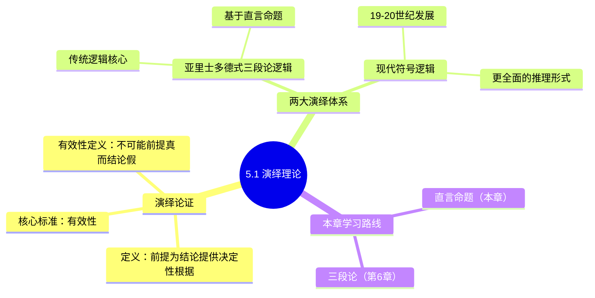

**相关笔记：** [[4.6 含混谬误]] | [[5.2 类与直言命题]]

> [!abstract] 概览
> 本节是第5章的引论部分，从整体上介绍==演绎理论==的基本框架。核心内容包括：演绎论证的定义与本质、==有效性==作为演绎论证的核心评估标准、==亚里士多德式三段论逻辑==与==现代符号逻辑==两大演绎推理体系的对比，以及本章的学习路线——从直言命题出发，逐步构建三段论推理体系。

## 一、知识结构总览

## 二、核心思想与证明技巧

### 2.1 演绎论证的本质

> [!def] 演绎论证（Deductive Argument）
> ==演绎论证==是这样一种论证：其==前提==被断定为==结论==的真提供了==决定性的根据==（conclusive grounds）。也就是说，如果前提为真，那么结论不可能为假。

演绎论证与归纳论证的根本区别在于**前提对结论的支持力度**：

| 特征 | 演绎论证 | 归纳论证 |
|------|---------|---------|
| 前提对结论的支持 | 决定性的（conclusive） | 概率的（probable） |
| 核心评估标准 | 有效性（validity） | 强度（strength） |
| 真值保留 | 前提真 → 结论必然真 | 前提真 → 结论可能真 |

> [!tip] 理解"决定性根据"
> 所谓"决定性根据"，意味着结论的真值已经**蕴含**在前提之中。演绎推理本质上是一种"真值提取"过程——它不增加新的信息内容，只是将前提中隐含的信息显式地表达出来。这就像数学中等式两边同时除以一个非零数：结论已经包含在前提中，推理只是将其揭示出来。

### 2.2 有效性：演绎论证的核心标准

> [!def] 有效性（Validity）
> 一个演绎论证是==有效的==，当且仅当==不可能出现前提全部为真而结论为假的情况==。

关于有效性，需要把握以下几个关键点：

1. **有效性是关于论证形式的属性，而非关于内容的属性。** 我们评估的是一个论证的推理结构是否正确，而不是其前提或结论实际上是否为真。

2. **有效性与真值是独立的概念。** 一个论证可能：
   - 有效且前提为真（最理想的情况）
   - 有效但前提为假（推理结构正确，但出发点有问题）
   - 无效但前提为真（推理结构有缺陷）
   - 无效且前提为假

3. **有效性保证的是条件性的真值传递：** 如果前提为真，则结论必然为真。用符号表示：

$$\text{如果 } P_1 \land P_2 \land \cdots \land P_n \text{ 为真，则 } C \text{ 必然为真}$$

> [!tip] 记忆口诀
> ==有效性只管形式不管内容==。判断有效性时，我们问的是："假设前提都是真的，结论有没有可能为假？"如果回答"不可能"，则论证有效；如果回答"有可能"，则论证无效。

### 2.3 两大演绎推理体系

> [!def] 亚里士多德式三段论逻辑（Aristotelian Syllogistic Logic）
> ==亚里士多德式三段论逻辑==是由亚里士多德在公元前4世纪创立的演绎推理体系，以==三段论==（syllogism）为核心推理形式。三段论由恰好两个前提和一个结论组成，所有命题都是==直言命题==（即关于类之间关系的命题）。

> [!def] 现代符号逻辑（Modern Symbolic Logic）
> ==现代符号逻辑==是在19-20世纪发展起来的演绎推理体系，使用形式化的符号语言来表示命题和推理。它由弗雷格（Frege）、布尔（Boole）、罗素（Russell）等逻辑学家奠基，具有==更全面地捕获有效推理形式==的能力。

两大体系的对比：

| 对比维度 | 亚里士多德三段论逻辑 | 现代符号逻辑 |
|---------|-------------------|------------|
| 起源时间 | 公元前4世纪 | 19-20世纪 |
| 核心工具 | 三段论 | 命题逻辑、谓词逻辑 |
| 命题类型 | 仅直言命题 | 各类命题 |
| 推理范围 | 类与类之间的关系 | 更广泛的逻辑关系 |
| 表达方式 | 自然语言 | 形式化符号 |
| 历史地位 | 传统逻辑的核心 | 现代逻辑的主流 |

> [!tip] 两大体系的关系
> 现代符号逻辑并不是对亚里士多德逻辑的简单否定或替代。相反，亚里士多德三段论逻辑中的有效推理形式都可以在现代符号逻辑中得到表达和证明。现代逻辑是对传统逻辑的==扩展和深化==，能够处理传统逻辑无法覆盖的推理形式（如关系推理、多重量化等）。学习传统逻辑的价值在于：它提供了理解演绎推理的基本直觉，且在日常论证分析中仍然非常实用。

### 2.4 本章学习路线

本章的学习目标是掌握传统逻辑的基本构件——==直言命题==，为第6章学习三段论推理奠定基础。学习路线如下：

1. **直言命题的基本概念**（5.2）：类、直言命题的定义
2. **四种标准形式直言命题**（5.3）：A、E、I、O命题
3. **质、量与周延性**（5.4）：命题的基本属性
4. **传统对当方阵**（5.5）：四种命题之间的逻辑关系
5. **其他推理**（5.6-5.7）：换位、换质等直接推理

## 三、补充理解与易混淆点

### 补充理解

> [!info] 补充1：Aristotle《前分析篇》与演绎理论的起源
> **来源：** Aristotle, *Prior Analytics* (《前分析篇》), Book I, c. 350 BCE
>
> Aristotle在《前分析篇》中首次系统阐述了三段论理论，这是人类历史上最早的演绎逻辑系统。Aristotle的核心洞察是：演绎推理的有效性取决于论证的**形式**而非内容。这一"形式独立性"思想是整个逻辑学的基石。Aristotle将演绎论证定义为"前提为结论提供决定性根据的论证"，这一定义至今仍被广泛接受。

> [!info] 补充2：Hume的归纳问题与演绎的确定性
> **来源：** Hume, D. (1748). *An Enquiry Concerning Human Understanding*, Section IV.
>
> David Hume提出的"归纳问题"（Problem of Induction）从反面凸显了演绎推理的独特地位。Hume指出：归纳推理（从经验观察到普遍概括）永远不能达到逻辑上的确定性——无论我们观察到多少个白天鹅，都不能确定"所有天鹅都是白色的"。但演绎推理不同：如果前提为真且形式有效，结论**必然**为真。演绎的这种"保真性"（truth-preserving）是其与归纳推理的根本区别。

> [!info] 演绎与归纳的边界
> 在日常语言中，演绎和归纳的界限有时并不清晰。有些论证既可以被解释为演绎的，也可以被解释为归纳的，取决于我们对论证者意图的理解。例如："所有的天鹅都是白色的，这只鸟是天鹅，所以它是白色的。"如果论证者认为前提为结论提供了决定性根据，这就是演绎论证；如果论证者只是认为前提为结论提供了很强的支持，这就是归纳论证。==判断一个论证是演绎还是归纳，关键在于论证者的意图==。

> [!warning] 常见误区
> 1. **混淆有效性与真值**：有效性不等于真。一个论证可以完全有效但其结论为假（当前提为假时）。反之，一个论证的结论可以为真但论证无效。
> 2. **认为演绎推理"创造新知识"**：演绎推理本质上是分析性的，结论的信息内容已经包含在前提之中。演绎的价值在于揭示前提中隐含的结论，而非产生全新的知识。
> 3. **轻视传统逻辑**：虽然现代符号逻辑更强大，但传统三段论逻辑在日常论证分析中仍然非常实用，且是理解现代逻辑的重要基础。

### 易混淆点

> [!warning] 误区：演绎=必然正确
> ❌ **错误理解：** 演绎论证的结论一定是正确的，只要它是演绎推理就得不出错误的结论。
> ✅ **正确理解：** 演绎论证的==有效性==只保证"如果前提为真，则结论必然为真"，但并不保证前提本身为真。一个有效的演绎论证仍然可能因为前提为假而得出错误的结论。==演绎有效 ≠ 前提真 ≠ 结论真==。
> **辨析：** 有效性是关于论证**形式**的属性，而非关于**内容**的属性。评估有效性时，我们假设前提为真，然后检查结论是否可能为假。因此，"有效"和"正确"是两个不同层面的概念。

> [!warning] 误区：归纳比演绎低级
> ❌ **错误理解：** 演绎推理比归纳推理更高级、更可靠，归纳推理只是演绎推理的"劣质替代品"。
> ✅ **正确理解：** 演绎和归纳是两种==适用场景不同==的推理方式，各有其价值。演绎适用于从已知的一般原则推出具体结论（如数学证明），归纳适用于从观察到的具体实例中总结一般规律（如科学发现）。==在演绎推理无法适用的场合，归纳推理是唯一合理的选择==。
> **辨析：** 科学研究中的大多数重大发现（如牛顿万有引力定律、达尔文进化论）都依赖于归纳推理。没有归纳推理，科学知识体系将无法建立。演绎和归纳是互补关系，而非优劣关系。

---

## 四、习题精选

> [!todo] 习题概览
> | 题号 | 来源 | 核心考点 | 难度 |
> |:-----|:-----|:---------|:-----|
> | 1 | 自编 | 判断演绎与归纳论证 | ⭐ |
> | 2 | 自编 | 有效性判定 | ⭐⭐ |
> | 3 | 自编 | 有效性定义辨析 | ⭐ |

---

### 题1：判断演绎与归纳论证

> [!problem] 题目
> 判断以下论证是演绎论证还是归纳论证，并说明理由：
>
> "所有哺乳动物都是恒温动物。鲸鱼是哺乳动物。因此，鲸鱼是恒温动物。"

> [!faq]- 解答
> 这是一个==演绎论证==。理由：论证者断定前提为结论提供了决定性的根据。两个前提（"所有哺乳动物都是恒温动物"和"鲸鱼是哺乳动物"）如果为真，则结论（"鲸鱼是恒温动物"）不可能为假。该论证具有有效的推理形式——全称例示（Universal Instantiation）。
>
> $\blacksquare$

---

### 题2：判定论证有效性

> [!problem] 题目
> 以下论证是否有效？为什么？
>
> "如果天下雨，地面就会湿。地面湿了。因此，天下雨了。"

> [!faq]- 解答
> 该论证==无效==。
>
> 分析：设 $P$ = "天下雨"，$Q$ = "地面湿"。论证形式为：
> $$P \rightarrow Q$$
> $$Q$$
> $$\therefore P$$
>
> 这是经典的==肯定后件谬误==（Affirming the Consequent）。虽然前提可能都为真，但结论不一定为真——地面湿了可能是因为其他原因（如洒水车经过）。也就是说，==存在前提全部为真而结论为假的可能情况==，因此论证无效。
>
> $\blacksquare$

---

### 题3：辨析有效性概念

> [!problem] 题目
> 说明以下说法是否正确，并解释原因：
>
> "一个有效的论证，如果其前提为真，则结论必然为真。"

> [!faq]- 解答
> 该说法==正确==。
>
> 这正是有效性的定义所保证的。有效性意味着：==不可能出现前提全部为真而结论为假的情况==。因此，如果已知前提全部为真，且论证有效，则结论不可能为假，即结论必然为真。
>
> 用符号表示：若论证有效，则 $\bigwedge_{i=1}^{n} P_i \rightarrow C$ 是一个逻辑真理（重言式）。
>
> $\blacksquare$

> [!tip] 解题思路提示
> 1. **区分演绎与归纳的关键**：看论证者是否声称前提为结论提供了==决定性的==（而非概率性的）根据。如果论证中出现"必然"、"一定"、"不可能不"等表述，通常为演绎论证。
> 2. **判定有效性的核心方法**：假设前提全部为真，问自己"在这种情况下，结论有没有可能为假？"如果回答"不可能"，则论证有效；如果"有可能"，则论证无效。
> 3. **有效性 vs 真值**：始终记住有效性只管形式不管内容。有效论证的前提可以全假，无效论证的结论可以为真——两者是独立的概念。

## 五、视频学习指南

> [!info] 视频资源
> | 资源 | 链接 | 对应内容 | 备注 |
> |:-----|:-----|:---------|:-----|
> | Wireless Philosophy: Deductive Arguments | [链接](https://www.youtube.com/watch?v=K5hYQE5yB6E) | 演绎论证 vs 归纳论证 | 英文，动画讲解 |
> | Wireless Philosophy: Validity | [链接](https://www.youtube.com/watch?v=DbCPBnEwN1s) | 逻辑有效性 | 英文，配合实例 |
> | Kevin deLaplante: Critical Thinking | [链接](https://www.youtube.com/playlist?list=PL0D5B2E32A5D0E8A3) | 演绎与归纳推理 | 英文，系统讲解 |

## 六、教材原文

> [!quote] 核心原文
> "演绎论证是其前提被认为为其结论的真提供了决定性根据的论证。当演绎论证中的前提为真这一事实保证了其结论也一定为真时，该演绎论证就是有效的。"
>
> "亚里士多德系统阐述了三段论理论……现代符号逻辑在19世纪和20世纪发展起来，它使用人工语言来消除自然语言的歧义，并且更全面地捕获有效推理的形式。"

## 参见 Wiki

- [[论证]]：论证的基本概念与分类
- [[有效性]]：有效性的详细定义和判定方法
- [[演绎论证]]：演绎论证的深入分析
- [[归纳论证]]：与演绎论证的对比参照
- [[直言命题]]：本章核心概念——关于类与类之间关系的命题

#学习/逻辑学/直言命题
