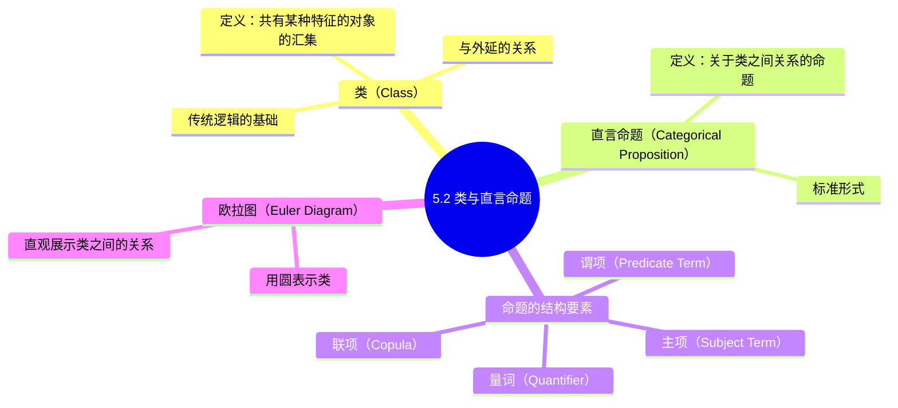

**相关笔记：** [[5.1 演绎理论]] | [[5.3 四种直言命题]]

> [!abstract] 概览
> 本节介绍传统逻辑的基础概念——==类==（class）与==直言命题==（categorical proposition）。传统逻辑以类理论为基础，直言命题是关于类与类之间关系的命题。本节详细阐述类的概念、直言命题的定义与结构（主项、谓项、联项、量词），以及用==欧拉图==（Euler diagram）直观表示类之间关系的方法。

## 一、知识结构总览

## 二、核心思想与证明技巧

### 2.1 类的概念

> [!def] 类（Class）
> ==类==（class）是==共有某种特征的所有对象的汇集==（collection）。一个类由所有具有某个共同属性的对象组成。

理解"类"这一概念，需要把握以下几点：

1. **类由共同特征界定。** 例如，"人类"这个类由所有具有"是人"这一特征的对象汇集而成；"红色的东西"这个类由所有具有"是红色的"这一特征的对象汇集而成。

2. **类与外延密切相关。** 一个词项（term）的==外延==（extension）就是该词项所指称的那个类。例如，"哲学家"的外延就是由所有哲学家组成的类。因此，在传统逻辑中，对词项外延的讨论本质上就是对类的讨论。

3. **类可以是空的。** 一个类可以没有成员，例如"独角兽"这个类。没有成员的类称为==空类==（empty class或null class），记作 $\varnothing$。

4. **类是传统逻辑的基本分析工具。** 传统逻辑（亚里士多德逻辑）将所有命题都理解为关于类与类之间关系的断言，因此类是整个传统逻辑体系的基石。

> [!tip] 类与集合的关系
> 在现代数学中，"类"和"集合"（set）密切相关但有区别。在传统逻辑的语境中，"类"可以粗略地理解为"集合"——即一组对象的汇集。不过，传统逻辑对类的使用是直观的、非形式化的，不需要引入现代集合论的公理化框架。==在逻辑学入门阶段，可以将"类"简单理解为"具有某种共同特征的所有事物的集合"==。

### 2.2 直言命题的定义

> [!def] 直言命题（Categorical Proposition）
> ==直言命题==是==关于类与类之间关系的命题==，它==肯定或否定==某个类（S类）的全部或部分对象==包含在==另一个类（P类）中。

"直言"（categorical）一词源于希腊语 *kategorikos*，意为"绝对的"或"无条件的"。直言命题之所以被称为"直言"，是因为它**直接地、无条件地**断言类之间的关系，而不使用"如果……那么……"之类的条件连接词。

> [!example] 直言命题的例子
> - "所有大学生都是学生。"——断言"大学生"类的全部包含在"学生"类中。
> - "没有猫是狗。"——断言"猫"类与"狗"类没有共同元素。
> - "有中国城市是沿海城市。"——断言"中国城市"类中至少有一个元素在"沿海城市"类中。
> - "有鸟不会飞。"——断言"鸟"类中至少有一个元素不在"会飞的东西"类中。

### 2.3 直言命题的结构要素

一个标准形式的直言命题由四个要素组成：

> [!def] 标准形式直言命题的结构
> $$\text{量词} + \text{主项} + \text{联项} + \text{谓项}$$

#### （1）主项（Subject Term）

> [!def] 主项（Subject Term）
> ==主项==是直言命题中被讨论的类，通常用字母 $S$ 表示。

主项是命题的"主语"，它指称一个类，命题对这个类做出断言。例如在"所有S是P"中，$S$ 就是主项。

#### （2）谓项（Predicate Term）

> [!def] 谓项（Predicate Term）
> ==谓项==是直言命题中主项被断言包含于（或不包含于）的类，通常用字母 $P$ 表示。

谓项是命题的"谓语"，它也指称一个类。例如在"所有S是P"中，$P$ 就是谓项。

#### （3）联项（Copula）

> [!def] 联项（Copula）
> ==联项==是连接主项和谓项的==系动词==，在标准形式中只有两种："是"和"不是"。

联项决定了命题的==质==（quality）：使用"是"的命题是肯定命题，使用"不是"的命题是否定命题。

#### （4）量词（Quantifier）

> [!def] 量词（Quantifier）
> ==量词==指出主项中有多少对象被断言具有（或不具有）谓项所表示的特征。标准形式直言命题使用三种量词：
> - "所有"（all）——表示主项的全部
> - "没有"（no）——表示主项的全部被否定
> - "有"（some）——表示主项中至少有一个

> [!tip] 结构分析示例
> 以"所有大学生都是学生"为例：
> | 要素 | 内容 | 说明 |
> |------|------|------|
> | 量词 | "所有" | 指出主项的全部 |
> | 主项 | "大学生" | 被讨论的类（$S$） |
> | 联项 | "是" | 肯定联项 |
> | 谓项 | "学生" | 主项被断言包含于其中的类（$P$） |

### 2.4 四种标准形式直言命题

标准形式直言命题有且仅有四种，按照量词和联项的组合分类：

| 名称 | 形式 | 简称 | 量词 | 联项 | 示例 |
|------|------|------|------|------|------|
| 全称肯定 | 所有S是P | **A** | 所有 | 是 | 所有猫是动物 |
| 全称否定 | 没有S是P | **E** | 没有 | 不是 | 没有猫是狗 |
| 特称肯定 | 有S是P | **I** | 有 | 是 | 有猫是黑色的 |
| 特称否定 | 有S不是P | **O** | 有 | 不是 | 有猫不是黑色的 |

字母 A、E、I、O 来自拉丁语：
- **A** = *Affirmo*（我肯定）——取第一个元音
- **E** = *Nego*（我否定）——取第一个元音
- **I** = *Affirmo*（我肯定）——取第二个元音
- **O** = *Nego*（我否定）——取第二个元音

> [!tip] 记忆方法
> A和I是肯定命题（来自 *Affirmo*），E和O是否定命题（来自 *Nego*）。A和E是全称命题（All、nE），I和O是特称命题（sIme、sOne）。

### 2.5 欧拉图（Euler Diagram）

> [!def] 欧拉图（Euler Diagram）
> ==欧拉图==是用==圆==来表示==类==之间关系的图形工具，由瑞士数学家欧拉（Leonhard Euler, 1707-1783）发明。

欧拉图的基本原理：
- 每个类用一个圆表示
- 圆内的点代表该类的成员
- 圆与圆之间的位置关系直观展示类与类之间的关系

四种基本的类关系（对应四种直言命题）：

| 关系 | 欧拉图描述 | 对应命题 |
|------|-----------|---------|
| 包含关系 | S圆完全在P圆内 | A命题：所有S是P |
| 排斥关系 | S圆与P圆完全分离 | E命题：没有S是P |
| 部分重合 | S圆与P圆部分重叠 | I命题：有S是P |
| 部分不重合 | S圆部分在P圆外 | O命题：有S不是P |

> [!tip] 欧拉图的价值
> 欧拉图的最大优势在于==直观性==。通过简单的圆形图，我们可以一目了然地看到类与类之间的包含、排斥、交叉等关系。在学习三段论时，欧拉图（及其改进形式——文恩图）将成为检验推理有效性的重要工具。==建议在学习时动手画图，培养对类关系的直观感受==。

## 三、补充理解与易混淆点

### 补充理解

> [!info] 补充1：Boole的类代数——从逻辑到数学
> **来源：** Boole, G. (1854). *An Investigation of the Laws of Thought*. Walton and Maberly.
>
> George Boole在《思维的规律研究》中将逻辑学建立在代数基础之上，开创了"类代数"（algebra of classes）。Boole用数学符号表示类的运算：类的"积"（intersection）对应逻辑中的"且"，类的"和"（union）对应"或"，补类对应"非"。这一工作使得逻辑学从哲学的附属学科转变为一个严格的数学分支，为后来的数理逻辑奠定了基础。

> [!info] 补充2：Cantor的集合论与"类"的现代理解
> **来源：** Cantor, G. (1895). "Contributions to the Founding of the Theory of Transfinite Numbers".
>
> Georg Cantor在19世纪末创立的集合论（Mengenlehre）为"类"的概念提供了精确的数学基础。Cantor将"集合"定义为"我们直觉或思维中确定的、有区别的对象的整体"。传统逻辑中的"类"在现代数学中被重新表述为"集合"，直言命题中主项和谓项的关系被重新理解为集合之间的包含、相交和排斥关系。这一转变是逻辑学现代化进程的关键一步。

> [!info] "类"的日常理解与逻辑学理解
> 在日常生活中，"类"（class）常指分类或等级（如"头等舱"）。但在逻辑学中，"类"是一个严格的技术术语，指"具有某种共同特征的所有对象的汇集"。==逻辑学中的"类"更接近于数学中的"集合"概念==。学习时需要注意区分这两个不同语境下的含义。

> [!info] 词项的外延与类的关系
> 一个词项（term）的==外延==（extension）就是该词项所指称的那个类。例如：
> - "红色"的外延 = 所有红色事物的类
> - "大于10的偶数"的外延 = $\{12, 14, 16, \ldots\}$ 这个类
>
> 因此，当我们说"主项S"时，实际上是在讨论S的外延——即S所指称的那个类。传统逻辑对直言命题的分析，本质上就是对词项外延之间关系的分析。

> [!warning] 常见误区
> 1. **混淆"类"与"概念"**：类是对象的汇集（外延），概念是类的特征（内涵）。两者密切相关但不同。例如，"三角形"这个概念（内涵：有三条边和三个角的图形）对应于"所有三角形的汇集"这个类（外延）。
> 2. **忽视量词"有"的含义**：在逻辑学中，"有"（some）的意思是"至少有一个"（at least one），而不是日常语言中有时暗示的"恰好一个"或"仅有一部分"。这一点在后续学习对当关系时非常重要。
> 3. **将非标准形式命题误认为标准形式**：日常语言中的许多命题并不直接符合"量词 + 主项 + 联项 + 谓项"的标准形式，需要先进行翻译转换才能进行逻辑分析。

### 易混淆点

> [!warning] 误区：类=集合完全相同
> ❌ **错误理解：** 传统逻辑中的"类"和现代数学中的"集合"是完全相同的概念，可以不加区分地互换使用。
> ✅ **正确理解：** 传统逻辑中的"类"虽然与现代数学中的"集合"有密切联系，但两者并不完全相同。传统逻辑的"类"有==哲学内涵==——它不仅是一组对象的汇集，还承载着"共同特征"的含义（即类的成员共有某种属性）。现代集合论中的"集合"则是纯形式化的数学概念，不依赖于"共同特征"的直觉。
> **辨析：** 在逻辑学入门阶段，可以将"类"粗略理解为"集合"，但需要注意传统逻辑对类的使用是==直观的、非形式化的==，不需要引入现代集合论的公理化框架（如ZFC公理系统）。

> [!warning] 误区：直言命题=简单命题
> ❌ **错误理解：** 直言命题就是"简单的命题"，没有特定的结构要求，任何关于事物的陈述都可以叫直言命题。
> ✅ **正确理解：** 直言命题有==严格的结构要求==——必须符合"量词 + 主项 + 联项 + 谓项"的标准形式，且必须是关于==类与类之间关系==的断言。不符合这一结构的命题（如条件命题"如果……那么……"）不是直言命题。
> **辨析：** 直言命题的"直言"（categorical）意味着它直接地、无条件地断言类之间的关系，而不使用条件连接词。日常语言中的许多命题需要经过翻译转换才能成为标准形式的直言命题。

---

## 四、习题精选

> [!todo] 习题概览
> | 题号 | 来源 | 核心考点 | 难度 |
> |:-----|:-----|:---------|:-----|
> | 1 | 自编 | 结构要素分析 | ⭐ |
> | 2 | 自编 | 欧拉图绘制 | ⭐⭐ |
> | 3 | 自编 | 非标准形式改写 | ⭐⭐ |

---

### 题1：分析直言命题结构要素

> [!problem] 题目
> 分析以下直言命题的结构要素（量词、主项、联项、谓项），并指出其属于A、E、I、O中的哪一种：
>
> "没有哲学家是全知全能的。"

> [!faq]- 解答
> | 要素 | 内容 |
> |------|------|
> | 量词 | "没有" |
> | 主项 | "哲学家"（$S$） |
> | 联项 | "不是"（"没有……是……"等价于"所有……不是……"） |
> | 谓项 | "全知全能的（人）"（$P$） |
> | 类型 | **E命题**（全称否定） |
>
> 注意："没有S是P"虽然表面上看量词是"没有"，但其逻辑含义是"所有S都不是P"，因此是全称否定命题。
>
> $\blacksquare$

---

### 题2：绘制欧拉图

> [!problem] 题目
> 用欧拉图表示以下两个类之间的关系：
>
> （a）"医生"类与"人类"类
> （b）"猫"类与"狗"类

> [!faq]- 解答
> **（a）"医生"类与"人类"类**
>
> 所有医生都是人类，因此"医生"类完全包含在"人类"类中。欧拉图表示为：一个较小的圆（医生）完全在一个较大的圆（人类）内部。
>
> **（b）"猫"类与"狗"类**
>
> 没有猫是狗，因此"猫"类与"狗"类是完全分离的。欧拉图表示为：两个互不相交的圆。
>
> $\blacksquare$

---

### 题3：改写为标准形式

> [!problem] 题目
> 将以下日常语言命题改写为标准形式的直言命题，并指出其类型：
>
> "凡是金属都能导电。"

> [!faq]- 解答
> 标准形式改写：**"所有金属都是能导电的（东西）。"**
>
> | 要素 | 内容 |
> |------|------|
> | 量词 | "所有" |
> | 主项 | "金属"（$S$） |
> | 联项 | "是" |
> | 谓项 | "能导电的（东西）"（$P$） |
> | 类型 | **A命题**（全称肯定） |
>
> 注意："凡是……都……"是日常语言中表达全称肯定命题的常见句式，需要转换为"所有S是P"的标准形式。
>
> $\blacksquare$

> [!tip] 解题思路提示
> 1. **结构分析四步法**：找量词（所有/没有/有）→ 找主项（被讨论的类）→ 找联项（是/不是）→ 找谓项（主项被断言包含于其中的类）。
> 2. **欧拉图绘制步骤**：先确定命题类型（A/E/I/O），再根据类型选择对应的圆的位置关系（包含/排斥/部分重合/部分不重合）。
> 3. **非标准形式改写**：识别日常语言中的等价表达（如"凡是……都……"="所有"、"没有一个……是……"="没有……是……"），统一转换为"量词 + 主项 + 联项 + 谓项"的标准形式。

## 五、视频学习指南

> [!info] 视频资源
> | 资源 | 链接 | 对应内容 | 备注 |
> |:-----|:-----|:---------|:-----|
> | Wireless Philosophy: Categorical Propositions | [链接](https://www.youtube.com/watch?v=EqyvA5o0QLE) | 直言命题的定义与结构 | 英文，动画讲解 |
> | Kevin deLaplante: Categorical Logic | [链接](https://www.youtube.com/playlist?list=PL0D5B2E32A5D0E8A3) | 类与直言命题 | 英文，系统讲解 |
> | Michael Genesereth: Intro to Logic | [链接](https://www.youtube.com/watch?v=KV2YsMBBQ1M) | 类的基本概念 | 英文，Stanford课程 |

## 六、教材原文

> [!quote] 核心原文
> "类是共有某种特征的所有对象的汇集。传统逻辑正是建立在这一类概念基础之上的。"
>
> "直言命题是关于类与类之间的关系的命题，它肯定或否定某个类的全部或部分对象包含在另一个类之中。"

## 参见 Wiki

- [[外延与内涵]]：词项的外延即该词项所指称的类
- [[论证]]：直言命题是构建演绎论证的基本材料
- [[直言命题]]：直言命题的完整概念页
- [[5.1 演绎理论]]：演绎论证的基本概念
- [[5.3 四种直言命题]]：四种标准形式直言命题的详细分析

#学习/逻辑学/直言命题
