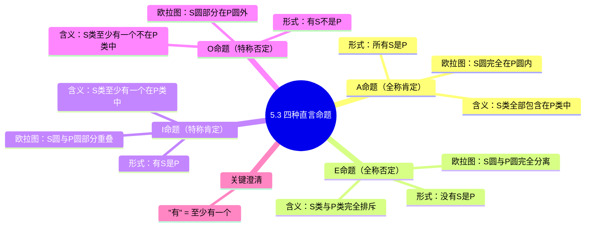

**相关笔记：** [[5.2 类与直言命题]] | [[5.4 质、量与周延性]]

> [!abstract] 概览
> 本节详细分析四种标准形式==直言命题==——A（全称肯定）、E（全称否定）、I（特称肯定）、O（特称否定）。对每种命题，分别从逻辑形式、含义解读、欧拉图表示三个维度进行阐述，并特别澄清特称量词"有"的逻辑含义。欧拉图是贯穿全节的核心可视化工具。

## 一、知识结构总览



## 二、核心思想与证明技巧

### 2.1 A命题：全称肯定（Universal Affirmative）

> [!def] A命题（全称肯定命题）
> ==A命题==的标准形式为 ==所有S是P==（All S is P），它断言：==S类的全部对象都包含在P类中==。

**含义解读：**

A命题断言的是一种**包含关系**（inclusion）。当我们说"所有S是P"时，我们的意思是：如果你是S类中的任何一个成员，那么你一定也是P类的成员。用集合论的语言来说，$S$ 是 $P$ 的子集：

$$S \subseteq P$$

> [!example] A命题的实例
> - "所有猫都是动物。"——"猫"类的每一个成员都是"动物"类的成员。
> - "所有等边三角形都是等角三角形。"——如果你是一个等边三角形，那么你一定是等角三角形。

**欧拉图表示：**

A命题的欧拉图：$S$ 圆完全在 $P$ 圆内部。

```
    ┌─────────────────────┐
    │         P           │
    │    ┌───────────┐    │
    │    │     S     │    │
    │    └───────────┘    │
    └─────────────────────┘
```

图示说明：$S$ 的每一个点都在 $P$ 内部，没有例外。这精确地对应了"所有S是P"的含义。

> [!tip] A命题的直觉理解
> 想象 $P$ 是一个大房间，$S$ 是房间里的一个小圈子。A命题说：$S$ 圈子里的每一个人都在 $P$ 房间里。但 $P$ 房间里可能还有不属于 $S$ 的人——A命题并不排除这种情况。

### 2.2 E命题：全称否定（Universal Negative）

> [!def] E命题（全称否定命题）
> ==E命题==的标准形式为 ==没有S是P==（No S is P），它断言：==S类和P类没有共同元素==，即两个类是完全排斥的。

**含义解读：**

E命题断言的是一种**排斥关系**（exclusion）。当我们说"没有S是P"时，我们的意思是：$S$ 类和 $P$ 类的交集为空集。用集合论的语言来说：

$$S \cap P = \varnothing$$

等价地，"没有S是P"也可以理解为"所有S都不是P"——$S$ 的每一个成员都不在 $P$ 中。

> [!example] E命题的实例
> - "没有猫是狗。"——"猫"类和"狗"类没有任何共同成员。
> - "没有三角形是四边形。"——一个图形不可能既是三角形又是四边形。

**欧拉图表示：**

E命题的欧拉图：$S$ 圆和 $P$ 圆完全分离，互不相交。

```
  ┌───────────┐         ┌───────────┐
  │     S     │         │     P     │
  └───────────┘         └───────────┘
```

图示说明：$S$ 圆和 $P$ 圆之间没有任何重叠区域，两个类完全排斥。

> [!tip] E命题的直觉理解
> 想象 $S$ 和 $P$ 是两个完全不同的房间，一个人不可能同时出现在两个房间里。E命题说：如果你在 $S$ 房间里，那你一定不在 $P$ 房间里；反过来也一样。

### 2.3 I命题：特称肯定（Particular Affirmative）

> [!def] I命题（特称肯定命题）
> ==I命题==的标准形式为 ==有S是P==（Some S is P），它断言：==S类中至少有一个对象在P类中==。

**含义解读：**

I命题断言的是一种**部分重合关系**（partial overlap）。当我们说"有S是P"时，我们的意思是：$S$ 类和 $P$ 类的交集不为空。用集合论的语言来说：

$$S \cap P \neq \varnothing$$

> [!example] I命题的实例
> - "有猫是黑色的。"——至少有一只猫是黑色的。
> - "有学生是运动员。"——至少有一个学生同时也是运动员。

**欧拉图表示：**

I命题的欧拉图：$S$ 圆和 $P$ 圆部分重叠，重叠区域非空。

```
    ┌───────────┐
    │     S     │
    │  ┌────────┼────┐
    │  │ 重叠区 │    │
    └──┼────────┘    │
       │      P      │
       └─────────────┘
```

图示说明：$S$ 和 $P$ 之间存在一个非空的重叠区域，该区域中的对象同时属于 $S$ 类和 $P$ 类。

> [!tip] I命题的直觉理解
> 想象 $S$ 和 $P$ 是两个有部分重叠的圆。I命题只要求重叠区域里至少有一个点，而不关心重叠区域有多大，也不关心非重叠区域的情况。

### 2.4 O命题：特称否定（Particular Negative）

> [!def] O命题（特称否定命题）
> ==O命题==的标准形式为 ==有S不是P==（Some S is not P），它断言：==S类中至少有一个对象不在P类中==。

**含义解读：**

O命题断言的是一种**部分不包含关系**（partial exclusion）。当我们说"有S不是P"时，我们的意思是：$S$ 类中存在至少一个成员不在 $P$ 类中。用集合论的语言来说：

$$S - P \neq \varnothing$$

即 $S$ 与 $P$ 的差集不为空，或者说 $S$ 不是 $P$ 的子集。

> [!example] O命题的实例
> - "有猫不是黑色的。"——至少有一只猫不是黑色的。
> - "有学生不是运动员。"——至少有一个学生不是运动员。

**欧拉图表示：**

O命题的欧拉图：$S$ 圆部分在 $P$ 圆外部，即 $S$ 中有不在 $P$ 中的部分。

```
    ┌───────────┐
    │     S     │
    │  ┌────────┼────┐
    │  │ 重叠区 │    │
    └──┼────────┘    │
       │      P      │
       └─────────────┘
```

图示说明：$S$ 圆中有一部分（左半部分）在 $P$ 圆外部，这些对象属于 $S$ 但不属于 $P$。

> [!tip] I命题与O命题的欧拉图对比
> 注意：I命题和O命题的欧拉图在形式上是相同的（都是两个部分重叠的圆），但它们关注的区域不同：
> - I命题关注的是==重叠区域==（$S \cap P$），断言该区域非空
> - O命题关注的是==S中不在P内的区域==（$S - P$），断言该区域非空
>
> 这就好比看同一幅图，I命题指向两个圆的交集部分说"这里有东西"，O命题指向S圆中不与P重叠的部分说"这里也有东西"。

### 2.5 关键澄清："有"的逻辑含义

> [!warning] "有" = "至少有一个"
> 在逻辑学中，特称量词"有"（some）的精确含义是==至少有一个==（at least one），而**不是**日常语言中有时暗示的以下含义：
> - ~~"恰好一个"~~
> - ~~"仅有一部分（但不是全部）"~~
> - ~~"有且只有一些"~~

这一点极其重要。举例说明：

> [!example] "有"的含义辨析
> 命题"有猫是黑色的"在逻辑学中的含义仅仅是：==至少存在一只黑色的猫==。
>
> 它**不排除**以下情况：
> - 所有猫都是黑色的（此时"有猫是黑色的"仍然为真，因为"至少有一个"在"全部都是"时自然满足）
> - 只有一只猫是黑色的
> - 大部分猫是黑色的
>
> 换句话说，"有S是P"只承诺了==存在性==（existence），即 $S \cap P \neq \varnothing$，而不对数量做任何进一步的限制。

> [!tip] 理解"有"的集合论解释
> 从集合论的角度来看：
> - "有S是P" $\Leftrightarrow$ $S \cap P \neq \varnothing$（交集非空）
> - "有S不是P" $\Leftrightarrow$ $S \not\subseteq P$（S不是P的子集）
>
> 这两个命题都只要求某个集合不为空，而不涉及具体的数量。==在逻辑学中，"有"是一个存在量词，而非数量量词==。

### 2.6 四种命题的总结对比

| 类型 | 名称 | 标准形式 | 类关系 | 集合论表达 | 欧拉图特征 |
|------|------|---------|--------|-----------|-----------|
| A | 全称肯定 | 所有S是P | S完全包含于P | $S \subseteq P$ | S圆在P圆内 |
| E | 全称否定 | 没有S是P | S与P完全排斥 | $S \cap P = \varnothing$ | S圆与P圆分离 |
| I | 特称肯定 | 有S是P | S与P有共同元素 | $S \cap P \neq \varnothing$ | S圆与P圆重叠 |
| O | 特称否定 | 有S不是P | S中有不在P中的元素 | $S \not\subseteq P$ | S圆部分在P圆外 |

## 三、补充理解与易混淆点

### 补充理解

> [!info] 补充1：Aristotle《解释篇》与命题分类的起源
> **来源：** Aristotle, *De Interpretatione* (《解释篇》), c. 350 BCE.
>
> Aristotle在《解释篇》中首次对命题进行了系统分类，将命题按量（全称/特称）和质（肯定/否定）两个维度进行划分，形成了A/E/I/O四种基本类型。Aristotle特别强调："有"（some）意味着"至少有一个"（at least one），而非"恰好一个"——这一精确区分至今仍是逻辑教学中的重点。

> [!info] 补充2：中世纪逻辑学家与A/E/I/O的命名
> **来源：** Peter of Spain, *Tractatus* (《逻辑纲要》), c. 1230 CE.
>
> A/E/I/O四个字母的命名传统源于中世纪逻辑学家。A和I取自拉丁语 *Affirmo*（我肯定）的前两个元音，E和O取自 *Nego*（我否定）的前两个元音。这一助记系统由Peter of Spain等中世纪学者推广，成为西方逻辑教学的标准术语，沿用至今已超过800年。

> [!info] 欧拉图与文恩图的关系
> 本节使用的是==欧拉图==（Euler Diagram），由欧拉在18世纪发明。在后续章节中，我们将学习==文恩图==（Venn Diagram），由英国逻辑学家约翰·文恩（John Venn, 1834-1923）在1881年的著作 *Symbolic Logic* 中提出。两者的区别在于：
> - **欧拉图**：根据命题的实际内容画出具体的类关系图，不同的命题有不同的图形
> - **文恩图**：使用统一的标准图形（所有可能的区域都预先画出），通过"涂阴影"或"打勾"来标记哪些区域为空、哪些区域非空
>
> 文恩图在检验三段论有效性时更为系统化和方便，是后续学习的重点工具。

> [!info] 补充文献
> - **Aristotle, *Prior Analytics***（前分析篇）：直言三段论的原始文献，亚里士多德在其中系统阐述了三段论理论和直言命题的分类。
> - **John Venn, *Symbolic Logic* (1881)**：文恩图的原始文献，提出了比欧拉图更为系统化的图形表示方法。

> [!warning] 常见误区
> 1. **将"有S是P"理解为"有S是P且有S不是P"**：这是最常见的错误。"有S是P"只断言交集非空，并不隐含"有S不是P"。事实上，如果所有S都是P，"有S是P"仍然为真。
> 2. **将"有S不是P"理解为"多数S不是P"**："有S不是P"只断言S中至少有一个不在P中，不涉及比例或数量。
> 3. **混淆A命题和I命题的欧拉图**：A命题的欧拉图中S完全在P内（没有S在P外），而I命题的欧拉图中S和P部分重叠（有S在P外，也有S在P内）。两者的图形结构是不同的。
> 4. **认为E命题的欧拉图可以有不同的画法**：E命题的欧拉图只有一种标准画法——两个完全分离的圆。如果两个圆有重叠，就不再是E命题所描述的关系。

### 易混淆点

> [!warning] 误区："有"="恰好一个"
> ❌ **错误理解：** "有S是P"的意思是"恰好有一个S是P"，或者"只有一部分S是P（暗示另一部分不是P）"。
> ✅ **正确理解：** 在逻辑学中，"有"（some）的精确含义是==至少有一个==（at least one）。"有S是P"为真，并不排除"所有S都是P"也为真的可能。==特称量词"有"是一个存在量词，而非数量量词==。
> **辨析：** "有S是P"只承诺了==存在性==（$S \cap P \neq \varnothing$），而不对数量做任何进一步限制。如果所有S都是P，那么"有S是P"自然为真（因为"全部"蕴含"至少有一个"）。

> [!warning] 误区：I和O命题等价
> ❌ **错误理解：** I命题"有S是P"和O命题"有S不是P"表达的意思差不多，两者可以互换使用。
> ✅ **正确理解：** I命题和O命题有==本质区别==：I命题是==肯定命题==（断言S与P有共同元素），O命题是==否定命题==（断言S中有元素不在P中）。两者的逻辑关系完全不同——I命题关注的是==重叠区域==（$S \cap P$），O命题关注的是==S中不在P内的区域==（$S - P$）。
> **辨析：** I命题和O命题虽然都使用特称量词"有"，但它们的==质不同==（I是肯定的，O是否定的），这决定了它们在逻辑推理中的行为完全不同。例如，在传统对当方阵中，I命题和O命题之间是==下反对关系==（可以同真，不能同假），而非等价关系。

---

## 四、习题精选

> [!todo] 习题概览
> | 题号 | 来源 | 核心考点 | 难度 |
> |:-----|:-----|:---------|:-----|
> | 1 | 自编 | 命题类型判断 | ⭐ |
> | 2 | 自编 | 全称蕴含特称 | ⭐⭐ |
> | 3 | 自编 | I与O共存性 | ⭐⭐ |

---

### 题1：判断命题类型与欧拉图

> [!problem] 题目
> 指出以下命题属于A、E、I、O中的哪一种，并画出其欧拉图：
>
> （a）"所有等腰三角形都是等角三角形。"
> （b）"没有奇数是偶数。"
> （c）"有鸟会游泳。"
> （d）"有学生不是成年人。"

> [!faq]- 解答
> **（a）** ==A命题==（全称肯定）
> - 形式：所有S是P（S = 等腰三角形，P = 等角三角形）
> - 欧拉图：S圆完全在P圆内
>
> **（b）** ==E命题==（全称否定）
> - 形式：没有S是P（S = 奇数，P = 偶数）
> - 欧拉图：S圆与P圆完全分离
>
> **（c）** ==I命题==（特称肯定）
> - 形式：有S是P（S = 鸟，P = 会游泳的东西）
> - 欧拉图：S圆与P圆部分重叠
>
> **（d）** ==O命题==（特称否定）
> - 形式：有S不是P（S = 学生，P = 成年人）
> - 欧拉图：S圆部分在P圆外
>
> $\blacksquare$

---

### 题2：分析全称特称推理

> [!problem] 题目
> 判断以下说法是否正确，并说明理由：
>
> "如果'所有S是P'为真，那么'有S是P'也一定为真。"

> [!faq]- 解答
> 该说法==正确==（假设S类非空）。
>
> 推理过程：
> 1. "所有S是P"为真，意味着 $S$ 的每一个成员都是 $P$ 的成员。
> 2. 如果 $S$ 类非空（即 $S$ 中至少有一个成员），那么这个成员同时也是 $P$ 的成员。
> 3. 因此，$S \cap P \neq \varnothing$，即"有S是P"为真。
>
> 用集合论语言：若 $S \subseteq P$ 且 $S \neq \varnothing$，则 $S \cap P = S \neq \varnothing$。
>
> **注意**：这个推理依赖于 $S$ 类非空的假设。如果 $S$ 是空类（$S = \varnothing$），则"所有S是P"在传统逻辑中仍然为真（空类包含于任何类），但"有S是P"为假（因为不存在S的成员）。这一区别在现代逻辑和传统逻辑之间是一个重要的分歧点，将在后续章节中详细讨论。
>
> $\blacksquare$

---

### 题3：验证I与O命题共存

> [!problem] 题目
> 以下两个命题能否同时为真？用欧拉图说明你的判断：
>
> - 命题1："有猫是黑色的。"
> - 命题2："有猫不是黑色的。"

> [!faq]- 解答
> 这两个命题==可以同时为真==。
>
> 欧拉图说明：
> - 设 $S$ = 猫，$P$ = 黑色的东西
> - 命题1（"有S是P"）要求 $S \cap P \neq \varnothing$，即重叠区域非空
> - 命题2（"有S不是P"）要求 $S - P \neq \varnothing$，即S中不在P内的区域非空
>
> 当 $S$ 圆和 $P$ 圆部分重叠但 neither 完全包含 nor 完全排斥时，两个条件同时满足：
>
> ```
>     ┌───────────┐
>     │     S     │
>     │  ┌────────┼────┐
>     │  │ 重叠区 │    │
>     └──┼────────┘    │
>        │      P      │
>        └─────────────┘
> ```
>
> - 重叠区域非空 → 命题1为真
> - S中在P外的区域非空 → 命题2为真
>
> 这正是日常语言中"有些猫是黑色的，有些不是"所描述的情况。
>
> $\blacksquare$

> [!tip] 解题思路提示
> 1. **判断命题类型的两步法**：先看==量词==（"所有"/"没有"→全称，"有"→特称），再看==联项==（"是"→肯定，"不是"→否定）。两者组合即可确定A/E/I/O。
> 2. **全称蕴含特称的推理**：若"所有S是P"为真且S非空，则"有S是P"必然为真。但需注意==空类假设==的例外情况。
> 3. **I与O共存性判断**：I命题和O命题是==下反对关系==——可以同真，不能同假。用欧拉图验证时，画两个部分重叠的圆即可同时满足两个命题。

## 五、视频学习指南

> [!info] 视频资源
> | 资源 | 链接 | 对应内容 | 备注 |
> |:-----|:-----|:---------|:-----|
> | Wireless Philosophy: Categorical Propositions | [链接](https://www.youtube.com/watch?v=EqyvA5o0QLE) | 四种直言命题AEIO | 英文，动画讲解 |
> | Kevin deLaplante: Categorical Logic | [链接](https://www.youtube.com/playlist?list=PL0D5B2E32A5D0E8A3) | 欧拉图与命题类型 | 英文，系统讲解 |
> | Michael Genesereth: Intro to Logic | [链接](https://www.youtube.com/watch?v=KV2YsMBBQ1M) | "有"的逻辑含义 | 英文，Stanford课程 |

## 六、教材原文

> [!quote] 核心原文
> "标准形式的直言命题有四种：全称肯定（A）、全称否定（E）、特称肯定（I）和特称否定（O）。"
>
> "在逻辑学中，'有'（some）的意思是'至少有一个'（at least one）。它并不意味着'恰好一个'，也不意味着'仅有一部分'。"

## 参见 Wiki

- [[外延与内涵]]：词项的外延即该词项所指称的类，直言命题分析的是外延之间的关系
- [[论证]]：直言命题是构建演绎论证的基本构件
- [[A_E_I_O 四种命题]]：四种命题的完整概念页
- [[5.2 类与直言命题]]：类与直言命题的基本概念
- [[5.4 质、量与周延性]]：四种命题的质、量特征和周延性分析

#学习/逻辑学/直言命题
