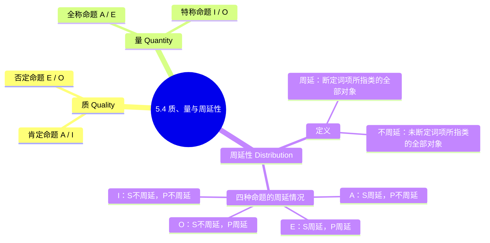

**相关笔记：** [[5.3 四种直言命题]] | [[5.5 传统对当方阵]]

> [!abstract] 概览
> 本节引入分析直言命题的三个基本维度：**质**（肯定还是否定）、**量**（全称还是特称）以及**周延性**（是否断定了某一词项所指类的全部对象）。周延性是后续讨论三段论有效性的核心概念，必须彻底掌握四种命题中主项和谓项各自的周延情况。

## 一、知识结构总览

## 二、核心思想与证明技巧

### 2.1 质（Quality）

> [!def] 质
> **质**是指直言命题是**肯定的**还是**否定的**——即命题对主项所代表的类与谓项所代表的类之间的关系做出了何种性质的断言。

- **肯定命题**（Affirmative）：断言类的包含关系，形式为"是"。A 命题和 I 命题是肯定命题。
- **否定命题**（Negative）：断言类的排斥关系，形式为"不是"。E 命题和 O 命题是否定命题。

> [!tip] 记忆技巧
> A、I 的元音字母来自拉丁语 *affirmo*（我肯定）中的 **A**ff**I**rmo；E、O 的元音字母来自 *nego*（我否定）中的 n**E**g**O**。

### 2.2 量（Quantity）

> [!def] 量
> **量**是指直言命题是**全称的**还是**特称的**——即命题的断言覆盖了主项所代表的类的全部还是仅涉及部分。

- **全称命题**（Universal）：断言关于主项类的**全部**对象。A 命题和 E 命题是全称命题。
- **特称命题**（Particular）：断言关于主项类的**至少一个**对象（"有"意味着"至少有一个"）。I 命题和 O 命题是特称命题。

> [!warning] 常见误解
> 特称命题中的"有"（some）在逻辑学中意味着"至少有一个"，并不暗示"有些是、有些不是"。例如，"有S是P"为真，并不排除"所有S是P"也为真的可能。

### 2.3 周延性（Distribution）

> [!def] 周延性
> 在一个直言命题中，如果一个词项（主项或谓项）所指代的类的==每一个对象==都被该命题所断言，则称该词项是**周延的**（distributed）；否则，称该词项是**不周延的**（undistributed）。

周延性是直言命题逻辑中最为关键的概念之一。它直接关系到后续三段论推理规则的有效性判定。理解周延性的核心在于：**命题是否对该词项所指的整个类做出了断言**。

> [!tip] 直觉理解
> 想象词项所指的类是一个集合。如果命题谈论的是这个集合的**全部元素**，那么该词项就是周延的；如果命题只涉及这个集合的**部分元素**（即使它没有明确说"部分"），那么该词项就是不周延的。

### 2.4 四种命题的周延性分析

#### A 命题：所有 S 是 P

$$\text{所有 } S \text{ 是 } P$$

- **S（主项）周延**：命题明确断定了 S 类的**全部**对象都在 P 类中。"所有"一词直接覆盖了 S 的全部外延。
- **P（谓项）不周延**：命题只断定了 P 类中**有** S 类的全部对象，但并未断定 P 类的全部对象。P 类中可能还有不属于 S 的其他对象。

> [!example] 具体实例
> "所有猫是动物。"——这里断定了**每一只猫**都是动物（S 周延），但并没有断定**每一种动物**都是猫（P 不周延，因为还有狗、鸟等动物）。

#### E 命题：没有 S 是 P

$$\text{没有 } S \text{ 是 } P$$

- **S（主项）周延**：命题断定了 S 类的**全部**对象都不在 P 类中。
- **P（谓项）周延**：命题同时也断定了 P 类的**全部**对象都不在 S 类中。"没有 S 是 P"等价于"S 类与 P 类的交集为空"，这一断言是对称的——S 中没有任何元素在 P 中，P 中也没有任何元素在 S 中。

> [!example] 具体实例
> "没有三角形是四边形。"——断定了**每一个三角形**都不是四边形（S 周延），同时也断定了**每一个四边形**都不是三角形（P 周延）。

#### I 命题：有 S 是 P

$$\text{有 } S \text{ 是 } P$$

- **S（主项）不周延**：命题只涉及 S 类的**至少一个**对象，而非全部。
- **P（谓项）不周延**：命题只涉及 P 类的**至少一个**对象，而非全部。

> [!example] 具体实例
> "有学生是运动员。"——只说**有些**学生是运动员（S 不周延），也只说**有些**运动员是学生（P 不周延），并未对任何一方的全部做出断言。

#### O 命题：有 S 不是 P

$$\text{有 } S \text{ 不是 } P$$

- **S（主项）不周延**：命题只涉及 S 类的**至少一个**对象，而非全部。
- **P（谓项）周延**：命题断定了所提及的那些 S 对象被排除在 **P 类的全部**之外。"有 S 不是 P"意味着存在至少一个 S 对象，它不在 P 的任何部分中——这实际上是对 P 的整个类做出了断言。

> [!tip] O 命题谓项周延的直觉理解
> "有 S 不是 P"说的是：在 S 中存在某些对象，这些对象被排斥在 P 的**整个**类之外。要做出这种排斥断言，就必须对 P 的全部有所断言——因为要确认某个对象不在 P 中，就必须确认它不在 P 的任何部分里。

### 2.5 周延性总结表

| 命题类型 | 标准形式 | S（主项） | P（谓项） |
|:--------:|:--------:|:---------:|:---------:|
| A | 所有 S 是 P | **周延** | 不周延 |
| E | 没有 S 是 P | **周延** | **周延** |
| I | 有 S 是 P | 不周延 | 不周延 |
| O | 有 S 不是 P | 不周延 | **周延** |

> [!tip] 记忆口诀
> - **全称命题的主项**总是周延的（A、E 的 S 周延）。
> - **否定命题的谓项**总是周延的（E、O 的 P 周延）。
> - 其余情况一律不周延。

## 三、补充理解与易混淆点

### 补充理解

> [!info] 补充1：周延性概念的历史发展
> **来源：** Scholastic logicians (经院逻辑学家), 12-14世纪; Boethius, *De Syllogismis Categoricis*, 6世纪.
>
> 周延性（distributio）概念的雏形可以追溯到Aristotle，但精确的系统阐述是由中世纪经院逻辑学家完成的。Boethius在6世纪将Aristotle的逻辑著作翻译为拉丁文时，引入了"distributio"（分配/周延）这一术语。经院逻辑学家进一步明确了四种命题的周延规则，形成了"全称命题的主项周延、否定命题的谓项周延"这一经典口诀。

> [!info] 补充2：周延性与现代一阶逻辑的量词
> **来源：** Frege, G. (1879). *Begriffsschrift* (《概念文字》).
>
> 在现代一阶逻辑（谓词逻辑）中，周延性概念被量词（$\forall$ 全称量词、$\exists$ 存在量词）所取代。全称命题"所有S是P"被形式化为 $\forall x(S(x) \rightarrow P(x))$，其中 $S(x)$ 是一个"开公式"，变量 $x$ 被 $\forall$ 约束——这正是"主项S周延"的现代表述。Frege的概念文字（Begriffsschrift）是这一转变的里程碑，它用数学公式完全取代了自然语言的命题分析。

> [!info] 周延性与真假无关
> 周延性是命题的**形式特征**，与命题的真假值无关。一个命题的主项或谓项是否周延，完全取决于该命题的逻辑形式（A/E/I/O），而不取决于该命题所谈论的具体内容。

> [!warning] 最常见的错误：误判 A 命题的谓项为周延
> 初学者最容易犯的错误是认为 A 命题"所有 S 是 P"中 P 也是周延的。关键在于区分：
> - "所有 S 是 P"只说 S 的全部在 P 中，**没有说** P 的全部都在 S 中。
> - 只有当 S 和 P 实际上是同一个类（即定义关系）时，P 才恰好覆盖全部，但这是内容上的巧合，不是形式上的必然。

> [!warning] O 命题谓项周延的论证
> O 命题"有 S 不是 P"中 P 是周延的，这一点初学者往往难以理解。严格论证如下：
> 1. "有 S 不是 P"意味着：存在至少一个对象 $x$，使得 $x \in S$ 且 $x \notin P$。
> 2. $x \notin P$ 意味着 $x$ 不在 P 类的**任何**部分中。
> 3. 要确认 $x$ 不在 P 的任何部分中，就必须对 P 的**整个**类有所断言。
> 4. 因此，P 是周延的。

### 易混淆点

> [!warning] 误区：A命题谓项周延
> ❌ **错误理解：** 在A命题"所有S是P"中，既然S的全部都在P中，那么P也应该被断定了全部，所以P也是周延的。
> ✅ **正确理解：** A命题"所有S是P"只断定了==S的全部在P中==，但==没有断定P的全部都在S中==。P类中可能还有不属于S的其他对象（如"所有猫是动物"中，动物类还包括狗、鸟等）。因此，==A命题的谓项P不周延==。
> **辨析：** 关键在于区分"所有S在P中"和"所有P都在S中"。前者是A命题的含义（S周延），后者不是A命题的含义（P不周延）。只有当S和P恰好是同一个类时（定义关系），P才"碰巧"全部被覆盖，但这是内容上的巧合，不是形式上的必然。

> [!warning] 误区：周延性=重要性
> ❌ **错误理解：** 周延性意味着词项在命题中"更重要"或"更突出"，不周延的词项就是"次要的"或"不重要的"。
> ✅ **正确理解：** 周延性是一个==纯逻辑概念==，指的是命题是否对词项所指类的==全部对象==做出了断言。它与词项在日常语言中的"重要性"、"突出程度"或"语义权重"完全无关。==周延性是形式特征，与内容无关==。
> **辨析：** 例如在"有总统是演员"这个I命题中，"总统"和"演员"都不周延——但这并不意味着两个词项"不重要"。周延性只告诉我们命题是否对某个类的全部做出了断言，而不涉及该类本身是否重要。

---

## 四、习题精选

> [!todo] 习题概览
> | 题号 | 来源 | 核心考点 | 难度 |
> |:-----|:-----|:---------|:-----|
> | 1 | 自编 | 判断周延性 | ⭐ |
> | 2 | 自编 | 辨析A命题谓项 | ⭐⭐ |
> | 3 | 自编 | 对比I与O谓项 | ⭐⭐ |

---

### 题1：判断命题周延性

> [!problem] 题目
> 判断以下命题的类型（A/E/I/O），并指出其主项和谓项各自的周延情况：
>
> (a) 所有哲学家都是思想家。
> (b) 没有科学家是文盲。
> (c) 有诗人是画家。
> (d) 有政治家不是诚实的人。

> [!faq]- 解答
> (a) **A 命题**。"哲学家"（S）**周延**，"思想家"（P）**不周延**。命题断定了所有哲学家都是思想家，但并未断定所有思想家都是哲学家。
>
> (b) **E 命题**。"科学家"（S）**周延**，"文盲"（P）**周延**。命题断定了科学家与文盲两个类完全不相交，对两个类的全部都做出了断言。
>
> (c) **I 命题**。"诗人"（S）**不周延**，"画家"（P）**不周延**。命题只涉及两个类的部分对象。
>
> (d) **O 命题**。"政治家"（S）**不周延**，"诚实的人"（P）**周延**。命题只涉及部分政治家，但断定了这些政治家被排除在"诚实的人"的整个类之外。
>
> $\blacksquare$

---

### 题2：辨析A命题谓项周延性

> [!problem] 题目
> 有人说："在'所有英雄都是勇敢的'这个命题中，'勇敢的'也是周延的，因为如果一个人是英雄，那他一定是勇敢的，所以'勇敢的'涵盖了所有英雄。"这个论证是否正确？请说明理由。

> [!faq]- 解答
> 这个论证是**不正确**的。它混淆了两个不同的方向：
>
> - 命题"所有英雄都是勇敢的"断言的是：**英雄类的全部** $\subseteq$ 勇敢的类的部分。即 S 的全部在 P 中，但 P 中可能还有非英雄的勇敢者。
> - 论证者说的是"勇敢的涵盖了所有英雄"，这只是在重复命题本身的内容（S 的全部在 P 中），并不能推出 P 的全部都被断言了。
> - 周延性要求的是命题对词项所指类的**全部对象**做出断言。该命题没有说"所有勇敢的人都是英雄"，因此 P（"勇敢的"）不周延。
>
> $\blacksquare$

---

### 题3：对比I与O命题谓项

> [!problem] 题目
> 请解释为什么 I 命题"有 S 是 P"的主项和谓项都不周延，而 O 命题"有 S 不是 P"的谓项却是周延的。两者的关键区别在哪里？

> [!faq]- 解答
> 关键区别在于命题对谓项 P 的**断言方式**不同：
>
> - **I 命题**"有 S 是 P"：只断定 S 中至少有一个对象**在 P 中**。这只需要确认该对象落在 P 的某个部分即可，不需要对 P 的全部做出任何断言。因此 P 不周延。
>
> - **O 命题**"有 S 不是 P"：断定 S 中至少有一个对象**不在 P 中**。要确认一个对象不在 P 中，就必须确认它不在 P 的**任何部分**中——这实际上是对 P 的整个类做出了断言（P 的全部都被排斥了该对象）。因此 P 周延。
>
> 简言之：==肯定一个对象在某类中，只需涉及该类的局部；否定一个对象在某类中，则必须涉及该类的全部==。
>
> $\blacksquare$

> [!tip] 解题思路提示
> 1. **周延性判断口诀**：==全称命题的主项周延，否定命题的谓项周延==，其余情况一律不周延。遇到任何命题，先确定A/E/I/O类型，再套用口诀即可。
> 2. **A命题谓项不周延的核心论证**："所有S是P"只断定S的全部在P中，不断定P的全部都在S中。用反例说明：如"所有猫是动物"，但并非所有动物都是猫。
> 3. **I与O谓项差异的本质**：肯定命题（I）将对象放入P类，只需涉及P的局部；否定命题（O）将对象排斥于P类之外，必须确认它不在P的任何部分——因此需要对P的全部做出断言。

## 五、视频学习指南

> [!info] 视频资源
> | 资源 | 链接 | 对应内容 | 备注 |
> |:-----|:-----|:---------|:-----|
> | Michael Genesereth: Intro to Logic | [链接](https://www.youtube.com/watch?v=KV2YsMBBQ1M) | 质、量与周延性 | 英文，Stanford课程 |
> | Kevin deLaplante: Categorical Logic | [链接](https://www.youtube.com/playlist?list=PL0D5B2E32A5D0E8A3) | 周延性图示讲解 | 英文，直观讲解 |
> | Wireless Philosophy: Categorical Propositions | [链接](https://www.youtube.com/watch?v=EqyvA5o0QLE) | 命题的质与量 | 英文，动画讲解 |

## 六、教材原文

> [!quote] Copi, Cohen & McMahon, *Introduction to Logic* (15th ed.), Ch. 5.4
> "The **quality** of a categorical proposition is either affirmative or negative... The **quantity** of a categorical proposition is either universal or particular... A term is said to be **distributed** if the proposition makes a claim about every member of the class denoted by the term."

## 参见 Wiki

- [[论证]]：周延性是判定三段论有效性的基础概念
- [[外延与内涵]]：周延性涉及词项的外延（即词项所指代的类的全部对象）
- [[周延性]]：周延性的完整概念页

#学习/逻辑学/直言命题
