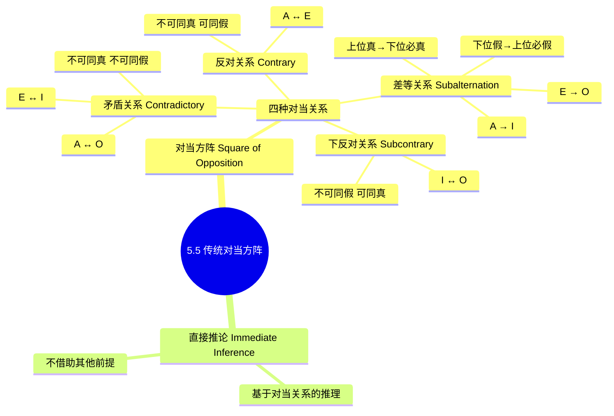
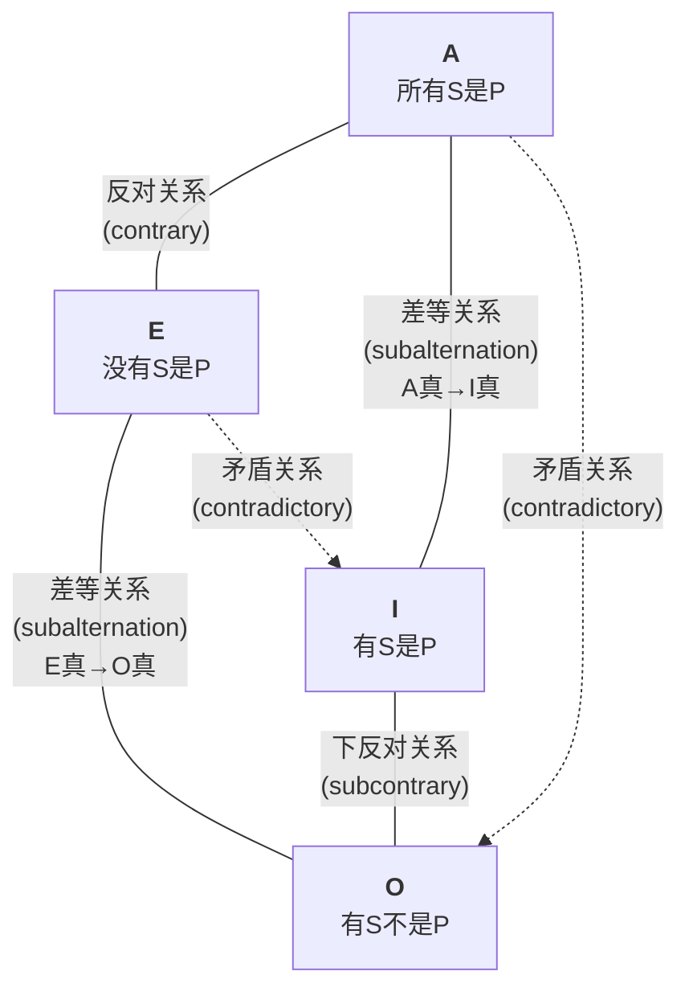

**相关笔记：** [[5.4 质、量与周延性]] | [[5.6 其他直接推论]]

> [!abstract] 概览
> 本节介绍**传统对当方阵**（Square of Opposition），它以正方形图示展示了 A、E、I、O 四种直言命题之间的四种逻辑关系：矛盾关系、反对关系、下反对关系和差等关系。掌握对当方阵使我们能够从某一命题的真假直接推断出其他三种相关命题的真假，是进行**直接推论**的基本工具。

## 一、知识结构总览

## 二、核心思想与证明技巧

### 2.1 对当方阵的图示

对当方阵用正方形的四个角分别放置 A、E、I、O 四种命题，对角线表示矛盾关系，上方横边表示反对关系，下方横边表示下反对关系，两条竖边表示差等关系：

### 2.2 矛盾关系（Contradictory）

> [!def] 矛盾关系
> **矛盾关系**存在于 A 与 O 之间、E 与 I 之间。具有矛盾关系的两个命题==不可同真，也不可同假==。其中一个为真，另一个必为假；其中一个为假，另一个必为真。

- **A ↔ O**："所有 S 是 P"与"有 S 不是 P"矛盾。
- **E ↔ I**："没有 S 是 P"与"有 S 是 P"矛盾。

> [!tip] 矛盾关系的直觉理解
> 矛盾关系是最强的对当关系。如果"所有人都及格了"为真，那么"有人没及格"必为假，反之亦然。两个矛盾命题之间没有任何中间地带——它们穷尽了所有可能性。

**矛盾关系的推理规则：**

| 已知 | 可推出 |
|:----:|:------:|
| A 为真 | O 为假 |
| A 为假 | O 为真 |
| O 为真 | A 为假 |
| O 为假 | A 为真 |
| E 为真 | I 为假 |
| E 为假 | I 为真 |
| I 为真 | E 为假 |
| I 为假 | E 为真 |

### 2.3 反对关系（Contrary）

> [!def] 反对关系
> **反对关系**存在于 A 与 E 之间。具有反对关系的两个命题==不可同真，但可以同假==。

- **A ↔ E**："所有 S 是 P"与"没有 S 是 P"不能同时为真，但可以同时为假。

> [!example] 具体实例
> "所有学生都及格了"（A）和"没有学生及格"（E）不能同时为真——不可能既所有人都及格了又没有人及格。但它们可以同时为假——实际情况可能是"有些学生及格了，有些没有"。

**反对关系的推理规则：**

| 已知 | 可推出 |
|:----:|:------:|
| A 为真 | E 为假 |
| E 为真 | A 为假 |
| A 为假 | E **不确定**（可能真，可能假） |
| E 为假 | A **不确定**（可能真，可能假） |

> [!warning] 常见错误
> 初学者容易将反对关系与矛盾关系混淆。关键区别在于：反对关系允许两个命题**同假**，而矛盾关系不允许。当 A 为假时，不能确定 E 为真（E 也可能为假），反之亦然。

### 2.4 下反对关系（Subcontrary）

> [!def] 下反对关系
> **下反对关系**存在于 I 与 O 之间。具有下反对关系的两个命题==不可同假，但可以同真==。

- **I ↔ O**："有 S 是 P"与"有 S 不是 P"不能同时为假，但可以同时为真。

> [!example] 具体实例
> "有学生及格了"（I）和"有学生没及格"（O）不能同时为假——如果没有人及格，那"有学生及格了"为假，但此时"有学生没及格"为真（前提是学生类非空）。但它们可以同时为真——部分及格、部分不及格时两者皆真。

**下反对关系的推理规则：**

| 已知 | 可推出 |
|:----:|:------:|
| I 为假 | O 为真 |
| O 为假 | I 为真 |
| I 为真 | O **不确定**（可能真，可能假） |
| O 为真 | I **不确定**（可能真，可能假） |

### 2.5 差等关系（Subalternation）

> [!def] 差等关系
> **差等关系**存在于 A 与 I 之间、E 与 O 之间。全称命题（A、E）称为**上位式**（superaltern），特称命题（I、O）称为**下位式**（subaltern）。差等关系的规则是：
> - ==上位式为真 → 下位式必为真==
> - ==下位式为假 → 上位式必为假==
> - 但反之不成立：上位式为假不能推出下位式为假；下位式为真不能推出上位式为真。

- **A → I**：如果"所有 S 是 P"为真，则"有 S 是 P"必为真。
- **E → O**：如果"没有 S 是 P"为真，则"有 S 不是 P"必为真。

> [!tip] 差等关系的直觉理解
> 如果关于**全部**的断言为真，那么关于**部分**的断言自然也为真——全部成立，部分当然成立。但如果关于**部分**的断言为假，那么关于**全部**的断言也必然为假——连部分都不成立，全部更不可能成立。

**差等关系的推理规则：**

| 已知 | 可推出 |
|:----:|:------:|
| A 为真 | I 为真 |
| I 为假 | A 为假 |
| A 为假 | I **不确定** |
| I 为真 | A **不确定** |
| E 为真 | O 为真 |
| O 为假 | E 为假 |
| E 为假 | O **不确定** |
| O 为真 | E **不确定** |

### 2.6 直接推论（Immediate Inference）

> [!def] 直接推论
> **直接推论**是指不借助任何其他前提，==仅从一个前提直接得出结论==的推理过程。对当方阵所揭示的各种逻辑关系，使我们能够进行多种直接推论。

> [!example] 直接推论实例
> 已知"所有诚实的人都是值得信赖的"（A）为真，可以推出：
> 1. "有诚实的人是值得信赖的"（I）为真——**差等关系**
> 2. "有诚实的人不是值得信赖的"（O）为假——**矛盾关系**（由 A 真推 O 假）
> 3. "没有诚实的人是值得信赖的"（E）为假——**矛盾关系**（由 I 真推 E 假，而 I 真由差等关系得出）

### 2.7 四种关系完整总结

| 关系 | 命题对 | 同真？ | 同假？ | 已知真→另一 | 已知假→另一 |
|:----:|:------:|:------:|:------:|:-----------:|:-----------:|
| 矛盾 | A↔O, E↔I | 不可 | 不可 | 另一必假 | 另一必真 |
| 反对 | A↔E | 不可 | 可以 | 另一必假 | 另一**不确定** |
| 下反对 | I↔O | 可以 | 不可 | 另一**不确定** | 另一必真 |
| 差等 | A→I, E→O | — | — | 下位必真 | 上位必假 |

## 三、补充理解与易混淆点

### 补充理解

> [!info] 补充1：Apuleius方阵——最早的对当方阵图示
> **来源：** Apuleius of Madaura, *De Interpretatione* (《解释篇》注疏), c. 150 CE.
>
> 现存最早的对当方阵图示来自2世纪的罗马哲学家Apuleius of Madaura（阿普列乌斯），他在对Aristotle《解释篇》的注疏中绘制了一个正方形图来展示四种命题之间的关系。这一图示比Boethius的版本更早，是逻辑学史上的重要文献。9世纪的一份手稿中保存了Apuleius方阵的副本，被认为是最古老的方阵图之一。

> [!info] 补充2：布尔解释对方阵的瓦解与重建
> **来源：** Boole, G. (1854). *An Investigation of the Laws of Thought*; Venn, J. (1881). *Symbolic Logic*.
>
> George Boole在1854年引入的布尔解释从根本上改变了传统对当方阵的有效性。在布尔解释下，全称命题没有存在含义，导致反对关系、下反对关系和差等关系全部失效，方阵仅保留对角线上的矛盾关系。John Venn在1881年的《Symbolic Logic》中用文恩图直观展示了这一变化——布尔解释下的方阵从一个丰富的推理工具缩减为仅剩矛盾关系的"骨架"。

> [!info] 对当方阵的历史渊源
> 对当方阵的理论可以追溯到亚里士多德的《前分析篇》（*Prior Analytics*）。亚里士多德系统地探讨了 A、E、I、O 四种命题之间的逻辑关系，中世纪逻辑学家将其整理为方阵图示，成为传统逻辑学的核心工具之一。

> [!warning] 传统对当方阵的存在含义预设
> 传统对当方阵的有效性依赖于一个重要预设：**主项所指的类非空**（即存在含义，existential import）。如果 S 类为空（不存在 S 对象），则：
> - A"所有 S 是 P"和 E"没有 S 是 P"可能**同真**（空类与任何类都满足"全部在内"和"全部不在内"），这与反对关系"不可同真"矛盾。
> - I"有 S 是 P"和 O"有 S 不是 P"将**同假**（不存在 S 对象使得"有 S..."为真），这与下反对关系"不可同假"矛盾。
>
> 这一问题将在 [[5.7 存在含义与直言命题的解释]] 中详细讨论。布尔（George Boole）的现代解释通过取消存在含义预设来解决这一问题。

> [!warning] 反对关系与下反对关系的对称性
> 注意反对关系和下反对关系在某种意义上是"对称"的：
> - 反对关系（A↔E）：全称命题之间，**不可同真但可同假**
> - 下反对关系（I↔O）：特称命题之间，**不可同假但可同真**
> - 矛盾关系连接了全称与特称，是最强的约束

### 易混淆点

> [!warning] 误区：矛盾关系 = 反对关系
> ❌ **错误理解：** 矛盾关系和反对关系差不多，都是"两个命题不能同时为真"。
> ✅ **正确理解：** 矛盾关系==不可同真且不可同假==，而反对关系==不可同真但可以同假==。矛盾关系是最强的对当关系，两个矛盾命题穷尽了所有可能性（一真一假，没有中间地带）；反对关系则允许两个命题同时为假（如"所有鸟都会飞"和"没有鸟会飞"可以同假）。
> **辨析：** 关键区别在于"同假"的可能性。矛盾关系不允许同假（A假则O必真），反对关系允许同假（A假时E不确定）。混淆两者会导致推理错误——比如从A为假错误地推出E为真。

> [!warning] 误区：差等关系双向成立
> ❌ **错误理解：** 差等关系是双向的，A真则I真，I真则A也真。
> ✅ **正确理解：** 差等关系==只在上位→下位方向成立==（A真→I真，E真→O真），以及在下位假→上位假方向成立（I假→A假，O假→E假）。但==下位真→上位不确定==（I真时A不确定，O真时E不确定）。
> **辨析：** 差等关系的直觉是"全部成立则部分成立"，但反之不成立——"部分成立"不能推出"全部成立"。例如，"有学生及格了"为真，不能推出"所有学生都及格了"为真。

## 四、习题精选

> [!todo] 习题概览
> | 题号 | 来源 | 核心考点 | 难度 |
> |:-----|:-----|:---------|:-----|
> | 1 | 自编 | 从A真推断其余命题真假 | ⭐ |
> | 2 | 自编 | 从O真推断其余命题真假 | ⭐⭐ |
> | 3 | 自编 | 辨析反对关系与矛盾关系 | ⭐⭐ |

---

### 题1：从A真推断其余命题

> [!problem] 题目
> 假设"所有鲸鱼是哺乳动物"（A）为真，请利用对当方阵判断以下命题的真假：
>
> (a) "没有鲸鱼是哺乳动物"（E）
> (b) "有鲸鱼是哺乳动物"（I）
> (c) "有鲸鱼不是哺乳动物"（O）

> [!faq]- 解答
> 已知 A 为真。
>
> (a) E 的真假：A 与 E 是**反对关系**。反对关系不可同真，A 为真则 **E 为假**。
>
> (b) I 的真假：A 与 I 是**差等关系**。上位式 A 为真，则下位式 **I 为真**。
>
> (c) O 的真假：A 与 O 是**矛盾关系**。矛盾关系不可同真，A 为真则 **O 为假**。
>
> $\blacksquare$

> [!tip] 解题思路提示
> 先确定已知命题（A）为真，然后逐一查找A与E、I、O之间的对当关系，根据关系规则推断真假。注意：差等关系是"上位真→下位真"，矛盾关系是"一真一假"。

---

### 题2：从O真推断其余命题

> [!problem] 题目
> 假设"有科学家不是哲学家"（O）为真，请判断以下命题的真假（如果无法确定，请说明理由）：
>
> (a) "所有科学家都是哲学家"（A）
> (b) "没有科学家是哲学家"（E）
> (c) "有科学家是哲学家"（I）

> [!faq]- 解答
> 已知 O 为真。
>
> (a) A 的真假：O 与 A 是**矛盾关系**。矛盾关系不可同真，O 为真则 **A 为假**。
>
> (b) E 的真假：O 与 E 之间没有直接的对当关系。需要间接推理：
> - 由 O 为真，通过矛盾关系得 A 为假。
> - A 与 E 是反对关系，A 为假时 E **不确定**（可能真，可能假）。
> - 因此 **E 的真假无法确定**。事实上，可能所有科学家都不是哲学家（E 真），也可能只有部分科学家不是哲学家（E 假）。
>
> (c) I 的真假：O 与 I 是**下反对关系**。下反对关系可以同真，O 为真时 I **不确定**（可能真，可能假）。事实上，可能有些科学家是哲学家（I 真），也可能没有科学家是哲学家（I 假）。
>
> $\blacksquare$

> [!tip] 解题思路提示
> 先确定已知命题（O）为真，然后逐一查找O与A、E、I之间的对当关系。当两个命题之间没有直接关系时，需要通过间接推理（如O→A→E）。记住："不确定"也是一种合法答案。

---

### 题3：辨析反对与矛盾

> [!problem] 题目
> 某人声称："既然'所有鸟都会飞'为假，那么'没有鸟会飞'一定为真。"这个推理是否正确？请利用对当方阵加以分析。

> [!faq]- 解答
> 这个推理是**不正确**的。
>
> - "所有鸟都会飞"是 A 命题，已知 A 为假。
> - "没有鸟会飞"是 E 命题。
> - A 与 E 之间是**反对关系**。
> - 反对关系的规则是：不可同真，但**可以同假**。
> - 因此，A 为假时，E **不确定**——E 可能为真，也可能为假。
>
> 事实上，"所有鸟都会飞"为假（因为企鹅、鸵鸟等不会飞），但"没有鸟会飞"也为假（因为很多鸟确实会飞）。两者同时为假，这正是反对关系"可同假"的体现。
>
> 正确的推理应该是：A 为假 → O（"有鸟不会飞"）为真（矛盾关系）。
>
> $\blacksquare$

> [!tip] 解题思路提示
> 先确定已知命题的类型和真假值，再判断两个命题之间的对当关系。关键区分：矛盾关系（不可同真同假）vs 反对关系（不可同真但可同假）。当A为假时，E不确定而非必真。

## 五、视频学习指南

> [!quote] 推荐资源
> | 资源 | 作者/平台 | 内容 | 推荐度 |
> |:-----|:----------|:-----|:-------|
> | Categorical Logic: The Square of Opposition | Brandon Foltz | 以清晰图示和大量实例讲解四种对当关系 | ⭐⭐⭐ |
> | Square of Opposition | Kevin deLaplante (Critical Thinking Academy) | 包含互动练习的讲解 | ⭐⭐ |

## 六、教材原文

> [!quote] Copi, Cohen & McMahon, *Introduction to Logic* (15th ed.), Ch. 5.5
> "The traditional square of opposition is a diagram that represents the logical relationships among the four kinds of standard-form categorical propositions... These relationships are called **contradictory**, **contrary**, **subcontrary**, and **subalternation**."

## 参见 Wiki

- [[论证]]：对当方阵是分析直言命题论证有效性的基础工具
- [[谬误]]：误用对当关系（如将反对关系当作矛盾关系）是一种常见的逻辑谬误
- [[传统对当方阵]]：传统对当方阵的完整概念页

#学习/逻辑学/直言命题
