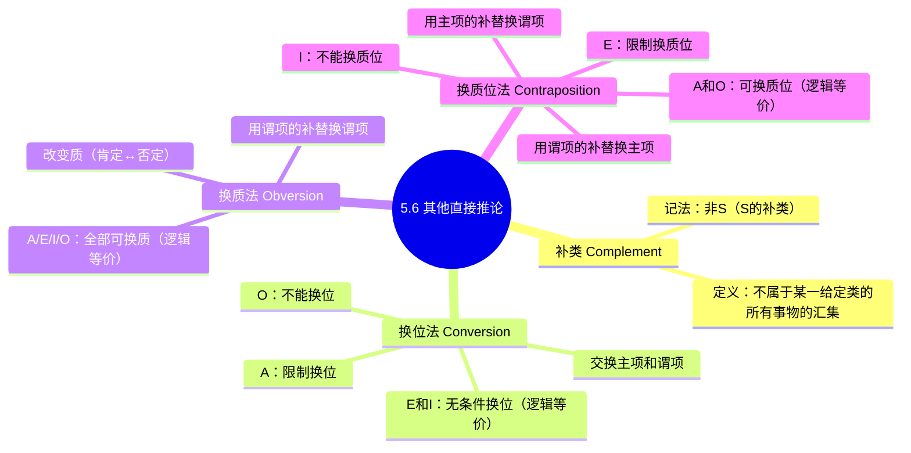

**相关笔记：** [[5.5 传统对当方阵]] | [[5.7 存在含义与直言命题的解释]]

> [!abstract] 概览
> 本节介绍三种重要的直接推论方法：**换位法**（Conversion）、**换质法**（Obversion）和**换质位法**（Contraposition）。这些方法使我们能够在不借助其他前提的情况下，从一种命题形式直接推出另一种逻辑等价或有效的命题形式。掌握这些推论方法是后续学习三段论推理的必要基础。

## 一、知识结构总览

## 二、核心思想与证明技巧

### 2.1 补类（Complement）

> [!def] 补类
> 一个给定类 $S$ 的**补类**（complement），记作 $\bar{S}$（非 S），是指==不属于 $S$ 的所有事物的汇集==。补类就是论域（universe of discourse）中除 $S$ 之外的一切对象。

> [!example] 具体实例
> - 如果论域是"人"，则"学生"的补类是"非学生"——即所有不是学生的人。
> - 如果论域是"自然数"，则"偶数"的补类是"奇数"。

> [!info] 补类与论域
> 补类的范围取决于所讨论的**论域**。论域不同，同一词项的补类也不同。在逻辑学中，论域通常由上下文确定，包含讨论所涉及的所有对象。

### 2.2 换位法（Conversion）

> [!def] 换位法
> **换位法**是将直言命题的**主项和谓项互换位置**，而不改变命题的质的推论方法。

换位法的一般形式：将"___ S 是/不是 P"变为"___ P 是/不是 S"。

#### 2.2.1 E 命题和 I 命题：无条件换位（逻辑等价）

**E 命题换位：**

$$\text{没有 } S \text{ 是 } P \quad \Longleftrightarrow \quad \text{没有 } P \text{ 是 } S$$

> [!example] E 命题换位实例
> "没有三角形是四边形" ⇔ "没有四边形是三角形"
>
> 两个命题说的是同一件事：三角形类与四边形类的交集为空。这一关系是对称的，因此换位后逻辑等价。

**I 命题换位：**

$$\text{有 } S \text{ 是 } P \quad \Longleftrightarrow \quad \text{有 } P \text{ 是 } S$$

> [!example] I 命题换位实例
> "有学生是运动员" ⇔ "有运动员是学生"
>
> 两个命题都只断定两个类有非空交集，这一关系同样是对称的。

> [!tip] 为什么 E 和 I 可以无条件换位？
> 回顾 [[5.4 质、量与周延性]] 中的周延性分析：
> - E 命题中 S 和 P **都周延**，交换后两个词项仍然都周延，没有信息丢失。
> - I 命题中 S 和 P **都不周延**，交换后两个词项仍然都不周延，同样没有信息丢失。

#### 2.2.2 A 命题：限制换位

**A 命题不能无条件换位。** "所有 S 是 P"不能简单地换位为"所有 P 是 S"。

$$\text{所有 } S \text{ 是 } P \quad \not\Longleftrightarrow \quad \text{所有 } P \text{ 是 } S$$

> [!example] A 命题不能无条件换位
> "所有猫是动物"为真，但"所有动物是猫"为假。

但 A 命题可以进行**限制换位**（conversion by limitation），即从全称命题推出特称命题：

$$\text{所有 } S \text{ 是 } P \quad \Longrightarrow \quad \text{有 } P \text{ 是 } S$$

> [!tip] 限制换位的逻辑依据
> "所有 S 是 P"为真 → 根据差等关系 → "有 S 是 P"为真 → I 命题可以无条件换位 → "有 P 是 S"为真。

> [!warning] 限制换位依赖存在含义
> 限制换位要求 S 类非空（存在含义）。如果 S 类为空，"所有 S 是 P"可能为真（空类与任何类的包含关系成立），但"有 P 是 S"为假（不存在 S 对象）。这一问题将在 [[5.7 存在含义与直言命题的解释]] 中讨论。

#### 2.2.3 O 命题：不能换位

**O 命题不能换位。** "有 S 不是 P"不能换位为"有 P 不是 S"。

$$\text{有 } S \text{ 不是 } P \quad \not\Longrightarrow \quad \text{有 } P \text{ 不是 } S$$

> [!example] O 命题不能换位
> "有动物不是猫"为真，但"有猫不是动物"为假（所有猫都是动物）。

> [!tip] O 命题不能换位的周延性解释
> 回顾周延性：O 命题中 S 不周延但 P 周延。如果换位，P 变为主项（在换位后的命题中不周延），S 变为谓项（在换位后的命题中也不周延）。这意味着换位后两个词项都不周延，而原命题中 P 是周延的——==周延性信息在换位过程中丢失了==，因此推论无效。

### 2.3 换质法（Obversion）

> [!def] 换质法
> **换质法**是改变命题的**质**（肯定变否定，否定变肯定），同时用谓项的**补类**替换原谓项的推论方法。==所有四种命题（A、E、I、O）都可以换质，且换质后与原命题逻辑等价==。

#### 换质法的具体规则

1. 改变命题的质：肯定 → 否定，否定 → 肯定
2. 将谓项替换为其补类：$P$ → $\bar{P}$（非 $P$）

#### 四种命题的换质

**A 命题换质：**

$$\text{所有 } S \text{ 是 } P \quad \Longleftrightarrow \quad \text{没有 } S \text{ 是非 } P$$

> [!example] A 命题换质实例
> "所有英雄都是勇敢的" ⇔ "没有英雄是不勇敢的"

**E 命题换质：**

$$\text{没有 } S \text{ 是 } P \quad \Longleftrightarrow \quad \text{所有 } S \text{ 是非 } P$$

> [!example] E 命题换质实例
> "没有三角形是四边形" ⇔ "所有三角形都是非四边形"

**I 命题换质：**

$$\text{有 } S \text{ 是 } P \quad \Longleftrightarrow \quad \text{有 } S \text{ 不是非 } P$$

> [!example] I 命题换质实例
> "有学生是运动员" ⇔ "有学生不是非运动员"

**O 命题换质：**

$$\text{有 } S \text{ 不是 } P \quad \Longleftrightarrow \quad \text{有 } S \text{ 是非 } P$$

> [!example] O 命题换质实例
> "有政治家不是诚实的" ⇔ "有政治家是不诚实的"

> [!tip] 换质法总是有效的
> 换质法之所以对四种命题都有效，是因为它本质上是同一断言的两种等价表述方式。说"所有 S 是 P"和说"没有 S 是非 P"表达的是完全相同的信息——只是从正面和反面两个角度描述同一个包含关系。

### 2.4 换质位法（Contraposition）

> [!def] 换质位法
> **换质位法**是将命题的**主项替换为谓项的补类**，同时将**谓项替换为主项的补类**的推论方法。换质位法可以理解为"先换质，再换位，再换质"的组合操作。

换位法的一般形式：将"___ S 是/不是 P"变为"___ 非 P 是/不是 非 S"。

#### 2.4.1 A 命题和 O 命题：可换质位（逻辑等价）

**A 命题换质位：**

$$\text{所有 } S \text{ 是 } P \quad \Longleftrightarrow \quad \text{所有非 } P \text{ 是非 } S$$

> [!example] A 命题换质位实例
> "所有猫是动物" ⇔ "所有非动物都不是猫"（即"所有非动物都是非猫"）
>
> 如果一个东西不是动物，那它一定不是猫。这与原命题"所有猫都是动物"表达的是同一信息。

**O 命题换质位：**

$$\text{有 } S \text{ 不是 } P \quad \Longleftrightarrow \quad \text{有非 } P \text{ 不是非 } S$$

> [!example] O 命题换质位实例
> "有学生不是运动员" ⇔ "有非运动员不是非学生"（即"有非运动员是学生"）
>
> 有些不是运动员的人是学生——这与"有些学生不是运动员"说的是同一回事。

> [!tip] 换质位法的推导过程
> 以 A 命题为例，换质位法可以分解为三步：
> 1. **换质**："所有 S 是 P" → "没有 S 是非 P"（E 命题）
> 2. **换位**："没有 S 是非 P" → "没有非 P 是 S"（E 命题换位，逻辑等价）
> 3. **换质**："没有非 P 是 S" → "所有非 P 是非 S"（A 命题）
>
> 最终得到："所有非 P 是非 S"——这就是 A 命题的换质位。

#### 2.4.2 E 命题：限制换质位

**E 命题不能无条件换质位。** "没有 S 是 P"不能简单地换质位为"没有非 P 是非 S"。

$$\text{没有 } S \text{ 是 } P \quad \not\Longleftrightarrow \quad \text{没有非 } P \text{ 是非 } S$$

> [!example] E 命题不能无条件换质位
> "没有猫是狗"为真，但"没有非狗是非猫"为假——非狗中包含非猫的对象（如鸟），所以"没有非狗是非猫"不成立。

但 E 命题可以进行**限制换质位**：

$$\text{没有 } S \text{ 是 } P \quad \Longrightarrow \quad \text{有非 } P \text{ 是非 } S$$

> [!tip] E 命题限制换质位的推导
> 1. "没有 S 是 P" → 换质 → "所有 S 是非 P"（A 命题）
> 2. "所有 S 是非 P" → 限制换位 → "有非 P 是 S"（I 命题）
> 3. "有非 P 是 S" → 换质 → "有非 P 不是非 S"（O 命题）

#### 2.4.3 I 命题：不能换质位

**I 命题不能换质位。** "有 S 是 P"不能换质位为"有非 P 是非 S"。

$$\text{有 } S \text{ 是 } P \quad \not\Longrightarrow \quad \text{有非 } P \text{ 是非 } S$$

> [!example] I 命题不能换质位
> "有猫是动物"为真，但"有非动物是非猫"为假——不存在非动物的对象（在论域为动物时）。

> [!tip] I 命题不能换质位的解释
> I 命题换质位的第一步是换质得到 O 命题"有 S 不是非 P"，然后尝试换位——但 O 命题不能换位，因此整个换质位操作在此中断。

### 2.5 三种推论方法总结

| 方法 | 操作 | A | E | I | O |
|:----:|:----:|:-:|:-:|:-:|:-:|
| **换位法** | 交换 S 和 P | 限制换位 | **等价** | **等价** | 不能 |
| **换质法** | 改变质，P→非P | **等价** | **等价** | **等价** | **等价** |
| **换质位法** | S→非P，P→非S | **等价** | 限制换质位 | 不能 | **等价** |

> [!tip] 记忆策略
> - **换质法**：四种命题全部有效（最"安全"的操作）
> - **换位法**：只有 E 和 I 有效（两者都是"对称"关系——交集为空或非空）
> - **换质位法**：只有 A 和 O 有效（恰好是矛盾关系的命题对，它们共享相同的换质位有效性）

## 三、补充理解与易混淆点

### 补充理解

> [!info] 补充1：Aristotle《前分析篇》中的换位理论
> **来源：** Aristotle, *Prior Analytics*, Book I, Chapters 2-3, c. 350 BCE.
>
> Aristotle在《前分析篇》第1卷第2-3章中系统阐述了换位（conversion）理论。Aristotle证明了E和I命题可以无条件换位（换位后逻辑等价），A命题只能"偶然换位"（conversion per accidens，即从"所有S是P"推出"有P是S"而非"所有P是S"），O命题不能换位。这些结论与布尔解释下的分析完全一致，显示了Aristotle逻辑的深刻洞察力。

> [!info] 补充2：De Morgan与补类概念的精确化
> **来源：** De Morgan, A. (1847). *Formal Logic*. Taylor and Walton.
>
> Augustus De Morgan在1847年的《形式逻辑》中首次将"补类"（complement）概念进行了精确的数学处理。De Morgan提出了著名的"De Morgan定律"：一个类的补的并等于各个类补的交，反之亦然。虽然De Morgan定律在命题逻辑中更为人熟知，但其集合论版本——$\overline{S \cap P} = \bar{S} \cup \bar{P}$——正是换质法（obversion）的理论基础。

> [!info] 历史背景
> 换位法和换质位法的理论可追溯到亚里士多德的《前分析篇》。亚里士多德详细讨论了各种换位形式及其有效性条件。布尔（George Boole）在 1854 年的 *An Investigation of the Laws of Thought* 中用代数方法重新表述了这些推论规则，为现代符号逻辑奠定了基础。

> [!warning] 换位法与换质位法的区别
> 初学者容易混淆换位法和换质位法：
> - **换位法**：只交换 S 和 P，不涉及补类。$\text{S is P} \rightarrow \text{P is S}$
> - **换质位法**：交换 S 和 P 的**补类**。$\text{S is P} \rightarrow \text{非P is 非S}$
>
> 换质位法不是简单的"交换"，而是"取补后交换"。名称中的"质"字指的是涉及补类（补类与质的改变密切相关）。

> [!warning] 限制换位的有效性争议
> 限制换位（A → I 的换位）依赖于主项类非空的存在含义预设。在现代逻辑（布尔解释）中，如果 S 类为空，"所有 S 是 P"为真但"有 P 是 S"为假，因此限制换位不成立。在传统逻辑（亚里士多德解释）中，默认主项类非空，因此限制换位有效。参见 [[5.7 存在含义与直言命题的解释]]。

> [!info] 实际应用中的组合推论
> 在实际推理中，换质法、换位法和换质位法常常组合使用。例如：
> - 从"所有 S 是 P"出发，可以先换质得到"没有 S 是非 P"，再换位得到"没有非 P 是 S"，再换质得到"所有非 P 是非 S"——这就是换质位法的完整推导过程。
> - 这种链式推理使我们能够从不同角度理解同一命题的含义。

### 易混淆点

> [!warning] 误区：换位 = 交换主谓项就完事
> ❌ **错误理解：** 换位法就是简单地把主项和谓项交换位置，对所有命题都一样。
> ✅ **正确理解：** 换位法对四种命题的适用性完全不同——E和I可以无条件换位（逻辑等价），A只能==限制换位==（A→I再换位），O==完全不能换位==。直接交换O命题的主谓项会导致周延性信息丢失，推论无效。
> **辨析：** 关键在于周延性。E命题中S和P都周延，交换后信息不丢失；I命题中S和P都不周延，交换后也不丢失。但O命题中S不周延而P周延，交换后P变成不周延的主项，周延性信息丢失，因此推论无效。

> [!warning] 误区：换质位 = 先换质再换位
> ❌ **错误理解：** 换质位法就是"先换质，再换位"两步操作。
> ✅ **正确理解：** 换质位法的完整操作是==换质→换位→换质==三步。以A命题为例：①换质得E命题 → ②换位得E命题 → ③换质得A命题。如果只做两步（换质→换位），得到的是E命题"没有非P是S"，而不是最终的A命题"所有非P是非S"。
> **辨析：** 名称"换质位"容易让人误解为两步操作，但实际上需要三步才能完成。第三步换质是必要的，它将换位后的否定命题转回肯定形式，从而得到完整的换质位结果。

## 四、习题精选

> [!todo] 习题概览
> | 题号 | 来源 | 核心考点 | 难度 |
> |:-----|:-----|:---------|:-----|
> | 1 | 自编 | 对四种命题执行三种操作 | ⭐⭐ |
> | 2 | 自编 | 判断推论有效性 | ⭐⭐⭐ |
> | 3 | 自编 | 证明换质位等价性 | ⭐⭐⭐ |

---

### 题1：对四种命题执行三种操作

> [!problem] 题目
> 对以下命题依次进行换质、换位、换质位操作，并判断每一步是否有效：
>
> (a) "所有诚实的人都是值得信赖的"（A）
> (b) "没有懒惰的人是成功的"（E）
> (c) "有诗人是画家"（I）
> (d) "有学生不是运动员"（O）

> [!faq]- 解答
> **(a) A 命题"所有诚实的人都是值得信赖的"**
>
> - **换质**："没有诚实的人是不值得信赖的"（E）——**有效**（逻辑等价）
> - **换位**："没有不值得信赖的人是诚实的人"（E）——**有效**（E 命题换位，逻辑等价）
> - **换质位**："所有不值得信赖的人都是不诚实的"（A）——**有效**（A 命题换质位，逻辑等价）
>
> **(b) E 命题"没有懒惰的人是成功的"**
>
> - **换质**："所有懒惰的人都是不成功的"（A）——**有效**（逻辑等价）
> - **换位**："没有成功的人是懒惰的"（E）——**有效**（E 命题换位，逻辑等价）
> - **换质位**："有成功的人是不懒惰的"（O）——**限制换质位有效**（注意：不是等价推论，而是有效推论）
>
> **(c) I 命题"有诗人是画家"**
>
> - **换质**："有诗人不是非画家"（O）——**有效**（逻辑等价）
> - **换位**："有画家是诗人"（I）——**有效**（I 命题换位，逻辑等价）
> - **换质位**：**不能换质位**（I 命题不能换质位）
>
> **(d) O 命题"有学生不是运动员"**
>
> - **换质**："有学生是非运动员"（I）——**有效**（逻辑等价）
> - **换位**：**不能换位**（O 命题不能换位）
> - **换质位**："有非运动员不是非学生"（O）——**有效**（O 命题换质位，逻辑等价）
>
> $\blacksquare$

> [!tip] 解题思路提示
> 先判断命题类型（A/E/I/O），再查适用规则：换质法对所有命题有效，换位法只有E和I有效（A限制换位，O不能），换质位法只有A和O有效（E限制换质位，I不能）。每步操作后验证等价性。

---

### 题2：判断推论有效性

> [!problem] 题目
> 判断以下推论是否有效，并说明理由：
>
> (a) 从"所有英雄都是勇敢的"推出"所有不勇敢的人都不是英雄"。
> (b) 从"有鸟不会飞"推出"有会飞的不是鸟"。
> (c) 从"没有 reptile 是哺乳动物"推出"没有哺乳动物是 reptile"。

> [!faq]- 解答
> **(a) 有效。** 这是 A 命题的换质位：
> - 原命题："所有英雄（S）都是勇敢的（P）"——A 命题
> - 换质位后："所有非 P 是非 S"，即"所有不勇敢的人都不是英雄"——A 命题
> - A 命题换质位逻辑等价，因此推论有效。
>
> **(b) 有效。** 这是 O 命题的换质位：
> - 原命题："有鸟（S）不会飞（P）"——O 命题
> - 换质位后："有非 P 不是非 S"，即"有不会飞的不是非鸟"，等价于"有不会飞的是鸟"——O 命题
> - 但题目说的是"有会飞的不是鸟"，这实际上是原命题换质位的另一种表述。让我们重新分析：
>   - "有鸟不会飞"换质得"有鸟是非会飞的"（I）
>   - 这不能直接换位为"有会飞的不是鸟"
>   - 正确路径：O 命题换质位 → "有非 P 不是非 S" → "有不会飞的不是非鸟" → "有不会飞的是鸟"
>   - 这与"有会飞的不是鸟"是**不同的命题**。
> - 因此，该推论**无效**。从"有鸟不会飞"不能推出"有会飞的不是鸟"。
>
> **(c) 有效。** 这是 E 命题的换位：
> - 原命题："没有 reptile（S）是哺乳动物（P）"——E 命题
> - 换位后："没有哺乳动物（P）是 reptile（S）"——E 命题
> - E 命题换位逻辑等价，因此推论有效。
>
> $\blacksquare$

> [!tip] 解题思路提示
> 先判断原命题类型，再判断推论使用了哪种操作（换位/换质/换质位），最后查规则验证该操作对该命题类型是否有效。特别注意(b)中"换质位"与"换位"是不同操作，不能混淆。

---

### 题3：证明换质位等价性

> [!problem] 题目
> 请证明：对 A 命题进行换质位操作等价于"先换质，再换位，再换质"的三步操作。以"所有 S 是 P"为例，逐步展示推导过程。

> [!faq]- 解答
> **目标**：证明 A 命题"所有 S 是 P"的换质位"所有非 P 是非 S"可以通过"换质→换位→换质"得到。
>
> **第一步：换质**
>
> 原命题：所有 S 是 P（A 命题，肯定）
>
> 换质规则：改变质（肯定→否定），用谓项的补替换谓项（P → 非 P）
>
> 结果：没有 S 是非 P（E 命题）
>
> **第二步：换位**
>
> 当前命题：没有 S 是非 P（E 命题）
>
> 换位规则：交换主项和谓项（E 命题可以无条件换位）
>
> 结果：没有非 P 是 S（E 命题）
>
> **第三步：换质**
>
> 当前命题：没有非 P 是 S（E 命题，否定）
>
> 换质规则：改变质（否定→肯定），用谓项的补替换谓项（S → 非 S）
>
> 结果：所有非 P 是非 S（A 命题）
>
> **结论**：经过三步操作，最终得到"所有非 P 是非 S"，这正是 A 命题"所有 S 是 P"的换质位结果。由于每一步都是逻辑等价变换（换质等价、E 换位等价），因此换质位也是逻辑等价的。
>
> $\blacksquare$

> [!tip] 解题思路提示
> 将换质位分解为三个基本操作：①换质（改变质，P→非P）→ ②换位（交换S和非P）→ ③换质（改变质，S→非S）。每一步都是等价变换，因此整体也是等价的。

## 五、视频学习指南

> [!quote] 推荐资源
> | 资源 | 作者/平台 | 内容 | 推荐度 |
> |:-----|:----------|:-----|:-------|
> | Categorical Logic: Conversion, Obversion & Contraposition | Brandon Foltz | 以大量实例演示三种直接推论方法 | ⭐⭐⭐ |
> | Introduction to Logic - Immediate Inference | Michael Genesereth (Stanford) | 在线课程中关于 immediate inference 的讲解 | ⭐⭐ |

## 六、教材原文

> [!quote] Copi, Cohen & McMahon, *Introduction to Logic* (15th ed.), Ch. 5.6
> "Three other kinds of immediate inference are important in the analysis of syllogistic reasoning: **conversion**, **obversion**, and **contraposition**... The **obverse** of any proposition is logically equivalent to the original proposition."

## 参见 Wiki

- [[论证]]：直接推论方法是构建更复杂论证的基础构件
- [[定义的类型]]：补类的概念与定义中的否定定义密切相关
- [[直接推论]]：直接推论的完整概念页

#学习/逻辑学/直言命题
