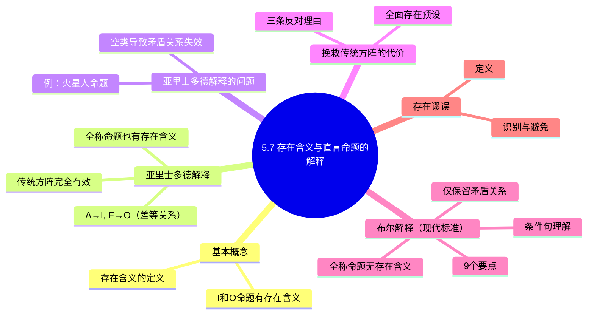

**相关笔记：** [[5.6 其他直接推论]] | [[5.8 直言命题的符号系统与图解]]

> [!abstract] 概览
> 本节是第5章最核心的一节，探讨==存在含义==（existential import）问题——即直言命题是否在断言某类对象的存在。围绕这一问题，==亚里士多德解释==与==布尔解释==展开了根本性分歧。布尔解释通过否定全称命题的存在含义，解决了传统逻辑方阵中空类（empty class）带来的矛盾，但也使传统方阵中的反对关系、下反对关系和差等关系不再普遍有效。本节最终确立了布尔解释为现代逻辑的标准立场，并引入了==存在谬误==（existential fallacy）这一重要概念。

## 一、知识结构总览

## 二、核心思想与证明技巧

### 2.1 存在含义的定义

> [!def] 存在含义（Existential Import）
> 如果一般地断言一个命题就==肯定了某种对象的存在==，则称该命题具有存在含义。

关键区分：

- **I命题**"有S是P"：断言==至少存在一个==既是S又是P的对象，因此**有存在含义**。
- **O命题**"有S不是P"：断言==至少存在一个==是S但不是P的对象，因此**有存在含义**。
- **A命题**"所有S是P"和**E命题**"没有S是P"：是否具有存在含义？这正是本节的核心争议。

### 2.2 亚里士多德解释

> [!tip] 亚里士多德解释的核心立场
> 亚里士多德解释认为，全称命题**也具有存在含义**。因此，全称命题的真隐含相应特称命题的真：
> - $A \rightarrow I$（如果"所有S是P"为真，则"有S是P"也为真）
> - $E \rightarrow O$（如果"没有S是P"为真，则"有S不是P"也为真）

在亚里士多德解释下，传统逻辑方阵中的==所有关系==（矛盾、反对、下反对、差等）都成立，因为==所有词项指称的类都被预设为非空==。

### 2.3 亚里士多德解释的根本问题

> [!warning] 空类导致的矛盾关系崩溃
> 如果A和O都有存在含义，那么当S类为空时，A和O可以==同时为假==，矛盾关系就不成立了。

**经典反例：**

- A命题："所有火星人都是金发碧眼的"——如果火星人不存在，这个命题为假（因为它断言了火星人的存在）。
- O命题："有火星人不是金发碧眼的"——如果火星人不存在，这个命题也为假（因为它也断言了火星人的存在）。

但A和O本应是==矛盾关系==（不能同真、不能同假）。在火星人不存在的条件下，它们却同时为假。==这直接击穿了传统方阵的根基。==

### 2.4 挽救传统方阵的代价：全面存在预设

一种挽救方案是引入==全面存在预设==（comprehensive existential presupposition）：预设所有词项指称的类都不为空。

> [!warning] 反对全面存在预设的三条理由
> 1. **不能刻画否定有元素存在的命题**：如果我们想断言"独角兽不存在"，在全面存在预设下，"独角兽"这个类被预设为非空，我们就无法用传统逻辑表达这一否定。
> 2. **日常语言中"所有"有时指可能为空的类**：例如"所有侵入者都要被起诉"，这句话并不预设确实存在侵入者——它只是说"如果有人侵入，那么他将被起诉"。
> 3. **科学定律通常不预设存在**：例如牛顿第一运动定律"不受外力的物体保持静止或匀速直线运动"，这是一个全称命题，但它并不预设存在不受外力的物体——它是一个条件性的普遍陈述。

### 2.5 布尔解释（Boolean Interpretation）——现代标准

> [!tip] 布尔解释的核心立场
> 布尔解释认为，==全称命题没有存在含义==。"所有S是P"被理解为：
> $$\text{如果有S这样的东西，那么它是P}$$
> 这是一个==条件句==（如果……那么……），当S类为空时，条件句前件为假，整个命题==为真==（实质蕴涵的真值表）。

#### 布尔解释的9个要点

> [!example] 布尔解释九要点
>
> **要点1**：I和O命题==仍有存在含义==。"有S是P"仍然断言至少存在一个S。
>
> **要点2**：$A \leftrightarrow O$、$E \leftrightarrow I$ 的==矛盾关系保持==。无论S类是否为空，矛盾关系始终成立。
>
> **要点3**：全称命题==无存在含义==，即使S为空，A和E也可为真。例如"所有火星人都是金发碧眼的"在火星人不存在时为真。
>
> **要点4**：在日常语言中，若要断言存在，需用==两个命题==——一个全称命题（断言普遍性）加一个特称命题（断言存在性）。例如"所有独角兽都是白色的"（全称）+ "有独角兽存在"（特称）。
>
> **要点5**：A和E可以==同真==（不再是反对关系）。当S为空时，A和E同时为真。
>
> **要点6**：I和O可以==同假==（不再是下反对关系）。当S为空时，I和O同时为假。
>
> **要点7**：==差等关系不普遍有效==。$A \rightarrow I$ 和 $E \rightarrow O$ 在S为空时失效（A真但I假，E真但O假）。
>
> **要点8**：==保留大部分直接推论==：
> - 有效：E和I的换位、A和O的换质位、所有换质
> - 无效：限制换位（$A \nrightarrow I$ 换位）、限制换质位（$O \nrightarrow I$ 换质位）
>
> **要点9**：传统方阵==仅保留对角线上的矛盾关系==，其余关系全部不成立。

### 2.6 存在谬误

> [!def] 存在谬误（Existential Fallacy）
> ==不恰当地假定某类元素存在==，从而在推理中隐含地引入了存在预设，导致无效推理。

存在谬误通常发生在从全称命题推出特称命题时，因为全称命题（在布尔解释下）没有存在含义，而特称命题有存在含义。例如：

- 前提："所有独角兽都是白色的"（A命题，无存在含义）
- 结论："有独角兽是白色的"（I命题，有存在含义）

这个推理犯了存在谬误——它从没有存在含义的前提推出了有存在含义的结论，==隐含地假定了独角兽的存在==。

## 三、补充理解与易混淆点

### 补充理解

> [!info] 补充1：布尔解释的哲学意义——从本体论到语用学
> **来源：** Quine, W.V.O. (1948). "On What There Is", *The Review of Metaphysics*, 2(5), 21-38.
>
> Willard Van Orman Quine在经典论文"论何物存在"中指出，布尔解释的核心贡献在于将"存在"问题从逻辑推理中分离出来。在布尔解释下，"所有S是P"是一个条件句（"如果有什么东西是S，那么它是P"），它不承诺S的存在——这使得逻辑学不再需要预设任何本体论承诺。Quine认为，这是现代逻辑优于传统逻辑的关键所在：逻辑应该对"什么存在"保持中立。

> [!info] 两种解释的直观对比
> 可以用一个日常类比来理解两种解释的差异：
>
> - **亚里士多德解释**就像说"所有来参加聚会的人都会得到礼物"——这句话隐含地预设了确实有人来参加聚会。
> - **布尔解释**就像说"所有闯入者都将被逮捕"——这句话只是一个规则，并不预设真的有闯入者。
>
> 现代逻辑采用布尔解释，因为它更精确、更灵活，能够处理空类的情况。

> [!warning] 常见易混淆点
> 1. **不要混淆"存在含义"与"真假"**：存在含义是指命题是否断言了某类对象的存在，而不是指命题本身的真假。一个有存在含义的命题可以为假（如"有火星人"），一个没有存在含义的命题可以为真（如"所有火星人都是金发碧眼的"，在火星人不存在时为真）。
>
> 2. **不要以为布尔解释"推翻了"亚里士多德逻辑**：布尔解释只是在存在含义问题上采取了不同的立场。在所有词项都指称非空类的限定条件下，亚里士多德逻辑的推论规则仍然有效。布尔解释是一个更普遍、更一般的框架。
>
> 3. **矛盾关系是唯一幸存者**：在布尔解释下，传统方阵中只有矛盾关系（A↔O, E↔I）被完整保留。反对关系、下反对关系和差等关系都只在"主项非空"的附加条件下才成立。

> [!quote] 历史注记
> 乔治·布尔（George Boole, 1815–1864）在1854年的《思维的规律研究》（*An Investigation of the Laws of Thought*）中系统阐述了这一解释方案，奠定了现代符号逻辑的基础。布尔解释的引入是逻辑学从亚里士多德传统向现代数理逻辑转变的关键一步。

### 易混淆点

> [!warning] 误区：布尔解释 = 否定亚里士多德
> ❌ **错误理解：** 布尔解释是对亚里士多德逻辑的否定和推翻，两者水火不容。
> ✅ **正确理解：** 布尔解释是==更普遍、更一般的框架==。在所有词项都指称非空类的限定条件下，亚里士多德逻辑的推论规则（反对关系、下反对关系、差等关系）仍然有效。布尔解释只是取消了"类非空"的默认预设，使其能够处理空类的情况。
> **辨析：** 布尔解释并没有"推翻"亚里士多德逻辑，而是将其作为特例包含在内。亚里士多德逻辑 = 布尔解释 + 存在预设。当存在预设成立时，两者完全一致。

> [!warning] 误区：存在谬误只在三段论中出现
> ❌ **错误理解：** 存在谬误只发生在三段论推理中，直接推论不会犯存在谬误。
> ✅ **正确理解：** ==任何从全称命题推出特称命题的推理都可能犯存在谬误==，包括直接推论。例如，从"所有独角兽都是白色的"（A，无存在含义）推出"有独角兽是白色的"（I，有存在含义）就是一个直接推论中的存在谬误——限制换位（A→I）在布尔解释下无效，正是因为存在谬误。
> **辨析：** 存在谬误的本质是"从无存在含义的前提推出有存在含义的结论"，这一错误可以出现在任何推理形式中，不限于三段论。限制换位和限制换质位的失效都是存在谬误的直接体现。

## 四、习题精选

> [!todo] 习题概览
> | 题号 | 来源 | 核心考点 | 难度 |
> |:-----|:-----|:---------|:-----|
> | 1 | 自编 | 识别存在谬误 | ⭐⭐⭐ |
> | 2 | 自编 | 布尔解释下空类真假判断 | ⭐⭐ |
> | 3 | 自编 | 传统推论有效性判断 | ⭐⭐⭐ |

---

### 题1：识别存在谬误

> [!problem] 题目
> 以下推理是否有效？如果无效，请指出它犯了什么谬误。
>
> 前提1：所有完美的社会都是公正的。
> 前提2：没有完美的社会是压迫性的。
> 结论：有公正的社会不是压迫性的。

> [!faq]- 解答
> **无效**，犯了==存在谬误==。
>
> 分析：前提1是A命题"所有完美的社会都是公正的"，前提2是E命题"没有完美的社会是压迫性的"。在布尔解释下，这两个全称命题都没有存在含义——它们不预设完美的社会存在。
>
> 结论"有公正的社会不是压迫性的"是O命题，具有存在含义，它断言至少存在一个公正的社会。
>
> 从两个没有存在含义的全称前提，不能推出有存在含义的特称结论。这个推理隐含地假定了"完美的社会"这个类不为空，而这一假定没有得到前提的支持。
>
> 注意：如果我们额外加上前提"有完美的社会存在"，那么推理就变为有效（三段论格式：Fresison式）。但仅凭给定的两个前提，推理是无效的。
>
> $\blacksquare$

> [!tip] 解题思路提示
> 先检查每个命题是否有存在含义：全称命题（A、E）在布尔解释下无存在含义，特称命题（I、O）有存在含义。如果前提都没有存在含义而结论有，则存在谬误。关键：前提是否隐含地假定了某类对象存在？

---

### 题2：布尔解释下空类真假判断

> [!problem] 题目
> 假设"美人鱼"这个类为空（即美人鱼不存在），在布尔解释下判断以下各命题的真假：
>
> (a) 所有美人鱼都是海洋生物。
> (b) 没有美人鱼是海洋生物。
> (c) 有美人鱼是海洋生物。
> (d) 有美人鱼不是海洋生物。

> [!faq]- 解答
> 在布尔解释下，由于"美人鱼"类为空：
>
> (a) **A命题"所有美人鱼都是海洋生物"——真**。全称命题在主项为空时为真。理解为"如果有美人鱼，那么它是海洋生物"，前件为假，整个条件句为真。
>
> (b) **E命题"没有美人鱼是海洋生物"——真**。同理，理解为"如果有美人鱼，那么它不是海洋生物"，前件为假，整个条件句为真。
>
> (c) **I命题"有美人鱼是海洋生物"——假**。特称命题有存在含义，断言美人鱼存在，但美人鱼不存在，故为假。
>
> (d) **O命题"有美人鱼不是海洋生物"——假**。同理，特称命题断言美人鱼存在，但美人鱼不存在，故为假。
>
> **关键观察**：
> - A和E同时为真 → 反对关系不成立
> - I和O同时为假 → 下反对关系不成立
> - A真而I假 → 差等关系不成立
> - A与O一真一假 → 矛盾关系成立 ✓
> - E与I一真一假 → 矛盾关系成立 ✓
>
> $\blacksquare$

> [!tip] 解题思路提示
> 在布尔解释下，全称命题（A、E）在主项为空时为真（条件句前件为假），特称命题（I、O）在主项为空时为假（断言存在但不存在）。检查哪些传统对当关系在空类下失效。

---

### 题3：传统推论有效性判断

> [!problem] 题目
> 在布尔解释下（不预设词项非空），判断以下推论是否有效：
>
> (a) 从"所有科学家都是理性的人"推出"有理性的人是科学家"。（限制换位）
>
> (b) 从"没有诗人是不敏感的"推出"有敏感的人是诗人"。（限制换位）
>
> (c) 从"所有英雄都是勇敢的"推出"所有不勇敢的人都不是英雄"。（换质位）

> [!faq]- 解答
> (a) **无效**（限制换位）。
> 前提是A命题"所有科学家都是理性的人"，结论是I命题"有理性的人是科学家"。A命题无存在含义，I命题有存在含义。如果科学家不存在，前提为真但结论为假。因此限制换位在布尔解释下不普遍有效。
>
> (b) **无效**（限制换位）。
> 前提是E命题"没有诗人是不敏感的"，结论是I命题"有敏感的人是诗人"。虽然E和I的换位本身是有效的（E换位得"没有不敏感的人是诗人"，I换位得"有敏感的人是诗人"），但这里是从E直接进行限制换位得到I。等等——让我们重新分析：E命题"没有S是P"换位得"没有P是S"，这是有效的。但限制换位是从E推出I"有P是S"，这需要P类非空。如果"敏感的人"类为空，E为真但I为假。因此==限制换位无效==。
>
> (c) **有效**（换质位）。
> 前提是A命题"所有S是P"，换质得"所有S不是非P"（E），换位得"所有非P不是S"（E），换质得"所有非P是非S"（A）。整个过程只涉及全称命题之间的转换，不涉及存在含义的引入，因此在布尔解释下仍然有效。
>
> $\blacksquare$

> [!tip] 解题思路提示
> 先检查前提是否有存在含义，再检查结论是否有存在含义。如果前提无存在含义而结论有，则推论无效（存在谬误）。限制换位（A→I, E→I）都涉及从全称到特称，在布尔解释下无效。换质位（A↔A, O↔O）只在全称或只在特称之间转换，有效。

## 五、视频学习指南

> [!info] 推荐学习资源
> | 资源 | 内容 | 推荐度 |
> |:-----|:-----|:-------|
> | 存在含义的核心争议 | 理解亚里士多德解释与布尔解释的根本分歧，重点关注空类（如"火星人"、"独角兽"）如何导致传统方阵崩溃 | ⭐⭐⭐ |
> | 布尔解释九要点 | 逐条理解，特别注意要点5-7（反对关系、下反对关系、差等关系的失效）和要点8（哪些直接推论仍然有效） | ⭐⭐⭐ |
> | 存在谬误的识别 | 学会在推理中识别隐含的存在预设，这是后续学习三段论有效性检验的基础 | ⭐⭐ |

## 六、教材原文

> [!quote] 核心原文摘录
> 本节内容对应《逻辑学导论（第15版）》第5章第7节。核心论点包括：
>
> - "如果一般地断言一个命题就肯定了某种对象的存在，我们就说该命题具有存在含义。"
> - "在布尔解释下，全称命题（A和E）没有存在含义。'所有S是P'被理解为'如果有S这样的东西，那么它是P'。"
> - "传统逻辑方阵中，只有矛盾关系在布尔解释下仍然普遍有效。"
> - "存在谬误是指不恰当地假定某类元素存在。"

## 参见 Wiki

- [[论证]]：存在谬误是论证评估中的重要概念，涉及前提对结论的支持关系。
- [[谬误]]：存在谬误是非形式谬误的一种，属于预设性谬误。
- [[有效性]]：布尔解释重新界定了哪些直言推论是有效的，直接影响三段论有效性的判定标准。
- [[布尔解释]]：布尔解释的完整概念页
- [[存在谬误]]：存在谬误的完整概念页

#学习/逻辑学/直言命题
