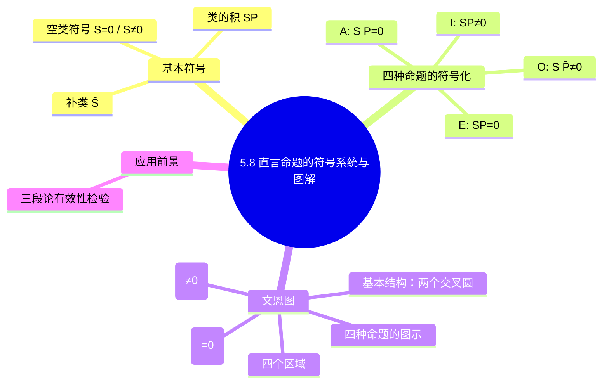

**相关笔记：** [[5.7 存在含义与直言命题的解释]]

> [!abstract] 概览
> 本节介绍布尔解释下直言命题的==符号化方法==与==文恩图==（Venn diagram）表示法。通过引入==空类符号==、==类的积==（product/intersection）和==补类==（complement）等基本概念，我们将四种标准直言命题（A、E、I、O）转化为精确的类运算等式。文恩图则以直观的图形方式表示这些等式，为第6章检验直言三段论的有效性提供了最有力、最可靠的方法。

## 一、知识结构总览



## 二、核心思想与证明技巧

### 2.1 基本符号约定

> [!def] 空类符号
> - $S = 0$：表示S类==没有元素==（S为空类）。
> - $S \neq 0$：表示S类==有元素==（S不为空，即至少存在一个S）。

> [!def] 类的积（Product / Intersection）
> ==同时属于两个类的元素==组成的类，记为 $SP$。
>
> 例如，如果S是"学生"类，P是"哲学家"类，则 $SP$ 就是"既是学生又是哲学家"的类。

> [!def] 补类（Complement）
> ==不属于原类的所有事物==组成的类，记为 $\bar{S}$（S杠，读作"S补"或"S bar"）。
>
> 例如，如果S是"诗人"类，则 $\bar{S}$ 就是"所有不是诗人的事物"的类。

> [!tip] 符号约定的直觉理解
> 这些符号直接对应集合论中的基本运算：
> - $SP$ 对应集合的交集 $S \cap P$
> - $\bar{S}$ 对应集合的补集 $S^c$ 或 $\sim S$
> - $= 0$ 对应集合为空集 $\varnothing$
> - $\neq 0$ 对应集合非空

### 2.2 四种直言命题的符号化

> [!tip] 核心对应关系
> 在布尔解释下，四种标准直言命题可以精确地用类运算等式表示：

| 命题类型 | 标准形式 | 符号化 | 读法 |
|:---:|:---:|:---:|:---:|
| **A** | 所有S是P | $S\bar{P} = 0$ | S与非P的积为空 |
| **E** | 没有S是P | $SP = 0$ | S与P的积为空 |
| **I** | 有S是P | $SP \neq 0$ | S与P的积不空 |
| **O** | 有S不是P | $S\bar{P} \neq 0$ | S与非P的积不空 |

#### 逐条解释

**A命题："所有S是P"** → $S\bar{P} = 0$

> [!example] A命题符号化的推导
> "所有S是P"意味着：==不存在既是S又不是P的东西==。
> - 既是S又不是P的东西，就是同时属于S类和P的补类（$\bar{P}$）的东西，即 $S\bar{P}$。
> - "不存在"即 $= 0$。
> - 因此 $S\bar{P} = 0$。
>
> **直觉**：A命题说的是"S里面没有不是P的"，也就是S与非P的交集为空。

**E命题："没有S是P"** → $SP = 0$

> [!example] E命题符号化的推导
> "没有S是P"意味着：==不存在既是S又是P的东西==。
> - 既是S又是P的东西，就是 $SP$。
> - "不存在"即 $= 0$。
> - 因此 $SP = 0$。
>
> **直觉**：E命题直接说S和P的交集为空。

**I命题："有S是P"** → $SP \neq 0$

> [!example] I命题符号化的推导
> "有S是P"意味着：==存在至少一个既是S又是P的东西==。
> - 既是S又是P的东西，就是 $SP$。
> - "存在"即 $\neq 0$。
> - 因此 $SP \neq 0$。
>
> **直觉**：I命题断言S和P的交集不空。

**O命题："有S不是P"** → $S\bar{P} \neq 0$

> [!example] O命题符号化的推导
> "有S不是P"意味着：==存在至少一个既是S又不是P的东西==。
> - 既是S又不是P的东西，就是 $S\bar{P}$。
> - "存在"即 $\neq 0$。
> - 因此 $S\bar{P} \neq 0$。
>
> **直觉**：O命题断言S与非P的交集不空。

> [!info] 符号化的对称美
> 注意这四个等式之间的优美对称关系：
> - A与O互为矛盾：$S\bar{P} = 0$ vs $S\bar{P} \neq 0$（仅 $=$ 与 $\neq$ 之差）
> - E与I互为矛盾：$SP = 0$ vs $SP \neq 0$（仅 $=$ 与 $\neq$ 之差）
> - A和O涉及 $S\bar{P}$（S与非P的积），E和I涉及 $SP$（S与P的积）
>
> 这种对称性直接反映了布尔解释下矛盾关系的稳固性。

### 2.3 文恩图（Venn Diagram）

> [!def] 文恩图
> ==用交叉的圆来表示类之间关系==的图形工具。一个圆代表一个类，==阴影==表示该区域为空（$=0$），==$\times$（x）==表示该区域不空（$\neq 0$）。

#### 基本结构：两个交叉圆

两个交叉的圆（代表S类和P类）将整个论域划分为==四个区域==：

```
              S̄P̄
        ┌───────────────┐
        │   ┌─────┐     │
  SP̄   │   │     │     │  S̄P
（左月牙）│───│  SP │─────│（右月牙）
        │   │     │     │
        │   └─────┘     │
        └───────────────┘
              （中间透镜）
```

> [!info] 四个区域的含义
> - **左月牙（$SP̄$）**：是S但不是P的事物
> - **右月牙（$\bar{S}P$）**：不是S但是P的事物
> - **中间透镜（$SP$）**：既是S又是P的事物
> - **外部区域（$\bar{S}\bar{P}$）**：既不是S也不是P的事物

#### 四种命题的文恩图表示

**A命题："所有S是P"** → $S\bar{P} = 0$ → 在 $SP̄$ 区域画阴影

```
        ┌───────────────┐
        │   ┌─────┐     │
  ///// │   │     │     │
  ///// │───│  SP │─────│
        │   │     │     │
        │   └─────┘     │
        └───────────────┘
```
> 左月牙（$SP̄$）画阴影，表示"是S但不是P的区域为空"——即所有S都是P。

**E命题："没有S是P"** → $SP = 0$ → 在 $SP$ 区域画阴影

```
        ┌───────────────┐
        │   ┌─────┐     │
        │   │/////│     │
        │───│/////│─────│
        │   │/////│     │
        │   └─────┘     │
        └───────────────┘
```
> 中间透镜（$SP$）画阴影，表示"既是S又是P的区域为空"——即S和P没有共同元素。

**I命题："有S是P"** → $SP \neq 0$ → 在 $SP$ 区域标x

```
        ┌───────────────┐
        │   ┌─────┐     │
        │   │  ×  │     │
        │───│     │─────│
        │   │     │     │
        │   └─────┘     │
        └───────────────┘
```
> 中间透镜（$SP$）标x，表示"至少存在一个既是S又是P的东西"。

**O命题："有S不是P"** → $S\bar{P} \neq 0$ → 在 $SP̄$ 区域标x

```
        ┌───────────────┐
        │   ┌─────┐     │
    ×   │   │     │     │
        │───│  SP │─────│
        │   │     │     │
        │   └─────┘     │
        └───────────────┘
```
> 左月牙（$SP̄$）标x，表示"至少存在一个是S但不是P的东西"。

> [!tip] 文恩图与布尔解释的完美对应
> 文恩图是布尔解释的图形化体现：
> - 全称命题（A、E）只画阴影，不标x → ==没有断言任何东西存在==（无存在含义）
> - 特称命题（I、O）只标x，不画阴影 → ==断言了某区域不空==（有存在含义）
>
> 正是因为全称命题在文恩图中只标阴影（排除），不标x（断言存在），所以它们没有存在含义。这与[[5.7 存在含义与直言命题的解释]]中讨论的布尔解释完全一致。

### 2.4 文恩图的应用前景

> [!tip] 为三段论检验做准备
> 文恩图是==检验直言三段论有效性的最有力方法==。在第6章中，我们将使用三个交叉圆的文恩图来检验三段论的有效性：
> - 将两个前提分别画在图上
> - 检查结论是否已经被图所蕴含
> - 如果结论所要求的信息已经在图中表示出来，则三段论有效；否则无效
>
> 文恩图方法的优势在于它==完全基于布尔解释==，自动处理了空类的问题，避免了存在谬误。

## 三、补充理解与易混淆点

### 补充理解

> [!info] 补充1：Venn图 vs Euler图的设计哲学差异
> **来源：** Euler, L. (1768). *Letters to a German Princess*; Venn, J. (1881). *Symbolic Logic*.
>
> Leonhard Euler在1768年的《致德国公主的信》中首次用圆来表示类之间的关系，这就是"欧拉图"（Euler circles）。但Euler图的局限在于：它无法表示"空类"——每个圆都预设了该类有元素。John Venn在1881年克服了这一局限：他的文恩图用"阴影"表示空区域，用"x"表示非空区域，从而能够精确表示布尔解释下的所有直言命题。Venn图的核心创新在于：==它默认所有区域都可能为空==，这与布尔解释的"无存在含义"立场完全一致。

> [!info] 补充2：符号逻辑的公理化传统
> **来源：** Peano, G. (1889). *Arithmetices Principia*; Whitehead, A.N. & Russell, B. (1910). *Principia Mathematica*.
>
> 直言命题的符号化（如 $S\bar{P}=0$）是更宏大的符号逻辑公理化运动的一部分。Giuseppe Peano在1889年用符号语言重新表述了算术基础，Alfred North Whitehead和Bertrand Russell在1910年的《数学原理》中试图将全部数学建立在逻辑基础之上。直言命题的符号表示（$S\bar{P}=0$, $SP=0$, $SP\neq0$, $S\bar{P}\neq0$）在这一传统中扮演了"入门级"的角色——它是最简单的命题逻辑形式化，也是理解更复杂的符号系统的起点。

> [!info] 文恩图 vs 欧拉图
> 初学者常混淆文恩图（Venn diagram）与欧拉图（Euler diagram）：
> - **欧拉图**：用圆的包含、排斥、交叉关系来表示具体的类关系（如S包含于P、S与P不相交等）。每个图只表示一种特定的关系。
> - **文恩图**：用阴影和x标记来表示命题，每个区域可以独立地被标记为空或不空。同一个图可以表示多种命题。
>
> 文恩图更适合逻辑推理，因为它可以组合多个命题的信息（如在三段论中同时表示两个前提）。

> [!warning] 常见易混淆点
> 1. **不要混淆阴影区域与x区域**：阴影（$=0$）表示"该区域为空"，x（$\neq 0$）表示"该区域不空（有东西）"。它们是==互斥的==——同一个区域不能既画阴影又标x。
>
> 2. **注意A命题画阴影的位置**：A命题"所有S是P"画阴影的位置是 $SP̄$（左月牙），而不是整个S圆。A命题说的是"S里面没有非P"，而不是"S被P覆盖"。
>
> 3. **不要忽略外部区域**：两个交叉圆形成四个区域，包括圆外的大区域 $S̄P̄$。虽然我们通常不在这个区域标记任何东西，但它是论域的一部分，代表"既不是S也不是P"的事物。
>
> 4. **符号化时的补类记号**：$\bar{P}$ 是P的补类，不是S的补类。在 $S\bar{P}$ 中，$\bar{P}$ 修饰的是P，不是S。不要写成 $\bar{S}P$（那是"不是S但是P"的类）。

> [!quote] 历史注记
> - 乔治·布尔（George Boole, 1815–1864）在1854年的《思维的规律研究》（*An Investigation of the Laws of Thought*）中建立了类的代数系统，为符号化表示奠定了基础。
> - 约翰·文恩（John Venn, 1834–1923）在1881年的《符号逻辑》（*Symbolic Logic*）中系统发展了文恩图方法。文恩图是对欧拉图的根本性改进，使其成为逻辑推理的强大工具。

### 易混淆点

> [!warning] 误区：文恩图 = 欧拉图
> ❌ **错误理解：** 文恩图和欧拉图是同一种图，只是叫法不同。
> ✅ **正确理解：** 文恩图和欧拉图是==两种不同的图形工具==。欧拉图用圆的包含、排斥关系来表示具体的类关系，==无法表示空类==（每个圆都预设该类有元素）；文恩图用阴影（=0）和x（!=0）来标记区域，==能够精确表示空类==，默认所有区域都可能为空。
> **辨析：** 欧拉图适合展示已知的类关系（如"S包含于P"），但无法表示"不知道该区域是否有元素"的状态。文恩图的阴影和x标记可以独立地标记每个区域，因此更适合逻辑推理——特别是在组合多个命题的信息时（如三段论中同时表示两个前提）。

> [!warning] 误区：阴影和x可以同时出现在同一区域
> ❌ **错误理解：** 一个区域可以既画阴影又标x，表示某种特殊含义。
> ✅ **正确理解：** 阴影（$=0$）表示"该区域为空"，x（$\neq 0$）表示"该区域不空"，两者==语义矛盾，不能同时出现在同一区域==。一个区域要么为空（画阴影），要么不空（标x），要么未知（不标记）。
> **辨析：** 如果在推理过程中发现某个区域既需要画阴影又需要标x，这说明前提之间存在矛盾——两个前提不能同时为真。在三段论检验中，这种情况正是判定三段论无效的标志之一。

## 四、习题精选

> [!todo] 习题概览
> | 题号 | 来源 | 核心考点 | 难度 |
> |:-----|:-----|:---------|:-----|
> | 1 | 自编 | 命题符号化 | ⭐⭐ |
> | 2 | 自编 | 文恩图绘制与解读 | ⭐⭐⭐ |

---

### 题1：命题符号化

> [!problem] 题目
> 将以下直言命题用类的符号表示（设S为主项类，P为谓项类）：
>
> (a) 所有哲学家都是热爱真理的。（A命题）
> (b) 没有自私的人是真正的朋友。（E命题）
> (c) 有大学生是业余音乐家。（I命题）
> (d) 有政治家不是诚实的人。（O命题）

> [!faq]- 解答
> (a) A命题"所有S是P"：$S\bar{P} = 0$
> - S = 哲学家，P = 热爱真理的人
> - 符号化：$S\bar{P} = 0$（哲学家与非热爱真理的人的积为空）
>
> (b) E命题"没有S是P"：$SP = 0$
> - S = 自私的人，P = 真正的朋友
> - 符号化：$SP = 0$（自私的人与真正朋友的积为空）
>
> (c) I命题"有S是P"：$SP \neq 0$
> - S = 大学生，P = 业余音乐家
> - 符号化：$SP \neq 0$（大学生与业余音乐家的积不空）
>
> (d) O命题"有S不是P"：$S\bar{P} \neq 0$
> - S = 政治家，P = 诚实的人
> - 符号化：$S\bar{P} \neq 0$（政治家与非诚实的人的积不空）
>
> $\blacksquare$

> [!tip] 解题思路提示
> 符号化先确定命题类型（A/E/I/O），再写出对应公式：A→$S\bar{P}=0$，E→$SP=0$，I→$SP\neq0$，O→$S\bar{P}\neq0$。关键：A和O涉及$S\bar{P}$（S与非P的积），E和I涉及$SP$（S与P的积）。

---

### 题2：文恩图绘制与解读

> [!problem] 题目
> (a) 为A命题"所有老虎都是猫科动物"画出文恩图，并说明阴影区域和未标记区域的含义。
>
> (b) 给定以下文恩图描述："在S圆和P圆的交叉区域（中间透镜）标有x，其余区域无标记"，该图表示什么命题？如果同时在该图的左月牙（$SP̄$）区域画上阴影，又表示什么？

> [!faq]- 解答
> **(a)** A命题"所有老虎都是猫科动物"：$S\bar{P} = 0$
>
> 文恩图：设S = 老虎，P = 猫科动物。
> - 在 $SP̄$（左月牙）区域画阴影
> - 其余三个区域（$SP$、$S̄P$、$S̄P̄$）无标记
>
> 区域含义：
> - $SP̄$（阴影）：是老虎但不是猫科动物 → 该区域为空（不存在这样的东西）
> - $SP$（无标记）：既是老虎又是猫科动物 → 可能有也可能没有（A命题不断言老虎存在）
> - $S̄P$（无标记）：不是老虎但是猫科动物 → 可能有也可能没有（如狮子、豹子）
> - $S̄P̄$（无标记）：既不是老虎也不是猫科动物 → 可能有也可能没有
>
> **关键点**：A命题只排除了 $SP̄$ 区域，不断言任何区域有元素。因此，即使老虎不存在（S为空），A命题仍然为真。
>
> **(b)**
>
> - 仅在中间透镜（$SP$）标x：表示I命题"有S是P"（$SP \neq 0$），即至少存在一个既是S又是P的东西。
>
> - 在中间透镜标x **且** 在左月牙（$SP̄$）画阴影：这表示两个命题的合取：
>   - $SP \neq 0$（I命题：有S是P）
>   - $S\bar{P} = 0$（A命题：所有S是P）
>
>   这两个条件合在一起意味着：S类的所有元素都在P类中（因为 $SP̄$ 为空），并且S类至少有一个元素（因为 $SP$ 不空）。换句话说，这等价于在布尔解释下同时断言"所有S是P"和"S存在"。
>
> $\blacksquare$

> [!tip] 解题思路提示
> 文恩图先画两圆（S和P），确定四个区域（左月牙$SP̄$、中间透镜$SP$、右月牙$S̄P$、外部$S̄P̄$），再根据命题类型确定哪个区域需要标记：A命题阴影$SP̄$，E命题阴影$SP$，I命题在$SP$标x，O命题在$SP̄$标x。

## 五、视频学习指南

> [!info] 推荐学习资源
> | 资源 | 内容 | 推荐度 |
> |:-----|:-----|:-------|
> | 符号化方法 | 重点掌握四种命题与类运算等式的对应关系，理解为什么A命题对应 $S\bar{P} = 0$ 而不是 $SP \neq 0$ | ⭐⭐⭐ |
> | 文恩图绘制 | 亲手画出四种命题的文恩图，特别注意阴影和x的位置。建议用不同颜色区分阴影区域和x标记 | ⭐⭐⭐ |
> | 与布尔解释的联系 | 理解文恩图如何体现布尔解释的核心立场——全称命题无存在含义（只画阴影不标x），特称命题有存在含义（标x） | ⭐⭐ |
> | 预习三段论 | 思考如何用三个交叉圆的文恩图同时表示两个前提，为第6章的学习做准备 | ⭐⭐ |

## 六、教材原文

> [!quote] 核心原文摘录
> 本节内容对应《逻辑学导论（第15版）》第5章第8节。核心论点包括：
>
> - "我们用 $S = 0$ 来表示S类没有元素，用 $S \neq 0$ 来表示S类有元素。"
> - "类的积（product）是同时属于两个类的元素组成的类，记为 $SP$。"
> - "补类（complement）是不属于原类的所有事物，记为 $\bar{S}$。"
> - "文恩图是检验直言三段论有效性的最有力方法。"

## 参见 Wiki

- [[论证]]：符号化和文恩图是评估直言论证有效性的基础工具。
- [[外延与内涵]]：类的概念直接关联词项的外延，文恩图是对词项外延关系的图形化表示。
- [[文恩图]]：文恩图的完整概念页

#学习/逻辑学/直言命题
