# 第05章 直言命题 — 章节汇总

---

## 一、全章知识框架

```mermaid
graph TB
    A["第5章 直言命题"] --> B["5.1 演绎理论"]
    A --> C["5.2 类与直言命题"]
    A --> D["5.3 四种直言命题"]
    A --> E["5.4 质、量与周延性"]
    A --> F["5.5 传统对当方阵"]
    A --> G["5.6 其他直接推论"]
    A --> H["5.7 存在含义"]
    A --> I["5.8 符号系统与图解"]

    B --> B1["演绎论证与有效性"]
    B --> B2["亚里士多德逻辑 vs 现代符号逻辑"]

    C --> C1["类的概念"]
    C --> C2["直言命题的结构：主项/谓项/联项/量词"]

    D --> D1["A/E/I/O 四种命题"]
    D --> D2["欧拉图表示"]

    E --> E1["质：肯定/否定"]
    E --> E2["量：全称/特称"]
    E --> E3["周延性规则"]

    F --> F1["矛盾关系 A↔O, E↔I"]
    F --> F2["反对关系 A↔E"]
    F --> F3["下反对关系 I↔O"]
    F --> F4["差等关系 A→I, E→O"]

    G --> G1["换位法 Conversion"]
    G --> G2["换质法 Obversion"]
    G --> G3["换质位法 Contraposition"]

    H --> H1["亚里士多德解释 vs 布尔解释"]
    H --> H2["存在谬误"]

    I --> I1["四种命题的符号化"]
    I --> I2["文恩图 Venn Diagram"]
```

---

## 二、核心知识点汇总

### 5.1 演绎理论

> [!def] 演绎论证与有效性
> ==演绎论证==是前提为结论提供==决定性根据==的论证。==有效性==是指==不可能出现前提全部为真而结论为假的情况==。有效性是关于论证==形式==的属性，而非关于内容的属性。

| 对比维度 | 亚里士多德三段论逻辑 | 现代符号逻辑 |
|:---------|:-------------------|:------------|
| 起源时间 | 公元前4世纪 | 19-20世纪 |
| 核心工具 | 三段论 | 命题逻辑、谓词逻辑 |
| 命题类型 | 仅直言命题 | 各类命题 |
| 表达方式 | 自然语言 | 形式化符号 |

### 5.2 类与直言命题

> [!def] 类与直言命题
> ==类==是共有某种特征的所有对象的汇集。==直言命题==是关于类与类之间关系的命题，其标准形式为：==量词 + 主项 + 联项 + 谓项==。

| 结构要素 | 符号 | 说明 |
|:---------|:-----|:-----|
| 主项 | $S$ | 被讨论的类 |
| 谓项 | $P$ | 主项被断言包含于（或不包含于）的类 |
| 联项 | 是/不是 | 决定命题的质 |
| 量词 | 所有/没有/有 | 决定命题的量 |

### 5.3 四种直言命题

> [!def] A/E/I/O 四种标准直言命题
> 标准形式直言命题有且仅有四种，按照量词和联项的组合分类。字母来源：A、I 取自拉丁语 *Affirmo*（我肯定）；E、O 取自 *Nego*（我否定）。

| 类型 | 名称 | 标准形式 | 类关系 | 集合论表达 | 欧拉图描述 |
|:----:|:-----|:---------|:-------|:-----------|:-----------|
| A | 全称肯定 | 所有S是P | S完全包含于P | $S \subseteq P$ | S圆完全在P圆内 |
| E | 全称否定 | 没有S是P | S与P完全排斥 | $S \cap P = \varnothing$ | S圆与P圆完全分离 |
| I | 特称肯定 | 有S是P | S与P有共同元素 | $S \cap P \neq \varnothing$ | S圆与P圆部分重叠 |
| O | 特称否定 | 有S不是P | S中有不在P中的元素 | $S \not\subseteq P$ | S圆部分在P圆外 |

> [!warning] "有" = "至少有一个"
> 特称量词"有"（some）的精确含义是==至少有一个==（at least one），不暗示"恰好一个"或"仅有一部分"。

### 5.4 质、量与周延性

> [!def] 周延性
> 在一个直言命题中，如果一个词项所指代的类的==每一个对象==都被该命题所断言，则称该词项是==周延的==；否则，称该词项是==不周延的==。

| 命题类型 | 标准形式 | S（主项） | P（谓项） |
|:--------:|:--------:|:---------:|:---------:|
| A | 所有S是P | ==周延== | 不周延 |
| E | 没有S是P | ==周延== | ==周延== |
| I | 有S是P | 不周延 | 不周延 |
| O | 有S不是P | 不周延 | ==周延== |

> [!tip] 周延性记忆口诀
> - ==全称命题的主项==总是周延的（A、E 的 S 周延）
> - ==否定命题的谓项==总是周延的（E、O 的 P 周延）
> - 其余情况一律不周延

### 5.5 传统对当方阵

> [!def] 传统对当方阵
> 以正方形图示展示 A、E、I、O 四种直言命题之间的四种逻辑关系，使我们能够从某一命题的真假直接推断出其他三种相关命题的真假。

| 关系 | 命题对 | 同真？ | 同假？ | 已知真→另一 | 已知假→另一 |
|:----:|:------:|:------:|:------:|:-----------:|:-----------:|
| ==矛盾== | A↔O, E↔I | 不可 | 不可 | 另一必假 | 另一必真 |
| ==反对== | A↔E | 不可 | 可以 | 另一必假 | 另一==不确定== |
| ==下反对== | I↔O | 可以 | 不可 | 另一==不确定== | 另一必真 |
| ==差等== | A→I, E→O | — | — | 下位必真 | 上位必假 |

### 5.6 其他直接推论

> [!def] 换位法、换质法、换质位法
> 三种重要的==直接推论==方法，使我们能够仅从一个前提直接推出逻辑等价或有效的命题形式。

| 方法 | 操作 | A | E | I | O |
|:----:|:----:|:-:|:-:|:-:|:-:|
| ==换位法== | 交换 S 和 P | 限制换位 | **等价** | **等价** | 不能 |
| ==换质法== | 改变质，$P \to \bar{P}$ | **等价** | **等价** | **等价** | **等价** |
| ==换质位法== | $S \to \bar{P}$，$P \to \bar{S}$ | **等价** | 限制换质位 | 不能 | **等价** |

> [!tip] 记忆策略
> - 换质法四种命题全部有效（最"安全"的操作）
> - 换位法只有 E 和 I 有效（两者都是"对称"关系）
> - 换质位法只有 A 和 O 有效

### 5.7 存在含义

> [!def] 布尔解释 vs 亚里士多德解释
> ==亚里士多德解释==认为全称命题也具有存在含义（预设主项类非空），传统方阵所有关系成立。==布尔解释==认为全称命题==没有存在含义==，"所有S是P"被理解为条件句"如果有S这样的东西，那么它是P"。布尔解释是==现代逻辑的标准立场==。

| 要点编号 | 内容 |
|:--------:|:-----|
| 1 | I和O命题==仍有存在含义== |
| 2 | $A \leftrightarrow O$、$E \leftrightarrow I$ 的==矛盾关系保持== |
| 3 | 全称命题==无存在含义==，即使S为空，A和E也可为真 |
| 4 | 日常语言中若要断言存在，需用==两个命题==（全称+特称） |
| 5 | A和E可以==同真==（反对关系失效） |
| 6 | I和O可以==同假==（下反对关系失效） |
| 7 | ==差等关系不普遍有效==（$A \nrightarrow I$，$E \nrightarrow O$） |
| 8 | 保留大部分直接推论：E/I换位、A/O换质位、所有换质有效；限制换位/限制换质位无效 |
| 9 | 传统方阵==仅保留对角线上的矛盾关系== |

> [!def] 存在谬误
> ==存在谬误==是指不恰当地假定某类元素存在，从而在推理中隐含地引入了存在预设，导致无效推理。典型模式：从没有存在含义的全称前提推出有存在含义的特称结论。

### 5.8 符号系统与图解

> [!def] 四种命题的符号化与文恩图
> 在布尔解释下，四种标准直言命题可以用精确的==类运算等式==表示，并用==文恩图==（阴影表示空，x表示不空）直观图示。

| 命题类型 | 标准形式 | 符号化 | 文恩图操作 | 读法 |
|:--------:|:---------|:-------|:-----------|:-----|
| A | 所有S是P | $S\bar{P} = 0$ | $SP̄$ 区域画阴影 | S与非P的积为空 |
| E | 没有S是P | $SP = 0$ | $SP$ 区域画阴影 | S与P的积为空 |
| I | 有S是P | $SP \neq 0$ | $SP$ 区域标x | S与P的积不空 |
| O | 有S不是P | $S\bar{P} \neq 0$ | $SP̄$ 区域标x | S与非P的积不空 |

> [!tip] 符号化的对称美
> A与O互为矛盾（$S\bar{P} = 0$ vs $S\bar{P} \neq 0$），E与I互为矛盾（$SP = 0$ vs $SP \neq 0$）。这种对称性直接反映了布尔解释下矛盾关系的稳固性。

---

## 三、学习脉络

> [!info] 学习脉络
> 本章的学习路径是从"演绎理论总论"到"直言命题的形式化工具"，层层递进：
>
> 1. **演绎理论总论**（5.1）：理解演绎论证的本质、有效性标准，以及亚里士多德逻辑与现代符号逻辑的对比，建立全章的理论框架
> 2. **类与直言命题**（5.2）：引入"类"这一基础概念，定义直言命题及其四个结构要素（主项、谓项、联项、量词），用欧拉图直观展示类关系
> 3. **四种直言命题**（5.3）：详细分析 A、E、I、O 的形式、含义和欧拉图表示，特别澄清"有"= "至少有一个"
> 4. **质、量与周延性**（5.4）：从质（肯定/否定）和量（全称/特称）两个维度分析命题，引入==周延性==这一三段论有效性的核心概念
> 5. **传统对当方阵**（5.5）：掌握四种对当关系（矛盾/反对/下反对/差等），学会从已知命题真假推断其他命题真假
> 6. **直接推论**（5.6）：掌握换位法、换质法、换质位法三种推论方法及其适用范围
> 7. **存在含义**（5.7）：理解亚里士多德解释与布尔解释的根本分歧，掌握布尔解释九要点，学会识别存在谬误
> 8. **符号化与文恩图**（5.8）：将四种命题转化为精确的类运算等式，用文恩图直观表示，为第6章三段论检验做准备
>
> **学习建议**：第5章是传统逻辑（三段论逻辑）的基础构件章。建议重点掌握：(1) 周延性规则（全称主项周延、否定谓项周延）；(2) 布尔解释下仅矛盾关系成立；(3) 文恩图的画法（阴影=空，x=不空）。这三项是第6章学习三段论有效性检验的必备前提。

---

## 四、跨章关联

| 本章概念 | 关联章节 | 关联类型 | 说明 |
|:---------|:---------|:---------|:-----|
| 直言命题 | [[第01章_逻辑学的基本概念-章节汇总]] | 基础关系 | 直言命题是[[命题]]的一种，具有[[语言的功能|命题的信息性功能]]（第1章） |
| 周延性 | [[第06章_直言三段论-章节汇总|第06章 直言三段论]] | 核心前置 | 周延性是三段论有效性规则（如"中项至少周延一次"）的核心概念 |
| 对当方阵 | [[第04章_谬误-章节汇总]] | 深化关系 | 矛盾关系与[[谬误]]识别密切相关，误用对当关系（如将反对当矛盾）是一种常见逻辑错误 |
| 布尔解释 | [[第08章_命题逻辑Ⅰ-章节汇总|第08章 命题逻辑Ⅰ]] | 方法类比 | 布尔解释对精确性和无歧义的追求，与第8章现代符号逻辑使用人工语言消除歧义的理念一脉相承 |
| 文恩图 | [[第06章_直言三段论-章节汇总|第06章 直言三段论]] | 工具关系 | 文恩图是检验三段论有效性的最有力方法（第6章三圆文恩图） |
| 存在谬误 | [[第04章_谬误-章节汇总]] | 直接应用 | 存在谬误是[[非形式谬误的四大类|非形式谬误]]的一种，属于预设性谬误 |
| 换位/换质/换质位 | [[第06章_直言三段论-章节汇总|第06章 直言三段论]] | 工具关系 | 直接推论方法是三段论推理的基础构件 |
| 演绎论证 | [[第01章_逻辑学的基本概念-章节汇总]] | 深化关系 | 第1章引入演绎与归纳的区分，第5章深入展开演绎理论的技术细节 |

---

## 五、全章总复习题

> [!problem] 综合题1：命题分析、对当关系与直接推论
> 给定以下命题：
>
> (a) "所有诚实的人都是值得信赖的。"
> (b) "没有懒惰的人是成功的。"
> (c) "有诗人是画家。"
> (d) "有学生不是运动员。"
>
> 请对每个命题完成以下操作：
> 1. 指出其类型（A/E/I/O）及主项、谓项
> 2. 判断主项和谓项各自的周延性
> 3. 写出其矛盾命题
> 4. 对该命题进行换质操作
> 5. 判断该命题能否换位，若能则写出换位结果
> 6. 判断该命题能否换质位，若能则写出换质位结果

> [!faq]- 参考答案
> **(a) "所有诚实的人都是值得信赖的。"**
>
> 1. 类型：==A命题==（全称肯定）。主项 $S$ = 诚实的人，谓项 $P$ = 值得信赖的（人）
> 2. 周延性：$S$ ==周延==，$P$ 不周延
> 3. 矛盾命题："有诚实的人不是值得信赖的。"（O命题）
> 4. 换质："没有诚实的人是不值得信赖的。"（E命题）——等价
> 5. 换位：限制换位 → "有值得信赖的人是诚实的人。"（I命题）
> 6. 换质位："所有不值得信赖的人都是不诚实的。"（A命题）——等价
>
> **(b) "没有懒惰的人是成功的。"**
>
> 1. 类型：==E命题==（全称否定）。主项 $S$ = 懒惰的人，谓项 $P$ = 成功的（人）
> 2. 周延性：$S$ ==周延==，$P$ ==周延==
> 3. 矛盾命题："有懒惰的人是成功的。"（I命题）
> 4. 换质："所有懒惰的人都是不成功的。"（A命题）——等价
> 5. 换位："没有成功的人是懒惰的。"（E命题）——等价
> 6. 换质位：限制换质位 → "有不成功的人不是不懒惰的。"（O命题）
>
> **(c) "有诗人是画家。"**
>
> 1. 类型：==I命题==（特称肯定）。主项 $S$ = 诗人，谓项 $P$ = 画家
> 2. 周延性：$S$ 不周延，$P$ 不周延
> 3. 矛盾命题："没有诗人是画家。"（E命题）
> 4. 换质："有诗人不是非画家。"（O命题）——等价
> 5. 换位："有画家是诗人。"（I命题）——等价
> 6. 换质位：==不能换质位==（I命题不能换质位）
>
> **(d) "有学生不是运动员。"**
>
> 1. 类型：==O命题==（特称否定）。主项 $S$ = 学生，谓项 $P$ = 运动员
> 2. 周延性：$S$ 不周延，$P$ ==周延==
> 3. 矛盾命题："所有学生都是运动员。"（A命题）
> 4. 换质："有学生是非运动员。"（I命题）——等价
> 5. 换位：==不能换位==（O命题不能换位）
> 6. 换质位："有非运动员不是非学生。"（O命题）——等价
>
> **操作总结表：**
>
> | 原命题 | 类型 | S周延? | P周延? | 换质 | 换位 | 换质位 |
> |:-------|:----:|:------:|:------:|:-----|:-----|:-------|
> | (a) | A | 是 | 否 | E（等价） | I（限制） | A（等价） |
> | (b) | E | 是 | 是 | A（等价） | E（等价） | O（限制） |
> | (c) | I | 否 | 否 | O（等价） | I（等价） | 不能 |
> | (d) | O | 否 | 是 | I（等价） | 不能 | O（等价） |
>
> $\blacksquare$

> [!problem] 综合题2：布尔解释下的有效性判断与存在谬误识别
> 在布尔解释下（不预设词项非空），判断以下推理是否有效。如果无效，请指出是否犯了存在谬误。
>
> (a) 前提：所有独角兽都是白色的。结论：有独角兽是白色的。
>
> (b) 前提1：所有完美的社会都是公正的。前提2：没有完美的社会是压迫性的。结论：有公正的社会不是压迫性的。
>
> (c) 前提：所有英雄都是勇敢的。结论：所有不勇敢的人都不是英雄。
>
> (d) 前提：没有猫是狗。结论：没有狗是猫。

> [!faq]- 参考答案
> **(a) 无效，犯了存在谬误。**
>
> - 前提"所有独角兽都是白色的"是A命题，在布尔解释下==没有存在含义==。即使独角兽不存在，A命题仍为真（理解为"如果有独角兽，那么它是白色的"）。
> - 结论"有独角兽是白色的"是I命题，==有存在含义==，断言至少存在一只独角兽。
> - 从没有存在含义的全称前提推出有存在含义的特称结论，==隐含地假定了独角兽的存在==。
> - 当独角兽不存在时，前提为真但结论为假，因此推理无效。
> - 这正是==存在谬误==的典型模式。
>
> **(b) 无效，犯了存在谬误。**
>
> - 前提1"所有完美的社会都是公正的"（A命题）和前提2"没有完美的社会是压迫性的"（E命题）都是全称命题，在布尔解释下==都没有存在含义==。
> - 结论"有公正的社会不是压迫性的"（O命题）==有存在含义==。
> - 两个前提都没有断言"完美的社会"存在，但结论断言了至少存在一个公正的社会。从两个全称前提无法推出任何特称结论。
> - 当"完美的社会"类为空时，两个前提都为真，但结论为假（不存在公正的社会），因此推理无效。
> - 这也是==存在谬误==。
>
> **(c) 有效。**
>
> - 这是A命题的==换质位==操作："所有英雄（S）都是勇敢的（P）" → "所有非P是非S"，即"所有不勇敢的人都不是英雄"。
> - 换质位过程：换质得"没有英雄是不勇敢的"（E）→ 换位得"没有不勇敢的是英雄"（E）→ 换质得"所有不勇敢的是非英雄"（A）。
> - 整个过程只涉及全称命题之间的转换，==不涉及存在含义的引入==，因此在布尔解释下仍然有效。
> - 即使英雄不存在，前提为真（条件句前件为假），结论也为真（同样条件句前件为假），推理有效。
>
> **(d) 有效。**
>
> - 这是E命题的==换位==操作："没有猫（S）是狗（P）" → "没有狗（P）是猫（S）"。
> - E命题换位是逻辑等价的（$SP = 0 \Leftrightarrow PS = 0$），不涉及存在含义的引入。
> - 即使猫和狗都不存在，前提和结论同时为真，推理有效。
>
> **总结：**
>
> | 推理 | 是否有效 | 是否存在谬误 | 原因 |
> |:-----|:--------:|:-----------:|:-----|
> | (a) | 无效 | 是 | 从A（无存在含义）推出I（有存在含义） |
> | (b) | 无效 | 是 | 从两个全称前提推出O（有存在含义） |
> | (c) | 有效 | 否 | A命题换质位，仅涉及全称命题转换 |
> | (d) | 有效 | 否 | E命题换位，逻辑等价 |
>
> $\blacksquare$

---

## 六、各节笔记索引

| 节号 | 标题 | 笔记链接 | 核心内容 |
|:-----|:-----|:---------|:---------|
| 5.1 | 演绎理论 | [[5.1 演绎理论]] | 演绎论证的定义与有效性、亚里士多德三段论逻辑 vs 现代符号逻辑、本章学习路线 |
| 5.2 | 类与直言命题 | [[5.2 类与直言命题]] | 类的概念、直言命题的定义与结构要素（主项/谓项/联项/量词）、欧拉图 |
| 5.3 | 四种直言命题 | [[5.3 四种直言命题]] | A/E/I/O的形式、含义、欧拉图表示、"有"=至少有一个的澄清 |
| 5.4 | 质、量与周延性 | [[5.4 质、量与周延性]] | 肯定/否定、全称/特称、周延性定义与四种命题的周延情况 |
| 5.5 | 传统对当方阵 | [[5.5 传统对当方阵]] | 矛盾/反对/下反对/差等四种对当关系、直接推论 |
| 5.6 | 其他直接推论 | [[5.6 其他直接推论]] | 换位法/换质法/换质位法的操作规则与适用范围 |
| 5.7 | 存在含义与直言命题的解释 | [[5.7 存在含义与直言命题的解释]] | 亚里士多德解释 vs 布尔解释、布尔解释九要点、存在谬误 |
| 5.8 | 直言命题的符号系统与图解 | [[5.8 直言命题的符号系统与图解]] | 四种命题的符号化（$S\bar{P}=0$ 等）、文恩图表示法 |

#学习/逻辑学/第05章/章节汇总
