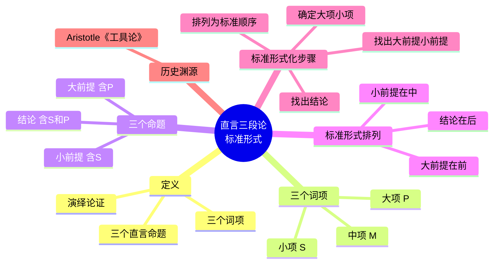

**相关笔记：** [[5.8 直言命题的符号系统与图解]] | [[6.2 三段论论证的形式性质]]

> [!abstract] 概览
> 本节介绍**直言三段论**（categorical syllogism）的基本定义与标准形式。直言三段论是由三个直言命题组成的演绎论证，恰好包含三个词项，每个词项恰好出现两次。我们将系统学习三段论的三个词项（大项、小项、中项）与三个命题（大前提、小前提、结论）的识别方法，并掌握将任意三段论化为标准形式的规范化步骤。

## 一、知识结构总览

## 二、核心思想与证明技巧

### 2.1 直言三段论的定义

> [!def] 直言三段论（Categorical Syllogism）
> **直言三段论**是一种==演绎论证==，它由**恰好三个直言命题**组成，并且恰好包含**三个词项**（term），其中每个词项在整个论证中**恰好出现两次**。

这一定义包含三个关键约束条件，缺一不可：

| 约束条件 | 含义 | 违反示例 |
|:---|:---|:---|
| 恰好三个直言命题 | 论证只能有一个结论和两个前提 | 四个命题的论证不是三段论 |
| 恰好三个词项 | 论证中只出现三个不同的词项 | 出现四个不同词项则不是标准三段论 |
| 每个词项恰好出现两次 | 每个词项在论证中出现且仅出现两次 | 某词项只出现一次则不符合定义 |

> [!tip] 理解"恰好三个词项"的严格性
> 三段论要求恰好三个词项，这意味着不能多也不能少。如果论证中出现了四个不同的词项，就犯了"四词项谬误"（fallacy of four terms），这通常源于自然语言中同一语词的不同含义（歧义）。例如：
> - 前提一：所有**银行**（金融机构）都是营利机构。
> - 前提二：这条河的**岸边**（river bank）风景优美。
> - 结论：？——这里"bank"有两个不同含义，实际上涉及四个词项，不构成有效的三段论。

### 2.2 三个词项：大项、小项与中项

> [!def] 大项（Major Term）
> **大项**是三段论==结论的谓项==（predicate term），记为 **$P$**。

> [!def] 小项（Minor Term）
> **小项**是三段论==结论的主项==（subject term），记为 **$S$**。

> [!def] 中项（Middle Term）
> **中项**是三段论中==只在两个前提中出现、不在结论中出现的第三个词项==，记为 **$M$**。

> [!tip] 识别三个词项的技巧
> 识别三个词项的**最佳入手点永远是结论**：
> 1. 先看结论，结论的主项就是**小项 $S$**，结论的谓项就是**大项 $P$**；
> 2. 然后在两个前提中找出既不是 $S$ 也不是 $P$ 的那个词项，它就是**中项 $M$**。

**实例分析：**

> 所有科学家（$M$）都是理性的人（$P$）。
> 所有物理学家（$S$）都是科学家（$M$）。
> 所以，所有物理学家（$S$）都是理性的人（$P$）。

- 结论"所有物理学家都是理性的人"中：主项"物理学家"= **小项 $S$**，谓项"理性的人"= **大项 $P$**
- 前提中既不是 $S$ 也不是 $P$ 的词项"科学家"= **中项 $M$**

### 2.3 三个命题：大前提、小前提与结论

> [!def] 大前提（Major Premise）
> **大前提**是==包含大项 $P$ 的那个前提==。

> [!def] 小前提（Minor Premise）
> **小前提**是==包含小项 $S$ 的那个前提==。

> [!def] 结论（Conclusion）
> **结论**是==包含小项 $S$ 和大项 $P$ 的命题==，它断言了 $S$ 与 $P$ 之间的某种关系。

在上面的实例中：
- **大前提**：所有科学家（$M$）都是理性的人（$P$）——包含大项 $P$
- **小前提**：所有物理学家（$S$）都是科学家（$M$）——包含小项 $S$
- **结论**：所有物理学家（$S$）都是理性的人（$P$）——包含 $S$ 和 $P$

### 2.4 标准形式

> [!def] 标准形式（Standard Form）
> 一个直言三段论处于**标准形式**，当且仅当：
> 1. **大前提排在第一位**；
> 2. **小前提排在第二位**；
> 3. **结论排在第三位**。

> [!tip] 标准形式的意义
> 将三段论排列为标准形式是后续一切形式化分析的基础。只有先化为标准形式，我们才能确定三段论的**式**（mood）和**格**（figure），进而用文恩图等方法检验其有效性。这就像解数学题前先整理方程的标准形式一样——==规范化是系统化分析的前提==。

### 2.5 标准形式化的具体步骤

将任意三段论化为标准形式，遵循以下**四步流程**：

> [!example] 标准形式化步骤
>
> **第一步：找出结论。**
> 在论证中寻找标志结论的语词（如"所以"、"因此"、"因而"等），确定哪个命题是结论。
>
> **第二步：确定大项和小项。**
> 结论的主项 = 小项 $S$；结论的谓项 = 大项 $P$。
>
> **第三步：找出大前提和小前提。**
> 包含 $P$ 的前提 = 大前提；包含 $S$ 的前提 = 小前提。
>
> **第四步：排列为标准顺序。**
> 按"大前提 → 小前提 → 结论"的顺序重新排列。

**完整实例演示：**

> 原始论证（非标准顺序）：
> - 有些政治家是诚实的人，因为所有理想主义者都是诚实的人，而有些政治家是理想主义者。

**第一步**：找出结论。标志词"因为"之前的部分是结论：
- 结论：==有些政治家是诚实的人==

**第二步**：确定大项和小项：
- 小项 $S$ = "政治家"（结论主项）
- 大项 $P$ = "诚实的人"（结论谓项）

**第三步**：找出大前提和小前提：
- "所有理想主义者都是诚实的人"包含大项 $P$ → ==大前提==
- "有些政治家是理想主义者"包含小项 $S$ → ==小前提==

**第四步**：排列为标准形式：
> 所有理想主义者（$M$）都是诚实的人（$P$）。——大前提
> 有些政治家（$S$）是理想主义者（$M$）。——小前提
> 所以，有些政治家（$S$）是诚实的人（$P$）。——结论

### 2.6 历史渊源

> [!quote] Aristotle 与三段论
> 直言三段论是==传统逻辑（亚里士多德逻辑）的核心==。亚里士多德（Aristotle, 384–322 BC）在其著作==《工具论》==（*Organon*）中首次对三段论进行了系统论述，尤其是《前分析篇》（*Prior Analytics*）详细讨论了三段论的各种形式及其有效性。两千多年来，三段论理论一直是西方逻辑学的基石，直到19世纪数理逻辑兴起才被超越，但其核心思想至今仍是逻辑入门教育的起点。

## 三、补充理解与易混淆点

### 补充理解

> [!info] 补充1：Aristotle《前分析篇》中的三段论定义
> **来源：** Aristotle, *Prior Analytics*, Book I, Chapter 1, c. 350 BCE.
>
> Aristotle在《前分析篇》开篇给出了三段论的经典定义："三段论是一种论证，在其中，某些东西被设定了，由于它们是这样，必然得出另外一些不同于所设定的东西。"（"A syllogism is a discourse in which, certain things being stated, something other than what is stated follows of necessity from their being so."）这一定义强调了三段论的"必然性"特征——结论是从前提中**必然**推出的，这正是演绎推理的本质。Aristotle的三段论定义不涉及"三个词项"的限定，这一精确化是后世逻辑学家的贡献。

> [!info] 补充2：中世纪逻辑学家的标准化工作
> **来源：** Peter of Spain, *Tractatus* (《逻辑纲要》), c. 1230 CE; William of Sherwood, *Introductiones in Logicam*, c. 1200 CE.
>
> 三段论的"标准形式"（大前提→小前提→结论）以及"大项/小项/中项"的术语体系，主要归功于中世纪逻辑学家。Peter of Spain在《逻辑纲要》中系统化了三段论的术语和分类方法，William of Sherwood进一步发展了三段论的化归理论。这些中世纪学者将Aristotle的希腊文逻辑著作翻译为拉丁文，并建立了沿用至今的教学体系——包括"大前提/小前提/结论"的排列顺序和"大项(P)/小项(S)/中项(M)"的命名约定。

> [!info] 三段论与一般演绎论证的关系
> 并非所有演绎论证都是三段论。三段论是一种**特殊类型**的演绎论证，它必须满足"三个直言命题 + 三个词项"的严格结构要求。包含假言命题（"如果……那么……"）或选言命题（"……或……"）的论证虽然也是演绎论证，但不是直言三段论。直言三段论是 [[演绎论证]] 的一个子类。

> [!info] 中项的功能——逻辑"桥梁"
> 中项 $M$ 在三段论中扮演着==逻辑桥梁==的角色。它出现在两个前提中但不出现在结论中，其功能是将小项 $S$ 和大项 $P$ 联系起来。通过中项，我们可以从两个前提中推导出 $S$ 与 $P$ 之间的关系。如果中项没有起到有效的桥梁作用（例如中项在两个前提中都不周延），三段论就会无效——这是后续将详细讨论的内容。

> [!warning] 常见错误：混淆大前提与小前提
> 初学者容易犯的一个错误是：认为"大前提"就是"内容更宏大、更重要的前提"，"小前提"就是"内容较次要的前提"。这是**完全错误**的理解。大前提与小前提的区分==纯粹由它们包含的词项决定==：
> - 包含大项 $P$ 的就是大前提；
> - 包含小项 $S$ 的就是小前提。
> 与前提的内容重要性、篇幅长短、出现顺序完全无关。

> [!warning] 常见错误：忽略标准形式化
> 有些论证在日常语言中，结论出现在两个前提之间，或者前提的排列顺序不是"大前提→小前提"。如果不先化为标准形式就直接分析，很容易混淆大项、小项、中项的角色，导致分析错误。==务必养成先化为标准形式的习惯==。

### 易混淆点

> [!warning] 误区：三段论 = 三个命题就行
> ❌ **错误理解：** 只要一个论证恰好由三个直言命题组成，它就是直言三段论。
> ✅ **正确理解：** 直言三段论还必须满足"恰好三个词项"和"每个词项恰好出现两次"的约束。如果论证中出现了四个不同的词项（即使只有三个命题），就不构成有效的三段论——这就是"四词项谬误"。
> **辨析：** "三个命题"只是三段论定义的三个约束条件之一，另外两个约束（三个词项、每个词项出现两次）同样不可缺省。

> [!warning] 误区：结论一定在最后
> ❌ **错误理解：** 三段论的结论总是出现在论证的最后一句。
> ✅ **正确理解：** 在日常论证中，结论可能出现在任何位置——可以在开头（"所以……"之后是前提）、在中间、或在最后。标准形式要求结论排在最后，但这是==规范化排列的结果==，不是原始论证的固有特征。
> **辨析：** 识别结论的关键是寻找标志词（"所以"、"因此"、"因而"等），而非依赖位置。化为标准形式时，无论结论原始位置在哪里，都必须将其移到最后。

---

## 四、习题精选

> [!todo] 习题概览
> | 题号 | 来源 | 核心考点 | 难度 |
> |:-----|:-----|:---------|:-----|
> | 1 | 自编 | 识别词项与标准形式化 | ⭐ |
> | 2 | 自编 | 含标志词的论证标准化 | ⭐⭐ |
> | 3 | 自编 | 四词项谬误辨析 | ⭐⭐ |

---

### 题1：识别词项与标准形式化

> [!problem] 题目
> 以下论证是否为直言三段论？如果是，请指出其大项、小项和中项，并将其化为标准形式。
>
> "没有蛇是哺乳动物，所有哺乳动物都是温血动物，所以没有蛇是温血动物。"

> [!faq]- 解答
> **第一步：判断是否为直言三段论。**
> 该论证由三个直言命题组成，且只包含三个词项（"蛇"、"哺乳动物"、"温血动物"），每个词项恰好出现两次。因此，==它是直言三段论==。
>
> **第二步：找出结论。**
> 标志词"所以"之后："没有蛇是温血动物"。
>
> **第三步：确定大项和小项。**
> - 小项 $S$ = "蛇"（结论主项）
> - 大项 $P$ = "温血动物"（结论谓项）
> - 中项 $M$ = "哺乳动物"
>
> **第四步：识别大前提和小前提。**
> - "没有蛇是哺乳动物"包含小项 $S$ → 小前提
> - "所有哺乳动物都是温血动物"包含大项 $P$ → 大前提
>
> **第五步：排列为标准形式。**
> > 所有哺乳动物（$M$）都是温血动物（$P$）。——大前提
> > 没有蛇（$S$）是哺乳动物（$M$）。——小前提
> > 所以，没有蛇（$S$）是温血动物（$P$）。——结论
>
> $\blacksquare$

---

### 题2：含标志词的论证标准化

> [!problem] 题目
> 将以下论证化为标准形式，并指出大项、小项和中项。
>
> "所有英雄都是勇敢的，因为有些士兵是英雄，而所有士兵都是勇敢的。"

> [!faq]- 解答
> **第一步：找出结论。**
> 标志词"因为"之前："所有英雄都是勇敢的"。
>
> **第二步：确定大项和小项。**
> - 小项 $S$ = "英雄"（结论主项）
> - 大项 $P$ = "勇敢的"（结论谓项）
>
> **第三步：识别大前提和小前提。**
> - "有些士兵是英雄"包含小项 $S$ → 小前提
> - "所有士兵都是勇敢的"包含大项 $P$ → 大前提
> - 中项 $M$ = "士兵"
>
> **第四步：排列为标准形式。**
> > 所有士兵（$M$）都是勇敢的（$P$）。——大前提
> > 有些士兵（$M$）是英雄（$S$）。——小前提
> > 所以，所有英雄（$S$）都是勇敢的（$P$）。——结论
>
> $\blacksquare$

---

### 题3：四词项谬误辨析

> [!problem] 题目
> 判断以下论证是否构成直言三段论，并说明理由。
>
> "所有猫都是动物，所有狗都是动物，所以所有猫都是狗。"

> [!faq]- 解答
> 该论证虽然由三个直言命题组成，但涉及的词项有**四个**："猫"、"动物"、"狗"，以及——等等，让我们仔细数一下：
> - "猫"出现2次（前提一主项、结论主项）
> - "动物"出现2次（前提一谓项、前提二谓项）
> - "狗"出现2次（前提二主项、结论谓项）
>
> 实际上只有三个词项："猫"、"动物"、"狗"，每个恰好出现两次。因此==它确实构成直言三段论==。
>
> 化为标准形式：
> > 所有狗（$M$）都是动物（$P$）。——大前提（含大项 $P$）
> > 所有猫（$S$）都是动物（$M$）。——小前提（含小项 $S$）
> > 所以，所有猫（$S$）都是狗（$P$）。——结论
>
> 注意：虽然这个三段论在**形式上**是合法的（满足定义），但它在逻辑上是**无效的**——中项"动物"在两个前提中都不周延，犯了"中项不周延"谬误。三段论的定义只规定了结构要求，不保证有效性。$\blacksquare$

> [!tip] 解题思路提示
> 三段论标准化四步法：先找结论（寻找"所以""因此"等标志词）→ 确定大小项（结论主项=小项 $S$，结论谓项=大项 $P$）→ 找含大小项的前提（含 $P$ 的=大前提，含 $S$ 的=小前提）→ 排列为标准顺序（大前提→小前提→结论）。

## 五、视频学习指南

> [!info] 视频资源
> | 资源 | 链接 | 对应内容 | 备注 |
> |:-----|:-----|:---------|:-----|
> | Michael Genesereth: Introduction to Logic | [链接](https://www.youtube.com/results?search_query=Michael+Genesereth+Introduction+to+Logic) | Categorical Syllogisms | Stanford 课程 |
> | Kevin deLaplante: Critical Thinking | [链接](https://www.youtube.com/results?search_query=Kevin+deLaplante+Syllogistic+Logic) | Syllogistic Logic 系列 | 英文，配合动画讲解 |

## 六、教材原文

> [!quote] 教材核心定义（Copi, Cohen, McMahon）
> "A **categorical syllogism** is a deductive argument consisting of three categorical propositions that contain exactly three terms, each of which occurs in exactly two of the propositions."
>
> "The **major term** of a categorical syllogism is the predicate term of the conclusion. The **minor term** is the subject term of the conclusion. The **middle term** is the term that occurs in both premises but not in the conclusion."
>
> "A categorical syllogism is in **standard form** when its major premise is first, its minor premise is second, and its conclusion is last."

## 参见 Wiki

- [[直言命题]]：三段论的基本构成单元
- [[A_E_I_O 四种命题]]：构成三段论的命题类型
- [[论证]]：三段论作为一种特殊的论证形式
- [[演绎论证]]：三段论属于演绎论证的子类
- [[直言三段论]]：直言三段论的完整概念页
- [[周延性]]：词项的周延性是判断三段论有效性的重要概念（后续章节）

#学习/逻辑学/直言三段论
