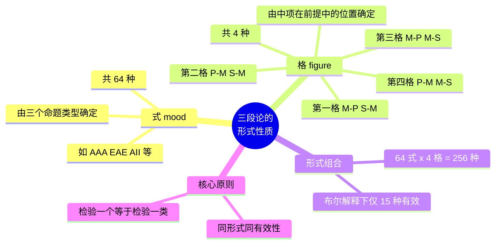

**相关笔记：** [[6.1 直言三段论的标准形式]] | [[6.3 检验三段论：文恩图解法]]

> [!abstract] 概览
> 本节讨论直言三段论的**形式性质**。每个标准形式的三段论都可以由两个形式特征唯一确定：**式**（mood）和**格**（figure）。式由三个命题的 A/E/I/O 类型字母序列决定，格由中项在两个前提中的位置决定。$4$ 种格 $\times$ $64$ 种式 = $256$ 种可能的三段论形式，其中在布尔解释下只有 **15 种**是有效的。理解式与格是系统检验三段论有效性的基础。

## 一、知识结构总览

## 二、核心思想与证明技巧

### 2.1 式（Mood）

> [!def] 式（Mood）
> 一个标准形式直言三段论的**式**，是指==其三个命题（大前提、小前提、结论）的 A/E/I/O 类型按顺序排列所构成的字母序列==。

回顾 [[A_E_I_O 四种命题]] 的四种类型：
- **A**：全称肯定（所有 $S$ 是 $P$）
- **E**：全称否定（没有 $S$ 是 $P$）
- **I**：特称肯定（有些 $S$ 是 $P$）
- **O**：特称否定（有些 $S$ 不是 $P$）

> [!example] 确定三段论的式
>
> > 所有 $M$ 是 $P$。（A 命题）
> > 所有 $S$ 是 $M$。（A 命题）
> > 所以，所有 $S$ 是 $P$。（A 命题）
>
> 三个命题依次为 A、A、A，因此该三段论的式为 ==AAA==。
>
> ---
>
> > 没有 $P$ 是 $M$。（E 命题）
> > 所有 $S$ 是 $M$。（A 命题）
> > 所以，没有 $S$ 是 $P$。（E 命题）
>
> 三个命题依次为 E、A、E，因此该三段论的式为 ==EAE==。

> [!tip] 式的计算
> 由于每个命题位置有 4 种可能（A/E/I/O），三个位置共有 $4 \times 4 \times 4 = 64$ 种不同的式。但并非所有式在所有格中都有效——事实上，大部分组合是无效的。

### 2.2 格（Figure）

> [!def] 格（Figure）
> 一个标准形式直言三段论的**格**，是指==中项 $M$ 在大前提和小前提中的位置排列方式==。由于中项在每个前提中既可以做主项也可以做谓项，共有 $2 \times 2 = 4$ 种可能的排列，即 4 个格。

> [!tip] 记忆格的关键
> 确定格时，==只看中项 $M$ 在两个前提中的位置==，不看结论。结论的形式（$S$—$P$）在所有格中都是相同的。

四种格的详细说明如下：

#### 第一格（Figure 1）

> [!def] 第一格
> 中项 $M$ 在大前提中做==主项==，在小前提中做==谓项==。

$$
\text{大前提：} M — P \qquad \text{小前提：} S — M \qquad \therefore\ S — P
$$

> [!example] 第一格实例
> > 所有科学家（$M$）都是理性的人（$P$）。
> > 所有物理学家（$S$）都是科学家（$M$）。
> > 所以，所有物理学家（$S$）都是理性的人（$P$）。
>
> 中项"科学家"在大前提做主项、小前提做谓项 → ==第一格==。

#### 第二格（Figure 2）

> [!def] 第二格
> 中项 $M$ 在两个前提中都做==谓项==。

$$
\text{大前提：} P — M \qquad \text{小前提：} S — M \qquad \therefore\ S — P
$$

> [!example] 第二格实例
> > 所有理性的人（$P$）都是追求真理的（$M$）。
> > 没有教条主义者（$S$）是追求真理的（$M$）。
> > 所以，没有教条主义者（$S$）是理性的人（$P$）。
>
> 中项"追求真理的"在两个前提中都做谓项 → ==第二格==。

#### 第三格（Figure 3）

> [!def] 第三格
> 中项 $M$ 在两个前提中都做==主项==。

$$
\text{大前提：} M — P \qquad \text{小前提：} M — S \qquad \therefore\ S — P
$$

> [!example] 第三格实例
> > 所有科学家（$M$）都是勤奋的（$P$）。
> > 所有科学家（$M$）都是人（$S$）。
> > 所以，有些人（$S$）是勤奋的（$P$）。
>
> 中项"科学家"在两个前提中都做主项 → ==第三格==。

#### 第四格（Figure 4）

> [!def] 第四格
> 中项 $M$ 在大前提中做==谓项==，在小前提中做==主项==。

$$
\text{大前提：} P — M \qquad \text{小前提：} M — S \qquad \therefore\ S — P
$$

> [!example] 第四格实例
> > 所有理性的人（$P$）都是追求真理的（$M$）。
> > 所有追求真理的（$M$）都是学者（$S$）。
> > 所以，有些学者（$S$）是理性的人（$P$）。
>
> 中项"追求真理的"在大前提做谓项、小前提做主项 → ==第四格==。

> [!tip] 四格速记法
> 一种经典的速记方式是只看中项 $M$ 的位置模式：
>
> | 格 | 大前提中 $M$ | 小前提中 $M$ | 口诀 |
> |:--:|:--:|:--:|:--|
> | 第一格 | 主项 | 谓项 | **主—谓** |
> | 第二格 | 谓项 | 谓项 | **谓—谓** |
> | 第三格 | 主项 | 主项 | **主—主** |
> | 第四格 | 谓项 | 主项 | **谓—主** |

### 2.3 完整的形式标识：式与格的组合

> [!def] 三段论形式的完整标识
> 一个标准形式三段论的完整形式由==式和格共同确定==，通常记为"式 + 格编号"，例如 **AAA-1** 表示第一格的 AAA 式三段论。

> [!example] 完整形式标识实例
> > 所有 $M$ 是 $P$。（A）
> > 所有 $S$ 是 $M$。（A）
> > 所以，所有 $S$ 是 $P$。（A）
>
> 式 = AAA，中项在大前提做主项、小前提做谓项 → 第一格。
> 完整形式：==AAA-1==（即经典的"Barbara"式）。
>
> ---
>
> > 没有 $P$ 是 $M$。（E）
> > 所有 $S$ 是 $M$。（A）
> > 所以，没有 $S$ 是 $P$。（E）
>
> 式 = EAE，中项在两个前提中都做谓项 → 第二格。
> 完整形式：==EAE-2==（即经典的"Cesare"式）。

### 2.4 256 种形式与 15 种有效式

> [!info] 形式总数计算
> - 式的数目：$4 \times 4 \times 4 = 64$ 种
> - 格的数目：$4$ 种
> - 总形式数：$64 \times 4 = 256$ 种
>
> 在==布尔解释==（Boolean interpretation）下，即不考虑空类（empty class）的特殊假设，这 256 种形式中只有 **15 种**是有效的。

> [!tip] 为什么只有 15 种有效？
> 并非所有式和格的组合都能保证从前提必然推出结论。三段论的有效性取决于其形式结构是否满足特定的逻辑规则（如中项至少周延一次、结论中不周延的词项在前提中也不得周延等）。大部分形式组合违反了这些规则，因此是无效的。后续章节将系统介绍检验有效性的多种方法。

### 2.5 三段论形式性质的核心原则

> [!def] 形式性质的核心原则
> ==检验一个三段论的有效性，等同于检验与其同形式（同式同格）的所有三段论的有效性==。

> [!tip] 这一原则的重大意义
> 这一原则是三段论理论中最核心的思想之一。它的含义是：
>
> 1. **有效性是形式的性质**：一个三段论是否有效，完全由其式和格决定，与其具体内容无关。
> 2. **反例的威力**：要证明某个形式无效，只需找到**一个**同形式的实例，其前提为真但结论为假。
> 3. **系统化检验**：我们不需要逐一检验每一个具体三段论，只需检验 256 种形式，就能判定所有可能的三段论的有效性。
>
> 这正是逻辑学作为"形式科学"的体现——==形式决定有效性，内容无关紧要==。

> [!example] 用反例证明无效性
> 要证明 **AAA-2** 无效，只需构造一个同形式的具体实例：
> > 所有猫（$P$）都是动物（$M$）。（A，真）
> > 所有狗（$S$）都是动物（$M$）。（A，真）
> > 所以，所有狗（$S$）都是猫（$P$）。（A，假）
>
> 前提真但结论假 → AAA-2 无效 → 所有 AAA-2 形式的三段论都无效。$\blacksquare$

## 三、补充理解与易混淆点

### 补充理解

> [!info] 补充1：四个格的历史发现过程
> **来源：** Aristotle, *Prior Analytics*, Book I; Theophrastus, *Prior Analytics* (残篇), c. 320 BCE.
>
> Aristotle在《前分析篇》中主要研究了第一格和第二格，对第三格和第四格的讨论较少。第三格和第四格的系统化归功于Aristotle的学生Theophrastus（德奥弗拉斯特），他补充了第三格的多个有效式。第四格的独立地位直到中世纪才被明确确立。有趣的是，Aristotle本人似乎并不认为四个格具有同等地位——他将第一格视为"完美的格"（perfect syllogism），其他格的有效式都需要通过换位等操作"化归"（reduction）为第一格来证明其有效性。

> [!info] 补充2：拉丁记忆名的编码系统
> **来源：** William of Sherwood, *Syncategoremata*, c. 1200 CE; Peter of Spain, *Tractatus*, c. 1230 CE.
>
> 15个有效三段论形式的拉丁记忆名（Barbara, Celarent, Darii, Ferio, etc.）是中世纪逻辑学的杰出创造。这些名称不仅是助记工具，更是一个精密的编码系统：名称中的三个元音字母依次代表大前提、小前提和结论的命题类型（如 B**a**rb**a**r**a** = AAA）；辅音字母编码了化归操作——s表示简单换位（simple conversion），p表示偶然换位（conversion per accidens），m表示交换前提（mutate premises），c表示反证法（reductio per impossibile）。这一系统使得中世纪学生能够快速识别和验证三段论的有效性。

> [!info] 式与格的确定必须先化为标准形式
> 确定一个三段论的式和格之前，==必须先将它化为标准形式==（参见 [[6.1 直言三段论的标准形式]]）。如果三段论不是标准形式，命题的顺序和中项的位置可能是混乱的，直接确定式和格会导致错误。

> [!info] 传统解释与布尔解释的差异
> 在亚里士多德的**传统解释**（traditional interpretation）下，假设全称命题的主项所指的类非空（即"所有 $S$ 是 $P$"蕴含"存在 $S$"），此时有更多的三段论形式被认为是有效的（传统上认为有 24 种有效式）。但在**布尔解释**下，不假设主项非空，全称命题只表示"如果有 $S$，则它是 $P$"，不蕴含存在性，此时只有 15 种有效式。现代逻辑学普遍采用布尔解释。

> [!warning] 不要混淆"式"与"格"
> - **式**（mood）描述的是三个命题的**类型**（A/E/I/O），与词项无关。
> - **格**（figure）描述的是中项在前提中的**位置**，与命题类型无关。
> 两者共同确定三段论的完整形式，缺一不可。说"AAA 三段论"是不完整的，必须说"AAA-1 三段论"才能唯一确定形式。

> [!warning] 确定格时只看前提，不看结论
> 格完全由中项在**两个前提**中的位置决定。结论中 $S$ 和 $P$ 的位置在所有格中都是固定的（$S$ 是主项，$P$ 是谓项），因此结论不提供任何关于格的信息。

> [!warning] 注意中项的"位置"指的是主项/谓项角色
> 确定格时，看的是中项 $M$ 在前提中扮演的是**主项**还是**谓项**的角色，而不是看 $M$ 在书写顺序中排在前面还是后面。例如，"没有 $P$ 是 $M$"（E 命题）中，$M$ 做谓项，即使 $M$ 写在后面。

### 易混淆点

> [!warning] 误区：式和格是同一概念
> ❌ **错误理解：** "式"和"格"描述的是三段论的同一个形式特征，知道其中一个就能确定另一个。
> ✅ **正确理解：** 式和格是两个独立的形式维度。式（mood）描述三个命题的 A/E/I/O 类型序列，格（figure）描述中项在两个前提中的主项/谓项位置。两者共同确定三段论的完整形式，缺一不可。
> **辨析：** 说"AAA 三段论"是不完整的——AAA 只是式，还需要指定格（如 AAA-1、AAA-2）才能唯一确定形式。同理，说"第一格三段论"也不完整——第一格有 64 种可能的式。

> [!warning] 误区：同式同格 = 同论证
> ❌ **错误理解：** 两个三段论具有相同的式和格，意味着它们是完全相同的论证。
> ✅ **正确理解：** 同式同格意味着两个三段论具有**相同的有效性**（都有效或都无效），但它们的具体内容（词项所指代的类）可以完全不同。这正是形式逻辑的核心思想——有效性是形式的性质，与内容无关。
> **辨析：** AAA-1 的实例"所有猫是动物，所有虎是猫，所以所有虎是动物"和"所有金属是导体，所有铜是金属，所以所有铜是导体"是不同的论证，但具有相同的形式和相同的有效性。

---

## 四、习题精选

> [!todo] 习题概览
> | 题号 | 来源 | 核心考点 | 难度 |
> |:-----|:-----|:---------|:-----|
> | 1 | 自编 | 确定式与格 | ⭐ |
> | 2 | 自编 | 非标准论证标准化与形式识别 | ⭐⭐ |
> | 3 | 自编 | 构造反例证明无效性 | ⭐⭐⭐ |

---

### 题1：确定式与格

> [!problem] 题目
> 确定以下标准形式三段论的式和格：
>
> > 所有伟大思想家（$M$）都是孤独的人（$P$）。
> > 所有哲学家（$S$）都是伟大思想家（$M$）。
> > 所以，所有哲学家（$S$）都是孤独的人（$P$）。

> [!faq]- 解答
> **确定式：**
> - 大前提"所有 $M$ 是 $P$"→ A 命题
> - 小前提"所有 $S$ 是 $M$"→ A 命题
> - 结论"所有 $S$ 是 $P$"→ A 命题
> - 式 = ==AAA==
>
> **确定格：**
> - 中项 $M$ 在大前提中做主项（"所有 $M$ 是 $P$"）
> - 中项 $M$ 在小前提中做谓项（"所有 $S$ 是 $M$"）
> - 中项位置：主项—谓项 → ==第一格==
>
> 完整形式：==AAA-1==（Barbara）。$\blacksquare$

---

### 题2：非标准论证标准化与形式识别

> [!problem] 题目
> 将以下论证化为标准形式，然后确定其式和格：
>
> "没有诗人是数学家，因为所有数学家都是精确的，而有些诗人不是精确的。"

> [!faq]- 解答
> **第一步：找出结论。**
> 标志词"因为"之前："没有诗人是数学家"。
>
> **第二步：确定大项和小项。**
> - 小项 $S$ = "诗人"（结论主项）
> - 大项 $P$ = "数学家"（结论谓项）
> - 中项 $M$ = "精确的"
>
> **第三步：识别大前提和小前提。**
> - "所有数学家都是精确的"包含大项 $P$ → 大前提
> - "有些诗人不是精确的"包含小项 $S$ → 小前提
>
> **第四步：排列为标准形式。**
> > 所有数学家（$P$）都是精确的（$M$）。——大前提（A）
> > 有些诗人（$S$）不是精确的（$M$）。——小前提（O）
> > 所以，没有诗人（$S$）是数学家（$P$）。——结论（E）
>
> **确定式：** A、O、E → ==AOE==
>
> **确定格：**
> - 中项 $M$ 在大前提"所有 $P$ 是 $M$"中做谓项
> - 中项 $M$ 在小前提"有些 $S$ 不是 $M$"中做谓项
> - 中项位置：谓项—谓项 → ==第二格==
>
> 完整形式：==AOE-2==。$\blacksquare$

---

### 题3：构造反例证明无效性

> [!problem] 题目
> 利用形式性质的核心原则，构造一个反例证明 **AII-3** 是无效的。

> [!faq]- 解答
> **AII-3 的形式结构：**
> > 所有 $M$ 是 $P$。（A）
> > 有些 $M$ 是 $S$。（I）
> > 所以，有些 $S$ 是 $P$。（I）
>
> 中项在两个前提中都做主项 → 第三格。
>
> **构造反例（前提真、结论假）：**
> > 所有猫（$M$）都是动物（$P$）。（A，真）
> > 有些猫（$M$）是哺乳动物（$S$）。（I，真）
> > 所以，有些哺乳动物（$S$）是动物（$P$）。（I，……这个结论实际上是真的）
>
> 需要换一个反例：
> > 所有猫（$M$）都是动物（$P$）。（A，真）
> > 有些猫（$M$）是黑猫（$S$）。（I，真）
> > 所以，有些黑猫（$S$）是动物（$P$）。（I，真——仍然不行）
>
> 再换：
> > 所有三角形（$M$）都是多边形（$P$）。（A，真）
> > 有些三角形（$M$）是等边三角形（$S$）。（I，真）
> > 所以，有些等边三角形（$S$）是多边形（$P$）。（I，真——还是不行）
>
> 实际上，**AII-3 是有效的**（在布尔解释下，它是 15 种有效形式之一，称为"Datisi"）。这说明并非所有形式都是无效的——要证明无效性，必须选择确实无效的形式。
>
> **修正：证明 AII-2 无效。**
> AII-2 的形式：
> > 所有 $P$ 是 $M$。（A）
> > 有些 $S$ 是 $M$。（I）
> > 所以，有些 $S$ 是 $P$。（I）
>
> 反例：
> > 所有猫（$P$）都是动物（$M$）。（A，真）
> > 有些狗（$S$）是动物（$M$）。（I，真）
> > 所以，有些狗（$S$）是猫（$P$）。（I，假）
>
> 前提真但结论假 → ==AII-2 无效==。$\blacksquare$

> [!tip] 解题思路提示
> 确定式与格的步骤：先化为标准形式（大前提→小前提→结论）→ 写出三个命题的 A/E/I/O 类型，得到式 → 确定中项 $M$ 在两个前提中分别做主项还是谓项，得到格 → 组合为完整形式标识（如 AAA-1）。构造反例时，保持形式不变，替换词项使前提为真、结论为假。

## 五、视频学习指南

> [!info] 视频资源
> | 资源 | 链接 | 对应内容 | 备注 |
> |:-----|:-----|:---------|:-----|
> | Brandon Foltz: Categorical Logic & Syllogisms | [链接](https://www.youtube.com/results?search_query=Brandon+Foltz+Categorical+Logic+Syllogisms) | 式与格的直观讲解 | 英文，配合白板演示 |
> | Kevin deLaplante: Critical Thinking Academy | [链接](https://www.youtube.com/results?search_query=Kevin+deLaplante+Categorical+Logic) | Categorical Logic 系列 | 英文，适合入门 |

## 六、教材原文

> [!quote] 教材核心定义（Copi, Cohen, McMahon）
> "The **mood** of a syllogism is determined by the types of its three propositions (A, E, I, or O)."
>
> "The **figure** of a syllogism is determined by the position of the middle term in its premises."
>
> "Since there are four kinds of categorical propositions, and every syllogism contains exactly three such propositions, there are $4 \times 4 \times 4 = 64$ possible moods. And since there are four possible figures, there are $64 \times 4 = 256$ possible syllogistic forms."
>
> "The validity or invalidity of a syllogism is a purely formal matter. To test any given syllogism is to test all syllogisms of that same form."

## 参见 Wiki

- [[直言命题]]：三段论由直言命题构成，命题的 A/E/I/O 类型决定式
- [[周延性]]：词项的周延性是判断三段论有效性的关键概念
- [[论证]]：三段论是论证的一种特殊形式
- [[6.1 直言三段论的标准形式]]：化为标准形式是确定式和格的前提
- [[三段论的式与格]]：式与格的完整概念页
- [[A_E_I_O 四种命题]]：四种命题类型是确定式的基础

#学习/逻辑学/直言三段论
