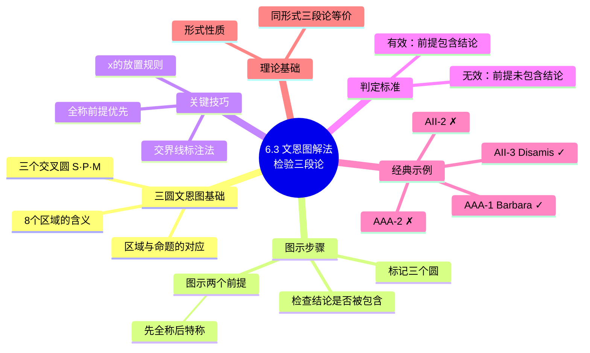

**相关笔记：** [[6.2 三段论论证的形式性质]] | [[6.4 三段论规则与三段论谬误]]

> [!abstract] 概览
> 本节介绍使用**三圆文恩图**检验直言三段论有效性的系统方法。通过将两个前提分别图示到由小项（S）、大项（P）和中项（M）三个交叉圆构成的图中，再检查结论是否已被图示所包含，即可判定三段论的有效性。该方法的核心原则是：==有效三段论的前提图示必然已经包含了结论的信息==；反之，若前提图示未能完全覆盖结论所断言的内容，则三段论无效。

## 一、知识结构总览

## 二、核心思想与证明技巧

### 2.1 三圆文恩图的基本结构

三圆文恩图由三个两两相交的圆组成，分别标记为：

- **S**（小项，Subject）——结论的主项
- **P**（大项，Predicate）——结论的谓项
- **M**（中项，Middle）——在两个前提中出现但不在结论中出现的项

三个圆交叉形成 ==8 个区域==，每个区域对应一种关于 S、P、M 的组合情况：

| 区域 | 包含 | 排除 | 含义 |
|:---:|:---:|:---:|:---|
| ① | S, P, M | — | 同时属于 S、P、M 三类 |
| ② | S, P | M | 属于 S 和 P，但不属于 M |
| ③ | S, M | P | 属于 S 和 M，但不属于 P |
| ④ | M | S, P | 仅属于 M |
| ⑤ | S | P, M | 仅属于 S |
| ⑥ | P, M | S | 属于 P 和 M，但不属于 S |
| ⑦ | P | S, M | 仅属于 P |
| ⑧ | — | S, P, M | S、P、M 三类都不属于 |

> [!tip] 记忆技巧
> 每个区域可以用"在/不在"来理解。例如区域① = "在 S 内且在 P 内且在 M 内"，区域⑧ = "不在 S 内、不在 P 内、不在 M 内"（即三个圆之外的区域）。这8个区域穷尽了所有可能的组合：$2^3 = 8$。

### 2.2 图示前提的步骤

检验一个直言三段论，按照以下步骤操作：

**第一步：标记三个圆。** 将三个圆分别标记为 S、P、M。

**第二步：图示两个前提。** 将大前提和小前提分别用文恩图的标记方法画到图中。

> [!tip] 核心原则——先全称后特称
> 当两个前提中既有全称命题（A 或 E）又有特称命题（I 或 O）时，==必须先图示全称前提，再图示特称前提==。这是因为全称前提通过"涂阴影"消除某些区域，可能使特称前提中 x 的位置变得唯一确定，从而避免歧义。

**第三步：处理特称前提中 x 的位置。**

> [!def] 交界线规则
> 如果在图示特称前提时，x 可以放在两个（或更多）区域中的任何一个，且根据已有信息无法确定其确切位置，则应将 x 放在这两个区域的==交界线==上。这表示"x 至少在这两个区域之一中"，而不承诺它究竟在哪个区域。

**第四步：检查结论。** 查看图中是否已经包含了结论所断言的内容。如果结论所要求的信息已经完全呈现在图中，则三段论==有效==；如果图中缺少结论所需的信息，则三段论==无效==。

### 2.3 详细示例

#### 示例1：AAA-1（Barbara）—— 有效

$$
\text{所有 M 是 P} \quad (大前提) \\
\text{所有 S 是 M} \quad (小前提) \\
\therefore \text{所有 S 是 P} \quad (结论)
$$

**图示过程：**

1. 画三个交叉圆 S、P、M。
2. 图示"所有 M 是 P"（全称肯定）：将 M 圆中不属于 P 的部分（即区域④ = S̄P̄M）涂阴影。
3. 图示"所有 S 是 M"（全称肯定）：将 S 圆中不属于 M 的部分（即区域⑤ = S P̄M̄ 和区域② = S P M̄）涂阴影。
4. 检查结论"所有 S 是 P"：S 圆中未涂阴影的区域（即区域① = SPM 和区域③ = SPM̄）是否全部在 P 圆内？是的——区域①在 P 内，区域③也在 P 内（因为 M 圆中 P 外的部分已被涂掉）。因此结论被前提图示所包含。

$$\blacksquare \text{AAA-1 有效}$$

#### 示例2：AAA-2 —— 无效

$$
\text{所有 P 是 M} \quad (大前提) \\
\text{所有 S 是 M} \quad (小前提) \\
\therefore \text{所有 S 是 P} \quad (结论)
$$

**图示过程：**

1. 图示"所有 P 是 M"：将 P 圆中不属于 M 的部分（区域⑦ = S̄P M̄）涂阴影。
2. 图示"所有 S 是 M"：将 S 圆中不属于 M 的部分（区域⑤ = S P̄M̄ 和区域② = S P M̄）涂阴影。
3. 检查结论"所有 S 是 P"：S 圆中剩余未涂阴影的区域包括区域①（SPM）和区域③（S̄PM）。区域③属于 S 和 M 但不属于 P。这意味着存在某些 S 不是 P，与结论矛盾。

$$\blacksquare \text{AAA-2 无效}$$

#### 示例3：AII-3（Disamis）—— 有效

$$
\text{有些 M 是 P} \quad (大前提) \\
\text{所有 M 是 S} \quad (小前提) \\
\therefore \text{有些 S 是 P} \quad (结论)
$$

**图示过程：**

1. 图示"所有 M 是 S"（全称，先图示）：将 M 圆中不属于 S 的部分（区域④ = S̄P̄M 和区域⑥ = S̄PM）涂阴影。
2. 图示"有些 M 是 P"（特称，后图示）：需要在 M 和 P 的交集处放 x。M 和 P 的交集包括区域①（SPM）和区域⑥（S̄PM）。但区域⑥已被涂阴影（无元素），因此 x 只能放在区域①。
3. 检查结论"有些 S 是 P"：区域①（SPM）中有 x，说明确实存在既是 S 又是 P 的元素。结论被包含。

$$\blacksquare \text{AII-3 有效}$$

#### 示例4：AII-2 —— 无效

$$
\text{所有 P 是 M} \quad (大前提) \\
\text{有些 S 是 M} \quad (小前提) \\
\therefore \text{有些 S 是 P} \quad (结论)
$$

**图示过程：**

1. 图示"所有 P 是 M"（全称，先图示）：将 P 圆中不属于 M 的部分（区域⑦ = S̄P M̄）涂阴影。
2. 图示"有些 S 是 M"（特称，后图示）：需要在 S 和 M 的交集处放 x。S 和 M 的交集包括区域①（SPM）和区域③（S̄PM）。此时两个区域都未被涂阴影，无法确定 x 的确切位置，因此将 x 放在区域①和区域③的交界线上。
3. 检查结论"有些 S 是 P"：x 可能在区域①（SPM，属于 P）中，也可能在区域③（S̄PM，不属于 P）中。由于 x 的位置不确定，不能保证"有些 S 是 P"成立。

$$\blacksquare \text{AII-2 无效}$$

### 2.4 理论依据

> [!quote] 形式性质与批量检验
> 文恩图检验法利用了三段论的==形式性质==：一个三段论的有效性完全取决于其形式（即格与式），而与其具体内容无关。因此，检验一个特定形式的三段论，就等于检验了所有具有同一形式的三段论。例如，验证了 AAA-1 有效，就意味着所有符合"所有 M 是 P；所有 S 是 M；所以所有 S 是 P"这一形式的三段论都是有效的。

## 三、补充理解与易混淆点

### 补充理解

> [!info] 补充1：John Venn与文恩图的发明
> **来源：** Venn, J. (1880). "On the Diagrammatic and Mechanical Representation of Propositions and Reasonings", *Philosophical Magazine*, 10(59), 1-18.
>
> John Venn (1834–1923) 在1880年的论文中首次发表了文恩图方法。Venn本人将这一方法称为"图示的与机械的命题及推理表示法"，强调其"机械性"——即可以按照固定步骤操作，无需依赖直觉。Venn图的核心创新在于用"阴影"（表示空）和"x"（表示非空）两种标记来处理布尔解释下的命题，这比Euler的欧拉图更加精确和通用。Venn图后来成为逻辑教学的标准工具，并被扩展到三个以上的圆（用于三段论检验）。

> [!info] 补充2：文恩图法的理论意义——逻辑的可视化
> **来源：** Shin, S.-J. (1994). "The Logical Status of Diagrams", *Cambridge University Press*.
>
> Sun-Joo Shin在《图表的逻辑地位》中论证了文恩图不仅是教学工具，更是**具有严格逻辑地位的推理系统**。Shin证明，文恩图的操作规则（画阴影、标x、检查结论）可以完全形式化，其推理能力与符号逻辑等价。这一研究打破了"图表只是辅助工具"的传统偏见，确立了文恩图作为独立推理系统的地位。文恩图法的意义在于：它证明了逻辑推理不一定要依赖符号——==可视化本身就是一种推理方式==。

> [!info] 为什么必须"先全称后特称"？
> 全称前提通过涂阴影消除区域，可能使特称前提中 x 的候选位置减少。如果反过来先图示特称前提，x 可能被放在一个后来被全称前提涂掉的区域中，导致信息丢失或矛盾。==先全称后特称==的顺序确保了每一步图示都基于最充分的信息。

> [!warning] 交界线 x 不等于确定位置
> 当 x 被放在两个区域的交界线上时，它表示"至少在这两个区域之一中存在元素"，但==并不确定具体在哪个区域==。在检验结论时，如果结论要求 x 必须在某个特定区域中，而 x 仅仅在交界线上，则不能认为结论已被包含。这是判定无效三段论的关键依据之一。

> [!warning] 布尔解释下的空类问题
> 在布尔解释下，全称命题（A、E）不蕴涵存在性。因此，仅凭两个全称前提（如 AA、AE、EA、EE）不能得出特称结论（I、O），因为全称前提的图示中可能没有任何 x 标记。这一点将在 6.4 节的规则6（存在谬误）中进一步讨论。

> [!info] 文恩图法的优势与局限
> **优势：** 直观、系统、可机械化操作；能清晰展示为什么某些三段论无效（通过 x 在交界线上或空区域的存在）。
> **局限：** 当三段论包含多个特称前提时，图的标注可能变得复杂；对于多于三个项的论证，标准三圆文恩图无法处理。

### 易混淆点

> [!warning] 误区：x 可以随便放
> ❌ **错误理解：** 在图示特称前提时，x 可以放在任意一个满足条件的区域中。
> ✅ **正确理解：** 如果 x 有多个候选区域且无法确定其确切位置，x 必须==放在两个候选区域的交界线上==，而不是随便选一个。交界线标注表示"x 至少在这两个区域之一中"，不承诺具体位置。
> **辨析：** 随便放 x 会导致错误的判定结果——如果 x 被放在了不该放的区域，可能将无效的三段论误判为有效。交界线标注是保证判定准确性的关键操作。

> [!warning] 误区：先标特称再标全称
> ❌ **错误理解：** 图示前提的顺序无关紧要，先图示特称前提还是全称前提都可以。
> ✅ **正确理解：** ==必须先图示全称前提（画阴影），再图示特称前提（标 x）==。全称前提通过涂阴影消除某些区域，可能使特称前提中 x 的候选位置减少甚至唯一确定。如果反过来先标 x，x 可能被放在一个后来被涂掉的区域中，导致信息丢失。
> **辨析：** "先全称后特称"的顺序确保每一步图示都基于最充分的信息，是文恩图检验法的核心操作纪律。

---

## 四、习题精选

> [!todo] 习题概览
> | 题号 | 来源 | 核心考点 | 难度 |
> |:-----|:-----|:---------|:-----|
> | 1 | 自编 | EIO-2 文恩图检验 | ⭐⭐ |
> | 2 | 自编 | EAE-1 文恩图检验 | ⭐ |
> | 3 | 自编 | OAO-3 文恩图检验 | ⭐⭐ |

---

### 题1：EIO-2 文恩图检验

> [!problem] 题目
> 用文恩图检验以下三段论是否有效：
>
> $$\text{所有 M 是 P}$$
> $$\text{有些 S 不是 M}$$
> $$\therefore \text{有些 S 不是 P}$$
>
> 请指出其格与式，并给出判定结果。

> [!faq]- 解答
> **格与式：** EIO-2（Festino）。
>
> **图示过程：**
> 1. 图示"所有 M 是 P"（全称，先图示）：将 M 圆中不属于 P 的部分（区域④ = S̄P̄M）涂阴影。
> 2. 图示"有些 S 不是 M"（特称，后图示）：需要在 S 圆内但 M 圆外的区域放 x。S 内 M 外的区域包括区域②（SPM̄）和区域⑤（SP̄M̄），两个区域均未被涂阴影，因此将 x 放在区域②和区域⑤的交界线上。
> 3. 检查结论"有些 S 不是 P"：x 可能在区域②（SPM̄，属于 P）或区域⑤（SP̄M̄，不属于 P）中。由于 x 的位置不确定，不能保证"有些 S 不是 P"成立。
>
> **判定结果：** 该三段论==无效==。
>
> $\blacksquare$

---

### 题2：EAE-1 文恩图检验

> [!problem] 题目
> 用文恩图检验以下三段论是否有效：
>
> $$\text{没有 P 是 M}$$
> $$\text{所有 S 是 M}$$
> $$\therefore \text{没有 S 是 P}$$
>
> 请指出其格与式，并给出判定结果。

> [!faq]- 解答
> **格与式：** EAE-1（Celarent）。
>
> **图示过程：**
> 1. 图示"没有 P 是 M"（全称，先图示）：将 P 和 M 的交集部分（区域① = SPM 和区域⑥ = S̄PM）涂阴影。
> 2. 图示"所有 S 是 M"（全称）：将 S 圆中不属于 M 的部分（区域② = SPM̄ 和区域⑤ = SP̄M̄）涂阴影。
> 3. 检查结论"没有 S 是 P"：S 和 P 的交集包括区域①（SPM）和区域②（SPM̄）。区域①已被涂阴影（无元素），区域②也已被涂阴影（无元素）。因此 S 和 P 的交集完全为空，结论成立。
>
> **判定结果：** 该三段论==有效==。
>
> $\blacksquare$

---

### 题3：OAO-3 文恩图检验

> [!problem] 题目
> 用文恩图检验以下三段论是否有效：
>
> $$\text{有些 M 不是 P}$$
> $$\text{所有 M 是 S}$$
> $$\therefore \text{有些 S 不是 P}$$
>
> 请指出其格与式，并给出判定结果。

> [!faq]- 解答
> **格与式：** OAO-3（Bocardo）。
>
> **图示过程：**
> 1. 图示"所有 M 是 S"（全称，先图示）：将 M 圆中不属于 S 的部分（区域④ = S̄P̄M 和区域⑥ = S̄PM）涂阴影。
> 2. 图示"有些 M 不是 P"（特称，后图示）：需要在 M 圆内但 P 圆外的区域放 x。M 内 P 外的区域包括区域③（S̄PM）和区域④（S̄P̄M）。区域④已被涂阴影（无元素），因此 x 只能放在区域③。
> 3. 检查结论"有些 S 不是 P"：区域③（S̄PM）中有 x，说明存在属于 S 和 M 但不属于 P 的元素。结论成立。
>
> **判定结果：** 该三段论==有效==。
>
> $\blacksquare$

> [!tip] 解题思路提示
> 文恩图检验四步法：标记三圆（S、P、M）→ 图示全称前提（画阴影消除空区域）→ 图示特称前提（标 x，有多个候选区域时放交界线）→ 检查结论是否被前提图示完全包含。切记"先全称后特称"的顺序。

## 五、视频学习指南

> [!info] 视频资源
> | 资源 | 链接 | 对应内容 | 备注 |
> |:-----|:-----|:---------|:-----|
> | Wireless Philosophy: Venn Diagrams | [链接](https://www.youtube.com/results?search_query=Wireless+Philosophy+Venn+Diagrams+Syllogisms) | 文恩图检验三段论 | 英文，配合动画讲解 |
> | Brandon Foltz: Categorical Logic | [链接](https://www.youtube.com/results?search_query=Brandon+Foltz+Venn+Diagram+Syllogism) | 三圆文恩图操作演示 | 英文，逐步演示 |

## 六、教材原文

> [!quote] 核心原文摘录
> "要检验一个三段论，我们首先画出三个相互交叉的圆，分别代表小项 S、大项 P 和中项 M……然后我们将两个前提分别图示到这个三圆图中……最后我们检查结论是否已经被前提的图示所包含。如果是，该三段论就是有效的；如果不是，该三段论就是无效的。"
>
> "当特称前提中的 x 可以放在两个区域中的任何一个时，我们将 x 放在两个区域的交界线上。这意味着我们只知道 x 至少在这两个区域之一中，但不知道具体在哪个区域。"

## 参见 Wiki

- [[文恩图]]：文恩图的基本原理与标注方法
- [[直言命题]]：A、E、I、O 四种直言命题的逻辑结构
- [[布尔解释]]：布尔解释下全称命题不蕴涵存在性的立场
- [[6.2 三段论论证的形式性质]]：三段论的格与式，以及形式有效性的概念
- [[直言三段论]]：直言三段论的完整概念页
- [[6.4 三段论规则与三段论谬误]]：基于规则的替代检验方法

#学习/逻辑学/直言三段论
