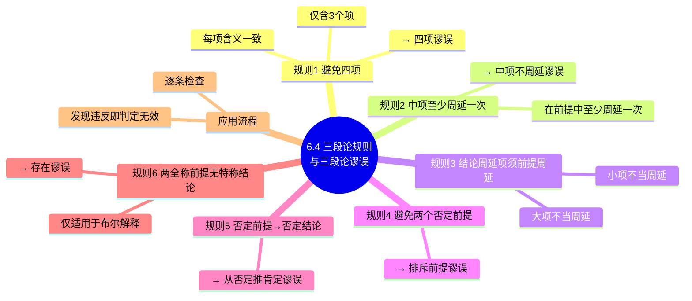

**相关笔记：** [[6.3 检验三段论：文恩图解法]] | [[6.5 直言三段论的15个有效形式]]

> [!abstract] 概览
> 本节系统阐述检验直言三段论有效性的==6条基本规则==，每条规则对应一种特定的三段论谬误。违反其中任何一条规则的三段论都是无效的。这6条规则构成了一个与文恩图检验法等价的判定体系——一个三段论是有效的，当且仅当它不违反任何一条规则。规则涉及项的数量、中项的周延性、结论中周延项在前提中的周延性、否定前提与否定结论的关系，以及布尔解释下全称前提与特称结论的关系。

## 一、知识结构总览

## 二、核心思想与证明技巧

### 2.1 规则总览与应用流程

> [!tip] 检验流程
> 对给定的三段论，按以下流程逐条检查：
> 1. 确认三个项（S、P、M）是否各出现两次且含义一致（规则1）
> 2. 检查中项 M 是否至少在一个前提中周延（规则2）
> 3. 检查结论中周延的项在前提中是否也周延（规则3）
> 4. 检查是否出现两个否定前提（规则4）
> 5. 检查前提否定与结论否定的一致性（规则5）
> 6. 检查是否从两个全称前提推出特称结论（规则6，仅布尔解释）
>
> ==只要违反任何一条规则，即可判定三段论无效，无需继续检查后续规则。==

### 2.2 规则1：避免四项

> [!def] 规则1
> 一个有效的直言三段论必须恰好包含==三个项==——小项（S）、大项（P）和中项（M），且每个项在所有出现处必须保持==相同的含义==。

**谬误名称：** ==四项谬误==（Fallacy of Four Terms）

**经典示例：**

$$
\text{所有狗（动物）是哺乳动物} \\
\text{所有猫（动物）是哺乳动物} \\
\therefore \text{所有猫是狗}
$$

此例中，虽然表面上有三个项，但中项"动物"在两个前提中实际上指代不同的集合（一个是"属于狗类的动物"，一个是"属于猫类的动物"），实质上构成了四个不同的项，因此犯了四项谬误。

> [!tip] 识别要点
> 四项谬误最常见的形式是==词项歧义==（equivocation）——同一个词语在不同语境中含义不同。检查时需注意：中项在两个前提中是否确实指代同一个类？

### 2.3 规则2：中项至少周延一次

> [!def] 规则2
> 在有效的三段论中，==中项（M）至少必须在一个前提中是周延的==。

**谬误名称：** ==中项不周延谬误==（Fallacy of the Undistributed Middle）

> [!info] 周延性回顾
> - **全称肯定（A）命题**："所有 S 是 P"——主项 S 周延，谓项 P 不周延
> - **全称否定（E）命题**："没有 S 是 P"——主项 S 周延，谓项 P 周延
> - **特称肯定（I）命题**："有些 S 是 P"——主项 S 不周延，谓项 P 不周延
> - **特称否定（O）命题**："有些 S 不是 P"——主项 S 不周延，谓项 P 周延
>
> 详见 [[周延性]]

**经典示例：**

$$
\text{所有教授是学者} \quad (\text{A命题，M = 教授，不周延}) \\
\text{所有知识分子是学者} \quad (\text{A命题，M = 学者，不周延}) \\
\therefore \text{所有知识分子是教授}
$$

中项"学者"在两个前提中都是 A 命题的谓项，均不周延。两个前提只是说"教授"和"知识分子"都与"学者"有交集，但并未说明这个交集有多大，因此无法得出"知识分子"与"教授"之间的确定关系。

> [!tip] 直观理解
> 中项不周延谬误就像说"所有北京人是中国人，所有上海人是中国人，所以所有上海人是北京人"——两个类都与第三个类有重叠，但重叠的部分可能完全不同。

### 2.4 规则3：结论中周延的项在前提中必须周延

> [!def] 规则3
> 在有效的三段论中，==任何在结论中周延的项，在前提中也必须是周延的==。

**谬误名称：**
- 当大项 P 在结论中周延但在前提中不周延时，称为==大项不当周延==（Illicit Major），又称"非法大项"
- 当小项 S 在结论中周延但在前提中不周延时，称为==小项不当周延==（Illicit Minor），又称"非法小项"

**大项不当周延的示例：**

$$
\text{所有狗是动物} \quad (\text{A命题，P = 动物，不周延}) \\
\text{没有猫是狗} \quad (\text{E命题}) \\
\therefore \text{没有猫是动物} \quad (\text{E命题，P = 动物，周延})
$$

结论"没有猫是动物"中，大项"动物"是 E 命题的谓项，是周延的。但大前提"所有狗是动物"中，"动物"是 A 命题的谓项，不周延。大项在结论中周延了，但在前提中不周延，违反规则3。

**小项不当周延的示例：**

$$
\text{所有鸟有翅膀} \quad (\text{A命题}) \\
\text{所有鸟是动物} \quad (\text{A命题，S = 鸟，周延}) \\
\therefore \text{所有动物有翅膀} \quad (\text{A命题，S = 动物，周延})
$$

结论"所有动物有翅膀"中，小项"动物"是 A 命题的主项，是周延的。但小前提"所有鸟是动物"中，"动物"是 A 命题的谓项，不周延。小项在结论中周延了，但在前提中不周延，违反规则3。

> [!tip] 记忆口诀
> "结论不能比前提说得多"——如果结论中断言了某个项的全部（周延），那么前提中必须已经对该项的全部做出了断言（周延）。==结论中的信息不能超出前提所提供的范围==。

### 2.5 规则4：避免两个否定前提

> [!def] 规则4
> 在有效的三段论中，==不能两个前提都是否定命题==。

**谬误名称：** ==排斥前提谬误==（Fallacy of Exclusive Premises）

**经典示例：**

$$
\text{没有鱼是哺乳动物} \quad (\text{E命题}) \\
\text{没有鲸是鱼} \quad (\text{E命题}) \\
\therefore \text{所有鲸是哺乳动物}
$$

两个前提都是否定的，只告诉我们"鱼"和"哺乳动物"之间没有交集，以及"鲸"和"鱼"之间没有交集。但"鲸"和"哺乳动物"之间可能完全没有关系——两个否定前提无法建立有效的联系。

> [!info] 理论依据
> 从集合论角度看：两个否定前提分别断言了某些交集为空，但空交集之间的关系无法传递。否定命题的作用是"排斥"（划界），两个排斥无法产生一个肯定的"包含"关系。

### 2.6 规则5：有一前提否定则结论必须否定

> [!def] 规则5
> 在有效的三段论中，如果==有一个前提是否定命题，那么结论也必须是否定命题==。

**谬误名称：** ==从否定推肯定谬误==（Fallacy of Drawing an Affirmative Conclusion from a Negative Premise）

**经典示例：**

$$
\text{没有诗人是会计} \quad (\text{E命题，否定}) \\
\text{有些诗人是艺术家} \quad (\text{I命题，肯定}) \\
\therefore \text{有些艺术家是会计} \quad (\text{I命题，肯定})
$$

大前提是否定的，告诉我们"诗人"和"会计"之间没有交集。但结论却肯定了"艺术家"和"会计"之间有交集。否定前提排除了某些可能性，结论不能在前提所排除的范围之外做出肯定断言。

> [!tip] 对称性理解
> 规则4和规则5是"否定"问题的两面：
> - 规则4：两个否定前提 $\Rightarrow$ 无效（否定太多，无法建立联系）
> - 规则5：一个否定前提 $\Rightarrow$ 结论必须否定（否定具有传递性，不能从否定推出肯定）
>
> 推论：如果结论是否定的，则==恰好有一个前提是否定的==（不能两个都否定——规则4，也不能两个都肯定——否则从肯定推不出否定）。

### 2.7 规则6：两个全称前提得不出特称结论

> [!def] 规则6（布尔解释）
> 在布尔解释下，==两个全称前提不能有效地推出特称结论==。

**谬误名称：** ==存在谬误==（Existential Fallacy）

> [!warning] 重要限定
> 规则6==仅适用于布尔解释==。在亚里士多德的==传统解释==下，全称命题（A、E）蕴涵其主项所指称的类非空（即存在性蕴涵），因此从两个全称前提推出特称结论在某些情况下是有效的。但在布尔解释下，全称命题不具有存在性蕴涵，"所有 S 是 P"并不承诺 S 中有元素存在，因此不能合法地推出"有些 S 是 P"。

**经典示例：**

$$
\text{所有独角兽是神话生物} \quad (\text{A命题}) \\
\text{所有神话生物是虚构的} \quad (\text{A命题}) \\
\therefore \text{有些独角兽是虚构的} \quad (\text{I命题})
$$

在布尔解释下，"所有独角兽是神话生物"并不承诺独角兽存在。如果独角兽不存在，那么"有些独角兽是虚构的"就是假的（因为"有些"蕴涵存在）。因此，从两个全称前提推出特称结论犯了存在谬误。

> [!tip] 布尔解释 vs. 传统解释
> | 特征 | 布尔解释 | 传统（亚里士多德）解释 |
> |:---|:---|:---|
> | A 命题 | 不蕴涵主项存在 | 蕴涵主项存在 |
> | E 命题 | 不蕴涵主项存在 | 蕴涵主项存在 |
> | 规则6 | ==适用== | 不适用 |
> | 有效式数量 | 15个 | 24个（含9个"弱化"式） |
>
> 详见 [[布尔解释]]

### 2.8 六条规则速查表

| 规则 | 内容 | 对应谬误 |
|:---:|:---|:---|
| 1 | 恰好三个项，含义一致 | 四项谬误 |
| 2 | 中项至少在一个前提中周延 | 中项不周延谬误 |
| 3 | 结论中周延的项在前提中也须周延 | 大项/小项不当周延 |
| 4 | 不能两个否定前提 | 排斥前提谬误 |
| 5 | 有否定前提则结论须否定 | 从否定推肯定谬误 |
| 6 | 两全称前提不得特称结论（布尔） | 存在谬误 |

## 三、补充理解与易混淆点

### 补充理解

> [!info] 补充1：六条规则的历史发展
> **来源：** Aristotle, *Prior Analytics*, Book I; Scholastic logicians, 12-14世纪; Copi, I. (1954). *Symbolic Logic*.
>
> 三段论有效性的判定标准经历了漫长的演变。Aristotle在《前分析篇》中主要通过"化归法"（将非第一格有效式化归为第一格）来证明三段论的有效性，并未明确列出"六条规则"。中世纪经院逻辑学家在Aristotle的基础上逐步提炼出规则系统，但现代版本"六条规则"的精确表述主要归功于20世纪的逻辑教科书传统，尤其是Irving Copi的《符号逻辑》（1954）。值得注意的是，==规则6（存在谬误）是唯一一条"现代发明"的规则==——它依赖于布尔解释，而布尔解释直到19世纪才被提出。

> [!info] 补充2：形式谬误vs非形式谬误的哲学区分
> **来源：** Hamblin, C.L. (1970). *Fallacies*. Methuen & Co.
>
> Charles Hamblin在1970年的经典著作《谬误》中对"形式谬误"与"非形式谬误"的区分进行了深入反思。Hamblin指出：三段论谬误（如中项不周延、四项谬误等）是"形式谬误"——它们可以通过检查论证的**形式结构**来识别，无需理解论证的具体内容。而非形式谬误（如诉诸人身、滑坡谬误等）的识别则需要理解论证的**语境和内容**。Hamblin批评了传统谬误理论的简单化倾向，认为谬误分析应该更加细致地考察论证的语用维度。这一批评推动了当代非形式逻辑（informal logic）学科的发展。

> [!info] 规则检验法与文恩图检验法的关系
> 规则检验法和 [[6.3 检验三段论：文恩图解法|文恩图检验法]] 是两种等价的判定方法。一个三段论是有效的，当且仅当它既通过文恩图检验又不违反任何一条规则。两种方法各有优势：
> - **文恩图法**：更直观，能清楚展示无效的原因（如 x 在交界线上）
> - **规则法**：更快捷，适合快速判定，尤其在只需识别违反哪条规则时

> [!warning] 规则3的常见误判
> 规则3只要求"结论中周延的项在前提中必须周延"，==并不要求前提中周延的项在结论中也必须周延==。也就是说，前提可以说得比结论多，但结论不能说得比前提多。这是"信息不膨胀"原则的体现。

> [!warning] 规则5的逆命题不成立
> 规则5说的是"有否定前提 $\Rightarrow$ 结论否定"，但==结论否定 $\nRightarrow$ 有否定前提==。实际上，结论否定时，恰好有一个前提是否定的（由规则4和规则5共同保证）。不能从"结论否定"反推出"前提否定"——方向不可逆。

> [!info] 为什么规则6只在布尔解释下成立？
> 在传统解释下，A 命题"所有 S 是 P"被理解为"存在 S，且所有 S 是 P"。因此，两个全称前提本身就承诺了某些类的非空性，从中推出特称结论是合法的。布尔解释去掉了这个存在性承诺，使得从"所有"到"有些"的推理不再有效。这是现代逻辑与传统逻辑的一个重要分歧点。

### 易混淆点

> [!warning] 误区：规则6适用于所有解释
> ❌ **错误理解：** 规则6（两个全称前提不能推出特称结论）是逻辑的普遍规律，在任何解释下都成立。
> ✅ **正确理解：** 规则6==仅适用于布尔解释==。在亚里士多德的传统解释下，全称命题（A、E）蕴涵其主项所指称的类非空，因此从两个全称前提推出特称结论在某些情况下是有效的（如 AAI-1、EAO-1 等弱化式）。
> **辨析：** 规则6是六条规则中唯一一条依赖于解释立场的规则。其余五条规则在布尔解释和传统解释下都成立。在考试或练习中，除非特别说明，默认采用布尔解释。

> [!warning] 误区：违反规则 = 论证一定错
> ❌ **错误理解：** 如果一个三段论违反了某条规则，那么它的前提和结论都是错误的。
> ✅ **正确理解：** 违反规则意味着三段论==无效==（即前提不能保证结论为真），但前提本身仍然可能为真。无效性是形式上的缺陷，不等于前提内容为假。
> **辨析：** 例如，"所有猫是动物；有些狗是动物；所以有些狗是猫"——前提都是真的，但三段论无效（中项不周延）。违反规则判定的是"推理形式"的缺陷，而非"前提内容"的真假。

---

## 四、习题精选

> [!todo] 习题概览
> | 题号 | 来源 | 核心考点 | 难度 |
> |:-----|:-----|:---------|:-----|
> | 1 | 自编 | 中项不周延识别 | ⭐ |
> | 2 | 自编 | 排斥前提谬误 | ⭐⭐ |
> | 3 | 自编 | 存在谬误识别 | ⭐⭐ |

---

### 题1：中项不周延识别

> [!problem] 题目
> 指出以下三段论违反了哪条规则，犯了什么谬误：
>
> $$\text{所有英雄都是勇敢的}$$
> $$\text{有些士兵是勇敢的}$$
> $$\therefore \text{有些士兵是英雄}$$

> [!faq]- 解答
> **分析：**
> - 中项"勇敢的"在大前提"所有英雄都是勇敢的"中是 A 命题的谓项，==不周延==
> - 中项"勇敢的"在小前提"有些士兵是勇敢的"中是 I 命题的谓项，==不周延==
> - 中项在两个前提中都不周延
>
> **违反规则：** 规则2——中项至少在一个前提中周延
>
> **谬误名称：** ==中项不周延谬误==
>
> **直观解释：** "英雄"和"士兵"都与"勇敢的"有交集，但交集的部分可能完全不同。就像"所有苹果是甜的，有些水果是甜的，所以有些水果是苹果"——显然不成立。
>
> $\blacksquare$

---

### 题2：排斥前提谬误

> [!problem] 题目
> 指出以下三段论违反了哪条规则，犯了什么谬误：
>
> $$\text{没有 reptile 是哺乳动物}$$
> $$\text{没有蛇是哺乳动物}$$
> $$\therefore \text{所有蛇是 reptile}$$

> [!faq]- 解答
> **分析：**
> - 大前提"没有 reptile 是哺乳动物"——E 命题，否定
> - 小前提"没有蛇是哺乳动物"——E 命题，否定
> - 两个前提都是否定命题
>
> **违反规则：** 规则4——不能两个前提都是否定命题
>
> **谬误名称：** ==排斥前提谬误==
>
> **直观解释：** 两个否定前提只告诉我们"reptile"和"蛇"都与"哺乳动物"没有交集，但它们彼此之间可能完全没有关系。"reptile"和"蛇"的交集信息无法从这两个否定前提中得出。
>
> $\blacksquare$

---

### 题3：存在谬误识别

> [!problem] 题目
> 指出以下三段论违反了哪条规则，犯了什么谬误（在布尔解释下）：
>
> $$\text{所有 mermaid 是水生生物}$$
> $$\text{所有水生生物是会游泳的}$$
> $$\therefore \text{有些 mermaid 是会游泳的}$$

> [!faq]- 解答
> **分析：**
> - 大前提"所有 mermaid 是水生生物"——A 命题，全称
> - 小前提"所有水生生物是会游泳的"——A 命题，全称
> - 结论"有些 mermaid 是会游泳的"——I 命题，特称
> - 两个全称前提推出特称结论
>
> **违反规则：** 规则6——两个全称前提不能有效地推出特称结论（布尔解释下）
>
> **谬误名称：** ==存在谬误==
>
> **直观解释：** 在布尔解释下，"所有 mermaid 是水生生物"并不承诺 mermaid 真实存在。如果 mermaid 不存在，那么"有些 mermaid 是会游泳的"就是假的（"有些"蕴涵存在性）。因此，从两个不承诺存在性的全称前提中，不能合法地推出承诺存在性的特称结论。
>
> **补充说明：** 在传统（亚里士多德）解释下，A 命题蕴涵主项存在，因此该三段论在传统解释下是有效的（属于 AAA-1 的弱化式 AAI-1）。
>
> $\blacksquare$

> [!tip] 解题思路提示
> 规则检验法：先化为标准形式 → 逐条检查6条规则（项的数量→中项周延→结论周延项→否定前提→否定结论→存在性）→ 第一条违反的规则即为谬误名称。注意规则6仅适用于布尔解释。

## 五、视频学习指南

> [!info] 视频资源
> | 资源 | 链接 | 对应内容 | 备注 |
> |:-----|:-----|:---------|:-----|
> | Wireless Philosophy: Syllogism Rules | [链接](https://www.youtube.com/results?search_query=Wireless+Philosophy+Syllogism+Rules) | 三段论六条规则 | 英文，配合动画讲解 |
> | Brandon Foltz: Categorical Logic | [链接](https://www.youtube.com/results?search_query=Brandon+Foltz+Syllogism+Fallacies) | 三段论谬误识别 | 英文，逐步演示 |

## 六、教材原文

> [!quote] 核心原文摘录
> "一个标准形式的直言三段论是有效的，当且仅当它满足以下所有规则：1. 避免四项……2. 中项至少在一个前提中周延……3. 在结论中周延的项在前提中也必须周延……4. 避免两个否定前提……5. 如果有一个前提是否定的，结论也必须是否定的……6. 如果两个前提都是全称的，结论不能是特称的。"
>
> "规则6仅适用于布尔解释。在亚里士多德解释下，全称命题蕴涵其主项所指称的类非空，因此某些从两个全称前提推出特称结论的三段论是有效的。"

## 参见 Wiki

- [[周延性]]：A、E、I、O 命题中主项和谓项的周延情况
- [[谬误]]：逻辑谬误的分类与辨析
- [[存在谬误]]：从无存在性承诺的前提推出存在性结论的错误
- [[有效性]]：逻辑有效性的定义与判定标准
- [[三段论规则]]：三段论规则的完整概念页
- [[三段论谬误]]：三段论谬误的完整概念页
- [[布尔解释]]：布尔对全称命题无存在性蕴涵的解释立场
- [[6.3 检验三段论：文恩图解法]]：与规则法等价的文恩图检验方法
- [[6.5 直言三段论的15个有效形式]]：满足全部6条规则的15个有效三段论形式

#学习/逻辑学/直言三段论
