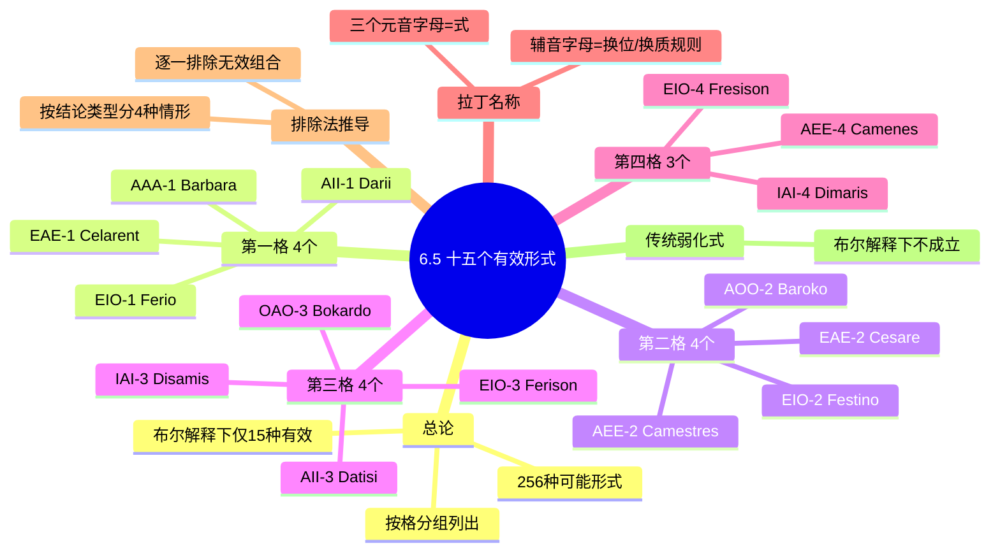

**相关笔记：** [[6.4 三段论规则与三段论谬误]]

> [!abstract] 概览
> 本节是直言三段论的总结性内容。在直言三段论的全部 $4 \times 4 \times 4 \times 4 = 256$ 种可能形式中，==布尔解释下只有 15 种是有效的==。本节将这 15 个有效形式按格分组列出，介绍每个形式的传统拉丁名称及其记忆规则，并概述如何通过排除法系统地推导出这 15 个有效形式。掌握这些有效形式是判定三段论有效性的核心工具。

## 一、知识结构总览

## 二、核心思想与证明技巧

### 2.1 从 256 种可能到 15 种有效形式

直言三段论的形式由以下四个要素决定：

| 要素 | 可选值 | 数量 |
|:-----|:-------|:-----|
| 格（中项位置） | 第 1、2、3、4 格 | 4 |
| 大前提的类型 | A、E、I、O | 4 |
| 小前提的类型 | A、E、I、O | 4 |
| 结论的类型 | A、E、I、O | 4 |

因此，总共有 $4 \times 4 \times 4 \times 4 = 256$ 种可能的三段论形式。通过 [[6.4 三段论规则与三段论谬误]] 中建立的五条规则进行筛选，==布尔解释下只有 15 种形式能通过全部检验==。

> [!tip] 核心认识
> 这 15 个有效形式是直言三段论的"合法清单"。判定一个三段论是否有效，最直接的方法就是检查它是否属于这 15 个形式之一。如果不在其中，则一定是无效的。

### 2.2 十五个有效形式总表

#### 第一格（中项是大前提的主项、小前提的谓项）

第一格被称为"==完美格=="（perfect figure），因为其有效式最直观地体现了从一般到特殊的推理结构，且其他格的有效式均可通过换位、换质等直接推论化归为第一格。

| 形式 | 拉丁名称 | 大前提 | 小前提 | 结论 | 示例 |
|:----:|:--------:|:------:|:------:|:----:|:-----|
| AAA-1 | **Barbara** | 所有 M 是 P | 所有 S 是 M | 所有 S 是 P | 所有动物都是有生命的；所有狗都是动物；所以所有狗都是有生命的 |
| EAE-1 | **Celarent** | 没有 M 是 P | 所有 S 是 M | 没有 S 是 P | 没有素食者是肉食者；所有猫是肉食者；所以没有猫是素食者 |
| AII-1 | **Darii** | 所有 M 是 P | 有 S 是 M | 有 S 是 P | 所有教授是学者；有学生是教授；所以有学生是学者 |
| EIO-1 | **Ferio** | 没有 M 是 P | 有 S 是 M | 有 S 不是 P | 没有诚实的人是骗子；有政客是诚实的人；所以有政客不是骗子 |

#### 第二格（中项在两个前提中都是谓项）

第二格的特点是两个前提的谓项相同（都是中项 M），适合用于区分两个类的差异。

| 形式 | 拉丁名称 | 大前提 | 小前提 | 结论 | 示例 |
|:----:|:--------:|:------:|:------:|:----:|:-----|
| AEE-2 | **Camestres** | 所有 P 是 M | 没有 S 是 M | 没有 S 是 P | 所有猫是动物；没有石头是动物；所以没有石头是猫 |
| EAE-2 | **Cesare** | 没有 P 是 M | 所有 S 是 M | 没有 S 是 P | 没有三角形是四边形；所有正方形是四边形；所以没有正方形是三角形 |
| AOO-2 | **Baroko** | 所有 P 是 M | 有 S 不是 M | 有 S 不是 P | 所有诚实的人都是可信的；有政客不是可信的；所以有政客不是诚实的人 |
| EIO-2 | **Festino** | 没有 P 是 M | 有 S 是 M | 有 S 不是 P | 没有英雄是懦夫；有士兵是英雄；所以有士兵不是懦夫 |

#### 第三格（中项在两个前提中都是主项）

第三格的特点是中项在两个前提中都是主项，适合用于通过举例来反驳全称命题。

| 形式 | 拉丁名称 | 大前提 | 小前提 | 结论 | 示例 |
|:----:|:--------:|:------:|:------:|:----:|:-----|
| AII-3 | **Datisi** | 所有 M 是 P | 有 M 是 S | 有 S 是 P | 所有猫是动物；有猫是宠物；所以有宠物是动物 |
| IAI-3 | **Disamis** | 有 M 是 P | 所有 M 是 S | 有 S 是 P | 有学生是运动员；所有学生是人；所以有人是运动员 |
| EIO-3 | **Ferison** | 没有 M 是 P | 有 M 是 S | 有 S 不是 P | 没有猫是狗；有猫是宠物；所以有宠物不是狗 |
| OAO-3 | **Bokardo** | 有 M 不是 P | 所有 M 是 S | 有 S 不是 P | 有学生不是努力的；所有学生是人；所以有人不是努力的 |

#### 第四格（中项是大前提的谓项、小前提的主项）

第四格是最不直观的格，其有效式也最少（仅 3 个）。

| 形式 | 拉丁名称 | 大前提 | 小前提 | 结论 | 示例 |
|:----:|:--------:|:------:|:------:|:----:|:-----|
| AEE-4 | **Camenes** | 所有 P 是 M | 没有 M 是 S | 没有 S 是 P | 所有猫是动物；没有动物是石头；所以没有石头是猫 |
| IAI-4 | **Dimaris** | 有 P 是 M | 所有 M 是 S | 有 S 是 P | 有猫是宠物；所有宠物是被宠爱的；所以有被宠爱的是猫 |
| EIO-4 | **Fresison** | 没有 P 是 M | 有 M 是 S | 有 S 不是 P | 没有狗是猫；有猫是宠物；所以有宠物不是狗 |

### 2.3 拉丁名称的记忆规则

> [!def] 拉丁记忆名
> 每个有效形式都有一个传统的拉丁名称（如 Barbara、Celarent 等）。这些名称并非随意命名，而是遵循严格的编码规则，==名称中的三个元音字母依次代表大前提、小前提和结论的命题类型==。

以 **Barbara** 为例：
- 第 1 个元音 **a** → 大前提是 A 命题
- 第 2 个元音 **a** → 小前提是 A 命题
- 第 3 个元音 **a** → 结论是 A 命题
- 因此 Barbara = AAA-1（第一格的 AAA 式）

以 **Cesare** 为例：
- 第 1 个元音 **e** → 大前提是 E 命题
- 第 2 个元音 **a** → 小前提是 A 命题
- 第 3 个元音 **e** → 结论是 E 命题
- 因此 Cesare = EAE-2（第二格的 EAE 式）

> [!tip] 名称中的辅音字母也有含义
> 拉丁名称中的辅音字母编码了将该形式化归为第一格所需的[[直接推论]]操作：
> - **s**（如 Celarent 中的 s）：该命题需要进行**简单换位**（simple conversion）
> - **p**（如 Datisi 中的 p）：该命题需要进行**偶然换位**（conversion per accidens，即从 A 换位为 I）
> - **m**（如 Disamis 中的 m）：需要**交换前提**的顺序（mutate premises）
> - **c**（如 Camestres 中的 c）：需要通过**反证法**（reductio）来证明
>
> 这些规则在中世纪逻辑学中被广泛使用，帮助学者记忆和推导三段论的有效形式。

### 2.4 排除法推导：为什么恰好是 15 个？

> [!tip] 推导策略
> 证明只有 15 个有效形式的方法是==按结论类型分情形讨论==，然后对每种情形用三段论规则逐一排除无效组合。这种方法确保了证明的完备性——不会遗漏任何有效形式，也不会多出任何无效形式。

#### 情形一：结论为 A 命题

结论为 A 命题"所有 S 是 P"时：
1. 结论是肯定的，所以两个前提都必须是肯定的（规则 4：两个否定前提不能得出结论）
2. 两个前提都只能是 A 或 I
3. 结论中 S 是周延的，所以小前提中 S 必须周延（规则 3：在结论中周延的项在前提中必须周延）
4. S 在小前提中是主项，要使主项周延，小前提必须是全称的（A 或 E），结合步骤 2，小前提必须是 A
5. 结论中 P 不周延，对大前提中 P 的周延性无额外限制
6. 中项 M 至少在一个前提中周延（规则 2：中项至少周延一次）
7. 大前提可以是 A 或 I。如果大前提是 I，则 M 在大前提中不周延（I 命题主项不周延），在小前提 A 中 M 是谓项也不周延——违反规则 2。因此大前提必须是 A
8. 唯一满足所有条件的组合：**AAA-1（Barbara）**

$$\boxed{\text{结论为 A} \implies \text{仅 AAA-1 (Barbara)}}$$

#### 情形二：结论为 E 命题

结论为 E 命题"没有 S 是 P"时：
1. 结论是否定的，所以恰好有一个前提是否定的（规则 4：两个肯定前提不能得出否定结论，且两个否定前提不能得出结论）
2. 结论中 S 和 P 都周延，所以 S 和 P 在前提中都必须周延
3. S 在小前提中是主项，要使 S 周延，小前提必须是全称的（A 或 E）
4. P 在大前提中是主项（第一、三格）或谓项（第二、四格），需要逐格分析
5. 经过逐格排除，最终得到 4 个有效形式：**AEE-2（Camestres）、AEE-4（Camenes）、EAE-1（Celarent）、EAE-2（Cesare）**

$$\boxed{\text{结论为 E} \implies \text{AEE-2, AEE-4, EAE-1, EAE-2}}$$

#### 情形三：结论为 I 命题

结论为 I 命题"有 S 是 P"时：
1. 结论是肯定的，所以两个前提都必须是肯定的
2. 两个前提都只能是 A 或 I
3. 结论中 S 和 P 都不周延，对前提中 S 和 P 的周延性无额外限制
4. 中项 M 至少在一个前提中周延
5. 经过逐格排除，最终得到 4 个有效形式：**AII-1（Darii）、AII-3（Datisi）、IAI-3（Disamis）、IAI-4（Dimaris）**

$$\boxed{\text{结论为 I} \implies \text{AII-1, AII-3, IAI-3, IAI-4}}$$

#### 情形四：结论为 O 命题

结论为 O 命题"有 S 不是 P"时：
1. 结论是否定的，所以恰好有一个前提是否定的
2. 结论中 P 周延，所以 P 在前提中必须周延
3. 结论中 S 不周延，对前提中 S 的周延性无额外限制
4. 中项 M 至少在一个前提中周延
5. 经过逐格排除，最终得到 6 个有效形式：**AOO-2（Baroko）、EIO-1（Ferio）、EIO-2（Festino）、EIO-3（Ferison）、EIO-4（Fresison）、OAO-3（Bokardo）**

$$\boxed{\text{结论为 O} \implies \text{AOO-2, EIO-1, EIO-2, EIO-3, EIO-4, OAO-3}}$$

#### 汇总

| 结论类型 | 有效形式 | 数量 |
|:--------:|:---------|:----:|
| A | AAA-1 (Barbara) | 1 |
| E | AEE-2, AEE-4, EAE-1, EAE-2 | 4 |
| I | AII-1, AII-3, IAI-3, IAI-4 | 4 |
| O | AOO-2, EIO-1, EIO-2, EIO-3, EIO-4, OAO-3 | 6 |
| **合计** | | **15** |

### 2.5 化归为第一格

> [!tip] 化归方法
> 第一格的四个有效式（Barbara、Celarent、Darii、Ferio）是最基本的。其他格的有效式都可以通过[[直接推论]]中的换位、换质等操作，==化归为第一格的某个有效式==。这一方法在中世纪被称为"化归法"（reduction），是证明非第一格有效式之有效性的经典方法。

例如，**Camestres**（AEE-2）的化归：
1. 原式：所有 P 是 M；没有 S 是 M；所以没有 S 是 P
2. 对大前提"所有 P 是 M"进行简单换位，得到"有 M 是 P"——但这是偶然换位，得到 I 命题
3. 更好的方法：对大前提进行偶然换位得"有 M 是 P"，再结合小前提"没有 S 是 M"——但这不直接对应
4. 标准化归：对大前提"所有 P 是 M"换位得"有 M 是 P"，对小前提"没有 S 是 M"换位得"没有 M 是 S"，然后交换前提顺序，得到"没有 M 是 S；有 M 是 P"，这正是 Ferio（EIO-1）的形式

## 三、补充理解与易混淆点

### 补充理解

> [!info] 补充1：Latin记忆名的中世纪起源
> **来源：** William of Sherwood, *Introductiones in Logicam*, c. 1200 CE; Peter of Spain, *Tractatus*, c. 1230 CE.
>
> 15个有效三段论形式的拉丁记忆名起源于12-13世纪的中世纪大学。William of Sherwood和Peter of Spain是这一记忆系统的主要创建者。中世纪学生通过背诵一首著名的逻辑韵文来记忆这些名称："Barbara, Celarent, Darii, Ferioque prioris; Cesare, Camestres, Festino, Baroco secundae; Tertia Darapti, Disamis, Datisi, Felapton, Bocardo, Ferison habet; Quarta insuper addit Bramantip, Camenes, Dimaris, Fesapo, Fresison."这首韵文涵盖了19个有效式（含传统解释下的4个弱化式），是中世纪逻辑教育的核心内容。

> [!info] 补充2：现代逻辑视角——15个有效形式的一阶逻辑表示
> **来源：** Church, A. (1956). *Introduction to Mathematical Logic*. Princeton University Press.
>
> 在现代一阶逻辑（谓词逻辑）中，15个有效三段论形式可以表示为逻辑上有效的公式（tautologies）。例如，Barbara（AAA-1）可以表示为：$\forall x(M(x) \rightarrow P(x)) \wedge \forall x(S(x) \rightarrow M(x)) \vdash \forall x(S(x) \rightarrow P(x))$。Alonzo Church在《数理逻辑导论》中指出，三段论逻辑是一阶逻辑的一个**片段**（fragment）——它只处理一元谓词（即类的性质），而不涉及关系谓词。这意味着三段论逻辑的表达力有限：它无法处理"所有学生都尊敬某些老师"这样的关系命题。这一局限是19世纪末符号逻辑超越传统三段论逻辑的根本原因之一。

> [!info] 为什么没有第三格和第四格的 A 结论形式？
> 第三格中，结论的主项 S 是小前提的谓项。如果结论是 A 命题，则 S 在结论中周延，因此 S 在小前提中也必须周延。但在第三格中，S 是小前提的谓项，而肯定命题的谓项不周延——这就产生了矛盾。因此第三格不可能有 A 结论的有效式。第四格的论证类似：结论的主项 S 是小前提的谓项，同样的周延性冲突排除了 A 结论的可能。

> [!info] EIO 形式为何在四个格中都有效？
> EIO 是唯一在所有四个格中都有效的形式（Ferio、Festino、Ferison、Fresison）。这是因为 EIO 的结构天然满足大部分三段论规则：
> - E 前提提供了两个周延项（主项和谓项），足以保证中项周延和结论中周延项在前提中的周延
> - I 前提虽然不提供额外的周延信息，但也不违反任何规则
> - O 结论是否定的，恰好与 E 前提的否定性质匹配
> - 这种"一个否定前提 + 一个特称前提"的组合在四个格中都能找到合法的词项排列

> [!warning] 传统解释下的"弱化式"在布尔解释下不成立
> 在[[传统对当方阵]]的解释下，A 命题蕴涵 I 命题、E 命题蕴涵 O 命题（差等关系）。因此，传统逻辑学认为从 AAA-1（Barbara）可以推出 AAI-1（Barbari），从 EAE-1（Celarent）可以推出 EAO-1（Celaront），等等。这些被称为"弱化式"（weakened forms），共有 5 个：
> - AAI-1 (Barbari)、EAO-1 (Celaront)
> - AEO-2 (Camestrop)、EAO-2 (Cesaro)
> - AEO-4 (Camenop)
>
> 但在[[布尔解释]]下，A 命题不再蕴涵 I 命题（因为 A 命题不预设主项类的存在），因此这些弱化式==在布尔解释下是无效的==。本节所列的 15 个有效形式严格遵循布尔解释，不包含任何弱化式。

> [!warning] 不要混淆"形式有效"与"内容为真"
> 一个三段论属于 15 个有效形式之一，只说明它的==推理形式是有效的==（即如果前提为真，结论必然为真），并不保证其前提或结论实际上为真。例如：
> - "所有会飞的都是鸟；所有蝙蝠都会飞；所以所有蝙蝠都是鸟"——这是 AAA-1（Barbara），形式有效，但大前提"所有会飞的都是鸟"为假，因此结论也不可靠。

### 易混淆点

> [!warning] 误区：15个有效形式在所有解释下都有效
> ❌ **错误理解：** 15个有效形式是逻辑的绝对真理，在任何解释体系下都成立。
> ✅ **正确理解：** 这15个有效形式是==布尔解释下的结论==。在亚里士多德的传统解释下，全称命题蕴涵存在性，因此还有额外的9个"弱化式"（如 AAI-1 Barbari、EAO-1 Celaront 等）也被认为是有效的，总共24个有效式。
> **辨析：** 布尔解释 vs. 传统解释的根本分歧在于全称命题是否蕴涵存在性。现代逻辑学普遍采用布尔解释，因此标准教材列出15个有效形式。但在学习传统逻辑或阅读古典文献时，需注意这一差异。

> [!warning] 误区：记住所有拉丁名就够了
> ❌ **错误理解：** 只要背下 Barbara、Celarent、Darii、Ferio 等15个拉丁名，就能完全掌握三段论的有效性判定。
> ✅ **正确理解：** 拉丁名只是助记工具，==理解化归原理和排除法推导过程比记忆名称更重要==。拉丁名中的元音字母编码了式，辅音字母编码了化归操作——理解这些编码规则才能灵活运用，而非机械背诵。
> **辨析：** 拉丁名的价值在于：(1) 快速识别式（如看到 Barbara 就知道是 AAA-1）；(2) 理解化归路径（如 s 表示简单换位）。但判定有效性的根本方法是化为标准形式后查表或用规则检验，而非依赖记忆名称。

---

## 四、习题精选

> [!todo] 习题概览
> | 题号 | 来源 | 核心考点 | 难度 |
> |:-----|:-----|:---------|:-----|
> | 1 | 自编 | 识别有效形式名称 | ⭐⭐ |
> | 2 | 自编 | 判断三段论有效性 | ⭐⭐ |
> | 3 | 自编 | 排除法推导 | ⭐⭐⭐ |

---

### 题1：识别有效形式名称

> [!problem] 题目
> 判断以下三段论属于哪个有效形式，并写出其拉丁名称和编号（如 AAA-1 Barbara）：
>
> (a) 所有科学家都是理性的人；有哲学家是科学家；所以有哲学家是理性的人。
> (b) 没有诚实的人是骗子；所有政客都是诚实的人；所以没有政客是骗子。
> (c) 所有鸟都是动物；没有石头是动物；所以没有石头是鸟。
> (d) 有学生不是努力的；所有学生都是人；所以有人不是努力的。

> [!faq]- 解答
> **(a)** 分析结构：
> - 大前提：所有科学家（M）都是理性的人（P）→ A 命题
> - 小前提：有哲学家（S）是科学家（M）→ I 命题
> - 结论：有哲学家（S）是理性的人（P）→ I 命题
> - 中项"科学家"在大前提中是主项，在小前提中是谓项 → **第一格**
> - 形式：**AII-1（Darii）**
>
> **(b)** 分析结构：
> - 大前提：没有诚实的人（P）是骗子（M）→ E 命题
> - 小前提：所有政客（S）都是诚实的人（P）→ A 命题
> - 结论：没有政客（S）是骗子（M）→ E 命题
> - 中项"骗子"在大前提中是谓项，在小前提中是谓项 → **第二格**
> - 形式：**EAE-2（Cesare）**
>
> **(c)** 分析结构：
> - 大前提：所有鸟（P）都是动物（M）→ A 命题
> - 小前提：没有石头（S）是动物（M）→ E 命题
> - 结论：没有石头（S）是鸟（P）→ E 命题
> - 中项"动物"在大前提中是谓项，在小前提中是谓项 → **第二格**
> - 形式：**AEE-2（Camestres）**
>
> **(d)** 分析结构：
> - 大前提：有学生（M）不是努力的（P）→ O 命题
> - 小前提：所有学生（M）都是人（S）→ A 命题
> - 结论：有人（S）不是努力的（P）→ O 命题
> - 中项"学生"在大前提中是主项，在小前提中是主项 → **第三格**
> - 形式：**OAO-3（Bokardo）**
>
> $\blacksquare$

---

### 题2：判断三段论有效性

> [!problem] 题目
> 判断以下三段论是否有效（即是否属于 15 个有效形式之一）。如果无效，指出它违反了哪条三段论规则。
>
> (a) 所有哲学家都是思想家；所有思想家都是学者；所以所有学者都是哲学家。
> (b) 没有猫是狗；没有狗是猫；所以没有猫是猫。
> (c) 有诗人是画家；有画家是音乐家；所以有诗人是音乐家。

> [!faq]- 解答
> **(a)** 分析结构：
> - 大前提：所有哲学家（M）都是思想家（P）→ A 命题
> - 小前提：所有思想家（M）都是学者（S）→ A 命题
> - 结论：所有学者（S）都是哲学家（M）→ A 命题
> - 中项"哲学家"在大前提中是主项，在小前提中是结论的谓项——这里需要重新标注
> - 重新标注：大前提"所有哲学家（P）都是思想家（M）"，小前提"所有思想家（M）都是学者（S）"，结论"所有学者（S）都是哲学家（P）"
> - 中项 M 在大前提中是谓项，在小前提中是主项 → **第四格**
> - 形式：**AAA-4**
> - 检查 15 个有效形式：AAA-4 不在其中 → **无效**
> - 违反规则：结论中 P（哲学家）周延，但在大前提 A 命题中 P 是主项——等等，重新分析。大前提"所有 P 是 M"中 P 周延。实际上 AAA-4 的问题是：结论中 S（学者）周延，但 S 在小前提"所有 M 是 S"中是谓项，A 命题的谓项不周延 → ==违反规则 3（结论中周延的项在前提中必须周延）==，即"大项不当周延"（illicit major 的对称情况，此处为小项不当周延）。
>
> **(b)** 分析结构：
> - 大前提：没有猫（P）是狗（M）→ E 命题
> - 小前提：没有狗（M）是猫（S）→ E 命题（注：此处的"猫"与结论中的"猫"是同一词项）
> - 结论：没有猫（S）是猫（P）→ E 命题
> - 两个前提都是否定的 → ==违反规则 4（两个否定前提不能得出有效结论）==
> - 形式：EEE-1，不在 15 个有效形式中 → **无效**
>
> **(c)** 分析结构：
> - 大前提：有诗人（M）是画家（P）→ I 命题
> - 小前提：有画家（M）是音乐家（S）→ I 命题
> - 结论：有诗人（S）是音乐家（P）→ I 命题
> - 中项"画家"在大前提中是谓项，在小前提中是主项 → **第四格**
> - 形式：III-4
> - 检查：中项 M 在两个前提中都不周延（I 命题的主项和谓项都不周延）→ ==违反规则 2（中项至少在一个前提中周延）==
> - III-4 不在 15 个有效形式中 → **无效**
>
> $\blacksquare$

---

### 题3：排除法推导

> [!problem] 题目
> 运用排除法，证明在第三格中，结论为 A 命题时不存在任何有效形式。

> [!faq]- 解答
> **目标**：证明第三格中不存在结论为 A 的有效形式。
>
> **[步骤1]** 列出第三格的结构：
> - 大前提：M — P（中项 M 是主项）
> - 小前提：M — S（中项 M 是主项）
> - 结论：S — P
>
> **[步骤2]** 结论为 A 命题"所有 S 是 P"：
> - 结论是肯定的 → 两个前提都必须是肯定的（规则 4）
> - 所以大前提和小前提只能是 A 或 I
>
> **[步骤3]** 检查结论中周延项在前提中的周延性：
> - 结论 A 命题中，S（主项）是周延的
> - 规则 3：S 在前提中必须周延
> - 在第三格中，S 是小前提的谓项
> - 要使谓项周延，小前提必须是否定命题（E 或 O）
> - 但步骤 2 已确定小前提只能是 A 或 I（肯定命题），其谓项不周延
> - ==矛盾！==
>
> **[步骤4]** 结论：在第三格中，结论为 A 命题时，S 在结论中周延但在前提中无法周延，必然违反规则 3。因此第三格中不存在结论为 A 的有效形式。
>
> $\blacksquare$

> [!tip] 解题思路提示
> 判定三段论有效性的快捷方法：先化为标准形式 → 确定式和格 → 查15个有效形式表 → 如果在表中则有效，否则无效。如果需要说明无效原因，用六条规则逐条检验，第一条违反的规则即为谬误名称。

## 五、视频学习指南

> [!info] 视频资源
> | 资源 | 链接 | 对应内容 | 备注 |
> |:-----|:-----|:---------|:-----|
> | Michael Genesereth: Introduction to Logic | [链接](https://www.youtube.com/results?search_query=Michael+Genesereth+Categorical+Syllogisms) | 有效形式的系统推导 | Stanford 课程 |
> | Kevin deLaplante: Critical Thinking Academy | [链接](https://www.youtube.com/results?search_query=Kevin+deLaplante+Valid+Categorical+Syllogisms) | 15个有效形式的文氏图验证 | 英文，适合入门 |
> | Marilee Hughes: Valid Categorical Syllogisms | [链接](https://www.youtube.com/results?search_query=Marilee+Hughes+Valid+Categorical+Syllogisms) | 逐格演示排除法推导 | 英文，逐步演示 |

## 六、教材原文

> [!quote] Copi, Cohen & McMahon, *Introduction to Logic* (15th ed.), Ch. 6.5
> "Of the 256 possible syllogistic forms, only 15 are valid under the Boolean interpretation. These fifteen valid forms are distributed among the four figures as follows: four in the first figure, four in the second, four in the third, and three in the fourth."
>
> "The traditional mnemonic names for the valid syllogisms encode the form of each syllogism: the first three vowels indicate the types of the major premise, minor premise, and conclusion respectively."
>
> "Under the traditional interpretation, there are additional syllogisms that are valid — the so-called weakened syllogisms — but these are not accepted under the Boolean interpretation because they depend on the existential import of universal propositions."

## 参见 Wiki

- [[直言命题]]：三段论由直言命题组成，理解 A、E、I、O 四种命题是学习三段论的基础
- [[周延性]]：周延性规则是排除法推导的核心依据，也是判定三段论有效性的关键概念
- [[传统对当方阵]]：传统解释下 A 蕴涵 I、E 蕴涵 O 的差等关系，是理解"弱化式"的前提
- [[直接推论]]：换位、换质等直接推论操作是将非第一格有效式化归为第一格的工具
- [[直言三段论的15个有效形式]]：15个有效形式的完整概念页
- [[布尔解释]]：布尔解释不预设全称命题的主项存在，因此排除了传统解释下的弱化式
- [[有效性]]：三段论的有效性是指形式上的保真性——如果前提为真，结论必然为真

#学习/逻辑学/直言三段论
