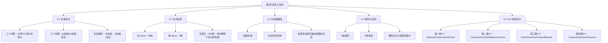

# 第06章 直言三段论 — 章节汇总

---

## 一、全章知识框架

---

## 二、核心知识点汇总

### 6.1 标准形式

> [!def] 直言三段论
> ==直言三段论==是一种演绎论证，由==恰好三个直言命题==组成，恰好包含==三个词项==，每个词项恰好出现两次。

| 词项 | 符号 | 定义 | 识别方法 |
|:-----|:----:|:-----|:---------|
| ==大项== | $P$ | 结论的谓项 | 结论的谓项即大项 |
| ==小项== | $S$ | 结论的主项 | 结论的主项即小项 |
| ==中项== | $M$ | 只在两个前提中出现 | 前提中既非$S$也非$P$的词项 |

> [!tip] 标准形式四步法
> 1. 找出结论（标志词：所以、因此）
> 2. 确定大项$P$（结论谓项）和小项$S$（结论主项）
> 3. 找出大前提（含$P$）和小前提（含$S$）
> 4. 按"大前提→小前提→结论"排列

### 6.2 形式性质

> [!def] 式与格
> ==式==（mood）：三个命题的 A/E/I/O 类型按顺序排列的字母序列（如 AAA、EAE）。==格==（figure）：中项$M$在两个前提中的位置排列方式。

| 格 | 大前提中$M$ | 小前提中$M$ | 模式 | 口诀 |
|:--:|:-----------:|:-----------:|:----:|:----:|
| 第一格 | 主项 | 谓项 | $M—P,\; S—M$ | 主—谓 |
| 第二格 | 谓项 | 谓项 | $P—M,\; S—M$ | 谓—谓 |
| 第三格 | 主项 | 主项 | $M—P,\; M—S$ | 主—主 |
| 第四格 | 谓项 | 主项 | $P—M,\; M—S$ | 谓—主 |

> [!info] 形式总数
> $4$（式）$\times 4$（格）$= 64$ 种式，$64 \times 4 = 256$ 种可能形式。布尔解释下仅 ==15 种==有效。

### 6.3 文恩图解法

> [!def] 三圆文恩图
> 由 $S$、$P$、$M$ 三个交叉圆构成，形成 ==$2^3 = 8$ 个区域==，每个区域对应一种关于三个类的组合情况。

> [!tip] 文恩图检验四步法
> 1. **标记三圆**：分别标记为 $S$（小项）、$P$（大项）、$M$（中项）
> 2. **图示前提**：==先全称后特称==——全称命题涂阴影消除区域，特称命题在区域中放 $x$
> 3. **处理$x$位置**：若$x$可放在多个区域且无法确定，放在==交界线==上
> 4. **检查结论**：若结论所要求的信息已完全呈现在图中→==有效==；否则→==无效==

### 6.4 规则与谬误

| 规则 | 内容 | 对应谬误 |
|:----:|:-----|:---------|
| 1 | 恰好三个项，含义一致 | ==四项谬误== |
| 2 | 中项至少在一个前提中周延 | ==中项不周延谬误== |
| 3 | 结论中周延的项在前提中也须周延 | ==大项不当周延== / ==小项不当周延== |
| 4 | 不能两个否定前提 | ==排斥前提谬误== |
| 5 | 有否定前提则结论须否定 | ==从否定推肯定谬误== |
| 6 | 两全称前提不得特称结论（布尔） | ==存在谬误== |

> [!warning] 规则6仅适用于布尔解释
> 在亚里士多德传统解释下，全称命题蕴涵主项存在，因此某些从两个全称前提推出特称结论的三段论（如 AAI-1、EAO-1 等"弱化式"）被认为是有效的。布尔解释下这些弱化式均无效。

### 6.5 15个有效形式

| 格 | 形式 | 拉丁名称 | 结论类型 |
|:--:|:----:|:--------:|:--------:|
| 第一格 | AAA-1 | **Barbara** | A（全称肯定） |
| 第一格 | EAE-1 | **Celarent** | E（全称否定） |
| 第一格 | AII-1 | **Darii** | I（特称肯定） |
| 第一格 | EIO-1 | **Ferio** | O（特称否定） |
| 第二格 | AEE-2 | **Camestres** | E（全称否定） |
| 第二格 | EAE-2 | **Cesare** | E（全称否定） |
| 第二格 | AOO-2 | **Baroko** | O（特称否定） |
| 第二格 | EIO-2 | **Festino** | O（特称否定） |
| 第三格 | AII-3 | **Datisi** | I（特称肯定） |
| 第三格 | IAI-3 | **Disamis** | I（特称肯定） |
| 第三格 | EIO-3 | **Ferison** | O（特称否定） |
| 第三格 | OAO-3 | **Bokardo** | O（特称否定） |
| 第四格 | AEE-4 | **Camenes** | E（全称否定） |
| 第四格 | IAI-4 | **Dimaris** | I（特称肯定） |
| 第四格 | EIO-4 | **Fresison** | O（特称否定） |

> [!tip] 按结论类型分布
> - A 结论：仅 ==AAA-1==（1个）
> - E 结论：==EAE-1、EAE-2、AEE-2、AEE-4==（4个）
> - I 结论：==AII-1、AII-3、IAI-3、IAI-4==（4个）
> - O 结论：==EIO-1、EIO-2、EIO-3、EIO-4、AOO-2、OAO-3==（6个）
>
> 其中 ==EIO== 是唯一在四个格中都有效的形式。

---

## 三、学习脉络

> [!info] 学习脉络
> 本章的学习路径是从"定义标准形式"到"掌握有效性判定工具"，层层递进：
>
> 1. **标准形式**（6.1）：定义直言三段论的结构——三个词项（$P$/$S$/$M$）、三个命题（大前提/小前提/结论）、标准排列顺序。这是后续一切分析的基础。
> 2. **形式性质**（6.2）：引入式（mood）和格（figure）两个形式特征，建立"256种可能形式"的系统框架，确立"形式决定有效性"的核心原则。
> 3. **文恩图检验**（6.3）：将第5章的两圆文恩图扩展为三圆文恩图，通过图示前提并检查结论是否被包含来判定有效性——直观、系统的判定方法。
> 4. **规则检验**（6.4）：建立6条规则与6种谬误的判定体系，与文恩图法等价但更快捷——逐条检查，违反任何一条即无效。
> 5. **有效形式总表**（6.5）：汇总布尔解释下的15个有效形式，按格分组并给出拉丁名称，提供"查表即判"的最终工具。
>
> **学习建议**：本章是第5章直言命题知识的直接应用。建议重点掌握：(1) 标准形式化四步法；(2) 式与格的确定方法；(3) 文恩图"先全称后特称"的图示顺序；(4) 6条规则及其对应谬误；(5) 15个有效形式的识别。其中周延性（第5章核心概念）贯穿规则2和规则3，是理解规则法的关键。

---

## 四、跨章关联

| 本章概念 | 关联章节 | 关联概念 | 关联类型 | 说明 |
|:---------|:---------|:---------|:---------|:-----|
| 直言三段论 | 第5章 直言命题 | [[A_E_I_O 四种命题]] | 前置依赖 | A/E/I/O 四种直言命题是三段论的基本构件，三段论由三个直言命题组成 |
| 周延性 | 第5章 直言命题 | [[周延性]] | 核心前置 | 周延性规则是三段论有效性规则（规则2：中项至少周延一次；规则3：结论周延项须前提周延）的核心概念 |
| 文恩图 | 第5章 直言命题 | [[文恩图]] | 工具扩展 | 第5章的两圆文恩图扩展为三圆文恩图，用于检验三段论有效性 |
| 存在谬误 | 第4章 谬误 + 第5章 直言命题 | [[存在谬误]]、[[布尔解释]] | 深化关系 | 三段论规则6（存在谬误）是第5章布尔解释的直接应用；存在谬误本身属于第4章非形式谬误中的预设性谬误 |
| 四项谬误 | 第4章 谬误 | [[谬误]] | 具体实例 | 四项谬误是第4章含混谬误中歧义谬误的一种形式——同一语词在不同前提中含义不同 |
| 形式谬误 | 第4章 谬误 | [[形式谬误-vs-非形式谬误]] | 对比关系 | 三段论的6种谬误（中项不周延、大项不当周延等）属于形式谬误，与第4章讨论的非形式谬误形成对比 |
| 直接推论 | 第5章 直言命题 | [[直接推论]] | 工具关系 | 换位、换质等直接推论是将非第一格有效式化归为第一格的工具 |

---

## 五、全章总复习题

> [!problem] 综合题1：三段论的完整分析
> 给定以下论证：
>
> "所有科学家都是理性的人，因为所有物理学家都是科学家，而所有物理学家都是理性的人。"
>
> 请完成以下操作：
> 1. 将其化为标准形式，指出大项、小项、中项
> 2. 确定其式和格
> 3. 用文恩图检验其有效性（描述图示过程）
> 4. 用6条规则检验其有效性
> 5. 判断其是否为15个有效形式之一，若是指出拉丁名称

> [!faq]- 参考答案
> **[步骤1] 标准形式化**
>
> 标志词"因为"之前为结论："所有科学家都是理性的人。"
> - 小项 $S$ = 科学家（结论主项）
> - 大项 $P$ = 理性的人（结论谓项）
> - "所有物理学家都是科学家"含 $S$ → 小前提
> - "所有物理学家都是理性的人"含 $P$ → 大前提
> - 中项 $M$ = 物理学家
>
> 标准形式：
> > 所有物理学家（$M$）都是理性的人（$P$）。——大前提（A）
> > 所有物理学家（$M$）都是科学家（$S$）。——小前提（A）
> > 所以，所有科学家（$S$）都是理性的人（$P$）。——结论（A）
>
> **[步骤2] 确定式和格**
> - 式：A、A、A → ==AAA==
> - 格：中项 $M$ 在大前提中做主项，在小前提中也做主项 → ==第三格==
> - 完整形式：==AAA-3==
>
> **[步骤3] 文恩图检验**
> 1. 画三圆 $S$、$P$、$M$。
> 2. 图示"所有 $M$ 是 $P$"（全称，先图示）：将 $M$ 圆中不属于 $P$ 的部分（区域④ = $\bar{S}\bar{P}M$）涂阴影。
> 3. 图示"所有 $M$ 是 $S$"（全称）：将 $M$ 圆中不属于 $S$ 的部分（区域④ = $\bar{S}\bar{P}M$ 和区域⑥ = $\bar{S}PM$）涂阴影。注意区域④已被涂掉，新增涂阴影的是区域⑥。
> 4. 检查结论"所有 $S$ 是 $P$"：$S$ 圆中未涂阴影的区域包括区域①（$SPM$）和区域②（$SP\bar{M}$）。区域②属于 $S$ 但不属于 $P$，这意味着存在某些 $S$ 不是 $P$，与结论矛盾。
>
> 判定结果：==AAA-3 无效==。
>
> **[步骤4] 规则检验**
> - 规则1：三个项，含义一致 ✓
> - 规则2：中项 $M$ 在大前提"A命题"中做主项→周延 ✓
> - 规则3：结论A命题中 $S$ 周延，但 $S$ 在小前提"A命题"中做谓项→==不周延== ✗
>
> 违反规则3：==小项不当周延==（Illicit Minor）。结论中断言了 $S$ 的全部（所有科学家），但小前提只断言了 $M$ 的全部属于 $S$，并未断言 $S$ 的全部。
>
> **[步骤5] 判断是否为15个有效形式**
> AAA-3 不在15个有效形式之表中。第三格的4个有效形式为 AII-3（Datisi）、IAI-3（Disamis）、EIO-3（Ferison）、OAO-3（Bokardo），不包含 AAA-3。
>
> $\blacksquare$

> [!problem] 综合题2：无效三段论的规则分析
> 给定以下三段论形式：
>
> > 所有 $P$ 是 $M$。
> > 所有 $S$ 是 $M$。
> > 所以，所有 $S$ 是 $P$。
>
> 请完成以下操作：
> 1. 指出其式和格
> 2. 用6条规则逐条检验，指出违反的规则
> 3. 命名对应的谬误
> 4. 构造一个反例（前提真、结论假的具体实例）证明其无效

> [!faq]- 参考答案
> **[步骤1] 式和格**
> - 大前提"所有 $P$ 是 $M$"→ A 命题
> - 小前提"所有 $S$ 是 $M$"→ A 命题
> - 结论"所有 $S$ 是 $P$"→ A 命题
> - 式 = ==AAA==
> - 中项 $M$ 在大前提中做谓项，在小前提中也做谓项 → ==第二格==
> - 完整形式：==AAA-2==
>
> **[步骤2] 规则检验**
> - 规则1：三个项，含义一致 ✓
> - 规则2：中项 $M$ 在大前提"A命题"中做谓项→不周延；在小前提"A命题"中做谓项→不周延。==中项在两个前提中都不周延== ✗
> - （已发现违反，无需继续检查）
>
> **[步骤3] 谬误名称**
> 违反规则2，对应谬误：==中项不周延谬误==（Fallacy of the Undistributed Middle）。
>
> **[步骤4] 反例**
> > 所有猫（$P$）都是动物（$M$）。（A，真）
> > 所有狗（$S$）都是动物（$M$）。（A，真）
> > 所以，所有狗（$S$）都是猫（$P$）。（A，假）
>
> 前提真但结论假 → AAA-2 无效。中项"动物"在两个前提中都不周延（A命题的谓项不周延），"猫"和"狗"都与"动物"有交集，但交集部分可能完全不同。
>
> $\blacksquare$

---

## 六、各节笔记索引

| 节号 | 标题 | 笔记链接 | 核心内容 |
|:-----|:-----|:---------|:---------|
| 6.1 | 直言三段论的标准形式 | [[6.1 直言三段论的标准形式]] | 三段论定义、三个词项（P/S/M）、三个命题、标准形式化四步法 |
| 6.2 | 三段论论证的形式性质 | [[6.2 三段论论证的形式性质]] | 式（64种）、格（4种）、256种可能形式、形式决定有效性原则 |
| 6.3 | 检验三段论：文恩图解法 | [[6.3 检验三段论：文恩图解法]] | 三圆8区域、先全称后特称、交界线规则、有效性判定标准 |
| 6.4 | 三段论规则与三段论谬误 | [[6.4 三段论规则与三段论谬误]] | 6条规则、6种谬误、规则法与文恩图法等价 |
| 6.5 | 直言三段论的15个有效形式 | [[6.5 直言三段论的15个有效形式]] | 15个有效形式总表、拉丁名称、排除法推导、化归为第一格 |

#学习/逻辑学/第06章/章节汇总
