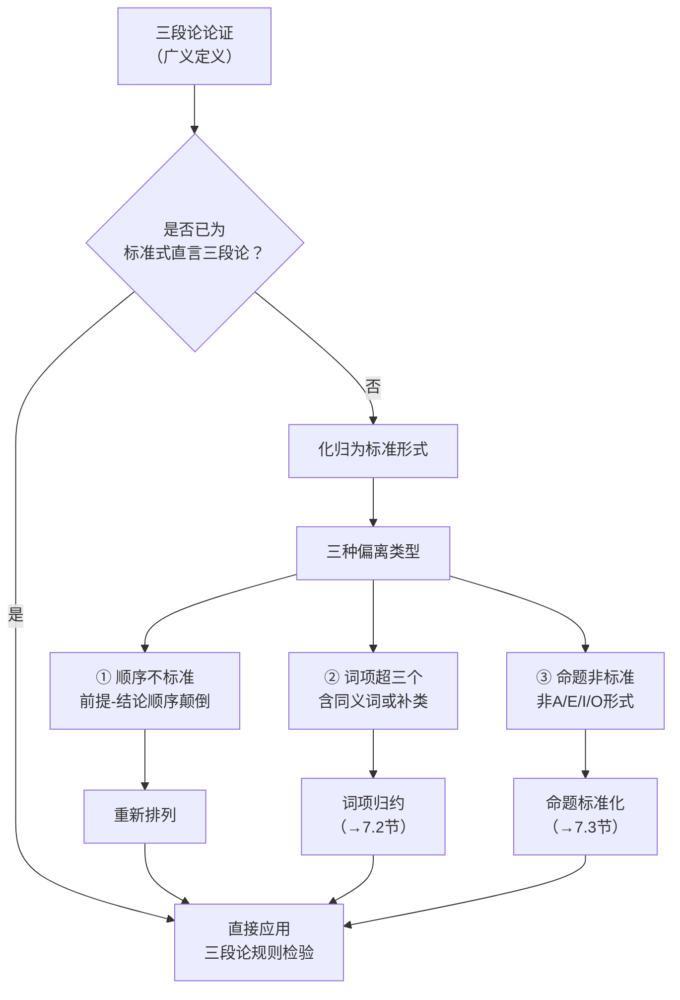

**相关笔记：** [[6.5 直言三段论的15个有效形式]] | [[7.2 词项数量归约为三]]

> [!abstract] 概览
> 本节界定"三段论论证"的广义定义——任何==符合直言三段论条件==或==可变形为标准式直言三段论==的论证。核心任务是阐明为何日常语言中的论证需要化归为标准形式，以及化归过程中常见的三种偏离类型：前提-结论顺序不标准、词项数量超过三个、命题形式非标准。通过系统化归，我们可以运用三段论规则和文氏图方法检验日常论证的有效性。

## 一、知识结构总览

## 二、核心思想与证明技巧

> [!tip] 三段论论证的广义界定
> **三段论论证**（syllogistic argument）是指满足以下条件之一的演绎论证：
> 1. **直接符合条件**：恰好包含两个前提和一个结论，且 altogether 恰好包含三个词项（大项、小项、中项），每个词项恰好出现两次，所有命题都是标准式直言命题（A、E、I、O）——即标准式直言三段论。
> 2. **可变形为标准形式**：虽然不完全符合上述条件，但通过一系列==有保证的变形操作==（如词项归约、命题标准化、顺序重排）可以转化为标准式直言三段论，且变形过程中不改变论证的逻辑效力。

> [!tip] 化归为标准形式的必要性
> 日常语言中的论证极少以标准式直言三段论的完美形态出现。化归的必要性体现在：
> - **检验有效性**：只有标准形式才能直接运用三段论的六条规则或文氏图方法进行有效性判定。
> - **揭示逻辑结构**：化归过程剥离语言表层差异，暴露论证的底层逻辑骨架。
> - **统一评判标准**：为不同表述的同一论证提供统一的评判框架。

> [!tip] 三种偏离类型
> 日常论证偏离标准形式的三种主要方式：
>
> | 偏离类型 | 描述 | 处理方法 |
> |:---|:---|:---|
> | **① 顺序不标准** | 结论出现在前提之前，或前提顺序颠倒 | 重新排列为"大前提—小前提—结论"的标准顺序 |
> | **② 词项超三个** | 使用同义词或补类导致词项数量超过三个 | 词项归约（详见7.2节） |
> | **③ 命题非标准** | 命题不呈现为标准A/E/I/O形式 | 命题标准化（详见7.3节） |

> [!def] 标准式直言三段论
> 一个标准式直言三段论必须同时满足以下条件：
> - 恰好包含两个前提和一个结论
> - 恰好包含三个词项：大项（$P$）、小项（$S$）、中项（$M$）
> - 每个词项恰好出现两次
> - 所有命题都是标准式直言命题（A、E、I、O）
> - 前提按"大前提—小前提"的顺序排列

## 三、补充理解与易混淆点

### 补充理解

> [!info] Aristotle与三段论化归传统
> **来源：** Aristotle. (c. 350 BCE). *Prior Analytics*, Book I.
>
> 三段论化归的思想根源可追溯至Aristotle的《前分析篇》。Aristotle系统地将三段论分为三个格，并展示了第二格和第三格的有效式如何通过==换位法（conversion）==和==归谬法（reductio ad impossibile）==化归为第一格的完美三段论（即Barbara、Celarent、Darii、Ferio）。这一化归传统表明，"将非标准形式转化为标准形式"并非现代逻辑学家的发明，而是自Aristotle以来逻辑学的核心方法论之一。Aristotle的化归程序本质上是一种==有效性保持变换==，确保化归后的三段论与原三段论具有相同的逻辑力量。

> [!info] Kant与三段论检验的易化
> **来源：** Kant, I. (1787). *Critique of Pure Reason*, B版.
>
> Kant在《纯粹理性批判》B版中讨论了三段论的结构，指出自从Aristotle以来，形式逻辑"==已经走上了一条可靠的道路，不再需要后退一步=="。Kant的论断暗示，三段论的有效性检验方法已经足够成熟和系统化，使得我们能够将日常语言中的各种论证化归为标准形式后加以评判。这一观点为现代逻辑学中"先化归、后检验"的两步策略提供了哲学上的正当性基础——只要化归步骤是保有效性的，检验结果就具有权威性。

### 易混淆点

> [!warning] 误区："三段论论证 = 标准式直言三段论"
> ❌ **错误理解：** "三段论论证"和"标准式直言三段论"是完全相同的概念，可以互换使用。
>
> ✅ **正确理解：** "三段论论证"是一个==更宽泛的概念==，它既包括已经符合所有条件的标准式直言三段论，也包括那些可以通过有保证的变形操作化归为标准形式的论证。标准式直言三段论只是三段论论证的一个子集。
>
> **辨析：** 这一区分至关重要。如果将两者等同，就会错误地将大量日常语言中有效的三段论论证排除在检验范围之外。例如，"所有哺乳动物都是温血动物；没有爬行动物是哺乳动物；所以没有爬行动物是温血动物"是一个有效的三段论论证，虽然其词项恰好为三个且命题形式标准，但如果前提顺序颠倒或使用了同义词，它就不是标准式直言三段论，但仍属于三段论论证的范畴。

> [!warning] 误区："化归 = 改变原意"
> ❌ **错误理解：** 将日常论证化归为标准形式的过程会改变论证的原意，因此化归后的论证已经不是原来的论证了。
>
> ✅ **正确理解：** 化归过程中使用的每一种变形操作（如词项归约、命题标准化）都是==有效性保持的==（validity-preserving），即化归前后的论证在有效性上是完全一致的。化归不改变论证的逻辑内容，只是改变其表述形式。
>
> **辨析：** 化归类似于数学中的"等价变形"——正如 $\frac{2}{4}$ 化简为 $\frac{1}{2}$ 并不改变数值，将"没有懒人是勤奋的"标准化为"没有懒人是勤奋的人"也不改变命题的逻辑内容。关键在于确保每一步变形都有逻辑上的保证，而非任意改写。

## 四、习题精选

> [!todo] 习题概览
>
> | 题号 | 来源 | 核心考点 | 难度 |
> |:---:|:---|:---|:---:|
> | 1 | 本节内容 | 识别三段论论证 | ⭐⭐ |
> | 2 | 本节内容 | 化归为标准形式 | ⭐⭐⭐ |
> | 3 | 本节内容 | 判断偏离类型 | ⭐⭐ |

### 题1：识别三段论论证

> [!problem] 题目
> 判断以下论证是否为三段论论证，并说明理由：
>
> "所有英雄都是勇敢的。有些士兵不是英雄。因此，有些勇敢的人不是士兵。"

> [!faq]- 解答
> **分析过程：**
>
> 第一步，识别论证中的命题和词项：
> - 前提1：所有英雄都是勇敢的。（A命题）
> - 前提2：有些士兵不是英雄。（O命题）
> - 结论：有些勇敢的人不是士兵。（O命题）
>
> 第二步，统计词项：
> - 英雄（出现2次）
> - 勇敢的/勇敢的人（同义词，可归约为1个词项，出现2次）
> - 士兵（出现2次）
>
> 第三步，判断：
> - 恰好两个前提和一个结论 ✓
> - 恰好三个词项（归约同义词后）✓
> - 所有命题可化为标准A/E/I/O形式 ✓
>
> **结论：** 该论证==是三段论论证==。虽然"勇敢的"和"勇敢的人"是同义词（存在词项超三个的偏离），但通过词项归约可以化归为标准式直言三段论（EIO-2式：Festino）。
>
> $\blacksquare$

> [!tip] 解题思路提示
> 1. 先统计前提和结论的数量，确认是否恰好为两个前提和一个结论
> 2. 列出所有出现的词项，注意识别同义词
> 3. 检查每个命题是否可以转化为标准A/E/I/O形式
> 4. 如果以上条件都满足或可通过有保证的变形满足，则判定为三段论论证

### 题2：化归为标准形式

> [!problem] 题目
> 将以下论证化归为标准式直言三段论，并指出其式与格：
>
> "所以，没有外交官是间谍。因为所有间谍都是隐蔽的，而外交官都不是隐蔽的人。"

> [!faq]- 解答
> **分析过程：**
>
> 第一步，识别并重排命题顺序：
> - 前提1：所有间谍都是隐蔽的。（A命题）
> - 前提2：外交官都不是隐蔽的人。（E命题）
> - 结论：没有外交官是间谍。（E命题）
>
> 第二步，词项归约：
> - "隐蔽的"与"隐蔽的人"是同义词，统一为"隐蔽的人"
>
> 第三步，确定词项角色：
> - 结论的谓项"间谍" = 大项（$P$）
> - 结论的主项"外交官" = 小项（$S$）
> - 前提中出现但结论中不出现的"隐蔽的人" = 中项（$M$）
>
> 第四步，写出标准形式：
> - 大前提：所有间谍（$P$）都是隐蔽的人（$M$）。——A命题
> - 小前提：没有外交官（$S$）是隐蔽的人（$M$）。——E命题
> - 结论：没有外交官（$S$）是间谍（$P$）。——E命题
>
> **式与格：** AEE-2式（Camestres）
>
> $\blacksquare$

> [!tip] 解题思路提示
> 1. 首先识别结论（通常由"所以""因此"等指示词标记）
> 2. 将剩余命题作为前提，按大前提（含大项）在前、小前提（含小项）在后的顺序排列
> 3. 检查并归约同义词，确保恰好三个词项
> 4. 确定每个命题的A/E/I/O类型，写出式与格

### 题3：判断偏离类型

> [!problem] 题目
> 以下论证在哪些方面偏离了标准式直言三段论的形式？请指出所有偏离类型：
>
> "每个学生都必须通过考试。没有懒人能通过考试。所以，没有懒人是学生。"

> [!faq]- 解答
> **分析过程：**
>
> 逐一检查标准式直言三段论的条件：
>
> 1. **前提-结论数量**：两个前提 + 一个结论 ✓（不偏离）
>
> 2. **词项数量**：
>    - 学生（出现2次）
>    - 必须通过考试 / 能通过考试（表述不同但逻辑等价，可归约）
>    - 懒人（出现2次）
>    - 归约后恰好3个词项 ✓（不偏离）
>
> 3. **命题形式**：
>    - "每个学生都必须通过考试"——量词"每个"等价于"所有"，但动词"必须通过"不是标准的"是"结构 → ==偏离类型③：命题非标准==
>
> 4. **顺序**：前提在前、结论在后 ✓（不偏离）
>
> **结论：** 该论证存在==偏离类型③（命题非标准）==。需要将"每个学生都必须通过考试"标准化为"所有学生都是必须通过考试的人"（A命题），"没有懒人能通过考试"标准化为"没有懒人是能通过考试的人"（E命题）。
>
> $\blacksquare$

> [!tip] 解题思路提示
> 1. 逐一对照标准式直言三段论的每个条件进行检查
> 2. 特别注意量词是否为标准量词（"所有""没有""有些"）
> 3. 注意动词是否为标准的系词"是"
> 4. 不要遗漏任何一种偏离，一个论证可能同时存在多种偏离

## 五、视频学习指南

> [!info] 视频资源
>
> | 资源名称 | 主题 | 建议观看时机 |
> |:---|:---|:---|
> | 三段论论证概述 | 三段论论证的定义与判定 | 学习本节前 |
> | 标准式直言三段论回顾 | 标准形式的六个条件 | 学习本节前 |
> | 日常论证的化归策略 | 三种偏离类型的处理方法 | 学习本节后 |

## 六、教材原文

> [!quote]
> "自从Aristotle以来，形式逻辑没有失去任何一点它所获得的重要地位。" —— Immanuel Kant, *Critique of Pure Reason*, B版
>
> 日常语言中出现的论证极少以标准形式呈现。一个三段论论证是指任何这样的演绎论证：它要么已经是一个标准式直言三段论，要么可以通过化归步骤转化为标准式直言三段论。化归过程使我们能够运用三段论规则来检验日常论证的有效性。

## 参见 Wiki

- [[直言三段论]]
- [[三段论的式与格]]
- [[三段论规则]]

#学习/逻辑学/日常语言中的论证
