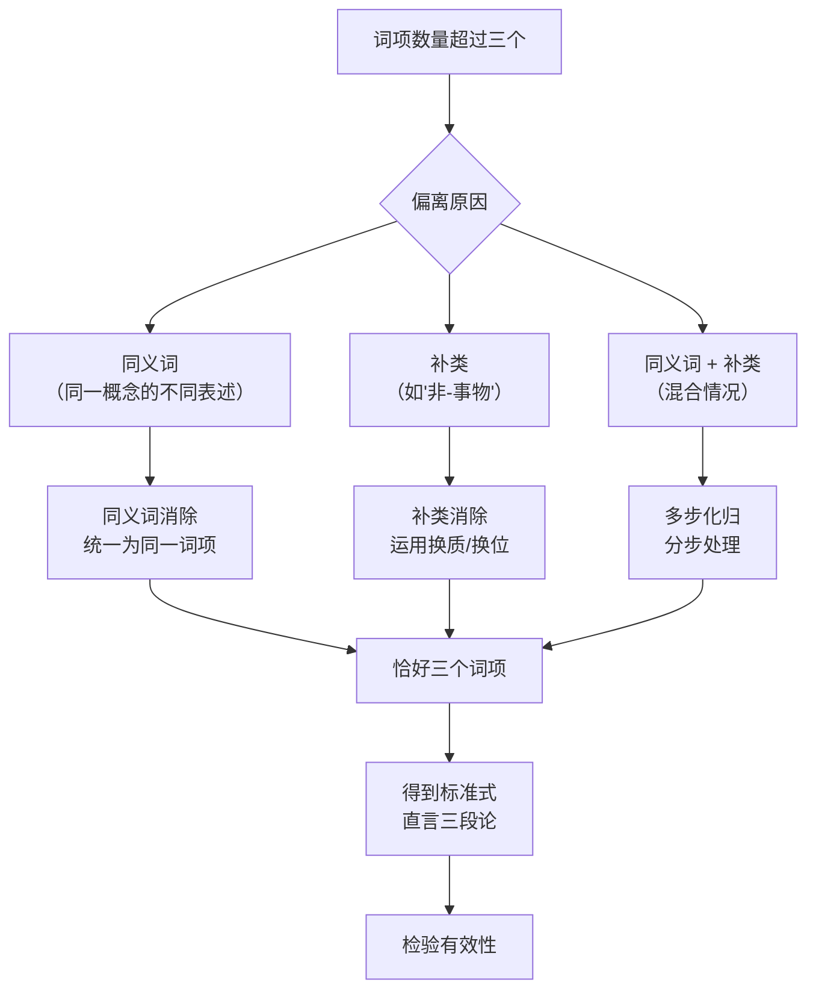

**相关笔记：** [[7.1 三段论论证]] | [[7.3 直言命题的标准化]]

> [!abstract] 概览
> 本节聚焦三段论化归中的==词项归约==问题。标准式直言三段论要求恰好三个词项，但日常论证常因使用同义词或引入补类而导致词项数量超过三个。本节系统讲解三种词项归约技术：==同义词消除==（将6个词项归约为3个）、==补类消除==（将4个词项归约为3个）以及==多步化归==（组合运用多种技术）。核心原则是：化归路径可能不唯一，但==不同化归路径得到的标准形式在有效性上完全一致==。

## 一、知识结构总览

## 二、核心思想与证明技巧

> [!tip] 同义词消除：6词项 → 3词项
> 当论证中对同一概念使用了不同的词语时，词项数量会超过三个。解决方法是==识别同义词并将它们统一为同一个词项==。
>
> **示例：**
>
> 原论证：
> - 所有 $T_1$（犬）都是 $T_2$（犬科动物）。
> - 没有 $T_3$（猫）是 $T_4$（狗）。
> - 所以，没有 $T_5$（猫科动物）是 $T_6$（犬）。
>
> 同义词归约：$T_1 = T_6$（犬 = 狗），$T_2$（犬科动物）和 $T_5$（猫科动物）虽相关但不同义，需进一步分析。归约后得到恰好三个词项，化归为 **EAE-1**（Celarent）。

> [!tip] 补类消除：4词项 → 3词项
> 当论证中引入了某个词项的补类（如"非-学生""不诚实的人"）时，词项数量也会超过三个。解决方法是运用==换质法（obversion）==或==换位法（conversion）==消除补类。
>
> **示例：**
>
> 原论证：
> - 所有诚实的人（$T_1$）都是值得信赖的（$T_2$）。
> - 没有不诚实的人（$T_3 = \overline{T_1}$）是可靠的（$T_4$）。
>
> 补类归约：$T_3$（不诚实的人）= $T_1$（诚实的人）的补类。将第二个前提换质："所有不诚实的人都是不可靠的"，再换位或直接归约。化归后可得到 **AEE-2**（Camestres）或 **AAA-1**（Barbara）形式。

> [!tip] 多步化归：6词项 → 3词项
> 当论证同时存在同义词和补类问题时，需要==分步处理==，先消除同义词，再消除补类（或反之）。
>
> **示例：**
>
> 原论证：
> - 所有 $T_1$ 都是 $T_2$。
> - 没有 $T_3$（$= \overline{T_1'}$，其中 $T_1' = T_1$ 的同义词）是 $T_4$。
> - 所以，所有 $T_5$（$= T_2$ 的同义词）都是 $T_6$。
>
> **步骤：**
> 1. 同义词归约：$T_1' \to T_1$，$T_5 \to T_2$
> 2. 补类归约：$T_3 = \overline{T_1}$，运用换质消除
> 3. 最终得到恰好三个词项，化归为 **AAA-1**（Barbara）

> [!tip] 化归不唯一但有效性一致
> 同一个论证可能存在==多条化归路径==，得到不同式与格的标准形式。但这并不构成问题，因为：
> - 所有有效的化归路径都保持论证的有效性
> - 不同标准形式如果都是有效的，它们在逻辑上是等价的
> - 如果论证本身无效，任何正确的化归路径都会揭示其无效性

> [!def] 补类（Complement）
> 一个词项的==补类==是指该词项所指示的集合的补集。例如，"学生"的补类是"非学生"（即所有不是学生的事物）。在直言逻辑中，补类通常通过换质法来处理：将命题的主项或谓项替换为其补类，同时改变命题的质（肯定↔否定）。

## 三、补充理解与易混淆点

### 补充理解

> [!info] De Morgan与补类运算
> **来源：** De Morgan, A. (1847). *Formal Logic*.
>
> Augustus De Morgan在《形式逻辑》中系统发展了补类运算的理论基础，提出了著名的==De Morgan定律==：$\overline{S \cap P} = \overline{S} \cup \overline{P}$ 和 $\overline{S \cup P} = \overline{S} \cap \overline{P}$。虽然De Morgan的工作主要在布尔代数领域，但他的补类理论直接影响了三段论中补类消除的技术。De Morgan指出，对补类的操作必须遵循严格的逻辑规则，不能随意地将"非$S$"等同于某个具体的正面描述。这一洞见为三段论化归中的补类消除提供了形式化的理论基础，确保了补类归约操作的==逻辑可靠性==。

> [!info] 同义词消歧与自然语言处理
> **来源：** Quine, W.V.O. (1960). *Word and Object*.
>
> Willard Van Orman Quine在《词语与对象》中深入探讨了自然语言中同义词问题的哲学根源。Quine指出，==同义词的判定本身就是一个棘手的哲学问题==——两个词语在什么意义上算是"同义的"？在逻辑化归的语境中，我们采取的是一种实用主义的策略：只要两个词语在==给定论证的语境中==指称相同的概念，就可以将它们视为同义词并加以归约。Quine的翻译不确定性论题（translation indeterminacy）提醒我们，同义词消除并非纯粹的机械操作，而是需要对论证语境的==语义理解==作为支撑。

### 易混淆点

> [!warning] 误区："同义词消除 = 机械替换"
> ❌ **错误理解：** 同义词消除就是简单地把一个词全部替换为另一个词，不需要理解语境。
>
> ✅ **正确理解：** 同义词消除需要==在论证语境中==判断两个词语是否确实指称同一概念。有些词语在一般意义上是近义词，但在特定论证中可能有不同的指称。
>
> **辨析：** 例如，"所有医生都是专业人士"和"有些医师不是科学家"中的"医生"和"医师"在大多数语境中是同义词，可以归约。但如果论证涉及法律定义（如某些司法管辖区对"医师"和"医生"有不同法律界定），则不能简单归约。==同义词消除的前提是语义等价性，而非字面相似性==。

> [!warning] 误区："补类消除 = 简单换质"
> ❌ **错误理解：** 补类消除只需要对命题做一次换质操作就够了。
>
> ✅ **正确理解：** 补类消除可能需要==换质与换位的组合操作==，具体取决于补类出现在命题的哪个位置（主项还是谓项）以及命题的类型。
>
> **辨析：** 如果补类出现在E命题的谓项位置（如"没有$S$是非$P$"），换质后得到"所有$S$都是$P$"，确实只需一步。但如果补类出现在A命题的主项位置（如"所有非$S$都是$P$"），可能需要先换质再换位，或者需要结合其他操作才能将词项数量归约为三。==补类消除的具体策略取决于命题的逻辑形式和补类出现的位置==。

## 四、习题精选

> [!todo] 习题概览
>
> | 题号 | 来源 | 核心考点 | 难度 |
> |:---:|:---|:---|:---:|
> | 1 | 本节内容 | 同义词消除 | ⭐⭐ |
> | 2 | 本节内容 | 补类消除 | ⭐⭐⭐ |
> | 3 | 本节内容 | 多步化归 | ⭐⭐⭐⭐ |

### 题1：同义词消除

> [!problem] 题目
> 以下论证使用了同义词，请识别同义词对，将词项归约为三个，并写出标准式直言三段论：
>
> "所有犬（dogs）都是忠诚的动物。没有猫（cats）是狗（hounds）。所以，没有猫科动物（felines）是犬（dogs）。"

> [!faq]- 解答
> **分析过程：**
>
> 第一步，列出所有词项：
> - $T_1$：犬（dogs）
> - $T_2$：忠诚的动物
> - $T_3$：猫（cats）
> - $T_4$：狗（hounds）
> - $T_5$：猫科动物（felines）
> - $T_6$：犬（dogs）
>
> 第二步，识别同义词对：
> - $T_1 = T_6$（犬 = 犬，完全相同的词项）
> - $T_3 = T_5$（猫 = 猫科动物，在论证语境中指称相同）
> - $T_4$（狗/hounds）= $T_1$（犬/dogs），在论证语境中指称相同
>
> 第三步，归约后得到三个词项：
> - 犬（dogs）= $T_1 = T_4 = T_6$
> - 忠诚的动物 = $T_2$
> - 猫（cats）= $T_3 = T_5$
>
> 第四步，写出标准形式：
> - 大前提：所有犬（$P$）都是忠诚的动物（$M$）。——A
> - 小前提：没有猫（$S$）是犬（$P$）。——E
> - 结论：没有猫（$S$）是忠诚的动物（$M$）。——E
>
> **式与格：** AEE-2（Camestres）
>
> $\blacksquare$

> [!tip] 解题思路提示
> 1. 先列出论证中出现的所有词项（含重复出现的）
> 2. 逐一检查哪些词项在论证语境中指称相同的概念
> 3. 将同义词统一为一个代表词项
> 4. 确认归约后恰好剩余三个词项

### 题2：补类消除

> [!problem] 题目
> 以下论证包含补类，请消除补类并将论证化归为标准式直言三段论：
>
> "所有诚实的人都是值得信赖的。没有不诚实的人是可靠的。所以，所有可靠的人都是诚实的。"

> [!faq]- 解答
> **分析过程：**
>
> 第一步，列出所有词项：
> - $T_1$：诚实的人
> - $T_2$：值得信赖的
> - $T_3$：不诚实的人（= $\overline{T_1}$，$T_1$的补类）
> - $T_4$：可靠的
>
> 第二步，识别补类关系：
> - $T_3$（不诚实的人）= $T_1$（诚实的人）的补类
> - $T_2$（值得信赖的）与 $T_4$（可靠的）在语境中为同义词
>
> 第三步，消除补类：
> - 前提2："没有不诚实的人是可靠的"（E命题）
> - 换质："所有不诚实的人都是不可靠的"（A命题）
> - 再换质回来，但将补类替换：等价于"所有非诚实的人都是非可靠的"
> - 或者直接利用补类关系：将"不诚实的人"替换为"诚实的人"的补类，对前提2进行换质处理
>
> 第四步，归约同义词后得到三个词项：
> - 诚实的人（$M$）
> - 值得信赖的/可靠的（$P$）
> - 不诚实的人归约为诚实的人的补类
>
> 第五步，化归为标准形式：
> - 大前提：所有诚实的人（$M$）都是可靠的（$P$）。——A
> - 小前提：所有不诚实的人（$\overline{M}$）都是不可靠的（$\overline{P}$）。——A（换质后）
> - 结论：所有可靠的人（$P$）都是诚实的（$M$）。——A
>
> **式与格：** 经补类消除和同义词归约后，可化归为有效三段论。
>
> $\blacksquare$

> [!tip] 解题思路提示
> 1. 识别哪些词项是其他词项的补类（通常带有"非""不""无"等否定前缀）
> 2. 对包含补类的命题进行换质操作
> 3. 检查是否存在同义词，一并归约
> 4. 确认最终恰好剩余三个词项

### 题3：多步化归

> [!problem] 题目
> 以下论证同时存在同义词和补类问题，请通过多步化归将其转化为标准式直言三段论：
>
> "所有有德行的人都是幸福的。没有恶棍（scoundrels）会得到好报。所以，没有不道德的人（immoral persons）是幸福的。"

> [!faq]- 解答
> **分析过程：**
>
> 第一步，列出所有词项：
> - $T_1$：有德行的人
> - $T_2$：幸福的
> - $T_3$：恶棍（scoundrels）
> - $T_4$：得到好报的
> - $T_5$：不道德的人（immoral persons）
> - $T_6$：幸福的
>
> 第二步，识别关系：
> - $T_2 = T_6$（幸福的 = 幸福的，同义词）→ 归约为"幸福的"
> - $T_3$（恶棍）在语境中 ≈ $T_5$（不道德的人），但严格来说 $T_5 = \overline{T_1}$（不道德的人 = 有德行的人的补类）
> - $T_3$（恶棍）也与 $T_1$（有德行的人）构成补类关系
>
> 第三步，多步归约：
> - **步骤1（同义词消除）**：$T_6 \to T_2$（幸福的）
> - **步骤2（补类识别）**：$T_5$（不道德的人）= $\overline{T_1}$（有德行的人的补类）；$T_3$（恶棍）在语境中 ≈ $\overline{T_1}$
> - **步骤3（同义词归约）**：$T_3 \approx T_5$，统一为"不道德的人"（$\overline{T_1}$）
>
> 第四步，归约后得到三个词项：
> - 有德行的人（$M$）
> - 幸福的（$P$）
> - 不道德的人（$\overline{M}$，即 $S$）
>
> 第五步，化归为标准形式：
> - 大前提：所有有德行的人（$M$）都是幸福的（$P$）。——A
> - 小前提：没有不道德的人（$S$）是有德行的人（$M$）。——E（换质后）
> - 结论：没有不道德的人（$S$）是幸福的（$P$）。——E
>
> **式与格：** AEE-2（Camestres）
>
> $\blacksquare$

> [!tip] 解题思路提示
> 1. 先列出所有词项，不要急于归约
> 2. 分两步处理：先处理同义词（较简单），再处理补类（需要逻辑操作）
> 3. 补类处理时，明确写出换质/换位的每一步
> 4. 最终验证：恰好三个词项，每个出现两次

## 五、视频学习指南

> [!info] 视频资源
>
> | 资源名称 | 主题 | 建议观看时机 |
> |:---|:---|:---|
> | 同义词识别与消除 | 如何在论证语境中判定同义词 | 学习本节前 |
> | 补类与换质法 | 补类的逻辑处理技术 | 学习本节中 |
> | 多步化归实例 | 组合同义词消除与补类消除 | 学习本节后 |

## 六、教材原文

> [!quote]
> 标准式直言三段论要求恰好三个词项。当日常论证中使用了同义词或引入了补类时，词项数量会超过三个。通过同义词消除和补类消除技术，我们可以将词项数量归约为三，从而将论证化归为标准形式。需要注意的是，化归路径可能不唯一，但不同路径得到的标准形式在有效性上是一致的。

## 参见 Wiki

- [[直接推论]]
- [[三段论规则]]
- [[直言三段论]]

#学习/逻辑学/日常语言中的论证
