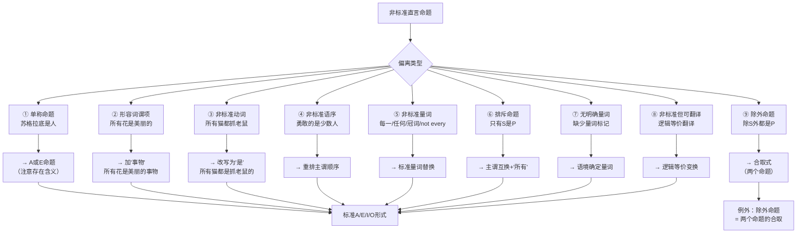

**相关笔记：** [[7.2 词项数量归约为三]] | [[7.4 协同翻译]]

> [!abstract] 概览
> 本节系统讲解将日常语言中的非标准直言命题翻译为标准A/E/I/O形式的九种方法。这九种方法涵盖了日常语言中命题偏离标准形式的主要情况：单称命题、形容词谓项、非标准动词、非标准语序、非标准量词、排斥命题（"只有"）、无明确量词、非标准但可翻译的命题，以及除外命题。其中，==除外命题的翻译最为特殊==——它不能化为单一直言命题，而必须翻译为两个直言命题的==逻辑合取==。

## 一、知识结构总览

## 二、核心思想与证明技巧

> [!tip] ① 单称命题 → A/E命题
> 单称命题断定某个特定个体具有（或不具有）某种属性。翻译方法是将单称命题的主项视为一个==只含一个成员的单元类==（unit class），从而将单称肯定命题翻译为A命题，单称否定命题翻译为E命题。
>
> - "苏格拉底是人" → "所有苏格拉底（的成员）都是人"（A命题）
> - "苏格拉底不是神" → "没有苏格拉底（的成员）是神"（E命题）
>
> ==重要注意：== 在布尔解释下，A命题不蕴含主项的存在，但单称命题显然蕴含其主项的存在（苏格拉底确实存在）。因此，将单称命题翻译为A命题时，==存在含义的差异可能导致有效性判断的问题==（详见易混淆点）。

> [!tip] ② 谓项为形容词 → 加"事物"
> 当命题的谓项是形容词而非名词时，需要补充一个名词使其成为合法的词项。
>
> - "所有花都是美丽的" → "所有花都是==美丽的事物=="
> - "有些学生是聪明的" → "有些学生是==聪明的人=="
>
> 补充的名词（"事物""人"等）应与主项的范畴相匹配，确保翻译后的命题语义与原文一致。

> [!tip] ③ 主要动词非"是" → 改写
> 标准直言命题使用系词"是"（或"不是"），但日常语言中常使用其他动词。
>
> - "所有猫都抓老鼠" → "所有猫都是==抓老鼠的（动物）=="
> - "有些学生通过了考试" → "有些学生是==通过了考试的（人）=="
>
> 翻译策略：将非标准动词短语转化为描述性名词短语，用"是"连接。

> [!tip] ④ 成分顺序不标准 → 重排
> 日常语言中，主项和谓项的位置可能颠倒。
>
> - "值得信赖的是诚实的人" → "所有==诚实的人==都是==值得信赖的=="
> - "属于少数人的是真正的智慧" → "所有==真正的智慧==都是==属于少数人的=="
>
> 翻译时需要根据语义判断哪个是真正的逻辑主项，哪个是逻辑谓项。

> [!tip] ⑤ 量词非标准 → 标准量词替换
> 日常语言使用的量词种类繁多，需要逐一映射为标准量词：
>
> | 非标准量词 | 标准翻译 | 说明 |
> |:---|:---|:---|
> | 每一（every, each） | 所有（all） | 等价于全称量词 |
> | 任何（any） | 所有（all） | 在肯定句中等价于"所有" |
> | a / an（冠词） | ==歧义== | 可能为"所有"或"有些"，需看语境 |
> | not every | 有些...不... | "并非所有S都是P" = "有些S不是P"（O命题） |
> | not any | 没有...是... | "没有任何S是P" = "没有S是P"（E命题） |
>
> ==特别注意：== "not every" 和 "not any" 的翻译结果完全不同：
> - "Not every student passed" = "有些学生没有通过"（O命题）
> - "Not any student passed" = "没有学生通过"（E命题）

> [!tip] ⑥ 排斥命题"只有" → 主谓互换 + "所有"
> 含有"只有"（only）的命题需要==交换主项和谓项的位置==，然后使用全称量词。
>
> - "只有会员才能进入" → "所有==能进入的人==都是==会员=="
> - "只有勇敢者才配得上爱情" → "所有==配得上爱情的==都是==勇敢者=="
>
> **记忆口诀：** "只有$S$是$P$" = "所有$P$都是$S$"（主谓互换 + 全称）。
>
> 注意："只有$S$是$P$" $\neq$ "所有$S$都是$P$"。前者说"能进入的都是会员"（但不排除非会员也能进入），后者说"会员都能进入"（但不排除非会员也能进入）。两者的逻辑含义不同。

> [!tip] ⑦ 不含量词 → 语境确定
> 有些命题没有明确的量词标记，需要根据语境判断其量化类型。
>
> - "狗是忠诚的" → 根据语境可能为"所有狗都是忠诚的"（A）或"有些狗是忠诚的"（I）
> - "鲸鱼是哺乳动物" → 通常理解为"所有鲸鱼都是哺乳动物"（A，科学概括）
>
> 翻译时需结合语境和常识判断。==当存在歧义时，应考虑两种可能的翻译==。

> [!tip] ⑧ 非标准但可翻译 → 逻辑等价翻译
> 某些命题虽然表述不标准，但可以通过逻辑等价变换翻译为标准形式。
>
> - "没有人是完美的" → "没有人是完美的"（已经是E命题）
> - "并非所有人都同意" → "有些人不同意"（O命题）
>
> 这类翻译利用了命题之间的逻辑等价关系（如矛盾关系、反对关系等）。

> [!tip] ⑨ 除外命题 → 合取式（两个命题）
> ==除外命题是九种情况中最特殊的==。除外命题的形式为"除$S$外，所有$T$都是$P$"，它==不能==翻译为单一直言命题，而必须翻译为两个直言命题的==逻辑合取==。
>
> - "除约翰外，所有学生都通过了考试" =
> - **命题1：** "约翰是学生，且约翰没有通过考试"（单称命题）
> - **命题2：** "所有其他学生都通过了考试"（A命题）
> - **合取：** 命题1 $\land$ 命题2
>
> 除外命题的本质是==对一个全称概括做出例外限定==，因此它同时断定了一个全称命题和一个关于例外的否定命题。这种复合结构决定了它无法被压缩为单一的A/E/I/O命题。

## 三、补充理解与易混淆点

### 补充理解

> [!info] Kant论单称命题的处理
> **来源：** Kant, I. (1781/1787). *Critique of Pure Reason*, A71/B96.
>
> Kant在《纯粹理性批判》中讨论了判断的分类，将单称判断（singular judgment）视为全称判断（universal judgment）的一个特例。Kant认为，单称判断在逻辑形式上可以被视为==主项外延只有一个成员的全称判断==，因为"苏格拉底是人"和"所有苏格拉底都是人"在逻辑结构上没有本质区别——两者的主项外延都被完全包含在谓项的外延之中。然而，Kant的这种处理方式隐含了一个重要的哲学问题：全称判断（在布尔解释下）不蕴含主项的存在，但单称判断==显然蕴含==其主项的存在。这一差异在现代逻辑学中通过引入==存在量词==来处理，但在传统三段论理论中，它导致了存在谬误的潜在风险。

> [!info] 除外命题的复合性
> **来源：** Copi, I. (1954). *Symbolic Logic*, Chapter 5.
>
> Copi在《符号逻辑》第五章中详细分析了除外命题的逻辑结构，指出除外命题本质上是一个==复合命题==（compound proposition），而非简单命题（simple proposition）。"除$S$外，所有$T$都是$P$"的逻辑形式为：$S(x) \land \neg P(x) \land \forall y((T(y) \land y \neq x) \to P(y))$。这一分析表明，除外命题同时包含三个成分：对例外个体的==存在性断定==、对例外个体的==否定性断定==，以及对其余个体的==全称概括==。在现代符号逻辑中，这一结构可以精确表达，但在传统直言逻辑的A/E/I/O框架内，只能将其拆分为两个独立的直言命题的合取。

### 易混淆点

> [!warning] 误区："单称命题 = A命题"（忽略存在含义）
> ❌ **错误理解：** 单称肯定命题可以直接等同于A命题，两者在逻辑上完全相同。
>
> ✅ **正确理解：** 虽然在形式上可以将单称命题翻译为A命题（将主项视为单元类），但两者在==存在含义上存在重要差异==。单称命题（如"苏格拉底是人"）蕴含主项的存在（苏格拉底存在），而A命题在布尔解释下不蕴含主项的存在（"所有独角兽都是美丽的"并不蕴含独角兽存在）。
>
> **辨析：** 这一差异在三段论的有效性检验中可能导致==存在谬误==。例如，从"所有独角兽都是神话生物"和"所有神话生物都是虚构的"推出"苏格拉底是虚构的"是无效的，但如果将"苏格拉底是人"（单称命题）翻译为A命题并参与推理，在某些情况下可能掩盖了存在假设的问题。因此，在处理单称命题时，必须==特别注意存在含义的差异==。

> [!warning] 误区："除外命题 = 单一直言命题"
> ❌ **错误理解：** "除约翰外，所有学生都通过了考试"可以翻译为一个标准直言命题，比如"所有不是约翰的学生都通过了考试"。
>
> ✅ **正确理解：** 除外命题==不能==翻译为单一直言命题。它必须翻译为==两个直言命题的合取==：一个关于例外的否定命题，加上一个关于其余对象的全称命题。
>
> **辨析：** 如果将"除约翰外，所有学生都通过了考试"仅仅翻译为"所有不是约翰的学生都通过了考试"（A命题），就==丢失了关键信息==——原文还断定了约翰是学生且约翰没有通过考试。这个丢失的信息在论证的有效性判定中可能是关键的。例如，如果已知"约翰不是学生"，那么原文的除外命题为假（因为不存在"例外"），但翻译后的A命题仍可能为真。因此，除外命题的正确翻译必须保留其==复合结构==。

## 四、习题精选

> [!todo] 习题概览
>
> | 题号 | 来源 | 核心考点 | 难度 |
> |:---:|:---|:---|:---:|
> | 1 | 本节内容 | 单称命题翻译 | ⭐⭐ |
> | 2 | 本节内容 | 排斥命题翻译 | ⭐⭐⭐ |
> | 3 | 本节内容 | 除外命题分析 | ⭐⭐⭐⭐ |

### 题1：单称命题翻译

> [!problem] 题目
> 将以下单称命题翻译为标准直言命题，并指出其类型（A/E/I/O）以及存在含义问题：
>
> "柏拉图不是雅典人。"

> [!faq]- 解答
> **翻译过程：**
>
> 原命题："柏拉图不是雅典人。"
>
> 将主项"柏拉图"视为单元类：$\{柏拉图\}$
>
> 翻译为标准形式："==没有柏拉图是雅典人=="
>
> 命题类型：**E命题**（全称否定）
>
> **存在含义分析：**
> - 原命题（单称否定）蕴含柏拉图的存在——我们预设柏拉图是一个真实存在的人。
> - 翻译后的E命题在布尔解释下==不蕴含==主项"柏拉图"的存在。
> - 因此，翻译过程中存在==存在含义的丢失==。在大多数实际推理中，这种丢失不会影响有效性判断，但在涉及空类的论证中可能导致问题。
>
> $\blacksquare$

> [!tip] 解题思路提示
> 1. 识别命题的主项（单称词项）和谓项
> 2. 将单称肯定命题翻译为A命题，单称否定命题翻译为E命题
> 3. 检查翻译后的命题是否保留了原文的存在含义
> 4. 如果存在含义丢失，指出其潜在影响

### 题2：排斥命题翻译

> [!problem] 题目
> 将以下排斥命题翻译为标准直言命题，并解释为什么不能直接翻译为"所有S都是P"：
>
> "只有通过考试的人才能毕业。"

> [!faq]- 解答
> **翻译过程：**
>
> 原命题："只有通过考试的人才能毕业。"
>
> 应用排斥命题翻译规则（"只有$S$是$P$" → "所有$P$都是$S$"）：
>
> - $S$ = 通过考试的人
> - $P$ = 能毕业的人
>
> 翻译为标准形式："==所有能毕业的人都是通过考试的人=="
>
> 命题类型：**A命题**（全称肯定）
>
> **为什么不能翻译为"所有通过考试的人都能毕业"？**
>
> - "所有通过考试的人都能毕业"说的是：通过考试是毕业的==充分条件==。
> - "只有通过考试的人才能毕业"说的是：通过考试是毕业的==必要条件==。
> - 两者逻辑含义不同。前者允许存在"没通过考试但能毕业"的情况（只要通过考试的人确实能毕业），后者==排除了=="没通过考试但能毕业"的情况。
> - 举例：如果某人通过考试但被开除学籍，"所有通过考试的人都能毕业"为假，但"只有通过考试的人才能毕业"仍可能为真（因为毕业的人确实都通过了考试）。
>
> $\blacksquare$

> [!tip] 解题思路提示
> 1. 识别"只有"后面的词项（$S$）和"是"后面的词项（$P$）
> 2. 应用规则："只有$S$是$P$" → "所有$P$都是$S$"
> 3. 验证翻译结果与原文的逻辑含义是否一致
> 4. 对比"只有S是P"与"所有S都是P"的区别

### 题3：除外命题分析

> [!problem] 题目
> 将以下除外命题翻译为标准形式，并解释为什么它不能翻译为单一直言命题：
>
> "除爱因斯坦外，所有物理学家都出生在爱因斯坦之后。"

> [!faq]- 解答
> **翻译过程：**
>
> 原命题："除爱因斯坦外，所有物理学家都出生在爱因斯坦之后。"
>
> 除外命题的标准翻译为==两个命题的合取==：
>
> **命题1（关于例外）：** "爱因斯坦是物理学家，且爱因斯坦不是出生在爱因斯坦之后。"
> - 这是一个单称否定命题，可翻译为："没有爱因斯坦是出生在爱因斯坦之后的。"（E命题）
> - 注意：这里"出生在爱因斯坦之后"对爱因斯坦自身显然为假（没有人出生在自己之后）。
>
> **命题2（关于其余对象）：** "所有其他物理学家都是出生在爱因斯坦之后的。"
> - 翻译为标准形式："所有不是爱因斯坦的物理学家都是出生在爱因斯坦之后的。"（A命题）
>
> **合取：** 命题1 $\land$ 命题2
>
> **为什么不能翻译为单一直言命题？**
>
> 如果仅仅翻译为"所有不是爱因斯坦的物理学家都是出生在爱因斯坦之后的"（A命题），就==丢失了以下关键信息==：
> 1. 爱因斯坦是物理学家（存在性断定）
> 2. 爱因斯坦不是出生在爱因斯坦之后的（否定性断定）
>
> 这些丢失的信息在论证中可能是关键的。例如：
> - 如果有人论证"爱因斯坦不是物理学家"，那么原除外命题为假（因为"除爱因斯坦外"的表述预设了爱因斯坦是物理学家），但单独的A命题仍可能为真。
> - 因此，除外命题的完整翻译==必须保留其复合结构==。
>
> $\blacksquare$

> [!tip] 解题思路提示
> 1. 识别除外命题中的"例外项"和"全称概括部分"
> 2. 将全称概括部分翻译为A命题
> 3. 将例外部分翻译为一个独立的否定命题
> 4. 用逻辑合取（$\land$）连接两个命题
> 5. 验证合取式是否完整保留了原文的所有信息

## 五、视频学习指南

> [!info] 视频资源
>
> | 资源名称 | 主题 | 建议观看时机 |
> |:---|:---|:---|
> | 单称命题与存在含义 | 单称命题翻译及存在假设问题 | 学习①后 |
> | 量词的多样性 | 非标准量词的识别与翻译 | 学习⑤后 |
> | 排斥命题"只有" | "只有"的逻辑结构与翻译技巧 | 学习⑥后 |
> | 除外命题的复合性 | 除外命题为何不能化为单一直言命题 | 学习⑨后 |

## 六、教材原文

> [!quote]
> 日常语言中的直言命题很少以标准的A、E、I、O形式出现。为了运用三段论规则检验论证的有效性，我们需要将这些非标准命题翻译为标准形式。大多数非标准命题可以通过九种翻译方法化为标准直言命题。唯一的例外是除外命题，它必须被翻译为两个直言命题的合取，因为除外命题本质上是一个复合命题。

## 参见 Wiki

- [[直言命题]]
- [[A_E_I_O 四种命题]]
- [[布尔解释]]
- [[存在谬误]]

#学习/逻辑学/日常语言中的论证
