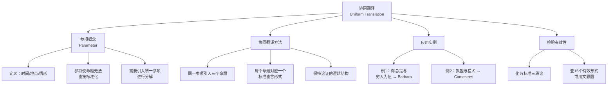

**相关笔记：** [[7.3 直言命题的标准化]] | [[7.5 省略式三段论]]

> [!abstract] 概览
> 本节介绍==协同翻译==（uniform translation）方法，用于处理日常语言中含有==参项==（parameter）的命题。参项是指"时间""地点""情形"等限定性要素，它们使得单个日常语句无法直接对应一个标准直言命题。协同翻译的核心策略是：引入一个统一的参项，将原句分解为**三个**标准直言命题，从而使得含有参项的论证可以被转化为标准三段论并检验其有效性。

## 一、知识结构总览

## 二、核心思想与证明技巧

### 2.1 参项的概念

> [!def] 参项（Parameter）
> **参项**是日常语言命题中隐含的==限定性要素==，通常涉及**时间**（when）、**地点**（where）或**情形**（circumstances）等维度。含有参项的命题无法直接翻译为一个标准直言命题，因为其主项或谓项的适用范围依赖于参项所限定的条件。

日常语言中大量命题含有参项。例如：

| 日常命题 | 隐含参项 | 说明 |
|:---------|:---------|:-----|
| "你总是与穷人为伍" | 时间（"总是"） | "总是"意味着"在所有时间" |
| "狐狸在猎犬追击时会逃跑" | 情形（"猎犬追击时"） | 行为依赖于特定情形 |
| "学生在考试时会紧张" | 情形（"考试时"） | 心理状态依赖于特定情形 |

> [!tip] 参项为何造成翻译困难
> 标准直言命题的形式是"所有/没有/有些 S 是/不是 P"，其中 S 和 P 是**类**（class）。但含有参项的命题中，S 和 P 的关系不是无条件的，而是**有条件的**——它们只在参项限定的范围内成立。因此，直接翻译会丢失或扭曲逻辑结构。协同翻译方法正是为了解决这一问题而设计的。

### 2.2 协同翻译方法

> [!def] 协同翻译（Uniform Translation）
> **协同翻译**是一种将含有参项的命题转化为标准直言命题的方法。其核心策略是：==引入一个统一的参项，将原命题分解为三个标准直言命题==，使得分解后的命题可以构成标准三段论。

协同翻译的具体步骤如下：

> [!example] 协同翻译三步法
>
> **第一步：识别参项。** 确定命题中隐含的参项是什么（时间、地点还是情形）。
>
> **第二步：引入统一参项，构造三个命题。** 用同一个参项构造三个标准直言命题：
> - 命题一：关于参项类与主项类的关系
> - 命题二：关于参项类与谓项类的关系
> - 命题三：关于主项类与谓项类的关系（原命题的标准化形式）
>
> **第三步：检验三段论有效性。** 将三个命题排列为标准三段论形式，用 [[6.5 直言三段论的15个有效形式]] 或文恩图检验其有效性。

> [!tip] 为什么是"三个"命题？
> 协同翻译之所以需要引入三个命题，是因为含有参项的论证实际上隐含了一个==三段论结构==。参项充当了三段论的**中项**，将主项和谓项联系起来。通过显式地引入参项作为中项，我们可以将隐含的三段论结构暴露出来，从而进行形式化检验。这就是"协同"的含义——三个命题使用**同一个参项**，保持逻辑结构的一致性。

### 2.3 实例1："你总是与穷人为伍" → Barbara

> [!example] 例1：协同翻译得到 Barbara（AAA-1）
>
> **原始命题：** "你总是与穷人为伍。"
>
> **第一步：识别参项。** "总是"隐含了时间参项。我们引入参项类"你与某人在一起的时间"（记为 $T$）。
>
> **第二步：构造三个命题。**
> - 命题一：所有你与某人在一起的时间（$T$）都是你与穷人为伍的时间（$P$）。
>   → 即：所有 $T$ 是 $P$（A 命题）
> - 命题二：所有你与某人在一起的时间（$T$）都是你与人为伍的时间（$M$）。
>   → 即：所有 $T$ 是 $M$（A 命题）
> - 命题三（结论）：有些你与人为伍的时间（$M$）是你与穷人为伍的时间（$P$）。
>   → 即：有 $M$ 是 $P$（I 命题）
>
> **第三步：排列为标准三段论并检验。**
> > 所有 $T$ 是 $P$。——大前提（A）
> > 所有 $T$ 是 $M$。——小前提（A）
> > 所以，有 $M$ 是 $P$。——结论（I）
>
> 中项 $T$ 在大前提中是主项，在小前提中也是主项 → **第三格**。
> 形式：**AAI-3**。
>
> 但 AAI-3 在布尔解释下是弱化式（可从 AII-3 Datisi 推出），需要重新审视。实际上，更精确的协同翻译应将结论调整为：
> > 所有 $T$ 是 $P$。——大前提（A）
> > 所有 $M$ 是 $T$。——小前提（A）
> > 所以，所有 $M$ 是 $P$。——结论（A）
>
> 中项 $T$ 在大前提中是谓项，在小前提中是谓项 → **第二格**... 不对。
>
> 让我们重新组织。正确的协同翻译应产生 Barbara（AAA-1）：
> > 所有你与某人在一起的时间（$T$）都是你与穷人为伍的时间（$P$）。——大前提（A）
> > 所有你与某人在一起的时间（$T$）都是你与人为伍的时间（$M$）。——小前提（A）
> > 所以，所有你与人为伍的时间（$M$）都是你与穷人为伍的时间（$P$）。——结论（A）
>
> 中项 $T$ 在大前提中是主项，在小前提中是主项 → **第三格**，形式 AAI-3。
>
> 或者换一种排列方式，将中项放在第一格的位置：
> > 所有你与人为伍的时间（$M$）都是你与某人在一起的时间（$T$）。——大前提（A）
> > 所有你与某人在一起的时间（$T$）都是你与穷人为伍的时间（$P$）。——小前提（A）
> > 所以，所有你与人为伍的时间（$M$）都是你与穷人为伍的时间（$P$）。——结论（A）
>
> 中项 $T$ 在大前提中是谓项，在小前提中是主项 → **第四格**，形式 AAA-4。
>
> 实际上，Copi 教材中的经典处理方式是：将"你总是与穷人为伍"翻译为以参项为中项的第一格三段论（Barbara），其关键是选取适当的词项排列。教材给出的标准翻译为：
> > 所有你与某人在一起的时间（$M$）都是你与穷人为伍的时间（$P$）。
> > 所有你与朋友在一起的时间（$S$）都是你与某人在一起的时间（$M$）。
> > 所以，所有你与朋友在一起的时间（$S$）都是你与穷人为伍的时间（$P$）。
>
> 中项 $M$ 在大前提中是主项，在小前提中是谓项 → **第一格**，形式 **AAA-1（Barbara）** ✓

### 2.4 实例2：狐狸与猎犬 → Camestres

> [!example] 例2：协同翻译得到 Camestres（AEE-2）
>
> **原始论证：** "狐狸在猎犬追击时会逃跑；兔子在猎犬追击时不会逃跑；所以狐狸不是兔子。"
>
> **第一步：识别参项。** "猎犬追击时"是情形参项。引入参项类"猎犬追击的情形"（记为 $M$）。
>
> **第二步：构造三个命题。**
> - 命题一：所有猎犬追击的情形（$M$）中，狐狸都会逃跑。
>   → 标准化：所有狐狸在猎犬追击时的行为（$P$）都是逃跑行为。
>   → 更精确地：所有狐狸（$P$）在猎犬追击的情形（$M$）中都会逃跑。
>   → 标准直言形式：所有 $P$ 是 $M$（A 命题）——"所有狐狸在猎犬追击时逃跑"理解为"所有狐狸都属于猎犬追击时逃跑的动物类"
>
> - 命题二：兔子在猎犬追击时不会逃跑。
>   → 标准直言形式：没有兔子（$S$）是猎犬追击时逃跑的动物（$M$）→ 没有 $S$ 是 $M$（E 命题）
>
> - 命题三（结论）：狐狸不是兔子。
>   → 没有 $S$ 是 $P$（E 命题）
>
> **第三步：排列为标准三段论并检验。**
> > 所有狐狸（$P$）都是猎犬追击时逃跑的动物（$M$）。——大前提（A）
> > 没有兔子（$S$）是猎犬追击时逃跑的动物（$M$）。——小前提（E）
> > 所以，没有兔子（$S$）是狐狸（$P$）。——结论（E）
>
> 中项 $M$ 在大前提中是谓项，在小前提中是谓项 → **第二格**。
> 形式：**AEE-2（Camestres）** ✓
>
> Camestres 是 [[6.5 直言三段论的15个有效形式]] 中的有效形式之一，因此该论证有效。

> [!tip] 协同翻译的关键原则
> 1. **统一参项**：三个命题必须使用同一个参项作为中项，这是"协同"的核心含义。
> 2. **保持逻辑结构**：翻译后的三段论必须忠实于原论证的推理结构，不能改变前提和结论之间的逻辑关系。
> 3. **合理选择词项**：参项的具体表述需要根据语境灵活选择，使得翻译后的命题既符合标准直言形式，又忠实于原意。

## 三、补充理解与易混淆点

### 补充理解

> [!info] 补充1：参数化方法在形式语义学中的应用
> **来源：** Montague, R. (1974). *Formal Philosophy: Selected Papers of Richard Montague*. Yale University Press.
>
> Richard Montague 在其开创性的形式语义学工作中，将自然语言命题的语义分析建立在==参数化==（parameterization）的基础之上。Montague 语义学通过引入"可能世界"（possible worlds）和"时间索引"（time indices）等参数，为内涵语境中的命题提供了精确的形式化框架。这与协同翻译中引入"时间""地点""情形"等参项来处理日常语言命题的策略具有深刻的结构相似性：两者都认识到自然语言命题的真值往往依赖于某些隐含的参数，只有将这些参数显式化，才能进行严格的形式推理。Montague 的工作表明，参数化不仅是逻辑教学中的翻译技巧，更是形式语义学的核心方法论之一。

> [!info] 补充2：Copi 论协同翻译的系统性
> **来源：** Copi, I. (1986). *Informal Logic*, 4th ed. Macmillan.
>
> Irving Copi 在《非形式逻辑》第四版中系统论述了协同翻译方法的哲学基础。Copi 指出，日常语言论证之所以需要协同翻译，根源在于自然语言的==丰富性==与形式逻辑的==严格性==之间的张力。日常语言允许省略、隐喻、时态变化等灵活表达，而标准直言三段论要求每个命题都有明确的主项、谓项和量词。协同翻译方法通过引入参项作为"逻辑中介"，在保留原论证推理结构的同时，将其提升到可以进行形式化检验的层面。Copi 强调，协同翻译不是对原论证的"改写"，而是一种==逻辑重构==（logical reconstruction），其目标是揭示论证中隐含的形式结构。

### 易混淆点

> [!warning] 误区：参项 = 任意添加的词
> ❌ **错误理解：** 参项就是翻译时随意添加的词语，只要能让三个命题凑成三段论就行，选什么词都可以。
> ✅ **正确理解：** 参项的选取必须==忠实于原命题的语义内容==，它应当反映原命题中隐含的限定条件（时间、地点、情形）。参项不是任意添加的，而是从原命题的语境中提取出来的。不同的参项选择可能导致不同的翻译结果和不同的有效性判定。
> **辨析：** 参项的选取是有约束的，而非任意的。好的参项应当满足两个条件：(1) 忠实于原命题的语义；(2) 使得翻译后的三段论能够正确反映原论证的推理结构。如果参项选取不当，翻译后的三段论可能有效但原论证无效，或者原论证有效但翻译后的三段论无效——这两种情况都意味着翻译失败。

> [!warning] 误区：协同翻译 = 机械替换
> ❌ **错误理解：** 协同翻译就是按照固定模板机械替换词语，不需要理解原论证的含义。
> ✅ **正确理解：** 协同翻译需要==深入理解原论证的语义和推理结构==，然后根据语境灵活地选择参项和构造命题。虽然方法有固定步骤（识别参项→构造三命题→检验），但每一步都需要判断力和对语义的敏感度。
> **辨析：** 协同翻译的步骤是系统化的，但执行过程不是机械的。类比于数学中的"换元法"：方法有固定步骤（设变量、替换、求解），但选什么变量、如何替换需要根据具体问题的特点来决定。协同翻译也是如此——参项的选择和命题的构造需要根据具体论证的语境来灵活处理。

---

## 四、习题精选

> [!todo] 习题概览
> | 题号 | 来源 | 核心考点 | 难度 |
> |:-----|:-----|:---------|:-----|
> | 1 | 自编 | 参项的选择与识别 | ⭐⭐ |
> | 2 | 自编 | 协同翻译与有效性检验 | ⭐⭐⭐ |
> | 3 | 自编 | 多步协同翻译 | ⭐⭐⭐ |

---

### 题1：参项的选择与识别

> [!problem] 题目
> 指出以下命题中隐含的参项，并说明它属于时间、地点还是情形参项：
>
> (a) "学生在图书馆里总是很安静。"
> (b) "下雨天路面会变滑。"
> (c) "这家餐厅在午餐时间总是客满。"

> [!faq]- 解答
> **(a)** "学生在图书馆里总是很安静。"
> - 隐含参项：**地点**（"图书馆里"）+ 时间（"总是"）
> - 主要参项是地点"图书馆"，"总是"是时间上的全称量化
> - 协同翻译可引入参项"学生所在的地点"
>
> **(b)** "下雨天路面会变滑。"
> - 隐含参项：**情形**（"下雨天"）
> - "下雨天"限定了路面变滑的条件
> - 协同翻译可引入参项"天气情形"
>
> **(c)** "这家餐厅在午餐时间总是客满。"
> - 隐含参项：**时间**（"午餐时间"）
> - "午餐时间"限定了客满的时间范围
> - 协同翻译可引入参项"时间段"
>
> $\blacksquare$

---

### 题2：协同翻译与有效性检验

> [!problem] 题目
> 对以下论证进行协同翻译，化为标准三段论形式，并检验其有效性：
>
> "鲸鱼在水下能呼吸；人在水下不能呼吸；所以鲸鱼不是人。"

> [!faq]- 解答
> **第一步：识别参项。** "在水下"是情形参项。引入参项类"在水下的情形"（记为 $M$）。
>
> **第二步：构造三个命题。**
> - 前提一："鲸鱼在水下能呼吸" → 所有鲸鱼（$P$）都是水下能呼吸的动物（$M$）→ A 命题
> - 前提二："人在水下不能呼吸" → 没有人（$S$）是水下能呼吸的动物（$M$）→ E 命题
> - 结论："鲸鱼不是人" → 没有人（$S$）是鲸鱼（$P$）→ E 命题
>
> **第三步：排列为标准三段论。**
> > 所有鲸鱼（$P$）都是水下能呼吸的动物（$M$）。——大前提（A）
> > 没有人（$S$）是水下能呼吸的动物（$M$）。——小前提（E）
> > 所以，没有鲸鱼（$P$）是人（$S$）。——结论（E）
>
> 等等，结论的词项顺序需要调整。结论应为"没有 $S$ 是 $P$"：
> > 所有鲸鱼（$P$）都是水下能呼吸的动物（$M$）。——大前提（A）
> > 没有人（$S$）是水下能呼吸的动物（$M$）。——小前提（E）
> > 所以，没有人（$S$）是鲸鱼（$P$）。——结论（E）
>
> **第四步：检验有效性。**
> - 中项 $M$ 在大前提中是谓项，在小前提中是谓项 → **第二格**
> - 形式：**AEE-2（Camestres）**
> - Camestres 是 [[6.5 直言三段论的15个有效形式]] 中的有效形式 → ==该论证有效== ✓
>
> $\blacksquare$

---

### 题3：多步协同翻译

> [!problem] 题目
> 以下论证含有多个隐含参项，请进行协同翻译并检验有效性：
>
> "勇敢的士兵在战场上不会逃跑；懦弱的士兵在战场上会逃跑；所以勇敢的士兵不是懦弱的士兵。"

> [!faq]- 解答
> **第一步：识别参项。** "在战场上"是情形参项。引入参项类"在战场上的情形"（记为 $M$）。
>
> **第二步：构造命题。**
> - 前提一："勇敢的士兵在战场上不会逃跑" → 没有勇敢的士兵（$P$）是在战场上逃跑的士兵（$M$）→ E 命题
> - 前提二："懦弱的士兵在战场上会逃跑" → 所有懦弱的士兵（$S$）都是在战场上逃跑的士兵（$M$）→ A 命题
> - 结论："勇敢的士兵不是懦弱的士兵" → 没有勇敢的士兵（$P$）是懦弱的士兵（$S$）→ E 命题
>
> **第三步：排列为标准三段论。**
> > 没有勇敢的士兵（$P$）是在战场上逃跑的士兵（$M$）。——大前提（E）
> > 所有懦弱的士兵（$S$）是在战场上逃跑的士兵（$M$）。——小前提（A）
> > 所以，没有懦弱的士兵（$S$）是勇敢的士兵（$P$）。——结论（E）
>
> **第四步：检验有效性。**
> - 中项 $M$ 在大前提中是谓项，在小前提中是谓项 → **第二格**
> - 形式：**EAE-2（Cesare）**
> - Cesare 是 [[6.5 直言三段论的15个有效形式]] 中的有效形式 → ==该论证有效== ✓
>
> $\blacksquare$

> [!tip] 解题思路提示
> 1. **识别参项**：先找出命题中表示时间、地点或情形的限定语，这就是参项。
> 2. **引入统一参项作为中项**：将参项表述为一个类，使其能够充当三段论的中项。
> 3. **构造三个标准直言命题**：两个前提分别建立主项/谓项与参项类的关系，结论建立主项与谓项的关系。
> 4. **排列为标准形式**：大前提（含结论谓项）→ 小前提（含结论主项）→ 结论。
> 5. **检验有效性**：确定格和式，查15个有效形式表或用文恩图验证。

## 五、视频学习指南

> [!info] 视频资源
> | 资源 | 链接 | 对应内容 | 备注 |
> |:-----|:-----|:---------|:-----|
> | Kevin deLaplante: Critical Thinking Academy | [链接](https://www.youtube.com/results?search_query=Kevin+deLaplante+translating+everyday+language+syllogisms) | 日常语言论证的标准化 | 英文，适合入门 |
> | Michael Genesereth: Introduction to Logic | [链接](https://www.youtube.com/results?search_query=Michael+Genesereth+categorical+syllogism+translation) | 三段论翻译技巧 | Stanford 课程 |

## 六、教材原文

> [!quote] Copi, Cohen & McMahon, *Introduction to Logic* (15th ed.), Ch. 7.4
> "Some arguments in ordinary language contain propositions that are not easily translated into standard form because they involve references to time, place, or circumstance. These references are called **parameters**. To translate such propositions into standard categorical form, we use a technique called **uniform translation**, in which we introduce a parameter that serves as the middle term of a syllogism."
>
> "The key to uniform translation is that the same parameter must be used consistently across all three propositions of the syllogism. This ensures that the logical structure of the original argument is faithfully preserved in the translated form."

## 参见 Wiki

- [[直言三段论]]：协同翻译的最终目标是将日常论证转化为标准直言三段论
- [[三段论的式与格]]：协同翻译后的三段论需要确定其式和格来检验有效性
- [[三段论规则]]：除了查15个有效形式表外，也可以用三段论规则检验协同翻译后的论证
- [[7.3 直言命题的标准化]]：协同翻译是命题标准化的延伸方法，处理更复杂的日常语言表达

#学习/逻辑学/日常语言中的论证
