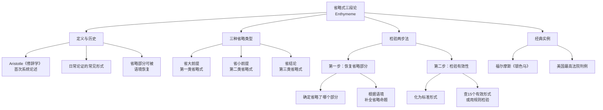

**相关笔记：** [[7.4 协同翻译]] | [[7.6 连锁三段论]]

> [!abstract] 概览
> 本节介绍==省略式三段论==（enthymeme），即在日常语言中省略了某个部分（大前提、小前提或结论）的三段论论证。省略式三段论是日常论证中最常见的形式之一，其历史可追溯至 Aristotle 的《修辞学》。本节将系统讲解省略式三段论的三种省略类型、检验省略式的两步法（恢复省略部分→检验有效性），并通过福尔摩斯探案和最高法院判例等经典实例展示省略式三段论的分析方法。

## 一、知识结构总览

## 二、核心思想与证明技巧

### 2.1 省略式三段论的定义

> [!def] 省略式三段论（Enthymeme）
> **省略式三段论**是一种==不完整的三段论论证==，其中三段论的三个命题（大前提、小前提、结论）中有一个被省略而未明确陈述。被省略的部分通常是说话者认为==不言自明==（obvious）或==语境中已隐含==（implied by context）的命题。

> [!quote] Aristotle《修辞学》
> Aristotle 在其《修辞学》（*Rhetoric*, Book I, Chapter 1）中首次系统论述了省略式三段论，并将其视为==修辞论证的核心形式==。Aristotle 认为，在公众演讲和说服性论证中，省略那些听众已经接受的前提不仅不会削弱论证的力量，反而能增强说服效果——因为当听众自己"填补"了省略的前提时，他们会更加认同结论。这一洞见至今仍是修辞学和论证理论的重要基石。

### 2.2 三种省略类型

省略式三段论根据被省略部分的不同，分为三种类型：

#### 第一类：省略大前提

> [!example] 省大前提的省略式
>
> **论证：** "苏格拉底是人，所以苏格拉底会死。"
>
> **分析：** 这里明确给出了小前提（"苏格拉底是人"）和结论（"苏格拉底会死"），但==省略了大前提==。
>
> **恢复大前提：** "所有人都会死。"
>
> **完整三段论：**
> > 所有人（$M$）都会死（$P$）。——大前提（A）
> > 苏格拉底（$S$）是人（$M$）。——小前提（A）
> > 所以，苏格拉底（$S$）会死（$P$）。——结论（A）
>
> 形式：**AAA-1（Barbara）** ✓ 有效

#### 第二类：省略小前提

> [!example] 省小前提的省略式
>
> **论证：** "所有学生都要参加考试，所以你要参加考试。"
>
> **分析：** 这里明确给出了大前提（"所有学生都要参加考试"）和结论（"你要参加考试"），但==省略了小前提==。
>
> **恢复小前提：** "你是学生。"
>
> **完整三段论：**
> > 所有学生（$M$）都要参加考试（$P$）。——大前提（A）
> > 你（$S$）是学生（$M$）。——小前提（A）
> > 所以，你（$S$）要参加考试（$P$）。——结论（A）
>
> 形式：**AAA-1（Barbara）** ✓ 有效

#### 第三类：省略结论

> [!example] 省结论的省略式
>
> **论证：** "所有诚实的人都会说实话，而约翰是一个诚实的人。"
>
> **分析：** 这里明确给出了大前提（"所有诚实的人都会说实话"）和小前提（"约翰是一个诚实的人"），但==省略了结论==。说话者认为结论太明显了，不需要说出来。
>
> **恢复结论：** "约翰会说实话。"
>
> **完整三段论：**
> > 所有诚实的人（$M$）都会说实话（$P$）。——大前提（A）
> > 约翰（$S$）是诚实的人（$M$）。——小前提（A）
> > 所以，约翰（$S$）会说实话（$P$）。——结论（A）
>
> 形式：**AAA-1（Barbara）** ✓ 有效

> [!tip] 如何判断省略了哪个部分？
> 判断省略类型的技巧：
> 1. **先找结论**：寻找"所以""因此""因而"等标志词。如果找到了结论，则省略的是某个前提。
> 2. **再找前提**：如果只找到一个前提，则省略的是另一个前提。包含结论谓项的是大前提，包含结论主项的是小前提。
> 3. **如果没有结论标志词**：检查两个命题之间是否存在推理关系——如果两个命题共享一个词项且能推出第三个命题，则可能省略了结论。

### 2.3 检验省略式三段论的两步法

> [!tip] 检验两步法
> 检验省略式三段论的有效性，需要遵循以下两个步骤：
>
> **第一步：恢复省略部分。** 根据语境和逻辑结构，补全被省略的命题，使三段论完整。
>
> **第二步：检验有效性。** 将完整的三段论化为标准形式，用 [[6.5 直言三段论的15个有效形式]] 或 [[6.4 三段论规则与三段论谬误]] 检验其有效性。

> [!warning] 恢复省略部分的原则
> 恢复省略部分时，应遵循以下原则：
> 1. **忠实性原则**：补全的命题应当是说话者==最可能意图表达==的命题，而非任意构造。
> 2. **最强论证原则**（Principle of Charity）：在合理范围内，应选择使论证==有效==的补全方式。如果存在多种合理的补全方式，优先选择使论证有效的那个。
> 3. **语境敏感性**：补全的命题必须与论证的语境和背景知识相一致。

### 2.4 经典实例：福尔摩斯《银色马》

> [!example] 福尔摩斯《银色马》中的省略式三段论
>
> 在 Arthur Conan Doyle 的《银色马》（*Silver Blaze*）中，福尔摩斯通过一个著名的省略式推理破案：
>
> **原文（简化）：** "看门狗没有叫，所以入侵者是看门狗熟悉的人。"
>
> **分析：** 这是一个省略了大前提的省略式三段论。
>
> **恢复大前提：** "如果入侵者是陌生人，看门狗就会叫。"（即：所有看门狗不叫的情形都是入侵者为熟悉的人的情形。）
>
> **完整三段论：**
> > 所有看门狗不叫的情形（$M$）都是入侵者为熟悉的人的情形（$P$）。——大前提（A）
> > 本案的情形（$S$）是看门狗没有叫的情形（$M$）。——小前提（A）
> > 所以，本案的入侵者（$S$）是看门狗熟悉的人（$P$）。——结论（A）
>
> 形式：**AAA-1（Barbara）** ✓ 有效
>
> 这个例子展示了省略式三段论在侦探推理中的典型应用：福尔摩斯省略了大前提，因为他认为华生（以及读者）能够自行补充这个"常识性"的前提。

### 2.5 经典实例：美国最高法院判例

> [!example] 最高法院判例中的省略式三段论
>
> 在美国最高法院的司法意见中，法官经常使用省略式三段论来进行法律推理。例如：
>
> **论证（简化）：** "该法律侵犯了言论自由，因此该法律违宪。"
>
> **分析：** 这是一个省略了大前提的省略式三段论。
>
> **恢复大前提：** "所有侵犯言论自由的法律都是违宪的。"（这是基于美国宪法第一修正案的隐含前提。）
>
> **完整三段论：**
> > 所有侵犯言论自由的法律（$M$）都是违宪的（$P$）。——大前提（A）
> > 该法律（$S$）侵犯了言论自由（$M$）。——小前提（A）
> > 所以，该法律（$S$）是违宪的（$P$）。——结论（A）
>
> 形式：**AAA-1（Barbara）** ✓ 有效
>
> 在法律论证中，被省略的大前提通常是法律原则或先例规则——法官认为这些前提是法律共同体中"众所周知"的，不需要在每个判决中重复陈述。

## 三、补充理解与易混淆点

### 补充理解

> [!info] 补充1：Aristotle《修辞学》与省略三段论
> **来源：** Aristotle, *Rhetoric*, Book II, Chapter 22, c. 350 BCE.
>
> Aristotle 在《修辞学》第二卷第22章中对省略式三段论（enthymeme）进行了最系统的论述。他将 enthymeme 定义为"修辞三段论"（rhetorical syllogism），区别于辩证三段论（dialectical syllogism）。Aristotle 指出，enthymeme 的本质特征是==从或然前提（probable premises）而非必然前提进行推理==。在修辞情境中，演讲者面对的是普通听众而非专业逻辑学家，因此省略那些听众已经接受的前提不仅合理，而且有效。Aristotle 还分析了 enthymeme 的39种"题材"（topoi），即构造省略式论证的常用模式，这些模式至今仍被修辞学和论证理论研究者广泛引用。Aristotle 对 enthymeme 的论述奠定了西方修辞学理论的基础，也使得省略式三段论成为逻辑学与修辞学的交叉研究领域。

> [!info] 补充2：Walton 论省略式论证的语用分析
> **来源：** Walton, D. (2008). *Informal Logic: A Pragmatic Approach*, 2nd ed. Cambridge University Press.
>
> Douglas Walton 在《非形式逻辑》第二版中提出了省略式论证的==语用分析框架==（pragmatic framework）。Walton 指出，传统的省略式三段论分析过于关注命题层面的逻辑结构，而忽视了论证的**对话语境**（dialogical context）。在 Walton 的框架中，省略式论证的分析需要考虑以下语用因素：(1) **论证的目的**——说话者试图说服谁？(2) **共同知识**——说话者与听众之间共享哪些背景知识？(3) **对话类型**——这是批判性讨论、说服性演讲还是日常对话？Walton 认为，只有在充分考虑这些语用因素的基础上，才能合理地恢复被省略的部分。这一观点将省略式三段论的分析从纯粹的逻辑重构拓展到了==论证语用学==（argumentation pragmatics）的领域。

### 易混淆点

> [!warning] 误区：省略式 = 不完整所以无效
> ❌ **错误理解：** 省略式三段论因为不完整，所以一定是无效的。只有补全之后才能判断有效性，而补全的过程本身就是不可靠的。
> ✅ **正确理解：** 省略式三段论的有效性取决于==补全后的完整三段论是否有效==。省略本身并不导致无效——许多省略式三段论补全后是有效的（如上面所有例子都是 Barbara）。省略只是一种表达方式，不影响论证的逻辑力量。
> **辨析：** "不完整"指的是表达上的省略，而非逻辑结构上的缺陷。类比于数学中的省略写法：$1 + 2 + \cdots + 100$ 省略了中间的项，但这不影响求和公式的正确性。省略式三段论也是如此——省略的部分是"可恢复的"，而非"不可弥补的"。

> [!warning] 误区：补全省略前提 = 猜测说话者意图
> ❌ **错误理解：** 补全省略前提完全是主观猜测，不同的人可能补出不同的前提，因此省略式三段论的分析没有客观标准。
> ✅ **正确理解：** 补全省略前提虽然有 interpretive 的成分，但==并非毫无约束的主观猜测==。补全应遵循忠实性原则和最强论证原则，并且补全后的三段论必须能够通过有效性检验。在许多情况下，语境和背景知识会强烈约束补全的方式，使得合理的补全方案是有限的甚至唯一的。
> **辨析：** 补全省略前提更类似于法律中的"合同解释"而非"自由联想"——它受到语境、背景知识和逻辑结构的约束。虽然不同解释者可能给出略有不同的补全方案，但这些方案通常在逻辑上等价或近似，不会导致截然不同的有效性判定。

---

## 四、习题精选

> [!todo] 习题概览
> | 题号 | 来源 | 核心考点 | 难度 |
> |:-----|:-----|:---------|:-----|
> | 1 | 自编 | 识别省略类型 | ⭐⭐ |
> | 2 | 自编 | 补全省略部分并检验有效性 | ⭐⭐⭐ |
> | 3 | 自编 | 批判性评估省略式论证 | ⭐⭐⭐ |

---

### 题1：识别省略类型

> [!problem] 题目
> 指出以下省略式三段论省略了哪个部分（大前提、小前提还是结论），并说明理由：
>
> (a) "所有医生都受过专业训练，所以李医生受过专业训练。"
> (b) "没有人能超越物理定律，而超光速旅行试图超越物理定律。"
> (c) "所有公民都有纳税的义务，而你是公民。"

> [!faq]- 解答
> **(a)** "所有医生都受过专业训练，所以李医生受过专业训练。"
> - 结论标志词"所以"之后："李医生受过专业训练"→ 结论
> - 明确前提："所有医生都受过专业训练"→ 含结论谓项"受过专业训练"→ 大前提
> - ==省略了小前提==："李医生是医生。"
>
> **(b)** "没有人能超越物理定律，而超光速旅行试图超越物理定律。"
> - 没有结论标志词，但两个前提共享词项"超越物理定律"
> - 前提一："没有人能超越物理定律"→ E 命题
> - 前提二："超光速旅行试图超越物理定律"→ 可理解为"超光速旅行是超越物理定律的行为"
> - ==省略了结论==："超光速旅行是不可能的"（或"没有人能实现超光速旅行"）
>
> **(c)** "所有公民都有纳税的义务，而你是公民。"
> - 没有结论标志词，但两个前提可以推出结论
> - 前提一："所有公民都有纳税的义务"→ A 命题
> - 前提二："你是公民"→ A 命题
> - ==省略了结论==："你有纳税的义务。"
>
> $\blacksquare$

---

### 题2：补全省略部分并检验有效性

> [!problem] 题目
> 补全以下省略式三段论的省略部分，化为标准形式，并检验其有效性：
>
> "所有鸟类都有羽毛，所以蛇不是鸟类。"

> [!faq]- 解答
> **第一步：识别省略部分。**
> - 结论："蛇不是鸟类"→ E 命题
> - 大项 $P$ = "鸟类"，小项 $S$ = "蛇"
> - 明确前提："所有鸟类都有羽毛"→ 含大项 $P$ → 大前提
> - ==省略了小前提==
>
> **第二步：补全小前提。**
> - 小前提需要包含小项 $S$（"蛇"）和中项 $M$
> - 中项 $M$ = "有羽毛的动物"
> - 补全小前提："没有蛇是有羽毛的动物。"→ E 命题
>
> **第三步：排列为标准三段论。**
> > 所有鸟类（$P$）都是有羽毛的动物（$M$）。——大前提（A）
> > 没有蛇（$S$）是有羽毛的动物（$M$）。——小前提（E）
> > 所以，没有蛇（$S$）是鸟类（$P$）。——结论（E）
>
> **第四步：检验有效性。**
> - 中项 $M$ 在大前提中是谓项，在小前提中是谓项 → **第二格**
> - 形式：**AEE-2（Camestres）**
> - Camestres 是 [[6.5 直言三段论的15个有效形式]] 中的有效形式 → ==该论证有效== ✓
>
> $\blacksquare$

---

### 题3：批判性评估省略式论证

> [!problem] 题目
> 以下省略式论证在日常语言中很常见。请补全省略部分，化为标准三段论，并批判性地评估其有效性：
>
> "这个产品很贵，所以它质量一定很好。"

> [!faq]- 解答
> **第一步：识别省略部分。**
> - 结论："它质量一定很好"→ A 命题
> - 大项 $P$ = "质量好的（产品）"，小项 $S$ = "这个产品"
> - 明确前提："这个产品很贵"→ 含小项 $S$ → 小前提
> - ==省略了大前提==
>
> **第二步：补全大前提。**
> - 大前提需要包含大项 $P$ 和中项 $M$
> - 中项 $M$ = "贵的产品"
> - 按照最强论证原则，补全大前提为："所有贵的产品都是质量好的。"→ A 命题
>
> **第三步：排列为标准三段论。**
> > 所有贵的产品（$M$）都是质量好的（$P$）。——大前提（A）
> > 这个产品（$S$）是贵的产品（$M$）。——小前提（A）
> > 所以，这个产品（$S$）是质量好的（$P$）。——结论（A）
>
> **第四步：检验形式有效性。**
> - 中项 $M$ 在大前提中是主项，在小前提中是谓项 → **第一格**
> - 形式：**AAA-1（Barbara）**
> - Barbara 是有效形式 → ==形式上有效== ✓
>
> **第五步：批判性评估。**
> - 虽然论证在**形式上有效**，但补全的大前提"所有贵的产品都是质量好的"是==一个有争议的前提==。
> - 在现实中，贵的产品不一定质量好（可能是品牌溢价、垄断定价等原因），因此这个大前提并非普遍为真。
> - 这说明省略式三段论的一个常见问题：==被省略的前提可能恰恰是论证中最薄弱的环节==。在日常论证中，说话者经常省略那些经不起 scrutiny 的前提，利用听众的注意力集中在明确陈述的部分来"偷渡"有争议的假设。
>
> $\blacksquare$

> [!tip] 解题思路提示
> 1. **先找结论**：寻找"所以""因此""因而"等标志词，确定结论。
> 2. **判断省略类型**：如果只有一个前提，省略的是另一个前提（含结论谓项的=大前提，含结论主项的=小前提）；如果没有结论，省略的是结论。
> 3. **补全省略部分**：根据语境和最强论证原则，构造使论证有效的补全方案。
> 4. **化为标准形式并检验**：确定格和式，查15个有效形式表。
> 5. **批判性评估**：即使论证形式有效，也要评估补全的前提是否合理——这是批判性思维的关键步骤。

## 五、视频学习指南

> [!info] 视频资源
> | 资源 | 链接 | 对应内容 | 备注 |
> |:-----|:-----|:---------|:-----|
> | Kevin deLaplante: Critical Thinking Academy | [链接](https://www.youtube.com/results?search_query=Kevin+deLaplante+enthymeme) | 省略式三段论的识别与分析 | 英文，适合入门 |
> | Gary Meegan: Logic Playlist | [链接](https://www.youtube.com/results?search_query=Gary+Meegan+enthymeme+syllogism) | 省略式三段论实例分析 | 英文，配合大量实例 |
> | Wireless Philosophy: Enthymemes | [链接](https://www.youtube.com/results?search_query=Wireless+Philosophy+enthymemes) | 省略式三段论的定义与类型 | 英文，短小精悍 |

## 六、教材原文

> [!quote] Copi, Cohen & McMahon, *Introduction to Logic* (15th ed.), Ch. 7.5
> "An **enthymeme** is an argument that is expressed in a form that is incomplete, in the sense that one of its constituent propositions—either one of the premises or the conclusion—is not explicitly stated. Enthymemes are very common in ordinary discourse, because speakers often assume that the omitted proposition is so obvious that it need not be stated."
>
> "To evaluate an enthymeme, we must first supply the missing proposition in a way that makes the argument as strong as possible (the principle of charity), and then test the resulting complete syllogism for validity using the standard methods."

## 参见 Wiki

- [[直言三段论]]：省略式三段论是直言三段论在日常语言中的不完整表达形式
- [[三段论规则]]：检验补全后的三段论是否违反任何规则
- [[三段论谬误]]：补全后的三段论可能违反规则而产生谬误
- [[省略式三段论]]：省略式三段论的完整概念页
- [[三段论谬误]]：补全后的三段论可能犯各种三段论谬误，需要仔细检验
- [[7.4 协同翻译]]：协同翻译和省略式分析都是处理日常语言论证的重要方法

#学习/逻辑学/日常语言中的论证
