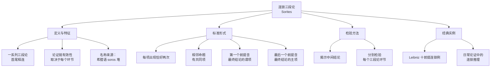

**相关笔记：** [[7.5 省略式三段论]] | [[7.7 析取三段论与假言三段论]]

> [!abstract] 概览
> 本节介绍==连锁三段论==（sorites），即由一系列三段论首尾相连构成的扩展论证。连锁三段论将多个前提通过共享词项串联起来，最终推出一个结论。其核心特征是：论证链的有效性取决于==每一个中间环节的有效性==。本节将系统讲解连锁三段论的定义与结构、标准式连锁三段论的形式要求、Leibniz 的经典十前提连锁例，以及连锁三段论的检验方法（揭示中间结论→分别检验每个环节）。

## 一、知识结构总览

## 二、核心思想与证明技巧

### 2.1 连锁三段论的定义

> [!def] 连锁三段论（Sorites）
> **连锁三段论**（sorites，源自希腊语 *sōros*，意为"堆"）是一种==由一系列三段论首尾相连构成的扩展论证==。在连锁三段论中，多个前提通过共享的词项串联起来，形成一条推理链，最终推出一个结论。每个中间结论被省略，只保留最终结论和所有前提。

> [!tip] "连锁"的直观理解
> 连锁三段论就像一条链条：每个前提是链条的一个环节，相邻环节通过共同的词项（"链扣"）连接。如果任何一个环节断裂（即某个三段论无效），整条链条就会断开——这就是"论证链的有效性取决于每个环节"的含义。
>
> 类比：如果 $A$ 推出 $B$，$B$ 推出 $C$，$C$ 推出 $D$，那么从 $A$ 可以推出 $D$。但如果中间任何一步推理无效（比如 $B$ 推不出 $C$），那么从 $A$ 到 $D$ 的整个推理链就不可靠。

### 2.2 标准式连锁三段论

> [!def] 标准式连锁三段论（Standard-form Sorites）
> 一个连锁三段论处于**标准形式**，当且仅当它满足以下条件：
> 1. **每个词项恰好出现两次**——第一个前提含最终结论的谓项，最后一个前提含最终结论的主项；
> 2. **相邻两个命题恰好有一个共同词项**——这就是连接相邻环节的"链扣"；
> 3. **所有中间结论被省略**，只保留前提和最终结论。

> [!example] 标准式连锁三段论的结构示意
>
> 以一个含四个前提的连锁三段论为例：
>
> > 所有 $A$ 是 $B$。——前提1
> > 所有 $B$ 是 $C$。——前提2
> > 所有 $C$ 是 $D$。——前提3
> > 所有 $D$ 是 $E$。——前提4
> > 所以，所有 $A$ 是 $E$。——结论
>
> **词项出现情况：**
> - $A$：前提1（主项）、结论（主项）→ 出现2次 ✓
> - $B$：前提1（谓项）、前提2（主项）→ 出现2次 ✓
> - $C$：前提2（谓项）、前提3（主项）→ 出现2次 ✓
> - $D$：前提3（谓项）、前提4（主项）→ 出现2次 ✓
> - $E$：前提4（谓项）、结论（谓项）→ 出现2次 ✓
>
> **相邻命题的共同词项：**
> - 前提1与前提2共享 $B$
> - 前提2与前提3共享 $C$
> - 前提3与前提4共享 $D$
> - 前提4与结论共享 $E$
>
> **揭示的中间结论：**
> - 所有 $A$ 是 $C$（由前提1 + 前提2推出）
> - 所有 $A$ 是 $D$（由中间结论 + 前提3推出）
> - 所有 $A$ 是 $E$（由中间结论 + 前提4推出）= 最终结论

### 2.3 Leibniz 的十前提连锁三段论

> [!example] Leibniz 的经典连锁推理
>
> Gottfried Wilhelm Leibniz（1646-1716）在其哲学著作中构造了一个著名的十前提连锁三段论，用于论证"这个世界是所有可能世界中最好的"（theodicy 问题）。简化版本如下：
>
> > 前提1：上帝是全知的。
> > 前提2：全知者知道所有可能世界。
> > 前提3：知道所有可能世界者能够比较它们。
> > 前提4：能够比较所有可能世界者知道哪个最好。
> > 前提5：知道哪个可能世界最好者是善的。
> > 前提6：善的存在会选择最好的。
> > 前提7：能选择最好世界者能创造它。
> > 前提8：能创造最好世界者会创造它。
> > 前提9：创造了最好世界者，这个世界就是最好的。
> > 前提10：这个世界是被上帝创造的。
> > 结论：这个世界是所有可能世界中最好的。
>
> **分析：** 这是一个典型的连锁三段论，每个前提通过共享词项与下一个前提相连，形成一条从"上帝是全知的"到"这个世界是最好的"的推理链。整条链条包含10个前提和9个隐含的中间结论。
>
> **注意：** 虽然这个论证在形式上可以表示为连锁三段论，但其每个前提的==内容真实性==是有争议的（例如前提7"能选择最好世界者能创造它"依赖于关于上帝能力的神学假设）。这再次说明：==形式有效不等于内容为真==。

### 2.4 连锁三段论的检验方法

> [!tip] 检验两步法
> 检验连锁三段论的有效性，遵循以下两个步骤：
>
> **第一步：揭示中间结论。** 将连锁三段论分解为一系列标准三段论，显式写出每个中间结论。
>
> **第二步：分别检验每个环节。** 对分解出的每一个三段论，用 [[6.5 直言三段论的15个有效形式]] 或 [[6.4 三段论规则与三段论谬误]] 检验其有效性。如果所有环节都有效，则整个连锁三段论有效；如果有任何一个环节无效，则整个连锁三段论无效。

> [!example] 检验方法的实例演示
>
> **连锁三段论：**
> > 所有 $A$ 是 $B$。
> > 所有 $B$ 是 $C$。
> > 没有 $C$ 是 $D$。
> > 所以，没有 $A$ 是 $D$。
>
> **第一步：揭示中间结论。**
>
> 分解为两个三段论：
>
> **环节1：** 前提1 + 前提2 → 中间结论
> > 所有 $A$ 是 $B$。——大前提（A）
> > 所有 $B$ 是 $C$。——小前提（A）
> > 所以，所有 $A$ 是 $C$。——中间结论（A）
>
> 形式：AAA-1（Barbara）→ ==有效== ✓
>
> **环节2：** 中间结论 + 前提3 → 最终结论
> > 没有 $C$ 是 $D$。——大前提（E）
> > 所有 $A$ 是 $C$。——小前提（A）
> > 所以，没有 $A$ 是 $D$。——最终结论（E）
>
> 形式：EAE-1（Celarent）→ ==有效== ✓
>
> **结论：** 两个环节都有效，因此整个连锁三段论==有效== ✓

> [!tip] 连锁三段论与传递性的关系
> 连锁三段论的有效性本质上是==类包含关系的传递性==（transitivity of class inclusion）的体现。如果 $A \subseteq B$ 且 $B \subseteq C$，则 $A \subseteq C$。连锁三段论将这种传递性推广到多个环节：如果 $A \subseteq B \subseteq C \subseteq \cdots \subseteq Z$，则 $A \subseteq Z$。但需要注意：传递性只对**肯定命题**（A 命题）的包含关系直接成立；当推理链中包含否定命题（E 或 O 命题）时，需要更仔细地检验每个环节。

## 三、补充理解与易混淆点

### 补充理解

> [!info] 补充1：Leibniz 与连锁推理的哲学应用
> **来源：** Leibniz, G.W. (1710). *Theodicy: Essays on the Goodness of God, the Freedom of Man and the Origin of Evil*. English translation, Open Court, 1985.
>
> Leibniz 在其《神正论》（*Theodicy*）中大量运用了连锁推理来论证其乐观主义哲学——"这个世界是所有可能世界中最好的"。Leibniz 的连锁推理不仅是一种逻辑技巧，更是其==理性主义哲学方法论==的体现。Leibniz 相信，通过将复杂的哲学问题分解为一系列简单的、自明的步骤，就可以像数学证明一样得出确定的结论。这种"链条式推理"（chain reasoning）的方法论影响了后来的许多哲学家，包括 Kant 对 Leibniz 的批判。Kant 在《纯粹理性批判》中指出，Leibniz 的连锁推理的问题不在于形式，而在于==前提的可接受性==——即使推理链在形式上有效，如果前提不可靠，结论也不可靠。这一批评至今仍是评估连锁三段论的重要原则。

> [!info] 补充2：论证链的现代逻辑分析
> **来源：** Thomason, R. (1970). *Symbolic Logic: An Introduction*. Macmillan.
>
> 在现代符号逻辑中，连锁三段论可以被精确地表示为==推理链==（chain of inferences）。Richmond Thomason 在《符号逻辑》中指出，连锁三段论的有效性可以用一阶逻辑的传递性规则来刻画：$\forall x(A(x) \rightarrow B(x)) \wedge \forall x(B(x) \rightarrow C(x)) \vdash \forall x(A(x) \rightarrow C(x))$。更一般地，一个含 $n$ 个前提的连锁三段论可以表示为：$\forall x(T_1(x) \rightarrow T_2(x)) \wedge \forall x(T_2(x) \rightarrow T_3(x)) \wedge \cdots \wedge \forall x(T_n(x) \rightarrow T_{n+1}(x)) \vdash \forall x(T_1(x) \rightarrow T_{n+1}(x))$。Thomason 还指出，当连锁推理中混合了否定命题时，传递性不再直接适用，需要使用更复杂的推理规则。现代逻辑通过==自然演绎系统==（natural deduction system）中的假言三段论规则（hypothetical syllogism）来处理这类推理，为连锁三段论提供了比传统三段论逻辑更强大的分析工具。

### 易混淆点

> [!warning] 误区：连锁三段论 = 一个很长的三段论
> ❌ **错误理解：** 连锁三段论就是一个"加长版"的直言三段论，只是前提更多而已，本质上和普通三段论没有区别。
> ✅ **正确理解：** 连锁三段论是==多个三段论的复合体==，而非一个"长三段论"。每个连锁三段论都可以分解为若干个标准三段论，每个三段论都有自己的中项、大项和小项。连锁三段论的有效性取决于分解后的**每一个**三段论是否有效，而非整体上的某种"扩展规则"。
> **辨析：** 连锁三段论与标准三段论的关系，类似于数学中"复合函数"与"简单函数"的关系。$f(g(h(x)))$ 不是"一个很长的函数"，而是三个函数的复合。同样，连锁三段论不是"一个很长的三段论"，而是多个三段论的链式复合。

> [!warning] 误区：论证链有效 = 结论一定为真
> ❌ **错误理解：** 如果连锁三段论的每个环节在形式上都有效，那么最终结论一定为真。
> ✅ **正确理解：** 连锁三段论的==形式有效性只保证"如果所有前提为真，则结论为真"==，并不保证前提实际上为真。一个连锁三段论可能形式上完全有效，但因为某个前提为假而导致结论不可靠。而且，连锁三段论的前提越多，"链条"越长，其中某个前提不可靠的概率就越大——这就是所谓的"链条越强，环节越弱"。
> **辨析：** 形式有效性与内容真实性是两个独立的问题。Leibniz 的十前提连锁三段论就是一个典型例子：即使每个环节在形式上都有效，如果前提1（"上帝是全知的"）或前提7（"能选择最好世界者能创造它"）不可靠，最终结论"这个世界是最好的"就不可靠。评估连锁三段论时，必须同时检验形式有效性和前提真实性。

---

## 四、习题精选

> [!todo] 习题概览
> | 题号 | 来源 | 核心考点 | 难度 |
> |:-----|:-----|:---------|:-----|
> | 1 | 自编 | 将连锁三段论翻译为标准形式 | ⭐⭐ |
> | 2 | 自编 | 揭示中间结论 | ⭐⭐ |
> | 3 | 自编 | 多前提连锁三段论的检验 | ⭐⭐⭐ |

---

### 题1：将连锁三段论翻译为标准形式

> [!problem] 题目
> 将以下连锁三段论排列为标准形式，指出每个词项出现的次数和相邻命题的共同词项：
>
> "所有猫都是动物；所有动物都是生物；所有生物都需要水；所以所有猫都需要水。"

> [!faq]- 解答
> **排列为标准形式：**
> > 所有猫（$A$）都是动物（$B$）。——前提1
> > 所有动物（$B$）都是生物（$C$）。——前提2
> > 所有生物（$C$）都需要水（$D$）。——前提3
> > 所以，所有猫（$A$）都需要水（$D$）。——结论
>
> **词项出现情况：**
> - $A$（猫）：前提1主项、结论主项 → 出现2次 ✓
> - $B$（动物）：前提1谓项、前提2主项 → 出现2次 ✓
> - $C$（生物）：前提2谓项、前提3主项 → 出现2次 ✓
> - $D$（需要水）：前提3谓项、结论谓项 → 出现2次 ✓
>
> **相邻命题的共同词项：**
> - 前提1与前提2共享 $B$（动物）
> - 前提2与前提3共享 $C$（生物）
> - 前提3与结论共享 $D$（需要水）
>
> 该连锁三段论满足标准形式的所有条件。$\blacksquare$

---

### 题2：揭示中间结论

> [!problem] 题目
> 对以下连锁三段论，揭示所有中间结论，并将整个推理链分解为标准三段论：
>
> "所有科学家都是学者；所有学者都热爱真理；没有热爱真理的人会故意造假；所以没有科学家会故意造假。"

> [!faq]- 解答
> **第一步：识别词项和命题。**
> - $A$ = 科学家，$B$ = 学者，$C$ = 热爱真理的人，$D$ = 故意造假的人
>
> > 所有 $A$ 是 $B$。——前提1
> > 所有 $B$ 是 $C$。——前提2
> > 没有 $C$ 是 $D$。——前提3
> > 所以，没有 $A$ 是 $D$。——结论
>
> **第二步：揭示中间结论并分解。**
>
> **环节1：** 前提1 + 前提2 → 中间结论1
> > 所有科学家（$A$）都是学者（$B$）。——大前提（A）
> > 所有学者（$B$）都是热爱真理的人（$C$）。——小前提（A）
> > 所以，所有科学家（$A$）都是热爱真理的人（$C$）。——中间结论1（A）
>
> 形式：AAA-1（Barbara）→ ==有效== ✓
>
> **环节2：** 中间结论1 + 前提3 → 最终结论
> > 没有热爱真理的人（$C$）是故意造假的人（$D$）。——大前提（E）
> > 所有科学家（$A$）都是热爱真理的人（$C$）。——小前提（A）
> > 所以，没有科学家（$A$）是故意造假的人（$D$）。——最终结论（E）
>
> 形式：EAE-1（Celarent）→ ==有效== ✓
>
> **结论：** 两个环节都有效，整个连锁三段论==有效== ✓
>
> $\blacksquare$

---

### 题3：多前提连锁三段论的检验

> [!problem] 题目
> 以下连锁三段论含五个前提。请将其排列为标准形式，揭示所有中间结论，分别检验每个环节，并判断整个连锁三段论是否有效：
>
> "所有哺乳动物都是脊椎动物；所有脊椎动物都有骨骼；鲸鱼是哺乳动物；没有没有骨骼的动物能在陆地上快速移动；所以鲸鱼不能在陆地上快速移动。"

> [!faq]- 解答
> **第一步：排列为标准形式。**
> - $A$ = 鲸鱼，$B$ = 哺乳动物，$C$ = 脊椎动物，$D$ = 有骨骼的动物，$E$ = 能在陆地上快速移动的动物
>
> > 所有鲸鱼（$A$）都是哺乳动物（$B$）。——前提1
> > 所有哺乳动物（$B$）都是脊椎动物（$C$）。——前提2
> > 所有脊椎动物（$C$）都是有骨骼的动物（$D$）。——前提3
> > 没有没有骨骼的动物（$D'$）是能在陆地上快速移动的动物（$E$）。——前提4
> > 所以，没有鲸鱼（$A$）是能在陆地上快速移动的动物（$E$）。——结论
>
> 注意：前提4中的"没有骨骼的动物"是 $D$ 的补集，需要先进行换质处理。对前提3"所有 $C$ 是 $D$"换质得"没有 $C$ 不是 $D$"，再结合前提4...
>
> 更简洁的处理方式：将前提4改写为"所有能在陆地上快速移动的动物都是有骨骼的动物"（即"所有 $E$ 是 $D$"，这是前提4"没有非 $D$ 是 $E$"的换位换质）。
>
> 重新排列：
> > 所有鲸鱼（$A$）都是哺乳动物（$B$）。——前提1
> > 所有哺乳动物（$B$）都是脊椎动物（$C$）。——前提2
> > 所有脊椎动物（$C$）都是有骨骼的动物（$D$）。——前提3
> > 所有能在陆地上快速移动的动物（$E$）都是有骨骼的动物（$D$）。——前提4
> > 所以，没有鲸鱼（$A$）是能在陆地上快速移动的动物（$E$）。——结论
>
> **第二步：揭示中间结论并分解。**
>
> **环节1：** 前提1 + 前提2 → 中间结论1
> > 所有鲸鱼（$A$）都是哺乳动物（$B$）。——前提1（A）
> > 所有哺乳动物（$B$）都是脊椎动物（$C$）。——前提2（A）
> > 所以，所有鲸鱼（$A$）都是脊椎动物（$C$）。——中间结论1（A）
>
> 形式：AAA-1（Barbara）→ ==有效== ✓
>
> **环节2：** 中间结论1 + 前提3 → 中间结论2
> > 所有鲸鱼（$A$）都是脊椎动物（$C$）。——中间结论1（A）
> > 所有脊椎动物（$C$）都是有骨骼的动物（$D$）。——前提3（A）
> > 所以，所有鲸鱼（$A$）都是有骨骼的动物（$D$）。——中间结论2（A）
>
> 形式：AAA-1（Barbara）→ ==有效== ✓
>
> **环节3：** 前提4 + 中间结论2 → 最终结论
> > 所有能在陆地上快速移动的动物（$E$）都是有骨骼的动物（$D$）。——前提4（A）
> > 所有鲸鱼（$A$）都是有骨骼的动物（$D$）。——中间结论2（A）
> > 所以，没有鲸鱼（$A$）是能在陆地上快速移动的动物（$E$）。——结论（E）
>
> 这里需要仔细分析。大前提"所有 $E$ 是 $D$"中 $E$ 是主项，$D$ 是谓项。小前提"所有 $A$ 是 $D$"中 $A$ 是主项，$D$ 是谓项。结论"没有 $A$ 是 $E$"中 $A$ 是主项，$E$ 是谓项。
>
> 中项 $D$ 在大前提中是谓项，在小前提中也是谓项 → **第二格**。
> 形式：**AAE-2**。
>
> 检查 [[6.5 直言三段论的15个有效形式]]：AAE-2 不在15个有效形式中。
>
> 用规则检验：
> - 结论是否定（E），所以恰好一个前提应是否定（规则5）→ 但两个前提都是 A（肯定）→ ==违反规则5：两个肯定前提不能得出否定结论== → **无效** ✗
>
> **结论：** 环节1和环节2有效，但==环节3无效==。因此整个连锁三段论==无效==。
>
> **分析失败原因：** 前提4"所有能在陆地上快速移动的动物都是有骨骼的动物"和中间结论2"所有鲸鱼都是有骨骼的动物"都肯定了鲸鱼和陆上快速移动动物属于"有骨骼的动物"这一类，但两个肯定前提不能推出否定结论。要从"鲸鱼有骨骼"和"陆上快速移动的动物有骨骼"推出"鲸鱼不能在陆地上快速移动"，需要的是"只有有骨骼的动物能在陆地上快速移动"（即"所有能在陆地上快速移动的动物都是有骨骼的动物"的**逆命题**"所有有骨骼的动物都能在陆地上快速移动"——但这恰好是错误的方向）。
>
> 正确的前提4应该是"所有能在陆地上快速移动的动物都需要四肢"（或其他鲸鱼不具备的特征），而非"所有能在陆地上快速移动的动物都有骨骼"（因为鲸鱼也有骨骼）。
>
> $\blacksquare$

> [!tip] 解题思路提示
> 1. **排列标准形式**：将所有前提和结论按顺序排列，确保每个词项恰好出现两次，相邻命题有共同词项。
> 2. **揭示中间结论**：从前往后，每两个相邻前提推出一个中间结论，用中间结论替代第二个前提，继续与下一个前提组合。
> 3. **分别检验**：对每个环节化为标准三段论，确定格和式，查15个有效形式表或用规则检验。
> 4. **整体判定**：所有环节都有效→连锁三段论有效；任一环节无效→连锁三段论无效。
> 5. **注意否定命题**：当推理链中包含否定命题（E 或 O）时，要特别小心检验，因为传递性不直接适用于否定关系。

## 五、视频学习指南

> [!info] 视频资源
> | 资源 | 链接 | 对应内容 | 备注 |
> |:-----|:-----|:---------|:-----|
> | Kevin deLaplante: Critical Thinking Academy | [链接](https://www.youtube.com/results?search_query=Kevin+deLaplante+sorites+chain+argument) | 连锁论证的分析方法 | 英文，适合入门 |
> | Gary Meegan: Logic Playlist | [链接](https://www.youtube.com/results?search_query=Gary+Meegan+sorites+categorical+syllogism) | 连锁三段论的分解与检验 | 英文，配合实例 |
> | Wireless Philosophy: Logical Arguments | [链接](https://www.youtube.com/results?search_query=Wireless+Philosophy+chain+arguments+logic) | 论证链的有效性分析 | 英文，短小精悍 |

## 六、教材原文

> [!quote] Copi, Cohen & McMahon, *Introduction to Logic* (15th ed.), Ch. 7.6
> "A **sorites** is a chain of categorical syllogisms in which the intermediate conclusions have been omitted. The name comes from the Greek word *sōros*, meaning 'heap' or 'pile', because a sorites heaps together several syllogisms into one extended argument."
>
> "To test a sorites for validity, we must first unpack it into its constituent syllogisms by supplying the missing intermediate conclusions. Then we test each constituent syllogism separately. If every syllogism in the chain is valid, the sorites as a whole is valid; if any one of them is invalid, the sorites is invalid."
>
> "In a standard-form sorites, the terms are arranged so that the predicate of the conclusion appears in the first premise, and the subject of the conclusion appears in the last premise. Each term occurs exactly twice, and each pair of adjacent propositions shares exactly one term."

## 参见 Wiki

- [[直言三段论]]：连锁三段论由多个标准直言三段论首尾相连构成
- [[三段论的式与格]]：检验每个环节时需要确定其式和格
- [[连锁三段论]]：连锁三段论的完整概念页
- [[三段论规则]]：除了查表外，也可以用三段论规则逐条检验每个环节
- [[有效性]]：连锁三段论的有效性是"条件有效性"——如果所有前提为真，则结论为真
- [[7.5 省略式三段论]]：连锁三段论省略了所有中间结论，是一种特殊的省略式论证

#学习/逻辑学/日常语言中的论证
