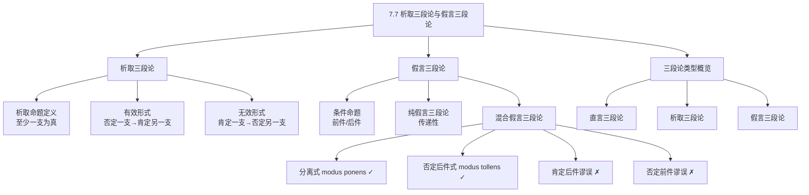

**相关笔记：** [[7.6 连锁三段论]] | [[7.8 二难推论]]

> [!abstract] 概览
> 本节介绍两种基于非直言命题的==三段论==形式：**析取三段论**（基于"或"命题）和**假言三段论**（基于"如果……则……"命题）。析取三段论的核心在于否定一支而肯定另一支；假言三段论则利用条件命题的传递性或分离/否定后件规则进行推理。本节重点区分有效形式与无效形式，帮助识别日常论证中的常见谬误。

## 一、知识结构总览

## 二、核心思想与证明技巧

### 析取三段论

> [!tip] 析取命题与析取三段论
> **析取命题**（disjunctive proposition）是包含"或"（$\lor$）的命题，断言其组成部分中==至少有一支为真==。析取三段论是以析取命题为前提之一的三段论。

**有效形式：否定一支 → 肯定另一支**

$$p \lor q$$
$$\neg p$$
$$\therefore q$$

这是有效的推理形式。因为析取命题断言"至少一支为真"，如果我们否定了其中一支，那么另一支必然为真。

**实例：**

> 纽约是世界最大城市，或者巴黎是世界最大城市。
> 纽约不是世界最大城市。
> ∴ 巴黎是世界最大城市。

**无效形式：肯定一支 → 否定另一支**

$$p \lor q$$
$$p$$
$$\therefore \neg q$$

这是==无效的==推理形式。因为析取命题中的"或"通常是**相容析取**（inclusive disjunction），即两支可以同时为真。肯定其中一支，并不能逻辑地推出另一支为假。

### 假言三段论

> [!tip] 条件命题与假言三段论
> **条件命题**（conditional proposition）是"如果 $p$ 则 $q$"形式的命题，其中 $p$ 为**前件**（antecedent），$q$ 为**后件**（consequent）。假言三段论是以条件命题为前提的三段论。

**1. 纯假言三段论（Pure Hypothetical Syllogism）**

所有前提和结论都是条件命题，利用==条件关系的传递性==进行推理：

$$p \to q$$
$$q \to r$$
$$\therefore p \to r$$

> [!example] 实例
> 如果天下雨，则地面湿。
> 如果地面湿，则比赛取消。
> ∴ 如果天下雨，则比赛取消。

**2. 混合假言三段论（Mixed Hypothetical Syllogism）**

一个条件命题前提加上一个直言命题前提，得出直言结论。

| 形式 | 结构 | 有效性 |
|:---|:---|:---|
| **分离式**（modus ponens） | $p \to q, \; p, \; \therefore q$ | ==有效== |
| **否定后件式**（modus tollens） | $p \to q, \; \neg q, \; \therefore \neg p$ | ==有效== |
| 肯定后件谬误 | $p \to q, \; q, \; \therefore p$ | ==无效== |
| 否定前件谬误 | $p \to q, \; \neg p, \; \therefore \neg q$ | ==无效== |

> [!def] 分离式（Modus Ponens）
> 如果前件为真，则后件必然为真。这是最基本的推理规则之一，形式为：$p \to q, \; p, \; \therefore q$。

> [!def] 否定后件式（Modus Tollens）
> 如果后件为假，则前件必然为假。形式为：$p \to q, \; \neg q, \; \therefore \neg p$。

### 三段论类型概览

| 类型 | 基本命题形式 | 特征 |
|:---|:---|:---|
| **直言三段论** | 全称/特称直言命题（A、E、I、O） | 包含三个词项，通过中项联结 |
| **析取三段论** | 析取命题（$p \lor q$） | 否定一支以肯定另一支 |
| **假言三段论** | 条件命题（$p \to q$） | 利用传递性或分离/否定后件规则 |

## 三、补充理解与易混淆点

### 补充理解

> [!info] 斯多葛学派与命题逻辑的起源
> **来源：** Bochenski, I.M. (1961). *A History of Formal Logic*, Ch. 4.
>
> 命题逻辑的历史可追溯至古希腊**斯多葛学派**（Stoics），以克里西普斯（Chrysippus）为代表。与亚里士多德侧重词项逻辑（三段论）不同，斯多葛学派系统研究了包含命题变元的推理形式，包括析取、条件、合取等命题联结词。斯多葛学派明确区分了**相容析取**（inclusive disjunction）与**不相容析取**（exclusive disjunction），并提出了类似于 modus ponens 和 modus tollens 的推理规则。这一传统在中世纪经院逻辑中得到继承和发展，最终融入现代符号逻辑体系。

> [!info] Modus Ponens 与 Modus Tollens 在现代逻辑中的地位
> **来源：** Church, A. (1956). *Introduction to Mathematical Logic*, §10.
>
> 在现代形式逻辑中，modus ponens（分离规则）和 modus tollens（否定后件规则）是命题演算和谓词演算中最基本的推理规则。Modus ponens 是多数公理系统中的==唯一推理规则==，即从 $A$ 和 $A \to B$ 可以推出 $B$。Modus tollens 则可由 modus ponens 结合其他公理（如反证法）推导得出。在自然演绎系统中，两者都被列为基本规则。这两个规则的可靠性（soundness）和完全性（completeness）是经典逻辑的基石，确保了从真前提出发必然推出真结论。

### 易混淆点

> [!warning] 误区：析取就是互斥的
> **❌ 错误理解：** 析取命题" $p$ 或 $q$ "意味着 $p$ 和 $q$ 只能有一个为真，不能同时为真。
>
> **✅ 正确理解：** 逻辑学中默认的析取是==相容析取==（inclusive disjunction），即"至少有一支为真"，两支可以同时为真。只有明确标注为"要么……要么……"时，才表示不相容析取（exclusive disjunction）。
>
> **辨析：** 这一混淆直接导致析取三段论中"肯定一支→否定另一支"的无效推理。例如，"他是医生或教师"——他可能既是医生又是教师。肯定"他是医生"不能推出"他不是教师"。日常语言中的"或"有时暗示互斥，但在逻辑分析中必须谨慎区分。

> [!warning] 误区：肯定后件等同于分离式
> **❌ 错误理解：** "如果 $p$ 则 $q$；$q$ 为真；所以 $p$ 为真"——这与分离式（modus ponens）一样有效。
>
> **✅ 正确理解：** 肯定后件（$p \to q, \; q, \; \therefore p$）是==无效推理==，犯了**肯定后件谬误**（fallacy of affirming the consequent）。条件命题只保证前件真时后件必真，但后件真时前件可能为假（后件可由其他原因导致）。
>
> **辨析：** 分离式是"肯定前件→肯定后件"（有效），而肯定后件谬误是"肯定后件→肯定前件"（无效）。类似地，否定前件谬误（$p \to q, \; \neg p, \; \therefore \neg q$）也是无效的。条件命题的==逻辑方向不可逆==，这是理解假言推理的关键。

## 四、习题精选

> [!todo] 习题概览
>
> | 题号 | 来源 | 核心考点 | 难度 |
> |:---:|:---|:---|:---:|
> | 1 | 本节内容 | 识别析取三段论的有效与无效形式 | ⭐⭐ |
> | 2 | 本节内容 | 识别假言三段论类型（纯假言/混合假言） | ⭐⭐ |
> | 3 | 本节内容 | 区分有效与无效的假言推理形式 | ⭐⭐⭐ |

### 题1：识别析取三段论的有效性

> [!problem] 题目
> 判断以下论证是有效的还是无效的，并说明理由：
>
> **论证A：** 张三会说法语或德语。张三会说法语。因此，张三不会说德语。
>
> **论证B：** 这份报告是手写的或是打印的。这份报告不是手写的。因此，这份报告是打印的。

> [!faq]- 解答
> **论证A：无效。**
>
> 形式化：$p \lor q, \; p, \; \therefore \neg q$
>
> 这是"肯定一支→否定另一支"的无效形式。析取命题"张三会说法语或德语"是相容析取，张三可能既会说法语又会说德语。肯定"会说法语"不能推出"不会说德语"。
>
> **论证B：有效。**
>
> 形式化：$p \lor q, \; \neg p, \; \therefore q$
>
> 这是"否定一支→肯定另一支"的有效形式。既然至少有一支为真，而"手写的"为假，则"打印的"必然为真。
>
> $\blacksquare$

> [!tip] 解题思路提示
> 1. 首先将论证形式化，用 $p \lor q$ 表示析取命题
> 2. 判断第二个前提是"肯定一支"还是"否定一支"
> 3. 回忆规则：否定一支→肯定另一支（有效），肯定一支→否定另一支（无效）
> 4. 注意析取默认为相容析取，除非有明确的互斥语境

### 题2：识别假言三段论类型

> [!problem] 题目
> 将以下论证归类为纯假言三段论或混合假言三段论，若是混合假言三段论，进一步指出其具体形式：
>
> **论证A：** 如果气温降到零度以下，水管会冻裂。如果水管冻裂，则需要维修。因此，如果气温降到零度以下，则需要维修。
>
> **论证B：** 如果这个数是偶数，则它能被2整除。这个数是偶数。因此，它能被2整除。
>
> **论证C：** 如果他努力复习，则他会通过考试。他没有通过考试。因此，他没有努力复习。

> [!faq]- 解答
> **论证A：纯假言三段论。**
>
> 所有前提和结论都是条件命题：$p \to q, \; q \to r, \; \therefore p \to r$。利用条件关系的传递性。
>
> **论证B：混合假言三段论——分离式（modus ponens）。**
>
> 形式：$p \to q, \; p, \; \therefore q$。条件命题前提 + 肯定前件 → 肯定后件。有效。
>
> **论证C：混合假言三段论——否定后件式（modus tollens）。**
>
> 形式：$p \to q, \; \neg q, \; \therefore \neg p$。条件命题前提 + 否定后件 → 否定前件。有效。
>
> $\blacksquare$

> [!tip] 解题思路提示
> 1. 检查所有前提和结论是否都是条件命题——若是，则为纯假言三段论
> 2. 若有一个直言命题前提，则为混合假言三段论
> 3. 对于混合假言三段论，看直言前提是肯定前件、否定后件、肯定后件还是否定前件
> 4. 对照四种形式（分离式、否定后件式、肯定后件谬误、否定前件谬误）进行归类

### 题3：区分有效与无效的假言推理形式

> [!problem] 题目
> 以下四个论证中，哪两个是有效的，哪两个是无效的？对无效论证指出其谬误名称。
>
> **(a)** 如果下雨，地面会湿。地面湿了。因此，下雨了。
>
> **(b)** 如果下雨，地面会湿。没有下雨。因此，地面没有湿。
>
> **(c)** 如果下雨，地面会湿。下雨了。因此，地面湿了。
>
> **(d)** 如果下雨，地面会湿。地面没有湿。因此，没有下雨。

> [!faq]- 解答
> **(a) 无效——肯定后件谬误。**
>
> 形式：$p \to q, \; q, \; \therefore p$。地面湿了可能因为其他原因（如洒水车），不能推出一定下雨了。
>
> **(b) 无效——否定前件谬误。**
>
> 形式：$p \to q, \; \neg p, \; \therefore \neg q$。没有下雨不代表地面不会湿，地面可能因其他原因变湿。
>
> **(c) 有效——分离式（modus ponens）。**
>
> 形式：$p \to q, \; p, \; \therefore q$。前件为真，后件必然为真。
>
> **(d) 有效——否定后件式（modus tollens）。**
>
> 形式：$p \to q, \; \neg q, \; \therefore \neg p$。后件为假，前件必然为假（逆否命题的逻辑）。
>
> $\blacksquare$

> [!tip] 解题思路提示
> 1. 将每个论证形式化为 $p \to q$ 加上一个直言前提
> 2. 识别直言前提操作的是前件还是后件，是肯定还是否定
> 3. 记住口诀："**肯前肯后**有效，**否后否前**有效；**肯后**和**否前**都无效"
> 4. 理解直觉：条件命题只说"前件真则后件真"，不承诺"后件真则前件真"或"前件假则后件假"

## 五、视频学习指南

> [!info] 视频资源
>
> | 资源名称 | 主题 | 语言 |
> |:---|:---|:---:|
> | *Introduction to Logic: Disjunctive and Hypothetical Syllogisms* | 析取三段论与假言三段论基础 | EN |
> | *Modus Ponens and Modus Tollens Explained* | 分离式与否定后件式的直观理解 | EN |
> | *Logical Fallacies: Affirming the Consequent* | 肯定后件谬误详解与实例 | EN |

## 六、教材原文

> [!quote]
> 析取三段论是一种包含析取（"或"）命题的三段论。析取命题断言其两个支命题中至少有一个为真。析取三段论的有效形式是通过否定其中一个支命题来肯定另一个支命题。需要注意的是，通过肯定一个支命题来否定另一个支命题是无效的，因为两个支命题可能同时为真。
>
> 假言三段论是一种包含条件（"如果……则……"）命题的三段论。纯假言三段论的所有命题都是条件命题，利用条件关系的传递性进行推理。混合假言三段论则包含一个条件命题和一个直言命题，其中分离式（modus ponens）和否定后件式（modus tollens）是有效形式，而肯定后件和否定前件则是常见的无效推理形式。

## 参见 Wiki

- [[直言三段论]]
- [[有效性]]
- [[谬误]]
- [[析取三段论]]：析取三段论的完整概念页
- [[假言三段论]]：假言三段论的完整概念页
- [[三段论谬误]]

#学习/逻辑学/日常语言中的论证
