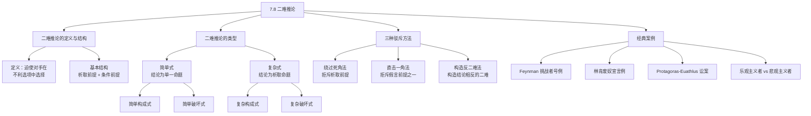

**相关笔记：** [[7.7 析取三段论与假言三段论]]

> [!abstract] 概览
> 本节介绍==二难推论==（dilemma），一种通过析取命题和条件命题的组合，迫使对手在不利的选项之间做出选择的论证形式。二难推论分为简单式与复杂式，各有两种构造方式（构成式与破坏式）。本节重点讲解三种驳斥二难推论的方法：绕过死角法、直击一角法和构造反二难法，并通过经典案例（如 Protagoras-Euathlus 讼案）展示二难推论在论证中的复杂应用。

## 一、知识结构总览

## 二、核心思想与证明技巧

### 二难推论的定义与结构

> [!tip] 二难推论的本质
> **二难推论**（dilemma）是一种复合论证形式，它向对手呈现两个（或多个）选项，无论选择哪一个都会导致不利后果，从而==迫使对手陷入困境==。其基本结构包含一个析取前提（列出选项）和两个（或多个）条件前提（说明每个选项的后果）。

二难推论的基本形式如下：

$$p \to r$$
$$q \to s$$
$$p \lor q$$
$$\therefore r \lor s$$

### 二难推论的四种类型

| 类型 | 条件前提 | 析取前提 | 结论 | 形式 |
|:---|:---|:---|:---|:---|
| **简单构成式** | $p \to r, \; q \to r$（后件相同） | $p \lor q$ | $r$ | 两路殊途同归 |
| **简单破坏式** | $p \to q, \; p \to r$（前件相同） | $\neg q \lor \neg r$ | $\neg p$ | 两条路都走不通 |
| **复杂构成式** | $p \to r, \; q \to s$ | $p \lor q$ | $r \lor s$ | 各有各的后果 |
| **复杂破坏式** | $p \to q, \; r \to s$ | $\neg q \lor \neg s$ | $\neg p \lor \neg r$ | 各路都有问题 |

> [!def] 简单构成式（Simple Constructive Dilemma）
> 两个条件前提的后件相同，析取前提给出两个前件选项，结论是共同的后件。形式：$p \to r, \; q \to r, \; p \lor q, \; \therefore r$。无论选 $p$ 还是 $q$，都导致同一个后果 $r$。

> [!def] 复杂构成式（Complex Constructive Dilemma）
> 两个条件前提的后件不同，析取前提给出两个前件选项，结论是后件的析取。形式：$p \to r, \; q \to s, \; p \lor q, \; \therefore r \lor s$。两个选项各有不同的不利后果。

### 经典实例

> [!example] Feynman 与挑战者号灾难
> 物理学家 Richard Feynman 在调查挑战者号航天飞机灾难时，面对 NASA 的二难处境：
>
> - 如果发射时温度过低，O型密封圈会失效 → 航天飞机爆炸
> - 如果推迟发射，则无法按时完成任务 → 项目面临巨大政治压力
> - 必须选择发射或不发射
> - ∴ 要么航天飞机爆炸，要么项目面临巨大政治压力

> [!example] 林肯与废奴宣言
> 林肯在辩论中运用二难推论论证奴隶制的矛盾：
>
> - 如果你反对奴隶制，你应该支持废奴宣言
> - 如果你支持奴隶制，你实际上在支持不人道的制度
> - 你要么反对奴隶制，要么支持奴隶制
> - ∴ 你应该支持废奴宣言，或者你在支持不人道的制度

### 三种驳斥二难推论的方法

> [!tip] 驳斥二难推论的三大策略
> 面对二难推论，有三种标准的驳斥方法。需要注意的是，这些方法并不证明二难推论的==推理形式==无效（二难推论的形式本身是有效的），而是攻击其==前提==的可接受性。

**1. 绕过死角法（Escaping between the Horns）**

拒斥==析取前提==，指出析取命题并未穷尽所有可能性，存在第三种选择。

> [!example] 绕过死角法示例
> 二难：你要么支持我们，要么反对我们。
> 驳斥：我可以保持中立。析取前提"支持或反对"并不穷尽所有选项。

**2. 直击一角法（Taking a Horn）**

拒斥==某个条件前提==，指出即使选择了某个选项，所断言的后果也不会发生。

> [!example] 直击一角法示例
> 二难：如果减税，则财政赤字增加；如果增税，则经济衰退。
> 驳斥：减税不一定导致赤字增加——如果同时削减支出，税收减少可以被支出减少所抵消。

**3. 构造反二难法（Constructing a Counter-Dilemma）**

构造一个新的二难推论，使用相同的前件选项但得出==相反的结论==。

> [!example] 构造反二难法示例
> 原二难：如果结婚，则有家庭烦恼；如果不结婚，则孤独终老。你总要结婚或不结婚。∴ 你要么有家庭烦恼，要么孤独终老。
>
> 反二难：如果结婚，则有家庭幸福；如果不结婚，则享有自由。你总要结婚或不结婚。∴ 你要么有家庭幸福，要么享有自由。

> [!warning] 注意
> 构造反二难法==并不等于驳倒==了原论证。反二难只是展示了从不同角度看问题可以得出不同的结论，但原二难和反二难可能各自有合理之处。要真正驳斥原二难，仍需回到绕过死角法或直击一角法。

### Protagoras-Euathlus 讼案

> [!example] 经典悖论：Protagoras 与 Euathlus
> 古希腊智者 Protagoras 教授 Euathlus 法律，约定：Euathlus 胜诉第一场官司后支付学费。
>
> **Protagoras 的二难：**
> - 如果 Euathlus 赢了这场官司，按约定他应支付学费
> - 如果 Euathlus 输了这场官司，按法庭判决他应支付学费
> - Euathlus 要么赢要么输
> - ∴ 无论哪种情况，Euathlus 都应支付学费
>
> **Euathlus 的反二难：**
> - 如果我赢了这场官司，按法庭判决我不需支付学费
> - 如果我输了这场官司，按约定我不需支付学费（因为尚未胜诉第一场官司）
> - 我要么赢要么输
> - ∴ 无论哪种情况，我都不需支付学费
>
> 这是一个==自我指涉悖论==，根源在于约定条款的自我参照性：这场官司本身既是判定学费的依据，又是触发约定条件的对象。

### 乐观主义者与悲观主义者的反二难

> [!example] 乐观主义者 vs 悲观主义者
> **悲观主义者的二难：**
> - 如果结婚，你会后悔
> - 如果不结婚，你也会后悔
> - ∴ 你要么后悔结婚，要么后悔不结婚
>
> **乐观主义者的反二难：**
> - 如果结婚，你会幸福
> - 如果不结婚，你也会幸福
> - ∴ 你要么幸福地结婚，要么幸福地单身
>
> 这两个二难的结论==并不真正对立==——"后悔"和"幸福"并非严格的逻辑矛盾。这说明了构造反二难法的一个局限：反二难的结论不一定与原结论构成矛盾对立，可能只是引入了不同的评价视角。

## 三、补充理解与易混淆点

### 补充理解

> [!info] Protagoras-Euathlus 悖论的逻辑分析
> **来源：** Rescher, N. (2001). *Paradoxes*.
>
> Protagoras-Euathlus 悖论是法律与逻辑交叉领域的经典案例，属于==自我指涉悖论==（self-referential paradox）的一种。其核心困难在于：约定中的"胜诉第一场官司"这一条件，与"这场关于学费的官司本身是否算作第一场官司"形成了循环定义。如果法庭判决 Euathlus 败诉（应支付学费），则按约定他尚未胜诉第一场官司，不应支付学费——产生矛盾。如果法庭判决 Euathlus 胜诉（不需支付学费），则按约定他已胜诉第一场官司，应支付学费——同样产生矛盾。Rescher 指出，这类悖论的解决通常需要引入元层次（meta-level）的规则来打破自我参照的循环，例如规定这场特定官司不纳入"第一场官司"的计算范围。

> [!info] 二难推论在法律论证中的应用
> **来源：** Feteris, E. (1999). *Fundamentals of Legal Argumentation*.
>
> 二难推论在法律论证中具有广泛的应用。律师经常利用二难推论向陪审团或法官展示对方立场的不利后果。例如，在刑事辩护中，辩护律师可能构造如下二难：如果被告有罪，则公诉方必须排除合理怀疑地证明；如果公诉方未能排除合理怀疑，则应判决无罪。公诉方面临的二难是：要么充分举证（可能做不到），要么接受无罪判决。Feteris 指出，法律论证中的二难推论往往涉及==事实前提与规范前提==的交织，驳斥时通常需要针对事实前提（直击一角法）或指出法律规则的例外情形（绕过死角法）。

### 易混淆点

> [!warning] 误区：二难推论是一种逻辑谬误
> **❌ 错误理解：** 二难推论是错误的论证形式，因为它们试图"困住"对手，属于诡辩术。
>
> **✅ 正确理解：** 二难推论的==推理形式本身是有效的==（它是析取三段论与假言三段论的有效组合）。问题可能出在前提上——析取前提可能未穷尽选项，条件前提可能不成立。形式有效不等于论证可靠（sound），可靠论证要求形式有效且前提真实。
>
> **辨析：** 区分"有效性"（validity）与"可靠性"（soundness）是关键。二难推论的形式是有效的，但如果前提有问题，整个论证就不可靠。驳斥二难推论正是通过攻击前提（而非推理形式）来实现的。

> [!warning] 误区：构造反二难等于驳倒了原论证
> **❌ 错误理解：** 只要我能构造一个反二难，就说明原二难推论被驳倒了。
>
> **✅ 正确理解：** 构造反二难只是==引入了不同的视角或评价标准==，展示了对同一组选项可以得出不同的结论。反二难本身也可能有前提问题，且其结论不一定与原结论构成逻辑矛盾。
>
> **辨析：** 反二难的价值在于揭示论证的复杂性——同一件事从不同角度看可能有不同的评价。但它并不构成对原论证的逻辑反驳。要真正驳斥原二难，仍需使用绕过死角法（证明析取前提不穷尽）或直击一角法（证明某个条件前提不成立）。乐观主义者与悲观主义者的例子清楚地说明了这一点：两个二难可以同时"成立"，因为它们的结论并不矛盾。

## 四、习题精选

> [!todo] 习题概览
>
> | 题号 | 来源 | 核心考点 | 难度 |
> |:---:|:---|:---|:---:|
> | 1 | 本节内容 | 识别二难推论的类型（简单/复杂，构成/破坏） | ⭐⭐ |
> | 2 | 本节内容 | 运用三种驳斥方法分析给定的二难推论 | ⭐⭐⭐ |
> | 3 | 本节内容 | 分析 Protagoras-Euathlus 悖论的逻辑结构 | ⭐⭐⭐ |

### 题1：识别二难推论的类型

> [!problem] 题目
> 判断以下二难推论属于哪种类型（简单构成式、简单破坏式、复杂构成式、复杂破坏式），并写出其形式：
>
> **论证A：** 如果他诚实，他会承认错误；如果他勇敢，他也会承认错误。他要么诚实，要么勇敢。因此，他会承认错误。
>
> **论证B：** 如果这笔投资赚钱，你就不该撤资；如果这笔投资亏钱，你也不该追加。这笔投资要么赚钱要么亏钱。因此，你既不该撤资也不该追加。
>
> **论证C：** 如果降低利率，则通货膨胀加剧；如果提高利率，则经济增长放缓。利率要么降低要么提高。因此，要么通货膨胀加剧，要么经济增长放缓。

> [!faq]- 解答
> **论证A：简单构成式。**
>
> 形式：$p \to r, \; q \to r, \; p \lor q, \; \therefore r$
>
> 两个条件前提的后件相同（"承认错误"），结论是单一命题。两路殊途同归。
>
> **论证B：复杂破坏式。**
>
> 形式：$p \to q, \; r \to s, \; \neg q \lor \neg s, \; \therefore \neg p \lor \neg r$
>
> 令 $p$="投资赚钱"，$q$="不该撤资"，$r$="投资亏钱"，$s$="不该追加"。析取前提否定了两个后件，结论是否定两个前件的析取。
>
> **论证C：复杂构成式。**
>
> 形式：$p \to r, \; q \to s, \; p \lor q, \; \therefore r \lor s$
>
> 两个条件前提的后件不同（"通货膨胀加剧"与"经济增长放缓"），结论是后件的析取。
>
> $\blacksquare$

> [!tip] 解题思路提示
> 1. 首先检查两个条件前提的后件是否相同——相同则为"简单式"，不同则为"复杂式"
> 2. 检查析取前提操作的是前件还是后件——操作前件为"构成式"，操作后件为"破坏式"
> 3. 组合判断：简单/复杂 + 构成/破坏 = 四种类型之一
> 4. 将论证中的命题替换为变元，写出标准形式

### 题2：运用三种驳斥方法

> [!problem] 题目
> 以下二难推论被提出，请分别用三种驳斥方法各给出一个驳斥：
>
> **二难推论：** 如果你努力学习，你没有时间娱乐；如果你不努力学习，你会考试不及格。你要么努力学习，要么不努力学习。因此，你要么没有时间娱乐，要么考试不及格。

> [!faq]- 解答
> **1. 绕过死角法（拒斥析取前提）：**
>
> 析取前提"努力学习或不努力学习"看似穷尽，但实际上存在中间状态：你可以==适度学习==，既不完全投入也不完全放弃。适度学习可以保证及格，同时保留一定的娱乐时间。因此，析取前提并未穷尽所有可能性。
>
> **2. 直击一角法（拒斥条件前提之一）：**
>
> 质疑第一个条件前提："努力学习"不一定意味着"没有时间娱乐"。高效的学习方法可以在较短时间内完成学习任务，仍然留有娱乐时间。学习效率是关键变量，该条件前提忽略了效率因素。
>
> **3. 构造反二难法：**
>
> 如果你努力学习，你会获得知识和成就感；如果你不努力学习，你有大量自由时间享受生活。你要么努力学习，要么不努力学习。因此，你要么获得知识和成就感，要么有大量自由时间享受生活。
>
> $\blacksquare$

> [!tip] 解题思路提示
> 1. 绕过死角法：寻找析取前提中缺失的选项，问自己"是否只有这两种选择？"
> 2. 直击一角法：选择一个条件前提，问"这个条件关系真的成立吗？有没有例外？"
> 3. 构造反二难法：保持相同的析取前提，但替换条件前提中的后果为积极评价
> 4. 注意：构造反二难法并不真正驳倒原论证，它只是提供了不同视角

### 题3：分析 Protagoras-Euathlus 悖论

> [!problem] 题目
> 分析 Protagoras-Euathlus 讼案中，为什么双方都能构造出看似合理的二难推论？这个悖论的核心问题是什么？你认为应如何解决？

> [!faq]- 解答
> **双方二难的合理性分析：**
>
> Protagoras 的二难依赖于两个前提：
> - 前提1：如果 Euathlus 胜诉，则按约定应支付学费（因为已胜诉第一场官司）
> - 前提2：如果 Euathlus 败诉，则按法庭判决应支付学费
>
> Euathlus 的反二难依赖于两个前提：
> - 前提1：如果 Euathlus 胜诉，则按法庭判决不需支付学费
> - 前提2：如果 Euathlus 败诉，则按约定不需支付学费（因为尚未胜诉第一场官司）
>
> **悖论的核心问题：**
>
> 这个悖论的核心在于==自我指涉==（self-reference）。约定中的条件"胜诉第一场官司"与这场关于学费的官司本身形成了循环：
> - 这场官司的结果决定了学费是否应支付
> - 但学费是否应支付又取决于这场官司是否算作"第一场胜诉"
> - 判定标准依赖于判定结果本身，形成无法解脱的逻辑循环
>
> **解决思路：**
>
> 引入==元层次规则==打破循环。例如：
> - 规定这场关于学费的官司不计入"第一场官司"的统计，从而 Euathlus 尚未触发约定条件，Protagoras 暂时不能要求支付学费
> - 或者规定约定中的"第一场官司"仅指涉及第三方当事人的案件，排除师生之间的费用纠纷
> - 这类解决方案的本质是将判定标准从自我参照的层次提升到更高的元层次
>
> $\blacksquare$

> [!tip] 解题思路提示
> 1. 分别写出 Protagoras 和 Euathlus 的二难形式，对比两者的条件前提
> 2. 注意两方对"胜诉"和"败诉"后果的解读使用了不同的规则来源（约定 vs 法庭判决）
> 3. 识别自我指涉结构：这场官司既是判定工具，又是判定对象
> 4. 思考如何通过引入外部规则或元层次约定来打破循环

## 五、视频学习指南

> [!info] 视频资源
>
> | 资源名称 | 主题 | 语言 |
> |:---|:---|:---:|
> | *Introduction to Logic: Dilemmas* | 二难推论的定义、类型与实例 | EN |
> | *How to Respond to a Dilemma* | 三种驳斥方法的详细讲解 | EN |
> | *The Protagoras Paradox* | Protagoras-Euathlus 悖论的哲学分析 | EN |

## 六、教材原文

> [!quote]
> 二难推论是一种论证形式，它向对手呈现两个选项（"角"），并论证无论选择哪一个都会导致不利后果。二难推论由一个析取前提和两个（或多个）条件前提组成。驳斥二难推论有三种标准方法：绕过死角法（证明析取前提不穷尽所有可能性）、直击一角法（证明某个条件前提不成立）、构造反二难法（构造一个结论相反的二难推论）。需要注意的是，构造反二难法并不等于驳倒了原论证，它只是展示了从不同角度可以得出不同结论。

## 参见 Wiki

- [[谬误]]
- [[有效性]]
- [[二难推论]]：二难推论的完整概念页
- [[直言三段论]]
- [[三段论规则]]

#学习/逻辑学/日常语言中的论证
