# 第07章 日常语言中的论证 — 章节汇总

---

## 一、全章知识框架

```mermaid
graph TB
    A["第7章 日常语言中的论证"] --> B["7.1 三段论论证"]
    A --> C["7.2 词项归约"]
    A --> D["7.3 标准化"]
    A --> E["7.4 协同翻译"]
    A --> F["7.5 省略式三段论"]
    A --> G["7.6 连锁三段论"]
    A --> H["7.7 析取与假言三段论"]
    A --> I["7.8 二难推论"]

    B --> B1["广义三段论论证定义"]
    B --> B2["三种偏离类型"]
    B --> B3["化归标准形式"]

    C --> C1["同义词消除：6词项→3词项"]
    C --> C2["补类消除：4词项→3词项"]
    C --> C3["多步化归：组合运用"]

    D --> D1["九种非标准命题翻译方法"]
    D --> D2["除外命题→合取式"]

    E --> E1["参项概念：时间/地点/情形"]
    E --> E2["协同翻译三步法"]
    E --> E3["参项充当中项"]

    F --> F1["三种省略类型"]
    F --> F2["补全+检验两步法"]
    F --> F3["最强论证原则"]

    G --> G1["连锁三段论sorites"]
    G --> G2["揭示中间结论"]
    G --> G3["逐环节检验有效性"]

    H --> H1["析取三段论：否定一支→肯定另一支"]
    H --> H2["假言三段论：modus ponens/tollens"]
    H --> H3["无效形式：肯定后件/否定前件"]

    I --> I1["简单/复杂、构成/破坏四种类型"]
    I --> I2["三种驳斥方法"]
    I --> I3["Protagoras-Euathlus悖论"]
```

---

## 二、核心知识点汇总

### 7.1 三段论论证

> [!def] 三段论论证（广义）
> ==三段论论证==是指满足以下条件之一的演绎论证：(1) 已经是标准式直言三段论；(2) 可以通过==有保证的变形操作==化归为标准式直言三段论。

> [!tip] 三种偏离类型
> | 偏离类型 | 描述 | 处理方法 |
> |:---------|:-----|:---------|
> | **① 顺序不标准** | 结论出现在前提之前，或前提顺序颠倒 | 重新排列为"大前提—小前提—结论" |
> | **② 词项超三个** | 使用同义词或补类导致词项数量超过三个 | 词项归约（→ 7.2 节） |
> | **③ 命题非标准** | 命题不呈现为标准 A/E/I/O 形式 | 命题标准化（→ 7.3 节） |

### 7.2 词项归约

> [!tip] 词项归约三步法
> | 步骤 | 技术名称 | 操作方法 | 典型场景 |
> |:-----|:---------|:---------|:---------|
> | 1 | ==同义词消除== | 识别同一概念的不同表述，统一为一个词项 | 6 词项 → 3 词项 |
> | 2 | ==补类消除== | 运用[[直接推论]]（换质/换位）消除补类 | 4 词项 → 3 词项 |
> | 3 | ==多步化归== | 组合同义词消除与补类消除，分步处理 | 混合情况 |

> [!info] 化归不唯一但有效性一致
> 同一论证可能存在多条化归路径，得到不同式与格的标准形式。但所有正确的化归路径都保持论证的有效性，不同标准形式在逻辑上等价。

### 7.3 直言命题的标准化

> [!tip] 九种非标准命题翻译方法速查表
> | 序号 | 偏离类型 | 翻译方法 | 示例 |
> |:----:|:---------|:---------|:-----|
> | ① | 单称命题 | 视主项为单元类，译为 A/E 命题 | "苏格拉底是人" → A |
> | ② | 形容词谓项 | 补充名词（"事物""人"等） | "花是美丽的" → "花是美丽的事物" |
> | ③ | 非标准动词 | 改写为"是"结构 | "猫抓老鼠" → "猫是抓老鼠的动物" |
> | ④ | 非标准语序 | 重排主谓顺序 | "值得信赖的是诚实的人" → "所有诚实的人都是值得信赖的" |
> | ⑤ | 非标准量词 | 标准量词替换 | "not every" → O；"not any" → E |
> | ⑥ | 排斥命题"只有" | ==主谓互换 + "所有"== | "只有S是P" → "所有P都是S" |
> | ⑦ | 无明确量词 | 语境确定 | "狗是忠诚的" → A 或 I（看语境） |
> | ⑧ | 非标准但可翻译 | 逻辑等价变换 | "没有人是完美的" → E |
> | ⑨ | ==除外命题== | ==合取式（两个命题）== | "除S外都是P" → 否定命题 ∧ 全称命题 |

> [!warning] 除外命题的特殊性
> 除外命题是九种情况中==唯一不能化为单一直言命题==的。它必须翻译为两个直言命题的逻辑合取，因为其本质是复合命题。

### 7.4 协同翻译

> [!def] 参项（Parameter）
> ==参项==是日常语言命题中隐含的限定性要素，通常涉及**时间**（when）、**地点**（where）或**情形**（circumstances）等维度。

> [!tip] 协同翻译三步法
> 1. **识别参项**：确定命题中隐含的参项（时间/地点/情形）
> 2. **引入统一参项，构造三个命题**：用同一个参项作为中项，构造两个前提和一个结论
> 3. **检验有效性**：化为标准三段论，查 [[6.5 直言三段论的15个有效形式]] 或用文恩图检验

> [!info] 协同翻译的关键原则
> - **统一参项**：三个命题必须使用同一个参项作为中项
> - **保持逻辑结构**：翻译后的三段论必须忠实于原论证的推理结构
> - **合理选择词项**：参项的具体表述需根据语境灵活选择

### 7.5 省略式三段论

> [!def] 省略式三段论（Enthymeme）
> ==省略式三段论==是一种不完整的三段论论证，其中大前提、小前提或结论有一个被省略。被省略的部分通常是说话者认为不言自明或语境中已隐含的命题。

> [!tip] 省略式三段论检验两步法
> | 步骤 | 操作 | 要点 |
> |:-----|:-----|:-----|
> | **第一步：恢复省略部分** | 根据语境补全被省略的命题 | 遵循==忠实性原则==和==最强论证原则== |
> | **第二步：检验有效性** | 化为标准形式，查有效形式表或用规则检验 | 确定式与格，逐条检查 |

> [!warning] 最强论证原则
> 在合理范围内，应选择使论证==有效==的补全方式。如果存在多种合理的补全方式，优先选择使论证有效的那个。但即使形式有效，也需批判性地评估补全的前提是否合理。

### 7.6 连锁三段论

> [!def] 连锁三段论（Sorites）
> ==连锁三段论==是由一系列三段论首尾相连构成的扩展论证。多个前提通过共享词项串联，形成推理链，所有中间结论被省略，只保留最终结论。

> [!tip] 连锁三段论检验方法
> 1. **揭示中间结论**：将连锁三段论分解为一系列标准三段论，显式写出每个中间结论
> 2. **分别检验每个环节**：对分解出的每一个三段论检验有效性
> 3. **整体判定**：所有环节都有效 → 整个连锁三段论有效；任一环节无效 → 整个连锁三段论无效

> [!info] 标准式连锁三段论的形式要求
> - 每个词项恰好出现两次
> - 相邻两个命题恰好有一个共同词项（"链扣"）
> - 第一个前提含最终结论的谓项，最后一个前提含最终结论的主项

### 7.7 析取三段论与假言三段论

> [!tip] 析取/假言三段论有效形式表
> | 类型 | 形式 | 名称 | 有效性 |
> |:-----|:-----|:-----|:-------|
> | 析取三段论 | $p \lor q,\; \neg p,\; \therefore q$ | 否定一支→肯定另一支 | ==有效== |
> | 纯假言三段论 | $p \to q,\; q \to r,\; \therefore p \to r$ | 条件传递性 | ==有效== |
> | 混合假言（分离式） | $p \to q,\; p,\; \therefore q$ | ==Modus Ponens== | ==有效== |
> | 混合假言（否定后件式） | $p \to q,\; \neg q,\; \therefore \neg p$ | ==Modus Tollens== | ==有效== |
> | 析取三段论（无效） | $p \lor q,\; p,\; \therefore \neg q$ | 肯定一支→否定另一支 | ==无效== |
> | 混合假言（肯定后件） | $p \to q,\; q,\; \therefore p$ | ==肯定后件谬误== | ==无效== |
> | 混合假言（否定前件） | $p \to q,\; \neg p,\; \therefore \neg q$ | ==否定前件谬误== | ==无效== |

> [!tip] 假言推理口诀
> "**肯前肯后**有效，**否后否前**有效；**肯后**和**否前**都无效。"

### 7.8 二难推论

> [!tip] 二难推论四种类型
> | 类型 | 条件前提 | 析取前提 | 结论 | 直觉 |
> |:-----|:---------|:---------|:-----|:-----|
> | **简单构成式** | $p \to r,\; q \to r$（后件相同） | $p \lor q$ | $r$ | 两路殊途同归 |
> | **简单破坏式** | $p \to q,\; p \to r$（前件相同） | $\neg q \lor \neg r$ | $\neg p$ | 两条路都走不通 |
> | **复杂构成式** | $p \to r,\; q \to s$ | $p \lor q$ | $r \lor s$ | 各有各的后果 |
> | **复杂破坏式** | $p \to q,\; r \to s$ | $\neg q \lor \neg s$ | $\neg p \lor \neg r$ | 各路都有问题 |

> [!tip] 二难推论三种驳斥方法表
> | 驳斥方法 | 攻击目标 | 策略 | 示例 |
> |:---------|:---------|:-----|:-----|
> | ==绕过死角法== | 析取前提 | 指出析取未穷尽所有可能性，存在第三种选择 | "支持或反对" → 可以保持中立 |
> | ==直击一角法== | 某个条件前提 | 指出即使选择了某个选项，所断言的后果也不会发生 | "减税→赤字" → 可同时削减支出 |
> | ==构造反二难法== | 评价视角 | 构造结论相反的二难推论 | "结婚→幸福；不结婚→自由" |

> [!warning] 构造反二难法 ≠ 驳倒原论证
> 反二难只是引入了不同的视角或评价标准，其结论不一定与原结论构成逻辑矛盾。要真正驳斥原二难，仍需使用绕过死角法或直击一角法。

---

## 三、学习脉络

> [!info] 学习脉络
> 本章的学习路径分为三个阶段，从"化归标准形式"到"非标准论证处理"再到"扩展三段论类型"：
>
> **第一阶段：化归标准形式（7.1 - 7.4）**
>
> 这是本章的核心基础。日常语言中的论证极少以标准式直言三段论的完美形态出现，因此需要系统化的化归技术：
> - [[7.1 三段论论证]] 界定广义三段论论证概念，识别三种偏离类型
> - [[7.2 词项数量归约为三]] 解决词项超三个的问题（同义词消除、补类消除、多步化归）
> - [[7.3 直言命题的标准化]] 提供九种翻译方法，将非标准命题化为 A/E/I/O 形式
> - [[7.4 协同翻译]] 处理含有参项（时间/地点/情形）的命题，引入统一参项作为中项
>
> **第二阶段：非标准论证处理（7.5 - 7.6）**
>
> 化归技术掌握后，转向两种常见的非标准论证结构：
> - [[7.5 省略式三段论]] 处理省略了某个部分的三段论，通过"恢复+检验"两步法评估
> - [[7.6 连锁三段论]] 处理由多个三段论首尾相连构成的扩展论证链，通过揭示中间结论逐环节检验
>
> **第三阶段：扩展三段论类型（7.7 - 7.8）**
>
> 超越直言三段论的范围，引入基于析取命题和条件命题的论证形式：
> - [[7.7 析取三段论与假言三段论]] 介绍析取推理和假言推理的有效形式（modus ponens、modus tollens 等），区分有效与无效形式
> - [[7.8 二难推论]] 介绍二难推论的四种类型和三种驳斥方法，展示复合论证的分析技巧
>
> **学习建议**：本章是第6章直言三段论知识的直接延伸和实际应用。建议重点掌握：(1) 九种非标准命题翻译方法（尤其是"只有"和除外命题）；(2) 词项归约的操作技巧；(3) 省略式三段论的补全策略；(4) 析取/假言三段论的有效与无效形式区分；(5) 二难推论的三种驳斥方法。其中第6章的15个有效形式和6条规则贯穿全章，是检验化归后论证有效性的核心工具。

---

## 四、跨章关联

| 本章概念 | 关联章节 | 关联概念 | 关联类型 | 说明 |
|:---------|:---------|:---------|:---------|:-----|
| 三段论化归 | 第6章 直言三段论 | [[6.5 直言三段论的15个有效形式]]、[[三段论的式与格]] | 核心依赖 | 化归的最终目标是运用第6章的15个有效形式表和6条规则检验日常论证的有效性 |
| 词项归约 | 第5章 直言命题 | [[直接推论]]（换位/换质/换质位） | 工具依赖 | 补类消除的核心技术是第5章的换质法和换位法 |
| 省略式三段论 | 第4章 谬误 | [[非形式谬误的四大类]]（预设谬误、丐题） | 深化关系 | 省略式三段论中被省略的前提可能隐藏预设谬误或丐题；补全过程需要警惕这些谬误 |
| 析取/假言三段论 | 第8章 符号逻辑 | 命题演算（待学） | 前置铺垫 | 本章的 modus ponens、modus tollens 等推理形式将在第8章符号逻辑中得到精确的形式化处理 |
| 二难推论 | 第4章 谬误 | [[谬误]]（虚假两难） | 具体关联 | 二难推论中析取前提未穷尽选项的问题，对应第4章中的虚假两难谬误 |
| 连锁三段论 | 第6章 直言三段论 | [[直言三段论]]、[[有效性]] | 扩展应用 | 连锁三段论是多个标准直言三段论的链式复合，其检验依赖第6章的基本工具 |
| 协同翻译 | 第3章 语言与定义 | [[外延与内涵]]、[[属加种差定义]] | 语义基础 | 协同翻译中参项的选择和词项的构造依赖于对概念外延和内涵的准确理解 |
| 除外命题 | 第5章 直言命题 | [[布尔解释]]、[[存在谬误]] | 深化关系 | 除外命题的复合结构反映了直言命题框架的局限性，指向符号逻辑的必要性 |

---

## 五、复习题

> [!problem] 综合题1：日常语言论证的完整化归与有效性检验
> 给定以下日常语言论证：
>
> "所以，没有哲学家是富翁。因为所有富翁都是贪婪的，而哲学家都不是贪婪的人。"
>
> 请完成以下操作：
> 1. 识别结论和前提，重排为标准顺序
> 2. 进行词项归约（如有必要），确保恰好三个词项
> 3. 将每个命题标准化为 A/E/I/O 形式
> 4. 写出标准式直言三段论，指出大项 $P$、小项 $S$、中项 $M$
> 5. 确定其式和格
> 6. 用第6章的方法检验其有效性（查15个有效形式表或用规则检验）

> [!faq]- 参考答案
> **[步骤1] 识别结论和前提，重排标准顺序**
>
> "所以"之后为结论："没有哲学家是富翁。"
> "因为"之后为前提：
> - 前提1："所有富翁都是贪婪的。"
> - 前提2："哲学家都不是贪婪的人。"
>
> 标准顺序：大前提 → 小前提 → 结论
>
> **[步骤2] 词项归约**
>
> 列出所有词项：
> - 哲学家（出现2次：前提2、结论）
> - 富翁（出现2次：前提1、结论）
> - 贪婪的 / 贪婪的人（同义词，可归约为1个词项）
>
> 归约后恰好3个词项 ✓
>
> **[步骤3] 标准化**
>
> - "所有富翁都是贪婪的" → "所有富翁都是贪婪的人"（A 命题）
> - "哲学家都不是贪婪的人" → "没有哲学家是贪婪的人"（E 命题）
> - "没有哲学家是富翁" → 已是标准形式（E 命题）
>
> **[步骤4] 写出标准式直言三段论**
>
> - 结论谓项"富翁" = 大项 $P$
> - 结论主项"哲学家" = 小项 $S$
> - 前提中出现但结论中不出现的"贪婪的人" = 中项 $M$
>
> 标准形式：
> > 所有富翁（$P$）都是贪婪的人（$M$）。——大前提（A）
> > 没有哲学家（$S$）是贪婪的人（$M$）。——小前提（E）
> > 所以，没有哲学家（$S$）是富翁（$P$）。——结论（E）
>
> **[步骤5] 确定式和格**
>
> - 式：A、E、E → ==AEE==
> - 中项 $M$ 在大前提中做谓项，在小前提中也做谓项 → ==第二格==
> - 完整形式：==AEE-2==
>
> **[步骤6] 检验有效性**
>
> 查15个有效形式表：AEE-2（Camestres）在表中 ✓
>
> 用规则检验：
> - 规则1：三个项，含义一致 ✓
> - 规则2：中项 $M$ 在大前提中做谓项（A命题谓项不周延），在小前提中做谓项（E命题谓项周延）→ 中项至少周延一次 ✓
> - 规则3：结论E命题中 $P$ 周延，$P$ 在大前提A命题中做主项（周延）✓；$S$ 在结论E命题中周延，$S$ 在小前提E命题中做主项（周延）✓
> - 规则4：恰好一个否定前提（小前提E）✓
> - 规则5：有否定前提，结论为否定 ✓
> - 规则6：结论为全称，前提均为全称 ✓
>
> ==该论证有效==（AEE-2，Camestres）。
>
> $\blacksquare$

> [!problem] 综合题2：省略式三段论的补全、检验与谬误分析
> 给定以下省略式三段论：
>
> "所有优秀的学生都热爱学习，所以小王一定不是优秀的学生。"
>
> 请完成以下操作：
> 1. 指出省略了哪个部分（大前提、小前提还是结论）
> 2. 根据最强论证原则补全省略部分
> 3. 写出完整的三段论标准形式，指出大项 $P$、小项 $S$、中项 $M$
> 4. 确定其式和格，检验有效性
> 5. 如果论证无效，指出其谬误名称；如果有效，批判性地评估补全的前提是否合理

> [!faq]- 参考答案
> **[步骤1] 识别省略部分**
>
> "所以"之后为结论："小王一定不是优秀的学生。"（E 命题）
> 明确前提："所有优秀的学生都热爱学习。"（A 命题）
>
> - 大项 $P$ = "优秀的学生"（结论谓项）
> - 小项 $S$ = "小王"（结论主项）
> - 明确前提含 $P$ → 大前提
> - ==省略了小前提==
>
> **[步骤2] 补全省略部分**
>
> 小前提需要包含小项 $S$（"小王"）和中项 $M$。
> 中项 $M$ = "热爱学习的人"（大前提的谓项）。
>
> 按照最强论证原则，补全小前提为："没有小王是热爱学习的人。"（E 命题）
>
> **[步骤3] 写出完整标准形式**
>
> > 所有优秀的学生（$P$）都是热爱学习的人（$M$）。——大前提（A）
> > 没有小王（$S$）是热爱学习的人（$M$）。——小前提（E）
> > 所以，没有小王（$S$）是优秀的学生（$P$）。——结论（E）
>
> **[步骤4] 确定式和格，检验有效性**
>
> - 式：A、E、E → ==AEE==
> - 中项 $M$ 在大前提中做谓项，在小前提中也做谓项 → ==第二格==
> - 完整形式：==AEE-2（Camestres）==
>
> Camestres 在15个有效形式表中 ✓ → ==该论证形式上有效==。
>
> **[步骤5] 批判性评估**
>
> 虽然论证在形式上有效，但补全的小前提"没有小王是热爱学习的人"是一个==需要事实支撑的强断言==。在日常对话中，说话者可能只是观察到小王不爱学习，但这并不等同于"小王完全不热爱学习"。
>
> 此外，如果换一种补全方式——补全小前提为"小王不是热爱学习的人"（O 命题），则三段论变为 AEO-2，这不在15个有效形式之中（违反规则5：否定前提应得出否定结论，但这里结论为否定而只有一个否定前提——实际上 AEO-2 中大前提A为肯定、小前提O为否定、结论E为否定，恰好一个否定前提得出否定结论，规则5通过；但规则6要求两全称前提不得特称结论，这里结论E为全称而小前提O为特称，不违反规则6。进一步检查：中项 $M$ 在大前提A中做谓项不周延，在小前提O中做谓项不周延 → ==中项不周延谬误==）。
>
> 这说明：==补全方式的选择直接影响有效性判定==。按照最强论证原则选择使论证有效的补全（E 命题），论证有效；但如果补全为更温和的 O 命题，则论证无效。在实际分析中，需要根据语境判断哪种补全更忠实于说话者的意图。
>
> $\blacksquare$

---

## 六、各节笔记索引

| 节号 | 标题 | 笔记链接 | 核心内容 |
|:-----|:-----|:---------|:---------|
| 7.1 | 三段论论证 | [[7.1 三段论论证]] | 广义三段论论证定义、三种偏离类型（顺序不标准/词项超三个/命题非标准）、化归标准形式的必要性 |
| 7.2 | 词项数量归约为三 | [[7.2 词项数量归约为三]] | 同义词消除、补类消除（换质/换位）、多步化归、化归路径不唯一但有效性一致 |
| 7.3 | 直言命题的标准化 | [[7.3 直言命题的标准化]] | 九种非标准命题翻译方法、除外命题的复合结构（合取式）、存在含义问题 |
| 7.4 | 协同翻译 | [[7.4 协同翻译]] | 参项概念（时间/地点/情形）、协同翻译三步法、参项充当中项、Barbara 与 Camestres 实例 |
| 7.5 | 省略式三段论 | [[7.5 省略式三段论]] | 三种省略类型（省大前提/省小前提/省结论）、恢复+检验两步法、最强论证原则、福尔摩斯实例 |
| 7.6 | 连锁三段论 | [[7.6 连锁三段论]] | Sorites 定义与结构、揭示中间结论、逐环节检验、Leibniz 十前提连锁例 |
| 7.7 | 析取三段论与假言三段论 | [[7.7 析取三段论与假言三段论]] | 析取三段论有效/无效形式、纯假言三段论（传递性）、modus ponens/tollens、肯定后件/否定前件谬误 |
| 7.8 | 二难推论 | [[7.8 二难推论]] | 四种类型（简单/复杂 × 构成/破坏）、三种驳斥方法（绕过死角/直击一角/构造反二难）、Protagoras-Euathlus 悖论 |

#学习/逻辑学/第07章/章节汇总
