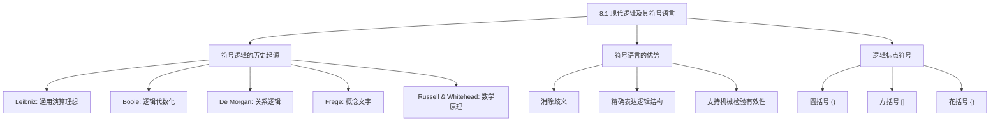

**相关笔记：** [[7.8 二难推论]] | [[8.2 真值函项性：简单陈述与复合陈述]]

> [!abstract] 概览
> 本节介绍现代符号逻辑的历史渊源与核心动机。从 Leibniz 的"通用演算"理想出发，历经 Boole 的类代数、De Morgan 的关系逻辑，到 Frege 的《概念文字》和 Russell 的《数学原理》，现代逻辑逐步建立起一套精确的符号语言系统。本节重点阐述==符号语言相比自然语言的三大优势==——消除歧义、精确表达、机械检验——并介绍逻辑标点符号（括号、方括号、花括号）在消除结构歧义中的关键作用。

## 一、知识结构总览

## 二、核心思想与证明技巧

> [!tip] 核心思想：为什么要用符号语言？
> 自然语言（如中文、英文）虽然表达力丰富，但存在三大缺陷：
> 1. **歧义性**：同一个句子可以有多种解读。例如"如果天下雨并且路滑，那么比赛取消"中，"并且"和"如果-那么"的作用范围可能不明确。
> 2. **非形式化**：自然语言缺乏严格的语法规则来界定逻辑结构，使得有效性检验无法机械化。
> 3. **冗余性**：自然语言中大量修辞、语气等元素干扰逻辑分析。
>
> 符号语言通过以下手段解决这些问题：
> - 用**逻辑常项**（如 $·, ∨, ⊃, ≡, \sim$）精确对应逻辑联结词
> - 用**逻辑标点符号**（括号、方括号、花括号）明确标示作用范围
> - 用**命题变项**（如 $p, q, r$）代表简单陈述
>
> 这样，任何论证的有效性都可以通过==机械化的真值表方法==来检验，而不依赖于直觉。

> [!tip] 逻辑标点符号的使用规则
> 逻辑标点符号的作用类似于数学中的括号，用于消除**组合歧义**。三种标点符号的优先级为：
> - **花括号** $\{ \}$ —— 最外层分组
> - **方括号** $[ \ ]$ —— 中间层分组
> - **圆括号** $(\ )$ —— 最内层分组
>
> 例如，复合陈述 $p · q ∨ r$ 是有歧义的（是 $(p · q) ∨ r$ 还是 $p · (q ∨ r)$？），但 $[p · (q ∨ r)]$ 则明确表示先计算析取，再计算合取。

## 三、补充理解与易混淆点

### 补充理解

> [!info] Leibniz 的通用演算理想
> **来源：** Leibniz, G.W. (1666). *De Arte Combinatoria*.
>
> Gottfried Wilhelm Leibniz 被公认为现代符号逻辑的先驱。他在 1666 年的《论组合术》中提出了一个雄心勃勃的计划：建立一套==通用特征（characteristica universalis）==和==通用演算（calculus ratiocinator）==。通用特征是一种能够精确表达所有人类思想的符号系统，而通用演算则是一套基于这些符号进行推理的演算规则。Leibniz 设想，一旦有了这样的系统，任何哲学或科学争论都可以通过"让我们计算吧！"（Calculemus!）来解决。虽然 Leibniz 本人未能完成这一计划，但他的思想深刻影响了后来的 Boole、Frege 和 Russell，成为现代符号逻辑的精神源头。

> [!info] Frege《概念文字》与现代逻辑的诞生
> **来源：** Frege, G. (1879). *Begriffsschrift*.
>
> Gottlob Frege 于 1879 年发表的《概念文字：一种模仿算术语言构造的纯思维的形式语言》（*Begriffsschrift, eine der arithmetischen nachgebildete Formelsprache des reinen Denkens*）标志着现代逻辑的正式诞生。Frege 的三大贡献是：第一，他首次引入了==量词（全称量词 $\forall$ 和存在量词 $\exists$）==，使得谓词逻辑（即一阶逻辑）的表达能力远超传统三段论逻辑；第二，他建立了第一个形式化的演绎系统，包括公理和推理规则；第三，他明确区分了"意义"（Sinn）和"指称"（Bedeutung），这一区分对分析哲学产生了深远影响。Frege 的工作虽然在当时未被广泛理解，但后来被 Russell 和 Whitehead 在《数学原理》中继承和发展。

### 易混淆点

> [!warning] 误区："符号逻辑就是数学"
> ❌ **错误理解：** 符号逻辑只是数学的一个分支，学习符号逻辑就是在学数学。
>
> ✅ **正确理解：** 符号逻辑是==逻辑学的一个分支==，它使用数学化的符号来研究推理的结构。逻辑学和数学的关系是：逻辑学为数学提供基础（数学推理的有效性依赖逻辑规则），但逻辑学本身的研究对象是==推理形式的有效性==，而不仅仅是数学对象。
>
> **辨析：** 符号逻辑确实借用了数学的符号化方法（这一点 Boole 的贡献尤为突出），但它的研究主题——什么构成有效推理、论证的结构分析——是哲学和逻辑学的核心问题。符号逻辑是哲学、数学和计算机科学的交叉领域。

> [!warning] 误区："自然语言无法精确表达逻辑"
> ❌ **错误理解：** 自然语言完全无法精确表达逻辑关系，必须用符号语言才能做逻辑分析。
>
> ✅ **正确理解：** 自然语言==可以==表达逻辑关系，但存在歧义风险。符号语言是对自然语言逻辑结构的==抽象和精确化==，它消除了歧义，但并不取代自然语言。
>
> **辨析：** 自然语言中的"如果……那么……"、"或者"等联结词在特定语境下可以表达清晰的逻辑关系。问题在于，自然语言缺乏一种内置的机制来唯一确定复杂陈述的逻辑结构。符号语言通过标点符号和严格的语法规则解决了这一问题。符号语言是自然语言逻辑结构的"元语言"工具，而非替代品。

## 四、习题精选

> [!todo] 习题概览
>
> | 题号 | 来源 | 核心考点 | 难度 |
> |:---:|:---:|:---:|:---:|
> | 1 | Copi §8.1 | 符号语言的优势分析 | ⭐ |
> | 2 | Copi §8.1 | 逻辑标点符号消除歧义 | ⭐⭐ |
> | 3 | Copi §8.1 | 符号逻辑历史脉络 | ⭐ |

### 题1：符号语言的优势

> [!problem] 题目
> 请举例说明自然语言在表达逻辑论证时可能产生的歧义，并说明符号语言如何消除这种歧义。

> [!faq]- 解答
> **示例：** 考虑自然语言陈述"如果天下雨并且路滑，那么比赛取消"。
>
> - **解读一：**（如果天下雨）并且（如果路滑，那么比赛取消）—— 符号化为 $p · (q ⊃ r)$
> - **解读二：** 如果（天下雨并且路滑），那么比赛取消 —— 符号化为 $(p · q) ⊃ r$
>
> 这两种解读具有完全不同的真值条件。例如，当天下雨但路不滑且比赛取消时：
> - 解读一：$T · (F ⊃ T) = T · T = T$（真）
> - 解读二：$(T · F) ⊃ T = F ⊃ T = T$（真）
>
> 虽然此例中两者碰巧同真，但在其他赋值下可能不同。符号语言通过==逻辑标点符号==明确区分这两种结构，消除了歧义。
>
> $\blacksquare$

> [!tip] 解题思路提示
> 1. 选择一个包含多个逻辑联结词的自然语言陈述
> 2. 展示该陈述至少有两种合理的逻辑解读
> 3. 用符号语言分别表示两种解读
> 4. 通过真值赋值说明两种解读可能在某些情况下真值不同

### 题2：逻辑标点符号

> [!problem] 题目
> 请为以下符号表达式添加适当的逻辑标点符号，使其含义分别对应两种不同的解读：
> $p ⊃ q · r$

> [!faq]- 解答
>
> **解读一：** 如果 $p$，则 $q$ 并且 $r$（蕴涵联结词的主联结词地位）
> $$p ⊃ (q · r)$$
> 含义：$p$ 为真时，$q$ 和 $r$ 必须同时为真。
>
> **解读二：** （如果 $p$ 则 $q$）并且 $r$（合取为主联结词）
> $$(p ⊃ q) · r$$
> 含义：$p$ 蕴涵 $q$ 必须成立，同时 $r$ 必须为真。
>
> **验证差异：** 令 $p = F, q = F, r = F$
> - 解读一：$F ⊃ (F · F) = F ⊃ F = T$
> - 解读二：$(F ⊃ F) · F = T · F = F$
>
> 两者真值不同，证实了添加标点符号的必要性。
>
> $\blacksquare$

> [!tip] 解题思路提示
> 1. 识别表达式中包含的逻辑算子（此处为 $⊃$ 和 $·$）
> 2. 分别以每个算子为主联结词进行分组
> 3. 用括号标示不同的分组方式
> 4. 通过反例真值赋值验证两种解读确实不同

### 题3：符号逻辑历史

> [!problem] 题目
> 按时间顺序排列以下逻辑学家，并简述每位对现代符号逻辑的核心贡献：
> Leibniz、Boole、De Morgan、Frege、Russell。

> [!faq]- 解答
>
> 1. **Gottfried Wilhelm Leibniz**（1646–1716）：提出"通用演算"和"通用特征"的理想，设想用一套精确的符号系统来机械化推理过程。
> 2. **George Boole**（1815–1864）：在《逻辑的数学分析》（1847）和《思维的规律研究》（1854）中，将逻辑代数化，建立了布尔代数，证明了逻辑推理可以用代数运算来表示。
> 3. **Augustus De Morgan**（1806–1871）：在形式逻辑领域做出了基础性贡献，特别是提出了 De Morgan 定律（$\sim(p · q) \equiv \sim p ∨ \sim q$ 和 $\sim(p ∨ q) \equiv \sim p · \sim q$），并开创了关系逻辑的研究。
> 4. **Gottlob Frege**（1848–1925）：在《概念文字》（1879）中建立了第一个完整的谓词逻辑形式系统，引入量词，标志着现代逻辑的正式诞生。
> 5. **Bertrand Russell**（1872–1970）：与 Whitehead 合著《数学原理》（1910–1913），试图将全部数学建立在逻辑基础之上，系统化了现代符号逻辑。
>
> $\blacksquare$

> [!tip] 解题思路提示
> 1. 按出生年份排列逻辑学家的时间顺序
> 2. 每位逻辑学家提取一个最具代表性的贡献
> 3. 注意贡献之间的继承和发展关系（如 Boole 影响 Frege，Frege 影响 Russell）

## 五、视频学习指南

> [!info] 视频资源
>
> | 资源名称 | 讲者/来源 | 主题 | 时长 |
> |:---|:---|:---|:---:|
> | *The History of Logic* | Crash Course Philosophy | 符号逻辑发展简史 | ~10 min |
> | *Frege and the Language of Logic* | Massimo Pigliucci | Frege《概念文字》解读 | ~15 min |
> | *Symbolic Logic Introduction* | Michael Dummett (lecture) | 符号语言的基本原理 | ~45 min |

## 六、教材原文

> [!quote]
> "The purpose of symbolic logic is to achieve clarity of expression and rigor of argument. By using symbols instead of words, we can avoid the ambiguities inherent in natural language and subject arguments to precise, mechanical tests of validity."
>
> —— Copi, *Introduction to Logic*, 15th ed., §8.1

## 参见 Wiki

- [[有效性]]
- [[假言三段论]]

#学习/逻辑学/命题逻辑Ⅰ
