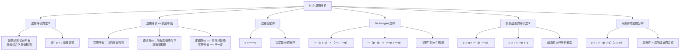

**相关笔记：** [[8.9 陈述形式与实质等值]] | [[8.11 三大"思想法则"：逻辑的原理]]

> [!abstract] 概览
> 本节深入探讨**逻辑等价**（logical equivalence）的概念，并将其与上一节引入的**实质等值**（material equivalence）进行严格区分。逻辑等价比实质等值更强：它要求两个陈述形式在==所有==真值指派下都具有相同的真值。本节系统介绍了命题逻辑中最重要的逻辑等价关系，包括**双重否定律**、**De Morgan 定律**、**实质蕴涵的定义等价式**以及**双条件陈述的分解等价式**。这些等价关系是后续形式证明（第9章）中替换规则的理论基础。核心知识点包括：
> - **逻辑等价 vs 实质等值**：前者更强，允许互相替换
> - **逻辑等价的定义**：两陈述形式在所有真值组合下有相同真值，即其实质等值是重言式
> - **双重否定律**：$p \equiv \sim\sim p$
> - **De Morgan 定律**：$\sim(p \lor q) \equiv (\sim p \cdot \sim q)$、$\sim(p \cdot q) \equiv (\sim p \lor \sim q)$
> - **实质蕴涵定义**：$p \supset q \equiv \sim(p \cdot \sim q) \equiv \sim p \lor q$
> - **双条件陈述分解**：$p \equiv q \equiv (p \supset q) \cdot (q \supset p)$

---

## 一、知识结构总览

---

## 二、核心思想与证明技巧

### 逻辑等价的定义与核心区分

> [!def] 逻辑等价（Logical Equivalence）
> 两个陈述形式 $P$ 和 $Q$ 是**逻辑等价的**，当且仅当在==所有可能的真值指派下==，$P$ 和 $Q$ 都具有相同的真值。用符号表示为 $P \equiv Q$（注意：这里的 $\equiv$ 表示逻辑等价关系，而非实质等值联结词）。
>
> 等价地：$P$ 和 $Q$ 是逻辑等价的，当且仅当 $P \equiv Q$（作为实质等值联结词）是一个==重言式==。

> [!tip] 核心区分：逻辑等价 vs 实质等值
> | 比较维度 | 实质等值（Material Equivalence） | 逻辑等价（Logical Equivalence） |
> |:---------|:--------------------------------|:-------------------------------|
> | 符号 | $p \equiv q$（作为联结词） | $P \equiv Q$（作为关系） |
> | 要求 | 在==当前特定==真值指派下同真或同假 | 在==所有==真值指派下都同真或同假 |
> | 强度 | 较弱 | 较强 |
> | 替换性 | 不保证可以互相替换 | ==可以安全地互相替换== |
> | 判定方法 | 查看当前真值 | 构造真值表，检查所有行 |

**关键推论：** 如果两个陈述形式是逻辑等价的，那么在任何论证中，用一个替换另一个==不会改变论证的有效性==。这是第9章中"替换规则"（Rule of Replacement）的理论基础。

### 双重否定律（Double Negation）

> [!def] 双重否定律
> **双重否定律**指出：一个陈述与其双重否定是逻辑等价的。
> $$p \equiv \sim\sim p$$

真值表验证：

| $p$ | $\sim p$ | $\sim\sim p$ | $p \equiv \sim\sim p$ |
|:---:|:---:|:---:|:---:|
| T | F | T | **T** |
| F | T | F | **T** |

最后一列全为 T，因此 $p \equiv \sim\sim p$ 是重言式，$p$ 与 $\sim\sim p$ 逻辑等价。

> [!tip] 直觉理解
> 双重否定律说的是"否定之否定等于肯定"——对一个陈述否定两次，就回到了原来的陈述。这意味着==否定是一种可逆操作==。在日常语言中，"不是不 guilty"等于"guilty"。

### De Morgan 定律

> [!def] De Morgan 定律
> **De Morgan 定律**是命题逻辑中最重要的等价关系之一，它揭示了==否定与合取/析取之间的转换关系==：
>
> $$\sim(p \lor q) \equiv (\sim p \cdot \sim q)$$
> $$\sim(p \cdot q) \equiv (\sim p \lor \sim q)$$
>
> 用自然语言表述：
> - "并非（$p$ 或 $q$）"等价于"非 $p$ 且非 $q$"
> - "并非（$p$ 且 $q$）"等价于"非 $p$ 或非 $q$"

真值表验证（以第一条为例）：

| $p$ | $q$ | $p \lor q$ | $\sim(p \lor q)$ | $\sim p$ | $\sim q$ | $\sim p \cdot \sim q$ | $\sim(p \lor q) \equiv (\sim p \cdot \sim q)$ |
|:---:|:---:|:---:|:---:|:---:|:---:|:---:|:---:|
| T | T | T | F | F | F | F | **T** |
| T | F | T | F | F | T | F | **T** |
| F | T | T | F | T | F | F | **T** |
| F | F | F | T | T | T | T | **T** |

最后一列全为 T，验证成立。

> [!tip] 记忆技巧
> De Morgan 定律的操作规则：==否定号"穿入"括号时，$\lor$ 变 $\cdot$，$\cdot$ 变 $\lor$==。可以类比为分配律的"否定版本"——否定号就像一个"转换开关"，穿入括号的同时翻转联结词。

> [!tip] 推广到 $n$ 个陈述
> De Morgan 定律可以推广到任意有限个陈述：
> $$\sim(p_1 \lor p_2 \lor \cdots \lor p_n) \equiv (\sim p_1 \cdot \sim p_2 \cdot \cdots \cdot \sim p_n)$$
> $$\sim(p_1 \cdot p_2 \cdot \cdots \cdot p_n) \equiv (\sim p_1 \lor \sim p_2 \lor \cdots \lor \sim p_n)$$

### 实质蕴涵的等价定义

> [!def] 实质蕴涵的等价定义
> 实质蕴涵 $p \supset q$ 有两个重要的逻辑等价形式：
>
> $$p \supset q \equiv \sim(p \cdot \sim q)$$
> $$p \supset q \equiv \sim p \lor q$$
>
> 这三个表达式在所有真值指派下具有相同的真值，它们是同一个逻辑关系的不同表达方式。

真值表验证（$p \supset q \equiv \sim p \lor q$）：

| $p$ | $q$ | $p \supset q$ | $\sim p$ | $\sim p \lor q$ | $(p \supset q) \equiv (\sim p \lor q)$ |
|:---:|:---:|:---:|:---:|:---:|:---:|
| T | T | T | F | T | **T** |
| T | F | F | F | F | **T** |
| F | T | T | T | T | **T** |
| F | F | T | T | T | **T** |

> [!tip] 直觉理解
> - $p \supset q \equiv \sim(p \cdot \sim q)$："如果 $p$ 则 $q$"等价于"不可能 $p$ 为真而 $q$ 为假"——这正是蕴涵的"核心含义"
> - $p \supset q \equiv \sim p \lor q$："如果 $p$ 则 $q$"等价于"或者 $p$ 为假，或者 $q$ 为真"——当 $p$ 为假时蕴涵自动为真（空真），当 $p$ 为真时要求 $q$ 也为真

### 双条件陈述的分解

> [!def] 双条件陈述的分解等价式
> 双条件陈述 $p \equiv q$ 可以分解为两个蕴涵的合取：
> $$p \equiv q \equiv (p \supset q) \cdot (q \supset p)$$
>
> 这说明"当且仅当"（if and only if）实际上包含两个方向的条件关系：正向蕴涵和逆向蕴涵。

真值表验证：

| $p$ | $q$ | $p \supset q$ | $q \supset p$ | $(p \supset q) \cdot (q \supset p)$ | $p \equiv q$ | $(p \equiv q) \equiv [(p \supset q) \cdot (q \supset p)]$ |
|:---:|:---:|:---:|:---:|:---:|:---:|:---:|
| T | T | T | T | T | T | **T** |
| T | F | F | T | F | F | **T** |
| F | T | T | F | F | F | **T** |
| F | F | T | T | T | T | **T** |

> [!tip] 应用价值
> 这个等价式在数学证明中极为重要。当我们需要证明"当且仅当"命题时，通常需要==分别证明两个方向==：先证"若 $p$ 则 $q$"（必要性），再证"若 $q$ 则 $p$"（充分性）。双条件陈述的分解等价式为这种证明策略提供了逻辑基础。

---

## 三、补充理解与易混淆点

### 补充理解

> [!info] 补充1：De Morgan 与形式代数的历史背景
> **来源：** De Morgan, A. (1847). *Formal Logic: or, The Calculus of Inference, Necessary and Probable*, Chapter 4.
>
> 奥古斯塔斯·德·摩根（Augustus De Morgan）是19世纪英国数学家和逻辑学家，他在1847年出版的《形式逻辑》中系统阐述了以他命名的定律。De Morgan 定律的深刻意义在于：它揭示了==否定运算与合取/析取运算之间的对偶性==（duality）。在布尔代数中，这种对偶性表现为：对整个表达式取否定，等价于对每个子表达式取否定并将运算符互换（$\cdot$ 换成 $\lor$，$\lor$ 换成 $\cdot$）。De Morgan 本人在书中指出，这一对偶性不仅适用于两个运算项，而且可以推广到任意有限个运算项。这一推广后来成为布尔代数和数字电路设计中的基本定理——在电路设计中，De Morgan 定律允许我们将任何逻辑门电路转换为仅使用与非门（NAND）或仅使用或非门（NOR）的等价电路，这是集成电路设计的基础。

> [!info] 补充2：逻辑等价与替换规则的理论基础
> **来源：** Whitehead, A.N. & Russell, B. (1910). *Principia Mathematica*, *9.
>
> 怀特海和罗素在《数学原理》中首次系统阐述了"替换规则"（Rule of Replacement）的逻辑基础。替换规则允许：==在任何命题中，如果一个子表达式可以被另一个与之逻辑等价的表达式替换，替换后的命题与原命题逻辑等价==。这一规则与"代入规则"（Rule of Substitution）有本质区别：代入规则只能用具体陈述替换命题变元（如用 $A$ 替换 $p$），而替换规则可以用一个复杂的表达式替换另一个与之等价的复杂表达式（如用 $\sim p \lor q$ 替换 $p \supset q$）。Whitehead 和 Russell 在 *9 中指出，替换规则的合法性依赖于逻辑等价的传递性：如果 $A \equiv B$ 且 $B \equiv C$，则 $A \equiv C$。这一性质保证了在多步替换后，最终表达式仍然与原表达式逻辑等价，从而确保论证的有效性不受影响。

### 易混淆点

> [!warning] 误区：实质等值可以互相替换
> ❌ **错误理解：** 既然 $p \equiv q$ 为真（实质等值成立），那么在任何论证中都可以用 $p$ 替换 $q$，反之亦然。
> ✅ **正确理解：** 只有==逻辑等价==的两个陈述才能安全地互相替换。实质等值只说明两个陈述在==当前特定真值指派下==碰巧同真或同假，但在其他真值指派下可能不同。如果用实质等值但不逻辑等价的陈述进行替换，==可能导致论证从有效变为无效==。
> **辨析：** 考虑论证"如果天下雨则地湿；天下雨；所以地湿"（$R \supset W, R, \therefore W$）。如果用某个与 $W$ 实质等值但逻辑不等价的陈述替换 $W$（比如"今天刮风"——碰巧与"地湿"同真），替换后的论证"如果天下雨则刮风；天下雨；所以刮风"显然不一定有效。只有逻辑等价才能保证替换的安全性。

> [!warning] 误区：De Morgan 定律只适用于两个陈述
> ❌ **错误理解：** De Morgan 定律的形式是 $\sim(p \lor q) \equiv (\sim p \cdot \sim q)$ 和 $\sim(p \cdot q) \equiv (\sim p \lor \sim q)$，因此它只能处理两个陈述的合取或析取。
> ✅ **正确理解：** De Morgan 定律可以==推广到任意有限个陈述==。对于 $n$ 个陈述 $p_1, p_2, \ldots, p_n$：
> $$\sim(p_1 \lor p_2 \lor \cdots \lor p_n) \equiv (\sim p_1 \cdot \sim p_2 \cdot \cdots \cdot \sim p_n)$$
> $$\sim(p_1 \cdot p_2 \cdot \cdots \cdot p_n) \equiv (\sim p_1 \lor \sim p_2 \lor \cdots \lor \sim p_n)$$
> 推广的证明可以通过数学归纳法完成：基例（$n=2$）即标准 De Morgan 定律；归纳步骤利用合取和析取的结合律。
> **辨析：** 教材中通常以两个陈述的形式引入 De Morgan 定律是为了简洁和直观，但这并不意味着定律的适用范围仅限于此。在布尔代数和集合论中，De Morgan 定律的一般形式是基本定理，适用于任意有限（甚至无限）个元素的并集和交集的补运算。

---

## 四、习题精选

> [!todo] 习题概览
> | 题号 | 来源 | 核心考点 | 难度 |
> |:---:|:---|:---------|:---:|
> | 1 | 自编 | 用真值表验证 De Morgan 定律 | ⭐⭐ |
> | 2 | 自编 | 运用逻辑等价关系化简复杂陈述形式 | ⭐⭐⭐ |
> | 3 | 自编 | 利用等价关系进行命题替换 | ⭐⭐ |

### 题1：验证 De Morgan 定律

> [!problem] 题目
> 用真值表验证 De Morgan 定律的第二条：$\sim(p \cdot q) \equiv (\sim p \lor \sim q)$。

> [!faq]- 解答
> **[步骤1]** 构造真值表：
>
> | $p$ | $q$ | $p \cdot q$ | $\sim(p \cdot q)$ | $\sim p$ | $\sim q$ | $\sim p \lor \sim q$ | $\sim(p \cdot q) \equiv (\sim p \lor \sim q)$ |
> |:---:|:---:|:---:|:---:|:---:|:---:|:---:|:---:|
> | T | T | T | F | F | F | F | **T** |
> | T | F | F | T | F | T | T | **T** |
> | F | T | F | T | T | F | T | **T** |
> | F | F | F | T | T | T | T | **T** |
>
> **[步骤2]** 分析：
>
> 最后一列全为 T，因此 $\sim(p \cdot q) \equiv (\sim p \lor \sim q)$ 是==重言式==，De Morgan 定律的第二条得证。
>
> **[步骤3]** 对比两条定律：
>
> - 第一条：$\sim(p \lor q) \equiv (\sim p \cdot \sim q)$——否定析取得合取
> - 第二条：$\sim(p \cdot q) \equiv (\sim p \lor \sim q)$——否定合取得析取
>
> 两条定律体现了==否定运算穿入括号时联结词翻转==的规律。
>
> $\blacksquare$

> [!tip] 解题思路提示
> 1. 列出所有变元的 $2^n$ 种真值组合
> 2. 按照运算优先级逐步计算各列
> 3. 最终列全为 T 则验证成立
> 4. 注意 De Morgan 定律的对称性：否定穿入时 $\lor$ 与 $\cdot$ 互换

### 题2：运用逻辑等价关系化简陈述形式

> [!problem] 题目
> 利用本节所学的逻辑等价关系，化简以下陈述形式：
>
> (a) $\sim\sim(p \lor q)$
>
> (b) $\sim(\sim p \cdot \sim q)$
>
> (c) $\sim(p \cdot \sim q) \lor \sim r$

> [!faq]- 解答
> **(a) $\sim\sim(p \lor q)$**
>
> 运用双重否定律 $\sim\sim A \equiv A$：
> $$\sim\sim(p \lor q) \equiv p \lor q$$
>
> 化简结果：$p \lor q$
>
> **(b) $\sim(\sim p \cdot \sim q)$**
>
> 运用第二条 De Morgan 定律 $\sim(A \cdot B) \equiv \sim A \lor \sim B$：
> $$\sim(\sim p \cdot \sim q) \equiv \sim\sim p \lor \sim\sim q$$
>
> 再运用双重否定律：
> $$\sim\sim p \lor \sim\sim q \equiv p \lor q$$
>
> 化简结果：$p \lor q$
>
> **(c) $\sim(p \cdot \sim q) \lor \sim r$**
>
> 第一步：$\sim(p \cdot \sim q)$ 运用第二条 De Morgan 定律：
> $$\sim(p \cdot \sim q) \equiv \sim p \lor \sim\sim q \equiv \sim p \lor q$$
>
> 第二步：代入原式：
> $$(\sim p \lor q) \lor \sim r$$
>
> 利用析取结合律，可以去掉括号：
> $$\sim p \lor q \lor \sim r$$
>
> 化简结果：$\sim p \lor q \lor \sim r$
>
> $\blacksquare$

> [!tip] 解题思路提示
> 1. 优先处理否定号——利用 De Morgan 定律将否定号"穿入"或利用双重否定律消去双重否定
> 2. 利用实质蕴涵的等价定义将 $\supset$ 转换为 $\lor$ 和 $\sim$ 的组合
> 3. 利用结合律、交换律等基本性质整理最终结果
> 4. 每一步替换都必须基于已证明的逻辑等价关系，不能凭直觉

### 题3：利用等价关系进行命题替换

> [!problem] 题目
> 已知论证"如果天气好并且有时间，那么我们去郊游；天气好并且有时间；所以我们去郊游"是有效的。请利用实质蕴涵的等价定义，将第一个前提改写为等价形式，并验证改写后的论证仍然有效。
>
> 原论证形式：
> - 前提1：$(W \cdot T) \supset P$
> - 前提2：$W \cdot T$
> - 结论：$P$

> [!faq]- 解答
> **[步骤1]** 利用实质蕴涵的等价定义改写前提1：
>
> $$(W \cdot T) \supset P \equiv \sim(W \cdot T) \lor P$$
>
> 再利用 De Morgan 定律：
> $$\sim(W \cdot T) \lor P \equiv (\sim W \lor \sim T) \lor P$$
>
> **[步骤2]** 改写后的论证：
> - 前提1：$(\sim W \lor \sim T) \lor P$
> - 前提2：$W \cdot T$
> - 结论：$P$
>
> **[步骤3]** 构造条件陈述验证：
>
> $$[(\sim W \lor \sim T) \lor P] \cdot (W \cdot T)] \supset P$$
>
> 关键观察：当 $W \cdot T$ 为真（即 $W$ = T 且 $T$ = T）时，$\sim W \lor \sim T$ = F $\lor$ F = F，此时 $(\sim W \lor \sim T) \lor P$ = $F \lor P$ = $P$。因此当前提2为真时，前提1简化为 $P$，整个条件陈述变为 $P \supset P$，这是重言式。
>
> 当 $W \cdot T$ 为假时，合取 $(\sim W \lor \sim T) \lor P) \cdot (W \cdot T)$ = 某值 $\cdot$ F = F，条件陈述的前件为假，蕴涵自动为真。
>
> 因此，改写后的论证仍然是==有效的==。
>
> **[步骤4]** 结论：
>
> 由于前提1的改写基于逻辑等价关系，而逻辑等价的陈述可以安全地互相替换，因此==替换后论证的有效性不变==。这验证了逻辑等价替换规则的正确性。
>
> $\blacksquare$

> [!tip] 解题思路提示
> 1. 首先确定需要替换的子表达式及其逻辑等价形式
> 2. 进行替换后，重新构造条件陈述
> 3. 可以用真值表完整验证，也可以通过逻辑推理简化验证
> 4. 关键原则：逻辑等价替换不改变论证的有效性

---

## 五、视频学习指南

> [!info] 视频资源
> | 资源名称 | 主题 | 语言 | 备注 |
> |:---|:---|:---:|:---|
> | Wireless Philosophy: Logical Equivalence | 逻辑等价的概念与判定 | EN | 配合动画讲解 |
> | Crash Course Philosophy: De Morgan's Laws | De Morgan 定律的直觉理解 | EN | 适合入门 |
> | TrevTutor: Propositional Logic | 逻辑等价与替换规则 | EN | 含练习题讲解 |

---

## 六、教材原文

> [!quote] 教材原文
> **来源：** 逻辑学导论 第15版，第8章第10节
>
> **逻辑等价：** 两个陈述形式是逻辑等价的，当且仅当在所有真值组合下它们有相同的真值。实质等值是重言式。逻辑等价比实质等值更强——只有逻辑等价的陈述才能在论证中安全地互相替换。
>
> **双重否定律：** $p \equiv \sim\sim p$。否定是可逆操作。
>
> **De Morgan 定律：** $\sim(p \lor q) \equiv (\sim p \cdot \sim q)$，$\sim(p \cdot q) \equiv (\sim p \lor \sim q)$。否定穿入括号时联结词翻转。可推广到 $n$ 个陈述。
>
> **实质蕴涵定义：** $p \supset q \equiv \sim(p \cdot \sim q) \equiv \sim p \lor q$。蕴涵的三种等价表达。
>
> **双条件陈述：** $p \equiv q \equiv (p \supset q) \cdot (q \supset p)$。双条件等于双向蕴涵的合取。

---

## 参见 Wiki

- [[有效性]] — 论证有效性判定，逻辑等价的替换规则保证有效性不受影响
- [[假言三段论]] — 有效论证形式，可利用蕴涵等价定义进行分析
- [[逻辑学/concepts/逻辑等价]]：逻辑等价的完整概念页
- [[析取三段论]] — 有效论证形式，可利用 De Morgan 定律进行等价变换

#学习/逻辑学/命题逻辑Ⅰ
