**相关笔记：** [[8.10 逻辑等价]]

> [!abstract] 概览
> 本节探讨逻辑学史上被称为"三大思想法则"（Three Laws of Thought）的基本原理：**同一原理**（Principle of Identity）、**不矛盾原理**（Principle of Non-Contradiction）和**排中原理**（Principle of Excluded Middle）。这三大原理在经典命题逻辑中都是==重言式==，在真值表构造中扮演着基础性角色。本节还从现代逻辑的视角审视这三大原理的地位：它们并非"思想的绝对法则"，而是经典逻辑系统的==基本假设==。通过介绍直觉主义逻辑、量子逻辑和多值逻辑等非经典逻辑系统，本节展示了拒斥或修改某些传统原理的可能性。核心知识点包括：
> - **同一原理**：$p \supset p$（重言式）
> - **不矛盾原理**：$\sim(p \cdot \sim p)$（重言式）
> - **排中原理**：$p \lor \sim p$（重言式）
> - 三大原理在真值表构造中的指导作用
> - **现代逻辑观点**：三大原理是系统假设，而非先验真理
> - **非经典逻辑**：直觉主义逻辑（拒斥排中律）、量子逻辑（拒斥分配律）、多值逻辑（Post, Łukasiewicz）
> - **Russell《数学原理》的公理系统**

---

## 一、知识结构总览

```mermaid
graph TB
    A["8.11 三大"思想法则""] --> B["同一原理<br/>p ⊃ p"]
    A --> C["不矛盾原理<br/>～（p · ～p）"]
    A --> D["排中原理<br/>p ∨ ～p"]
    A --> E["三大原理在真值表<br/>构造中的作用"]
    A --> F["现代逻辑视角"]
    A --> G["非经典逻辑"]
    A --> H["Russell《数学原理》<br/>公理系统"]

    B --> B1["任何陈述蕴涵自身"]
    B --> B2["重言式"]

    C --> C1["陈述不能同时为真<br/>又为假"]
    C --> C2["重言式"]

    D --> D1["任何陈述要么为真<br/>要么为假"]
    D --> D2["重言式"]
    D --> D3["直觉主义逻辑<br/>拒斥此原理"]

    E --> E1["引导列：T 和 F<br/>穷尽所有可能性"]
    E --> E2["不矛盾：同一行内<br/>不能同时为 T 和 F"]
    E --> E3["同一：同一变元在<br/>同一行内真值一致"]

    F --> F1["三大原理不是<br/>"思想的绝对法则""]
    F --> F2["而是经典逻辑的<br/>基本假设/公理"]
    F --> F3["不同逻辑系统可以<br/>选择不同的基本假设"]

    G --> G1["直觉主义逻辑<br/>Brouwer 拒斥排中律"]
    G --> G2["量子逻辑<br/>Birkhoff & von Neumann<br/>拒斥分配律"]
    G --> G3["多值逻辑<br/>Post, Łukasiewicz<br/>引入第三种真值"]

    H --> H1["以三大原理为基础<br/>构建公理化系统"]
    H --> H2["推导其他逻辑真理"]
```

---

## 二、核心思想与证明技巧

### 三大思想法则的定义与验证

> [!def] 同一原理（Principle of Identity）
> **同一原理**断言：任何陈述都蕴涵自身。
> $$p \supset p$$
>
> 含义：如果一个陈述为真，那么它为真——任何事物都等于它自身。

真值表验证：

| $p$ | $p \supset p$ |
|:---:|:---:|
| T | **T** |
| F | **T** |

> [!def] 不矛盾原理（Principle of Non-Contradiction）
> **不矛盾原理**断言：任何陈述不可能同时为真又为假。
> $$\sim(p \cdot \sim p)$$
>
> 含义：一个陈述与其否定不能同时为真——矛盾是不可能的。

真值表验证：

| $p$ | $\sim p$ | $p \cdot \sim p$ | $\sim(p \cdot \sim p)$ |
|:---:|:---:|:---:|:---:|
| T | F | F | **T** |
| F | T | F | **T** |

> [!def] 排中原理（Principle of Excluded Middle）
> **排中原理**断言：任何陈述要么为真，要么为假，没有第三种可能性。
> $$p \lor \sim p$$
>
> 含义：对于任何陈述 $p$，$p$ 或 $\sim p$ 中必有一个为真——不存在中间状态。

真值表验证：

| $p$ | $\sim p$ | $p \lor \sim p$ |
|:---:|:---:|:---:|
| T | F | **T** |
| F | T | **T** |

> [!tip] 三大原理的统一特征
> 三大原理的共同特征是：==它们都是重言式==——在所有可能的真值指派下都为真。这意味着它们不依赖于任何具体陈述的内容，而是纯粹由逻辑形式决定的真理。在经典命题逻辑中，三大原理具有特殊的地位：它们不仅是逻辑真理，还是==整个逻辑系统的基础假设==。

### 三大原理在真值表构造中的作用

> [!tip] 真值表构造的三大指导原则
> 三大思想法则在真值表的实际构造中提供了基本的操作规范：
>
> 1. **同一原理** → ==引导列的设置==：在真值表的引导列中，每个变元必须穷尽所有可能的真值（T 和 F）。这确保了真值表的完备性——不遗漏任何可能的真值组合。
>
> 2. **不矛盾原理** → ==行内一致性==：在真值表的同一行中，同一个变元不能同时取 T 和 F。这确保了真值表的无矛盾性——每个真值指派都是自洽的。
>
> 3. **排中原理** → ==二值性假设==：每个变元只能取 T 或 F 两个真值之一，不存在第三种真值。这确保了真值表基于==二值原则==（Principle of Bivalence）。

### 现代逻辑视角：三大原理的地位

> [!tip] 核心观点转变
> 传统上，三大原理被视为"思想的绝对法则"——人类思维不可违反的根本规律。但现代逻辑学采取了不同的视角：
>
> - 三大原理不是==先验的、不可挑战的真理==，而是经典逻辑系统的==基本假设==（assumptions）或==公理==（axioms）
> - 不同的逻辑系统可以选择接受或拒斥某些原理
> - 拒斥某个原理并不意味着"逻辑崩溃"，而是意味着进入了一个不同的逻辑框架
> - 选择哪个逻辑系统取决于==应用领域和哲学立场==

### 非经典逻辑系统

> [!def] 直觉主义逻辑（Intuitionistic Logic）
> **直觉主义逻辑**由荷兰数学家 L.E.J. Brouwer 创立，其追随者 Heyting 形式化了直觉主义命题逻辑。直觉主义逻辑==拒斥排中原理==：$p \lor \sim p$ 不再是普遍有效的。
>
> **核心动机：** Brouwer 认为，数学对象的存在性必须通过==构造性证明==（constructive proof）来确立，而不能仅通过反证法（归谬法）来证明。排中原理允许非构造性证明（"要么存在要么不存在"），这在直觉主义者看来是不可接受的。
>
> **影响：** 在直觉主义逻辑中，某些经典逻辑中有效的推理不再有效，例如：
> - $\sim\sim p \supset p$（双重否定消去）不再有效
> - 反证法（从 $\sim p$ 推出矛盾从而得出 $p$）不再有效
> - De Morgan 定律的部分形式需要修改

> [!def] 量子逻辑（Quantum Logic）
> **量子逻辑**由 Birkhoff 和 von Neumann 于1936年提出，是为适应量子力学的数学结构而设计的逻辑系统。量子逻辑==拒斥分配律==（Distributive Law）：
> $$p \cdot (q \lor r) \equiv (p \cdot q) \lor (p \cdot r) \quad \text{（在量子逻辑中不成立）}$$
>
> **核心动机：** 在量子力学中，可观测量（如位置和动量）不能同时被精确测量（海森堡不确定性原理）。分配律的失效反映了量子世界中"性质"的组合方式与经典世界不同。
>
> **注意：** 量子逻辑仍然保留了同一原理和不矛盾原理，但修改了命题之间的组合规则。

> [!def] 多值逻辑（Many-Valued Logic）
> **多值逻辑**引入了==第三种（甚至更多种）真值==，从而直接挑战了排中原理和二值原则。
>
> - **Post 多值逻辑**（Post, 1921）：引入 $m$ 个真值（$m \geq 3$），真值可以视为 $0, 1/(m-1), 2/(m-1), \ldots, 1$
> - **Łukasiewicz 三值逻辑**（Łukasiewicz, 1920）：引入第三种真值 $I$（"不定"或"可能"），介于 T 和 F 之间
>
> 在三值逻辑中，$p \lor \sim p$ 不再是重言式——当 $p$ 取第三种真值 $I$ 时，$\sim p$ 也取 $I$，$I \lor I = I \neq T$。

### Russell《数学原理》的公理系统

> [!info] Russell 与 Whitehead 的公理化方案
> 在 Russell 和 Whitehead 的《数学原理》（*Principia Mathematica*, 1910-1913）中，三大思想法则被纳入了一个严格的公理化演绎系统。在这个系统中：
>
> - 三大原理（或其等价形式）被作为==公理==或==初始定理==接受
> - 从这些基本原理出发，通过有限的推理规则推导出整个命题逻辑系统
> - 所有其他重言式都可以从这些基本原理中==演绎地推出==
>
> 这一方案的历史意义在于：它证明了逻辑真理不是零散的、互不相关的，而是可以从少数基本原理中==系统地推导==出来的。三大原理在公理系统中扮演着"基石"的角色——虽然它们本身不能被证明（作为公理），但它们支撑着整个逻辑大厦。

---

## 三、补充理解与易混淆点

### 补充理解

> [!info] 补充1：Aristotle《形而上学》中的不矛盾原理
> **来源：** Aristotle, *Metaphysics*, Book IV, 1005b-1009a.
>
> 亚里士多德在《形而上学》第四卷（Gamma卷）中对不矛盾原理进行了最为系统和深入的哲学辩护。亚里士多德将不矛盾原理视为==一切论证和探究的终极前提==——它本身不能被证明（因为任何证明都预设了它），但可以通过"反驳式论证"（elentic demonstration）来捍卫：任何试图否定不矛盾原理的人，在其实际行为和言语中都不可避免地依赖了这一原理。亚里士多德的论证策略是：如果有人声称"同一事物可以同时既是又不是"，那么这个人自己就必须做出一个有意义的断言——而"有意义的断言"这一概念本身就预设了不矛盾原理。正如亚里士多德所写："不矛盾原理是一切公理中最确实的。"这一观点对后世西方哲学产生了深远影响，中世纪经院哲学将不矛盾原理视为形而上学的最高原则，而现代分析哲学中的逻辑实证主义者则将其视为语言有意义性的条件。

> [!info] 补充2：Brouwer 与直觉主义逻辑的哲学动机
> **来源：** Brouwer, L.E.J. (1908). "The Unreliability of the Logical Principles", *Tijdschrift voor Wijsbegeerte*, 2, 152-158.
>
> 布劳威尔（L.E.J. Brouwer）在1908年的论文中首次公开质疑排中原理的普遍有效性，这标志着直觉主义逻辑的诞生。Brouwer 的核心论点是：==逻辑法则不应当被视为关于实在的先验真理，而应当被视为数学思维活动的规律==。在 Brouwer 看来，数学不是关于抽象对象的静态理论，而是人类心智的创造性活动——数学对象的存在性在于它们能否被构造出来。排中原理 $p \lor \sim p$ 断言"对于任何命题 $p$，要么 $p$ 为真要么 $\sim p$ 为真"，但 Brouwer 认为，对于某些无穷域上的命题（如"存在一对连续函数 $f, g$ 使得……"），我们可能既无法构造出满足条件的实例（所以 $p$ 不能被确立），也无法证明不存在这样的实例（所以 $\sim p$ 也不能被确立）。在这种情况下，$p \lor \sim p$ 就不应当被视为真。Brouwer 的观点对数学基础研究产生了深远影响，催生了构造性数学（constructive mathematics）这一重要分支，并在计算机科学中找到了实际应用——构造性证明天然对应于计算机程序。

### 易混淆点

> [!warning] 误区：三大原理 = 逻辑的全部
> ❌ **错误理解：** 同一原理、不矛盾原理和排中原理是逻辑学的全部内容，掌握了这三大原理就掌握了逻辑学。
> ✅ **正确理解：** 三大原理是经典逻辑的==基础假设==，但逻辑学的内容远超三大原理。现代逻辑学包括：
> - 命题逻辑和谓词逻辑的形式系统
> - 集合论、模型论、递归论、证明论四大分支
> - 模态逻辑、时态逻辑、道义逻辑等各种扩展逻辑
> - 非经典逻辑（直觉主义、模糊、多值、量子逻辑等）
> - 非形式逻辑（谬误理论、论证分析等）
>
> 三大原理在经典命题逻辑中甚至不是"最基本"的——现代公理化系统通常使用更少的公理（如 Russell-Whitehead 系统的5个公理），三大原理只是从这些公理中推出的定理。
> **辨析：** 三大原理的历史地位和哲学意义不可否认，但将它们等同于"逻辑的全部"是对现代逻辑学范围的严重低估。它们是逻辑大厦的基石之一，但远非大厦的全部。

> [!warning] 误区：排中律不可挑战
> ❌ **错误理解：** 排中原理是逻辑学中不可动摇的最高原则，任何拒斥排中律的理论都是荒谬的或自相矛盾的。
> ✅ **正确理解：** 排中原理在==经典逻辑==中是有效的，但在==非经典逻辑==中可以被拒斥或修改。直觉主义逻辑是一个自洽的、有明确哲学动机的逻辑系统，它拒斥排中律但保留不矛盾律，并不导致自相矛盾。关键在于：==拒斥排中律不等于接受矛盾律的否定==——直觉主义者仍然认为 $p \cdot \sim p$ 是不可能的，他们只是不承认 $p \lor \sim p$ 对所有命题都成立。
> **辨析：** 排中原理（$p \lor \sim p$）和不矛盾原理（$\sim(p \cdot \sim p)$）是两个独立的原理。拒斥前者不意味着接受后者。直觉主义逻辑拒斥排中律但保留不矛盾律，这种选择在逻辑上是完全自洽的。此外，多值逻辑通过引入第三种真值来挑战排中律，也是一种逻辑上一致的方案。

---

## 四、习题精选

> [!todo] 习题概览
> | 题号 | 来源 | 核心考点 | 难度 |
> |:---:|:---|:---------|:---:|
> | 1 | 自编 | 用真值表验证三大原理为重言式 | ⭐⭐ |
> | 2 | 自编 | 分析三大原理在真值表构造中的作用 | ⭐⭐ |
> | 3 | 自编 | 比较经典逻辑与直觉主义逻辑的差异 | ⭐⭐⭐ |

### 题1：验证三大原理为重言式

> [!problem] 题目
> 用真值表验证以下三个陈述形式都是重言式：
>
> (a) 同一原理：$p \supset p$
>
> (b) 不矛盾原理：$\sim(p \cdot \sim p)$
>
> (c) 排中原理：$p \lor \sim p$

> [!faq]- 解答
> **(a) 同一原理：$p \supset p$**
>
> | $p$ | $p \supset p$ |
> |:---:|:---:|
> | T | **T** |
> | F | **T** |
>
> 分析：当 $p$ = T 时，T $\supset$ T = T；当 $p$ = F 时，F $\supset$ F = T（前件为假，蕴涵为真）。全为 T，是==重言式==。
>
> **(b) 不矛盾原理：$\sim(p \cdot \sim p)$**
>
> | $p$ | $\sim p$ | $p \cdot \sim p$ | $\sim(p \cdot \sim p)$ |
> |:---:|:---:|:---:|:---:|
> | T | F | F | **T** |
> | F | T | F | **T** |
>
> 分析：$p$ 和 $\sim p$ 不可能同时为真，因此 $p \cdot \sim p$ 始终为 F，其否定始终为 T。全为 T，是==重言式==。
>
> **(c) 排中原理：$p \lor \sim p$**
>
> | $p$ | $\sim p$ | $p \lor \sim p$ |
> |:---:|:---:|:---:|
> | T | F | **T** |
> | F | T | **T** |
>
> 分析：$p$ 要么为 T 要么为 F，因此 $p$ 和 $\sim p$ 中必有一个为 T，析取始终为 T。全为 T，是==重言式==。
>
> $\blacksquare$

> [!tip] 解题思路提示
> 1. 三大原理各只涉及一个变元 $p$，因此真值表只有2行
> 2. 同一原理利用蕴涵的定义（前真后假才假）来理解
> 3. 不矛盾原理利用合取的定义（全真才真）来理解
> 4. 排中原理利用析取的定义（全假才假）来理解

### 题2：三大原理在真值表构造中的作用

> [!problem] 题目
> 在构造两个变元 $p$ 和 $q$ 的真值表时，解释三大原理分别如何指导真值表的构造。如果违反其中某个原理，会出现什么问题？

> [!faq]- 解答
> **[步骤1]** 标准真值表的构造：
>
> | 行号 | $p$ | $q$ |
> |:---:|:---:|:---:|
> | 1 | T | T |
> | 2 | T | F |
> | 3 | F | T |
> | 4 | F | F |
>
> **[步骤2]** 三大原理的指导作用：
>
> **同一原理**指导引导列的设置：
> - 每个变元必须穷尽 T 和 F 两种真值
> - 这确保了真值表覆盖了所有可能的真值组合
> - 如果违反（比如只列 T 不列 F），真值表就不完备
>
> **不矛盾原理**指导行内一致性：
> - 在同一行中，$p$ 不能同时为 T 和 F
> - 如果违反（比如第1行中 $p$ = T 且 $p$ = F），真值指派就是矛盾的
> - 矛盾的真值指派没有意义——它不代表任何可能的情形
>
> **排中原理**指导二值性假设：
> - 每个变元只能取 T 或 F，不能取其他值
> - 这确保了真值表基于二值原则
> - 如果违反（引入第三种真值），就进入了多值逻辑的领域
>
> **[步骤3]** 违反的后果：
>
> | 违反的原理 | 后果 | 类比 |
> |:-----------|:-----|:-----|
> | 违反同一原理 | 真值表不完整，可能遗漏使论证无效的真值指派 | 做实验时漏掉了某些实验条件 |
> | 违反不矛盾原理 | 真值指派自相矛盾，对应行无意义 | 假设"一个点同时在这里又在那里" |
> | 违反排中原理 | 引入第三种真值，进入多值逻辑框架 | 承认"既不真也不假"的第三种状态 |
>
> $\blacksquare$

> [!tip] 解题思路提示
> 1. 从真值表的实际构造过程出发，思考每一步操作的逻辑依据
> 2. 同一原理 → 引导列的完备性
> 3. 不矛盾原理 → 行内一致性
> 4. 排中原理 → 二值性假设
> 5. 尝试构造违反某个原理的"真值表"，观察会出现什么荒谬结果

### 题3：经典逻辑与直觉主义逻辑的比较

> [!problem] 题目
> 以下哪些推理在经典逻辑中有效但在直觉主义逻辑中无效？请逐一分析并说明理由。
>
> (a) 从 $\sim\sim p$ 推出 $p$（双重否定消去）
>
> (b) 从 $p$ 推出 $p \lor q$（析取添加）
>
> (c) 从 $\sim(p \lor q)$ 推出 $\sim p \cdot \sim q$（De Morgan 定律第一条）
>
> (d) 通过反证法证明 $p$：假设 $\sim p$，推出矛盾，因此 $p$

> [!faq]- 解答
> **(a) 从 $\sim\sim p$ 推出 $p$（双重否定消去）**
>
> - **经典逻辑：** 有效。$\sim\sim p \equiv p$ 是逻辑等价关系。
> - **直觉主义逻辑：** ==无效==。直觉主义逻辑接受 $\sim\sim p \supset p$ 的逆命题 $p \supset \sim\sim p$（从 $p$ 推出 $\sim\sim p$），但==不接受==从 $\sim\sim p$ 推出 $p$。
> - **理由：** 在直觉主义看来，$\sim\sim p$ 的含义是"假设 $p$ 会导致矛盾"，但这并不等于"我们能够构造出 $p$ 的证明"。$\sim\sim p$ 只是说 $p$ 不可能被证伪，但"不可能被证伪"不等于"已经被证明"。
>
> **(b) 从 $p$ 推出 $p \lor q$（析取添加）**
>
> - **经典逻辑：** 有效。
> - **直觉主义逻辑：** ==有效==。如果我们有 $p$ 的构造性证明，那么我们自然就有了 $p \lor q$ 的构造性证明（因为我们已经证明了其中一个析取支）。
> - **理由：** 析取添加不依赖排中律，它是直觉主义逻辑接受的规则。
>
> **(c) 从 $\sim(p \lor q)$ 推出 $\sim p \cdot \sim q$（De Morgan 定律第一条）**
>
> - **经典逻辑：** 有效。
> - **直觉主义逻辑：** ==有效==。如果我们能证明 $p \lor q$ 会导致矛盾，那么 $p$ 和 $q$ 分别都会导致矛盾（因为如果 $p$ 为真，则 $p \lor q$ 为真，从而矛盾；同理 $q$）。
> - **理由：** 这个方向的 De Morgan 定律是构造性有效的——从 $\sim(p \lor q)$ 的证明可以构造出 $\sim p$ 和 $\sim q$ 的证明。
>
> **(d) 通过反证法证明 $p$：假设 $\sim p$，推出矛盾，因此 $p$**
>
> - **经典逻辑：** 有效。这是经典的反证法（reductio ad absurdum）。
> - **直觉主义逻辑：** ==无效==。直觉主义逻辑只接受==弱反证法==：假设 $p$，推出矛盾，因此 $\sim p$。但不接受从 $\sim p$ 推出矛盾来确立 $p$。
> - **理由：** 从 $\sim p$ 推出矛盾只能确立 $\sim\sim p$（即"否定 $p$ 会导致矛盾"），但在直觉主义逻辑中 $\sim\sim p \not\supset p$。要确立 $p$，必须给出 $p$ 的==构造性证明==，而不能仅靠证明 $\sim p$ 不可能。
>
> **总结：**
>
> | 推理 | 经典逻辑 | 直觉主义逻辑 | 关键差异 |
> |:-----|:---------|:-------------|:---------|
> | (a) 双重否定消去 | 有效 | ==无效== | $\sim\sim p$ 不蕴含 $p$ |
> | (b) 析取添加 | 有效 | 有效 | 构造性可接受 |
> | (c) De Morgan（否定析取） | 有效 | 有效 | 构造性可接受 |
> | (d) 反证法确立 $p$ | 有效 | ==无效== | 需要构造性证明 |
>
> $\blacksquare$

> [!tip] 解题思路提示
> 1. 判断一个推理在直觉主义逻辑中是否有效，关键在于：从前提能否**构造性地**得出结论
> 2. 如果推理依赖于排中律或双重否定消去，则在直觉主义逻辑中可能无效
> 3. De Morgan 定律的两个方向在直觉主义逻辑中地位不同：$\sim(p \lor q) \to \sim p \cdot \sim q$ 有效，但 $\sim p \cdot \sim q \to \sim(p \lor q$) 也有效——两条 De Morgan 定律在直觉主义中都是有效的
> 4. 记住核心区分：经典逻辑接受"通过排除不可能来确立结论"，直觉主义只接受"通过构造来确立结论"

---

## 五、视频学习指南

> [!info] 视频资源
> | 资源名称 | 主题 | 语言 | 备注 |
> |:---|:---|:---:|:---|
> | Wireless Philosophy: Laws of Thought | 三大思想法则的介绍 | EN | 配合动画讲解 |
> | Massimo Pigliucci: Intuitionism | 直觉主义逻辑的哲学动机 | EN | 哲学视角 |
> | Michael Dummett: The Philosophy of Intuitionism | 直觉主义的逻辑哲学 | EN | 进阶内容 |

---

## 六、教材原文

> [!quote] 教材原文
> **来源：** 逻辑学导论 第15版，第8章第11节
>
> **三大思想法则：**
> - 同一原理：$p \supset p$（重言式）
> - 不矛盾原理：$\sim(p \cdot \sim p)$（重言式）
> - 排中原理：$p \lor \sim p$（重言式）
>
> **在真值表构造中的作用：** 引导列放 T/F（同一原理）、不矛盾（不矛盾原理）、同一行内一致（排中原理/二值原则）。
>
> **现代逻辑观点：** 三大原理不是"思想的法则"而是逻辑系统的基本假设。不同逻辑系统可以选择不同的基本假设。
>
> **非经典逻辑：** 直觉主义逻辑（Brouwer 拒斥排中律）、量子逻辑（Birkhoff & von Neumann 拒斥分配律）、多值逻辑（Post, Łukasiewicz 引入第三种真值）。
>
> **Russell《数学原理》：** 以三大原理为基础构建公理系统，从基本原理推导其他逻辑真理。

---

## 参见 Wiki

- [[有效性]] — 论证有效性的概念，三大原理是判定有效性的基础
- [[假言三段论]] — 有效论证形式，其有效性可从三大原理推导

#学习/逻辑学/命题逻辑Ⅰ
