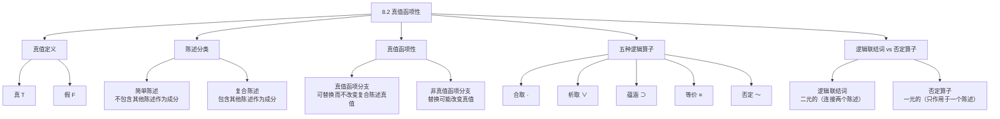

**相关笔记：** [[8.1 现代逻辑及其符号语言]] | [[8.3 合取、否定与析取]]

> [!abstract] 概览
> 本节建立命题逻辑的核心语义基础。首先定义**真值**（Truth Value）为真（T）或假（F），并区分**简单陈述**（Simple Statement）与**复合陈述**（Compound Statement）。核心概念是==真值函项性==（Truth-Functionality）：一个复合陈述的真值完全由其组成部分的真值决定。本节还引入五种基本逻辑算子（合取 $·$、析取 $∨$、蕴涵 $⊃$、等价 $≡$、否定 $\sim$），并区分逻辑联结词（连接两个陈述）与否定算子（只作用于一个陈述）。

## 一、知识结构总览

## 二、核心思想与证明技巧

> [!tip] 核心概念：真值与真值函项性
> **真值（Truth Value）**是命题逻辑中最基本的语义概念。在经典二值逻辑中，每个陈述恰好具有两个可能的真值之一：
> - **真（True, T）**：该陈述所描述的情况与事实相符
> - **假（False, F）**：该陈述所描述的情况与事实不符
>
> **真值函项性（Truth-Functionality）**是命题逻辑的基石。其含义是：
> - 一个复合陈述是==真值函项性的==，当且仅当它的真值==完全由==其组成部分的真值决定
> - 换言之，只要知道了各组成部分的真值，就可以通过逻辑算子的规则==唯一确定==整个复合陈述的真值
>
> 这意味着：如果一个复合陈述的某个分支陈述被另一个具有==相同真值==的陈述替换，整个复合陈述的真值不变。这样的分支称为**真值函项分支**（truth-functional component）。

> [!tip] 五种逻辑算子的分类
> 命题逻辑使用五种基本逻辑算子，可分为两类：
>
> | 类型 | 算子 | 名称 | 符号 | 元数 |
> |:---:|:---:|:---:|:---:|:---:|
> | 逻辑联结词 | $·$ | 合取（Conjunction） | dot | 二元 |
> | 逻辑联结词 | $∨$ | 析取（Disjunction） | wedge | 二元 |
> | 逻辑联结词 | $⊃$ | 蕴涵（Implication） | horseshoe | 二元 |
> | 逻辑联结词 | $≡$ | 等价（Equivalence） | triple bar | 二元 |
> | 否定算子 | $\sim$ | 否定（Negation） | tilde | 一元 |
>
> 关键区分：逻辑联结词是==二元算子==，需要连接两个陈述；否定算子是==一元算子==，只作用于紧邻的一个陈述。

## 三、补充理解与易混淆点

### 补充理解

> [!info] Wittgenstein 论真值函项性
> **来源：** Wittgenstein, L. (1921). *Tractatus Logico-Philosophicus*, Prop 5.
>
> Ludwig Wittgenstein 在《逻辑哲学论》命题 5 中提出了一个深刻的论断："每个命题都是对其基本命题的真值函项。"（*Jeder Satz ist eine Wahrheitsfunktion der Elementarsätze.*）这一论断被称为==真值函项论题==（Truth-Functionality Thesis），它断言所有有意义的命题都可以被分析为基本命题通过真值函项算子的组合。Wittgenstein 进一步在命题 5 中指出，命题的一般形式是 $\overline{p}, \overline{\xi}[\overline{\xi}, N(\overline{\xi})]$，即所有命题都可以通过连续应用否定运算 $N$ 从基本命题中构造出来。这一观点深刻影响了逻辑实证主义和后来的分析哲学发展，尽管它也面临挑战——例如模态陈述（如"必然 $p$"）是否可以还原为真值函项。

> [!info] Post 的多值逻辑
> **来源：** Post, E. (1921). "Introduction to a General Theory of Elementary Propositions".
>
> Emil Post 在 1921 年的论文中独立于 Jan Lukasiewicz 提出了==多值逻辑==（Many-Valued Logic）的系统理论。Post 证明了，如果放弃经典逻辑的"每个命题恰好为真或假"这一二值假设，而允许命题取 $m$ 个不同的真值（$m \geq 2$），那么可以构造出完全自洽的逻辑系统。在 Post 的 $m$ 值逻辑中，否定算子被重新定义为真值的"循环旋转"：如果真值为 $0, 1, 2, \ldots, m-1$，则 $\sim x = (x + 1) \mod m$。Post 的工作表明，==真值函项性本身并不依赖于二值假设==，这一洞见为模糊逻辑、直觉主义逻辑等非经典逻辑的发展奠定了基础。

### 易混淆点

> [!warning] 误区："简单陈述就是短陈述"
> ❌ **错误理解：** 简单陈述就是字数少、句子短的陈述；复合陈述就是长句子。
>
> ✅ **正确理解：** 简单陈述与复合陈述的区分标准是==逻辑结构==，而非句子长度。简单陈述是不包含任何其他陈述作为其组成部分的陈述；复合陈述则至少包含一个其他陈述作为其组成部分。
>
> **辨析：** "地球绕太阳运行"是一个简单陈述，虽然它描述的是一个复杂的天文事实，但它在逻辑上不包含任何子陈述。"如果天下雨，那么地会湿"是一个复合陈述，虽然句子很短，但它包含两个子陈述"天下雨"和"地会湿"。判断标准是：能否将该陈述分解为更小的完整陈述的组合。

> [!warning] 误区："真值函项就是数学中的函数"
> ❌ **错误理解：** 真值函项就是微积分或代数中研究的函数，需要用公式 $f(x)$ 来表示。
>
> ✅ **正确理解：** 真值函项是一种==特殊的逻辑映射==：它将一组真值（T 或 F）映射为唯一一个真值。它确实是"函数"的一种，但其定义域和值域都是==真值集合 $\{T, F\}$==，而非实数集。
>
> **辨析：** 真值函项与数学函数的共性是：给定输入值，输出值唯一确定。但真值函项的特殊之处在于：(1) 它的输入和输出都是真值（T/F），不是任意数值；(2) 它描述的是==复合陈述与其组成部分之间的真值依赖关系==，而非数量关系。每个真值函项都可以用真值表完全刻画。

## 四、习题精选

> [!todo] 习题概览
>
> | 题号 | 来源 | 核心考点 | 难度 |
> |:---:|:---:|:---:|:---:|
> | 1 | Copi §8.2 | 区分简单陈述与复合陈述 | ⭐ |
> | 2 | Copi §8.2 | 真值函项性的理解与应用 | ⭐⭐ |
> | 3 | Copi §8.2 | 逻辑联结词与否定算子的区分 | ⭐ |

### 题1：简单陈述与复合陈述的区分

> [!problem] 题目
> 判断以下陈述是简单陈述还是复合陈述，并说明理由：
> (a) 北京是中国的首都。
> (b) 如果温度降到零度以下，水就会结冰。
> (c) 并非所有学生都通过了考试。

> [!faq]- 解答
>
> (a) **简单陈述。** "北京是中国的首都"不包含任何其他陈述作为其组成部分。它是一个单一的断言，无法分解为更小的完整陈述。
>
> (b) **复合陈述。** "如果温度降到零度以下，水就会结冰"包含两个子陈述："温度降到零度以下"（前件）和"水就会结冰"（后件），通过"如果-那么"这一逻辑联结词组合而成。
>
> (c) **复合陈述。** "并非所有学生都通过了考试"包含子陈述"所有学生都通过了考试"，并通过否定算子"并非"对其进行否定。虽然它看起来像一个简单句，但在逻辑结构上，它是否定作用于一个简单陈述的结果。
>
> $\blacksquare$

> [!tip] 解题思路提示
> 1. 对每个陈述，尝试找出其中是否包含可以独立成句的子陈述
> 2. 注意否定词"并非"、"不"等可能将简单陈述变为复合陈述
> 3. 区分逻辑结构与语法结构——复合陈述不一定在语法上有明显的连接词

### 题2：真值函项性

> [!problem] 题目
> 设复合陈述 $S$ 为"如果天下雨，那么比赛取消"。已知 $S$ 为真，且"天下雨"为真。请问"比赛取消"是否必然为真？请利用真值函项性的概念解释。

> [!faq]- 解答
>
> **是的，"比赛取消"必然为真。**
>
> 令 $p$ = "天下雨"，$q$ = "比赛取消"。则 $S$ 可以符号化为 $p ⊃ q$。
>
> 根据真值函项性，$p ⊃ q$ 的真值完全由 $p$ 和 $q$ 的真值决定。查看蕴涵算子的真值表：
>
> | $p$ | $q$ | $p ⊃ q$ |
> |:---:|:---:|:---:|
> | T | T | **T** |
> | T | F | **F** |
> | F | T | T |
> | F | F | T |
>
> 已知 $p ⊃ q = T$ 且 $p = T$。在真值表中，当 $p = T$ 时，$p ⊃ q = T$ 仅在 $q = T$ 时成立。因此，$q$ 必然为真。
>
> 这正是真值函项性的力量：一旦知道了组成部分的真值和逻辑算子的规则，复合陈述的真值就被==唯一确定==。
>
> $\blacksquare$

> [!tip] 解题思路提示
> 1. 将自然语言陈述符号化
> 2. 列出相关逻辑算子的真值表
> 3. 根据已知条件在真值表中定位
> 4. 利用真值函项性得出唯一结论

### 题3：逻辑联结词与否定算子

> [!problem] 题目
> 请说明为什么否定算子 $\sim$ 被称为"一元算子"，而合取 $·$ 被称为"二元算子"。这对符号表达式的书写有什么影响？

> [!faq]- 解答
>
> **否定算子 $\sim$ 是一元算子：**
> 否定算子只需要==一个==陈述作为其作用对象。例如，$\sim p$ 表示"并非 $p$"，其中 $\sim$ 只作用于 $p$ 这一个陈述。否定算子的输出是输入陈述的真值反转。
>
> **合取 $·$ 是二元算子：**
> 合取需要==两个==陈述作为其作用对象。例如，$p · q$ 表示"$p$ 并且 $q$"，其中 $·$ 连接了 $p$ 和 $q$ 两个陈述。合取的输出是两个输入陈述真值的"与"运算。
>
> **对符号书写的影响：**
> 1. 否定算子 $\sim$ 直接写在被否定陈述的前面，不需要括号：$\sim p$、$\sim(p · q)$
> 2. 二元算子必须写在两个陈述之间：$p · q$、$p ∨ q$、$p ⊃ q$、$p ≡ q$
> 3. 当否定作用于复合陈述时，需要用括号明确作用范围：$\sim(p · q)$ 表示否定整个合取，而 $\sim p · q$ 表示否定 $p$ 后再与 $q$ 合取（即 $(\sim p) · q$）
>
> $\blacksquare$

> [!tip] 解题思路提示
> 1. 从"元数"（arity）的角度解释一元与二元的区别
> 2. 分别给出每种算子的符号表达式示例
> 3. 重点说明括号在区分否定作用范围中的关键作用

## 五、视频学习指南

> [!info] 视频资源
>
> | 资源名称 | 讲者/来源 | 主题 | 时长 |
> |:---|:---|:---|:---:|
> | *Truth Values and Truth Functionality* | Khan Academy | 真值与真值函项基础 | ~12 min |
> | *Simple vs. Compound Statements* | Philosophy Tube | 简单陈述与复合陈述的区分 | ~8 min |
> | *Logical Operators Overview* | Graham Priest (lecture) | 五种逻辑算子概述 | ~30 min |

## 六、教材原文

> [!quote]
> "A compound statement is truth-functional if and only if its truth value is determined completely by the truth values of its component statements. In such cases, any component statement may be replaced by another statement having the same truth value without altering the truth value of the compound statement as a whole."
>
> —— Copi, *Introduction to Logic*, 15th ed., §8.2

## 参见 Wiki

- [[假言三段论]]
- [[有效性]]
- [[真值函项性]]：真值函项性的完整概念页

#学习/逻辑学/命题逻辑Ⅰ
